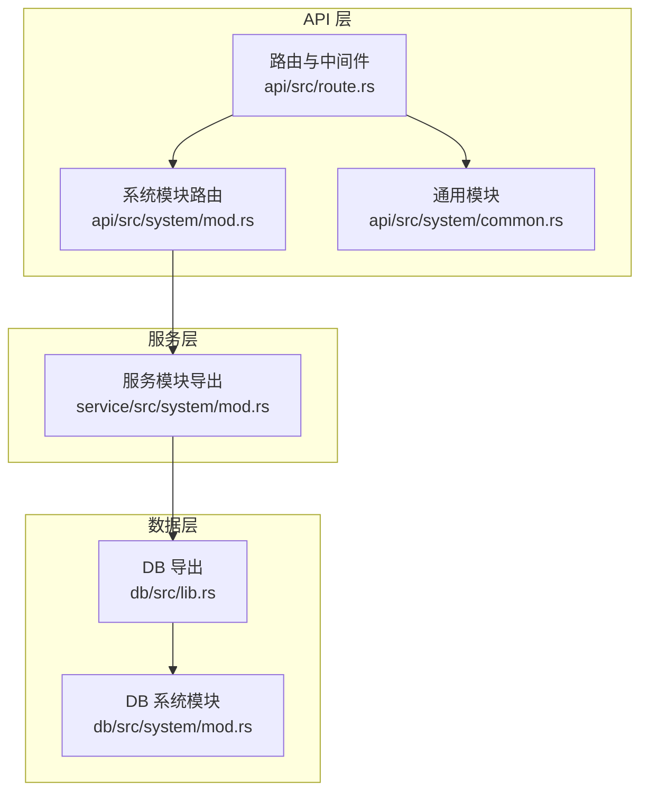
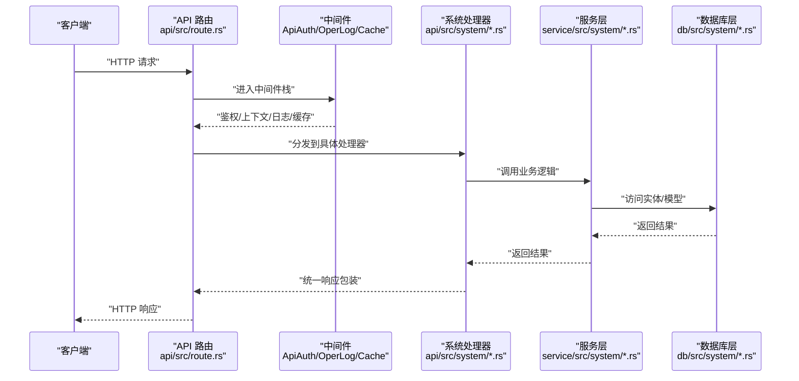
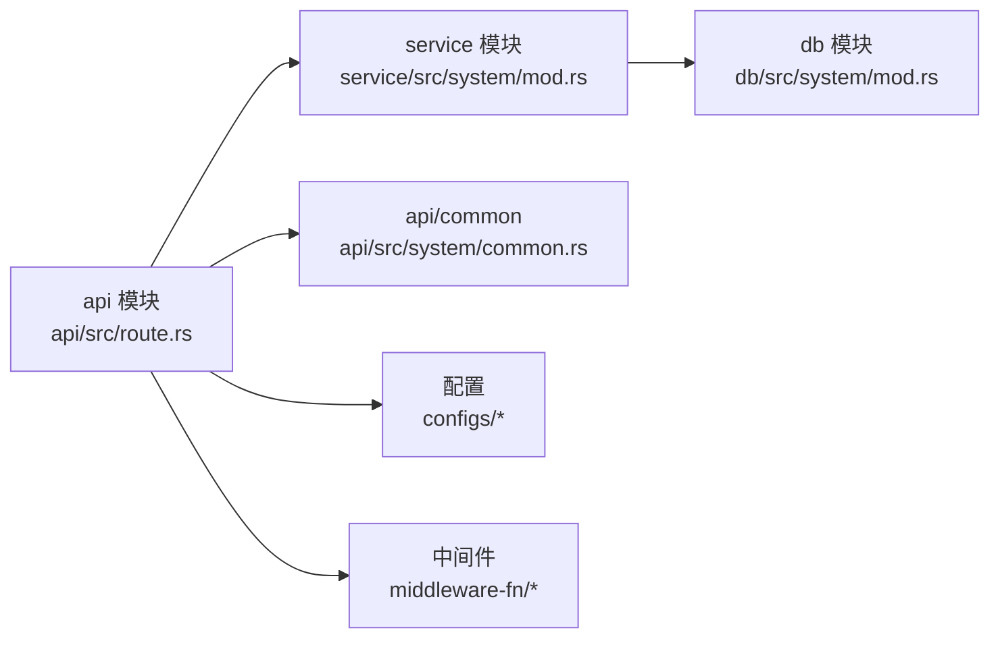

# API 参考

<cite>
**本文引用的文件**
- [api/src/lib.rs](file://api/src/lib.rs)
- [api/src/route.rs](file://api/src/route.rs)
- [api/src/system/mod.rs](file://api/src/system/mod.rs)
- [api/src/system/common.rs](file://api/src/system/common.rs)
- [api/src/system/sys_user.rs](file://api/src/system/sys_user.rs)
- [api/src/system/sys_role.rs](file://api/src/system/sys_role.rs)
- [api/src/system/sys_menu.rs](file://api/src/system/sys_menu.rs)
- [api/src/system/sys_dept.rs](file://api/src/system/sys_dept.rs)
- [service/src/lib.rs](file://service/src/lib.rs)
- [service/src/system/mod.rs](file://service/src/system/mod.rs)
- [db/src/lib.rs](file://db/src/lib.rs)
- [db/src/system/mod.rs](file://db/src/system/mod.rs)
- [api/Cargo.toml](file://api/Cargo.toml)
</cite>

## 目录
1. [简介](#简介)
2. [项目结构](#项目结构)
3. [核心组件](#核心组件)
4. [架构总览](#架构总览)
5. [详细组件分析](#详细组件分析)
6. [依赖关系分析](#依赖关系分析)
7. [性能与可扩展性](#性能与可扩展性)
8. [故障排查指南](#故障排查指南)
9. [结论](#结论)
10. [附录：接口清单与规范](#附录接口清单与规范)

## 简介
Axum Admin 是一个基于 Rust 的后端管理系统，采用 Axum Web 框架构建，提供 RESTful API，覆盖用户管理、角色权限、菜单管理、字典、岗位、部门、定时任务、日志与系统监控等模块。本文档面向开发者，系统梳理所有公开 API 的 URL、HTTP 方法、请求参数、响应格式、错误处理、认证与权限要求，并给出典型使用场景与排障建议。

## 项目结构
- API 层负责路由注册与中间件装配，按模块组织（如 /system、/comm、/test）。
- Service 层封装业务逻辑，调用数据库层模型与实体。
- DB 层提供实体与模型，统一导出数据库连接与上下文。
- 中间件层提供鉴权、上下文注入、操作日志与缓存等横切能力。

图表来源
- [api/src/route.rs](file://api/src/route.rs#L12-L22)
- [api/src/system/mod.rs](file://api/src/system/mod.rs#L26-L44)
- [service/src/system/mod.rs](file://service/src/system/mod.rs#L1-L43)
- [db/src/lib.rs](file://db/src/lib.rs#L6-L8)

章节来源
- [api/src/lib.rs](file://api/src/lib.rs#L1-L10)
- [api/src/route.rs](file://api/src/route.rs#L12-L22)
- [api/src/system/mod.rs](file://api/src/system/mod.rs#L26-L44)
- [service/src/lib.rs](file://service/src/lib.rs#L1-L7)
- [db/src/lib.rs](file://db/src/lib.rs#L6-L8)

## 核心组件
- 路由与中间件
  - 通用模块（无需鉴权）：登录、验证码、退出登录。
  - 系统模块（需鉴权）：用户、角色、菜单、部门、字典、岗位、定时任务、日志、监控等。
  - 测试模块（可选）：带操作日志与鉴权中间件。
- 中间件
  - ApiAuth：鉴权校验。
  - Ctx：上下文注入。
  - OperLog：可配置的操作日志记录。
  - Cache/SkyTableCache：可配置的缓存策略。
- 统一响应
  - 所有接口返回统一包装结构，包含状态码、消息与数据体，便于前端一致处理。

章节来源
- [api/src/route.rs](file://api/src/route.rs#L12-L22)
- [api/src/route.rs](file://api/src/route.rs#L24-L30)
- [api/src/route.rs](file://api/src/route.rs#L32-L54)
- [api/src/route.rs](file://api/src/route.rs#L56-L69)

## 架构总览
下图展示从客户端到服务层与数据库层的整体调用链，以及中间件在其中的作用。

图表来源
- [api/src/route.rs](file://api/src/route.rs#L12-L22)
- [api/src/system/mod.rs](file://api/src/system/mod.rs#L26-L44)
- [service/src/system/mod.rs](file://service/src/system/mod.rs#L1-L43)
- [db/src/system/mod.rs](file://db/src/system/mod.rs#L1-L13)

## 详细组件分析

### 通用模块（无需鉴权）
- 获取验证码
  - 方法与路径：GET /comm/get_captcha
  - 认证：无需
  - 响应：验证码图片数据
  - 错误：参数或生成异常时返回统一错误结构
- 用户登录
  - 方法与路径：POST /comm/login
  - 认证：无需
  - 请求头：携带必要头部（如设备信息等，详见实现）
  - 请求体：用户名、密码、验证码等
  - 响应：令牌与用户信息
  - 错误：账号不存在、密码错误、验证码不正确等
- 退出登录
  - 方法与路径：POST /comm/log_out
  - 认证：无需
  - 响应：操作成功提示
  - 错误：注销失败或会话无效

章节来源
- [api/src/route.rs](file://api/src/route.rs#L24-L30)
- [api/src/system/common.rs](file://api/src/system/common.rs#L12-L15)
- [api/src/system/sys_user.rs](file://api/src/system/sys_user.rs#L96-L104)
- [api/src/system/sys_user.rs](file://api/src/system/sys_user.rs#L164-L172)

### 用户管理（系统模块）
- 获取用户列表
  - 方法与路径：GET /system/user/list
  - 认证：需要
  - 查询参数：分页参数、筛选条件
  - 响应：分页列表（含部门信息）
- 按 ID 获取用户
  - 方法与路径：GET /system/user/get_by_id
  - 认证：需要
  - 查询参数：用户ID
  - 响应：用户信息
- 获取当前用户资料
  - 方法与路径：GET /system/user/get_profile
  - 认证：需要
  - 响应：当前用户信息
- 更新当前用户资料
  - 方法与路径：PUT /system/user/update_profile
  - 认证：需要
  - 请求体：更新字段
  - 响应：操作结果
- 新增用户
  - 方法与路径：POST /system/user/add
  - 认证：需要
  - 请求体：新增用户信息
  - 响应：操作结果
- 编辑用户
  - 方法与路径：PUT /system/user/edit
  - 认证：需要
  - 请求体：编辑信息
  - 响应：操作结果
- 删除用户
  - 方法与路径：DELETE /system/user/delete
  - 认证：需要
  - 请求体：删除参数
  - 响应：操作结果
- 获取用户信息（含权限）
  - 方法与路径：GET /system/user/get_info
  - 认证：需要
  - 响应：用户、角色、部门、权限集合
- 重置密码
  - 方法与路径：PUT /system/user/reset_passwd
  - 认证：需要
  - 请求体：重置参数
  - 响应：操作结果
- 更新密码
  - 方法与路径：PUT /system/user/update_passwd
  - 认证：需要
  - 请求体：更新密码参数
  - 响应：操作结果
- 修改状态
  - 方法与路径：PUT /system/user/change_status
  - 认证：需要
  - 请求体：状态变更参数
  - 响应：操作结果
- 切换角色
  - 方法与路径：PUT /system/user/change_role
  - 认证：需要
  - 请求体：角色切换参数
  - 响应：操作结果
- 切换部门
  - 方法与路径：PUT /system/user/change_dept
  - 认证：需要
  - 请求体：部门切换参数
  - 响应：操作结果
- 刷新 Token
  - 方法与路径：PUT /system/user/fresh_token
  - 认证：需要
  - 响应：新令牌
- 更新头像
  - 方法与路径：POST /system/user/update_avatar
  - 认证：需要
  - 请求体：multipart 表单（文件）
  - 响应：文件路径与操作结果

章节来源
- [api/src/system/mod.rs](file://api/src/system/mod.rs#L46-L63)
- [api/src/system/sys_user.rs](file://api/src/system/sys_user.rs#L24-L31)
- [api/src/system/sys_user.rs](file://api/src/system/sys_user.rs#L35-L44)
- [api/src/system/sys_user.rs](file://api/src/system/sys_user.rs#L46-L52)
- [api/src/system/sys_user.rs](file://api/src/system/sys_user.rs#L87-L94)
- [api/src/system/sys_user.rs](file://api/src/system/sys_user.rs#L107-L132)
- [api/src/system/sys_user.rs](file://api/src/system/sys_user.rs#L136-L143)
- [api/src/system/sys_user.rs](file://api/src/system/sys_user.rs#L145-L152)
- [api/src/system/sys_user.rs](file://api/src/system/sys_user.rs#L156-L163)
- [api/src/system/sys_user.rs](file://api/src/system/sys_user.rs#L166-L172)
- [api/src/system/sys_user.rs](file://api/src/system/sys_user.rs#L174-L181)
- [api/src/system/sys_user.rs](file://api/src/system/sys_user.rs#L183-L190)
- [api/src/system/sys_user.rs](file://api/src/system/sys_user.rs#L192-L200)

### 角色管理（系统模块）
- 获取角色列表
  - 方法与路径：GET /system/role/list
  - 认证：需要
  - 查询参数：分页与筛选
  - 响应：分页列表
- 获取全部角色
  - 方法与路径：GET /system/role/get_all
  - 认证：需要
  - 响应：全部角色
- 按 ID 获取角色
  - 方法与路径：GET /system/role/get_by_id
  - 认证：需要
  - 查询参数：角色ID
  - 响应：角色详情
- 新增角色
  - 方法与路径：POST /system/role/add
  - 认证：需要
  - 请求体：新增角色信息
  - 响应：操作结果
- 编辑角色
  - 方法与路径：PUT /system/role/edit
  - 认证：需要
  - 请求体：编辑信息
  - 响应：操作结果
- 设置状态
  - 方法与路径：PUT /system/role/change_status
  - 认证：需要
  - 请求体：状态变更
  - 响应：操作结果
- 设置数据权限范围
  - 方法与路径：PUT /system/role/set_data_scope
  - 认证：需要
  - 请求体：数据范围参数
  - 响应：操作结果
- 删除角色
  - 方法与路径：DELETE /system/role/delete
  - 认证：需要
  - 请求体：删除参数
  - 响应：操作结果
- 获取角色授权菜单
  - 方法与路径：GET /system/role/get_role_menu
  - 认证：需要
  - 查询参数：角色ID
  - 响应：菜单ID数组
- 获取角色授权部门
  - 方法与路径：GET /system/role/get_role_dept
  - 认证：需要
  - 查询参数：角色ID
  - 响应：部门ID数组

章节来源
- [api/src/system/mod.rs](file://api/src/system/mod.rs#L109-L127)
- [api/src/system/sys_role.rs](file://api/src/system/sys_role.rs#L16-L23)
- [api/src/system/sys_role.rs](file://api/src/system/sys_role.rs#L92-L99)
- [api/src/system/sys_role.rs](file://api/src/system/sys_role.rs#L103-L115)
- [api/src/system/sys_role.rs](file://api/src/system/sys_role.rs#L119-L131)

### 菜单管理（系统模块）
- 获取菜单列表
  - 方法与路径：GET /system/menu/list
  - 认证：需要
  - 查询参数：分页与筛选
  - 响应：分页列表
- 按 ID 获取菜单
  - 方法与路径：GET /system/menu/get_by_id
  - 认证：需要
  - 查询参数：菜单ID
  - 响应：菜单详情
- 新增菜单
  - 方法与路径：POST /system/menu/add
  - 认证：需要
  - 请求体：新增菜单信息
  - 响应：操作结果
- 编辑菜单
  - 方法与路径：PUT /system/menu/edit
  - 认证：需要
  - 请求体：编辑信息
  - 响应：操作结果
- 更新日志与缓存策略
  - 方法与路径：PUT /system/menu/update_log_cache_method
  - 认证：需要
  - 请求体：日志与缓存策略参数
  - 响应：操作结果
- 删除菜单
  - 方法与路径：DELETE /system/menu/delete
  - 认证：需要
  - 请求体：删除参数
  - 响应：操作结果
- 获取全部启用的菜单树
  - 方法与路径：GET /system/menu/get_all_enabled_menu_tree
  - 认证：需要
  - 查询参数：分页与筛选
  - 响应：菜单树
- 获取用户路由树
  - 方法与路径：GET /system/menu/get_routers
  - 认证：需要
  - 响应：用户路由树
- 获取菜单关联的 API 与数据库
  - 方法与路径：GET /system/menu/get_auth_list
  - 认证：需要
  - 查询参数：分页与筛选
  - 响应：关联列表

章节来源
- [api/src/system/mod.rs](file://api/src/system/mod.rs#L129-L141)
- [api/src/system/sys_menu.rs](file://api/src/system/sys_menu.rs#L16-L23)
- [api/src/system/sys_menu.rs](file://api/src/system/sys_menu.rs#L28-L35)
- [api/src/system/sys_menu.rs](file://api/src/system/sys_menu.rs#L39-L46)
- [api/src/system/sys_menu.rs](file://api/src/system/sys_menu.rs#L61-L68)
- [api/src/system/sys_menu.rs](file://api/src/system/sys_menu.rs#L70-L77)
- [api/src/system/sys_menu.rs](file://api/src/system/sys_menu.rs#L50-L57)
- [api/src/system/sys_menu.rs](file://api/src/system/sys_menu.rs#L81-L88)
- [api/src/system/sys_menu.rs](file://api/src/system/sys_menu.rs#L101-L119)
- [api/src/system/sys_menu.rs](file://api/src/system/sys_menu.rs#L91-L98)

### 部门管理（系统模块）
- 获取部门列表
  - 方法与路径：GET /system/dept/list
  - 认证：需要
  - 查询参数：分页与筛选
  - 响应：分页列表
- 获取全部部门
  - 方法与路径：GET /system/dept/get_all
  - 认证：需要
  - 响应：全部部门
- 获取部门树
  - 方法与路径：GET /system/dept/get_dept_tree
  - 认证：需要
  - 响应：部门树
- 按 ID 获取部门
  - 方法与路径：GET /system/dept/get_by_id
  - 认证：需要
  - 查询参数：部门ID
  - 响应：部门详情
- 新增部门
  - 方法与路径：POST /system/dept/add
  - 认证：需要
  - 请求体：新增部门信息
  - 响应：操作结果
- 编辑部门
  - 方法与路径：PUT /system/dept/edit
  - 认证：需要
  - 请求体：编辑信息
  - 响应：操作结果
- 删除部门
  - 方法与路径：DELETE /system/dept/delete
  - 认证：需要
  - 请求体：删除参数
  - 响应：操作结果

章节来源
- [api/src/system/mod.rs](file://api/src/system/mod.rs#L98-L107)
- [api/src/system/sys_dept.rs](file://api/src/system/sys_dept.rs#L17-L24)
- [api/src/system/sys_dept.rs](file://api/src/system/sys_dept.rs#L75-L82)
- [api/src/system/sys_dept.rs](file://api/src/system/sys_dept.rs#L84-L91)
- [api/src/system/sys_dept.rs](file://api/src/system/sys_dept.rs#L61-L72)
- [api/src/system/sys_dept.rs](file://api/src/system/sys_dept.rs#L27-L34)
- [api/src/system/sys_dept.rs](file://api/src/system/sys_dept.rs#L49-L56)
- [api/src/system/sys_dept.rs](file://api/src/system/sys_dept.rs#L38-L45)

### 字典类型与数据（系统模块）
- 字典类型
  - GET /system/dict/type/list
  - GET /system/dict/type/get_all
  - GET /system/dict/type/get_by_id
  - POST /system/dict/type/add
  - PUT /system/dict/type/edit
  - DELETE /system/dict/type/delete
- 字典数据
  - GET /system/dict/data/list
  - GET /system/dict/data/get_all
  - GET /system/dict/data/get_by_id
  - GET /system/dict/data/get_by_type
  - POST /system/dict/data/add
  - PUT /system/dict/data/edit
  - DELETE /system/dict/data/delete

章节来源
- [api/src/system/mod.rs](file://api/src/system/mod.rs#L65-L85)

### 岗位管理（系统模块）
- GET /system/post/list
- GET /system/post/get_all
- GET /system/post/get_by_id
- POST /system/post/add
- PUT /system/post/edit
- DELETE /system/post/delete

章节来源
- [api/src/system/mod.rs](file://api/src/system/mod.rs#L87-L96)

### 定时任务与日志（系统模块）
- 定时任务
  - GET /system/job/list
  - GET /system/job/get_by_id
  - PUT /system/job/change_status
  - PUT /system/job/run_task_once
  - POST /system/job/add
  - PUT /system/job/edit
  - DELETE /system/job/delete
  - POST /system/job/validate_cron_str
- 定时任务日志
  - GET /system/job_log/list
  - DELETE /system/job_log/clean
  - DELETE /system/job_log/delete
- 登录日志
  - GET /system/login-log/list
  - DELETE /system/login-log/clean
  - DELETE /system/login-log/delete
- 操作日志
  - GET /system/oper_log/list
  - GET /system/oper_log/get_by_id
  - DELETE /system/oper_log/clean
  - DELETE /system/oper_log/delete
- 在线用户
  - GET /system/online/list
  - DELETE /system/online/delete
- API 与数据库映射
  - GET /system/api_db/get_by_id
  - POST /system/api_db/add
- 系统监控
  - GET /system/monitor/server
  - GET /system/monitor/server-event

章节来源
- [api/src/system/mod.rs](file://api/src/system/mod.rs#L155-L173)
- [api/src/system/mod.rs](file://api/src/system/mod.rs#L174-L180)
- [api/src/system/mod.rs](file://api/src/system/mod.rs#L143-L148)
- [api/src/system/mod.rs](file://api/src/system/mod.rs#L149-L153)
- [api/src/system/mod.rs](file://api/src/system/mod.rs#L181-L185)
- [api/src/system/mod.rs](file://api/src/system/mod.rs#L186-L190)
- [api/src/system/common.rs](file://api/src/system/common.rs#L17-L33)

### 测试模块（可选）
- 测试路由在启用操作日志时自动叠加中间件，鉴权与上下文同样生效。

章节来源
- [api/src/route.rs](file://api/src/route.rs#L56-L69)

## 依赖关系分析
- 模块耦合
  - API 层仅负责路由与中间件，业务逻辑下沉至服务层，降低耦合度。
  - 服务层通过 DB 层实体与模型访问数据，职责清晰。
- 外部依赖
  - Axum、tower-http、serde_json、headers、tokio 等。
- 中间件契约
  - ApiAuth 依赖 JWT Claims 注入；OperLog 依赖配置开关；缓存中间件根据配置选择内存或 SkyTable。

图表来源
- [api/Cargo.toml](file://api/Cargo.toml#L8-L22)
- [api/src/route.rs](file://api/src/route.rs#L1-L10)
- [service/src/lib.rs](file://service/src/lib.rs#L1-L7)
- [db/src/lib.rs](file://db/src/lib.rs#L1-L8)

章节来源
- [api/Cargo.toml](file://api/Cargo.toml#L8-L22)
- [api/src/route.rs](file://api/src/route.rs#L1-L10)
- [service/src/lib.rs](file://service/src/lib.rs#L1-L7)
- [db/src/lib.rs](file://db/src/lib.rs#L1-L8)

## 性能与可扩展性
- 缓存策略
  - 支持内存缓存与 SkyTable 缓存两种方式，可通过配置切换与禁用。
- 操作日志
  - 可按配置开启/关闭，避免对高频接口造成额外开销。
- SSE 监控
  - 服务器信息以 SSE 推送，节流间隔可配置，适合前端实时展示。

章节来源
- [api/src/route.rs](file://api/src/route.rs#L32-L54)
- [api/src/system/common.rs](file://api/src/system/common.rs#L24-L33)

## 故障排查指南
- 统一响应结构
  - 所有接口均返回统一包装结构，包含状态码、消息与数据体。若出现异常，优先检查响应中的错误消息。
- 鉴权失败
  - 确认请求头中携带有效令牌；检查中间件是否正确注入 Claims。
- 参数校验
  - 查询参数与请求体均进行参数校验，缺失或非法参数将返回明确错误。
- 日志定位
  - 启用操作日志后，可在操作日志模块查看详细记录，辅助定位问题。

章节来源
- [api/src/system/sys_user.rs](file://api/src/system/sys_user.rs#L24-L31)
- [api/src/system/sys_role.rs](file://api/src/system/sys_role.rs#L16-L23)
- [api/src/system/sys_menu.rs](file://api/src/system/sys_menu.rs#L16-L23)
- [api/src/system/sys_dept.rs](file://api/src/system/sys_dept.rs#L17-L24)

## 结论
Axum Admin 的 API 设计遵循 RESTful 规范，模块划分清晰，中间件体系完善，具备良好的可维护性与扩展性。开发者可依据本文档快速理解各模块接口与使用方式，并结合中间件与配置实现安全、可观测与高性能的系统。

## 附录：接口清单与规范

### 通用模块
- GET /comm/get_captcha
  - 认证：否
  - 响应：验证码图片
- POST /comm/login
  - 认证：否
  - 请求体：登录凭据
  - 响应：令牌与用户信息
- POST /comm/log_out
  - 认证：否
  - 响应：操作结果

章节来源
- [api/src/route.rs](file://api/src/route.rs#L24-L30)
- [api/src/system/common.rs](file://api/src/system/common.rs#L12-L15)
- [api/src/system/sys_user.rs](file://api/src/system/sys_user.rs#L96-L104)
- [api/src/system/sys_user.rs](file://api/src/system/sys_user.rs#L164-L172)

### 用户管理
- GET /system/user/list
- GET /system/user/get_by_id
- GET /system/user/get_profile
- PUT /system/user/update_profile
- POST /system/user/add
- PUT /system/user/edit
- DELETE /system/user/delete
- GET /system/user/get_info
- PUT /system/user/reset_passwd
- PUT /system/user/update_passwd
- PUT /system/user/change_status
- PUT /system/user/change_role
- PUT /system/user/change_dept
- PUT /system/user/fresh_token
- POST /system/user/update_avatar

章节来源
- [api/src/system/mod.rs](file://api/src/system/mod.rs#L46-L63)
- [api/src/system/sys_user.rs](file://api/src/system/sys_user.rs#L24-L31)
- [api/src/system/sys_user.rs](file://api/src/system/sys_user.rs#L35-L44)
- [api/src/system/sys_user.rs](file://api/src/system/sys_user.rs#L46-L52)
- [api/src/system/sys_user.rs](file://api/src/system/sys_user.rs#L87-L94)
- [api/src/system/sys_user.rs](file://api/src/system/sys_user.rs#L107-L132)
- [api/src/system/sys_user.rs](file://api/src/system/sys_user.rs#L136-L143)
- [api/src/system/sys_user.rs](file://api/src/system/sys_user.rs#L145-L152)
- [api/src/system/sys_user.rs](file://api/src/system/sys_user.rs#L156-L163)
- [api/src/system/sys_user.rs](file://api/src/system/sys_user.rs#L166-L172)
- [api/src/system/sys_user.rs](file://api/src/system/sys_user.rs#L174-L181)
- [api/src/system/sys_user.rs](file://api/src/system/sys_user.rs#L183-L190)
- [api/src/system/sys_user.rs](file://api/src/system/sys_user.rs#L192-L200)

### 角色管理
- GET /system/role/list
- GET /system/role/get_all
- GET /system/role/get_by_id
- POST /system/role/add
- PUT /system/role/edit
- PUT /system/role/change_status
- PUT /system/role/set_data_scope
- DELETE /system/role/delete
- GET /system/role/get_role_menu
- GET /system/role/get_role_dept

章节来源
- [api/src/system/mod.rs](file://api/src/system/mod.rs#L109-L127)
- [api/src/system/sys_role.rs](file://api/src/system/sys_role.rs#L16-L23)
- [api/src/system/sys_role.rs](file://api/src/system/sys_role.rs#L92-L99)
- [api/src/system/sys_role.rs](file://api/src/system/sys_role.rs#L103-L115)
- [api/src/system/sys_role.rs](file://api/src/system/sys_role.rs#L119-L131)

### 菜单管理
- GET /system/menu/list
- GET /system/menu/get_by_id
- POST /system/menu/add
- PUT /system/menu/edit
- PUT /system/menu/update_log_cache_method
- DELETE /system/menu/delete
- GET /system/menu/get_all_enabled_menu_tree
- GET /system/menu/get_routers
- GET /system/menu/get_auth_list

章节来源
- [api/src/system/mod.rs](file://api/src/system/mod.rs#L129-L141)
- [api/src/system/sys_menu.rs](file://api/src/system/sys_menu.rs#L16-L23)
- [api/src/system/sys_menu.rs](file://api/src/system/sys_menu.rs#L28-L35)
- [api/src/system/sys_menu.rs](file://api/src/system/sys_menu.rs#L39-L46)
- [api/src/system/sys_menu.rs](file://api/src/system/sys_menu.rs#L61-L68)
- [api/src/system/sys_menu.rs](file://api/src/system/sys_menu.rs#L70-L77)
- [api/src/system/sys_menu.rs](file://api/src/system/sys_menu.rs#L50-L57)
- [api/src/system/sys_menu.rs](file://api/src/system/sys_menu.rs#L81-L88)
- [api/src/system/sys_menu.rs](file://api/src/system/sys_menu.rs#L101-L119)
- [api/src/system/sys_menu.rs](file://api/src/system/sys_menu.rs#L91-L98)

### 部门管理
- GET /system/dept/list
- GET /system/dept/get_all
- GET /system/dept/get_dept_tree
- GET /system/dept/get_by_id
- POST /system/dept/add
- PUT /system/dept/edit
- DELETE /system/dept/delete

章节来源
- [api/src/system/mod.rs](file://api/src/system/mod.rs#L98-L107)
- [api/src/system/sys_dept.rs](file://api/src/system/sys_dept.rs#L17-L24)
- [api/src/system/sys_dept.rs](file://api/src/system/sys_dept.rs#L75-L82)
- [api/src/system/sys_dept.rs](file://api/src/system/sys_dept.rs#L84-L91)
- [api/src/system/sys_dept.rs](file://api/src/system/sys_dept.rs#L61-L72)
- [api/src/system/sys_dept.rs](file://api/src/system/sys_dept.rs#L27-L34)
- [api/src/system/sys_dept.rs](file://api/src/system/sys_dept.rs#L49-L56)
- [api/src/system/sys_dept.rs](file://api/src/system/sys_dept.rs#L38-L45)

### 字典与岗位
- 字典类型
  - GET /system/dict/type/list
  - GET /system/dict/type/get_all
  - GET /system/dict/type/get_by_id
  - POST /system/dict/type/add
  - PUT /system/dict/type/edit
  - DELETE /system/dict/type/delete
- 字典数据
  - GET /system/dict/data/list
  - GET /system/dict/data/get_all
  - GET /system/dict/data/get_by_id
  - GET /system/dict/data/get_by_type
  - POST /system/dict/data/add
  - PUT /system/dict/data/edit
  - DELETE /system/dict/data/delete
- 岗位
  - GET /system/post/list
  - GET /system/post/get_all
  - GET /system/post/get_by_id
  - POST /system/post/add
  - PUT /system/post/edit
  - DELETE /system/post/delete

章节来源
- [api/src/system/mod.rs](file://api/src/system/mod.rs#L65-L85)
- [api/src/system/mod.rs](file://api/src/system/mod.rs#L87-L96)

### 定时任务与日志
- 定时任务
  - GET /system/job/list
  - GET /system/job/get_by_id
  - PUT /system/job/change_status
  - PUT /system/job/run_task_once
  - POST /system/job/add
  - PUT /system/job/edit
  - DELETE /system/job/delete
  - POST /system/job/validate_cron_str
- 定时任务日志
  - GET /system/job_log/list
  - DELETE /system/job_log/clean
  - DELETE /system/job_log/delete
- 登录日志
  - GET /system/login-log/list
  - DELETE /system/login-log/clean
  - DELETE /system/login-log/delete
- 操作日志
  - GET /system/oper_log/list
  - GET /system/oper_log/get_by_id
  - DELETE /system/oper_log/clean
  - DELETE /system/oper_log/delete
- 在线用户
  - GET /system/online/list
  - DELETE /system/online/delete
- API 与数据库映射
  - GET /system/api_db/get_by_id
  - POST /system/api_db/add
- 系统监控
  - GET /system/monitor/server
  - GET /system/monitor/server-event

章节来源
- [api/src/system/mod.rs](file://api/src/system/mod.rs#L155-L173)
- [api/src/system/mod.rs](file://api/src/system/mod.rs#L174-L180)
- [api/src/system/mod.rs](file://api/src/system/mod.rs#L143-L148)
- [api/src/system/mod.rs](file://api/src/system/mod.rs#L149-L153)
- [api/src/system/mod.rs](file://api/src/system/mod.rs#L181-L185)
- [api/src/system/mod.rs](file://api/src/system/mod.rs#L186-L190)
- [api/src/system/common.rs](file://api/src/system/common.rs#L17-L33)