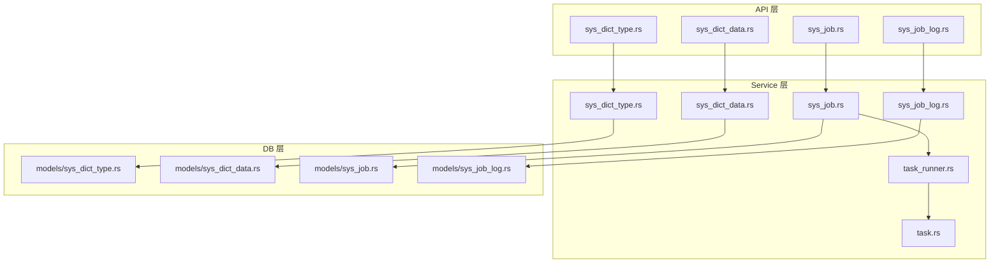
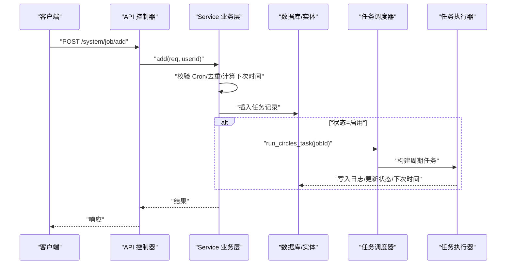
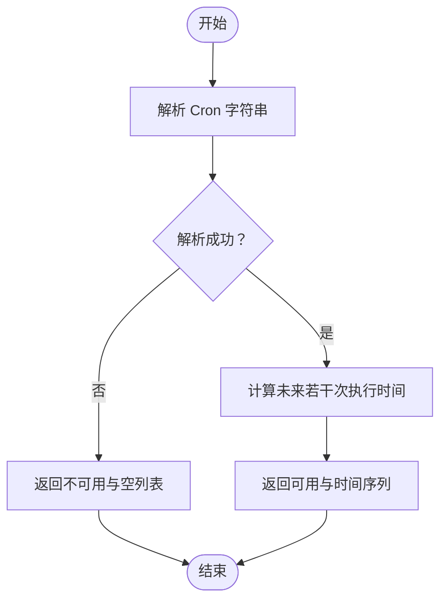
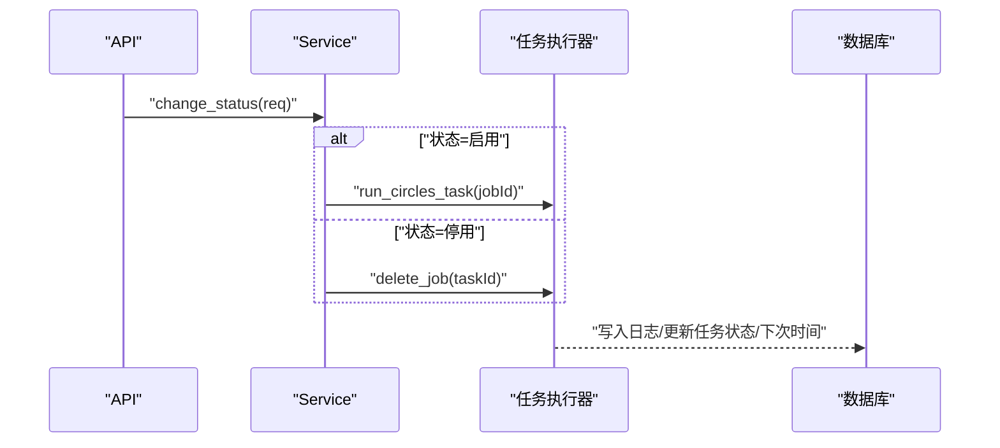
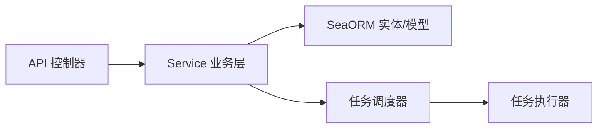

# 数据字典与任务接口

<cite>
**本文引用的文件**
- [api/src/system/sys_dict_type.rs](file://api/src/system/sys_dict_type.rs)
- [api/src/system/sys_dict_data.rs](file://api/src/system/sys_dict_data.rs)
- [api/src/system/sys_job.rs](file://api/src/system/sys_job.rs)
- [api/src/system/sys_job_log.rs](file://api/src/system/sys_job_log.rs)
- [service/src/system/sys_dict_type.rs](file://service/src/system/sys_dict_type.rs)
- [service/src/system/sys_dict_data.rs](file://service/src/system/sys_dict_data.rs)
- [service/src/system/sys_job.rs](file://service/src/system/sys_job.rs)
- [service/src/system/sys_job_log.rs](file://service/src/system/sys_job_log.rs)
- [service/src/tasks/task_runner.rs](file://service/src/tasks/task_runner.rs)
- [service/src/tasks/task.rs](file://service/src/tasks/task.rs)
- [db/src/system/models/sys_dict_type.rs](file://db/src/system/models/sys_dict_type.rs)
- [db/src/system/models/sys_dict_data.rs](file://db/src/system/models/sys_dict_data.rs)
- [db/src/system/models/sys_job.rs](file://db/src/system/models/sys_job.rs)
- [db/src/system/models/sys_job_log.rs](file://db/src/system/models/sys_job_log.rs)
- [api/src/route.rs](file://api/src/route.rs)
</cite>

## 目录
1. [简介](#简介)
2. [项目结构](#项目结构)
3. [核心组件](#核心组件)
4. [架构总览](#架构总览)
5. [详细组件分析](#详细组件分析)
6. [依赖关系分析](#依赖关系分析)
7. [性能考量](#性能考量)
8. [故障排查指南](#故障排查指南)
9. [结论](#结论)
10. [附录](#附录)

## 简介
本文件面向 Axum Admin 项目的“数据字典”与“定时任务”两大功能域，提供完整的 API 规范与实现说明。内容覆盖：
- 数据字典：类型管理（增删改查、启用/停用）、数据维护（增删改查、按类型查询）、数据查询（分页、筛选）。
- 定时任务：任务创建与编辑（含 Cron 校验）、任务状态切换、一次性执行、任务日志查询与清理。

同时，文档解释了 Cron 表达式解析、任务调度机制、任务状态管理与日志落盘流程，并给出常见使用场景与实践建议。

## 项目结构
围绕数据字典与定时任务，系统采用典型的三层结构：
- API 层：负责路由注册、参数提取、响应封装与鉴权中间件接入。
- Service 层：业务逻辑编排，包含数据校验、实体更新、Cron 解析与任务调度协调。
- DB 层：模型定义与实体映射，提供统一的查询、分页与事务处理能力。

图表来源
- [api/src/system/sys_dict_type.rs](file://api/src/system/sys_dict_type.rs#L1-L81)
- [api/src/system/sys_dict_data.rs](file://api/src/system/sys_dict_data.rs#L1-L90)
- [api/src/system/sys_job.rs](file://api/src/system/sys_job.rs#L1-L96)
- [api/src/system/sys_job_log.rs](file://api/src/system/sys_job_log.rs#L1-L46)
- [service/src/system/sys_dict_type.rs](file://service/src/system/sys_dict_type.rs#L1-L193)
- [service/src/system/sys_dict_data.rs](file://service/src/system/sys_dict_data.rs#L1-L196)
- [service/src/system/sys_job.rs](file://service/src/system/sys_job.rs#L1-L276)
- [service/src/system/sys_job_log.rs](file://service/src/system/sys_job_log.rs#L1-L146)
- [service/src/tasks/task_runner.rs](file://service/src/tasks/task_runner.rs#L1-L324)
- [service/src/tasks/task.rs](file://service/src/tasks/task.rs#L1-L17)
- [db/src/system/models/sys_dict_type.rs](file://db/src/system/models/sys_dict_type.rs#L1-L33)
- [db/src/system/models/sys_dict_data.rs](file://db/src/system/models/sys_dict_data.rs#L1-L44)
- [db/src/system/models/sys_job.rs](file://db/src/system/models/sys_job.rs#L1-L69)
- [db/src/system/models/sys_job_log.rs](file://db/src/system/models/sys_job_log.rs#L1-L42)

章节来源
- [api/src/route.rs](file://api/src/route.rs#L1-L69)

## 核心组件
- 数据字典类型 API：提供类型列表、新增、删除、修改、按 ID 查询、全量启用项查询。
- 数据字典数据 API：提供数据列表、新增、删除、修改、按 ID 查询、按类型查询、全量启用项查询。
- 定时任务 API：提供任务列表、新增、删除、修改、按 ID 查询、状态切换、一次性执行、Cron 校验。
- 定时任务日志 API：提供日志列表、删除、清理（按任务或全表）。

章节来源
- [api/src/system/sys_dict_type.rs](file://api/src/system/sys_dict_type.rs#L1-L81)
- [api/src/system/sys_dict_data.rs](file://api/src/system/sys_dict_data.rs#L1-L90)
- [api/src/system/sys_job.rs](file://api/src/system/sys_job.rs#L1-L96)
- [api/src/system/sys_job_log.rs](file://api/src/system/sys_job_log.rs#L1-L46)

## 架构总览
下图展示从 API 到 Service 再到 DB 的调用链路，以及定时任务的调度与日志写入路径。

图表来源
- [api/src/system/sys_job.rs](file://api/src/system/sys_job.rs#L27-L34)
- [service/src/system/sys_job.rs](file://service/src/system/sys_job.rs#L88-L131)
- [service/src/tasks/task_runner.rs](file://service/src/tasks/task_runner.rs#L72-L92)

## 详细组件分析

### 数据字典类型接口
- 接口概览
  - GET /system/dict/type/list：分页列表，支持按类型名、类型键、状态、时间范围筛选。
  - POST /system/dict/type：新增类型。
  - DELETE /system/dict/type：删除类型（带关联检查）。
  - PUT /system/dict/type：修改类型。
  - GET /system/dict/type/get_by_id：按 ID 查询。
  - GET /system/dict/type/all：查询所有启用类型。

- 关键实现要点
  - 新增前进行“类型键唯一性”校验；修改使用字段级更新。
  - 删除时检查是否存在关联字典数据，避免破坏外键完整性。
  - 全量查询默认仅返回启用状态并按主键排序。

- 请求/响应模型
  - 新增/修改请求模型：包含类型名、类型键、状态、备注等。
  - 删除请求模型：批量 ID 列表。
  - 查询请求模型：可选 ID、名称、类型键、状态、起止时间。

- 复杂度与性能
  - 列表查询基于分页器与条件过滤，复杂度 O(n) 遍历与分页。
  - 唯一性与关联检查为单表计数，索引优化可显著降低开销。

章节来源
- [api/src/system/sys_dict_type.rs](file://api/src/system/sys_dict_type.rs#L17-L80)
- [service/src/system/sys_dict_type.rs](file://service/src/system/sys_dict_type.rs#L19-L193)
- [db/src/system/models/sys_dict_type.rs](file://db/src/system/models/sys_dict_type.rs#L1-L33)

### 数据字典数据接口
- 接口概览
  - GET /system/dict/data/list：分页列表，支持按类型、标签、状态、时间范围筛选。
  - POST /system/dict/data：新增数据。
  - DELETE /system/dict/data：删除数据。
  - PUT /system/dict/data：修改数据。
  - GET /system/dict/data/get_by_id：按 ID 查询。
  - GET /system/dict/data/get_by_type：按类型查询。
  - GET /system/dict/data/all：查询所有启用数据。

- 关键实现要点
  - 新增前进行“类型+值/标签唯一性”校验；修改使用活动模型更新。
  - 按类型查询默认按排序字段升序排列。
  - 全量查询默认仅返回启用状态并按主键排序。

- 请求/响应模型
  - 新增/修改请求模型：包含类型、标签、值、排序、CSS 类、是否默认、状态、备注等。
  - 删除请求模型：批量 ID 列表。
  - 查询请求模型：可选 ID、类型、标签、状态、起止时间。

- 复杂度与性能
  - 列表查询基于分页器与条件过滤，复杂度 O(n) 遍历与分页。
  - 唯一性检查为多条件计数，建议在类型/值/标签上建立复合索引。

章节来源
- [api/src/system/sys_dict_data.rs](file://api/src/system/sys_dict_data.rs#L16-L89)
- [service/src/system/sys_dict_data.rs](file://service/src/system/sys_dict_data.rs#L17-L196)
- [db/src/system/models/sys_dict_data.rs](file://db/src/system/models/sys_dict_data.rs#L1-L44)

### 定时任务接口
- 接口概览
  - GET /system/job/list：分页列表，支持按任务名、组、状态筛选。
  - POST /system/job：新增任务（含 Cron 校验、计算下次执行时间、状态联动）。
  - DELETE /system/job：删除任务（联动移除调度器任务）。
  - PUT /system/job：修改任务（含 Cron 校验、状态联动、并发更新）。
  - GET /system/job/get_by_id：按 ID 查询。
  - PUT /system/job/change_status：切换任务状态（启用/停用）。
  - POST /system/job/run_task_once：一次性执行任务。
  - POST /system/job/validate_cron_str：校验 Cron 字符串并返回未来若干次执行时间。

- 关键实现要点
  - 新增/修改均进行“任务名/任务 ID 唯一性”校验，防止重复。
  - Cron 校验由调度库解析，失败则返回不可用标记及空列表。
  - 启用状态自动注册到任务调度器；停用状态从调度器移除。
  - 一次性执行会立即触发任务并异步写入日志。

- 请求/响应模型
  - 新增/修改请求模型：包含任务名、组、目标函数名、参数、Cron 表达式、并发策略、状态、备注等。
  - 状态切换请求模型：包含任务 ID 与新状态。
  - 一次性执行请求模型：包含任务 ID 与内部任务 ID。
  - Cron 校验请求/响应模型：输入字符串，输出校验结果与未来若干次执行时间。

- 复杂度与性能
  - 列表查询基于分页器与条件过滤，复杂度 O(n) 遍历与分页。
  - 调度器任务注册/更新/移除为常数时间操作，受任务数量影响较小。

章节来源
- [api/src/system/sys_job.rs](file://api/src/system/sys_job.rs#L17-L95)
- [service/src/system/sys_job.rs](file://service/src/system/sys_job.rs#L24-L276)
- [db/src/system/models/sys_job.rs](file://db/src/system/models/sys_job.rs#L1-L69)

### 定时任务日志接口
- 接口概览
  - GET /system/job/log/list：分页列表，支持按任务 ID/名、组、是否一次性、状态、时间范围筛选。
  - DELETE /system/job/log：删除日志。
  - POST /system/job/log/clean：清理日志（按任务或全表）。

- 关键实现要点
  - 清理支持全表清空或按任务 ID 清理，内部使用 TRUNCATE 或 WHERE 条件删除。
  - 日志写入采用事务，确保一致性；查询按时间倒序与批次号排序。

- 请求/响应模型
  - 新增日志请求模型：包含任务 ID/名/组、目标函数、参数、消息、异常、状态、耗时、批次信息等。
  - 删除请求模型：批量 ID 列表。
  - 清理请求模型：可选任务 ID。

- 复杂度与性能
  - 列表查询基于分页器与多条件过滤，复杂度 O(n) 遍历与分页。
  - TRUNCATE 为快速清空，适合定期维护；按条件删除需注意索引与锁竞争。

章节来源
- [api/src/system/sys_job_log.rs](file://api/src/system/sys_job_log.rs#L17-L45)
- [service/src/system/sys_job_log.rs](file://service/src/system/sys_job_log.rs#L15-L146)
- [db/src/system/models/sys_job_log.rs](file://db/src/system/models/sys_job_log.rs#L1-L42)

### Cron 表达式解析与任务调度机制
- Cron 校验
  - 输入：Cron 字符串。
  - 输出：校验结果与未来若干次执行时间（若解析失败则返回不可用与空列表）。
- 任务调度
  - 新增/更新任务时，根据 Cron 表达式与任务次数构建周期任务，注册到调度器。
  - 任务执行完成后异步写入日志并更新任务状态、下次执行时间与运行次数。
  - 支持一次性执行与手动删除任务。

图表来源
- [service/src/system/sys_job.rs](file://service/src/system/sys_job.rs#L264-L276)
- [service/src/tasks/task_runner.rs](file://service/src/tasks/task_runner.rs#L268-L272)

章节来源
- [service/src/system/sys_job.rs](file://service/src/system/sys_job.rs#L264-L276)
- [service/src/tasks/task_runner.rs](file://service/src/tasks/task_runner.rs#L268-L272)

### 任务状态管理与日志写入
- 状态切换
  - 启用：注册到调度器并计算下次执行时间。
  - 停用：从调度器移除并更新状态。
- 日志写入
  - 圆形任务：按批次写入日志，更新任务状态、备注、上次/下次执行时间与运行次数。
  - 一次性任务：直接写入一次性日志，不更新调度器。

图表来源
- [api/src/system/sys_job.rs](file://api/src/system/sys_job.rs#L74-L82)
- [service/src/system/sys_job.rs](file://service/src/system/sys_job.rs#L244-L262)
- [service/src/tasks/task_runner.rs](file://service/src/tasks/task_runner.rs#L193-L239)

章节来源
- [api/src/system/sys_job.rs](file://api/src/system/sys_job.rs#L74-L82)
- [service/src/system/sys_job.rs](file://service/src/system/sys_job.rs#L244-L262)
- [service/src/tasks/task_runner.rs](file://service/src/tasks/task_runner.rs#L193-L239)

## 依赖关系分析
- 组件耦合
  - API 层仅负责参数与响应，业务逻辑集中在 Service 层，耦合度低。
  - Service 层依赖 DB 实体与模型，同时与任务调度器交互，承担协调职责。
  - 任务执行器独立于 API/Service，通过统一的任务名称路由至具体函数。
- 外部依赖
  - Cron 解析依赖调度库；数据库访问依赖 SeaORM；日志写入依赖事务与实体更新。

图表来源
- [service/src/system/sys_job.rs](file://service/src/system/sys_job.rs#L19-L276)
- [service/src/tasks/task_runner.rs](file://service/src/tasks/task_runner.rs#L1-L324)
- [service/src/tasks/task.rs](file://service/src/tasks/task.rs#L1-L17)

## 性能考量
- 查询性能
  - 对高频查询字段（类型键、任务名、组、状态、创建时间）建立索引可显著提升分页查询效率。
  - 列表查询使用分页器与条件过滤，避免一次性加载全量数据。
- 写入性能
  - 日志写入采用事务，保证一致性；建议对日志表设置归档策略以控制增长。
  - 任务状态更新与日志写入分离，减少锁竞争。
- 调度性能
  - 任务注册/更新/移除为常数时间操作；限制最大任务数可避免资源耗尽。
  - Cron 解析仅在新增/修改时执行，日常运行不重复解析。

## 故障排查指南
- 数据字典
  - 新增失败提示“类型已存在”：检查类型键唯一性；确认是否已有相同类型键。
  - 删除失败提示“存在关联数据”：先删除对应类型的字典数据再删除类型。
- 定时任务
  - 新增失败提示“任务已存在”：检查任务名或任务 ID 是否重复。
  - Cron 校验失败：检查表达式语法；使用校验接口确认未来执行时间。
  - 启用后无执行：确认调度器是否正常运行；查看日志表中最近执行记录。
- 日志
  - 清理无效：确认传入的任务 ID 是否正确；全表清理需谨慎评估数据量。

章节来源
- [service/src/system/sys_dict_type.rs](file://service/src/system/sys_dict_type.rs#L80-L83)
- [service/src/system/sys_dict_type.rs](file://service/src/system/sys_dict_type.rs#L130-L132)
- [service/src/system/sys_job.rs](file://service/src/system/sys_job.rs#L94-L96)
- [service/src/system/sys_job.rs](file://service/src/system/sys_job.rs#L160-L162)
- [service/src/system/sys_job.rs](file://service/src/system/sys_job.rs#L266-L269)

## 结论
本方案通过清晰的分层设计与完善的校验机制，实现了稳定可靠的数据字典与定时任务管理能力。API 层简洁、Service 层健壮、DB 层模型明确，配合 Cron 校验与任务调度器，满足生产环境的高可用需求。建议结合索引优化与日志归档策略进一步提升性能与可维护性。

## 附录
- 使用场景示例
  - 数据字典：系统参数枚举（如性别、状态码）、UI 下拉选项、权限标识等。
  - 定时任务：定时备份、报表生成、缓存预热、在线用户清理、接口信息更新等。
- 实践建议
  - 为常用查询字段建立索引；对日志表定期归档或分区。
  - 在任务中加入超时与重试策略，避免长时间阻塞。
  - 使用 Cron 校验接口在前端即时反馈表达式有效性。