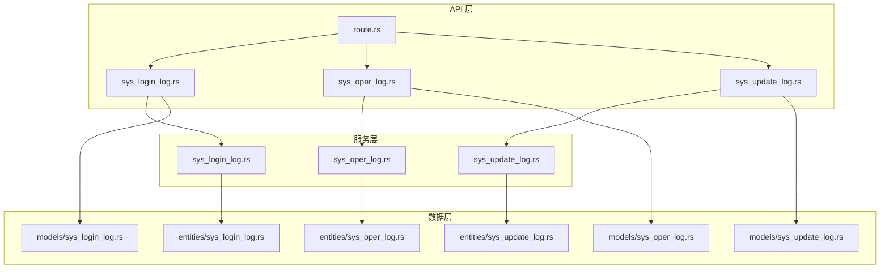
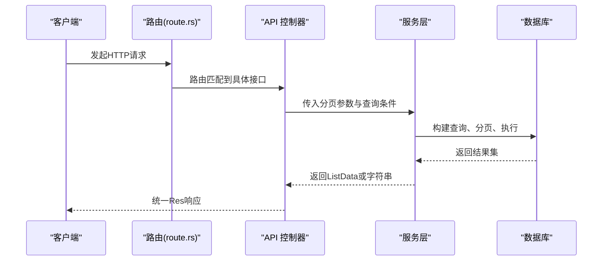
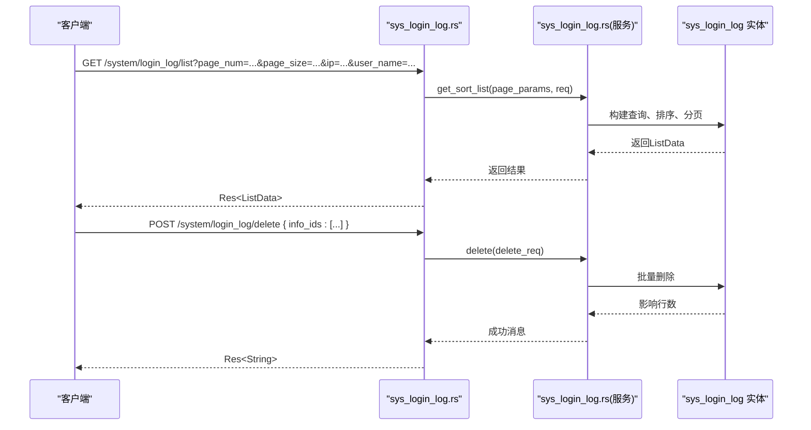
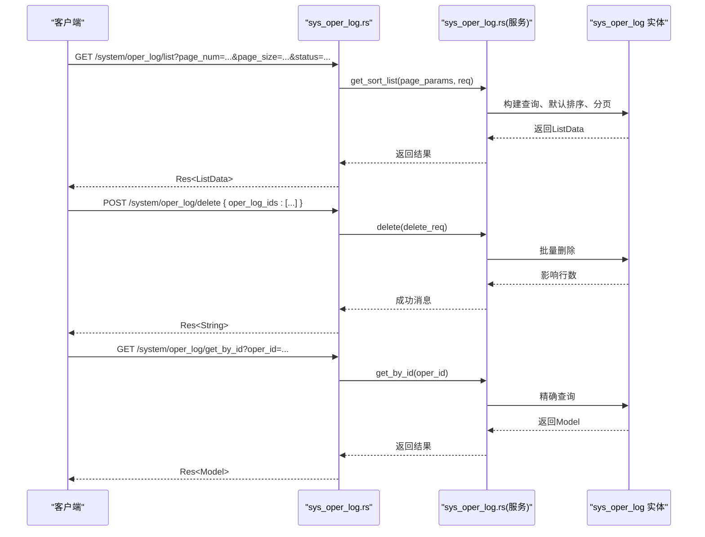
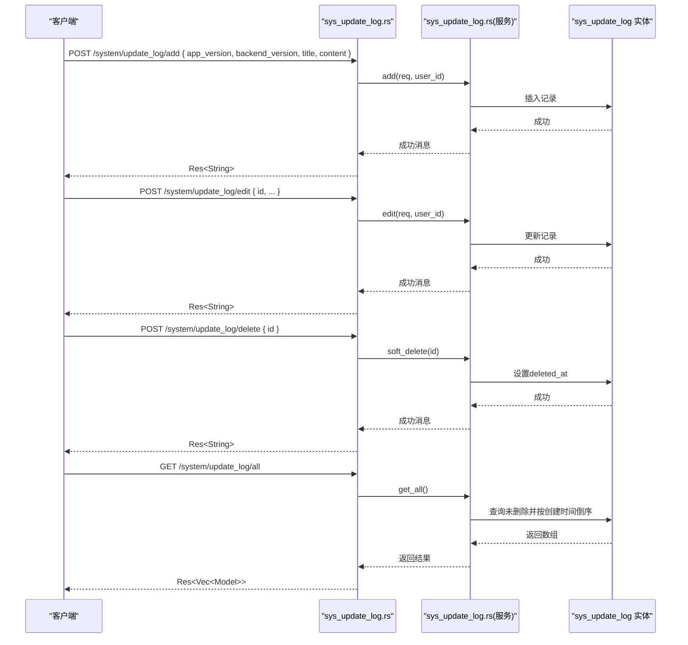
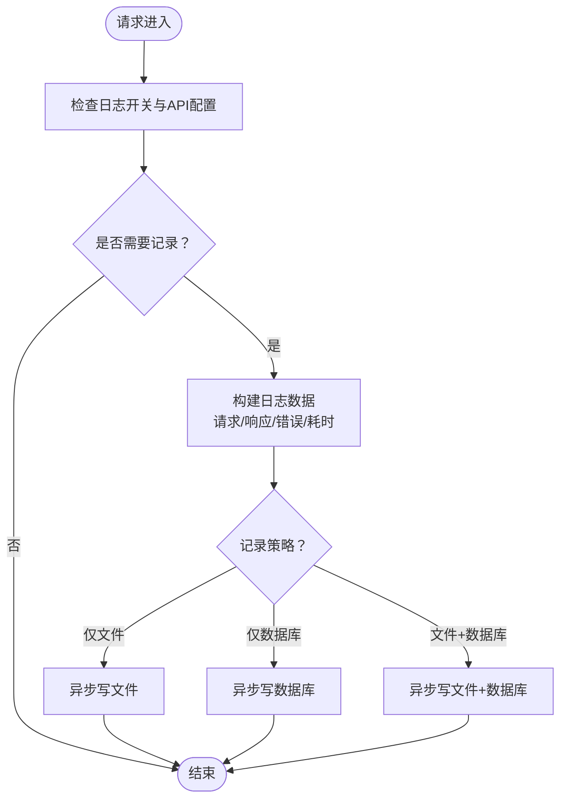
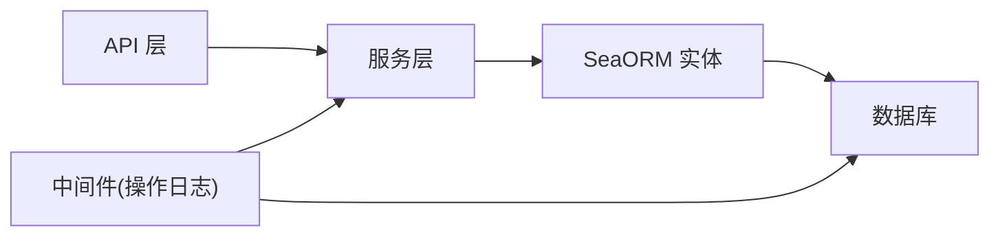

# 日志系统接口

<cite>
**本文引用的文件**
- [api/src/system/sys_login_log.rs](file://api/src/system/sys_login_log.rs)
- [api/src/system/sys_oper_log.rs](file://api/src/system/sys_oper_log.rs)
- [api/src/system/sys_update_log.rs](file://api/src/system/sys_update_log.rs)
- [api/src/route.rs](file://api/src/route.rs)
- [service/src/system/sys_login_log.rs](file://service/src/system/sys_login_log.rs)
- [service/src/system/sys_oper_log.rs](file://service/src/system/sys_oper_log.rs)
- [service/src/system/sys_update_log.rs](file://service/src/system/sys_update_log.rs)
- [db/src/system/models/sys_login_log.rs](file://db/src/system/models/sys_login_log.rs)
- [db/src/system/models/sys_oper_log.rs](file://db/src/system/models/sys_oper_log.rs)
- [db/src/system/models/sys_update_log.rs](file://db/src/system/models/sys_update_log.rs)
- [db/src/system/entities/sys_login_log.rs](file://db/src/system/entities/sys_login_log.rs)
- [db/src/system/entities/sys_oper_log.rs](file://db/src/system/entities/sys_oper_log.rs)
- [db/src/system/entities/sys_update_log.rs](file://db/src/system/entities/sys_update_log.rs)
- [middleware-fn/src/oper_log.rs](file://middleware-fn/src/oper_log.rs)
</cite>

## 目录
1. [简介](#简介)
2. [项目结构](#项目结构)
3. [核心组件](#核心组件)
4. [架构总览](#架构总览)
5. [详细组件分析](#详细组件分析)
6. [依赖关系分析](#依赖关系分析)
7. [性能考虑](#性能考虑)
8. [故障排查指南](#故障排查指南)
9. [结论](#结论)
10. [附录](#附录)

## 简介
本文件为 Axum Admin 项目的日志系统接口文档，覆盖三类日志管理能力：
- 登录日志：查询、批量删除、清空
- 操作日志：查询、批量删除、清空、按主键查询
- 系统更新日志：新增、编辑、软删除、查询全部

文档详细说明各接口的数据结构、查询条件、分页机制、错误处理与返回格式，并给出日志审计要求、数据保留策略、性能优化建议以及典型使用场景与调用示例。

## 项目结构
日志相关代码采用“API 层 → 服务层 → 数据层（SeaORM 实体/模型）”的分层设计：
- API 层：定义 HTTP 接口，接收请求参数，调用服务层，封装统一响应
- 服务层：实现业务逻辑，构建 SeaORM 查询、分页、事务与清理
- 数据层：定义实体与模型，提供数据库访问与字段约束

图表来源
- [api/src/system/sys_login_log.rs](file://api/src/system/sys_login_log.rs#L1-L43)
- [api/src/system/sys_oper_log.rs](file://api/src/system/sys_oper_log.rs#L1-L61)
- [api/src/system/sys_update_log.rs](file://api/src/system/sys_update_log.rs#L1-L52)
- [api/src/route.rs](file://api/src/route.rs#L12-L22)
- [service/src/system/sys_login_log.rs](file://service/src/system/sys_login_log.rs#L1-L129)
- [service/src/system/sys_oper_log.rs](file://service/src/system/sys_oper_log.rs#L1-L107)
- [service/src/system/sys_update_log.rs](file://service/src/system/sys_update_log.rs#L1-L77)
- [db/src/system/entities/sys_login_log.rs](file://db/src/system/entities/sys_login_log.rs#L1-L89)
- [db/src/system/entities/sys_oper_log.rs](file://db/src/system/entities/sys_oper_log.rs#L1-L110)
- [db/src/system/entities/sys_update_log.rs](file://db/src/system/entities/sys_update_log.rs#L1-L80)
- [db/src/system/models/sys_login_log.rs](file://db/src/system/models/sys_login_log.rs#L1-L18)
- [db/src/system/models/sys_oper_log.rs](file://db/src/system/models/sys_oper_log.rs#L1-L18)
- [db/src/system/models/sys_update_log.rs](file://db/src/system/models/sys_update_log.rs#L1-L24)

章节来源
- [api/src/route.rs](file://api/src/route.rs#L12-L22)

## 核心组件
- 登录日志接口：GET /system/login_log/list、POST /system/login_log/delete、POST /system/login_log/clean
- 操作日志接口：GET /system/oper_log/list、POST /system/oper_log/delete、POST /system/oper_log/clean、GET /system/oper_log/get_by_id
- 系统更新日志接口：POST /system/update_log/add、POST /system/update_log/edit、POST /system/update_log/delete、GET /system/update_log/all

返回统一格式为 Res<T>，包含状态码、消息与数据；分页返回 ListData<T>，包含 list、total、total_pages、page_num。

章节来源
- [api/src/system/sys_login_log.rs](file://api/src/system/sys_login_log.rs#L16-L42)
- [api/src/system/sys_oper_log.rs](file://api/src/system/sys_oper_log.rs#L16-L60)
- [api/src/system/sys_update_log.rs](file://api/src/system/sys_update_log.rs#L14-L51)

## 架构总览
日志接口通过 API 层解析请求参数，调用服务层执行查询/删除/清空等操作，服务层基于 SeaORM 构建查询、分页与事务，最终返回统一响应。

图表来源
- [api/src/route.rs](file://api/src/route.rs#L12-L22)
- [api/src/system/sys_login_log.rs](file://api/src/system/sys_login_log.rs#L16-L42)
- [api/src/system/sys_oper_log.rs](file://api/src/system/sys_oper_log.rs#L16-L60)
- [api/src/system/sys_update_log.rs](file://api/src/system/sys_update_log.rs#L14-L51)
- [service/src/system/sys_login_log.rs](file://service/src/system/sys_login_log.rs#L21-L82)
- [service/src/system/sys_oper_log.rs](file://service/src/system/sys_oper_log.rs#L15-L70)
- [service/src/system/sys_update_log.rs](file://service/src/system/sys_update_log.rs#L10-L30)

## 详细组件分析

### 登录日志接口
- 接口概览
  - GET /system/login_log/list：查询登录日志
  - POST /system/login_log/delete：批量删除登录日志
  - POST /system/login_log/clean：清空登录日志表

- 请求参数与查询条件
  - 分页参数：page_num、page_size（可选）
  - 查询条件：ip、user_name、status、begin_time、end_time、order_by_column、is_asc
  - 删除请求：info_ids（数组）

- 响应结构
  - 列表：ListData<SysLoginLogModel>
  - 删除/清空：字符串消息

- 处理流程
  - 构建查询链，按条件过滤
  - 支持按 login_name 或 login_time 排序
  - 分页查询并统计总页数
  - 删除时根据 info_ids 批量删除
  - 清空时执行 TRUNCATE 表

图表来源
- [api/src/system/sys_login_log.rs](file://api/src/system/sys_login_log.rs#L16-L42)
- [service/src/system/sys_login_log.rs](file://service/src/system/sys_login_log.rs#L21-L104)
- [db/src/system/models/sys_login_log.rs](file://db/src/system/models/sys_login_log.rs#L3-L17)
- [db/src/system/entities/sys_login_log.rs](file://db/src/system/entities/sys_login_log.rs#L15-L29)

章节来源
- [api/src/system/sys_login_log.rs](file://api/src/system/sys_login_log.rs#L16-L42)
- [service/src/system/sys_login_log.rs](file://service/src/system/sys_login_log.rs#L21-L104)
- [db/src/system/models/sys_login_log.rs](file://db/src/system/models/sys_login_log.rs#L3-L17)
- [db/src/system/entities/sys_login_log.rs](file://db/src/system/entities/sys_login_log.rs#L15-L29)

### 操作日志接口
- 接口概览
  - GET /system/oper_log/list：查询操作日志
  - POST /system/oper_log/delete：批量删除操作日志
  - POST /system/oper_log/clean：清空操作日志表
  - GET /system/oper_log/get_by_id：按 oper_id 查询单条记录

- 请求参数与查询条件
  - 分页参数：page_num、page_size（可选）
  - 查询条件：title、oper_name、operator_type、status、begin_time、end_time
  - 删除请求：oper_log_ids（数组）
  - 单条查询：oper_id（查询参数）

- 响应结构
  - 列表：ListData<SysOperLogModel>
  - 删除/清空/查询：字符串或单条记录

- 处理流程
  - 构建查询链，按条件过滤
  - 默认按 oper_time 降序
  - 分页查询并统计总页数
  - 删除时根据 oper_id 批量删除
  - 清空时执行 TRUNCATE 表
  - 单条查询按 oper_id 精确匹配

图表来源
- [api/src/system/sys_oper_log.rs](file://api/src/system/sys_oper_log.rs#L16-L60)
- [service/src/system/sys_oper_log.rs](file://service/src/system/sys_oper_log.rs#L15-L106)
- [db/src/system/models/sys_oper_log.rs](file://db/src/system/models/sys_oper_log.rs#L3-L17)
- [db/src/system/entities/sys_oper_log.rs](file://db/src/system/entities/sys_oper_log.rs#L15-L36)

章节来源
- [api/src/system/sys_oper_log.rs](file://api/src/system/sys_oper_log.rs#L16-L60)
- [service/src/system/sys_oper_log.rs](file://service/src/system/sys_oper_log.rs#L15-L106)
- [db/src/system/models/sys_oper_log.rs](file://db/src/system/models/sys_oper_log.rs#L3-L17)
- [db/src/system/entities/sys_oper_log.rs](file://db/src/system/entities/sys_oper_log.rs#L15-L36)

### 系统更新日志接口
- 接口概览
  - POST /system/update_log/add：新增系统更新日志
  - POST /system/update_log/edit：编辑系统更新日志
  - POST /system/update_log/delete：软删除系统更新日志
  - GET /system/update_log/all：查询全部未删除记录

- 请求参数与数据结构
  - 新增：app_version、backend_version、title、content
  - 编辑：id、app_version、backend_version、title、content
  - 删除：id
  - 查询全部：无参数

- 响应结构
  - 新增/编辑/软删除：字符串消息
  - 查询全部：数组 SysUpdateLogModel

- 处理流程
  - 新增：生成唯一 id，设置创建/更新时间，写入数据库
  - 编辑：按 id 更新版本号、标题、内容与更新人、更新时间
  - 软删除：设置 deleted_at 时间
  - 查询全部：过滤 deleted_at 为空并按创建时间倒序

图表来源
- [api/src/system/sys_update_log.rs](file://api/src/system/sys_update_log.rs#L14-L51)
- [service/src/system/sys_update_log.rs](file://service/src/system/sys_update_log.rs#L10-L76)
- [db/src/system/models/sys_update_log.rs](file://db/src/system/models/sys_update_log.rs#L3-L23)
- [db/src/system/entities/sys_update_log.rs](file://db/src/system/entities/sys_update_log.rs#L15-L26)

章节来源
- [api/src/system/sys_update_log.rs](file://api/src/system/sys_update_log.rs#L14-L51)
- [service/src/system/sys_update_log.rs](file://service/src/system/sys_update_log.rs#L10-L76)
- [db/src/system/models/sys_update_log.rs](file://db/src/system/models/sys_update_log.rs#L3-L23)
- [db/src/system/entities/sys_update_log.rs](file://db/src/system/entities/sys_update_log.rs#L15-L26)

### 操作日志自动采集（中间件）
- 功能概述
  - 通过中间件在请求完成后异步采集操作日志，支持文件与数据库两种落库方式
  - 可按 API 配置是否记录、记录级别（仅文件/仅数据库/两者）

- 关键流程
  - 记录请求路径、方法、参数、响应、错误、耗时
  - 根据配置选择落库策略
  - 异步写入，避免阻塞主请求

图表来源
- [middleware-fn/src/oper_log.rs](file://middleware-fn/src/oper_log.rs#L55-L103)
- [middleware-fn/src/oper_log.rs](file://middleware-fn/src/oper_log.rs#L146-L157)

章节来源
- [middleware-fn/src/oper_log.rs](file://middleware-fn/src/oper_log.rs#L55-L103)

## 依赖关系分析
- API 层依赖服务层与统一响应封装
- 服务层依赖 SeaORM 实体与模型，负责查询、分页、事务与清理
- 中间件层负责自动采集操作日志，与服务层解耦

图表来源
- [api/src/system/sys_login_log.rs](file://api/src/system/sys_login_log.rs#L1-L11)
- [service/src/system/sys_login_log.rs](file://service/src/system/sys_login_log.rs#L3-L16)
- [db/src/system/entities/sys_login_log.rs](file://db/src/system/entities/sys_login_log.rs#L1-L13)
- [middleware-fn/src/oper_log.rs](file://middleware-fn/src/oper_log.rs#L55-L103)

章节来源
- [api/src/system/sys_login_log.rs](file://api/src/system/sys_login_log.rs#L1-L11)
- [service/src/system/sys_login_log.rs](file://service/src/system/sys_login_log.rs#L3-L16)
- [middleware-fn/src/oper_log.rs](file://middleware-fn/src/oper_log.rs#L55-L103)

## 性能考虑
- 分页与排序
  - 登录日志支持按 login_name、login_time 排序；操作日志默认按 oper_time 降序
  - 建议在高频查询字段上建立索引（如 login_time、oper_time、status、oper_name）
- 查询条件
  - 使用 begin_time/end_time 限定时间范围，减少扫描
  - 对大字段（如 oper_param、json_result）进行长度控制，避免存储超长文本
- 异步落库
  - 操作日志中间件采用异步写入，降低对主请求的影响
- 事务与批量
  - 删除与清空使用批量操作，减少往返次数
- 缓存与中间件
  - 路由层支持缓存中间件，可在非敏感接口启用以减轻数据库压力

章节来源
- [service/src/system/sys_login_log.rs](file://service/src/system/sys_login_log.rs#L60-L81)
- [service/src/system/sys_oper_log.rs](file://service/src/system/sys_oper_log.rs#L59-L69)
- [middleware-fn/src/oper_log.rs](file://middleware-fn/src/oper_log.rs#L74-L98)

## 故障排查指南
- 常见错误与处理
  - 删除失败（数据不存在）：返回提示信息，检查 ids 是否正确
  - 查询无结果：确认查询条件与时间范围是否合理
  - 数据过长不保存：当请求/响应过大时会截断，需优化请求体大小
- 日志开关
  - 若未看到操作日志，请检查配置项是否开启日志采集
- 数据一致性
  - 新增/编辑/软删除均使用事务，确保原子性；若出现异常，查看数据库事务提交状态

章节来源
- [service/src/system/sys_login_log.rs](file://service/src/system/sys_login_log.rs#L94-L96)
- [service/src/system/sys_oper_log.rs](file://service/src/system/sys_oper_log.rs#L82-L85)
- [middleware-fn/src/oper_log.rs](file://middleware-fn/src/oper_log.rs#L134-L135)

## 结论
Axum Admin 的日志系统通过清晰的分层设计与统一响应封装，提供了完善的登录日志、操作日志与系统更新日志管理能力。结合中间件自动采集与性能优化策略，能够满足生产环境下的审计与监控需求。建议在上线前完善索引、明确数据保留策略，并根据业务场景调整日志记录策略。

## 附录

### 接口一览与调用示例（路径）
- 登录日志
  - GET /system/login_log/list?page_num=1&page_size=10&status=1&begin_time=2025-01-01&end_time=2025-01-31
  - POST /system/login_log/delete
    - 请求体：{ "info_ids": ["id1","id2"] }
  - POST /system/login_log/clean
- 操作日志
  - GET /system/oper_log/list?page_num=1&page_size=10&status=1&begin_time=2025-01-01&end_time=2025-01-31
  - POST /system/oper_log/delete
    - 请求体：{ "oper_log_ids": ["id1","id2"] }
  - POST /system/oper_log/clean
  - GET /system/oper_log/get_by_id?oper_id=id1
- 系统更新日志
  - POST /system/update_log/add
    - 请求体：{ "app_version":"v1.0","backend_version":"v2.0","title":"标题","content":"内容" }
  - POST /system/update_log/edit
    - 请求体：{ "id":"id1","app_version":"v1.1","backend_version":"v2.1","title":"新标题","content":"新内容" }
  - POST /system/update_log/delete
    - 请求体：{ "id":"id1" }
  - GET /system/update_log/all

章节来源
- [api/src/system/sys_login_log.rs](file://api/src/system/sys_login_log.rs#L16-L42)
- [api/src/system/sys_oper_log.rs](file://api/src/system/sys_oper_log.rs#L16-L60)
- [api/src/system/sys_update_log.rs](file://api/src/system/sys_update_log.rs#L14-L51)

### 数据模型与字段说明
- 登录日志（sys_login_log）
  - 字段要点：login_name、ipaddr、login_location、browser、os、device、status、login_time、module
  - 典型用途：登录行为追踪、安全审计
- 操作日志（sys_oper_log）
  - 字段要点：title、method、request_method、operator_type、oper_name、oper_url、oper_ip、oper_param、json_result、status、duration、oper_time
  - 典型用途：操作轨迹、性能监控、异常定位
- 系统更新日志（sys_update_log）
  - 字段要点：app_version、backend_version、title、content、created_at、updated_at、deleted_at、updated_by
  - 典型用途：版本发布记录、变更追踪

章节来源
- [db/src/system/entities/sys_login_log.rs](file://db/src/system/entities/sys_login_log.rs#L15-L36)
- [db/src/system/entities/sys_oper_log.rs](file://db/src/system/entities/sys_oper_log.rs#L15-L36)
- [db/src/system/entities/sys_update_log.rs](file://db/src/system/entities/sys_update_log.rs#L15-L26)

### 日志审计与数据保留策略建议
- 审计要求
  - 操作日志必须记录关键字段（请求/响应、错误、耗时），并对敏感字段脱敏
  - 登录日志应保留 IP、设备、浏览器、操作系统等上下文信息
- 数据保留
  - 建议按月/季度归档历史日志，定期清理过期数据
  - 对超长字段进行截断或外部化存储，避免影响数据库性能
- 合规性
  - 遵循最小化原则，仅保留必要的审计数据
  - 提供导出与检索能力，满足合规审查需求

[本节为通用建议，不直接分析具体文件]