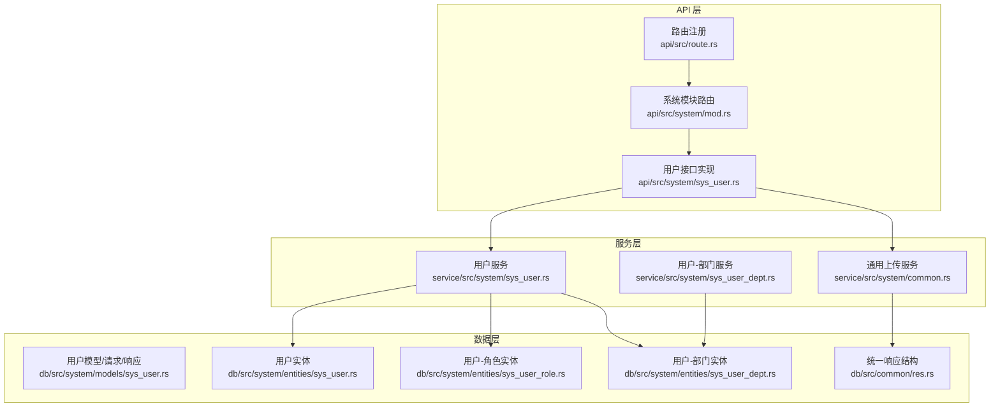
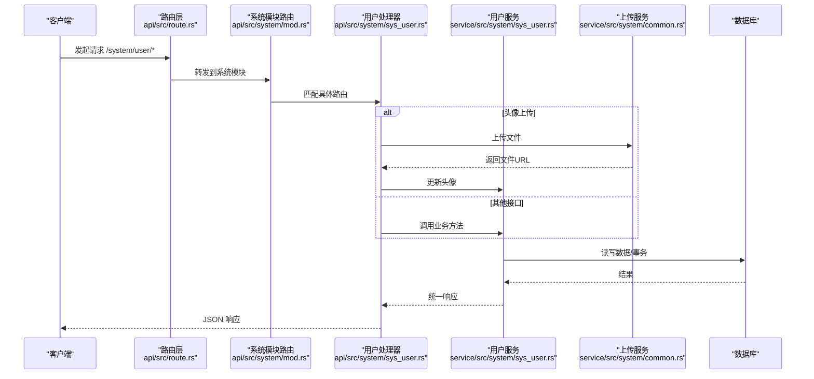
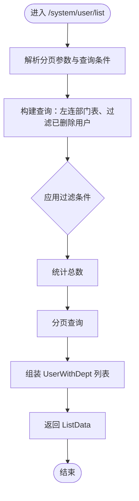
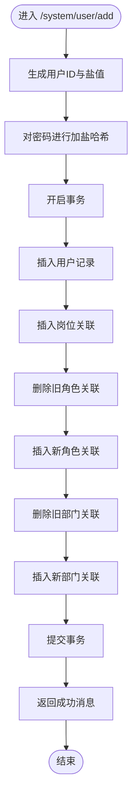
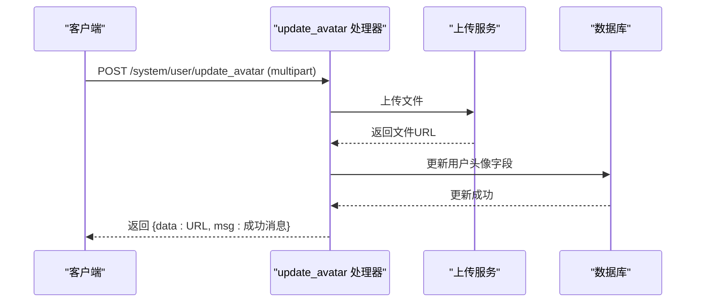
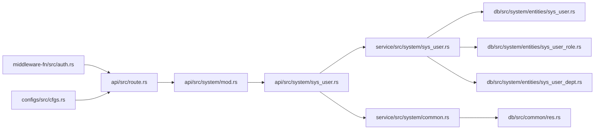

# 用户管理接口

<cite>
**本文引用的文件**
- [api/src/system/sys_user.rs](file://api/src/system/sys_user.rs)
- [api/src/system/mod.rs](file://api/src/system/mod.rs)
- [api/src/route.rs](file://api/src/route.rs)
- [service/src/system/sys_user.rs](file://service/src/system/sys_user.rs)
- [service/src/system/common.rs](file://service/src/system/common.rs)
- [service/src/system/sys_user_dept.rs](file://service/src/system/sys_user_dept.rs)
- [db/src/system/models/sys_user.rs](file://db/src/system/models/sys_user.rs)
- [db/src/system/entities/sys_user.rs](file://db/src/system/entities/sys_user.rs)
- [db/src/system/entities/sys_user_role.rs](file://db/src/system/entities/sys_user_role.rs)
- [db/src/system/entities/sys_user_dept.rs](file://db/src/system/entities/sys_user_dept.rs)
- [db/src/common/res.rs](file://db/src/common/res.rs)
- [configs/src/cfgs.rs](file://configs/src/cfgs.rs)
- [middleware-fn/src/auth.rs](file://middleware-fn/src/auth.rs)
</cite>

## 目录
1. [简介](#简介)
2. [项目结构](#项目结构)
3. [核心组件](#核心组件)
4. [架构总览](#架构总览)
5. [详细组件分析](#详细组件分析)
6. [依赖关系分析](#依赖关系分析)
7. [性能考量](#性能考量)
8. [故障排查指南](#故障排查指南)
9. [结论](#结论)
10. [附录](#附录)

## 简介
本文件为 Axum Admin 项目的“用户管理接口”完整 API 文档，覆盖用户 CRUD、状态管理、密码重置与更新、头像上传、角色与部门变更等能力。文档提供每个接口的请求参数、响应格式、权限要求与使用示例，并给出数据模型说明与流程图。

## 项目结构
用户管理接口位于系统模块下，通过路由注册并受鉴权中间件保护；服务层负责业务逻辑与数据库事务；模型与实体定义了请求/响应结构与数据库字段。

**图表来源**
- [api/src/route.rs](file://api/src/route.rs#L12-L22)
- [api/src/system/mod.rs](file://api/src/system/mod.rs#L26-L63)
- [api/src/system/sys_user.rs](file://api/src/system/sys_user.rs#L21-L206)
- [service/src/system/sys_user.rs](file://service/src/system/sys_user.rs#L26-L649)
- [service/src/system/common.rs](file://service/src/system/common.rs#L28-L51)
- [service/src/system/sys_user_dept.rs](file://service/src/system/sys_user_dept.rs#L7-L56)
- [db/src/system/models/sys_user.rs](file://db/src/system/models/sys_user.rs#L7-L153)
- [db/src/system/entities/sys_user.rs](file://db/src/system/entities/sys_user.rs#L15-L36)
- [db/src/system/entities/sys_user_role.rs](file://db/src/system/entities/sys_user_role.rs#L15-L22)
- [db/src/system/entities/sys_user_dept.rs](file://db/src/system/entities/sys_user_dept.rs#L15-L22)
- [db/src/common/res.rs](file://db/src/common/res.rs#L9-L95)

**章节来源**
- [api/src/route.rs](file://api/src/route.rs#L12-L22)
- [api/src/system/mod.rs](file://api/src/system/mod.rs#L26-L63)

## 核心组件
- 路由与中间件
  - 系统模块路由在系统命名空间下注册，所有 /system/* 接口均受鉴权中间件保护（ApiAuth、Ctx、Claims 提取器）。
  - 用户模块路由挂载于 /system/user 下，包含列表、详情、增删改、状态/角色/部门变更、密码重置/更新、头像上传等。
- 服务层
  - 用户服务封装了用户列表查询、详情获取、新增、编辑、删除、状态/角色/部门变更、密码重置/更新、头像更新、登录与刷新 Token 等业务逻辑。
  - 通用上传服务负责文件上传与删除，支持图片类型校验与按日期分目录存储。
  - 用户-部门服务负责用户与部门关联的增删改查。
- 数据层
  - 请求/响应模型定义了各接口的输入输出结构。
  - 实体映射数据库表结构，包含用户、用户-角色、用户-部门等。

**章节来源**
- [api/src/system/mod.rs](file://api/src/system/mod.rs#L46-L63)
- [service/src/system/sys_user.rs](file://service/src/system/sys_user.rs#L26-L649)
- [service/src/system/common.rs](file://service/src/system/common.rs#L28-L51)
- [service/src/system/sys_user_dept.rs](file://service/src/system/sys_user_dept.rs#L7-L56)
- [db/src/system/models/sys_user.rs](file://db/src/system/models/sys_user.rs#L7-L153)
- [db/src/system/entities/sys_user.rs](file://db/src/system/entities/sys_user.rs#L15-L36)

## 架构总览
用户管理接口遵循“API → 服务 → 数据库”的分层设计，统一响应结构贯穿始终，鉴权中间件确保接口访问安全。

**图表来源**
- [api/src/route.rs](file://api/src/route.rs#L33-L53)
- [api/src/system/mod.rs](file://api/src/system/mod.rs#L46-L63)
- [api/src/system/sys_user.rs](file://api/src/system/sys_user.rs#L21-L206)
- [service/src/system/sys_user.rs](file://service/src/system/sys_user.rs#L26-L649)
- [service/src/system/common.rs](file://service/src/system/common.rs#L28-L51)

## 详细组件分析

### 用户管理接口清单与规范

- 基础信息
  - 命名空间：/system/user
  - 认证：需要有效 JWT（ApiAuth 中间件）
  - 响应格式：统一响应结构，包含 code、data、msg

- 接口一览
  - GET /system/user/list
    - 功能：用户列表查询（分页、多条件过滤）
    - 权限：需要接口权限校验（ApiAuth）
    - 请求参数：分页参数 + 查询条件（用户ID、用户名称、手机号、状态、部门ID、时间范围等）
    - 响应：分页结果，包含用户与部门信息
    - 示例请求：GET /system/user/list?page_num=1&page_size=10&user_name=张三
    - 示例响应：包含 total、list、total_pages、page_num 的对象
  - GET /system/user/get_by_id
    - 功能：按用户ID获取用户详情（含部门）
    - 请求参数：查询参数 user_id
    - 响应：用户信息与部门信息组合
  - GET /system/user/get_profile
    - 功能：获取当前登录用户的完整信息（含岗位、角色、部门ID集合）
    - 请求：携带 JWT，从 Claims 中解析用户ID
    - 响应：用户信息 + 角色IDs + 部门IDs + 当前dept_id
  - PUT /system/user/update_profile
    - 功能：更新个人资料（昵称、手机、邮箱、性别）
    - 请求体：UpdateProfileReq
    - 响应：成功消息
  - POST /system/user/add
    - 功能：新增用户（含角色、部门、岗位）
    - 请求体：SysUserAddReq（用户名、昵称、密码、状态、邮箱、性别、头像、备注、是否超管、手机号、岗位IDs、部门IDs、主部门ID、角色IDs）
    - 响应：成功消息
  - PUT /system/user/edit
    - 功能：编辑用户（可批量更新岗位、角色、部门）
    - 请求体：SysUserEditReq
    - 响应：成功消息
  - DELETE /system/user/delete
    - 功能：硬删除用户（支持批量）
    - 请求体：SysUserDeleteReq（user_ids 数组）
    - 响应：成功消息（含影响条数）
  - GET /system/user/get_info
    - 功能：获取用户信息及权限（角色、部门、权限列表）
    - 响应：用户信息 + roles + depts + permissions
  - PUT /system/user/reset_passwd
    - 功能：重置指定用户密码（管理员）
    - 请求体：ResetPwdReq（user_id、new_passwd）
    - 响应：成功消息
  - PUT /system/user/update_passwd
    - 功能：当前用户修改自己的密码
    - 请求体：UpdatePwdReq（old_passwd、new_passwd）
    - 响应：成功消息
  - PUT /system/user/change_status
    - 功能：修改用户状态
    - 请求体：ChangeStatusReq（user_id、status）
    - 响应：成功消息
  - PUT /system/user/change_role
    - 功能：切换用户角色
    - 请求体：ChangeRoleReq（user_id、role_id）
    - 响应：成功消息
  - PUT /system/user/change_dept
    - 功能：切换用户主部门
    - 请求体：ChangeDeptReq（user_id、dept_id）
    - 响应：成功消息
  - PUT /system/user/fresh_token
    - 功能：刷新 JWT（基于现有 Claims）
    - 响应：新令牌
  - POST /system/user/update_avatar
    - 功能：上传头像并更新
    - 请求：multipart/form-data，字段名为首个文件字段
    - 响应：文件URL + 成功消息

- 权限要求
  - 除登录与验证码外，所有 /system/* 接口需通过 ApiAuth 中间件校验。
  - 超级管理员（配置项）可绕过权限校验。
  - 超级管理员 ID 列表来源于配置。

**章节来源**
- [api/src/system/mod.rs](file://api/src/system/mod.rs#L46-L63)
- [api/src/system/sys_user.rs](file://api/src/system/sys_user.rs#L21-L206)
- [middleware-fn/src/auth.rs](file://middleware-fn/src/auth.rs#L6-L24)
- [configs/src/cfgs.rs](file://configs/src/cfgs.rs#L67-L72)

### 数据模型说明

- 用户基础模型
  - 用户实体字段：ID、用户名、昵称、密码、盐值、状态、邮箱、性别、头像、角色ID、部门ID、备注、是否超管、手机号、最后登录IP/时间、创建/更新/删除时间。
  - 用户响应模型：包含上述字段，用于列表与详情展示。
  - 用户与部门组合模型：用户信息 + 部门信息。
  - 用户完整信息模型：用户信息 + 岗位IDs + 角色IDs + 部门IDs + 主部门ID。

- 请求模型
  - 新增请求：SysUserAddReq（含岗位IDs、部门IDs、角色IDs等）
  - 编辑请求：SysUserEditReq（同上，含用户ID）
  - 更新个人资料：UpdateProfileReq（含用户ID）
  - 登录请求：UserLoginReq（用户名、密码、验证码、uuid）
  - 重置密码：ResetPwdReq（user_id、new_passwd）
  - 更新密码：UpdatePwdReq（old_passwd、new_passwd）
  - 变更状态：ChangeStatusReq（user_id、status）
  - 变更角色：ChangeRoleReq（user_id、role_id）
  - 变更部门：ChangeDeptReq（user_id、dept_id）
  - 查询请求：SysUserSearchReq（多条件过滤）

- 统一响应
  - Res<T>：code、data、msg
  - ListData<T>：list、total、total_pages、page_num
  - PageParams：page_num、page_size

**章节来源**
- [db/src/system/entities/sys_user.rs](file://db/src/system/entities/sys_user.rs#L15-L36)
- [db/src/system/models/sys_user.rs](file://db/src/system/models/sys_user.rs#L54-L153)
- [db/src/common/res.rs](file://db/src/common/res.rs#L9-L95)

### 关键流程图

#### 用户列表查询流程

**图表来源**
- [service/src/system/sys_user.rs](file://service/src/system/sys_user.rs#L26-L144)

#### 新增用户流程（含角色/部门/岗位）

**图表来源**
- [service/src/system/sys_user.rs](file://service/src/system/sys_user.rs#L275-L318)
- [service/src/system/sys_user_dept.rs](file://service/src/system/sys_user_dept.rs#L7-L28)

#### 头像上传与更新流程

**图表来源**
- [api/src/system/sys_user.rs](file://api/src/system/sys_user.rs#L192-L205)
- [service/src/system/common.rs](file://service/src/system/common.rs#L28-L51)
- [service/src/system/sys_user.rs](file://service/src/system/sys_user.rs#L429-L442)

## 依赖关系分析

**图表来源**
- [api/src/system/sys_user.rs](file://api/src/system/sys_user.rs#L1-L206)
- [service/src/system/sys_user.rs](file://service/src/system/sys_user.rs#L1-L649)
- [service/src/system/common.rs](file://service/src/system/common.rs#L1-L63)
- [db/src/system/entities/sys_user.rs](file://db/src/system/entities/sys_user.rs#L1-L110)
- [db/src/system/entities/sys_user_role.rs](file://db/src/system/entities/sys_user_role.rs#L1-L68)
- [db/src/system/entities/sys_user_dept.rs](file://db/src/system/entities/sys_user_dept.rs#L1-L68)
- [db/src/common/res.rs](file://db/src/common/res.rs#L1-L95)
- [api/src/system/mod.rs](file://api/src/system/mod.rs#L1-L199)
- [api/src/route.rs](file://api/src/route.rs#L1-L69)
- [middleware-fn/src/auth.rs](file://middleware-fn/src/auth.rs#L1-L25)
- [configs/src/cfgs.rs](file://configs/src/cfgs.rs#L1-L111)

**章节来源**
- [api/src/system/sys_user.rs](file://api/src/system/sys_user.rs#L1-L206)
- [service/src/system/sys_user.rs](file://service/src/system/sys_user.rs#L1-L649)
- [service/src/system/common.rs](file://service/src/system/common.rs#L1-L63)
- [api/src/system/mod.rs](file://api/src/system/mod.rs#L1-L199)
- [api/src/route.rs](file://api/src/route.rs#L1-L69)
- [middleware-fn/src/auth.rs](file://middleware-fn/src/auth.rs#L1-L25)
- [configs/src/cfgs.rs](file://configs/src/cfgs.rs#L1-L111)

## 性能考量
- 分页与过滤：列表查询使用分页与条件过滤，避免一次性加载大量数据。
- 事务一致性：新增/编辑用户涉及多表写入，采用事务保证原子性。
- 并发与缓存：系统支持全局缓存策略（内存或 SkyTable），可按配置启用。
- 上传优化：文件按日期目录存储，减少单目录文件数量，便于维护。

[本节为通用建议，无需特定文件引用]

## 故障排查指南
- 统一响应结构
  - 成功：code=200，msg="success"
  - 失败：code=500，msg=错误信息
- 常见问题定位
  - 鉴权失败：确认请求头携带有效 JWT，且用户具备接口权限。
  - 参数缺失：检查请求体/查询参数是否符合模型定义。
  - 数据不存在：如用户不存在、部门信息缺失等，服务层会返回明确错误。
  - 上传失败：检查 multipart 字段、文件类型与大小限制、上传目录权限。

**章节来源**
- [db/src/common/res.rs](file://db/src/common/res.rs#L64-L94)
- [service/src/system/sys_user.rs](file://service/src/system/sys_user.rs#L509-L568)
- [service/src/system/common.rs](file://service/src/system/common.rs#L28-L51)

## 结论
Axum Admin 的用户管理接口以清晰的分层设计与统一响应结构为基础，覆盖用户全生命周期管理与相关扩展能力（头像、角色、部门、状态、密码）。通过鉴权中间件与配置化的权限控制，保障接口安全与灵活部署。

[本节为总结，无需特定文件引用]

## 附录

### 接口调用示例（路径与要点）
- 获取用户列表
  - 方法与路径：GET /system/user/list
  - 关键参数：page_num、page_size、user_name、begin_time、end_time 等
  - 响应：ListData<UserWithDept>
- 获取当前用户信息
  - 方法与路径：GET /system/user/get_profile
  - 关键点：从 JWT Claims 中解析用户ID
  - 响应：UserInformation
- 新增用户
  - 方法与路径：POST /system/user/add
  - 关键点：SysUserAddReq（含岗位/角色/部门IDs）
  - 响应：成功消息
- 更新头像
  - 方法与路径：POST /system/user/update_avatar
  - 关键点：multipart/form-data，仅处理首个文件字段
  - 响应：{ data: 文件URL, msg: 成功消息 }

**章节来源**
- [api/src/system/mod.rs](file://api/src/system/mod.rs#L46-L63)
- [api/src/system/sys_user.rs](file://api/src/system/sys_user.rs#L21-L206)
- [service/src/system/common.rs](file://service/src/system/common.rs#L28-L51)