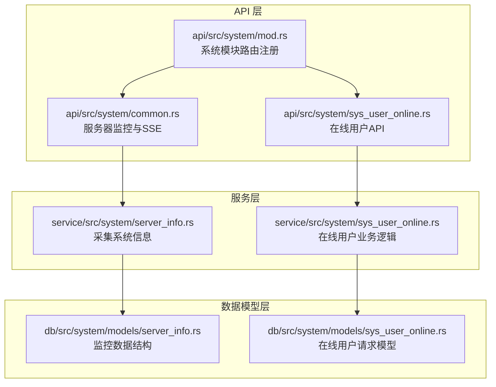
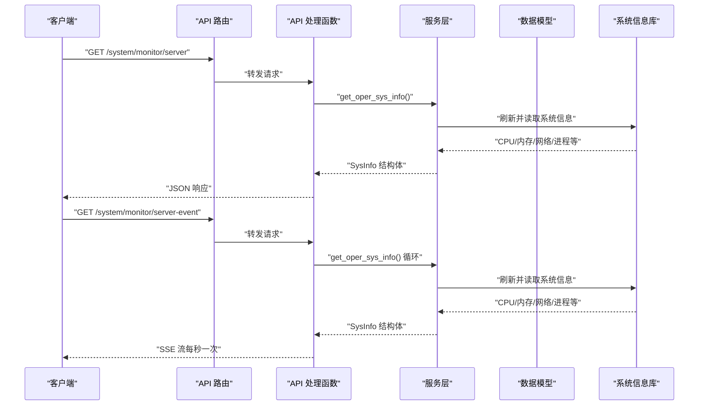
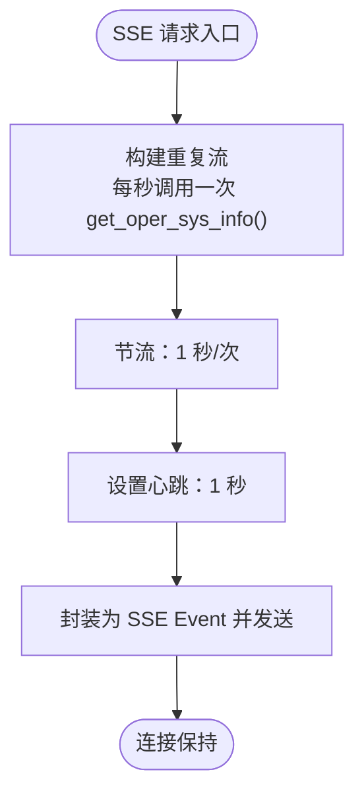
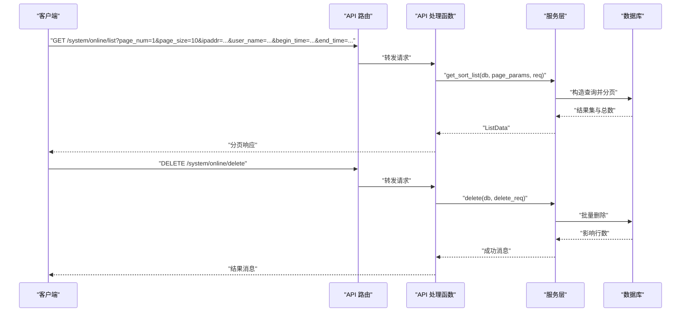
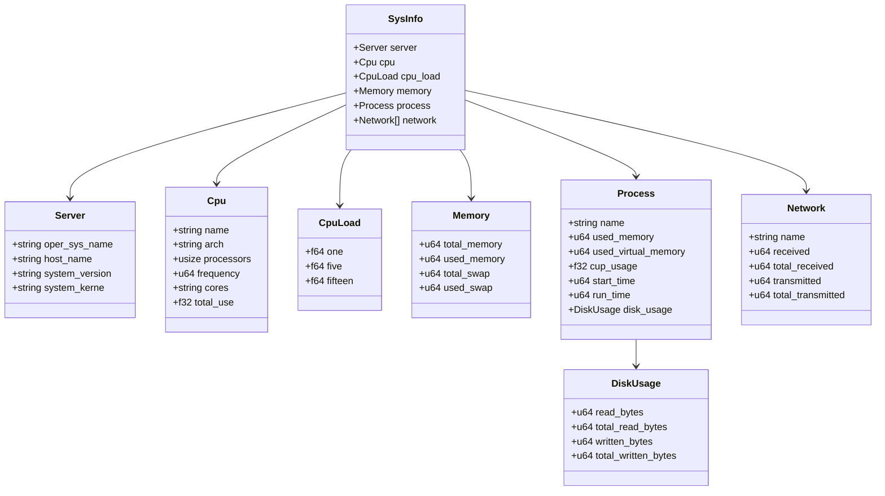
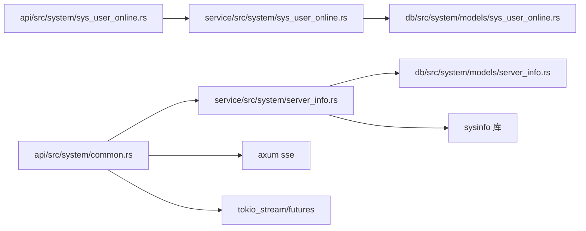

# 系统监控接口

<cite>
**本文引用的文件**
- [api/src/system/mod.rs](file://api/src/system/mod.rs)
- [api/src/system/common.rs](file://api/src/system/common.rs)
- [api/src/system/sys_user_online.rs](file://api/src/system/sys_user_online.rs)
- [service/src/system/server_info.rs](file://service/src/system/server_info.rs)
- [service/src/system/sys_user_online.rs](file://service/src/system/sys_user_online.rs)
- [db/src/system/models/server_info.rs](file://db/src/system/models/server_info.rs)
- [db/src/system/models/sys_user_online.rs](file://db/src/system/models/sys_user_online.rs)
- [api/src/route.rs](file://api/src/route.rs)
- [config/config.toml.sample](file://config/config.toml.sample)
- [Cargo.toml](file://Cargo.toml)
</cite>

## 目录
1. [简介](#简介)
2. [项目结构](#项目结构)
3. [核心组件](#核心组件)
4. [架构总览](#架构总览)
5. [详细组件分析](#详细组件分析)
6. [依赖关系分析](#依赖关系分析)
7. [性能考虑](#性能考虑)
8. [故障排查指南](#故障排查指南)
9. [结论](#结论)
10. [附录](#附录)

## 简介
本文件面向 Axum Admin 项目的系统监控接口，提供完整 API 文档与实现解析，覆盖以下能力：
- 服务器信息监控接口：获取系统资源与性能指标（CPU、内存、网络、进程、磁盘等）
- 实时数据推送：基于 SSE（Server-Sent Events）的持续推送
- 在线用户管理接口：在线用户列表、强制下线、用户状态监控
- 监控数据格式与字段说明
- 性能优化建议与实际应用场景
- 接口调用示例与排障指引

## 项目结构
Axum Admin 的监控相关代码采用“API 层 → 服务层 → 数据模型层”的分层设计，监控接口位于系统模块内，并通过路由注册到统一的 API 路由器中。

**图表来源**
- [api/src/system/mod.rs](file://api/src/system/mod.rs#L186-L190)
- [api/src/system/common.rs](file://api/src/system/common.rs#L17-L33)
- [api/src/system/sys_user_online.rs](file://api/src/system/sys_user_online.rs#L15-L42)
- [service/src/system/server_info.rs](file://service/src/system/server_info.rs#L4-L73)
- [service/src/system/sys_user_online.rs](file://service/src/system/sys_user_online.rs#L20-L136)
- [db/src/system/models/server_info.rs](file://db/src/system/models/server_info.rs#L3-L70)
- [db/src/system/models/sys_user_online.rs](file://db/src/system/models/sys_user_online.rs#L3-L15)

**章节来源**
- [api/src/system/mod.rs](file://api/src/system/mod.rs#L186-L190)
- [api/src/route.rs](file://api/src/route.rs#L12-L22)

## 核心组件
- 服务器监控与 SSE
  - 提供一次性获取系统信息与基于 SSE 的实时推送
  - 实时推送节流与心跳维持
- 在线用户管理
  - 在线用户列表查询（支持按 IP、用户名、登录时间区间过滤）
  - 强制下线（按 token_id）
  - 在线状态检查与续期
- 数据模型
  - SysInfo 及其子结构（Server、Cpu、CpuLoad、Memory、Process、DiskUsage、Network）
  - 在线用户查询与删除请求模型

**章节来源**
- [api/src/system/common.rs](file://api/src/system/common.rs#L17-L33)
- [api/src/system/sys_user_online.rs](file://api/src/system/sys_user_online.rs#L15-L42)
- [service/src/system/server_info.rs](file://service/src/system/server_info.rs#L4-L73)
- [db/src/system/models/server_info.rs](file://db/src/system/models/server_info.rs#L3-L70)
- [db/src/system/models/sys_user_online.rs](file://db/src/system/models/sys_user_online.rs#L3-L15)

## 架构总览
系统监控接口的调用链路如下：

**图表来源**
- [api/src/system/mod.rs](file://api/src/system/mod.rs#L186-L190)
- [api/src/system/common.rs](file://api/src/system/common.rs#L17-L33)
- [service/src/system/server_info.rs](file://service/src/system/server_info.rs#L4-L73)

## 详细组件分析

### 服务器监控接口
- 接口一：一次性获取系统信息
  - 方法与路径：GET /system/monitor/server
  - 功能：返回当前服务器的系统、CPU、内存、进程、网络、负载等信息
  - 返回：JSON 对象，结构见“监控数据格式”
- 接口二：SSE 实时推送
  - 方法与路径：GET /system/monitor/server-event
  - 功能：以 Server-Sent Events 方式，按固定间隔推送系统信息
  - 特性：每秒推送一次，保持连接心跳
  - 注意：当前实现为固定 1 秒节流，可按需调整

**图表来源**
- [api/src/system/common.rs](file://api/src/system/common.rs#L24-L33)
- [service/src/system/server_info.rs](file://service/src/system/server_info.rs#L4-L73)

**章节来源**
- [api/src/system/mod.rs](file://api/src/system/mod.rs#L186-L190)
- [api/src/system/common.rs](file://api/src/system/common.rs#L17-L33)
- [service/src/system/server_info.rs](file://service/src/system/server_info.rs#L4-L73)

### 在线用户管理接口
- 在线用户列表
  - 方法与路径：GET /system/online/list
  - 查询参数：
    - ipaddr：IP 地址（模糊匹配）
    - user_name：用户名（模糊匹配）
    - begin_time：登录开始时间（格式：YYYY-MM-DD）
    - end_time：登录结束时间（格式：YYYY-MM-DD）
  - 分页参数：page_num、page_size（由公共分页参数对象提供）
  - 返回：分页列表，包含在线用户信息与总数
- 强制下线
  - 方法与路径：DELETE /system/online/delete
  - 请求体：ids（字符串数组，对应在线表主键 ID）
  - 返回：操作结果消息
- 登出（当前会话）
  - 方法与路径：POST /system/log_out
  - 请求：携带 JWT Claims（包含 token_id）
  - 行为：删除对应 token_id 的在线记录

**图表来源**
- [api/src/system/sys_user_online.rs](file://api/src/system/sys_user_online.rs#L15-L42)
- [service/src/system/sys_user_online.rs](file://service/src/system/sys_user_online.rs#L20-L80)

**章节来源**
- [api/src/system/sys_user_online.rs](file://api/src/system/sys_user_online.rs#L15-L42)
- [service/src/system/sys_user_online.rs](file://service/src/system/sys_user_online.rs#L20-L136)
- [db/src/system/models/sys_user_online.rs](file://db/src/system/models/sys_user_online.rs#L3-L15)

### 监控数据格式
- SysInfo
  - server：服务器基本信息
  - cpu：CPU 信息
  - cpu_load：系统负载
  - memory：内存信息
  - process：当前进程信息
  - network：网络接口列表
- 子结构字段
  - Server：操作系统名、主机名、系统版本、内核版本
  - Cpu：名称、架构、核心数、总使用率、频率、处理器数量
  - CpuLoad：1 分钟、5 分钟、15 分钟负载
  - Memory：总内存、已用内存、总交换、已用交换
  - Process：名称、内存占用、虚拟内存、CPU 使用、启动时间、运行时长、磁盘用量
  - DiskUsage：读字节数、累计读、写字节数、累计写
  - Network：接口名、接收字节、累计接收、发送字节、累计发送

**图表来源**
- [db/src/system/models/server_info.rs](file://db/src/system/models/server_info.rs#L3-L70)

**章节来源**
- [db/src/system/models/server_info.rs](file://db/src/system/models/server_info.rs#L3-L70)

## 依赖关系分析
- 组件耦合
  - API 层仅负责路由与参数绑定，业务逻辑集中在服务层
  - 服务层通过 SeaORM 访问数据库，使用 sysinfo 库采集系统信息
- 外部依赖
  - sysinfo：系统信息采集
  - serde/serde_json：结构序列化
  - tokio_stream/futures：流式处理与节流
  - axum/sse：SSE 实现与心跳

**图表来源**
- [api/src/system/common.rs](file://api/src/system/common.rs#L1-L33)
- [api/src/system/sys_user_online.rs](file://api/src/system/sys_user_online.rs#L1-L42)
- [service/src/system/server_info.rs](file://service/src/system/server_info.rs#L1-L73)
- [service/src/system/sys_user_online.rs](file://service/src/system/sys_user_online.rs#L1-L137)
- [db/src/system/models/server_info.rs](file://db/src/system/models/server_info.rs#L1-L70)
- [db/src/system/models/sys_user_online.rs](file://db/src/system/models/sys_user_online.rs#L1-L15)

**章节来源**
- [Cargo.toml](file://Cargo.toml#L24-L81)

## 性能考虑
- SSE 推送节流
  - 当前实现为固定 1 秒节流，避免频繁刷新造成资源压力
  - 建议：根据前端展示需求与服务器负载动态调整节流间隔
- 系统信息采集
  - sysinfo 在每次调用时刷新系统状态，建议在高频场景下增加本地缓存或降低采集频率
- 数据库查询
  - 在线用户列表支持多条件过滤与分页，注意索引与查询条件组合
- 压缩与缓存
  - 服务器配置支持响应压缩与缓存策略，可在配置文件中启用或调整

**章节来源**
- [api/src/system/common.rs](file://api/src/system/common.rs#L24-L33)
- [service/src/system/server_info.rs](file://service/src/system/server_info.rs#L4-L73)
- [config/config.toml.sample](file://config/config.toml.sample#L9-L14)

## 故障排查指南
- SSE 连接断开
  - 检查心跳设置与网络稳定性
  - 确认服务端未抛出异常导致流中断
- 实时数据不更新
  - 确认节流间隔设置合理
  - 检查系统信息采集是否成功（sysinfo）
- 在线用户列表为空
  - 检查查询条件（IP、用户名、时间范围）
  - 确认数据库中存在在线记录
- 强制下线失败
  - 检查传入的 ids 是否存在
  - 查看服务层错误返回与数据库影响行数

**章节来源**
- [api/src/system/common.rs](file://api/src/system/common.rs#L24-L33)
- [service/src/system/sys_user_online.rs](file://service/src/system/sys_user_online.rs#L68-L80)

## 结论
Axum Admin 的系统监控接口提供了简洁而实用的服务器信息采集与实时推送能力，以及完善的在线用户管理功能。通过合理的节流与心跳机制，能够在保证用户体验的同时控制服务器负载。建议结合业务场景对 SSE 节流、系统信息采集频率与数据库查询进行进一步优化。

## 附录

### 接口一览与调用示例
- 服务器信息（一次性）
  - GET /system/monitor/server
  - 返回：SysInfo JSON
- 服务器信息（SSE 实时）
  - GET /system/monitor/server-event
  - 返回：SSE 流，每秒推送一次
- 在线用户列表
  - GET /system/online/list?page_num=&page_size=&ipaddr=&user_name=&begin_time=&end_time=
  - 返回：分页列表
- 强制下线
  - DELETE /system/online/delete
  - 请求体：ids（数组）
  - 返回：操作结果消息
- 登出（当前会话）
  - POST /system/log_out
  - 返回：登出结果消息

**章节来源**
- [api/src/system/mod.rs](file://api/src/system/mod.rs#L186-L190)
- [api/src/system/sys_user_online.rs](file://api/src/system/sys_user_online.rs#L15-L42)