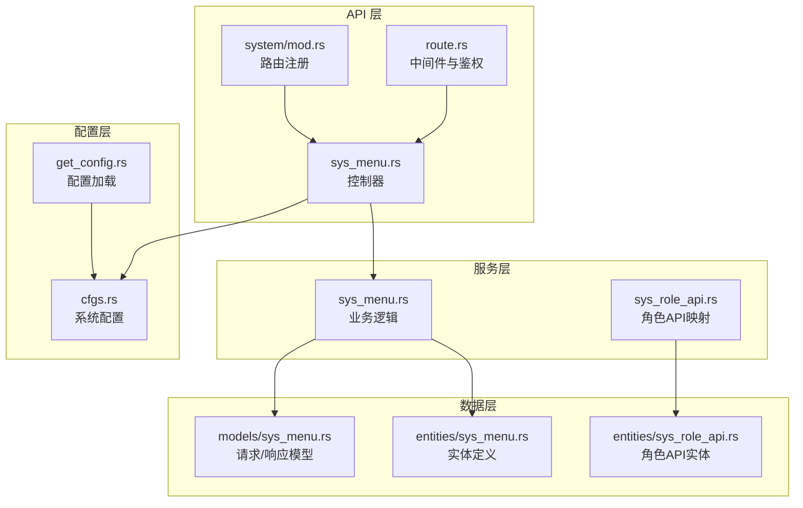
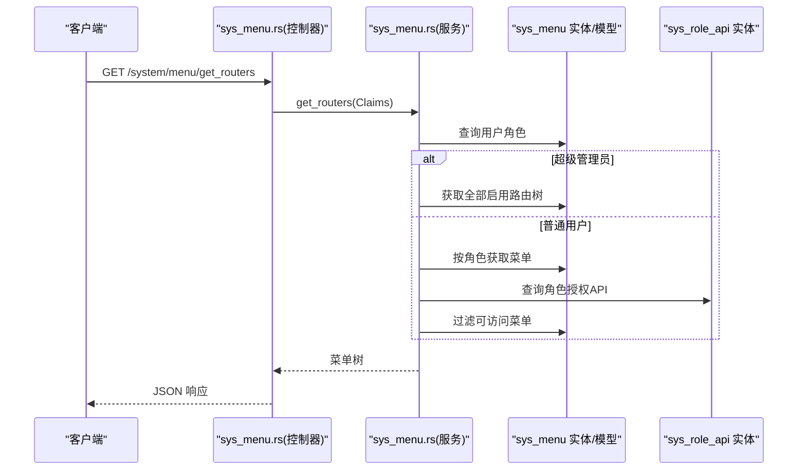
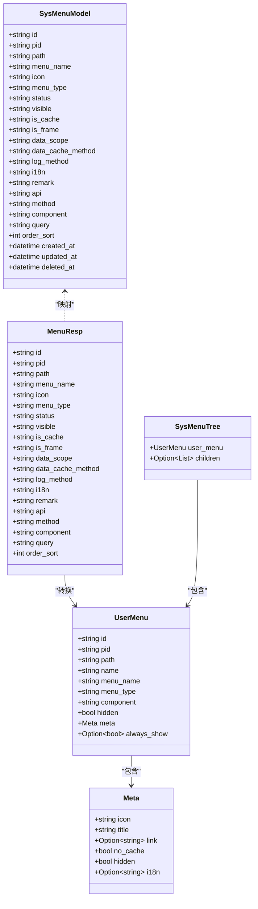
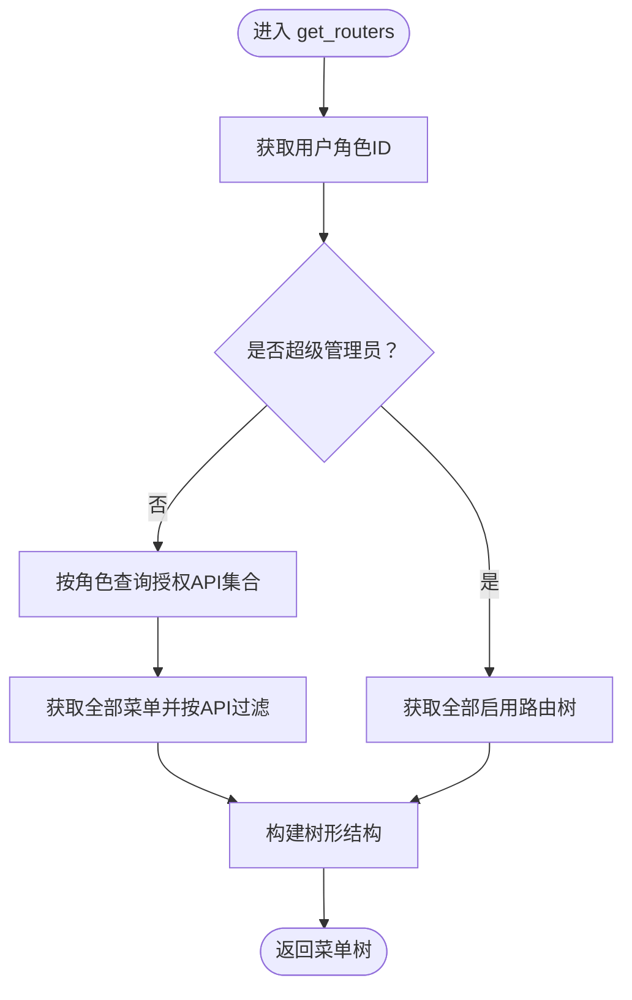
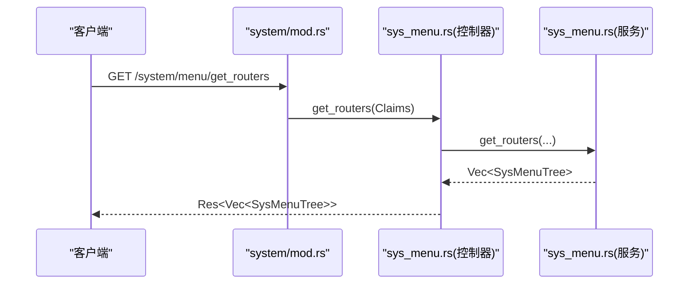
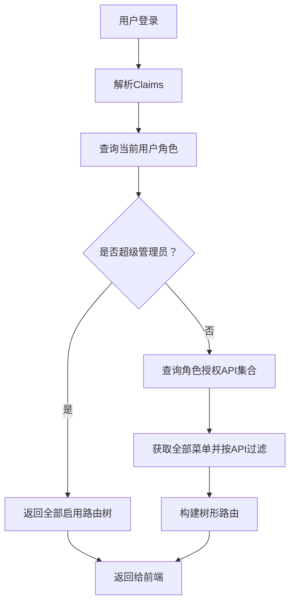
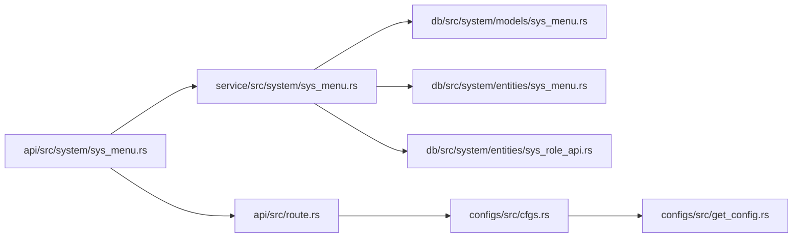

# 菜单管理接口

<cite>
**本文档引用的文件**
- [api/src/system/sys_menu.rs](file://api/src/system/sys_menu.rs)
- [service/src/system/sys_menu.rs](file://service/src/system/sys_menu.rs)
- [db/src/system/models/sys_menu.rs](file://db/src/system/models/sys_menu.rs)
- [db/src/system/entities/sys_menu.rs](file://db/src/system/entities/sys_menu.rs)
- [api/src/system/mod.rs](file://api/src/system/mod.rs)
- [api/src/route.rs](file://api/src/route.rs)
- [service/src/system/sys_role_api.rs](file://service/src/system/sys_role_api.rs)
- [db/src/system/entities/sys_role_api.rs](file://db/src/system/entities/sys_role_api.rs)
- [configs/src/cfgs.rs](file://configs/src/cfgs.rs)
- [configs/src/get_config.rs](file://configs/src/get_config.rs)
</cite>

## 目录
1. [简介](#简介)
2. [项目结构](#项目结构)
3. [核心组件](#核心组件)
4. [架构总览](#架构总览)
5. [详细组件分析](#详细组件分析)
6. [依赖关系分析](#依赖关系分析)
7. [性能考虑](#性能考虑)
8. [故障排除指南](#故障排除指南)
9. [结论](#结论)

## 简介
本文件为 Axum Admin 项目的菜单管理接口提供完整 API 文档，覆盖菜单 CRUD 操作、树形结构获取、权限控制与动态路由生成、按钮权限验证等能力。文档详细说明菜单层级结构、权限标识、路由配置等关键字段，并给出实际应用场景与接口调用示例。

## 项目结构
菜单管理功能位于系统模块中，采用典型的分层架构：
- API 层：定义路由与控制器入口，负责参数提取与响应封装
- Service 层：业务逻辑处理，包含菜单树构建、权限过滤、API 关联查询等
- DB 层：数据模型与实体定义，提供查询、插入、更新、删除等操作
- 配置层：系统配置与运行时参数，影响权限与路由行为

**图表来源**
- [api/src/system/sys_menu.rs](file://api/src/system/sys_menu.rs#L1-L120)
- [api/src/system/mod.rs](file://api/src/system/mod.rs#L129-L141)
- [api/src/route.rs](file://api/src/route.rs#L33-L53)
- [service/src/system/sys_menu.rs](file://service/src/system/sys_menu.rs#L1-L499)
- [service/src/system/sys_role_api.rs](file://service/src/system/sys_role_api.rs#L1-L52)
- [db/src/system/models/sys_menu.rs](file://db/src/system/models/sys_menu.rs#L1-L147)
- [db/src/system/entities/sys_menu.rs](file://db/src/system/entities/sys_menu.rs#L1-L122)
- [db/src/system/entities/sys_role_api.rs](file://db/src/system/entities/sys_role_api.rs#L1-L71)
- [configs/src/cfgs.rs](file://configs/src/cfgs.rs#L65-L72)
- [configs/src/get_config.rs](file://configs/src/get_config.rs#L10-L25)

**章节来源**
- [api/src/system/sys_menu.rs](file://api/src/system/sys_menu.rs#L1-L120)
- [api/src/system/mod.rs](file://api/src/system/mod.rs#L129-L141)
- [api/src/route.rs](file://api/src/route.rs#L33-L53)
- [service/src/system/sys_menu.rs](file://service/src/system/sys_menu.rs#L1-L499)
- [service/src/system/sys_role_api.rs](file://service/src/system/sys_role_api.rs#L1-L52)
- [db/src/system/models/sys_menu.rs](file://db/src/system/models/sys_menu.rs#L1-L147)
- [db/src/system/entities/sys_menu.rs](file://db/src/system/entities/sys_menu.rs#L1-L122)
- [db/src/system/entities/sys_role_api.rs](file://db/src/system/entities/sys_role_api.rs#L1-L71)
- [configs/src/cfgs.rs](file://configs/src/cfgs.rs#L65-L72)
- [configs/src/get_config.rs](file://configs/src/get_config.rs#L10-L25)

## 核心组件
- 菜单模型与实体：定义菜单表结构、字段约束与序列化模型
- 菜单服务：提供菜单 CRUD、树形构建、权限过滤、API 关联查询等
- 菜单 API 控制器：暴露 REST 接口，处理分页、搜索、路由树生成
- 路由与中间件：统一鉴权、操作日志、缓存中间件
- 角色 API 映射：维护角色与 API 的关联，支持权限变更同步

**章节来源**
- [db/src/system/models/sys_menu.rs](file://db/src/system/models/sys_menu.rs#L1-L147)
- [db/src/system/entities/sys_menu.rs](file://db/src/system/entities/sys_menu.rs#L1-L122)
- [service/src/system/sys_menu.rs](file://service/src/system/sys_menu.rs#L21-L499)
- [api/src/system/sys_menu.rs](file://api/src/system/sys_menu.rs#L14-L120)
- [api/src/system/mod.rs](file://api/src/system/mod.rs#L129-L141)
- [api/src/route.rs](file://api/src/route.rs#L33-L53)
- [service/src/system/sys_role_api.rs](file://service/src/system/sys_role_api.rs#L1-L52)

## 架构总览
菜单管理接口遵循“API → Service → DB”的调用链路，结合配置层的系统参数（如超级管理员）决定路由树生成策略。

**图表来源**
- [api/src/system/sys_menu.rs](file://api/src/system/sys_menu.rs#L100-L119)
- [service/src/system/sys_menu.rs](file://service/src/system/sys_menu.rs#L360-L374)
- [service/src/system/sys_menu.rs](file://service/src/system/sys_menu.rs#L324-L356)
- [db/src/system/entities/sys_menu.rs](file://db/src/system/entities/sys_menu.rs#L1-L122)
- [db/src/system/entities/sys_role_api.rs](file://db/src/system/entities/sys_role_api.rs#L1-L71)
- [configs/src/cfgs.rs](file://configs/src/cfgs.rs#L65-L72)

## 详细组件分析

### 菜单模型与实体
- 实体字段涵盖菜单标识、父级、路径、名称、图标、类型、排序、状态、可见性、缓存、国际化、日志与数据缓存方法、数据范围、组件、查询参数、备注等
- 模型用于 API 请求/响应与树形结构转换，包含元信息、用户菜单、树节点等

**图表来源**
- [db/src/system/entities/sys_menu.rs](file://db/src/system/entities/sys_menu.rs#L16-L40)
- [db/src/system/models/sys_menu.rs](file://db/src/system/models/sys_menu.rs#L26-L87)

**章节来源**
- [db/src/system/entities/sys_menu.rs](file://db/src/system/entities/sys_menu.rs#L1-L122)
- [db/src/system/models/sys_menu.rs](file://db/src/system/models/sys_menu.rs#L1-L147)

### 菜单服务逻辑
- 列表查询：支持按菜单名、类型、状态、时间范围、父子 ID 等条件分页查询
- 新增菜单：校验路径与名称唯一性，事务写入，异步更新全局 API 注册
- 更新菜单：校验唯一性，更新实体，异步更新 API 注册与角色 API 映射
- 删除菜单：若存在子菜单则拒绝删除，否则异步移除 API 注册并删除
- 路由树生成：区分“全部启用路由树”和“按角色过滤路由树”，支持超级管理员与普通用户的差异化策略
- 权限过滤：根据角色授权的 API 集合过滤可访问菜单
- API 关联查询：查询菜单关联的数据库 API 与同库 API 列表

**图表来源**
- [service/src/system/sys_menu.rs](file://service/src/system/sys_menu.rs#L360-L374)
- [service/src/system/sys_menu.rs](file://service/src/system/sys_menu.rs#L324-L356)
- [configs/src/cfgs.rs](file://configs/src/cfgs.rs#L65-L72)

**章节来源**
- [service/src/system/sys_menu.rs](file://service/src/system/sys_menu.rs#L21-L499)
- [service/src/system/sys_role_api.rs](file://service/src/system/sys_role_api.rs#L37-L51)

### 菜单 API 控制器
- 路由注册：在系统模块下暴露菜单相关接口
- 控制器方法：
  - 列表查询：GET /system/menu/list
  - 按 ID 查询：GET /system/menu/get_by_id
  - 创建：POST /system/menu/add
  - 更新：PUT /system/menu/edit
  - 更新日志与缓存方法：PUT /system/menu/update_log_cache_method
  - 删除：DELETE /system/menu/delete
  - 获取全部启用菜单树：GET /system/menu/get_all_enabled_menu_tree
  - 获取用户路由树：GET /system/menu/get_routers
  - 获取菜单关联 API 与数据库：GET /system/menu/get_auth_list

**图表来源**
- [api/src/system/mod.rs](file://api/src/system/mod.rs#L129-L141)
- [api/src/system/sys_menu.rs](file://api/src/system/sys_menu.rs#L100-L119)

**章节来源**
- [api/src/system/mod.rs](file://api/src/system/mod.rs#L129-L141)
- [api/src/system/sys_menu.rs](file://api/src/system/sys_menu.rs#L14-L120)

### 权限控制与动态路由
- 超级管理员：绕过角色限制，直接返回全部启用路由树
- 普通用户：基于角色授权的 API 集合过滤可访问菜单，生成动态路由树
- 角色 API 映射：当菜单 API 或方法变更时，同步更新角色 API 映射，确保权限一致性

**图表来源**
- [service/src/system/sys_menu.rs](file://service/src/system/sys_menu.rs#L100-L119)
- [service/src/system/sys_menu.rs](file://service/src/system/sys_menu.rs#L360-L374)
- [service/src/system/sys_menu.rs](file://service/src/system/sys_menu.rs#L324-L356)
- [configs/src/cfgs.rs](file://configs/src/cfgs.rs#L65-L72)

**章节来源**
- [service/src/system/sys_menu.rs](file://service/src/system/sys_menu.rs#L100-L119)
- [service/src/system/sys_menu.rs](file://service/src/system/sys_menu.rs#L324-L356)
- [service/src/system/sys_role_api.rs](file://service/src/system/sys_role_api.rs#L37-L51)
- [configs/src/cfgs.rs](file://configs/src/cfgs.rs#L65-L72)

## 依赖关系分析
- API 层依赖 Service 层提供的业务方法
- Service 层依赖 DB 层的实体与模型进行数据操作
- 路由与中间件层对 API 层进行统一鉴权与日志处理
- 配置层提供系统参数，影响权限判定与路由行为

**图表来源**
- [api/src/system/sys_menu.rs](file://api/src/system/sys_menu.rs#L1-L120)
- [api/src/route.rs](file://api/src/route.rs#L33-L53)
- [service/src/system/sys_menu.rs](file://service/src/system/sys_menu.rs#L1-L499)
- [db/src/system/models/sys_menu.rs](file://db/src/system/models/sys_menu.rs#L1-L147)
- [db/src/system/entities/sys_menu.rs](file://db/src/system/entities/sys_menu.rs#L1-L122)
- [db/src/system/entities/sys_role_api.rs](file://db/src/system/entities/sys_role_api.rs#L1-L71)
- [configs/src/cfgs.rs](file://configs/src/cfgs.rs#L65-L72)
- [configs/src/get_config.rs](file://configs/src/get_config.rs#L10-L25)

**章节来源**
- [api/src/system/sys_menu.rs](file://api/src/system/sys_menu.rs#L1-L120)
- [api/src/route.rs](file://api/src/route.rs#L33-L53)
- [service/src/system/sys_menu.rs](file://service/src/system/sys_menu.rs#L1-L499)
- [db/src/system/models/sys_menu.rs](file://db/src/system/models/sys_menu.rs#L1-L147)
- [db/src/system/entities/sys_menu.rs](file://db/src/system/entities/sys_menu.rs#L1-L122)
- [db/src/system/entities/sys_role_api.rs](file://db/src/system/entities/sys_role_api.rs#L1-L71)
- [configs/src/cfgs.rs](file://configs/src/cfgs.rs#L65-L72)
- [configs/src/get_config.rs](file://configs/src/get_config.rs#L10-L25)

## 性能考虑
- 分页查询：列表接口支持分页参数，避免一次性加载大量数据
- 条件过滤：按菜单名、类型、状态、时间范围等条件过滤，减少无效数据传输
- 异步更新：菜单更新时异步处理 API 注册与角色映射，降低主流程阻塞
- 超级管理员直连：超级管理员跳过角色过滤，减少查询与过滤成本

[本节为通用性能建议，不直接分析具体文件]

## 故障排除指南
- 路径或名称重复：新增/更新菜单时若路径或名称重复会返回错误提示
- 存在子菜单无法删除：删除菜单前需先清理子菜单
- 参数错误：按 ID 查询时缺少必要参数会返回错误
- 权限不足：非超级管理员需具备相应角色授权才能访问特定菜单

**章节来源**
- [service/src/system/sys_menu.rs](file://service/src/system/sys_menu.rs#L135-L138)
- [service/src/system/sys_menu.rs](file://service/src/system/sys_menu.rs#L196-L198)
- [service/src/system/sys_menu.rs](file://service/src/system/sys_menu.rs#L177-L190)
- [service/src/system/sys_menu.rs](file://service/src/system/sys_menu.rs#L259-L274)

## 结论
Axum Admin 的菜单管理接口通过清晰的分层设计与完善的权限控制，实现了菜单 CRUD、树形结构生成、动态路由与按钮权限验证。结合配置层的系统参数与服务层的异步更新机制，既能满足日常管理需求，又能保证权限一致性与运行效率。