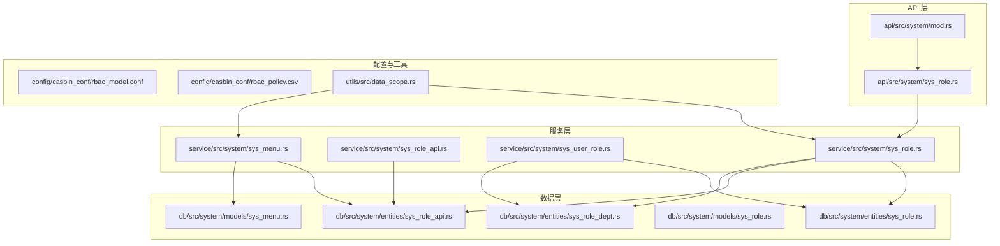
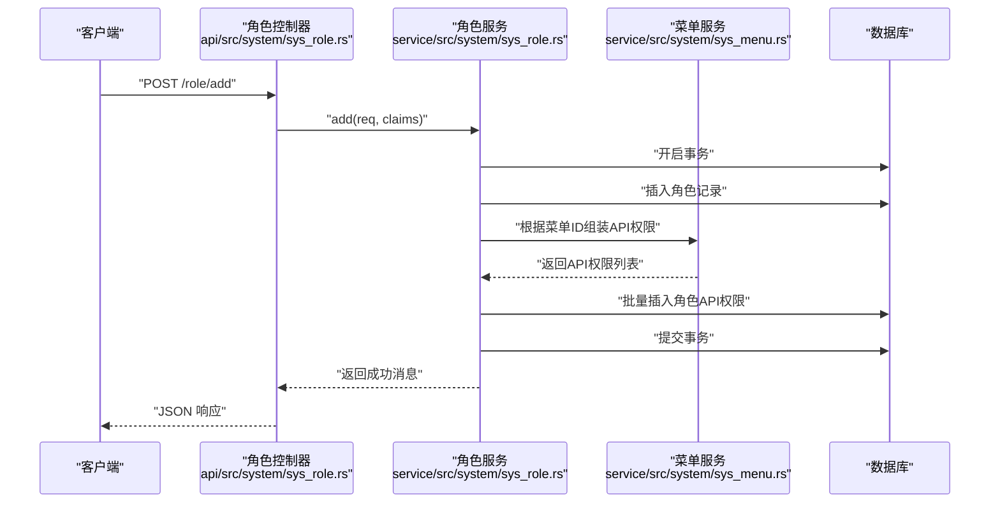
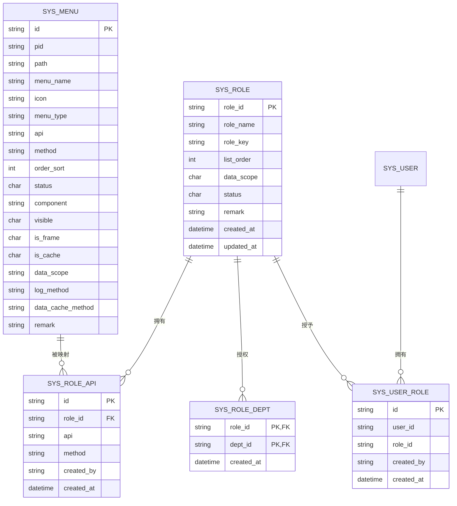
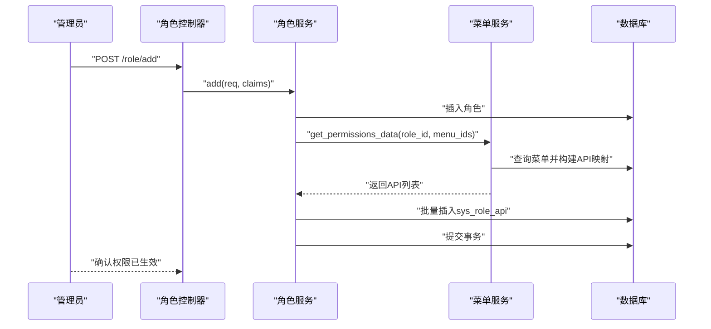
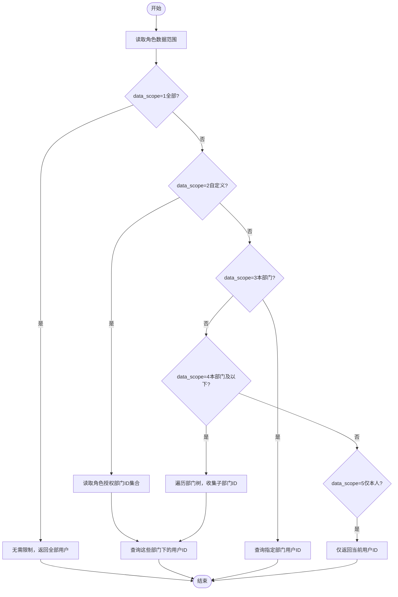
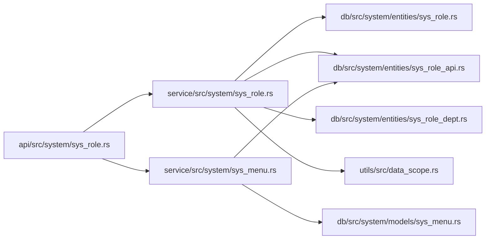

# 角色权限接口

<cite>
**本文引用的文件**
- [api/src/system/sys_role.rs](file://api/src/system/sys_role.rs)
- [service/src/system/sys_role.rs](file://service/src/system/sys_role.rs)
- [service/src/system/sys_role_api.rs](file://service/src/system/sys_role_api.rs)
- [service/src/system/sys_user_role.rs](file://service/src/system/sys_user_role.rs)
- [service/src/system/sys_menu.rs](file://service/src/system/sys_menu.rs)
- [db/src/system/models/sys_role.rs](file://db/src/system/models/sys_role.rs)
- [db/src/system/entities/sys_role.rs](file://db/src/system/entities/sys_role.rs)
- [db/src/system/entities/sys_role_api.rs](file://db/src/system/entities/sys_role_api.rs)
- [db/src/system/entities/sys_role_dept.rs](file://db/src/system/entities/sys_role_dept.rs)
- [db/src/system/models/sys_menu.rs](file://db/src/system/models/sys_menu.rs)
- [api/src/system/mod.rs](file://api/src/system/mod.rs)
- [config/casbin_conf/rbac_model.conf](file://config/casbin_conf/rbac_model.conf)
- [config/casbin_conf/rbac_policy.csv](file://config/casbin_conf/rbac_policy.csv)
- [utils/src/data_scope.rs](file://utils/src/data_scope.rs)
</cite>

## 目录
1. [简介](#简介)
2. [项目结构](#项目结构)
3. [核心组件](#核心组件)
4. [架构总览](#架构总览)
5. [详细组件分析](#详细组件分析)
6. [依赖关系分析](#依赖关系分析)
7. [性能考量](#性能考量)
8. [故障排查指南](#故障排查指南)
9. [结论](#结论)

## 简介
本文件面向 Axum Admin 项目中的“角色权限管理”模块，提供完整、可操作的 API 文档与权限控制机制说明。内容覆盖：
- 角色管理接口：列表查询、详情获取、新增、编辑、状态变更、删除、数据范围设置
- 角色权限分配：菜单权限绑定、API 权限配置
- RBAC 权限模型与 CASBin 控制机制
- 权限验证流程与最佳实践

## 项目结构
角色权限相关代码主要分布在以下层次：
- API 层：负责路由注册与请求处理
- Service 层：封装业务逻辑、事务控制、权限计算
- DB 层：实体与模型定义，提供数据访问与查询
- 配置层：CASBin 模型与策略文件
- 工具层：数据范围计算工具

图表来源
- [api/src/system/sys_role.rs](file://api/src/system/sys_role.rs#L1-L200)
- [api/src/system/mod.rs](file://api/src/system/mod.rs#L109-L127)
- [service/src/system/sys_role.rs](file://service/src/system/sys_role.rs#L1-L369)
- [service/src/system/sys_role_api.rs](file://service/src/system/sys_role_api.rs#L1-L52)
- [service/src/system/sys_user_role.rs](file://service/src/system/sys_user_role.rs#L1-L101)
- [service/src/system/sys_menu.rs](file://service/src/system/sys_menu.rs#L324-L356)
- [db/src/system/entities/sys_role.rs](file://db/src/system/entities/sys_role.rs#L1-L80)
- [db/src/system/entities/sys_role_api.rs](file://db/src/system/entities/sys_role_api.rs#L1-L71)
- [db/src/system/entities/sys_role_dept.rs](file://db/src/system/entities/sys_role_dept.rs#L1-L63)
- [db/src/system/models/sys_role.rs](file://db/src/system/models/sys_role.rs#L1-L75)
- [db/src/system/models/sys_menu.rs](file://db/src/system/models/sys_menu.rs#L1-L147)
- [config/casbin_conf/rbac_model.conf](file://config/casbin_conf/rbac_model.conf#L1-L14)
- [config/casbin_conf/rbac_policy.csv](file://config/casbin_conf/rbac_policy.csv#L1-L5)
- [utils/src/data_scope.rs](file://utils/src/data_scope.rs#L43-L75)

章节来源
- [api/src/system/mod.rs](file://api/src/system/mod.rs#L109-L127)
- [api/src/system/sys_role.rs](file://api/src/system/sys_role.rs#L1-L200)

## 核心组件
- 角色 API 控制器：提供角色 CRUD、状态变更、数据范围设置、角色授权查询等接口
- 角色服务层：实现角色业务逻辑、事务管理、权限数据组装与持久化
- 菜单服务层：提供角色权限（API）查询、菜单树构建、API 与数据库关联查询
- 角色 API 实体：存储角色与 API 的映射关系
- 角色部门实体：存储角色与部门的数据范围映射
- 模型与实体：定义请求/响应结构与数据库表结构
- CASBin 配置：RBAC 模型与策略文件，支持细粒度权限匹配
- 数据范围工具：根据角色数据范围规则生成用户 ID 列表

章节来源
- [service/src/system/sys_role.rs](file://service/src/system/sys_role.rs#L25-L369)
- [service/src/system/sys_menu.rs](file://service/src/system/sys_menu.rs#L324-L356)
- [db/src/system/models/sys_role.rs](file://db/src/system/models/sys_role.rs#L1-L75)
- [db/src/system/entities/sys_role_api.rs](file://db/src/system/entities/sys_role_api.rs#L1-L71)
- [db/src/system/entities/sys_role_dept.rs](file://db/src/system/entities/sys_role_dept.rs#L1-L63)
- [config/casbin_conf/rbac_model.conf](file://config/casbin_conf/rbac_model.conf#L1-L14)
- [config/casbin_conf/rbac_policy.csv](file://config/casbin_conf/rbac_policy.csv#L1-L5)
- [utils/src/data_scope.rs](file://utils/src/data_scope.rs#L43-L75)

## 架构总览
Axum Admin 的角色权限采用“API 层 → 服务层 → 数据层”的清晰分层，配合 CASBin 的 RBAC 模型实现细粒度权限控制。

图表来源
- [api/src/system/sys_role.rs](file://api/src/system/sys_role.rs#L27-L34)
- [service/src/system/sys_role.rs](file://service/src/system/sys_role.rs#L87-L105)
- [service/src/system/sys_menu.rs](file://service/src/system/sys_menu.rs#L108-L127)

## 详细组件分析

### 接口清单与规范

- 获取角色列表
  - 方法与路径：GET /role/list
  - 查询参数：分页参数、角色名称、角色键、状态、时间范围等
  - 返回：分页列表数据
  - 章节来源
    - [api/src/system/sys_role.rs](file://api/src/system/sys_role.rs#L16-L23)
    - [service/src/system/sys_role.rs](file://service/src/system/sys_role.rs#L25-L78)
    - [db/src/system/models/sys_role.rs](file://db/src/system/models/sys_role.rs#L4-L13)

- 获取全部角色
  - 方法与路径：GET /role/get_all
  - 返回：所有角色列表
  - 章节来源
    - [api/src/system/sys_role.rs](file://api/src/system/sys_role.rs#L92-L99)
    - [service/src/system/sys_role.rs](file://service/src/system/sys_role.rs#L302-L312)

- 获取角色详情
  - 方法与路径：GET /role/get_by_id
  - 查询参数：role_id
  - 返回：角色详情
  - 章节来源
    - [api/src/system/sys_role.rs](file://api/src/system/sys_role.rs#L81-L88)
    - [service/src/system/sys_role.rs](file://service/src/system/sys_role.rs#L283-L300)

- 新增角色
  - 方法与路径：POST /role/add
  - 请求体：角色基本信息 + 菜单ID集合
  - 行为：校验唯一性、开启事务、插入角色、根据菜单组装 API 权限并入库
  - 章节来源
    - [api/src/system/sys_role.rs](file://api/src/system/sys_role.rs#L27-L34)
    - [service/src/system/sys_role.rs](file://service/src/system/sys_role.rs#L87-L105)
    - [service/src/system/sys_menu.rs](file://service/src/system/sys_menu.rs#L108-L127)

- 更新角色
  - 方法与路径：PUT /role/edit
  - 请求体：角色ID + 更新字段 + 菜单ID集合
  - 行为：校验唯一性、开启事务、更新角色、删除旧权限、重新生成并插入新权限
  - 章节来源
    - [api/src/system/sys_role.rs](file://api/src/system/sys_role.rs#L49-L56)
    - [service/src/system/sys_role.rs](file://service/src/system/sys_role.rs#L186-L225)

- 设置角色状态
  - 方法与路径：PUT /role/change_status
  - 请求体：role_id + status
  - 行为：更新角色状态
  - 章节来源
    - [api/src/system/sys_role.rs](file://api/src/system/sys_role.rs#L60-L67)
    - [service/src/system/sys_role.rs](file://service/src/system/sys_role.rs#L227-L243)

- 删除角色
  - 方法与路径：DELETE /role/delete
  - 请求体：role_ids 数组
  - 行为：开启事务、删除角色、删除角色API权限、删除角色部门权限
  - 章节来源
    - [api/src/system/sys_role.rs](file://api/src/system/sys_role.rs#L38-L45)
    - [service/src/system/sys_role.rs](file://service/src/system/sys_role.rs#L148-L169)

- 设置角色数据范围
  - 方法与路径：PUT /role/set_data_scope
  - 请求体：role_id + data_scope + dept_ids（当 data_scope=2 时必填）
  - 行为：更新角色数据范围；若为自定义数据范围，则清空旧部门权限并批量插入新部门权限
  - 章节来源
    - [api/src/system/sys_role.rs](file://api/src/system/sys_role.rs#L70-L77)
    - [service/src/system/sys_role.rs](file://service/src/system/sys_role.rs#L245-L281)
    - [db/src/system/entities/sys_role_dept.rs](file://db/src/system/entities/sys_role_dept.rs#L1-L63)

- 获取角色菜单权限（API）
  - 方法与路径：GET /role/get_role_menu
  - 查询参数：role_id
  - 返回：角色授权的菜单API列表
  - 章节来源
    - [api/src/system/sys_role.rs](file://api/src/system/sys_role.rs#L103-L115)
    - [service/src/system/sys_menu.rs](file://service/src/system/sys_menu.rs#L324-L356)

- 获取角色部门权限
  - 方法与路径：GET /role/get_role_dept
  - 查询参数：role_id
  - 返回：角色授权的部门ID列表
  - 章节来源
    - [api/src/system/sys_role.rs](file://api/src/system/sys_role.rs#L119-L131)
    - [service/src/system/sys_dept.rs](file://service/src/system/sys_dept.rs#L1-L200)

### 数据模型与实体

图表来源
- [db/src/system/entities/sys_role.rs](file://db/src/system/entities/sys_role.rs#L15-L26)
- [db/src/system/entities/sys_role_api.rs](file://db/src/system/entities/sys_role_api.rs#L15-L23)
- [db/src/system/entities/sys_role_dept.rs](file://db/src/system/entities/sys_role_dept.rs#L15-L20)
- [db/src/system/entities/sys_menu.rs](file://db/src/system/entities/sys_menu.rs#L1-L200)
- [db/src/system/entities/sys_user_role.rs](file://db/src/system/entities/sys_user_role.rs#L1-L200)

章节来源
- [db/src/system/entities/sys_role.rs](file://db/src/system/entities/sys_role.rs#L1-L80)
- [db/src/system/entities/sys_role_api.rs](file://db/src/system/entities/sys_role_api.rs#L1-L71)
- [db/src/system/entities/sys_role_dept.rs](file://db/src/system/entities/sys_role_dept.rs#L1-L63)
- [db/src/system/models/sys_role.rs](file://db/src/system/models/sys_role.rs#L1-L75)
- [db/src/system/models/sys_menu.rs](file://db/src/system/models/sys_menu.rs#L1-L147)

### 权限分配与 API 权限配置流程

图表来源
- [api/src/system/sys_role.rs](file://api/src/system/sys_role.rs#L27-L34)
- [service/src/system/sys_role.rs](file://service/src/system/sys_role.rs#L87-L127)
- [service/src/system/sys_menu.rs](file://service/src/system/sys_menu.rs#L108-L127)

章节来源
- [service/src/system/sys_role_api.rs](file://service/src/system/sys_role_api.rs#L6-L35)
- [service/src/system/sys_menu.rs](file://service/src/system/sys_menu.rs#L108-L127)

### 数据范围设置流程

图表来源
- [service/src/system/sys_role.rs](file://service/src/system/sys_role.rs#L245-L281)
- [utils/src/data_scope.rs](file://utils/src/data_scope.rs#L43-L75)

章节来源
- [service/src/system/sys_role.rs](file://service/src/system/sys_role.rs#L245-L281)
- [utils/src/data_scope.rs](file://utils/src/data_scope.rs#L43-L75)

### CASBin 权限控制机制与 RBAC 应用
- RBAC 模型定义
  - 请求三元组：sub（主体）、obj（对象）、act（动作）
  - 策略三元组：p 子规则（sub, obj, act）
  - 角色继承关系：g（角色关系）
  - 匹配器：g(sub, p.sub) ∧ obj == p.obj ∧ act == p.act
- 策略示例
  - p, alice, data1, read
  - p, bob, data2, write
  - p, data2_admin, data2, read
  - p, data2_admin, data2, write
  - g, alice, data2_admin
- 在 Axum Admin 中的应用
  - API 层在鉴权时使用 CASBin 模型进行匹配，结合角色数据范围与菜单/API 权限，实现细粒度访问控制
  - 策略文件可动态加载或预置，便于集中管理权限规则

章节来源
- [config/casbin_conf/rbac_model.conf](file://config/casbin_conf/rbac_model.conf#L1-L14)
- [config/casbin_conf/rbac_policy.csv](file://config/casbin_conf/rbac_policy.csv#L1-L5)

### 角色与用户授权接口（扩展建议）
- 更新用户角色授权
  - 方法与路径：PUT /role/update_auth_role
  - 请求体：user_id + role_ids
  - 行为：删除用户旧角色，批量插入新角色
- 批量用户角色授权
  - 方法与路径：PUT /role/add_auth_user
  - 请求体：user_ids + role_id
  - 行为：为多个用户批量授予同一角色
- 批量取消用户角色授权
  - 方法与路径：PUT /role/cancel_auth_user
  - 请求体：user_ids + role_id
  - 行为：移除指定用户的某角色授权，并清理用户表中的默认角色字段

章节来源
- [service/src/system/sys_user_role.rs](file://service/src/system/sys_user_role.rs#L7-L101)
- [api/src/system/sys_role.rs](file://api/src/system/sys_role.rs#L173-L199)

## 依赖关系分析

图表来源
- [api/src/system/sys_role.rs](file://api/src/system/sys_role.rs#L1-L200)
- [service/src/system/sys_role.rs](file://service/src/system/sys_role.rs#L1-L369)
- [service/src/system/sys_menu.rs](file://service/src/system/sys_menu.rs#L1-L499)
- [db/src/system/entities/sys_role.rs](file://db/src/system/entities/sys_role.rs#L1-L80)
- [db/src/system/entities/sys_role_api.rs](file://db/src/system/entities/sys_role_api.rs#L1-L71)
- [db/src/system/entities/sys_role_dept.rs](file://db/src/system/entities/sys_role_dept.rs#L1-L63)
- [db/src/system/models/sys_menu.rs](file://db/src/system/models/sys_menu.rs#L1-L147)
- [utils/src/data_scope.rs](file://utils/src/data_scope.rs#L43-L75)

章节来源
- [api/src/system/sys_role.rs](file://api/src/system/sys_role.rs#L1-L200)
- [service/src/system/sys_role.rs](file://service/src/system/sys_role.rs#L1-L369)
- [service/src/system/sys_menu.rs](file://service/src/system/sys_menu.rs#L1-L499)

## 性能考量
- 分页查询：角色列表与菜单列表均支持分页，避免一次性加载大量数据
- 事务边界：新增/编辑角色、删除角色等操作使用事务保证一致性，减少中间态
- 子查询与批量操作：角色API权限与角色部门权限采用批量插入/删除，降低多次往返
- 菜单权限查询：通过子查询快速定位角色授权的API，减少应用层过滤成本
- CASBin 匹配：在高并发场景下建议缓存常用策略或采用策略预热，降低匹配开销

## 故障排查指南
- 新增角色报“数据已存在”
  - 检查角色名称或角色键是否重复
  - 章节来源
    - [service/src/system/sys_role.rs](file://service/src/system/sys_role.rs#L87-L92)
- 编辑角色报“数据已存在”
  - 检查更新后的角色名称/键是否与其它角色冲突
  - 章节来源
    - [service/src/system/sys_role.rs](file://service/src/system/sys_role.rs#L186-L191)
- 删除角色失败
  - 确认传入的 role_ids 是否存在；事务提交前会返回受影响行数
  - 章节来源
    - [service/src/system/sys_role.rs](file://service/src/system/sys_role.rs#L148-L169)
- 设置数据范围后权限不生效
  - 确认 data_scope 值与授权部门列表是否正确；自定义范围需确保部门权限已重建
  - 章节来源
    - [service/src/system/sys_role.rs](file://service/src/system/sys_role.rs#L245-L281)
- 获取角色菜单权限为空
  - 确认角色是否已绑定菜单；检查 sys_role_api 表中是否存在对应记录
  - 章节来源
    - [service/src/system/sys_menu.rs](file://service/src/system/sys_menu.rs#L324-L356)

## 结论
Axum Admin 的角色权限体系以清晰的分层设计为基础，结合 CASBin 的 RBAC 模型与灵活的数据范围策略，实现了从角色管理到权限分配、从菜单绑定到 API 控制的完整闭环。通过事务化处理与批量操作优化，系统在保证一致性的同时兼顾性能。建议在生产环境中配合缓存与策略预热，进一步提升权限判定效率与稳定性。