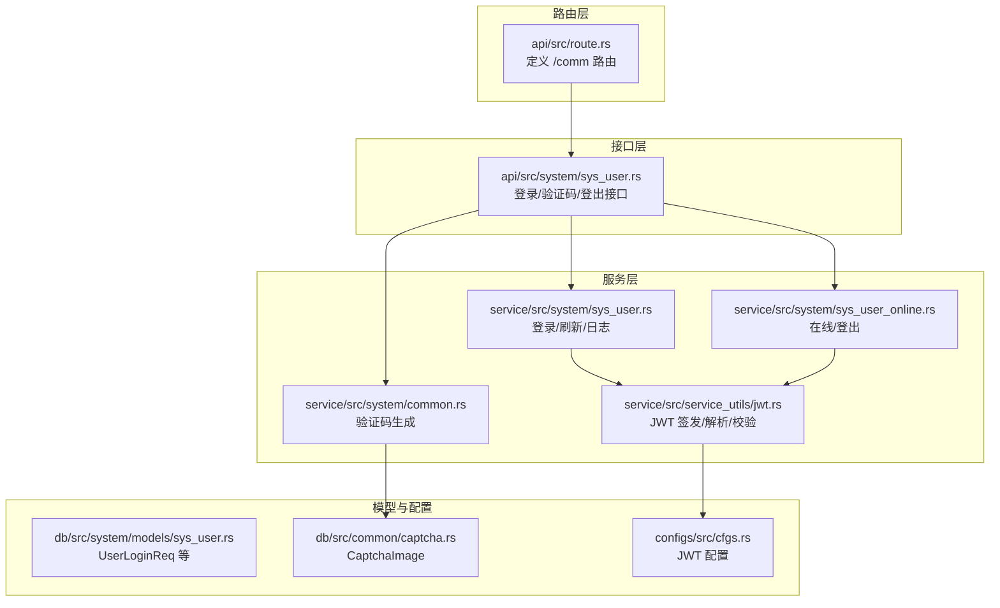
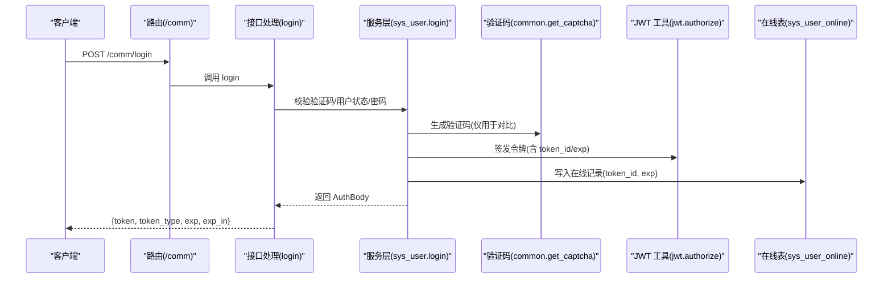
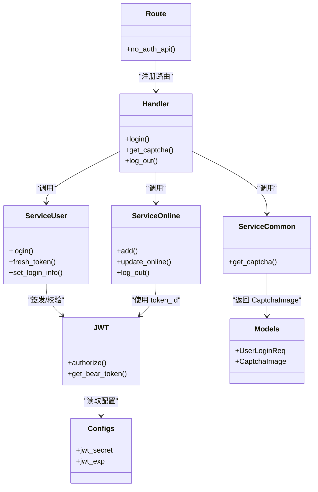

# 认证接口

<cite>
**本文引用的文件**
- [api/src/route.rs](file://api/src/route.rs)
- [api/src/system/sys_user.rs](file://api/src/system/sys_user.rs)
- [service/src/system/sys_user.rs](file://service/src/system/sys_user.rs)
- [service/src/system/common.rs](file://service/src/system/common.rs)
- [service/src/system/sys_user_online.rs](file://service/src/system/sys_user_online.rs)
- [service/src/service_utils/jwt.rs](file://service/src/service_utils/jwt.rs)
- [db/src/system/models/sys_user.rs](file://db/src/system/models/sys_user.rs)
- [db/src/common/captcha.rs](file://db/src/common/captcha.rs)
- [configs/src/cfgs.rs](file://configs/src/cfgs.rs)
</cite>

## 目录
1. [简介](#简介)
2. [项目结构](#项目结构)
3. [核心组件](#核心组件)
4. [架构总览](#架构总览)
5. [详细组件分析](#详细组件分析)
6. [依赖关系分析](#依赖关系分析)
7. [性能与安全考虑](#性能与安全考虑)
8. [故障排查指南](#故障排查指南)
9. [结论](#结论)

## 简介
本文件面向 Axum Admin 项目的“无需授权的通用认证接口”，涵盖以下接口：
- 用户登录
- 获取验证码
- 退出登录（登出）

文档将详细说明每个接口的 HTTP 方法、URL 路径、请求参数、响应格式、错误码及使用示例，并解释 JWT 令牌生成机制、验证码验证流程与会话管理策略，帮助开发者正确实现用户认证功能。

## 项目结构
认证相关能力由三层协作完成：
- 路由层：定义无需授权的公共路由（/comm/*）
- 接口层：暴露具体 API 处理函数
- 服务层：执行业务逻辑（登录校验、验证码生成、在线状态维护、JWT 签发）
- 工具与模型：JWT 工具、验证码模型、系统配置

图表来源
- [api/src/route.rs](file://api/src/route.rs#L24-L30)
- [api/src/system/sys_user.rs](file://api/src/system/sys_user.rs#L96-L104)
- [service/src/system/sys_user.rs](file://service/src/system/sys_user.rs#L510-L568)
- [service/src/system/common.rs](file://service/src/system/common.rs#L8-L17)
- [service/src/system/sys_user_online.rs](file://service/src/system/sys_user_online.rs#L93-L97)
- [service/src/service_utils/jwt.rs](file://service/src/service_utils/jwt.rs#L105-L121)
- [db/src/system/models/sys_user.rs](file://db/src/system/models/sys_user.rs#L106-L115)
- [db/src/common/captcha.rs](file://db/src/common/captcha.rs#L3-L8)
- [configs/src/cfgs.rs](file://configs/src/cfgs.rs#L74-L81)

章节来源
- [api/src/route.rs](file://api/src/route.rs#L12-L30)
- [api/src/system/sys_user.rs](file://api/src/system/sys_user.rs#L96-L104)

## 核心组件
- 路由注册：在 /comm 下注册无需授权的登录、验证码、登出接口
- 接口函数：对应处理登录、验证码、登出的请求
- 服务逻辑：登录时进行验证码校验、用户状态检查、签发 JWT 并记录在线状态；验证码生成采用随机文本与 UUID 映射；登出通过删除在线记录实现
- JWT 工具：签发带过期时间的令牌，解析时校验签名与过期；支持从 Authorization 头中拆分 token 与 token_id
- 配置：JWT 密钥与过期分钟数来自配置

章节来源
- [api/src/route.rs](file://api/src/route.rs#L24-L30)
- [service/src/service_utils/jwt.rs](file://service/src/service_utils/jwt.rs#L105-L121)
- [configs/src/cfgs.rs](file://configs/src/cfgs.rs#L74-L81)

## 架构总览
下面以序列图展示“登录”流程的关键步骤。

图表来源
- [api/src/route.rs](file://api/src/route.rs#L27-L28)
- [api/src/system/sys_user.rs](file://api/src/system/sys_user.rs#L96-L104)
- [service/src/system/sys_user.rs](file://service/src/system/sys_user.rs#L510-L568)
- [service/src/system/common.rs](file://service/src/system/common.rs#L8-L17)
- [service/src/service_utils/jwt.rs](file://service/src/service_utils/jwt.rs#L105-L121)
- [service/src/system/sys_user_online.rs](file://service/src/system/sys_user_online.rs#L99-L124)

## 详细组件分析

### 1) 用户登录
- HTTP 方法与路径
  - 方法：POST
  - 路径：/comm/login
- 请求体参数
  - 字段：user_name、user_password、code、uuid
  - 类型：字符串
  - 必填：是
  - 说明：code 为用户输入的验证码文本，uuid 为上一步获取验证码返回的 uuid
- 响应体字段
  - token：拼接后的访问令牌（前半部分为 JWT，后半部分为 token_id）
  - token_type：固定为 Bearer
  - exp：过期时间戳（秒）
  - exp_in：过期时长（分钟）
- 错误码
  - 400：缺少凭据或无效 token
  - 401：凭据错误、账户已退出
  - 500：令牌创建失败
- 使用示例
  - 获取验证码后，携带 uuid 与验证码 code 进行登录
  - 登录成功后，将 token 存储于本地并在后续请求头中携带 Authorization: Bearer <token>
- 关键流程
  - 验证码校验：将 code 经加密算法得到的值与 uuid 对比
  - 用户状态检查：若用户被禁用则拒绝登录
  - 密码校验：对 user_password 进行加密后与数据库存储比对
  - 签发 JWT：生成 token_id 与 JWT，合并为最终 token
  - 写入在线：记录 token_id、exp、用户信息
  - 登录日志：异步写入登录日志

章节来源
- [api/src/route.rs](file://api/src/route.rs#L27-L28)
- [api/src/system/sys_user.rs](file://api/src/system/sys_user.rs#L96-L104)
- [service/src/system/sys_user.rs](file://service/src/system/sys_user.rs#L510-L568)
- [db/src/system/models/sys_user.rs](file://db/src/system/models/sys_user.rs#L106-L115)
- [service/src/service_utils/jwt.rs](file://service/src/service_utils/jwt.rs#L105-L121)
- [service/src/system/sys_user_online.rs](file://service/src/system/sys_user_online.rs#L99-L124)

### 2) 获取验证码
- HTTP 方法与路径
  - 方法：GET
  - 路径：/comm/get_captcha
- 响应体字段
  - captcha_on_off：验证码开关（布尔）
  - uuid：验证码唯一标识（用于登录时校验）
  - img：Base64 图像字符串
- 使用示例
  - 先调用此接口获取验证码图片与 uuid
  - 在登录时提交 user_name、user_password、code、uuid
- 注意事项
  - 验证码有效期与业务策略相关，建议前端在输入框显示图片并提示用户输入

章节来源
- [api/src/route.rs](file://api/src/route.rs#L28-L28)
- [service/src/system/common.rs](file://service/src/system/common.rs#L8-L17)
- [db/src/common/captcha.rs](file://db/src/common/captcha.rs#L3-L8)

### 3) 退出登录（登出）
- HTTP 方法与路径
  - 方法：POST
  - 路径：/comm/log_out
- 请求头
  - Authorization: Bearer <token>（需携带有效 token）
- 响应体字段
  - 成功消息：字符串
- 错误码
  - 400：缺少凭据或无效 token
  - 401：账户已退出或令牌无效
- 使用示例
  - 携带 Authorization 头调用登出接口
  - 后续所有携带该 token 的请求将被视为无效
- 关键流程
  - 从 Authorization 头中提取 token 与 token_id
  - 校验 token 是否仍在线（未被登出）
  - 删除在线表中的对应记录
  - 返回成功消息

章节来源
- [api/src/route.rs](file://api/src/route.rs#L29-L29)
- [api/src/system/sys_user_online.rs](file://api/src/system/sys_user_online.rs#L35-L42)
- [service/src/system/sys_user_online.rs](file://service/src/system/sys_user_online.rs#L93-L97)
- [service/src/service_utils/jwt.rs](file://service/src/service_utils/jwt.rs#L96-L103)

### 4) JWT 令牌生成机制
- 签发流程
  - 生成 token_id（UUID 风格）
  - 构造 Claims：包含 id、token_id、name、exp
  - 使用配置的密钥与过期时间签发 JWT
  - 将 JWT 与 token_id 拼接作为最终 token 返回
- 解析与校验
  - 从 Authorization 头中分离 JWT 与 token_id
  - 解码并校验签名与过期时间
  - 查询在线表确认 token_id 仍在有效期内
- 配置项
  - jwt_secret：JWT 密钥
  - jwt_exp：过期分钟数

章节来源
- [service/src/service_utils/jwt.rs](file://service/src/service_utils/jwt.rs#L105-L121)
- [service/src/service_utils/jwt.rs](file://service/src/service_utils/jwt.rs#L54-L94)
- [configs/src/cfgs.rs](file://configs/src/cfgs.rs#L74-L81)

### 5) 验证码验证流程
- 生成
  - 服务层生成指定长度与尺寸的验证码图片与文本
  - 将文本经加密算法得到 uuid
  - 返回 captcha_on_off、uuid、img
- 校验
  - 登录时将用户输入的 code 经相同加密算法得到值并与 uuid 比较
  - 若不一致则拒绝登录并记录登录日志

章节来源
- [service/src/system/common.rs](file://service/src/system/common.rs#L8-L17)
- [service/src/system/sys_user.rs](file://service/src/system/sys_user.rs#L513-L519)
- [db/src/common/captcha.rs](file://db/src/common/captcha.rs#L3-L8)

### 6) 会话管理策略
- 在线状态
  - 登录成功后将 token_id、exp、用户信息写入在线表
  - 登出时删除对应记录
- 令牌失效
  - 解析阶段会检查 token_id 是否仍在在线表中
  - 若不在，则判定为“账户已退出”
- 过期清理
  - 后台任务定期扫描在线表，删除过期记录

章节来源
- [service/src/system/sys_user_online.rs](file://service/src/system/sys_user_online.rs#L93-L136)
- [service/src/service_utils/jwt.rs](file://service/src/service_utils/jwt.rs#L64-L73)

## 依赖关系分析

图表来源
- [api/src/route.rs](file://api/src/route.rs#L24-L30)
- [api/src/system/sys_user.rs](file://api/src/system/sys_user.rs#L96-L104)
- [service/src/system/sys_user.rs](file://service/src/system/sys_user.rs#L510-L568)
- [service/src/system/common.rs](file://service/src/system/common.rs#L8-L17)
- [service/src/system/sys_user_online.rs](file://service/src/system/sys_user_online.rs#L93-L136)
- [service/src/service_utils/jwt.rs](file://service/src/service_utils/jwt.rs#L105-L121)
- [db/src/system/models/sys_user.rs](file://db/src/system/models/sys_user.rs#L106-L115)
- [db/src/common/captcha.rs](file://db/src/common/captcha.rs#L3-L8)
- [configs/src/cfgs.rs](file://configs/src/cfgs.rs#L74-L81)

## 性能与安全考虑
- 验证码生成
  - 使用内存中随机生成的图片与文本，避免频繁 IO
- 登录校验
  - 密码与用户状态检查在单事务内完成，减少并发问题
- JWT 过期
  - 通过配置控制过期时间，建议结合刷新接口使用
- 令牌存储
  - token_id 与 JWT 拼接，便于解析与校验
- 在线表清理
  - 后台任务定期清理过期在线记录，避免表膨胀

## 故障排查指南
- 登录失败
  - 验证码错误：确认 code 与 uuid 匹配
  - 用户被禁用：检查用户状态
  - 密码错误：确认加密算法一致
- 令牌无效
  - 检查 Authorization 头格式是否为 Bearer
  - 确认 token 未过期且未被登出
- 登出后仍可访问
  - 确认在线表中 token_id 已被删除
  - 检查后台任务是否正常运行

章节来源
- [service/src/service_utils/jwt.rs](file://service/src/service_utils/jwt.rs#L123-L145)
- [service/src/system/sys_user_online.rs](file://service/src/system/sys_user_online.rs#L93-L97)

## 结论
Axum Admin 的认证接口围绕“无需授权的通用认证”设计，通过验证码与 JWT 双重保障实现安全登录，并以在线表与后台任务维持会话生命周期。开发者可按本文档的接口规范与流程实现登录、验证码与登出功能，并结合配置项调整安全策略与过期时间。