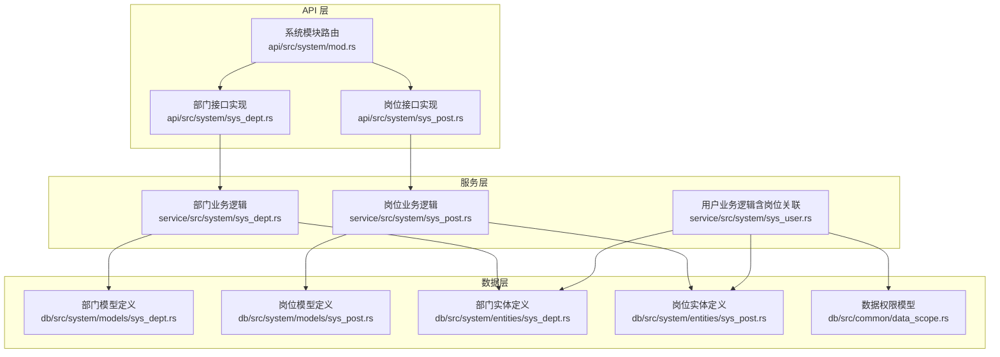
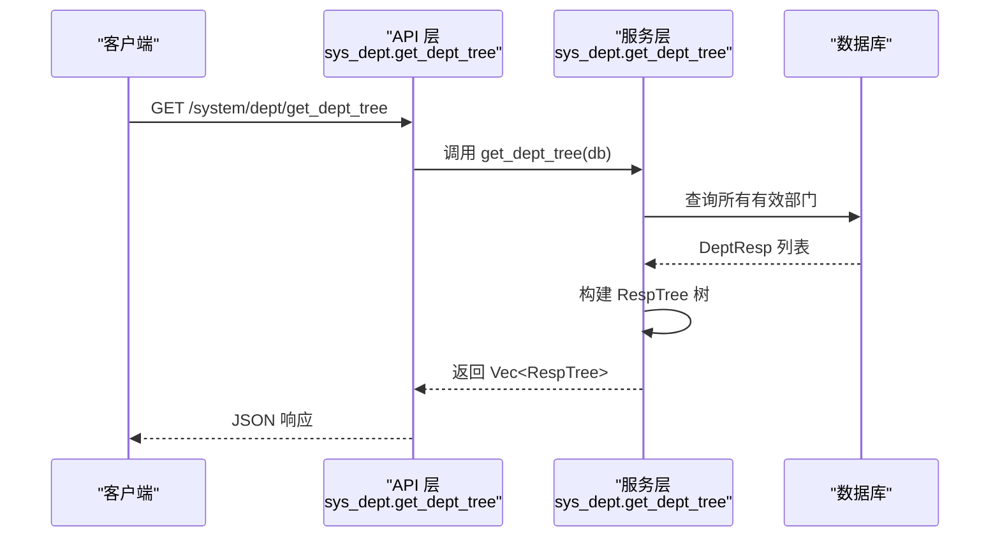
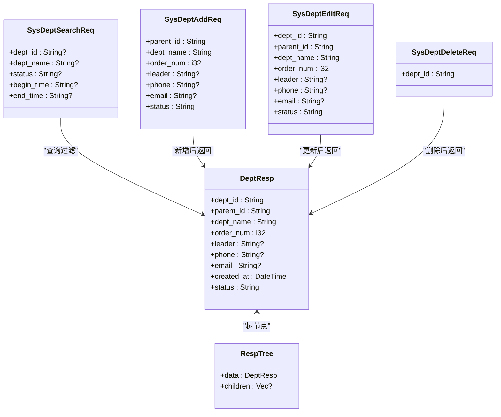
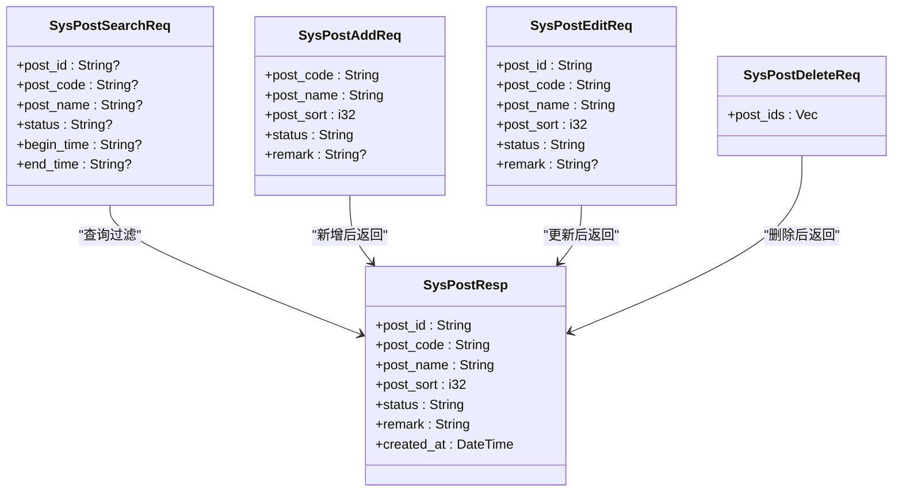
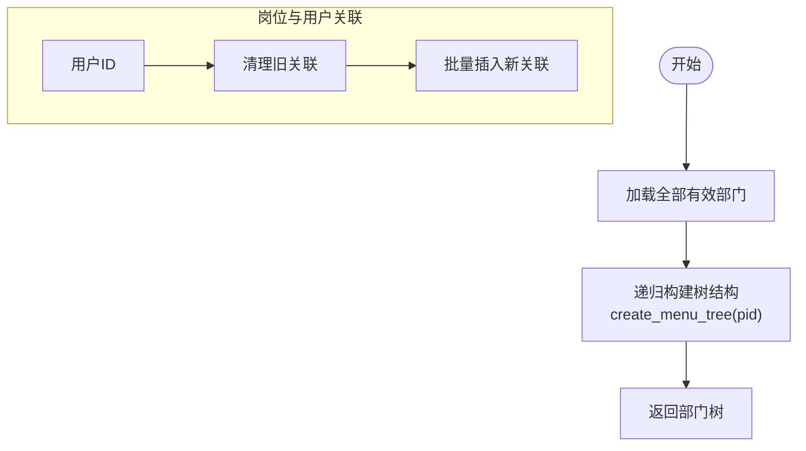
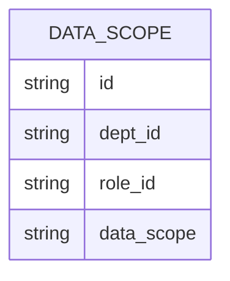
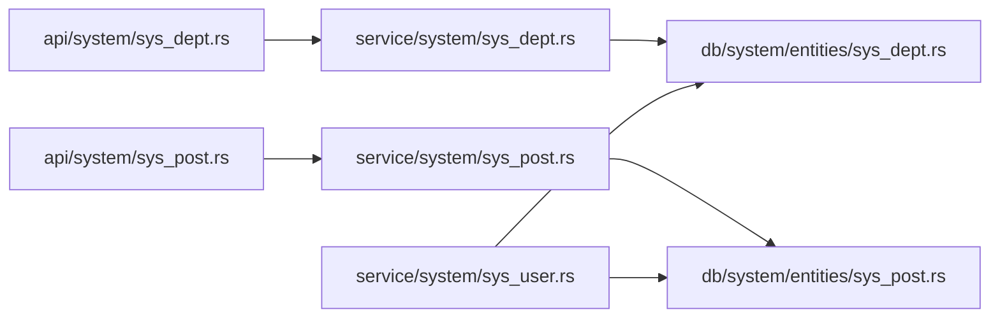

# 部门岗位接口

<cite>
**本文引用的文件**
- [api/src/system/mod.rs](file://api/src/system/mod.rs)
- [api/src/system/sys_dept.rs](file://api/src/system/sys_dept.rs)
- [api/src/system/sys_post.rs](file://api/src/system/sys_post.rs)
- [service/src/system/sys_dept.rs](file://service/src/system/sys_dept.rs)
- [service/src/system/sys_post.rs](file://service/src/system/sys_post.rs)
- [db/src/system/models/sys_dept.rs](file://db/src/system/models/sys_dept.rs)
- [db/src/system/models/sys_post.rs](file://db/src/system/models/sys_post.rs)
- [db/src/system/entities/sys_dept.rs](file://db/src/system/entities/sys_dept.rs)
- [db/src/system/entities/sys_post.rs](file://db/src/system/entities/sys_post.rs)
- [api/src/route.rs](file://api/src/route.rs)
- [service/src/system/sys_user.rs](file://service/src/system/sys_user.rs)
- [db/src/common/data_scope.rs](file://db/src/common/data_scope.rs)
</cite>

## 目录
1. [简介](#简介)
2. [项目结构](#项目结构)
3. [核心组件](#核心组件)
4. [架构总览](#架构总览)
5. [详细组件分析](#详细组件分析)
6. [依赖关系分析](#依赖关系分析)
7. [性能考量](#性能考量)
8. [故障排查指南](#故障排查指南)
9. [结论](#结论)
10. [附录](#附录)

## 简介
本文件面向 Axum Admin 项目的“部门”与“岗位”管理接口，提供完整的 API 规范、数据模型说明、调用流程与最佳实践。内容覆盖：
- 部门管理：列表查询、树形结构获取、新增、修改、删除
- 岗位管理：列表查询、新增、修改、删除
- 部门组织架构与岗位关联（用户与岗位的多对多关系）
- 数据权限控制相关接口与模型

## 项目结构
系统采用“API 层 → 服务层 → 数据层”的分层设计：
- API 层负责路由注册与请求参数解析
- 服务层封装业务逻辑与数据库事务
- 数据层定义实体、模型与查询结果

图表来源
- [api/src/system/mod.rs](file://api/src/system/mod.rs#L26-L107)
- [api/src/system/sys_dept.rs](file://api/src/system/sys_dept.rs#L1-L92)
- [api/src/system/sys_post.rs](file://api/src/system/sys_post.rs#L1-L82)
- [service/src/system/sys_dept.rs](file://service/src/system/sys_dept.rs#L1-L214)
- [service/src/system/sys_post.rs](file://service/src/system/sys_post.rs#L1-L227)
- [service/src/system/sys_user.rs](file://service/src/system/sys_user.rs#L1-L200)
- [db/src/system/models/sys_dept.rs](file://db/src/system/models/sys_dept.rs#L1-L61)
- [db/src/system/models/sys_post.rs](file://db/src/system/models/sys_post.rs#L1-L48)
- [db/src/system/entities/sys_dept.rs](file://db/src/system/entities/sys_dept.rs#L1-L92)
- [db/src/system/entities/sys_post.rs](file://db/src/system/entities/sys_post.rs#L1-L86)
- [db/src/common/data_scope.rs](file://db/src/common/data_scope.rs#L1-L9)

章节来源
- [api/src/system/mod.rs](file://api/src/system/mod.rs#L26-L107)
- [api/src/route.rs](file://api/src/route.rs#L12-L54)

## 核心组件
- 部门模块：提供部门列表、树形结构、按 ID 查询、新增、修改、删除
- 岗位模块：提供岗位列表、按 ID 查询、新增、修改、删除
- 用户模块：提供用户与岗位的关联维护（批量写入/清理）
- 数据权限：提供数据权限范围模型，用于角色与部门/用户的数据访问控制

章节来源
- [api/src/system/sys_dept.rs](file://api/src/system/sys_dept.rs#L17-L91)
- [api/src/system/sys_post.rs](file://api/src/system/sys_post.rs#L17-L81)
- [service/src/system/sys_user.rs](file://service/src/system/sys_user.rs#L177-L226)
- [db/src/common/data_scope.rs](file://db/src/common/data_scope.rs#L3-L9)

## 架构总览
以下序列图展示“部门树形结构获取”的端到端调用链路。

图表来源
- [api/src/system/sys_dept.rs](file://api/src/system/sys_dept.rs#L84-L91)
- [service/src/system/sys_dept.rs](file://service/src/system/sys_dept.rs#L178-L201)
- [db/src/system/models/sys_dept.rs](file://db/src/system/models/sys_dept.rs#L42-L60)

## 详细组件分析

### 部门管理接口
- 路由前缀：/system/dept
- 支持方法：GET/POST/PUT/DELETE
- 关键接口
  - GET /list：分页查询部门列表
  - GET /get_all：获取全部有效部门
  - GET /get_dept_tree：获取部门树形结构
  - GET /get_by_id：按 ID 查询部门
  - POST /add：新增部门
  - PUT /edit：修改部门
  - DELETE /delete：删除部门

请求与响应模型
- 查询参数：SysDeptSearchReq
- 新增参数：SysDeptAddReq
- 修改参数：SysDeptEditReq
- 删除参数：SysDeptDeleteReq
- 返回模型：DeptResp、RespTree

图表来源
- [db/src/system/models/sys_dept.rs](file://db/src/system/models/sys_dept.rs#L5-L60)
- [db/src/system/entities/sys_dept.rs](file://db/src/system/entities/sys_dept.rs#L15-L30)

章节来源
- [api/src/system/mod.rs](file://api/src/system/mod.rs#L98-L107)
- [api/src/system/sys_dept.rs](file://api/src/system/sys_dept.rs#L17-L91)
- [service/src/system/sys_dept.rs](file://service/src/system/sys_dept.rs#L19-L214)
- [db/src/system/models/sys_dept.rs](file://db/src/system/models/sys_dept.rs#L5-L60)
- [db/src/system/entities/sys_dept.rs](file://db/src/system/entities/sys_dept.rs#L15-L30)

### 岗位管理接口
- 路由前缀：/system/post
- 支持方法：GET/POST/PUT/DELETE
- 关键接口
  - GET /list：分页查询岗位列表
  - GET /get_all：获取全部有效岗位
  - GET /get_by_id：按 ID 查询岗位
  - POST /add：新增岗位
  - PUT /edit：修改岗位
  - DELETE /delete：删除岗位

请求与响应模型
- 查询参数：SysPostSearchReq
- 新增参数：SysPostAddReq
- 修改参数：SysPostEditReq
- 删除参数：SysPostDeleteReq
- 返回模型：SysPostResp

图表来源
- [db/src/system/models/sys_post.rs](file://db/src/system/models/sys_post.rs#L4-L48)
- [db/src/system/entities/sys_post.rs](file://db/src/system/entities/sys_post.rs#L15-L28)

章节来源
- [api/src/system/mod.rs](file://api/src/system/mod.rs#L87-L96)
- [api/src/system/sys_post.rs](file://api/src/system/sys_post.rs#L17-L81)
- [service/src/system/sys_post.rs](file://service/src/system/sys_post.rs#L16-L227)
- [db/src/system/models/sys_post.rs](file://db/src/system/models/sys_post.rs#L4-L48)
- [db/src/system/entities/sys_post.rs](file://db/src/system/entities/sys_post.rs#L15-L28)

### 部门组织架构与岗位关联
- 部门树形结构：通过“父 ID → 子节点”的递归构建，支持前端树形控件渲染
- 岗位与用户关联：用户可拥有多个岗位，通过“用户-岗位”中间表进行多对多维护

图表来源
- [service/src/system/sys_dept.rs](file://service/src/system/sys_dept.rs#L178-L201)
- [service/src/system/sys_post.rs](file://service/src/system/sys_post.rs#L202-L226)

章节来源
- [service/src/system/sys_dept.rs](file://service/src/system/sys_dept.rs#L178-L201)
- [service/src/system/sys_post.rs](file://service/src/system/sys_post.rs#L177-L226)

### 数据权限控制
- 数据权限模型：包含角色、部门、数据范围标识等字段，用于控制用户可见的数据范围
- 典型场景：角色绑定部门集合，从而限制该角色在组织架构中的数据访问边界

图表来源
- [db/src/common/data_scope.rs](file://db/src/common/data_scope.rs#L3-L9)

章节来源
- [db/src/common/data_scope.rs](file://db/src/common/data_scope.rs#L3-L9)

## 依赖关系分析
- API 层依赖服务层提供的业务函数
- 服务层依赖 SeaORM 实体与模型进行数据库操作
- 用户模块与岗位模块存在间接关联（用户-岗位中间表）

图表来源
- [api/src/system/sys_dept.rs](file://api/src/system/sys_dept.rs#L1-L11)
- [api/src/system/sys_post.rs](file://api/src/system/sys_post.rs#L1-L11)
- [service/src/system/sys_dept.rs](file://service/src/system/sys_dept.rs#L3-L13)
- [service/src/system/sys_post.rs](file://service/src/system/sys_post.rs#L3-L11)
- [service/src/system/sys_user.rs](file://service/src/system/sys_user.rs#L4-L18)
- [db/src/system/entities/sys_dept.rs](file://db/src/system/entities/sys_dept.rs#L1-L13)
- [db/src/system/entities/sys_post.rs](file://db/src/system/entities/sys_post.rs#L1-L13)

章节来源
- [api/src/system/mod.rs](file://api/src/system/mod.rs#L26-L107)
- [api/src/route.rs](file://api/src/route.rs#L12-L54)

## 性能考量
- 分页查询：服务层使用分页器与总数统计，避免一次性加载大量数据
- 条件过滤：根据传入参数动态拼接查询条件，减少无效扫描
- 事务处理：新增/编辑等关键操作使用事务，保证一致性
- 树构建：部门树采用一次性加载后内存递归构建，适合中等规模组织架构

## 故障排查指南
- 参数校验
  - 缺少必要参数（如部门 ID、岗位 ID）会导致“参数错误”
- 数据重复
  - 新增或编辑时若名称/编码已存在，会返回“数据已存在”
- 删除失败
  - 若目标记录不存在，删除操作会返回“删除失败,数据不存在”
- 时间范围
  - 日期范围查询会自动补全起止时间，确保查询准确性

章节来源
- [api/src/system/sys_dept.rs](file://api/src/system/sys_dept.rs#L61-L72)
- [service/src/system/sys_dept.rs](file://service/src/system/sys_dept.rs#L79-L107)
- [service/src/system/sys_dept.rs](file://service/src/system/sys_dept.rs#L120-L129)
- [service/src/system/sys_dept.rs](file://service/src/system/sys_dept.rs#L110-L117)
- [api/src/system/sys_post.rs](file://api/src/system/sys_post.rs#L62-L69)
- [service/src/system/sys_post.rs](file://service/src/system/sys_post.rs#L92-L115)
- [service/src/system/sys_post.rs](file://service/src/system/sys_post.rs#L133-L151)
- [service/src/system/sys_post.rs](file://service/src/system/sys_post.rs#L118-L130)

## 结论
本文档梳理了 Axum Admin 的部门与岗位管理接口，明确了各层职责、数据模型与调用流程，并提供了树形结构构建与用户-岗位关联的实现要点。结合数据权限模型，可支撑复杂组织架构下的精细化权限控制。

## 附录

### 接口清单与示例路径
- 部门
  - GET /system/dept/list → [api/src/system/sys_dept.rs](file://api/src/system/sys_dept.rs#L17-L24)
  - GET /system/dept/get_all → [api/src/system/sys_dept.rs](file://api/src/system/sys_dept.rs#L75-L82)
  - GET /system/dept/get_dept_tree → [api/src/system/sys_dept.rs](file://api/src/system/sys_dept.rs#L84-L91)
  - GET /system/dept/get_by_id → [api/src/system/sys_dept.rs](file://api/src/system/sys_dept.rs#L61-L72)
  - POST /system/dept/add → [api/src/system/sys_dept.rs](file://api/src/system/sys_dept.rs#L27-L34)
  - PUT /system/dept/edit → [api/src/system/sys_dept.rs](file://api/src/system/sys_dept.rs#L49-L56)
  - DELETE /system/dept/delete → [api/src/system/sys_dept.rs](file://api/src/system/sys_dept.rs#L38-L45)
- 岗位
  - GET /system/post/list → [api/src/system/sys_post.rs](file://api/src/system/sys_post.rs#L17-L24)
  - GET /system/post/get_all → [api/src/system/sys_post.rs](file://api/src/system/sys_post.rs#L74-L81)
  - GET /system/post/get_by_id → [api/src/system/sys_post.rs](file://api/src/system/sys_post.rs#L62-L69)
  - POST /system/post/add → [api/src/system/sys_post.rs](file://api/src/system/sys_post.rs#L28-L35)
  - PUT /system/post/edit → [api/src/system/sys_post.rs](file://api/src/system/sys_post.rs#L50-L57)
  - DELETE /system/post/delete → [api/src/system/sys_post.rs](file://api/src/system/sys_post.rs#L39-L46)

### 数据模型参考
- 部门模型：[db/src/system/models/sys_dept.rs](file://db/src/system/models/sys_dept.rs#L5-L60)
- 岗位模型：[db/src/system/models/sys_post.rs](file://db/src/system/models/sys_post.rs#L4-L48)
- 实体定义：[db/src/system/entities/sys_dept.rs](file://db/src/system/entities/sys_dept.rs#L15-L30), [db/src/system/entities/sys_post.rs](file://db/src/system/entities/sys_post.rs#L15-L28)
- 数据权限模型：[db/src/common/data_scope.rs](file://db/src/common/data_scope.rs#L3-L9)