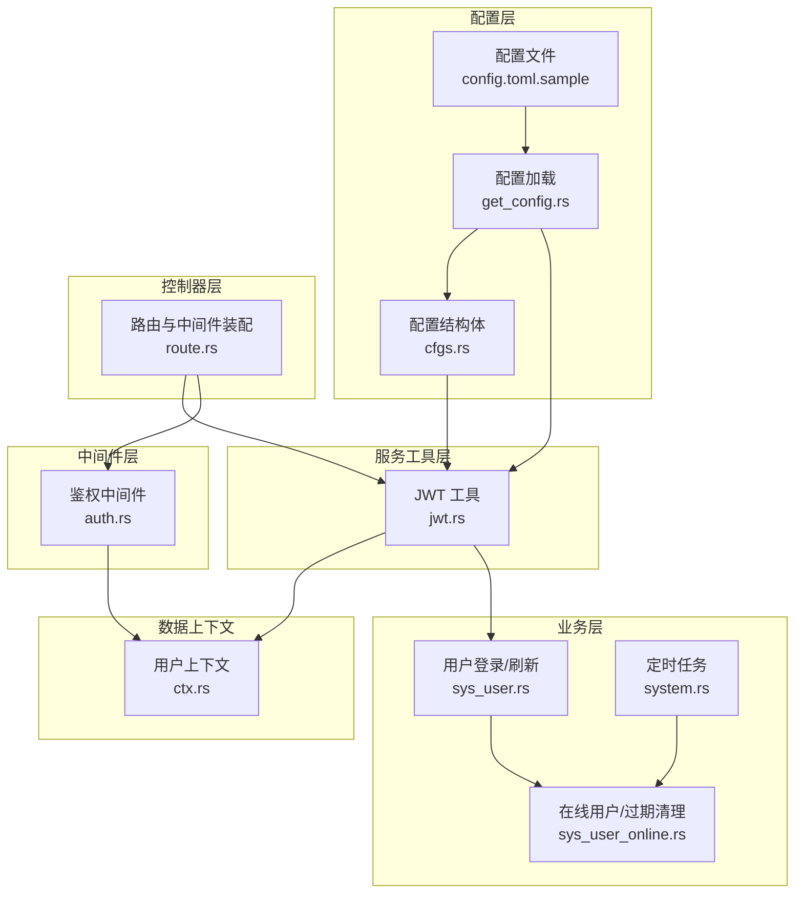
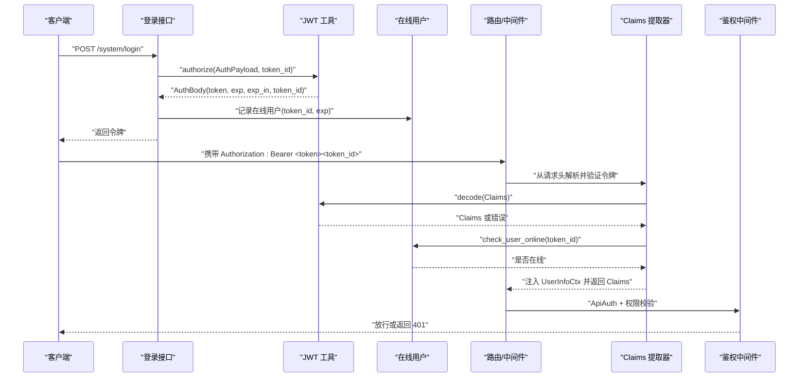
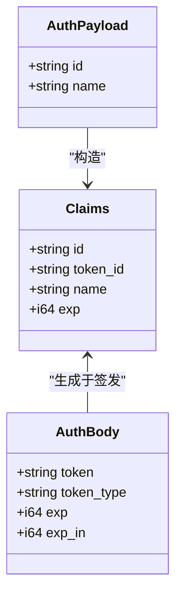
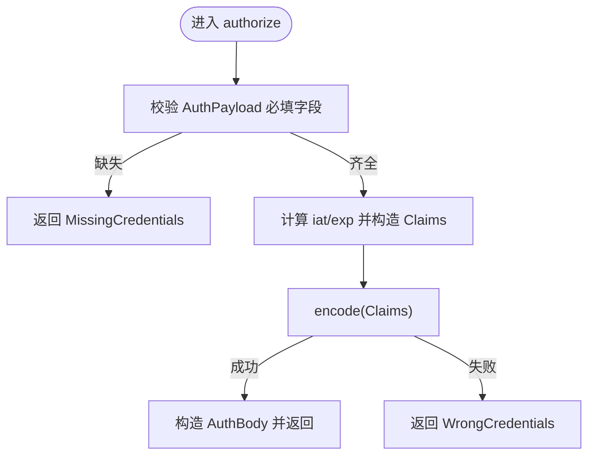
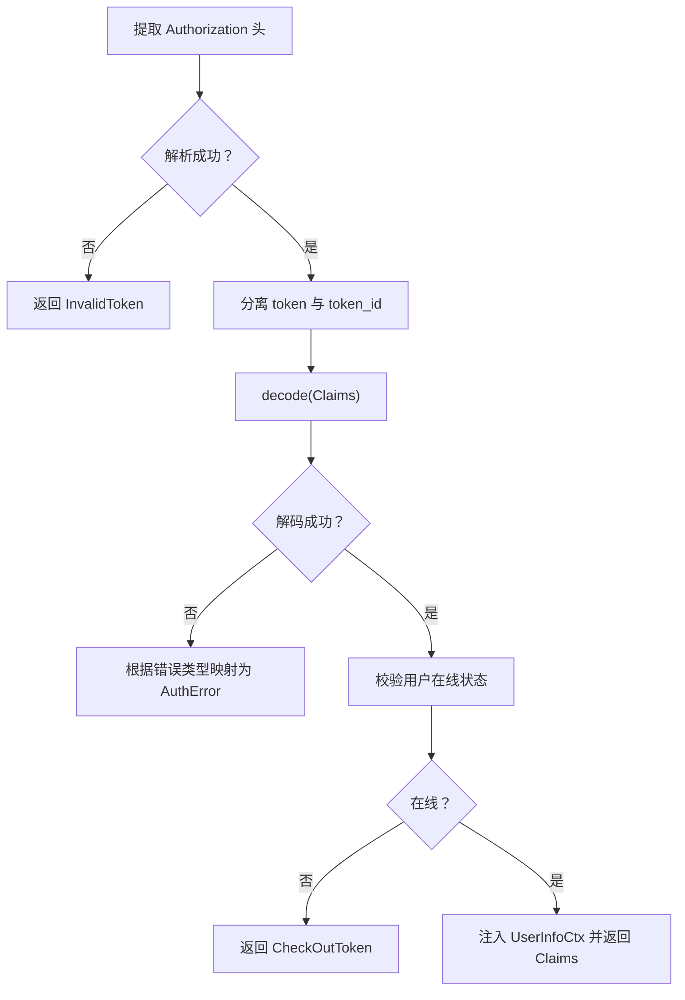
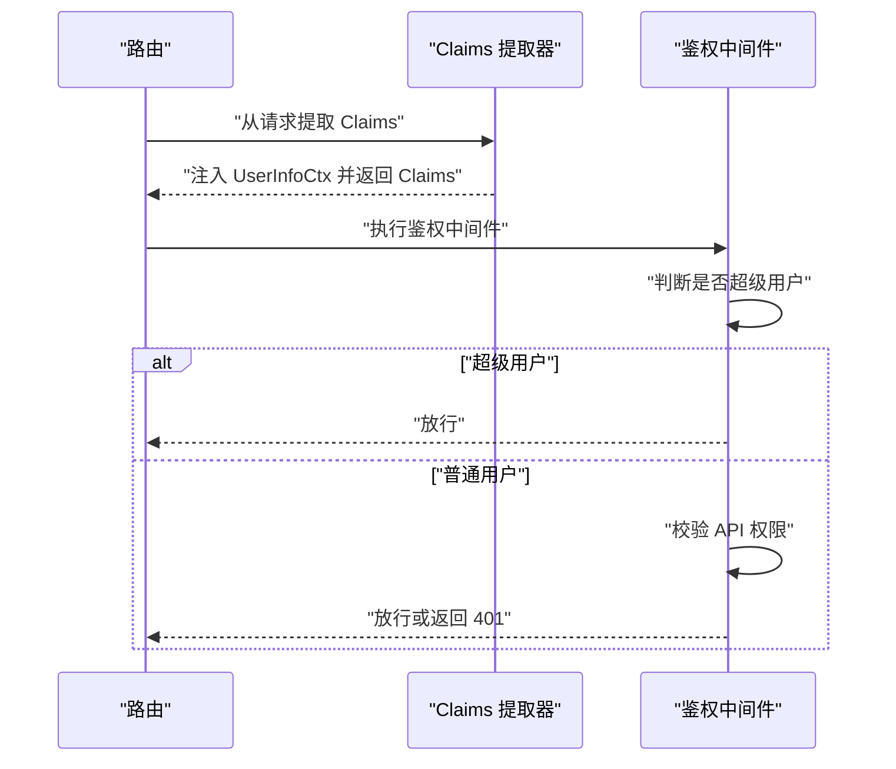
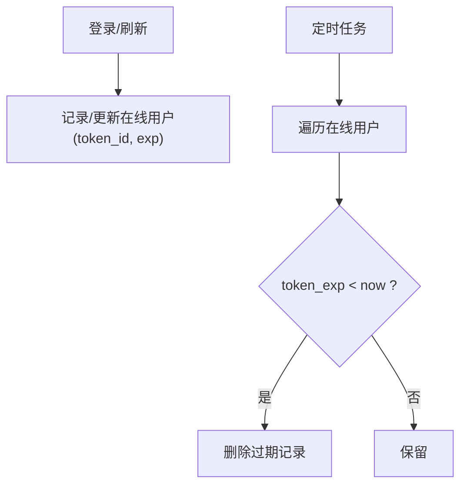
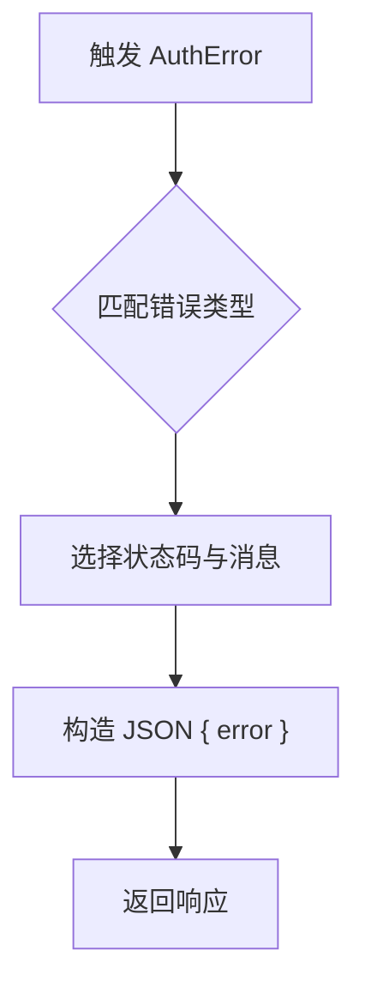
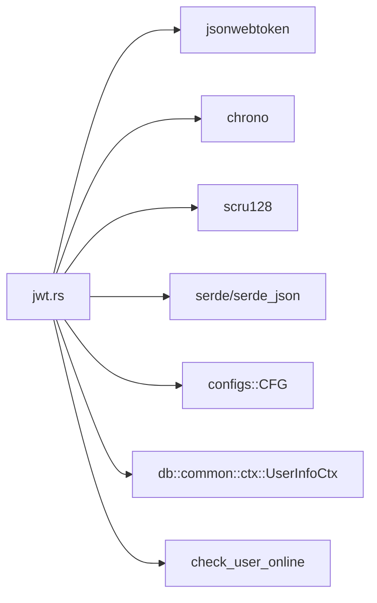

# JWT 认证机制

<cite>
**本文引用的文件**
- [jwt.rs](file://service/src/service_utils/jwt.rs)
- [auth.rs](file://middleware-fn/src/auth.rs)
- [cfgs.rs](file://configs/src/cfgs.rs)
- [get_config.rs](file://configs/src/get_config.rs)
- [config.toml.sample](file://config/config.toml.sample)
- [ctx.rs](file://db/src/common/ctx.rs)
- [route.rs](file://api/src/route.rs)
- [sys_user.rs](file://service/src/system/sys_user.rs)
- [sys_user_online.rs](file://service/src/system/sys_user_online.rs)
- [system.rs](file://service/src/tasks/task/system.rs)
- [Cargo.toml](file://Cargo.toml)
</cite>

## 目录
1. [简介](#简介)
2. [项目结构](#项目结构)
3. [核心组件](#核心组件)
4. [架构总览](#架构总览)
5. [组件详解](#组件详解)
6. [依赖关系分析](#依赖关系分析)
7. [性能与安全考量](#性能与安全考量)
8. [故障排查指南](#故障排查指南)
9. [结论](#结论)
10. [附录](#附录)

## 简介
本文件系统性阐述 Axum Admin 项目中基于 jsonwebtoken 的 JWT 认证机制，覆盖令牌生成、验证与管理的全流程，包括 Claims 结构设计、AuthPayload 使用、过期时间与密钥配置、请求头解析、令牌验证与用户上下文注入，并给出在控制器中使用 Claims 提取用户信息的实践方法。同时总结自定义 AuthError 错误处理与常见异常场景，提供安全最佳实践与常见问题排查建议。

## 项目结构
围绕 JWT 的关键文件分布如下：
- 服务工具层：负责 JWT 核心逻辑（编码/解码、密钥管理、Claims 提取、错误处理）
- 中间件层：统一鉴权与权限校验
- 配置层：JWT 密钥与过期时间等参数
- 控制器层：路由注册与中间件装配
- 数据上下文：请求扩展中的用户信息载体
- 在线用户与定时任务：令牌生命周期与过期清理

**图表来源**
- [get_config.rs](file://configs/src/get_config.rs#L1-L26)
- [cfgs.rs](file://configs/src/cfgs.rs#L74-L81)
- [config.toml.sample](file://config/config.toml.sample#L41-L44)
- [jwt.rs](file://service/src/service_utils/jwt.rs#L20-L24)
- [route.rs](file://api/src/route.rs#L33-L54)
- [auth.rs](file://middleware-fn/src/auth.rs#L6-L24)
- [ctx.rs](file://db/src/common/ctx.rs#L11-L16)
- [sys_user.rs](file://service/src/system/sys_user.rs#L546-L567)
- [sys_user_online.rs](file://service/src/system/sys_user_online.rs#L99-L136)
- [system.rs](file://service/src/tasks/task/system.rs#L19-L36)

**章节来源**
- [jwt.rs](file://service/src/service_utils/jwt.rs#L1-L164)
- [auth.rs](file://middleware-fn/src/auth.rs#L1-L25)
- [cfgs.rs](file://configs/src/cfgs.rs#L74-L81)
- [get_config.rs](file://configs/src/get_config.rs#L1-L26)
- [config.toml.sample](file://config/config.toml.sample#L41-L44)
- [route.rs](file://api/src/route.rs#L1-L69)
- [ctx.rs](file://db/src/common/ctx.rs#L1-L33)
- [sys_user.rs](file://service/src/system/sys_user.rs#L546-L583)
- [sys_user_online.rs](file://service/src/system/sys_user_online.rs#L99-L136)
- [system.rs](file://service/src/tasks/task/system.rs#L19-L36)

## 核心组件
- 密钥管理与静态常量
  - KEYS：基于配置中的 jwt_secret 动态构建 EncodingKey/DecodingKey，供 encode/decode 使用
- Claims 与 AuthPayload
  - Claims：令牌载荷，包含用户标识、令牌唯一标识、名称与过期时间
  - AuthPayload：签发时的最小必要载荷，用于构造 Claims
- 令牌签发 authorize
  - 依据 AuthPayload 与 token_id 构造 Claims，设置 exp（由 jwt_exp 决定），并返回 AuthBody
- 请求头解析与验证 get_bear_token / Claims FromRequestParts
  - 从 Authorization 头部解析 Bearer 令牌，分离 token 与 token_id，解码并校验有效性；同时检查用户是否仍在线
- 自定义错误 AuthError
  - 统一映射为 HTTP 响应状态码与错误消息
- 中间件集成
  - 在路由上装配 Ctx、ApiAuth、Claims 提取器，形成统一鉴权链路

**章节来源**
- [jwt.rs](file://service/src/service_utils/jwt.rs#L20-L38)
- [jwt.rs](file://service/src/service_utils/jwt.rs#L40-L52)
- [jwt.rs](file://service/src/service_utils/jwt.rs#L105-L121)
- [jwt.rs](file://service/src/service_utils/jwt.rs#L96-L103)
- [jwt.rs](file://service/src/service_utils/jwt.rs#L54-L94)
- [jwt.rs](file://service/src/service_utils/jwt.rs#L123-L145)
- [route.rs](file://api/src/route.rs#L33-L54)

## 架构总览
下图展示了从登录到请求处理的完整认证流程，包括令牌签发、请求头解析、令牌验证、用户上下文注入与权限校验。

**图表来源**
- [sys_user.rs](file://service/src/system/sys_user.rs#L546-L567)
- [jwt.rs](file://service/src/service_utils/jwt.rs#L105-L121)
- [sys_user_online.rs](file://service/src/system/sys_user_online.rs#L99-L136)
- [route.rs](file://api/src/route.rs#L33-L54)
- [jwt.rs](file://service/src/service_utils/jwt.rs#L54-L94)
- [auth.rs](file://middleware-fn/src/auth.rs#L6-L24)

## 组件详解

### Claims 与 AuthPayload 设计
- Claims 字段
  - id：用户标识
  - token_id：令牌唯一标识，用于在线校验与过期清理
  - name：用户名
  - exp：过期时间戳
- AuthPayload 字段
  - id、name：最小必要信息，用于签发新令牌
- 设计要点
  - 将 token_id 与 token 合并存储，便于前端统一携带与后端解析
  - 通过 token_id 实现“单点登出”与“强制刷新”能力

**图表来源**
- [jwt.rs](file://service/src/service_utils/jwt.rs#L46-L52)
- [jwt.rs](file://service/src/service_utils/jwt.rs#L40-L44)
- [jwt.rs](file://service/src/service_utils/jwt.rs#L147-L163)

**章节来源**
- [jwt.rs](file://service/src/service_utils/jwt.rs#L40-L52)
- [jwt.rs](file://service/src/service_utils/jwt.rs#L147-L163)

### 令牌签发 authorize
- 输入：AuthPayload、token_id
- 步骤
  - 校验必填字段
  - 计算签发时间与过期时间（基于配置 jwt_exp）
  - 构造 Claims 并签名生成 token
  - 返回 AuthBody（包含 token、exp、exp_in、token_id）
- 输出：AuthBody

**图表来源**
- [jwt.rs](file://service/src/service_utils/jwt.rs#L105-L121)

**章节来源**
- [jwt.rs](file://service/src/service_utils/jwt.rs#L105-L121)

### 请求头解析与令牌验证 get_bear_token / Claims FromRequestParts
- get_bear_token
  - 从 Authorization 头部提取 Bearer token
  - 将 token 与 token_id 分离（基于 scru128 长度）
- Claims FromRequestParts
  - 解析并验证 token
  - 校验用户是否在线（check_user_online）
  - 注入 UserInfoCtx 到请求扩展
  - 返回 Claims

**图表来源**
- [jwt.rs](file://service/src/service_utils/jwt.rs#L96-L103)
- [jwt.rs](file://service/src/service_utils/jwt.rs#L54-L94)

**章节来源**
- [jwt.rs](file://service/src/service_utils/jwt.rs#L96-L103)
- [jwt.rs](file://service/src/service_utils/jwt.rs#L54-L94)

### 用户上下文注入与权限校验
- 上下文注入
  - Claims 提取器将 UserInfoCtx 注入请求扩展，包含 id、token_id、name
- 权限校验中间件
  - 若为超级用户，直接放行
  - 否则判断请求路径是否在 API 路由表中，若在则校验用户对该 API 的权限

**图表来源**
- [ctx.rs](file://db/src/common/ctx.rs#L11-L16)
- [auth.rs](file://middleware-fn/src/auth.rs#L6-L24)

**章节来源**
- [ctx.rs](file://db/src/common/ctx.rs#L11-L16)
- [auth.rs](file://middleware-fn/src/auth.rs#L6-L24)

### 令牌过期与在线清理
- 登录时记录在线用户（token_id、exp）
- 定时任务扫描过期令牌并清理
- 刷新令牌时更新在线用户的 exp

**图表来源**
- [sys_user.rs](file://service/src/system/sys_user.rs#L591-L594)
- [sys_user_online.rs](file://service/src/system/sys_user_online.rs#L99-L136)
- [system.rs](file://service/src/tasks/task/system.rs#L19-L36)

**章节来源**
- [sys_user.rs](file://service/src/system/sys_user.rs#L591-L594)
- [sys_user_online.rs](file://service/src/system/sys_user_online.rs#L99-L136)
- [system.rs](file://service/src/tasks/task/system.rs#L19-L36)

### 在控制器中使用 Claims 提取用户信息
- 路由装配
  - 在系统模块路由上装配 Ctx、ApiAuth、Claims 提取器
- 控制器使用
  - 函数签名中通过类型标注接收 Claims，即可直接获得当前用户信息
- 示例路径
  - 路由装配位置：[route.rs](file://api/src/route.rs#L33-L54)
  - Claims 提取器实现：[jwt.rs](file://service/src/service_utils/jwt.rs#L54-L94)

**章节来源**
- [route.rs](file://api/src/route.rs#L33-L54)
- [jwt.rs](file://service/src/service_utils/jwt.rs#L54-L94)

### 自定义 AuthError 错误处理
- 错误枚举与映射
  - WrongCredentials → 401
  - MissingCredentials → 400
  - TokenCreation → 500
  - InvalidToken → 400
  - CheckOutToken → 401
- 统一响应格式
  - JSON 包含 error 字段

**图表来源**
- [jwt.rs](file://service/src/service_utils/jwt.rs#L123-L145)

**章节来源**
- [jwt.rs](file://service/src/service_utils/jwt.rs#L123-L145)

## 依赖关系分析
- 外部依赖
  - jsonwebtoken：令牌编码/解码、密钥管理
  - chrono：时间计算
  - scru128：生成 token_id
  - serde/serde_json：序列化/反序列化
- 内部依赖
  - configs：读取 jwt_secret、jwt_exp
  - db::common::ctx：UserInfoCtx 注入
  - service_utils::check_user_online：在线校验

**图表来源**
- [jwt.rs](file://service/src/service_utils/jwt.rs#L1-L16)
- [Cargo.toml](file://Cargo.toml#L40-L44)
- [cfgs.rs](file://configs/src/cfgs.rs#L74-L81)

**章节来源**
- [jwt.rs](file://service/src/service_utils/jwt.rs#L1-L16)
- [Cargo.toml](file://Cargo.toml#L40-L44)
- [cfgs.rs](file://configs/src/cfgs.rs#L74-L81)

## 性能与安全考量
- 性能
  - KEYS 使用 Lazy 初始化，避免重复构建密钥对象
  - Claims FromRequestParts 在每次请求中进行 decode 与在线校验，建议结合缓存策略或减少不必要的在线查询
- 安全
  - 密钥管理
    - jwt_secret 必须足够随机且保密，定期轮换
    - 配置文件不应纳入版本控制，使用环境变量或安全密钥管理服务
  - 令牌过期
    - jwt_exp 建议设置合理值（如 10 天），并提供刷新接口
  - 传输安全
    - 强制 HTTPS，防止中间人攻击
  - 单点登出
    - 通过 token_id 与在线表配合，支持强制下线与过期清理
  - 权限控制
    - 超级用户可绕过权限校验，需谨慎配置白名单

[本节为通用指导，不直接分析具体文件]

## 故障排查指南
- 常见错误与定位
  - InvalidToken：请求头格式不正确或缺少 Authorization
    - 排查：确认请求头格式为 Bearer <token><token_id>
    - 参考：[jwt.rs](file://service/src/service_utils/jwt.rs#L96-L103)
  - MissingCredentials：令牌过期或 Claims 字段缺失
    - 排查：检查 exp 是否过期；确认签发时填充了 id/name
    - 参考：[jwt.rs](file://service/src/service_utils/jwt.rs#L105-L121)
  - WrongCredentials：签名失败或密钥不一致
    - 排查：核对 jwt_secret 是否一致；确认未被修改
    - 参考：[jwt.rs](file://service/src/service_utils/jwt.rs#L118)
  - CheckOutToken：用户已退出或 token_id 不在线
    - 排查：确认在线表是否存在对应 token_id；检查是否调用退出接口
    - 参考：[jwt.rs](file://service/src/service_utils/jwt.rs#L67-L72)，[sys_user_online.rs](file://service/src/system/sys_user_online.rs#L93-L96)
- 配置核对
  - jwt_secret 与 jwt_exp 是否正确加载
  - 参考：[get_config.rs](file://configs/src/get_config.rs#L13-L24)，[cfgs.rs](file://configs/src/cfgs.rs#L74-L81)，[config.toml.sample](file://config/config.toml.sample#L41-L44)
- 路由与中间件
  - 确认系统模块路由已装配 Claims 提取器与鉴权中间件
  - 参考：[route.rs](file://api/src/route.rs#L33-L54)，[auth.rs](file://middleware-fn/src/auth.rs#L6-L24)

**章节来源**
- [jwt.rs](file://service/src/service_utils/jwt.rs#L96-L103)
- [jwt.rs](file://service/src/service_utils/jwt.rs#L105-L121)
- [jwt.rs](file://service/src/service_utils/jwt.rs#L118)
- [jwt.rs](file://service/src/service_utils/jwt.rs#L67-L72)
- [sys_user_online.rs](file://service/src/system/sys_user_online.rs#L93-L96)
- [get_config.rs](file://configs/src/get_config.rs#L13-L24)
- [cfgs.rs](file://configs/src/cfgs.rs#L74-L81)
- [config.toml.sample](file://config/config.toml.sample#L41-L44)
- [route.rs](file://api/src/route.rs#L33-L54)
- [auth.rs](file://middleware-fn/src/auth.rs#L6-L24)

## 结论
Axum Admin 的 JWT 认证机制以 jsonwebtoken 为核心，结合自定义 Claims 与 AuthPayload，实现了简洁而健壮的令牌签发与验证流程。通过路由中间件与自定义错误处理，系统在安全性与易用性之间取得平衡。建议在生产环境中强化密钥管理、启用 HTTPS、合理设置过期时间并完善权限校验与审计日志。

[本节为总结性内容，不直接分析具体文件]

## 附录

### 配置项一览
- jwt_secret：JWT 密钥
- jwt_exp：令牌过期时间（分钟）

**章节来源**
- [cfgs.rs](file://configs/src/cfgs.rs#L74-L81)
- [config.toml.sample](file://config/config.toml.sample#L41-L44)