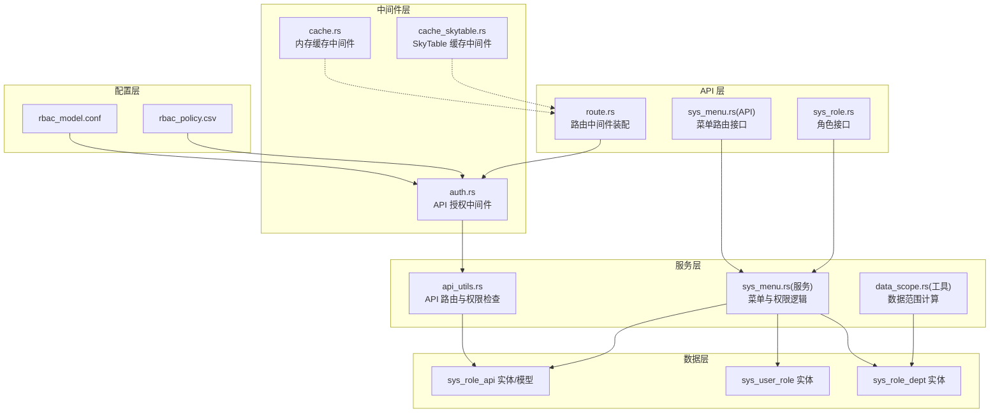
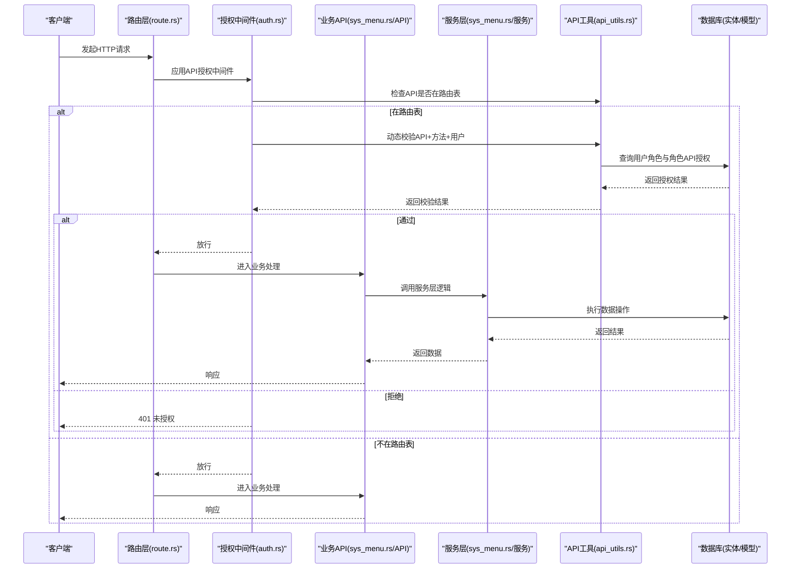
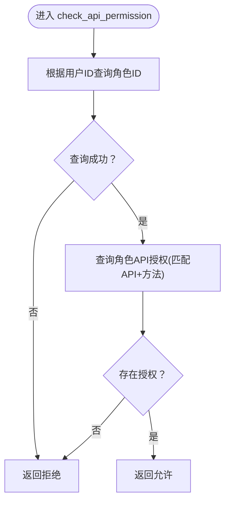
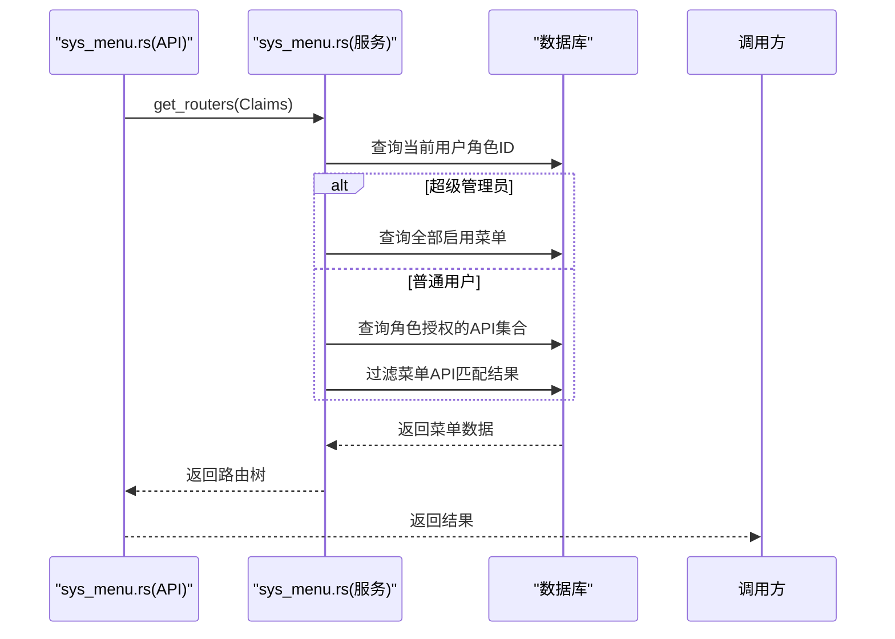
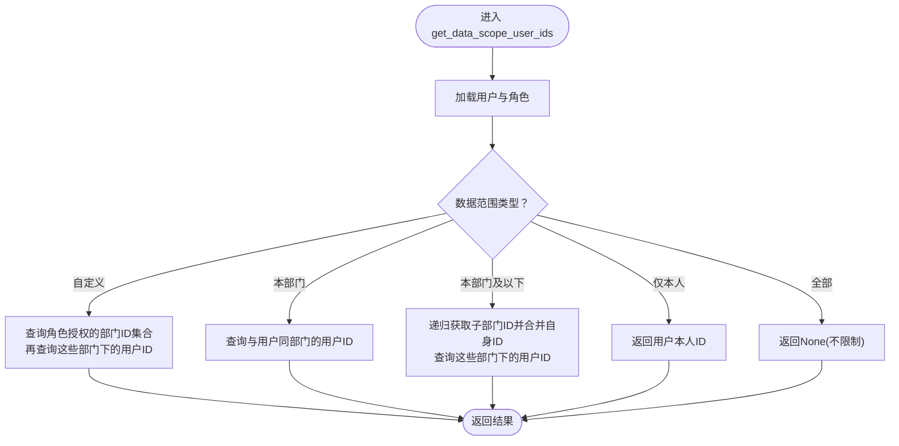
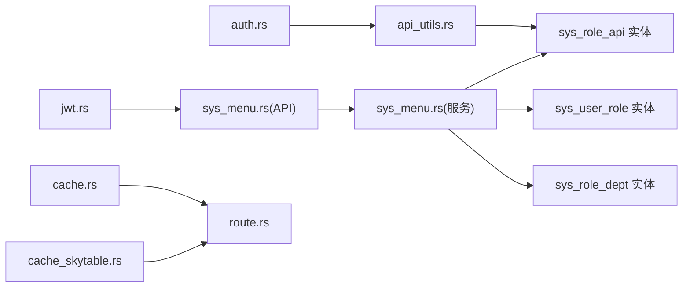

# RBAC 权限控制

<cite>
**本文引用的文件**
- [rbac_model.conf](file://config/casbin_conf/rbac_model.conf)
- [rbac_policy.csv](file://config/casbin_conf/rbac_policy.csv)
- [auth.rs](file://middleware-fn/src/auth.rs)
- [lib.rs](file://middleware-fn/src/lib.rs)
- [route.rs](file://api/src/route.rs)
- [api_utils.rs](file://service/src/service_utils/api_utils.rs)
- [sys_menu.rs（API）](file://api/src/system/sys_menu.rs)
- [sys_menu.rs（服务层）](file://service/src/system/sys_menu.rs)
- [sys_role.rs](file://api/src/system/sys_role.rs)
- [sys_role_api 实体](file://db/src/system/entities/sys_role_api.rs)
- [sys_role_api 模型](file://db/src/system/models/sys_role_api.rs)
- [sys_user_role 实体](file://db/src/system/entities/sys_user_role.rs)
- [sys_role_dept 实体](file://db/src/system/entities/sys_role_dept.rs)
- [data_scope.rs（工具）](file://utils/src/data_scope.rs)
- [cache.rs](file://middleware-fn/src/cache.rs)
- [cache_skytable.rs](file://middleware-fn/src/cache_skytable.rs)
- [jwt.rs](file://service/src/service_utils/jwt.rs)
</cite>

## 目录
1. [简介](#简介)
2. [项目结构](#项目结构)
3. [核心组件](#核心组件)
4. [架构总览](#架构总览)
5. [详细组件分析](#详细组件分析)
6. [依赖分析](#依赖分析)
7. [性能考虑](#性能考虑)
8. [故障排查指南](#故障排查指南)
9. [结论](#结论)
10. [附录](#附录)

## 简介
本文件系统性阐述 Axum Admin 项目的 RBAC 权限控制体系，重点围绕基于 CASBin 的角色基础访问控制模型展开，结合后端中间件、API 层、服务层与数据库实体，完整解析权限模型定义、策略规则配置、权限继承机制、API 权限校验、菜单权限控制、数据权限过滤、动态权限检查与缓存策略，并提供权限配置示例、角色分配指南与权限调试方法，以及与前端路由集成的最佳实践。

## 项目结构
Axum Admin 的权限控制由“配置层（CASBin）+ 中间件层（API 授权与缓存）+ API 层（菜单与角色接口）+ 服务层（权限与数据范围逻辑）+ 数据层（实体与模型）”构成，形成清晰的职责分离与可扩展的权限体系。

图表来源
- [rbac_model.conf](file://config/casbin_conf/rbac_model.conf#L1-L14)
- [rbac_policy.csv](file://config/casbin_conf/rbac_policy.csv#L1-L5)
- [auth.rs](file://middleware-fn/src/auth.rs#L1-L24)
- [route.rs](file://api/src/route.rs#L32-L68)
- [api_utils.rs](file://service/src/service_utils/api_utils.rs#L1-L119)
- [sys_menu.rs（API）](file://api/src/system/sys_menu.rs#L100-L120)
- [sys_menu.rs（服务层）](file://service/src/system/sys_menu.rs#L322-L374)
- [sys_role.rs](file://api/src/system/sys_role.rs#L101-L131)
- [sys_role_api 实体](file://db/src/system/entities/sys_role_api.rs#L1-L71)
- [sys_user_role 实体](file://db/src/system/entities/sys_user_role.rs#L1-L68)
- [sys_role_dept 实体](file://db/src/system/entities/sys_role_dept.rs#L1-L63)
- [cache.rs](file://middleware-fn/src/cache.rs#L125-L195)
- [cache_skytable.rs](file://middleware-fn/src/cache_skytable.rs#L170-L229)

章节来源
- [rbac_model.conf](file://config/casbin_conf/rbac_model.conf#L1-L14)
- [rbac_policy.csv](file://config/casbin_conf/rbac_policy.csv#L1-L5)
- [auth.rs](file://middleware-fn/src/auth.rs#L1-L24)
- [route.rs](file://api/src/route.rs#L32-L68)
- [api_utils.rs](file://service/src/service_utils/api_utils.rs#L1-L119)
- [sys_menu.rs（API）](file://api/src/system/sys_menu.rs#L100-L120)
- [sys_menu.rs（服务层）](file://service/src/system/sys_menu.rs#L322-L374)
- [sys_role.rs](file://api/src/system/sys_role.rs#L101-L131)
- [sys_role_api 实体](file://db/src/system/entities/sys_role_api.rs#L1-L71)
- [sys_user_role 实体](file://db/src/system/entities/sys_user_role.rs#L1-L68)
- [sys_role_dept 实体](file://db/src/system/entities/sys_role_dept.rs#L1-L63)
- [cache.rs](file://middleware-fn/src/cache.rs#L125-L195)
- [cache_skytable.rs](file://middleware-fn/src/cache_skytable.rs#L170-L229)

## 核心组件
- 权限模型与策略
  - 模型定义：请求主体、策略主体、角色关系、策略效果、匹配器，形成标准的 RBAC 表达式。
  - 策略规则：以 CSV 形式维护角色到资源与动作的授权映射，支持继承（g 规则）。
- API 授权中间件
  - 在进入业务处理前，对受保护路由进行权限校验；对超级管理员放行；对非路由表中的 API 放行。
- API 路由与权限检查
  - 维护“API 到菜单”的全局映射；按用户角色查询其允许的 API 方法集合，进行动态校验。
- 菜单与路由
  - 根据用户角色与菜单状态生成前端可用路由树；支持超管全量路由。
- 数据权限
  - 基于角色的数据范围策略，支持全部、自定义、本部门、本部门及以下、仅本人等。
- 缓存中间件
  - 提供内存或 SkyTable 缓存策略，按 API 与数据键缓存 GET 响应，自动失效与清理。

章节来源
- [rbac_model.conf](file://config/casbin_conf/rbac_model.conf#L1-L14)
- [rbac_policy.csv](file://config/casbin_conf/rbac_policy.csv#L1-L5)
- [auth.rs](file://middleware-fn/src/auth.rs#L6-L24)
- [api_utils.rs](file://service/src/service_utils/api_utils.rs#L90-L119)
- [sys_menu.rs（API）](file://api/src/system/sys_menu.rs#L100-L120)
- [sys_menu.rs（服务层）](file://service/src/system/sys_menu.rs#L322-L374)
- [data_scope.rs（工具）](file://utils/src/data_scope.rs#L1-L101)
- [cache.rs](file://middleware-fn/src/cache.rs#L125-L195)
- [cache_skytable.rs](file://middleware-fn/src/cache_skytable.rs#L170-L229)

## 架构总览
下图展示从请求进入至权限校验与响应返回的关键交互流程。

图表来源
- [route.rs](file://api/src/route.rs#L32-L68)
- [auth.rs](file://middleware-fn/src/auth.rs#L6-L24)
- [api_utils.rs](file://service/src/service_utils/api_utils.rs#L90-L119)
- [sys_menu.rs（API）](file://api/src/system/sys_menu.rs#L100-L120)
- [sys_menu.rs（服务层）](file://service/src/system/sys_menu.rs#L322-L374)
- [sys_role_api 实体](file://db/src/system/entities/sys_role_api.rs#L1-L71)

## 详细组件分析

### 权限模型与策略（rbac_model.conf 与 rbac_policy.csv）
- 模型定义要点
  - 请求三元组：sub（主体）、obj（对象）、act（动作）
  - 策略三元组：同上，p.sub/p.obj/p.act
  - 角色关系：g(sub, super_sub)，支持继承
  - 策略效果：some(where(p.eft == allow))，即任一策略允许即可
  - 匹配器：g(r.sub,p.sub) && r.obj==p.obj && r.act==p.act
- 策略规则示例
  - p 规则：角色对资源与动作的授权
  - g 规则：角色继承（如子角色继承父角色权限）
- 与项目集成
  - 本项目采用“用户-角色-角色API”三层映射实现动态校验，而非直接使用 CASBin 引擎；但模型与匹配器思想一致，便于理解与迁移。

章节来源
- [rbac_model.conf](file://config/casbin_conf/rbac_model.conf#L1-L14)
- [rbac_policy.csv](file://config/casbin_conf/rbac_policy.csv#L1-L5)

### API 授权中间件（auth.rs）
- 关键行为
  - 若用户为超级管理员，直接放行
  - 若请求路径在“已注册 API 路由表”，则调用动态权限检查；否则放行
  - 动态检查失败返回 401
- 与路由装配
  - 在路由层统一挂载授权中间件，确保受保护路由生效

章节来源
- [auth.rs](file://middleware-fn/src/auth.rs#L6-L24)
- [route.rs](file://api/src/route.rs#L32-L68)

### API 路由与权限检查（api_utils.rs）
- 全局 API 路由表
  - 初始化时扫描菜单，构建“API 路径 → 菜单信息”的内存表
  - 支持新增、删除、更新菜单时同步维护该表
- 动态权限检查
  - 依据用户 ID 查询其角色 ID
  - 查询角色对某 API 的方法授权（sys_role_api），若存在则允许
- 错误处理
  - 用户不存在或查询异常时返回拒绝

图表来源
- [api_utils.rs](file://service/src/service_utils/api_utils.rs#L90-L119)
- [sys_role_api 实体](file://db/src/system/entities/sys_role_api.rs#L1-L71)

章节来源
- [api_utils.rs](file://service/src/service_utils/api_utils.rs#L16-L119)
- [sys_role_api 实体](file://db/src/system/entities/sys_role_api.rs#L1-L71)

### 菜单权限控制（sys_menu.rs）
- 路由树生成
  - 超级管理员：返回全部启用的菜单路由树
  - 普通用户：根据其角色授权的 API 集合过滤菜单，再生成路由树
- 角色 API 权限查询
  - 通过“菜单 API 字段”与“角色API表”关联，返回该角色可访问的 API 与菜单 ID 列表

图表来源
- [sys_menu.rs（API）](file://api/src/system/sys_menu.rs#L100-L120)
- [sys_menu.rs（服务层）](file://service/src/system/sys_menu.rs#L322-L374)

章节来源
- [sys_menu.rs（API）](file://api/src/system/sys_menu.rs#L100-L120)
- [sys_menu.rs（服务层）](file://service/src/system/sys_menu.rs#L322-L374)

### 角色 API 权限管理（sys_role.rs 与 sys_role_api）
- 角色菜单授权
  - 提供获取角色授权菜单 ID 列表的接口，内部调用服务层的“角色权限查询”
- 角色数据范围授权
  - 提供获取角色授权部门 ID 列表的接口，用于数据权限过滤
- 角色 API 授权
  - 通过 sys_role_api 实体与模型维护“角色-接口-方法”授权

章节来源
- [sys_role.rs](file://api/src/system/sys_role.rs#L101-L131)
- [sys_role_api 实体](file://db/src/system/entities/sys_role_api.rs#L1-L71)
- [sys_role_api 模型](file://db/src/system/models/sys_role_api.rs#L1-L9)

### 数据权限过滤（data_scope.rs）
- 数据范围类型
  - 全部、自定义、本部门、本部门及以下、仅本人
- 计算逻辑
  - 基于用户所属角色的数据范围策略，结合 sys_role_dept 与部门层级，计算可访问的用户 ID 集合
  - “本部门及以下”通过父子关系递归收集子部门 ID 并合并自身 ID

图表来源
- [data_scope.rs（工具）](file://utils/src/data_scope.rs#L1-L101)
- [sys_role_dept 实体](file://db/src/system/entities/sys_role_dept.rs#L1-L63)

章节来源
- [data_scope.rs（工具）](file://utils/src/data_scope.rs#L1-L101)
- [sys_role_dept 实体](file://db/src/system/entities/sys_role_dept.rs#L1-L63)

### 权限验证流程与动态检查
- 验证流程
  - 中间件层：判定是否在路由表、是否超级管理员
  - 动态检查：根据用户角色查询 sys_role_api，匹配 API 与方法
- 与前端路由集成
  - 后端返回路由树，前端据此生成可访问的导航与页面
  - 菜单状态与可见性由后端控制，避免前端硬编码绕过

章节来源
- [auth.rs](file://middleware-fn/src/auth.rs#L6-L24)
- [api_utils.rs](file://service/src/service_utils/api_utils.rs#L90-L119)
- [sys_menu.rs（API）](file://api/src/system/sys_menu.rs#L100-L120)

### 权限缓存策略（cache.rs 与 cache_skytable.rs）
- 缓存维度
  - API 路径 + 请求参数（可选）+ 用户标识（可选）= 数据键
- 缓存策略
  - GET 请求命中缓存直接返回
  - 非 GET 请求在成功后异步清理相关 API 的缓存
  - 支持内存与 SkyTable 两种实现，按配置选择
- 自动失效
  - 周期性扫描索引，超过 TTL 的缓存项被移除

章节来源
- [cache.rs](file://middleware-fn/src/cache.rs#L125-L195)
- [cache_skytable.rs](file://middleware-fn/src/cache_skytable.rs#L170-L229)

## 依赖分析
- 组件耦合
  - 授权中间件依赖 API 工具进行动态校验
  - API 层依赖服务层生成路由树与权限数据
  - 服务层依赖数据库实体与模型完成查询与更新
- 外部依赖
  - JWT 解析与校验，确保用户身份与在线状态
  - 缓存中间件依赖配置决定缓存策略与存储介质

图表来源
- [auth.rs](file://middleware-fn/src/auth.rs#L1-L24)
- [api_utils.rs](file://service/src/service_utils/api_utils.rs#L1-L119)
- [sys_menu.rs（API）](file://api/src/system/sys_menu.rs#L1-L120)
- [sys_menu.rs（服务层）](file://service/src/system/sys_menu.rs#L1-L499)
- [sys_role_api 实体](file://db/src/system/entities/sys_role_api.rs#L1-L71)
- [sys_user_role 实体](file://db/src/system/entities/sys_user_role.rs#L1-L68)
- [sys_role_dept 实体](file://db/src/system/entities/sys_role_dept.rs#L1-L63)
- [cache.rs](file://middleware-fn/src/cache.rs#L1-L195)
- [cache_skytable.rs](file://middleware-fn/src/cache_skytable.rs#L1-L229)
- [jwt.rs](file://service/src/service_utils/jwt.rs#L1-L164)

章节来源
- [lib.rs](file://middleware-fn/src/lib.rs#L1-L22)
- [route.rs](file://api/src/route.rs#L32-L68)

## 性能考虑
- 动态权限检查
  - 通过内存 API 路由表快速判定是否在路由表，减少数据库访问
  - 对用户角色与角色 API 授权的查询应配合索引优化
- 缓存策略
  - 对高频 GET 接口开启缓存，显著降低数据库压力
  - 合理设置缓存 TTL，平衡一致性与性能
- 菜单树生成
  - 仅在必要时重建路由树，避免频繁全量查询

## 故障排查指南
- 常见问题
  - 401 未授权：确认用户是否在路由表、是否具备对应 API+方法 的角色授权
  - 超级管理员仍受限：检查配置中的超级用户列表与中间件放行逻辑
  - 菜单不显示：检查菜单状态、角色授权的 API 是否正确映射
  - 数据越权：核对角色数据范围策略与部门层级关系
- 调试步骤
  - 查看 API 工具的初始化与维护过程，确认路由表是否正确
  - 核对 sys_role_api 的角色-接口-方法配置
  - 使用日志定位中间件放行/拒绝分支
  - 检查缓存中间件的命中与清理行为

章节来源
- [auth.rs](file://middleware-fn/src/auth.rs#L6-L24)
- [api_utils.rs](file://service/src/service_utils/api_utils.rs#L21-L48)
- [sys_menu.rs（服务层）](file://service/src/system/sys_menu.rs#L322-L374)
- [data_scope.rs（工具）](file://utils/src/data_scope.rs#L1-L101)
- [cache.rs](file://middleware-fn/src/cache.rs#L125-L195)

## 结论
Axum Admin 的 RBAC 权限控制以“模型清晰、中间件前置、动态校验、缓存优化”为核心设计，既满足灵活的角色与数据权限需求，又兼顾性能与可维护性。通过路由表与角色 API 授权的组合，实现了细粒度的 API 控制与菜单路由的联动；通过数据范围策略与缓存中间件，进一步提升了系统的安全与效率。

## 附录

### 权限配置示例
- 新增菜单并绑定 API
  - 在菜单表中新增一条记录，填写 API 路径、方法、组件等字段
  - 服务层会将该 API 注册到全局路由表，并在更新时同步维护
- 授权角色访问
  - 在角色 API 授权表中为角色添加对应 API 与方法
  - 用户登录后，其可访问的菜单与 API 即由角色授权决定

章节来源
- [sys_menu.rs（服务层）](file://service/src/system/sys_menu.rs#L130-L244)
- [sys_role_api 实体](file://db/src/system/entities/sys_role_api.rs#L1-L71)

### 角色分配指南
- 分配用户角色
  - 通过用户-角色关联表为用户分配角色
- 授权菜单与 API
  - 通过菜单与角色 API 授权表建立映射
- 授权数据范围
  - 通过角色-部门授权表设定角色可访问的部门范围

章节来源
- [sys_user_role 实体](file://db/src/system/entities/sys_user_role.rs#L1-L68)
- [sys_role_dept 实体](file://db/src/system/entities/sys_role_dept.rs#L1-L63)
- [sys_role.rs](file://api/src/system/sys_role.rs#L101-L131)

### 权限调试方法
- 启用操作日志与缓存日志，观察中间件行为
- 在 API 工具初始化与更新流程中插入日志，确认路由表状态
- 使用 JWT 中间件校验用户身份与在线状态

章节来源
- [jwt.rs](file://service/src/service_utils/jwt.rs#L54-L94)
- [cache.rs](file://middleware-fn/src/cache.rs#L36-L58)
- [api_utils.rs](file://service/src/service_utils/api_utils.rs#L32-L48)