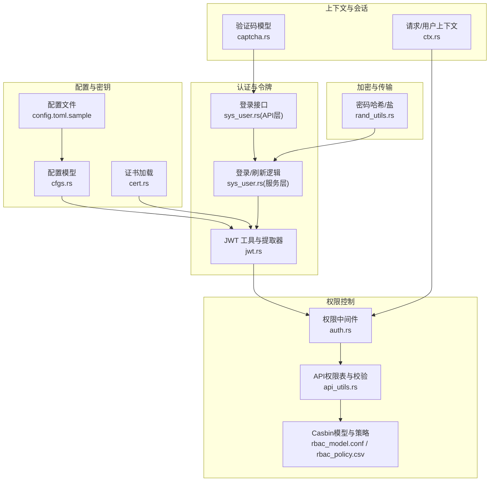
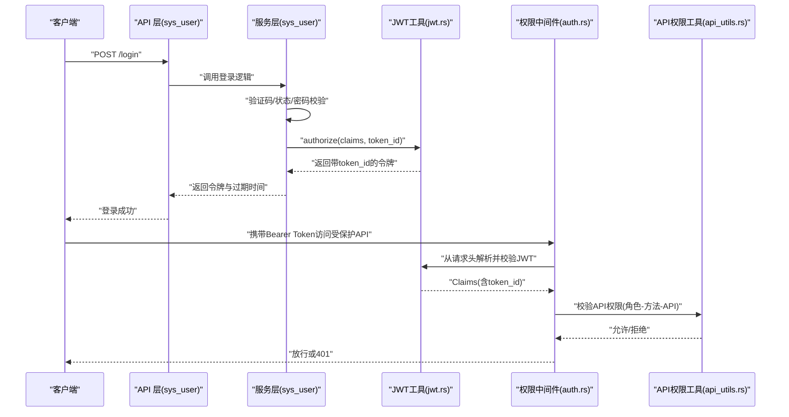
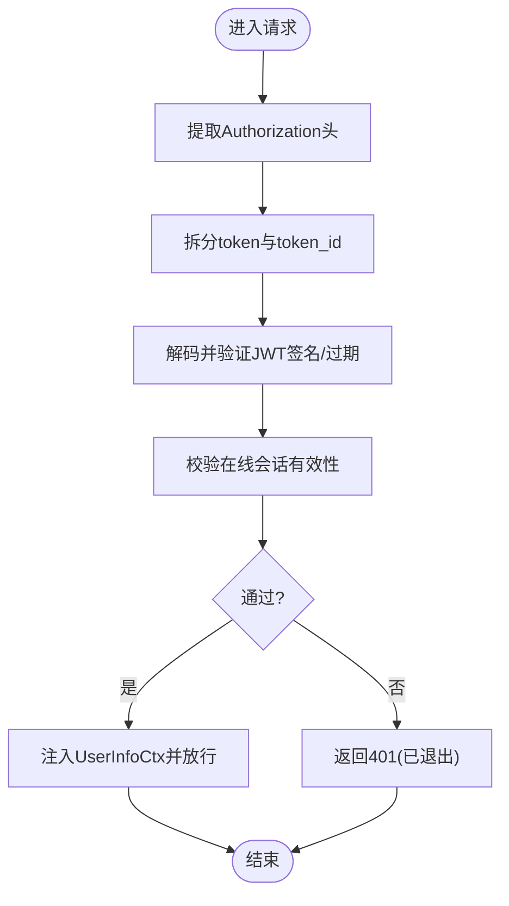
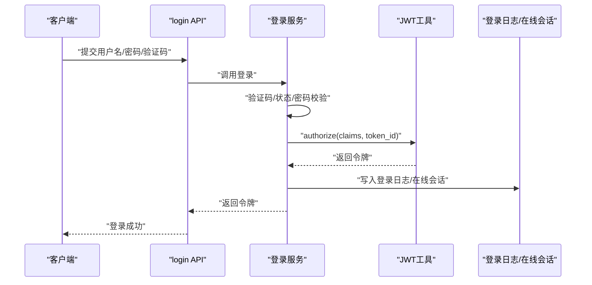
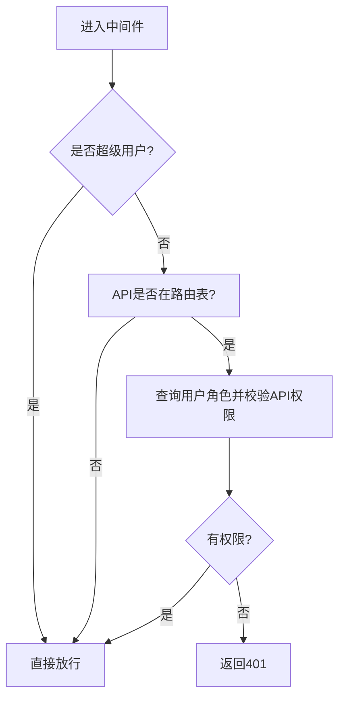
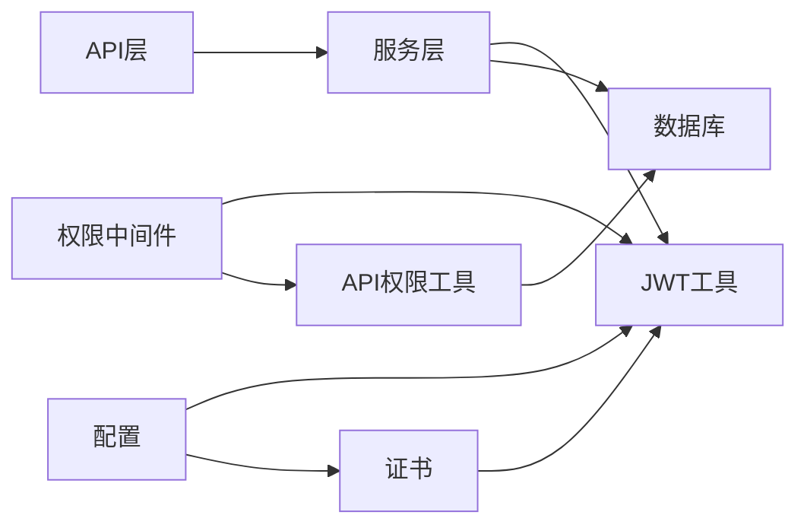

# 安全系统

<cite>
**本文引用的文件**
- [jwt.rs](file://service/src/service_utils/jwt.rs)
- [api_utils.rs](file://service/src/service_utils/api_utils.rs)
- [auth.rs](file://middleware-fn/src/auth.rs)
- [cfgs.rs](file://configs/src/cfgs.rs)
- [config.toml.sample](file://config/config.toml.sample)
- [sys_user.rs（服务层）](file://service/src/system/sys_user.rs)
- [sys_user.rs（API 层）](file://api/src/system/sys_user.rs)
- [ctx.rs](file://db/src/common/ctx.rs)
- [captcha.rs](file://db/src/common/captcha.rs)
- [cert.rs](file://utils/src/cert.rs)
- [rand_utils.rs](file://utils/src/rand_utils.rs)
- [rbac_model.conf](file://config/casbin_conf/rbac_model.conf)
- [rbac_policy.csv](file://config/casbin_conf/rbac_policy.csv)
</cite>

## 目录
1. [简介](#简介)
2. [项目结构](#项目结构)
3. [核心组件](#核心组件)
4. [架构总览](#架构总览)
5. [详细组件分析](#详细组件分析)
6. [依赖分析](#依赖分析)
7. [性能考虑](#性能考虑)
8. [故障排查指南](#故障排查指南)
9. [结论](#结论)
10. [附录](#附录)

## 简介
本文件面向安全工程师与开发者，系统化梳理 Axum Admin 的安全体系，覆盖基于 JWT 的认证机制、基于 Casbin 的 RBAC 权限控制、数据加密与安全传输、令牌管理与生命周期、API 访问控制与审计日志等关键能力。文档以代码为依据，结合流程图与类图，帮助读者快速理解从请求接入到鉴权放行的完整链路，并提供安全配置建议、威胁防护策略与应急响应要点。

## 项目结构
围绕安全主题的关键模块分布如下：
- 配置与密钥
  - 配置模型：[cfgs.rs](file://configs/src/cfgs.rs)，[config.toml.sample](file://config/config.toml.sample)
  - 证书加载：[cert.rs](file://utils/src/cert.rs)
- 认证与令牌
  - JWT 工具与提取器：[jwt.rs](file://service/src/service_utils/jwt.rs)
  - 登录与刷新：[sys_user.rs（服务层）](file://service/src/system/sys_user.rs)，[sys_user.rs（API 层）](file://api/src/system/sys_user.rs)
- 权限控制
  - API 路由权限表与校验：[api_utils.rs](file://service/src/service_utils/api_utils.rs)
  - 中间件权限拦截：[auth.rs](file://middleware-fn/src/auth.rs)
  - Casbin 模型与策略：[rbac_model.conf](file://config/casbin_conf/rbac_model.conf)，[rbac_policy.csv](file://config/casbin_conf/rbac_policy.csv)
- 上下文与会话
  - 请求上下文与用户上下文：[ctx.rs](file://db/src/common/ctx.rs)
  - 登录验证码模型：[captcha.rs](file://db/src/common/captcha.rs)
- 加密与安全传输
  - 密码哈希与随机盐：[rand_utils.rs](file://utils/src/rand_utils.rs)
  - TLS 证书加载：[cert.rs](file://utils/src/cert.rs)

图表来源
- [cfgs.rs](file://configs/src/cfgs.rs#L1-L111)
- [config.toml.sample](file://config/config.toml.sample#L1-L50)
- [cert.rs](file://utils/src/cert.rs#L1-L26)
- [jwt.rs](file://service/src/service_utils/jwt.rs#L1-L163)
- [sys_user.rs（服务层）](file://service/src/system/sys_user.rs#L509-L583)
- [sys_user.rs（API 层）](file://api/src/system/sys_user.rs#L96-L104)
- [api_utils.rs](file://service/src/service_utils/api_utils.rs#L1-L119)
- [auth.rs](file://middleware-fn/src/auth.rs#L1-L24)
- [rbac_model.conf](file://config/casbin_conf/rbac_model.conf#L1-L14)
- [rbac_policy.csv](file://config/casbin_conf/rbac_policy.csv#L1-L5)
- [ctx.rs](file://db/src/common/ctx.rs#L1-L33)
- [captcha.rs](file://db/src/common/captcha.rs#L1-L9)
- [rand_utils.rs](file://utils/src/rand_utils.rs#L1-L32)

章节来源
- [cfgs.rs](file://configs/src/cfgs.rs#L1-L111)
- [config.toml.sample](file://config/config.toml.sample#L1-L50)
- [cert.rs](file://utils/src/cert.rs#L1-L26)
- [jwt.rs](file://service/src/service_utils/jwt.rs#L1-L163)
- [sys_user.rs（服务层）](file://service/src/system/sys_user.rs#L509-L583)
- [sys_user.rs（API 层）](file://api/src/system/sys_user.rs#L96-L104)
- [api_utils.rs](file://service/src/service_utils/api_utils.rs#L1-L119)
- [auth.rs](file://middleware-fn/src/auth.rs#L1-L24)
- [rbac_model.conf](file://config/casbin_conf/rbac_model.conf#L1-L14)
- [rbac_policy.csv](file://config/casbin_conf/rbac_policy.csv#L1-L5)
- [ctx.rs](file://db/src/common/ctx.rs#L1-L33)
- [captcha.rs](file://db/src/common/captcha.rs#L1-L9)
- [rand_utils.rs](file://utils/src/rand_utils.rs#L1-L32)

## 核心组件
- JWT 认证与令牌管理
  - 令牌签发与解析：[jwt.rs](file://service/src/service_utils/jwt.rs#L105-L121)
  - 请求中提取并校验令牌：[jwt.rs](file://service/src/service_utils/jwt.rs#L54-L93)
  - 令牌过期与失效处理：[jwt.rs](file://service/src/service_utils/jwt.rs#L123-L145)
  - 令牌拼接与返回体：[jwt.rs](file://service/src/service_utils/jwt.rs#L154-L163)
- 登录与刷新
  - 登录流程与验证码校验：[sys_user.rs（服务层）](file://service/src/system/sys_user.rs#L509-L568)
  - 刷新令牌并续期在线会话：[sys_user.rs（服务层）](file://service/src/system/sys_user.rs#L571-L583)
  - API 接口封装：[sys_user.rs（API 层）](file://api/src/system/sys_user.rs#L96-L104)
- API 权限控制
  - API 路由表初始化与缓存：[api_utils.rs](file://service/src/service_utils/api_utils.rs#L21-L48)
  - 动态增删改查 API 注册：[api_utils.rs](file://service/src/service_utils/api_utils.rs#L50-L81)
  - 权限校验（角色-方法-API 维度）：[api_utils.rs](file://service/src/service_utils/api_utils.rs#L90-L118)
- 中间件拦截
  - 超级用户豁免与权限校验：[auth.rs](file://middleware-fn/src/auth.rs#L6-L24)
- Casbin RBAC
  - 模型定义与匹配规则：[rbac_model.conf](file://config/casbin_conf/rbac_model.conf#L1-L14)
  - 策略示例与继承关系：[rbac_policy.csv](file://config/casbin_conf/rbac_policy.csv#L1-L5)
- 安全配置
  - 服务器、JWT、日志、Casbin、数据库等配置项：[cfgs.rs](file://configs/src/cfgs.rs#L24-L111)，[config.toml.sample](file://config/config.toml.sample#L1-L50)
- 加密与传输
  - 密码 MD5+盐哈希：[rand_utils.rs](file://utils/src/rand_utils.rs#L21-L31)
  - TLS 证书加载：[cert.rs](file://utils/src/cert.rs#L1-L26)

章节来源
- [jwt.rs](file://service/src/service_utils/jwt.rs#L105-L163)
- [sys_user.rs（服务层）](file://service/src/system/sys_user.rs#L509-L583)
- [sys_user.rs（API 层）](file://api/src/system/sys_user.rs#L96-L104)
- [api_utils.rs](file://service/src/service_utils/api_utils.rs#L21-L118)
- [auth.rs](file://middleware-fn/src/auth.rs#L6-L24)
- [rbac_model.conf](file://config/casbin_conf/rbac_model.conf#L1-L14)
- [rbac_policy.csv](file://config/casbin_conf/rbac_policy.csv#L1-L5)
- [cfgs.rs](file://configs/src/cfgs.rs#L24-L111)
- [config.toml.sample](file://config/config.toml.sample#L1-L50)
- [rand_utils.rs](file://utils/src/rand_utils.rs#L21-L31)
- [cert.rs](file://utils/src/cert.rs#L1-L26)

## 架构总览
Axum Admin 的安全链路由“请求接入 → 中间件鉴权 → API 权限校验 → 业务处理 → 结果返回”构成。JWT 作为无状态凭证贯穿登录、刷新与中间件校验；Casbin 提供细粒度的 API 级别权限判定；配置中心统一管理密钥、证书与开关。

图表来源
- [sys_user.rs（API 层）](file://api/src/system/sys_user.rs#L96-L104)
- [sys_user.rs（服务层）](file://service/src/system/sys_user.rs#L509-L583)
- [jwt.rs](file://service/src/service_utils/jwt.rs#L54-L121)
- [auth.rs](file://middleware-fn/src/auth.rs#L6-L24)
- [api_utils.rs](file://service/src/service_utils/api_utils.rs#L90-L118)

## 详细组件分析

### JWT 认证与令牌管理
- 令牌结构与签发
  - Claims 包含用户标识、token_id、名称与过期时间；签发时根据配置设置过期分钟数。[jwt.rs](file://service/src/service_utils/jwt.rs#L47-L52)，[jwt.rs](file://service/src/service_utils/jwt.rs#L110-L116)，[jwt.rs](file://service/src/service_utils/jwt.rs#L118)
  - 返回体将 token 与 token_id 拼接，便于前端存储与后端校验。[jwt.rs](file://service/src/service_utils/jwt.rs#L154-L158)
- 请求解析与校验
  - 从 Authorization 头部提取 Bearer Token，并拆分出 token 与 token_id。[jwt.rs](file://service/src/service_utils/jwt.rs#L96-L103)
  - 解析并验证签名、过期时间；同时通过在线会话校验 token 是否仍有效。[jwt.rs](file://service/src/service_utils/jwt.rs#L64-L86)
- 错误处理
  - 针对无效令牌、缺失凭据、过期、创建失败等场景返回相应状态码与消息。[jwt.rs](file://service/src/service_utils/jwt.rs#L123-L145)

图表来源
- [jwt.rs](file://service/src/service_utils/jwt.rs#L54-L93)
- [jwt.rs](file://service/src/service_utils/jwt.rs#L123-L145)

章节来源
- [jwt.rs](file://service/src/service_utils/jwt.rs#L47-L163)

### 登录与刷新流程
- 登录
  - 验证验证码、用户状态、密码（MD5+盐）。[sys_user.rs（服务层）](file://service/src/system/sys_user.rs#L514-L545)
  - 生成 token_id，签发 JWT 并记录登录日志与在线会话。[sys_user.rs（服务层）](file://service/src/system/sys_user.rs#L551-L567)
  - API 层仅做参数透传与结果封装。[sys_user.rs（API 层）](file://api/src/system/sys_user.rs#L96-L104)
- 刷新
  - 使用现有 Claims 与 token_id 重新签发新令牌，并更新在线会话过期时间。[sys_user.rs（服务层）](file://service/src/system/sys_user.rs#L571-L583)

图表来源
- [sys_user.rs（API 层）](file://api/src/system/sys_user.rs#L96-L104)
- [sys_user.rs（服务层）](file://service/src/system/sys_user.rs#L509-L568)
- [jwt.rs](file://service/src/service_utils/jwt.rs#L105-L121)

章节来源
- [sys_user.rs（服务层）](file://service/src/system/sys_user.rs#L509-L583)
- [sys_user.rs（API 层）](file://api/src/system/sys_user.rs#L96-L104)

### API 权限控制与中间件拦截
- API 路由权限表
  - 启动时从菜单数据构建 API 路由表，支持动态增删改查注册。[api_utils.rs](file://service/src/service_utils/api_utils.rs#L21-L81)
  - 权限校验按“角色-方法-API”三元组进行匹配。[api_utils.rs](file://service/src/service_utils/api_utils.rs#L90-L118)
- 中间件拦截
  - 超级用户豁免；对在表中的 API，进一步校验用户角色是否具备对应方法的权限。[auth.rs](file://middleware-fn/src/auth.rs#L6-L24)
- Casbin 集成
  - 模型定义了请求(sub,obj,act)、策略(p)、角色关系(g)与匹配规则(m)。[rbac_model.conf](file://config/casbin_conf/rbac_model.conf#L1-L14)
  - 策略示例体现“角色-对象-动作”的授权关系。[rbac_policy.csv](file://config/casbin_conf/rbac_policy.csv#L1-L5)

图表来源
- [auth.rs](file://middleware-fn/src/auth.rs#L6-L24)
- [api_utils.rs](file://service/src/service_utils/api_utils.rs#L83-L118)
- [rbac_model.conf](file://config/casbin_conf/rbac_model.conf#L1-L14)
- [rbac_policy.csv](file://config/casbin_conf/rbac_policy.csv#L1-L5)

章节来源
- [auth.rs](file://middleware-fn/src/auth.rs#L6-L24)
- [api_utils.rs](file://service/src/service_utils/api_utils.rs#L21-L118)
- [rbac_model.conf](file://config/casbin_conf/rbac_model.conf#L1-L14)
- [rbac_policy.csv](file://config/casbin_conf/rbac_policy.csv#L1-L5)

### 数据加密与安全传输
- 密码加密
  - 使用 MD5 对“明文密码+盐值”进行哈希，盐值随机生成并随用户存储。[rand_utils.rs](file://utils/src/rand_utils.rs#L21-L31)，[sys_user.rs（服务层）](file://service/src/system/sys_user.rs#L278-L279)
- TLS 证书
  - 从配置加载证书与私钥，用于 HTTPS 传输。[cert.rs](file://utils/src/cert.rs#L1-L26)，[config.toml.sample](file://config/config.toml.sample#L25-L27)
- 配置项
  - 服务器 SSL 开关、JWT 密钥与过期时间、日志开关等。[cfgs.rs](file://configs/src/cfgs.rs#L24-L111)，[config.toml.sample](file://config/config.toml.sample#L1-L50)

章节来源
- [rand_utils.rs](file://utils/src/rand_utils.rs#L21-L31)
- [sys_user.rs（服务层）](file://service/src/system/sys_user.rs#L278-L279)
- [cert.rs](file://utils/src/cert.rs#L1-L26)
- [config.toml.sample](file://config/config.toml.sample#L25-L27)
- [cfgs.rs](file://configs/src/cfgs.rs#L24-L111)

### 请求上下文与验证码
- 请求上下文
  - 记录原始 URI、路径、方法、请求体等，用于日志与审计。[ctx.rs](file://db/src/common/ctx.rs#L1-L9)
- 用户上下文
  - 注入当前用户 ID、token_id、名称，供后续中间件与业务使用。[ctx.rs](file://db/src/common/ctx.rs#L11-L16)
- 验证码
  - 登录时对验证码进行校验，防止暴力破解。[captcha.rs](file://db/src/common/captcha.rs#L1-L9)，[sys_user.rs（服务层）](file://service/src/system/sys_user.rs#L514-L519)

章节来源
- [ctx.rs](file://db/src/common/ctx.rs#L1-L33)
- [captcha.rs](file://db/src/common/captcha.rs#L1-L9)
- [sys_user.rs（服务层）](file://service/src/system/sys_user.rs#L514-L519)

## 依赖分析
- 组件耦合
  - API 层依赖服务层；服务层依赖 JWT 工具与数据库；中间件依赖 JWT 提取器与 API 权限工具；权限工具依赖数据库实体与配置。
- 关键依赖链
  - 登录 → JWT → 在线会话/日志 → API 权限中间件 → 业务处理
- 外部依赖
  - JSON Web Token 解析与签发、TLS、Casbin 策略引擎等

图表来源
- [sys_user.rs（API 层）](file://api/src/system/sys_user.rs#L96-L104)
- [sys_user.rs（服务层）](file://service/src/system/sys_user.rs#L509-L583)
- [jwt.rs](file://service/src/service_utils/jwt.rs#L1-L163)
- [auth.rs](file://middleware-fn/src/auth.rs#L1-L24)
- [api_utils.rs](file://service/src/service_utils/api_utils.rs#L1-L119)
- [cfgs.rs](file://configs/src/cfgs.rs#L1-L111)
- [cert.rs](file://utils/src/cert.rs#L1-L26)

章节来源
- [sys_user.rs（API 层）](file://api/src/system/sys_user.rs#L96-L104)
- [sys_user.rs（服务层）](file://service/src/system/sys_user.rs#L509-L583)
- [jwt.rs](file://service/src/service_utils/jwt.rs#L1-L163)
- [auth.rs](file://middleware-fn/src/auth.rs#L1-L24)
- [api_utils.rs](file://service/src/service_utils/api_utils.rs#L1-L119)
- [cfgs.rs](file://configs/src/cfgs.rs#L1-L111)
- [cert.rs](file://utils/src/cert.rs#L1-L26)

## 性能考虑
- 令牌解析与在线校验
  - JWT 解析与在线会话查询为 O(1)/O(log N) 级别，建议在网关或边缘缓存常用用户信息。
- API 权限表
  - 启动时一次性加载，运行时内存查找；如 API 数量较大，可考虑分片或懒加载策略。
- 日志与审计
  - 操作日志可按需开启，避免高并发下的 IO 压力；建议异步落盘或批量写入。
- 缓存策略
  - 支持内存与 SkyTable 两种缓存方式，结合业务热点选择合适缓存介质。

## 故障排查指南
- 常见错误与定位
  - 400 无效令牌：检查 Authorization 头格式与 token_id 拼接是否正确。[jwt.rs](file://service/src/service_utils/jwt.rs#L137-L145)
  - 401 缺少凭据/权限不足：确认用户角色是否具备对应 API 方法权限。[auth.rs](file://middleware-fn/src/auth.rs#L18-L20)
  - 401 已退出：token_id 与在线会话不一致，需重新登录。[jwt.rs](file://service/src/service_utils/jwt.rs#L138-L145)
  - 登录失败：验证码错误、用户被禁用、密码错误。[sys_user.rs（服务层）](file://service/src/system/sys_user.rs#L514-L545)
- 配置核对
  - JWT 密钥与过期时间、Casbin 模型与策略文件路径、证书路径与权限。[cfgs.rs](file://configs/src/cfgs.rs#L24-L111)，[config.toml.sample](file://config/config.toml.sample#L1-L50)
- 审计与追踪
  - 登录日志与操作日志可用于回溯问题；注意敏感字段脱敏。[sys_user.rs（服务层）](file://service/src/system/sys_user.rs#L585-L599)

章节来源
- [jwt.rs](file://service/src/service_utils/jwt.rs#L123-L145)
- [auth.rs](file://middleware-fn/src/auth.rs#L18-L20)
- [sys_user.rs（服务层）](file://service/src/system/sys_user.rs#L514-L545)
- [cfgs.rs](file://configs/src/cfgs.rs#L24-L111)
- [config.toml.sample](file://config/config.toml.sample#L1-L50)

## 结论
Axum Admin 的安全体系以 JWT 无状态认证为核心，结合中间件与 API 权限工具实现细粒度访问控制，并通过 Casbin 模型与策略提供可扩展的 RBAC 能力。配合密码哈希、TLS 证书与完善的日志审计，形成从接入到执行的全链路安全保障。建议在生产环境强化密钥轮换、令牌吊销、速率限制与入侵检测等纵深防御措施。

## 附录
- 安全配置清单
  - 服务器：监听地址、SSL 开关、GZip 压缩、缓存策略、API 前缀。[config.toml.sample](file://config/config.toml.sample#L2-L17)
  - JWT：密钥、过期时间（分钟）。[config.toml.sample](file://config/config.toml.sample#L41-L44)
  - 日志：日志目录、文件名、操作日志开关、日志级别。[config.toml.sample](file://config/config.toml.sample#L31-L37)
  - Casbin：模型文件、策略文件。[config.toml.sample](file://config/config.toml.sample#L28-L30)
  - 数据库：连接串。[config.toml.sample](file://config/config.toml.sample#L45-L49)
  - 证书：证书与私钥路径。[config.toml.sample](file://config/config.toml.sample#L25-L27)
- 最佳实践
  - 强制 HTTPS 传输，定期轮换证书与 JWT 密钥。
  - 启用操作日志与登录日志，保留至少 90 天以上。
  - 对高频 API 实施限流与黑名单策略，阻断暴力破解。
  - 使用最小权限原则分配角色，定期清理无效策略。
  - 对敏感字段（如密码、令牌）进行脱敏与最小暴露。