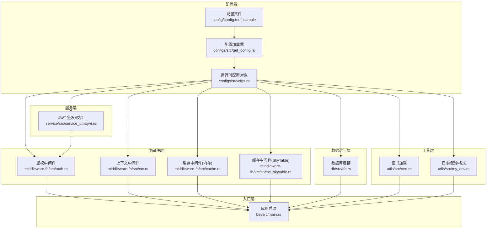
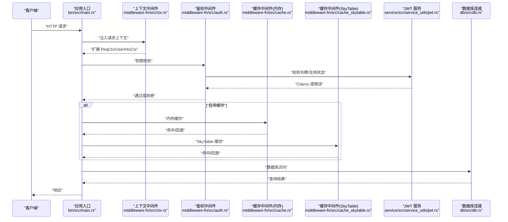
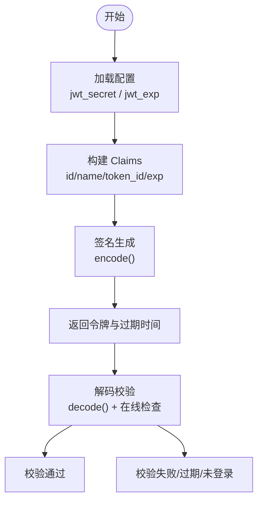
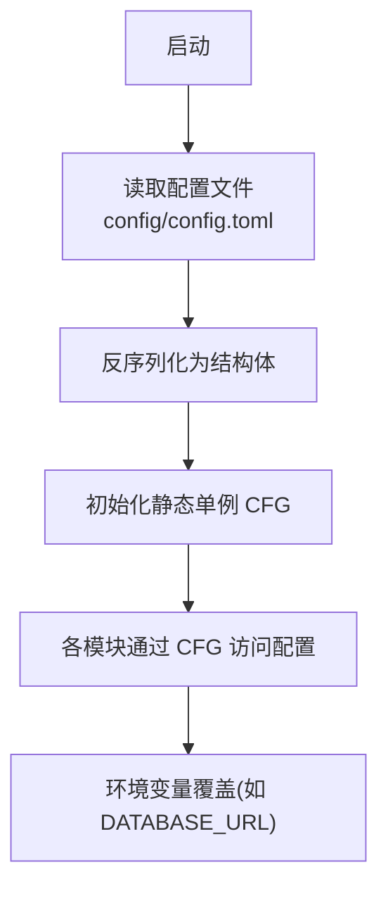
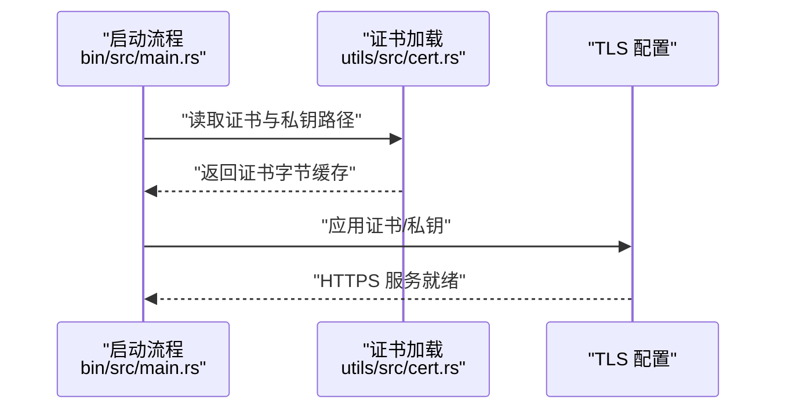
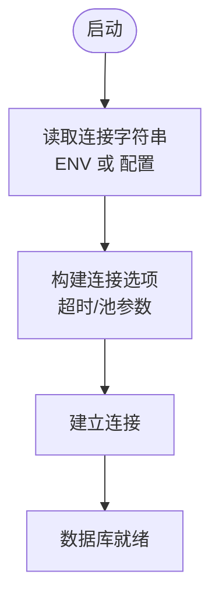
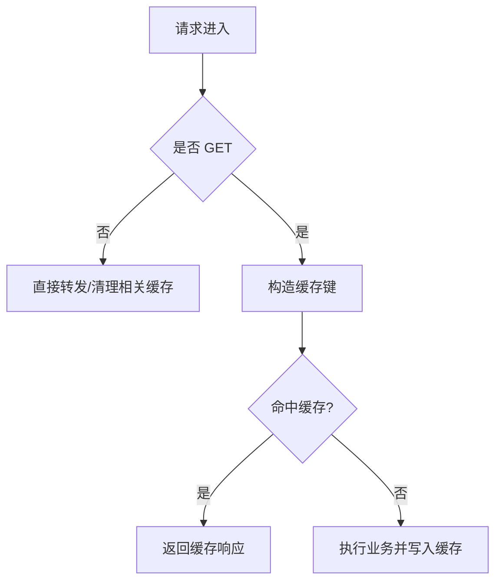
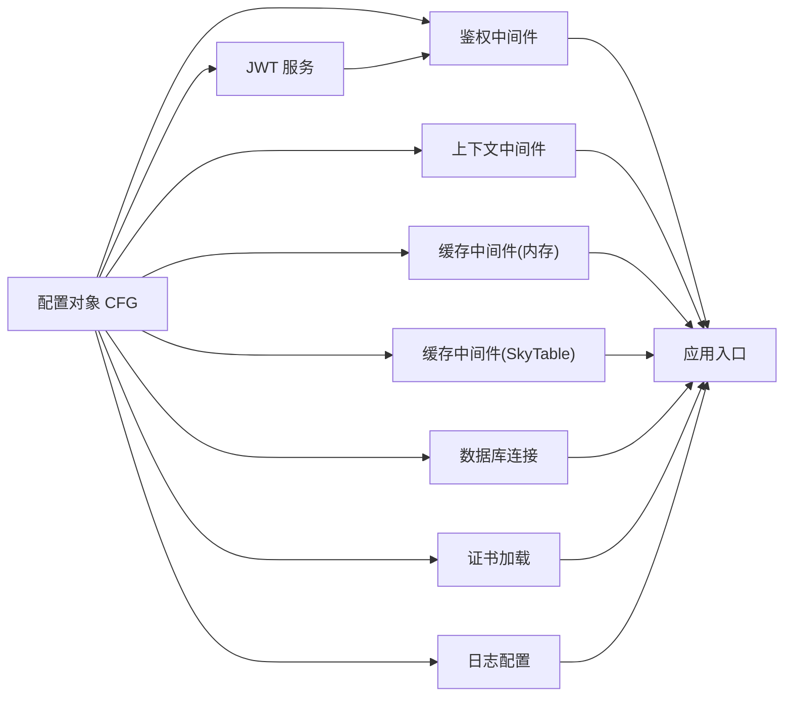

# 安全配置管理

<cite>
**本文引用的文件**
- [config/config.toml.sample](file://config/config.toml.sample)
- [.env.sample](file://.env.sample)
- [configs/src/lib.rs](file://configs/src/lib.rs)
- [configs/src/get_config.rs](file://configs/src/get_config.rs)
- [configs/src/cfgs.rs](file://configs/src/cfgs.rs)
- [service/src/service_utils/jwt.rs](file://service/src/service_utils/jwt.rs)
- [middleware-fn/src/auth.rs](file://middleware-fn/src/auth.rs)
- [middleware-fn/src/ctx.rs](file://middleware-fn/src/ctx.rs)
- [middleware-fn/src/cache.rs](file://middleware-fn/src/cache.rs)
- [middleware-fn/src/cache_skytable.rs](file://middleware-fn/src/cache_skytable.rs)
- [utils/src/cert.rs](file://utils/src/cert.rs)
- [utils/src/my_env.rs](file://utils/src/my_env.rs)
- [db/src/db.rs](file://db/src/db.rs)
- [bin/src/main.rs](file://bin/src/main.rs)
</cite>

## 目录
1. [简介](#简介)
2. [项目结构](#项目结构)
3. [核心组件](#核心组件)
4. [架构总览](#架构总览)
5. [详细组件分析](#详细组件分析)
6. [依赖关系分析](#依赖关系分析)
7. [性能与安全权衡](#性能与安全权衡)
8. [故障排查指南](#故障排查指南)
9. [结论](#结论)
10. [附录](#附录)

## 简介
本文件面向 Axum Admin 项目的“安全配置管理”，围绕以下主题展开：JWT 密钥与过期时间、环境变量与配置文件、HTTPS/TLS、CORS、CSRF 防护、数据库与缓存安全、日志安全输出、配置模板与校验、热更新机制、不同环境差异与生产加固建议，以及常见问题与解决方案。文档在技术深度与可读性之间取得平衡，既适合开发者深入理解实现细节，也便于运维人员快速落地。

## 项目结构
Axum Admin 的安全相关能力主要分布在如下模块：
- 配置层：集中于配置文件与运行时配置对象，负责加载与分发安全参数（如 JWT、日志、数据库、缓存、证书等）。
- 中间件层：鉴权、上下文注入、缓存、操作日志等中间件串联请求处理链，统一执行安全策略。
- 服务层：JWT 签发与校验、权限检查等。
- 工具层：证书加载、日志格式与级别控制。
- 数据访问层：数据库连接配置与连接池参数。
- 入口层：应用启动流程，包括 TLS、CORS、压缩、日志等。

图表来源
- [config/config.toml.sample](file://config/config.toml.sample#L1-L50)
- [configs/src/cfgs.rs](file://configs/src/cfgs.rs#L62-L110)
- [configs/src/get_config.rs](file://configs/src/get_config.rs#L1-L26)
- [service/src/service_utils/jwt.rs](file://service/src/service_utils/jwt.rs#L1-L164)
- [middleware-fn/src/auth.rs](file://middleware-fn/src/auth.rs#L1-L25)
- [middleware-fn/src/ctx.rs](file://middleware-fn/src/ctx.rs#L1-L47)
- [middleware-fn/src/cache.rs](file://middleware-fn/src/cache.rs#L146-L195)
- [middleware-fn/src/cache_skytable.rs](file://middleware-fn/src/cache_skytable.rs#L1-L230)
- [utils/src/cert.rs](file://utils/src/cert.rs#L1-L27)
- [utils/src/my_env.rs](file://utils/src/my_env.rs#L1-L72)
- [db/src/db.rs](file://db/src/db.rs#L1-L20)
- [bin/src/main.rs](file://bin/src/main.rs#L1-L41)

章节来源
- [config/config.toml.sample](file://config/config.toml.sample#L1-L50)
- [configs/src/lib.rs](file://configs/src/lib.rs#L1-L6)
- [configs/src/get_config.rs](file://configs/src/get_config.rs#L1-L26)
- [configs/src/cfgs.rs](file://configs/src/cfgs.rs#L62-L110)

## 核心组件
- 配置加载与分发：从配置文件加载 TOML 并反序列化为强类型结构体，通过静态单例在全系统共享，确保配置一致性与线程安全。
- JWT 安全：密钥来自配置，签发时按配置的过期分钟数计算过期时间；解码时进行默认校验并结合在线状态检查。
- 中间件安全链：上下文注入、鉴权、缓存、操作日志按序执行，统一拦截未授权或越权请求。
- 证书与 TLS：证书与私钥路径来自配置，启动时加载为字节缓存，供 TLS 服务使用。
- 数据库与缓存：连接字符串来自环境变量或配置；缓存支持内存与 SkyTable 两种后端，均受配置控制。
- 日志安全：日志级别与格式由配置决定，避免在生产环境输出敏感信息。

章节来源
- [configs/src/get_config.rs](file://configs/src/get_config.rs#L1-L26)
- [configs/src/cfgs.rs](file://configs/src/cfgs.rs#L62-L110)
- [service/src/service_utils/jwt.rs](file://service/src/service_utils/jwt.rs#L1-L164)
- [middleware-fn/src/auth.rs](file://middleware-fn/src/auth.rs#L1-L25)
- [middleware-fn/src/ctx.rs](file://middleware-fn/src/ctx.rs#L1-L47)
- [utils/src/cert.rs](file://utils/src/cert.rs#L1-L27)
- [db/src/db.rs](file://db/src/db.rs#L1-L20)
- [utils/src/my_env.rs](file://utils/src/my_env.rs#L1-L72)

## 架构总览
下图展示安全相关的关键交互：请求进入后经上下文注入、鉴权、权限检查、缓存命中/回源、业务处理与响应返回；同时贯穿日志记录与 TLS/证书加载。

图表来源
- [bin/src/main.rs](file://bin/src/main.rs#L1-L41)
- [middleware-fn/src/ctx.rs](file://middleware-fn/src/ctx.rs#L1-L47)
- [middleware-fn/src/auth.rs](file://middleware-fn/src/auth.rs#L1-L25)
- [middleware-fn/src/cache.rs](file://middleware-fn/src/cache.rs#L146-L195)
- [middleware-fn/src/cache_skytable.rs](file://middleware-fn/src/cache_skytable.rs#L160-L227)
- [service/src/service_utils/jwt.rs](file://service/src/service_utils/jwt.rs#L54-L94)
- [db/src/db.rs](file://db/src/db.rs#L1-L20)

## 详细组件分析

### JWT 密钥与过期时间
- 密钥来源：配置对象中的密钥字段，运行时以静态单例形式加载，保证全局一致。
- 过期时间：签发时基于配置的分钟数计算过期时间戳；解码时使用默认校验规则，并结合在线状态检查。
- 错误处理：针对无效令牌、过期、缺失凭据等场景返回标准化错误响应。
- 令牌结构：包含用户标识、令牌标识、名称与过期时间戳，便于服务端快速校验与审计。

图表来源
- [service/src/service_utils/jwt.rs](file://service/src/service_utils/jwt.rs#L105-L121)
- [service/src/service_utils/jwt.rs](file://service/src/service_utils/jwt.rs#L64-L85)
- [configs/src/cfgs.rs](file://configs/src/cfgs.rs#L74-L81)

章节来源
- [service/src/service_utils/jwt.rs](file://service/src/service_utils/jwt.rs#L1-L164)
- [configs/src/cfgs.rs](file://configs/src/cfgs.rs#L74-L81)

### 环境变量与配置文件管理
- 配置文件：默认位置与示例文件提供基础配置项，包括服务器、证书、日志、系统、JWT、数据库等。
- 环境变量：数据库连接字符串可通过环境变量覆盖，便于容器化部署与多环境切换。
- 加载机制：配置文件一次性读取并反序列化为静态单例，后续所有模块通过统一入口访问，避免重复 IO 与竞态。

图表来源
- [configs/src/get_config.rs](file://configs/src/get_config.rs#L1-L26)
- [.env.sample](file://.env.sample#L1-L3)
- [config/config.toml.sample](file://config/config.toml.sample#L1-L50)

章节来源
- [configs/src/get_config.rs](file://configs/src/get_config.rs#L1-L26)
- [config/config.toml.sample](file://config/config.toml.sample#L1-L50)
- [.env.sample](file://.env.sample#L1-L3)

### HTTPS/TLS 配置
- 证书来源：证书与私钥路径来自配置，启动时读取为字节缓存，供 TLS 服务使用。
- 启动集成：入口处加载证书与日志、TLS 配置，确保 HTTPS 服务可用。
- 建议：生产环境使用受信 CA 签发的证书，禁用自签名证书；仅暴露必要端口，限制 TLS 版本与密码套件。

图表来源
- [utils/src/cert.rs](file://utils/src/cert.rs#L1-L27)
- [bin/src/main.rs](file://bin/src/main.rs#L1-L41)

章节来源
- [utils/src/cert.rs](file://utils/src/cert.rs#L1-L27)
- [bin/src/main.rs](file://bin/src/main.rs#L1-L41)

### CORS 安全设置
- 当前代码未显式配置 CORS 中间件，若需跨域访问，请在入口处按需启用并限定来源、方法与头。
- 建议：最小化允许来源与方法，保留必要的预检缓存时间，避免通配符滥用。

（本小节为概念性说明，不直接分析具体文件）

### CSRF 防护机制
- 当前代码未发现专用的 CSRF 中间件或令牌校验逻辑。
- 建议：对状态变更类请求启用 SameSite Cookie、CSRF Token 校验，或采用 Token-in-Header 模式替代 Cookie。

（本小节为概念性说明，不直接分析具体文件）

### 数据库连接安全
- 连接字符串来源：优先使用环境变量覆盖，其次使用配置文件；支持 SQLite、MySQL、PostgreSQL。
- 连接池参数：最大/最小连接数、连接超时、空闲超时等参数已配置，有助于资源控制与稳定性。
- 建议：生产环境使用只读/受限账号、开启 TLS 连接、定期轮换凭据。

图表来源
- [db/src/db.rs](file://db/src/db.rs#L1-L20)
- [.env.sample](file://.env.sample#L1-L3)
- [config/config.toml.sample](file://config/config.toml.sample#L45-L50)

章节来源
- [db/src/db.rs](file://db/src/db.rs#L1-L20)
- [.env.sample](file://.env.sample#L1-L3)
- [config/config.toml.sample](file://config/config.toml.sample#L45-L50)

### 缓存安全配置
- 内存缓存：按 API 与方法维度缓存，支持按需清理。
- SkyTable 缓存：支持非 TLS 连接池，首次连接会清空数据库；缓存键包含 API 与方法，必要时可加入用户标识以区分会话。
- 建议：生产环境启用 SkyTable TLS；对敏感数据使用带用户标识的缓存键；合理设置过期时间与清理策略。

图表来源
- [middleware-fn/src/cache.rs](file://middleware-fn/src/cache.rs#L146-L195)
- [middleware-fn/src/cache_skytable.rs](file://middleware-fn/src/cache_skytable.rs#L160-L227)

章节来源
- [middleware-fn/src/cache.rs](file://middleware-fn/src/cache.rs#L146-L195)
- [middleware-fn/src/cache_skytable.rs](file://middleware-fn/src/cache_skytable.rs#L1-L230)

### 日志安全输出
- 日志级别：由配置决定，默认可设为 DEBUG/TRACE/INFO/WARN/ERROR。
- 日志格式：跨平台兼容的时间戳格式，便于审计与检索。
- 建议：生产环境避免输出敏感字段；对异常堆栈与完整请求体进行脱敏；集中化日志收集与告警。

章节来源
- [utils/src/my_env.rs](file://utils/src/my_env.rs#L38-L71)
- [config/config.toml.sample](file://config/config.toml.sample#L31-L37)

### 配置模板、校验与热更新
- 配置模板：提供示例配置文件，包含服务器、证书、日志、系统、JWT、数据库、缓存等关键项。
- 配置校验：启动阶段读取并反序列化配置，失败即崩溃，确保早期发现问题。
- 热更新：当前实现为一次性加载，不支持运行时热重载。若需热更新，可在入口增加文件监控与重新加载逻辑，注意并发安全与配置一致性。

章节来源
- [config/config.toml.sample](file://config/config.toml.sample#L1-L50)
- [configs/src/get_config.rs](file://configs/src/get_config.rs#L1-L26)

### 不同环境下的安全配置差异与生产加固建议
- 开发环境：可启用更详细的日志级别与调试信息；允许自签名证书；关闭严格缓存策略。
- 生产环境：强制 HTTPS/TLS；最小化 CORS 来源；启用 CSRF 防护；限制日志敏感信息；数据库使用强凭据与 TLS；缓存启用 TLS 与过期清理；严格控制中间件顺序与权限。

（本小节为通用建议，不直接分析具体文件）

## 依赖关系分析
- 配置依赖：所有安全相关模块均依赖配置对象；配置对象依赖配置文件与环境变量。
- 中间件依赖：鉴权中间件依赖 JWT 服务与权限工具；上下文中间件为其他中间件提供上下文；缓存中间件依赖 API 列表与用户上下文。
- 工具依赖：证书工具与日志工具被入口与中间件使用。
- 数据库依赖：服务层与 API 层依赖数据库连接。

图表来源
- [configs/src/cfgs.rs](file://configs/src/cfgs.rs#L62-L110)
- [service/src/service_utils/jwt.rs](file://service/src/service_utils/jwt.rs#L1-L164)
- [middleware-fn/src/auth.rs](file://middleware-fn/src/auth.rs#L1-L25)
- [middleware-fn/src/ctx.rs](file://middleware-fn/src/ctx.rs#L1-L47)
- [middleware-fn/src/cache.rs](file://middleware-fn/src/cache.rs#L146-L195)
- [middleware-fn/src/cache_skytable.rs](file://middleware-fn/src/cache_skytable.rs#L1-L230)
- [db/src/db.rs](file://db/src/db.rs#L1-L20)
- [utils/src/cert.rs](file://utils/src/cert.rs#L1-L27)
- [utils/src/my_env.rs](file://utils/src/my_env.rs#L1-L72)
- [bin/src/main.rs](file://bin/src/main.rs#L1-L41)

章节来源
- [configs/src/cfgs.rs](file://configs/src/cfgs.rs#L62-L110)
- [service/src/service_utils/jwt.rs](file://service/src/service_utils/jwt.rs#L1-L164)
- [middleware-fn/src/auth.rs](file://middleware-fn/src/auth.rs#L1-L25)
- [middleware-fn/src/ctx.rs](file://middleware-fn/src/ctx.rs#L1-L47)
- [middleware-fn/src/cache.rs](file://middleware-fn/src/cache.rs#L146-L195)
- [middleware-fn/src/cache_skytable.rs](file://middleware-fn/src/cache_skytable.rs#L1-L230)
- [db/src/db.rs](file://db/src/db.rs#L1-L20)
- [utils/src/cert.rs](file://utils/src/cert.rs#L1-L27)
- [utils/src/my_env.rs](file://utils/src/my_env.rs#L1-L72)
- [bin/src/main.rs](file://bin/src/main.rs#L1-L41)

## 性能与安全权衡
- 缓存策略：内存与 SkyTable 缓存可显著降低数据库压力，但需注意缓存键设计与过期清理，避免脏数据与内存泄漏。
- 连接池：合理的最大/最小连接数与超时设置可提升吞吐与稳定性，同时防止资源耗尽。
- 日志级别：生产环境建议降低日志级别，避免高频写盘影响性能。
- TLS：启用硬件加速与合适的密码套件可提升性能与安全性。

（本小节为通用建议，不直接分析具体文件）

## 故障排查指南
- 配置加载失败：检查配置文件路径与权限，确认 TOML 格式正确；查看启动时的错误提示。
- JWT 校验失败：检查密钥是否一致、过期时间是否正确、用户是否在线；关注错误响应状态码。
- 数据库连接异常：核对连接字符串、网络连通性与凭据；检查连接池参数与超时设置。
- 缓存未命中：确认缓存键构造逻辑、相关 API 清理策略与过期时间；检查 SkyTable 连接与权限。
- 日志输出异常：确认日志目录存在且可写，日志级别与格式配置正确。

章节来源
- [configs/src/get_config.rs](file://configs/src/get_config.rs#L1-L26)
- [service/src/service_utils/jwt.rs](file://service/src/service_utils/jwt.rs#L123-L145)
- [db/src/db.rs](file://db/src/db.rs#L1-L20)
- [middleware-fn/src/cache_skytable.rs](file://middleware-fn/src/cache_skytable.rs#L25-L40)
- [utils/src/my_env.rs](file://utils/src/my_env.rs#L38-L71)

## 结论
Axum Admin 的安全配置管理以“配置驱动 + 中间件链 + 工具层支撑”为核心，实现了 JWT、证书、日志、缓存与数据库连接等关键安全要素的统一治理。建议在生产环境中进一步完善 CORS/CSRF、TLS 与缓存后端的 TLS 支持，并引入配置热更新与更严格的权限控制，持续提升系统的安全性与可观测性。

## 附录
- 安全配置清单（基于现有实现）
  - JWT 密钥与过期时间：配置对象中的密钥与过期分钟数。
  - HTTPS/TLS：证书与私钥路径，入口处加载。
  - CORS：当前未显式配置，建议按需启用。
  - CSRF：当前未实现，建议补充。
  - 数据库连接：环境变量优先，支持多种后端。
  - 缓存：内存与 SkyTable 两种模式，支持过期清理。
  - 日志：级别、目录、文件名与格式，支持文件滚动输出。

章节来源
- [config/config.toml.sample](file://config/config.toml.sample#L1-L50)
- [configs/src/cfgs.rs](file://configs/src/cfgs.rs#L62-L110)
- [service/src/service_utils/jwt.rs](file://service/src/service_utils/jwt.rs#L1-L164)
- [utils/src/cert.rs](file://utils/src/cert.rs#L1-L27)
- [db/src/db.rs](file://db/src/db.rs#L1-L20)
- [middleware-fn/src/cache_skytable.rs](file://middleware-fn/src/cache_skytable.rs#L1-L230)
- [utils/src/my_env.rs](file://utils/src/my_env.rs#L1-L72)