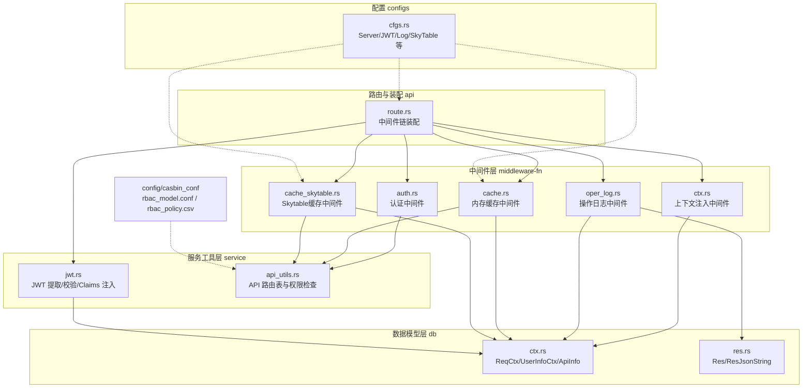
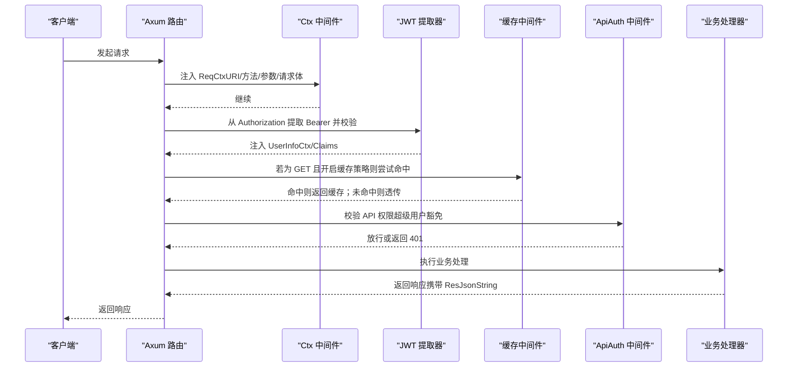
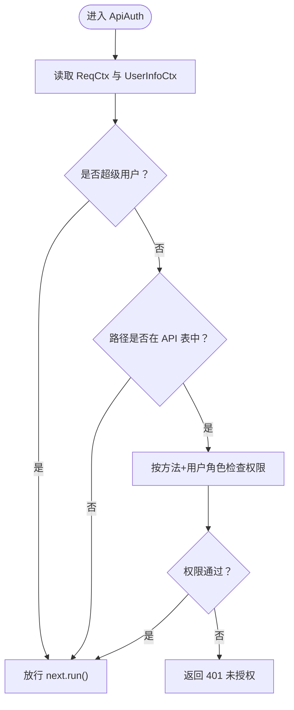
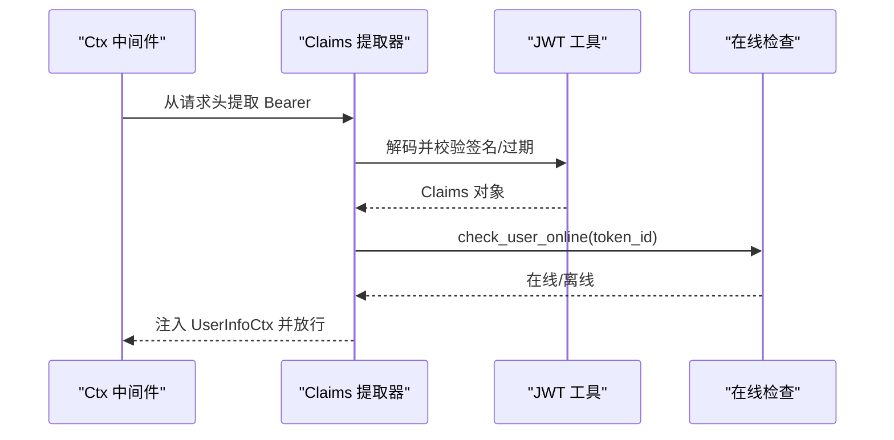
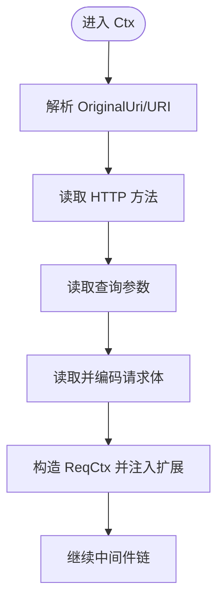
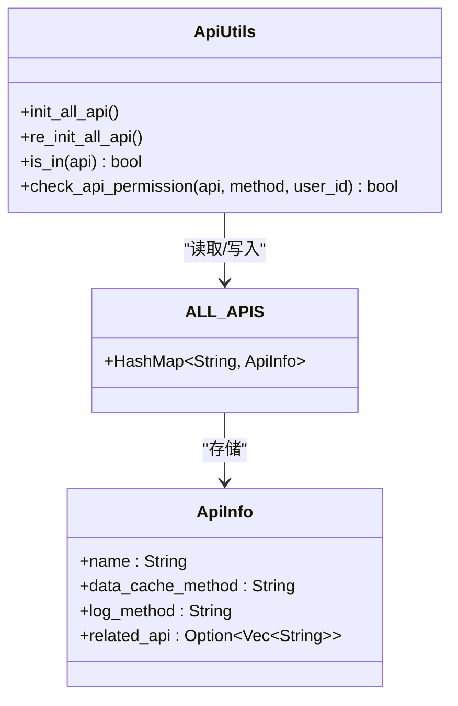
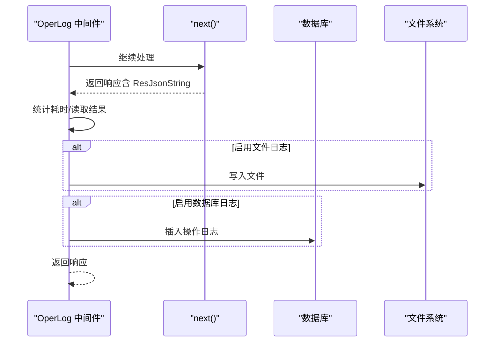
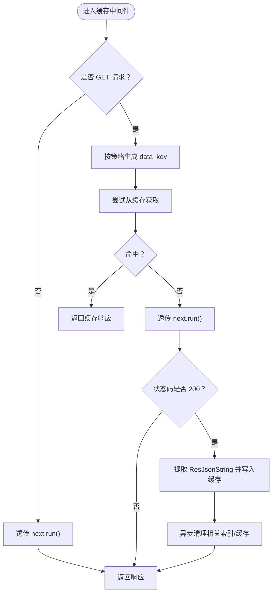
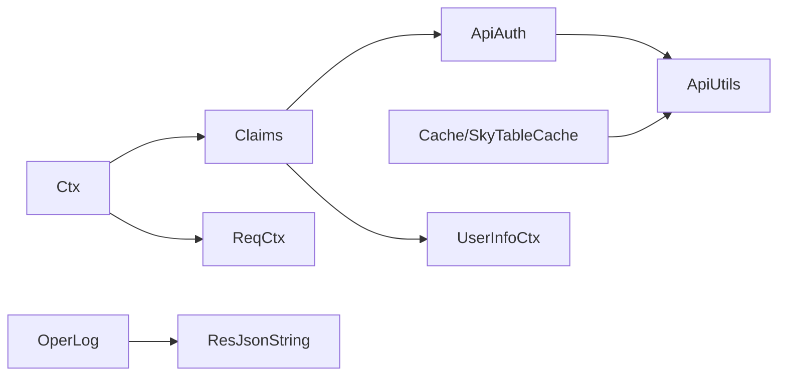

# 访问控制中间件

<cite>
**本文引用的文件**
- [middleware-fn/src/lib.rs](file://middleware-fn/src/lib.rs)
- [middleware-fn/src/auth.rs](file://middleware-fn/src/auth.rs)
- [middleware-fn/src/ctx.rs](file://middleware-fn/src/ctx.rs)
- [middleware-fn/src/oper_log.rs](file://middleware-fn/src/oper_log.rs)
- [middleware-fn/src/cache.rs](file://middleware-fn/src/cache.rs)
- [middleware-fn/src/cache_skytable.rs](file://middleware-fn/src/cache_skytable.rs)
- [service/src/service_utils/api_utils.rs](file://service/src/service_utils/api_utils.rs)
- [service/src/service_utils/jwt.rs](file://service/src/service_utils/jwt.rs)
- [db/src/common/ctx.rs](file://db/src/common/ctx.rs)
- [db/src/common/res.rs](file://db/src/common/res.rs)
- [api/src/route.rs](file://api/src/route.rs)
- [configs/src/cfgs.rs](file://configs/src/cfgs.rs)
- [config/casbin_conf/rbac_model.conf](file://config/casbin_conf/rbac_model.conf)
- [config/casbin_conf/rbac_policy.csv](file://config/casbin_conf/rbac_policy.csv)
</cite>

## 目录
1. [简介](#简介)
2. [项目结构](#项目结构)
3. [核心组件](#核心组件)
4. [架构总览](#架构总览)
5. [组件详解](#组件详解)
6. [依赖关系分析](#依赖关系分析)
7. [性能考量](#性能考量)
8. [故障排查指南](#故障排查指南)
9. [结论](#结论)
10. [附录](#附录)

## 简介
本文件面向 Axum Admin 的访问控制中间件体系，系统性阐述以下方面：
- 认证中间件：Bearer 令牌提取、用户身份验证、会话有效性校验与放行逻辑
- 权限验证中间件：基于 API 路由表与用户角色的动态权限检查
- 缓存中间件：内存与 Skytable 两种缓存实现、缓存策略与失效机制
- 操作日志中间件：权限相关操作与安全事件的记录与落库
- 中间件链组合模式与配置示例
- 性能优化建议与安全配置最佳实践

## 项目结构
访问控制相关代码主要分布在如下模块：
- 中间件层：middleware-fn（认证、上下文、操作日志、缓存）
- 服务工具层：service（JWT、API 路由表与权限检查）
- 数据模型层：db（请求上下文、响应包装）
- 路由与装配：api（中间件链装配）
- 配置：configs（运行时开关与参数）

图表来源
- [api/src/route.rs](file://api/src/route.rs#L32-L54)
- [middleware-fn/src/lib.rs](file://middleware-fn/src/lib.rs#L1-L23)
- [service/src/service_utils/jwt.rs](file://service/src/service_utils/jwt.rs#L54-L94)
- [service/src/service_utils/api_utils.rs](file://service/src/service_utils/api_utils.rs#L90-L118)
- [db/src/common/ctx.rs](file://db/src/common/ctx.rs#L1-L33)
- [db/src/common/res.rs](file://db/src/common/res.rs#L34-L62)
- [configs/src/cfgs.rs](file://configs/src/cfgs.rs#L24-L42)
- [config/casbin_conf/rbac_model.conf](file://config/casbin_conf/rbac_model.conf#L1-L14)
- [config/casbin_conf/rbac_policy.csv](file://config/casbin_conf/rbac_policy.csv#L1-L5)

章节来源
- [api/src/route.rs](file://api/src/route.rs#L12-L54)
- [middleware-fn/src/lib.rs](file://middleware-fn/src/lib.rs#L1-L23)

## 核心组件
- 认证中间件（ApiAuth）：对受保护路由进行 API 权限校验；超级用户豁免
- 上下文中间件（Ctx）：解析原始 URI、方法、路径参数与请求体，注入 ReqCtx；同时通过 Claims 提取器注入 UserInfoCtx
- 权限检查工具（ApiUtils）：维护 API 路由表，按用户角色与方法进行动态权限判断
- JWT 提取器（Claims）：从 Authorization 头提取 Bearer 令牌，解码并校验过期与在线状态，注入用户信息
- 操作日志中间件（OperLog）：记录请求耗时、结果、错误等，支持文件与数据库双写
- 缓存中间件（Cache / SkyTableCache）：按 GET 请求与策略生成缓存键，命中则直接返回，未命中则透传后缓存
- 配置（CFG）：控制是否启用操作日志、缓存时间与方式、API 前缀、JWT 密钥与过期时间等

章节来源
- [middleware-fn/src/auth.rs](file://middleware-fn/src/auth.rs#L6-L24)
- [middleware-fn/src/ctx.rs](file://middleware-fn/src/ctx.rs#L13-L51)
- [service/src/service_utils/api_utils.rs](file://service/src/service_utils/api_utils.rs#L90-L118)
- [service/src/service_utils/jwt.rs](file://service/src/service_utils/jwt.rs#L54-L94)
- [middleware-fn/src/oper_log.rs](file://middleware-fn/src/oper_log.rs#L21-L42)
- [middleware-fn/src/cache.rs](file://middleware-fn/src/cache.rs#L126-L193)
- [middleware-fn/src/cache_skytable.rs](file://middleware-fn/src/cache_skytable.rs#L160-L227)
- [configs/src/cfgs.rs](file://configs/src/cfgs.rs#L24-L42)

## 架构总览
中间件链在路由装配阶段按顺序执行，形成“先上下文注入，再 JWT 校验，然后可选缓存，最后权限校验”的控制流。

图表来源
- [api/src/route.rs](file://api/src/route.rs#L32-L54)
- [middleware-fn/src/ctx.rs](file://middleware-fn/src/ctx.rs#L13-L51)
- [service/src/service_utils/jwt.rs](file://service/src/service_utils/jwt.rs#L54-L94)
- [middleware-fn/src/cache.rs](file://middleware-fn/src/cache.rs#L126-L193)
- [middleware-fn/src/auth.rs](file://middleware-fn/src/auth.rs#L6-L24)

## 组件详解

### 认证中间件（ApiAuth）
职责与流程
- 从扩展中读取 ReqCtx 与 UserInfoCtx
- 若当前用户为超级用户，则直接放行
- 若请求路径在 API 路由表中，则按方法与用户角色进行权限检查
- 未匹配到路由或检查通过则放行，否则返回未授权

图表来源
- [middleware-fn/src/auth.rs](file://middleware-fn/src/auth.rs#L6-L24)
- [service/src/service_utils/api_utils.rs](file://service/src/service_utils/api_utils.rs#L90-L118)

章节来源
- [middleware-fn/src/auth.rs](file://middleware-fn/src/auth.rs#L6-L24)
- [service/src/service_utils/api_utils.rs](file://service/src/service_utils/api_utils.rs#L90-L118)

### JWT 提取与会话校验（Claims）
职责与流程
- 从 Authorization 头提取 Bearer 令牌
- 使用密钥解码并校验过期时间
- 结合在线状态检查（根据 token_id），若离线则拒绝
- 成功后将 UserInfoCtx 注入扩展，供后续中间件使用

图表来源
- [service/src/service_utils/jwt.rs](file://service/src/service_utils/jwt.rs#L54-L94)
- [middleware-fn/src/ctx.rs](file://middleware-fn/src/ctx.rs#L13-L51)

章节来源
- [service/src/service_utils/jwt.rs](file://service/src/service_utils/jwt.rs#L54-L94)
- [middleware-fn/src/ctx.rs](file://middleware-fn/src/ctx.rs#L13-L51)

### 上下文中间件（Ctx）
职责与流程
- 解析原始 URI、方法、查询参数
- 读取并编码请求体为字符串，便于后续日志与缓存
- 构造 ReqCtx 并注入扩展
- 透传给下一个中间件

图表来源
- [middleware-fn/src/ctx.rs](file://middleware-fn/src/ctx.rs#L13-L51)
- [db/src/common/ctx.rs](file://db/src/common/ctx.rs#L1-L9)

章节来源
- [middleware-fn/src/ctx.rs](file://middleware-fn/src/ctx.rs#L13-L51)
- [db/src/common/ctx.rs](file://db/src/common/ctx.rs#L1-L9)

### 权限检查工具（ApiUtils）
职责与流程
- 维护 API 路由表（ALL_APIS），包含名称、缓存策略、日志策略与关联 API
- 提供 is_in 判断与 check_api_permission（按用户角色与方法查询 sys_role_api）

图表来源
- [service/src/service_utils/api_utils.rs](file://service/src/service_utils/api_utils.rs#L16-L88)
- [db/src/common/ctx.rs](file://db/src/common/ctx.rs#L27-L32)

章节来源
- [service/src/service_utils/api_utils.rs](file://service/src/service_utils/api_utils.rs#L16-L88)
- [db/src/common/ctx.rs](file://db/src/common/ctx.rs#L27-L32)

### 操作日志中间件（OperLog）
职责与流程
- 在请求完成后统计耗时，读取 ResJsonString
- 根据配置决定是否记录日志（文件/数据库/两者）
- 异步写入，避免阻塞主请求链路

图表来源
- [middleware-fn/src/oper_log.rs](file://middleware-fn/src/oper_log.rs#L21-L103)
- [db/src/common/res.rs](file://db/src/common/res.rs#L34-L62)

章节来源
- [middleware-fn/src/oper_log.rs](file://middleware-fn/src/oper_log.rs#L21-L103)
- [db/src/common/res.rs](file://db/src/common/res.rs#L34-L62)

### 缓存中间件（Cache / SkyTableCache）
职责与流程
- 仅对 GET 请求生效
- 根据策略生成缓存键（可包含 token_id）
- 命中则直接返回缓存；未命中则透传请求并将响应体写入缓存
- 写入后异步清理相关索引与缓存数据
- 支持内存版与 Skytable 版两种实现

图表来源
- [middleware-fn/src/cache.rs](file://middleware-fn/src/cache.rs#L126-L193)
- [middleware-fn/src/cache_skytable.rs](file://middleware-fn/src/cache_skytable.rs#L160-L227)
- [db/src/common/res.rs](file://db/src/common/res.rs#L34-L62)

章节来源
- [middleware-fn/src/cache.rs](file://middleware-fn/src/cache.rs#L126-L193)
- [middleware-fn/src/cache_skytable.rs](file://middleware-fn/src/cache_skytable.rs#L160-L227)
- [db/src/common/res.rs](file://db/src/common/res.rs#L34-L62)

### 中间件链装配与配置
- 在路由装配时按顺序叠加中间件链
- 可根据配置选择是否启用操作日志与缓存中间件
- 缓存中间件支持内存版与 Skytable 版切换

章节来源
- [api/src/route.rs](file://api/src/route.rs#L32-L54)
- [configs/src/cfgs.rs](file://configs/src/cfgs.rs#L24-L42)

## 依赖关系分析
- 中间件之间耦合度低，职责清晰：Ctx/Claims 负责上下文与鉴权，ApiAuth 负责权限，OperLog/Cache 负责横切关注点
- ApiUtils 作为权限检查的唯一入口，集中维护 API 路由表与权限查询
- 缓存中间件依赖 ApiUtils 的 API 表与策略字段，以及 ResJsonString 的响应体
- JWT 提取器与在线状态检查共同保证会话有效性

图表来源
- [middleware-fn/src/ctx.rs](file://middleware-fn/src/ctx.rs#L13-L51)
- [service/src/service_utils/jwt.rs](file://service/src/service_utils/jwt.rs#L54-L94)
- [middleware-fn/src/auth.rs](file://middleware-fn/src/auth.rs#L6-L24)
- [service/src/service_utils/api_utils.rs](file://service/src/service_utils/api_utils.rs#L90-L118)
- [middleware-fn/src/cache.rs](file://middleware-fn/src/cache.rs#L126-L193)
- [middleware-fn/src/oper_log.rs](file://middleware-fn/src/oper_log.rs#L21-L42)
- [db/src/common/ctx.rs](file://db/src/common/ctx.rs#L1-L33)
- [db/src/common/res.rs](file://db/src/common/res.rs#L34-L62)

## 性能考量
- 缓存命中优先：对高频 GET 接口启用缓存可显著降低数据库压力与响应时间
- 异步写入与清理：日志与缓存写入均采用异步任务，避免阻塞主链路
- 请求体读取与编码：Ctx 中一次性读取并编码请求体，便于日志与缓存复用
- Skytable 缓存：适合分布式场景，具备自动过期与批量清理能力
- 配置化控制：通过配置项灵活关闭日志或缓存，减少不必要的开销

## 故障排查指南
- 401 未授权
  - 检查用户是否为超级用户
  - 确认 API 是否已注册到路由表
  - 核对用户角色是否具备对应方法的权限
- JWT 校验失败
  - 检查 Authorization 头格式与签名密钥
  - 核对 token 是否过期或已被踢下线
- 缓存未命中或脏数据
  - 确认缓存策略与 data_key 生成规则
  - 触发变更后是否正确清理相关索引/缓存
- 操作日志未记录
  - 检查日志开关与日志级别
  - 确认响应体是否正确注入 ResJsonString

章节来源
- [middleware-fn/src/auth.rs](file://middleware-fn/src/auth.rs#L6-L24)
- [service/src/service_utils/jwt.rs](file://service/src/service_utils/jwt.rs#L54-L94)
- [middleware-fn/src/cache.rs](file://middleware-fn/src/cache.rs#L126-L193)
- [middleware-fn/src/oper_log.rs](file://middleware-fn/src/oper_log.rs#L21-L103)

## 结论
Axum Admin 的访问控制中间件体系以清晰的职责划分与可配置的装配模式实现了高内聚、低耦合的安全控制链。通过 JWT 会话校验、API 路由表驱动的权限检查、可选的操作日志与缓存机制，既满足了安全需求，又兼顾了性能与可观测性。结合 CASBin 的模型与策略文件，可进一步扩展细粒度的资源权限控制。

## 附录

### 中间件链组合模式与配置示例
- 基本链路
  - Ctx → Claims → 可选：缓存中间件 → ApiAuth → 业务处理器
- 路由装配要点
  - 受保护模块统一应用中间件链
  - 根据配置决定是否启用操作日志与缓存
- 配置项参考
  - 服务器：缓存时间、缓存方式、API 前缀
  - JWT：密钥、过期时间
  - 日志：是否启用操作日志
  - Skytable：服务地址与端口

章节来源
- [api/src/route.rs](file://api/src/route.rs#L32-L54)
- [configs/src/cfgs.rs](file://configs/src/cfgs.rs#L24-L42)

### 自定义中间件开发指南
- 读取扩展：从 req.extensions() 获取 ReqCtx、UserInfoCtx 或其他上下文
- 注入扩展：通过 req.extensions_mut().insert(...) 注入自定义上下文
- 响应扩展：如需在下游中间件/日志中使用响应体，可注入 ResJsonString
- 错误处理：返回 (StatusCode, String) 或使用 IntoResponse 实现
- 异步任务：对非关键路径（日志/缓存）使用异步任务避免阻塞

章节来源
- [db/src/common/ctx.rs](file://db/src/common/ctx.rs#L1-L33)
- [db/src/common/res.rs](file://db/src/common/res.rs#L34-L62)
- [middleware-fn/src/oper_log.rs](file://middleware-fn/src/oper_log.rs#L21-L42)

### 与 CASBin 的集成说明
- 模型与策略
  - 模型定义了请求、策略、角色与效果的关系
  - 策略文件定义了主体（用户）、对象（资源）与动作（方法）
- 集成方式
  - 当前权限检查基于 ApiUtils 与数据库角色-接口映射
  - 可在 ApiUtils 的权限检查逻辑中引入 CASBin 的 Enforcer 进行补充校验

章节来源
- [config/casbin_conf/rbac_model.conf](file://config/casbin_conf/rbac_model.conf#L1-L14)
- [config/casbin_conf/rbac_policy.csv](file://config/casbin_conf/rbac_policy.csv#L1-L5)
- [service/src/service_utils/api_utils.rs](file://service/src/service_utils/api_utils.rs#L90-L118)