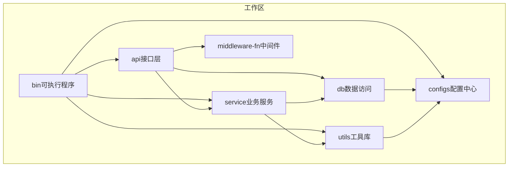
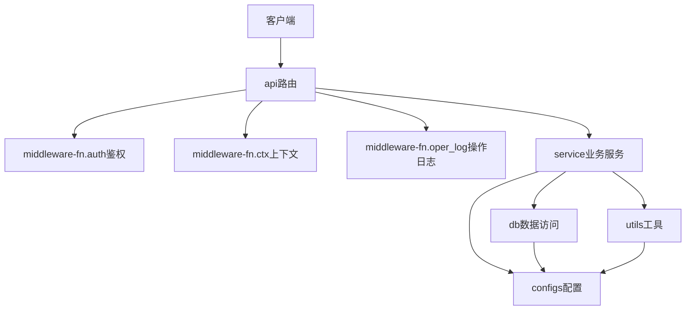
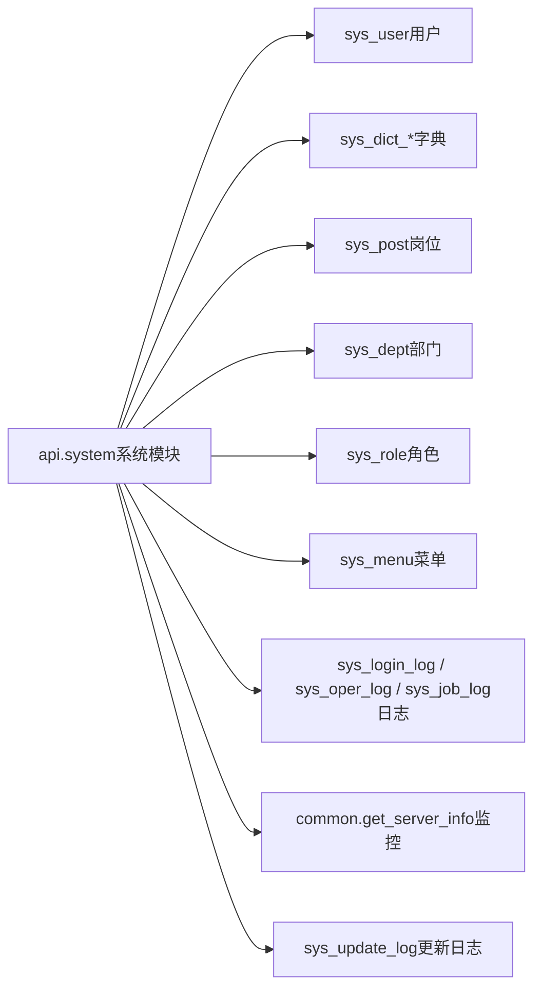
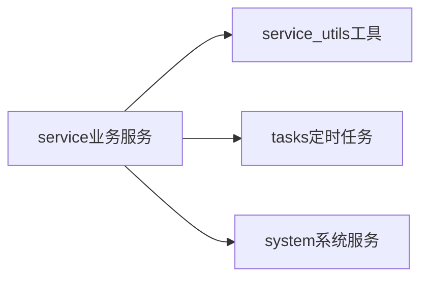
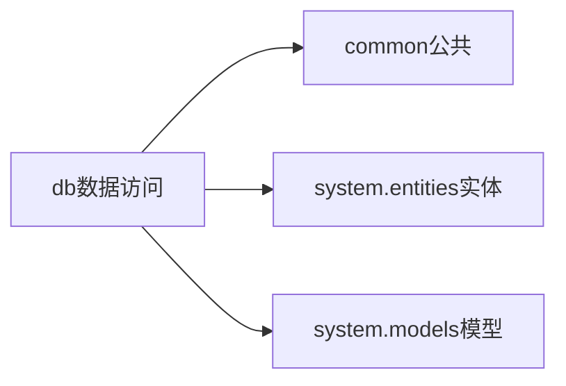
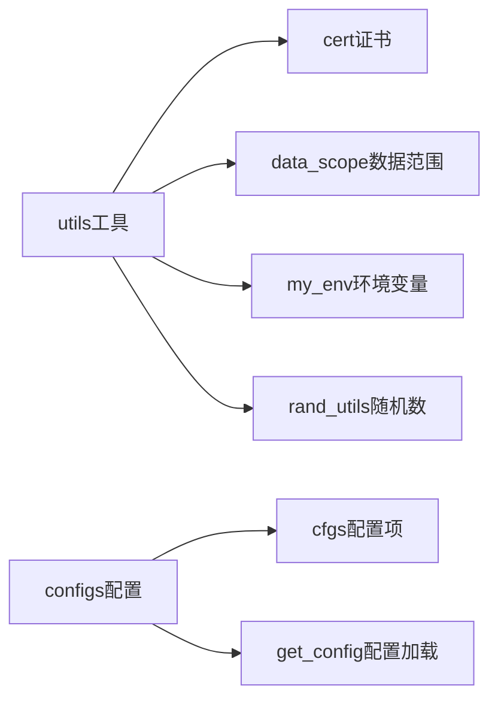
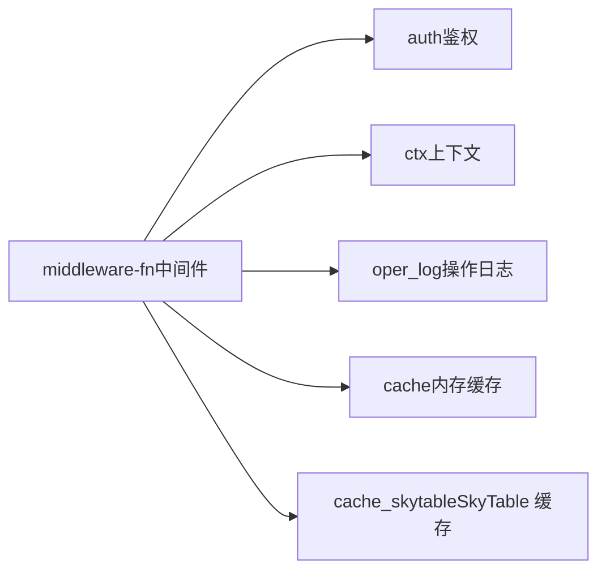
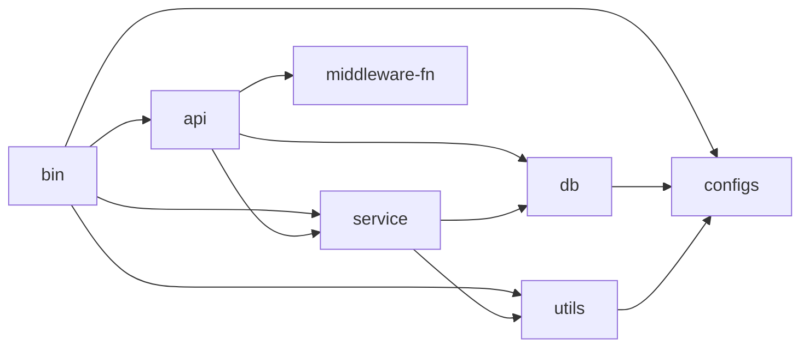

# 代码规范

<cite>
**本文引用的文件**
- [.editorconfig](file://.editorconfig)
- [.rustfmt.toml](file://.rustfmt.toml)
- [Cargo.toml（工作区）](file://Cargo.toml)
- [api/Cargo.toml](file://api/Cargo.toml)
- [service/Cargo.toml](file://service/Cargo.toml)
- [db/Cargo.toml](file://db/Cargo.toml)
- [utils/Cargo.toml](file://utils/Cargo.toml)
- [configs/Cargo.toml](file://configs/Cargo.toml)
- [middleware-fn/Cargo.toml](file://middleware-fn/Cargo.toml)
- [bin/Cargo.toml](file://bin/Cargo.toml)
- [api/src/lib.rs](file://api/src/lib.rs)
- [api/src/system/mod.rs](file://api/src/system/mod.rs)
- [db/src/lib.rs](file://db/src/lib.rs)
- [service/src/lib.rs](file://service/src/lib.rs)
- [utils/src/lib.rs](file://utils/src/lib.rs)
- [configs/src/lib.rs](file://configs/src/lib.rs)
- [middleware-fn/src/lib.rs](file://middleware-fn/src/lib.rs)
</cite>

## 目录
1. [引言](#引言)
2. [项目结构](#项目结构)
3. [核心组件](#核心组件)
4. [架构总览](#架构总览)
5. [详细组件分析](#详细组件分析)
6. [依赖分析](#依赖分析)
7. [性能考虑](#性能考虑)
8. [故障排查指南](#故障排查指南)
9. [结论](#结论)
10. [附录](#附录)

## 引言
本文件为 Axum Admin 项目的代码规范文档，聚焦于 Rust 代码风格、命名约定、注释规范、格式化标准与项目配置规范。内容基于仓库中的实际配置与模块组织，旨在帮助贡献者统一风格、提升可读性与可维护性，并提供 IDE 与自动化工具的使用建议。

## 项目结构
Axum Admin 采用多包工作区（workspace）组织，核心模块包括：
- 应用入口：bin（可执行程序）
- 接口层：api（Axum 路由与系统模块）
- 业务服务：service（应用服务与定时任务）
- 数据访问：db（SeaORM 数据模型与实体）
- 工具库：utils（通用工具）
- 配置中心：configs（配置加载与导出）
- 中间件：middleware-fn（鉴权、上下文、操作日志、缓存等）

图表来源
- [Cargo.toml（工作区）](file://Cargo.toml#L1-L12)
- [bin/Cargo.toml](file://bin/Cargo.toml#L10-L16)
- [api/Cargo.toml](file://api/Cargo.toml#L8-L22)
- [service/Cargo.toml](file://service/Cargo.toml#L9-L13)
- [db/Cargo.toml](file://db/Cargo.toml#L9-L11)

章节来源
- [Cargo.toml（工作区）](file://Cargo.toml#L1-L12)
- [api/src/lib.rs](file://api/src/lib.rs#L1-L10)
- [db/src/lib.rs](file://db/src/lib.rs#L1-L8)
- [service/src/lib.rs](file://service/src/lib.rs#L1-L7)
- [utils/src/lib.rs](file://utils/src/lib.rs#L1-L9)
- [configs/src/lib.rs](file://configs/src/lib.rs#L1-L6)
- [middleware-fn/src/lib.rs](file://middleware-fn/src/lib.rs#L1-L23)

## 核心组件
- 接口层（api）：通过系统子模块组织路由，统一导出路由工厂函数；模块内部按领域拆分，便于扩展与维护。
- 业务服务（service）：包含通用服务工具、定时任务与系统服务模块，强调职责分离与可测试性。
- 数据访问（db）：以实体与模型分层，支持多数据库后端特性开关。
- 工具库（utils）：提供加密、随机数、环境变量与通用工具。
- 配置中心（configs）：集中加载与导出配置。
- 中间件（middleware-fn）：按功能拆分，支持条件编译特性。

章节来源
- [api/src/system/mod.rs](file://api/src/system/mod.rs#L1-L199)
- [service/src/lib.rs](file://service/src/lib.rs#L1-L7)
- [db/src/lib.rs](file://db/src/lib.rs#L1-L8)
- [utils/src/lib.rs](file://utils/src/lib.rs#L1-L9)
- [configs/src/lib.rs](file://configs/src/lib.rs#L1-L6)
- [middleware-fn/src/lib.rs](file://middleware-fn/src/lib.rs#L1-L23)

## 架构总览
接口层通过路由工厂聚合各系统模块；业务层封装领域逻辑并与数据层交互；中间件贯穿请求生命周期，提供鉴权、上下文与日志能力；配置中心与工具库为各层提供支撑。

图表来源
- [api/src/system/mod.rs](file://api/src/system/mod.rs#L26-L44)
- [middleware-fn/src/lib.rs](file://middleware-fn/src/lib.rs#L1-L23)
- [service/Cargo.toml](file://service/Cargo.toml#L9-L13)
- [db/Cargo.toml](file://db/Cargo.toml#L9-L11)
- [utils/Cargo.toml](file://utils/Cargo.toml#L9-L11)
- [configs/Cargo.toml](file://configs/Cargo.toml#L9-L14)

## 详细组件分析

### 接口层（api）模块组织与导出
- 模块划分：按系统功能拆分为多个子模块，如用户、字典、岗位、部门、角色、菜单、日志、监控、更新日志等。
- 路由聚合：通过系统路由工厂函数统一挂载各子模块路由，便于扩展与维护。
- 导出策略：仅导出必要的公共 API，避免过度暴露内部实现细节。

图表来源
- [api/src/system/mod.rs](file://api/src/system/mod.rs#L1-L199)

章节来源
- [api/src/lib.rs](file://api/src/lib.rs#L1-L10)
- [api/src/system/mod.rs](file://api/src/system/mod.rs#L1-L199)

### 业务服务（service）模块组织
- 服务工具：提供 JWT、Web 工具、API 工具等通用能力。
- 定时任务：独立 tasks 子模块，支持任务构建与运行器。
- 系统服务：按领域拆分，与数据层协作完成业务流程。

图表来源
- [service/src/lib.rs](file://service/src/lib.rs#L1-L7)

章节来源
- [service/src/lib.rs](file://service/src/lib.rs#L1-L7)

### 数据访问（db）模块组织
- 公共模块：连接、上下文、响应封装等通用能力。
- 实体与模型：按系统表拆分，支持多数据库后端特性开关。
- 导出策略：统一导出数据库连接与上下文，便于上层使用。

图表来源
- [db/src/lib.rs](file://db/src/lib.rs#L1-L8)

章节来源
- [db/src/lib.rs](file://db/src/lib.rs#L1-L8)

### 工具库（utils）与配置中心（configs）
- 工具库：提供证书、数据范围、环境变量、随机数等工具。
- 配置中心：集中加载配置并通过公共句柄导出，确保全局一致。

图表来源
- [utils/src/lib.rs](file://utils/src/lib.rs#L1-L9)
- [configs/src/lib.rs](file://configs/src/lib.rs#L1-L6)

章节来源
- [utils/src/lib.rs](file://utils/src/lib.rs#L1-L9)
- [configs/src/lib.rs](file://configs/src/lib.rs#L1-L6)

### 中间件（middleware-fn）功能与导出
- 功能拆分：鉴权、上下文、操作日志、缓存（内存与 SkyTable）。
- 条件编译：通过特性开关启用不同缓存实现。
- 导出策略：统一导出中间件函数名，便于在接口层组合使用。

图表来源
- [middleware-fn/src/lib.rs](file://middleware-fn/src/lib.rs#L1-L23)

章节来源
- [middleware-fn/src/lib.rs](file://middleware-fn/src/lib.rs#L1-L23)

## 依赖分析
- 工作区统一版本与特性：所有包共享 edition、发布元信息与依赖版本，减少不一致风险。
- 包间依赖：bin 依赖 api、service、utils、configs；api 依赖 service、db、middleware-fn；service 依赖 db、utils；db 依赖 configs；utils 依赖 configs。

图表来源
- [Cargo.toml（工作区）](file://Cargo.toml#L1-L12)
- [bin/Cargo.toml](file://bin/Cargo.toml#L10-L16)
- [api/Cargo.toml](file://api/Cargo.toml#L8-L22)
- [service/Cargo.toml](file://service/Cargo.toml#L9-L13)
- [db/Cargo.toml](file://db/Cargo.toml#L9-L11)
- [utils/Cargo.toml](file://utils/Cargo.toml#L9-L11)
- [configs/Cargo.toml](file://configs/Cargo.toml#L9-L14)

章节来源
- [Cargo.toml（工作区）](file://Cargo.toml#L1-L12)
- [bin/Cargo.toml](file://bin/Cargo.toml#L10-L16)
- [api/Cargo.toml](file://api/Cargo.toml#L8-L22)
- [service/Cargo.toml](file://service/Cargo.toml#L9-L13)
- [db/Cargo.toml](file://db/Cargo.toml#L9-L11)
- [utils/Cargo.toml](file://utils/Cargo.toml#L9-L11)
- [configs/Cargo.toml](file://configs/Cargo.toml#L9-L14)

## 性能考虑
- 发布配置：开启链接时优化（lto）、单代码生成单元、按大小优化（opt-level="z"），适合服务端部署场景。
- 运行时特性：Tokio 多线程运行时、信号处理与 parking_lot，兼顾吞吐与资源占用。
- 数据库驱动：SeaORM 支持多种运行时与调试打印，便于开发与生产平衡。

章节来源
- [Cargo.toml（工作区）](file://Cargo.toml#L83-L90)
- [service/Cargo.toml](file://service/Cargo.toml#L46-L51)

## 故障排查指南
- 日志与追踪：通过 tracing、tracing-subscriber 统一输出，支持 JSON、本地时间与环境过滤，便于问题定位。
- 操作日志中间件：在接口层启用操作日志中间件，记录关键请求与响应摘要。
- 配置加载：确认配置中心已正确初始化，避免因配置缺失导致的行为异常。

章节来源
- [middleware-fn/src/lib.rs](file://middleware-fn/src/lib.rs#L7-L7)
- [service/Cargo.toml](file://service/Cargo.toml#L57-L62)

## 结论
本规范以工作区统一配置为基础，结合模块化设计与中间件模式，形成清晰的职责边界与可扩展架构。遵循本文档的命名、注释与格式化标准，有助于团队协作与长期维护。

## 附录

### 代码风格与命名约定
- 变量命名
  - 使用 snake_case，语义明确，避免缩写。
  - 临时变量与循环索引可使用短名，但需在局部范围内保持一致。
- 函数命名
  - 使用 snake_case，动词开头表达动作，如 get_list、create_user。
  - 异步函数以 async 前缀或 future 后缀区分（视团队习惯），保持一致性。
- 类型与模块命名
  - 结构体与枚举使用 PascalCase，模块与包使用 snake_case。
  - 特性名称使用 kebab-case，如 cache-mem。
- 常量与宏
  - 常量使用 SCREAMING_SNAKE_CASE，宏使用 SCREAMING_SNAKE_CASE 或大写前缀。
- 模块组织
  - 按领域拆分模块，避免过深嵌套；在 lib.rs 中统一 re-export，减少上层导入复杂度。
  - 子模块内部按功能进一步细分，如 entities 与 models 分离。

### 注释规范
- 文档注释
  - 对外公开的 trait、struct、enum、pub fn 使用 /// 注释，描述用途、参数、返回值与错误。
  - 对复杂算法或业务规则，补充说明输入约束、边界条件与调用示例。
- 行内注释
  - 仅用于解释非显而易见的实现细节，避免冗余注释。
- TODO/NOTE
  - 使用 TODO/NOTE 标记待办事项与注意事项，便于后续跟进。

### 格式化与配置
- EditorConfig
  - 字符集：UTF-8
  - 缩进：空格，大小 2
  - 行结束符：LF
  - 末尾换行：启用
  - 尾随空白：清理
- Rustfmt
  - 版本：2021
  - 新行风格：Unix
  - 启用不稳定特性：是
  - 文档注释代码格式化：启用
  - 最大行长：180
  - 注释规范化与自动换行：启用
  - 导入分组：StdExternalCrate
  - 导入粒度：Crate
- Cargo.toml 项目配置
  - 工作区统一版本与特性，成员包通过路径依赖引用，避免重复声明。
  - 数据库后端通过特性开关控制，便于按需启用。

章节来源
- [.editorconfig](file://.editorconfig#L1-L10)
- [.rustfmt.toml](file://.rustfmt.toml#L1-L12)
- [Cargo.toml（工作区）](file://Cargo.toml#L1-L12)
- [api/Cargo.toml](file://api/Cargo.toml#L8-L22)
- [service/Cargo.toml](file://service/Cargo.toml#L34-L39)
- [db/Cargo.toml](file://db/Cargo.toml#L21-L25)
- [utils/Cargo.toml](file://utils/Cargo.toml#L9-L11)
- [configs/Cargo.toml](file://configs/Cargo.toml#L9-L14)
- [middleware-fn/Cargo.toml](file://middleware-fn/Cargo.toml#L1-L10)
- [bin/Cargo.toml](file://bin/Cargo.toml#L10-L16)

### IDE 配置与自动化工具
- VS Code
  - 安装 Rust（rls/ rust-analyzer）与 Toml（taplo）插件。
  - 启用 EditorConfig 插件，确保 .editorconfig 生效。
  - 在设置中启用 rust-analyzer 的 formatting provider，并配置 rustfmt 作为格式化工具。
- IntelliJ/RustRover
  - 启用内置 Rustfmt 支持，或配置外部工具调用 rustfmt。
- Git Hooks
  - 使用 pre-commit 钩子在提交前自动格式化，确保团队一致性。
- CI
  - 在 GitHub Actions 中添加 rustfmt 检查步骤，防止格式偏差进入主干。

### 具体示例（以路径代替代码片段）
- 路由工厂函数示例路径
  - [系统路由工厂](file://api/src/system/mod.rs#L26-L44)
  - [用户模块路由](file://api/src/system/mod.rs#L46-L63)
- re-export 示例路径
  - [接口层 re-export](file://api/src/lib.rs#L9-L9)
  - [中间件 re-export](file://middleware-fn/src/lib.rs#L16-L23)
- 数据库特性开关示例路径
  - [db 特性定义](file://db/Cargo.toml#L21-L25)
  - [service 特性定义](file://service/Cargo.toml#L34-L39)