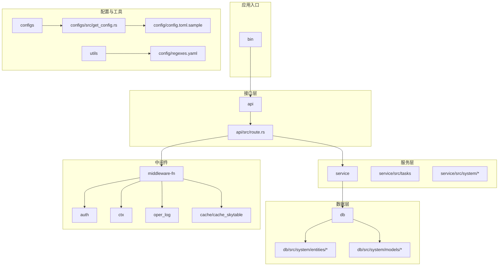
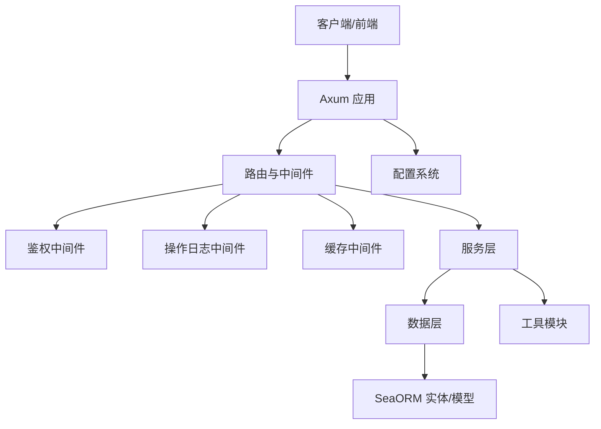
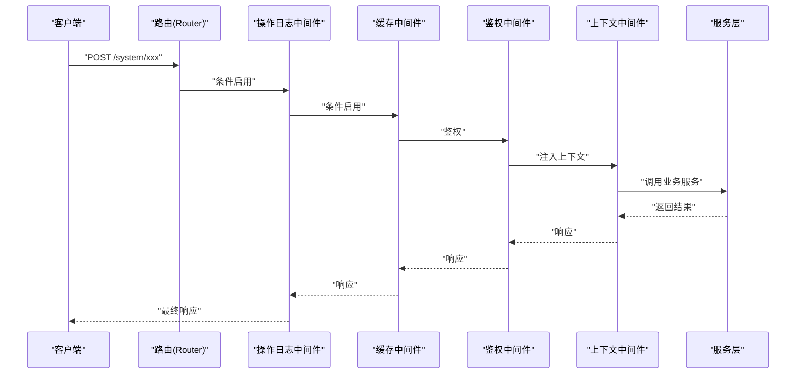
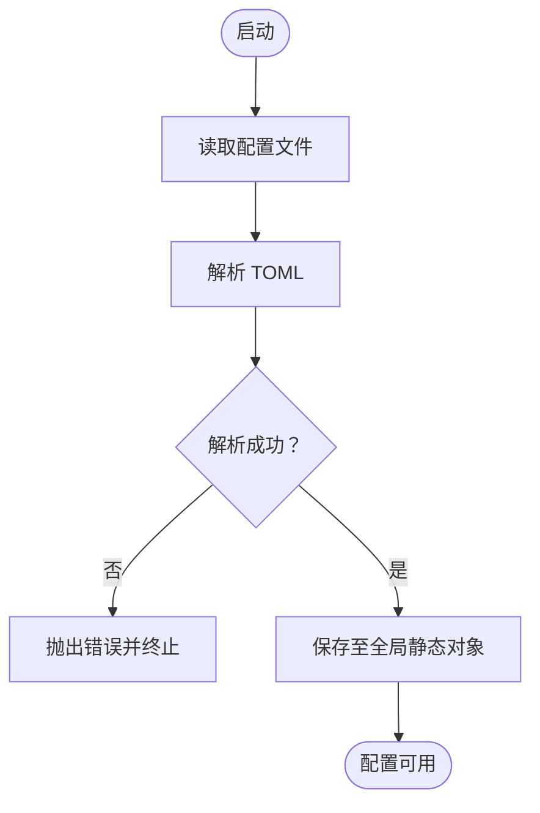
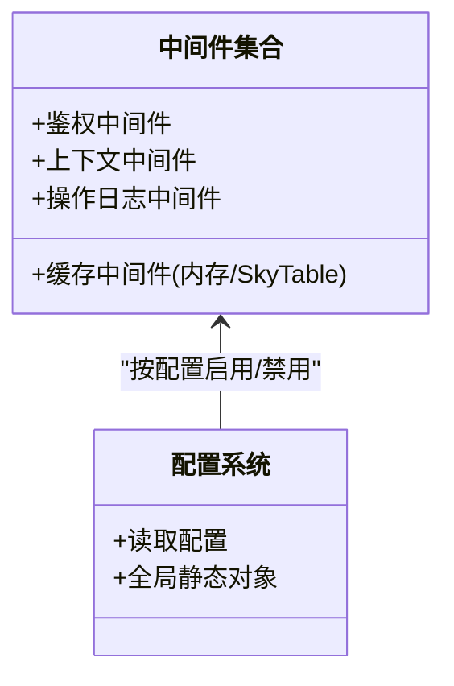
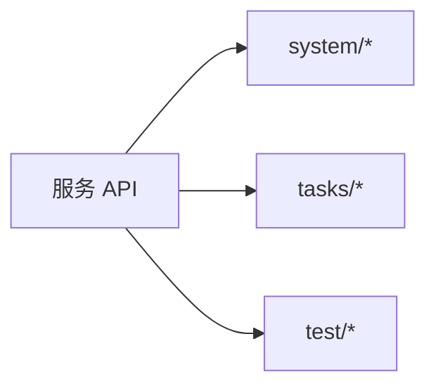
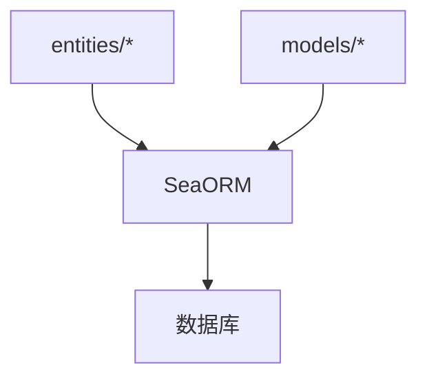
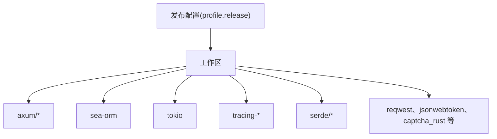

# 开发指南

<cite>
**本文引用的文件**
- [Cargo.toml](file://Cargo.toml)
- [README.md](file://README.md)
- [.github/workflows/rust.yml](file://.github/workflows/rust.yml)
- [.cargo/config.toml](file://.cargo/config.toml)
- [.rustfmt.toml](file://.rustfmt.toml)
- [api/src/lib.rs](file://api/src/lib.rs)
- [api/src/route.rs](file://api/src/route.rs)
- [service/src/lib.rs](file://service/src/lib.rs)
- [db/src/lib.rs](file://db/src/lib.rs)
- [middleware-fn/src/lib.rs](file://middleware-fn/src/lib.rs)
- [utils/src/lib.rs](file://utils/src/lib.rs)
- [configs/src/lib.rs](file://configs/src/lib.rs)
- [configs/src/get_config.rs](file://configs/src/get_config.rs)
- [config/config.toml.sample](file://config/config.toml.sample)
- [config/regexes.yaml](file://config/regexes.yaml)
</cite>

## 目录
1. [简介](#简介)
2. [项目结构](#项目结构)
3. [核心组件](#核心组件)
4. [架构总览](#架构总览)
5. [详细组件分析](#详细组件分析)
6. [依赖分析](#依赖分析)
7. [性能考虑](#性能考虑)
8. [调试与排错指南](#调试与排错指南)
9. [结论](#结论)
10. [附录](#附录)

## 简介
Axum Admin 是一个基于 Rust 的现代化后台管理系统，后端采用 Axum + SeaORM + tokio 异步运行时，前端为独立的 Vue3 项目。系统提供用户、部门、岗位、菜单、角色、字典、定时任务、在线用户、系统监控、数据缓存、操作日志、权限控制等能力，并支持动态路由与按钮级权限控制。

## 项目结构
项目采用工作区（workspace）组织，核心模块包括：
- bin：可执行入口
- api：HTTP 接口层，负责路由与中间件装配
- service：业务服务层，封装领域逻辑与任务
- db：数据访问层，基于 SeaORM 实体与模型
- middleware-fn：中间件集合（鉴权、上下文、操作日志、缓存）
- utils：通用工具模块
- configs：配置加载与全局配置对象
- migration：数据库迁移脚本
- config：运行时配置样例与正则规则

图表来源
- [api/src/route.rs](file://api/src/route.rs#L1-L69)
- [service/src/lib.rs](file://service/src/lib.rs#L1-L7)
- [db/src/lib.rs](file://db/src/lib.rs#L1-L8)
- [middleware-fn/src/lib.rs](file://middleware-fn/src/lib.rs#L1-L23)
- [configs/src/get_config.rs](file://configs/src/get_config.rs#L1-L26)
- [config/config.toml.sample](file://config/config.toml.sample#L1-L50)
- [config/regexes.yaml](file://config/regexes.yaml#L1-L800)

章节来源
- [Cargo.toml](file://Cargo.toml#L1-L12)
- [README.md](file://README.md#L1-L79)

## 核心组件
- 接口路由与中间件装配：在接口层集中定义路由前缀、通用接口与系统接口，并按配置启用操作日志、缓存与鉴权中间件。
- 业务服务：按功能域拆分（如 system、tasks），提供统一的服务入口与工具模块。
- 数据访问：通过 SeaORM 实体与模型抽象数据库访问，支持迁移与实体关系管理。
- 中间件：鉴权、请求上下文注入、操作日志、缓存（内存或 SkyTable）。
- 配置系统：通过 toml 文件加载全局配置，使用延迟初始化与全局静态访问。
- 工具模块：密码加密、随机数、证书、UA 解析正则等。

章节来源
- [api/src/lib.rs](file://api/src/lib.rs#L1-L10)
- [api/src/route.rs](file://api/src/route.rs#L1-L69)
- [service/src/lib.rs](file://service/src/lib.rs#L1-L7)
- [db/src/lib.rs](file://db/src/lib.rs#L1-L8)
- [middleware-fn/src/lib.rs](file://middleware-fn/src/lib.rs#L1-L23)
- [configs/src/lib.rs](file://configs/src/lib.rs#L1-L6)
- [configs/src/get_config.rs](file://configs/src/get_config.rs#L1-L26)
- [utils/src/lib.rs](file://utils/src/lib.rs#L1-L9)

## 架构总览
系统采用“接口层-服务层-数据层”的分层架构，配合中间件实现横切关注点（鉴权、日志、缓存）。配置通过 configs 模块集中加载，运行时按需启用中间件与特性。

图表来源
- [api/src/route.rs](file://api/src/route.rs#L1-L69)
- [middleware-fn/src/lib.rs](file://middleware-fn/src/lib.rs#L1-L23)
- [service/src/lib.rs](file://service/src/lib.rs#L1-L7)
- [db/src/lib.rs](file://db/src/lib.rs#L1-L8)
- [configs/src/get_config.rs](file://configs/src/get_config.rs#L1-L26)

## 详细组件分析

### 组件一：接口路由与中间件装配
- 路由前缀与通用接口：通用接口挂载在 /comm 前缀下，包含登录、验证码、登出等。
- 系统模块路由：系统接口挂载在 /system 前缀下，统一套用鉴权、上下文、日志与缓存中间件。
- 测试模块路由：测试接口独立前缀，按配置启用中间件链。
- 中间件选择：根据配置决定是否启用操作日志与缓存中间件，并支持内存或 SkyTable 两种缓存方案。

图表来源
- [api/src/route.rs](file://api/src/route.rs#L12-L68)
- [middleware-fn/src/lib.rs](file://middleware-fn/src/lib.rs#L1-L23)

章节来源
- [api/src/route.rs](file://api/src/route.rs#L1-L69)

### 组件二：配置系统
- 配置文件：默认从 config/config.toml 加载，包含服务器、缓存、Web、证书、Casbin、日志、系统、JWT、数据库等配置项。
- 加载策略：使用延迟初始化（Lazy）一次性读取并解析，后续通过全局静态对象访问，避免重复 IO 与解析。
- 配置项示例：服务器监听地址、SSL、gzip 压缩、缓存时间与方式、API 前缀、上传目录与 URL、日志目录与级别、JWT 过期时间与密钥、数据库连接字符串等。

图表来源
- [configs/src/get_config.rs](file://configs/src/get_config.rs#L13-L25)
- [config/config.toml.sample](file://config/config.toml.sample#L1-L50)

章节来源
- [configs/src/lib.rs](file://configs/src/lib.rs#L1-L6)
- [configs/src/get_config.rs](file://configs/src/get_config.rs#L1-L26)
- [config/config.toml.sample](file://config/config.toml.sample#L1-L50)

### 组件三：中间件体系
- 鉴权中间件：校验 JWT 并注入 Claims。
- 上下文中间件：注入请求上下文（如用户信息、租户等）。
- 操作日志中间件：按 API 级别配置记录级别（文件/数据库/同时/不记录）。
- 缓存中间件：支持内存缓存与 SkyTable 缓存，按配置选择实现。

图表来源
- [middleware-fn/src/lib.rs](file://middleware-fn/src/lib.rs#L1-L23)
- [configs/src/get_config.rs](file://configs/src/get_config.rs#L1-L26)

章节来源
- [middleware-fn/src/lib.rs](file://middleware-fn/src/lib.rs#L1-L23)

### 组件四：服务层与任务系统
- 服务模块：按功能域拆分（system、tasks、test），提供统一服务入口。
- 任务系统：支持定时任务的构建、注册与执行，便于扩展后台任务。

图表来源
- [service/src/lib.rs](file://service/src/lib.rs#L1-L7)

章节来源
- [service/src/lib.rs](file://service/src/lib.rs#L1-L7)

### 组件五：数据层与实体模型
- 实体与模型：按系统模块拆分，统一通过 SeaORM 访问数据库。
- 数据迁移：通过迁移脚本管理数据库演进。

图表来源
- [db/src/lib.rs](file://db/src/lib.rs#L1-L8)

章节来源
- [db/src/lib.rs](file://db/src/lib.rs#L1-L8)

### 组件六：工具模块与 UA 解析
- 工具模块：密码加密、随机数、证书、数据权限、环境变量等。
- UA 正则：提供大量浏览器与爬虫识别规则，用于日志与监控分析。

章节来源
- [utils/src/lib.rs](file://utils/src/lib.rs#L1-L9)
- [config/regexes.yaml](file://config/regexes.yaml#L1-L800)

## 依赖分析
- 工作区与版本：工作区统一管理依赖版本，后端核心依赖包括 Axum、SeaORM、Tokio、Tracing、Serde 等。
- 性能配置：发布配置启用 LTO、按大小优化、关闭调试符号，适合生产部署。
- CI：GitHub Actions 使用稳定工具链进行构建验证。

图表来源
- [Cargo.toml](file://Cargo.toml#L24-L90)
- [.github/workflows/rust.yml](file://.github/workflows/rust.yml#L1-L26)

章节来源
- [Cargo.toml](file://Cargo.toml#L1-L90)
- [.github/workflows/rust.yml](file://.github/workflows/rust.yml#L1-L26)

## 性能考虑
- 发布优化：启用 LTO、按大小优化、关闭调试符号，减少产物体积与提升运行时性能。
- 异步运行：基于 Tokio 与 SeaORM 异步运行时，提高并发处理能力。
- 缓存策略：支持内存与 SkyTable 两种缓存方式，按配置启用，降低数据库压力。
- 压缩与传输：可选 gzip 压缩响应，减少网络传输开销。
- 日志级别：按需调整日志级别，避免过量 I/O。

章节来源
- [Cargo.toml](file://Cargo.toml#L83-L90)
- [config/config.toml.sample](file://config/config.toml.sample#L9-L10)
- [middleware-fn/src/lib.rs](file://middleware-fn/src/lib.rs#L9-L20)

## 调试与排错指南
- 启动与配置
  - 确认配置文件存在且可读，否则会直接 panic。
  - 检查数据库连接字符串与迁移状态。
- 路由与中间件
  - 若鉴权失败，检查 JWT 密钥与过期时间。
  - 若缓存未生效，确认缓存方式与时间配置。
  - 若操作日志未记录，检查日志开关与级别。
- 数据库
  - 使用 SeaORM CLI 执行迁移、重置、降级等操作。
- 日志
  - 查看日志目录与文件名配置，确保路径可写。
- 常见问题
  - 配置文件缺失：启动即 panic，需提供完整配置。
  - 数据库不可达：检查连接串与网络权限。
  - 缓存不可用：检查缓存服务（内存或 SkyTable）连通性。

章节来源
- [configs/src/get_config.rs](file://configs/src/get_config.rs#L14-L23)
- [README.md](file://README.md#L63-L71)
- [config/config.toml.sample](file://config/config.toml.sample#L31-L37)

## 结论
Axum Admin 提供了清晰的分层架构与完善的中间件体系，结合配置驱动与 SeaORM 数据层，能够快速扩展业务功能。建议在开发中遵循统一的代码规范、测试策略与提交规范，持续优化性能与稳定性。

## 附录

### 代码规范与提交规范
- 代码风格
  - 使用 rustfmt，统一格式化风格与宽度。
  - 配置包含换行风格、注释格式化、导入分组与粒度等。
- 注释规范
  - 对外公开模块与函数建议添加文档注释，说明用途、参数与返回。
- 命名约定
  - 模块与文件采用小写下划线命名；实体与模型遵循领域语义。
- 提交规范
  - 建议采用清晰的提交信息，描述变更类型与影响范围。
  - 保持每次提交聚焦单一功能或修复，便于回溯与审查。

章节来源
- [.rustfmt.toml](file://.rustfmt.toml#L1-L12)

### 新功能开发流程
- 设计与评审：明确需求、接口设计与数据模型变更。
- 接口层：在 api 模块新增路由与控制器，必要时新增中间件。
- 服务层：在 service 模块实现业务逻辑，拆分到对应子模块。
- 数据层：在 db 模块新增实体与模型，编写迁移脚本。
- 配置与测试：完善配置项与单元/集成测试。
- 文档与回归：更新文档与回归测试，确保兼容性。

章节来源
- [api/src/lib.rs](file://api/src/lib.rs#L1-L10)
- [service/src/lib.rs](file://service/src/lib.rs#L1-L7)
- [db/src/lib.rs](file://db/src/lib.rs#L1-L8)
- [middleware-fn/src/lib.rs](file://middleware-fn/src/lib.rs#L1-L23)

### 测试策略
- 单元测试：针对服务与工具模块编写单元测试。
- 集成测试：覆盖接口与数据库交互，确保端到端流程正确。
- 配置测试：验证配置加载与中间件启用逻辑。
- 性能测试：在发布配置下进行基准测试，评估缓存与日志对性能的影响。

章节来源
- [api/src/lib.rs](file://api/src/lib.rs#L1-L10)
- [service/src/lib.rs](file://service/src/lib.rs#L1-L7)
- [db/src/lib.rs](file://db/src/lib.rs#L1-L8)
- [configs/src/get_config.rs](file://configs/src/get_config.rs#L1-L26)

### 性能优化建议
- 使用发布配置进行压测与部署。
- 合理设置缓存时间与策略，避免热点数据频繁刷新。
- 控制日志级别与落盘频率，避免 I/O 成为瓶颈。
- 优化数据库查询与索引，减少慢查询。

章节来源
- [Cargo.toml](file://Cargo.toml#L83-L90)
- [config/config.toml.sample](file://config/config.toml.sample#L11-L14)
- [config/config.toml.sample](file://config/config.toml.sample#L31-L37)

### 代码审查标准
- 功能正确性：覆盖边界条件与异常场景。
- 性能影响：评估新增逻辑对吞吐与延迟的影响。
- 安全性：鉴权、日志、敏感信息处理符合安全基线。
- 可维护性：命名清晰、模块职责单一、注释充分。
- 兼容性：数据库迁移与配置变更向后兼容。

章节来源
- [middleware-fn/src/lib.rs](file://middleware-fn/src/lib.rs#L1-L23)
- [db/src/lib.rs](file://db/src/lib.rs#L1-L8)

### 开发工具与 IDE 配置
- 工具链
  - Rust 稳定工具链与 Cargo。
  - SeaORM CLI 用于数据库迁移。
- IDE 建议
  - 启用 rust-analyzer 与 rustfmt 插件。
  - 配置自动格式化与错误提示。
- 调试环境
  - 使用 .env 或环境变量配置数据库连接。
  - 在本地启动 SkyTable（如启用 SkyTable 缓存）。

章节来源
- [README.md](file://README.md#L63-L71)
- [.cargo/config.toml](file://.cargo/config.toml#L1-L10)

### 扩展点与插件机制
- 中间件扩展：在 middleware-fn 中新增中间件并通过配置启用。
- 服务扩展：在 service 的对应模块中新增服务函数或任务。
- 配置扩展：在 config/config.toml.sample 中新增配置项并在 configs 中读取。
- 数据库扩展：通过迁移脚本与实体/模型扩展数据结构。

章节来源
- [middleware-fn/src/lib.rs](file://middleware-fn/src/lib.rs#L1-L23)
- [service/src/lib.rs](file://service/src/lib.rs#L1-L7)
- [configs/src/get_config.rs](file://configs/src/get_config.rs#L1-L26)
- [config/config.toml.sample](file://config/config.toml.sample#L1-L50)