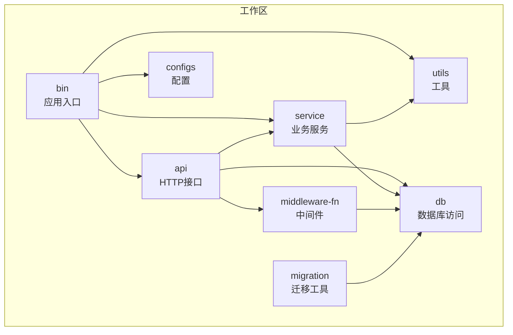
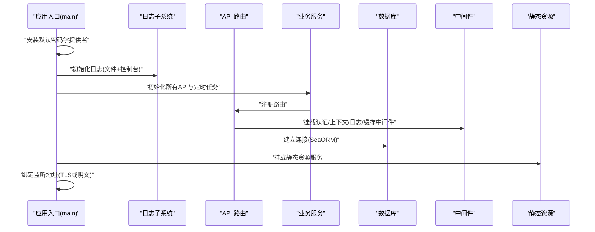
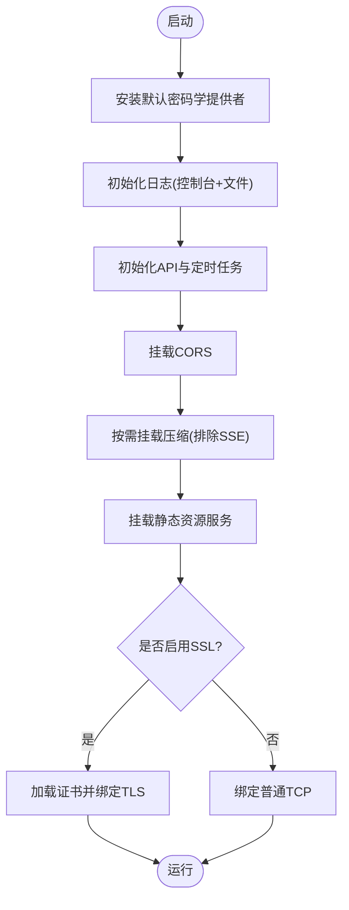
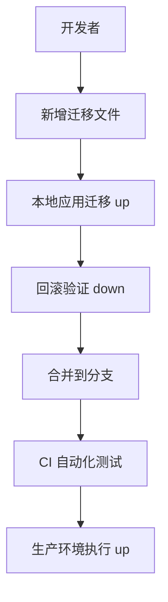
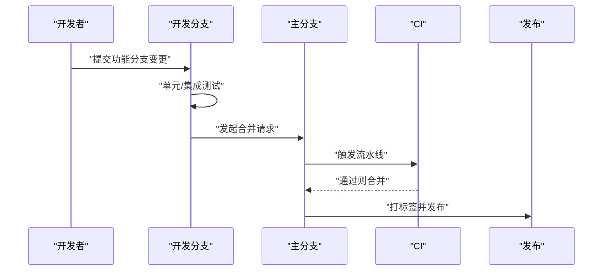

# 开发流程

<cite>
**本文引用的文件**
- [Cargo.toml](file://Cargo.toml)
- [README.md](file://README.md)
- [.github/workflows/rust.yml](file://.github/workflows/rust.yml)
- [migration/README.md](file://migration/README.md)
- [bin/Cargo.toml](file://bin/Cargo.toml)
- [api/Cargo.toml](file://api/Cargo.toml)
- [db/Cargo.toml](file://db/Cargo.toml)
- [service/Cargo.toml](file://service/Cargo.toml)
- [middleware-fn/Cargo.toml](file://middleware-fn/Cargo.toml)
- [bin/src/main.rs](file://bin/src/main.rs)
- [api/src/lib.rs](file://api/src/lib.rs)
- [db/src/lib.rs](file://db/src/lib.rs)
- [service/src/lib.rs](file://service/src/lib.rs)
- [middleware-fn/src/lib.rs](file://middleware-fn/src/lib.rs)
</cite>

## 目录
1. [简介](#简介)
2. [项目结构](#项目结构)
3. [核心组件](#核心组件)
4. [架构总览](#架构总览)
5. [详细组件分析](#详细组件分析)
6. [依赖与版本管理](#依赖与版本管理)
7. [数据库迁移与版本控制](#数据库迁移与版本控制)
8. [开发环境搭建与运行](#开发环境搭建与运行)
9. [分支管理与发布流程](#分支管理与发布流程)
10. [代码审查与测试要求](#代码审查与测试要求)
11. [性能与稳定性考量](#性能与稳定性考量)
12. [故障排查指南](#故障排查指南)
13. [结论](#结论)

## 简介
Axum Admin 是基于 Rust 生态（axum、sea-orm）与 Vue3 的后台管理面板项目。其后端采用工作区（workspace）组织，包含应用入口、API 层、业务服务层、数据库访问层、中间件与工具模块，并提供数据库迁移能力与持续集成流水线。本文面向新功能开发全流程，覆盖从需求分析到代码提交、数据库迁移、版本控制、分支管理、代码审查、测试与发布准备的完整指南。

## 项目结构
项目采用多包工作区布局，核心模块职责如下：
- bin：应用入口与服务器启动逻辑
- api：HTTP 接口与路由聚合
- service：业务服务与定时任务
- db：数据库访问与实体模型
- middleware-fn：认证、上下文、操作日志与缓存中间件
- migration：数据库迁移工具与脚手架
- configs、utils：配置与通用工具
- data：前端静态资源与 SQLite 示例数据库

图表来源
- [Cargo.toml](file://Cargo.toml#L1-L12)
- [bin/Cargo.toml](file://bin/Cargo.toml#L10-L25)
- [api/Cargo.toml](file://api/Cargo.toml#L8-L21)
- [service/Cargo.toml](file://service/Cargo.toml#L9-L32)
- [db/Cargo.toml](file://db/Cargo.toml#L9-L19)
- [middleware-fn/Cargo.toml](file://middleware-fn/Cargo.toml#L9-L24)
- [migration/Cargo.toml](file://migration/Cargo.toml#L11-L15)

章节来源
- [Cargo.toml](file://Cargo.toml#L1-L12)

## 核心组件
- 应用入口与服务器
  - 初始化日志、加载配置、注册 API、启动定时任务、配置跨域与压缩、绑定 TLS/非 TLS 监听地址
- API 层
  - 聚合系统与测试模块路由，对外暴露 REST 接口
- 业务服务层
  - 提供系统业务逻辑、定时任务与工具函数
- 数据库访问层
  - 封装 SeaORM 连接与实体模型，支持多数据库后端特性开关
- 中间件层
  - 认证、请求上下文、操作日志与可选缓存中间件（内存/Redis）

章节来源
- [bin/src/main.rs](file://bin/src/main.rs#L25-L96)
- [api/src/lib.rs](file://api/src/lib.rs#L1-L9)
- [service/src/lib.rs](file://service/src/lib.rs#L1-L7)
- [db/src/lib.rs](file://db/src/lib.rs#L1-L8)
- [middleware-fn/src/lib.rs](file://middleware-fn/src/lib.rs#L1-L23)

## 架构总览
下图展示启动时序与模块交互关系，包括日志初始化、API 注册、定时任务初始化、静态资源服务与 TLS 绑定。

图表来源
- [bin/src/main.rs](file://bin/src/main.rs#L25-L96)
- [api/src/lib.rs](file://api/src/lib.rs#L1-L9)
- [service/src/lib.rs](file://service/src/lib.rs#L1-L7)
- [middleware-fn/src/lib.rs](file://middleware-fn/src/lib.rs#L1-L23)
- [db/src/lib.rs](file://db/src/lib.rs#L1-L8)

## 详细组件分析

### 应用入口与服务器
- 关键职责
  - 日志初始化与滚动文件输出
  - 全局 API 注册与定时任务初始化
  - CORS、压缩、静态资源服务与 404 处理
  - TLS 证书加载与优雅关闭信号处理
- 启动流程要点
  - 依据配置决定监听地址、是否启用压缩与 SSL
  - 优雅关闭等待时间可配置，便于容器环境平滑退出

图表来源
- [bin/src/main.rs](file://bin/src/main.rs#L25-L96)

章节来源
- [bin/src/main.rs](file://bin/src/main.rs#L25-L96)

### API 路由与模块化
- 路由组织
  - 系统模块与测试模块分别定义，最终在 lib 中统一导出
  - 通过前缀路径挂载至主应用
- 设计原则
  - 按功能域拆分模块，避免路由集中导致维护困难
  - 统一导出简化调用方依赖

章节来源
- [api/src/lib.rs](file://api/src/lib.rs#L1-L9)

### 业务服务层
- 功能范围
  - 系统业务逻辑封装
  - 定时任务初始化与执行
- 与数据库交互
  - 通过 db 包提供的连接与实体进行读写

章节来源
- [service/src/lib.rs](file://service/src/lib.rs#L1-L7)

### 数据库访问层
- 特性开关
  - 默认启用 postgres/mysql/sqlite 三类后端
  - 可通过特性选择单一或组合后端
- 连接与实体
  - 通过 SeaORM 提供 ORM 能力，支持调试打印与时间类型

章节来源
- [db/Cargo.toml](file://db/Cargo.toml#L21-L25)
- [db/src/lib.rs](file://db/src/lib.rs#L1-L8)

### 中间件层
- 功能清单
  - 认证中间件、请求上下文中间件、操作日志中间件
  - 可选缓存中间件（内存/Redis）
- 特性开关
  - 默认启用多后端与缓存特性，可按需裁剪

章节来源
- [middleware-fn/src/lib.rs](file://middleware-fn/src/lib.rs#L1-L23)
- [middleware-fn/Cargo.toml](file://middleware-fn/Cargo.toml#L27-L39)

## 依赖与版本管理
- 工作区统一依赖
  - 所有成员包共享工作区依赖版本，确保一致性
- 关键依赖
  - web：axum、tower、tower-http、hyper、rustls
  - 并发与运行时：tokio、futures、async-std
  - 序列化与时间：serde、serde_json、chrono、time
  - ORM：sea-orm（含运行时与调试特性）
  - 日志：tracing、tracing-appender、tracing-subscriber
- 版本策略建议
  - 采用语义化版本，优先小版本升级，重大版本升级需充分测试
  - 对于第三方库，保持与工作区版本同步，避免混用不同版本
- 依赖冲突处理
  - 使用 cargo tree 分析依赖图，定位重复或冲突版本
  - 通过 workspace overrides 或显式版本指定解决冲突
- 升级策略
  - 先在 dev 分支进行升级验证，再合并至主干
  - 对 ORM、web 框架等核心库升级，先在迁移分支验证数据库兼容性

章节来源
- [Cargo.toml](file://Cargo.toml#L24-L82)
- [bin/Cargo.toml](file://bin/Cargo.toml#L10-L25)
- [api/Cargo.toml](file://api/Cargo.toml#L8-L21)
- [service/Cargo.toml](file://service/Cargo.toml#L9-L32)
- [db/Cargo.toml](file://db/Cargo.toml#L9-L19)
- [middleware-fn/Cargo.toml](file://middleware-fn/Cargo.toml#L9-L24)

## 数据库迁移与版本控制
- 迁移工具
  - 使用 sea-orm-cli 管理迁移，提供 up/down/fresh/refresh/reset/status 等命令
- 迁移目录结构
  - migration/data 下包含各版本 SQL 文件，迁移模块负责编排执行
- 版本控制策略
  - 迁移文件命名遵循时间戳前缀，保证顺序与幂等
  - 迁移脚本应具备回滚能力，避免破坏生产数据
- 开发与生产
  - 开发阶段使用 fresh/reset 快速重建环境
  - 生产环境谨慎使用 fresh，优先使用 up/down 控制增量演进
- 常见操作
  - 应用全部迁移：cargo run
  - 应用部分迁移：cargo run -- up -n N
  - 回滚最后一批迁移：cargo run -- down [-n N]
  - 重置并重新应用：cargo run -- fresh
  - 查看状态：cargo run -- status

图表来源
- [migration/README.md](file://migration/README.md#L1-L38)
- [README.md](file://README.md#L63-L71)

章节来源
- [migration/README.md](file://migration/README.md#L1-L38)
- [README.md](file://README.md#L63-L71)

## 开发环境搭建与运行
- 环境准备
  - Rust 工具链（稳定版）、cargo、sea-orm-cli
  - 数据库（PostgreSQL/MySQL/SQLite）与连接配置
- 启动步骤
  - 设置日志级别与输出格式
  - 初始化日志、加载配置、注册 API、启动定时任务
  - 挂载 CORS、压缩与静态资源服务
  - 绑定监听地址（支持 TLS）
- 构建与打包
  - 使用工作区构建，release 配置优化体积与性能
- 常见问题
  - 证书路径错误：检查配置中的证书与私钥路径
  - 静态资源 404：确认 web.dir 与 api_prefix 配置

章节来源
- [bin/src/main.rs](file://bin/src/main.rs#L25-L96)
- [Cargo.toml](file://Cargo.toml#L83-L90)

## 分支管理与发布流程
- 分支策略
  - 主分支：仅接受来自开发分支的合并，保持稳定
  - 开发分支：日常开发与功能集成
  - 功能分支：按功能点切分，完成后合并至开发分支
- 发布准备
  - 更新版本号（语义化版本）
  - 生成发布说明，列出变更与注意事项
  - 进行端到端回归测试
- CI/CD
  - GitHub Actions 在指定分支触发构建与测试
  - 构建产物可用于发布或部署

图表来源
- [.github/workflows/rust.yml](file://.github/workflows/rust.yml#L1-L26)

章节来源
- [.github/workflows/rust.yml](file://.github/workflows/rust.yml#L1-L26)

## 代码审查与测试要求
- 代码审查
  - 至少一名维护者审查，关注设计一致性、边界条件与安全性
  - 审查重点：API 设计、中间件使用、数据库访问、日志与错误处理
- 测试要求
  - 单元测试：针对服务与工具模块
  - 集成测试：API 路由与数据库交互
  - 端到端测试：结合前端进行关键流程验证
- 文档与注释
  - 新增功能需补充文档与必要的注释，便于后续维护

## 性能与稳定性考量
- 运行时优化
  - release 配置启用 LTO、单代码生成单元与按大小优化
- 网络与压缩
  - 启用压缩减少带宽占用，但排除 SSE 类型避免数据流问题
- 日志与可观测性
  - 控制台与文件双通道输出，支持 JSON 与本地时间格式
- 优雅关闭
  - 支持 Ctrl+C 与 Unix 终止信号，设置合理的优雅关闭超时

章节来源
- [Cargo.toml](file://Cargo.toml#L83-L90)
- [bin/src/main.rs](file://bin/src/main.rs#L15-L83)

## 故障排查指南
- 启动失败
  - 检查日志级别与输出配置，确认证书路径与权限
  - 核对监听地址与端口占用
- 数据库连接
  - 确认数据库服务可用、凭据正确与迁移已应用
- 静态资源
  - 确认 web.dir 指向正确的静态资源目录
- 压缩与 SSE
  - 若 SSE 不可用，检查压缩谓词排除规则

章节来源
- [bin/src/main.rs](file://bin/src/main.rs#L25-L96)
- [README.md](file://README.md#L63-L71)

## 结论
本文提供了从需求分析到代码提交、从数据库迁移到版本控制、从代码审查到发布的完整开发流程指南。建议在开发过程中严格遵循模块化设计、特性开关与测试驱动，确保系统可维护性与稳定性。对于数据库演进，务必重视迁移脚本的幂等与回滚能力；对于依赖升级，采用渐进式策略并在独立分支验证后再合并。