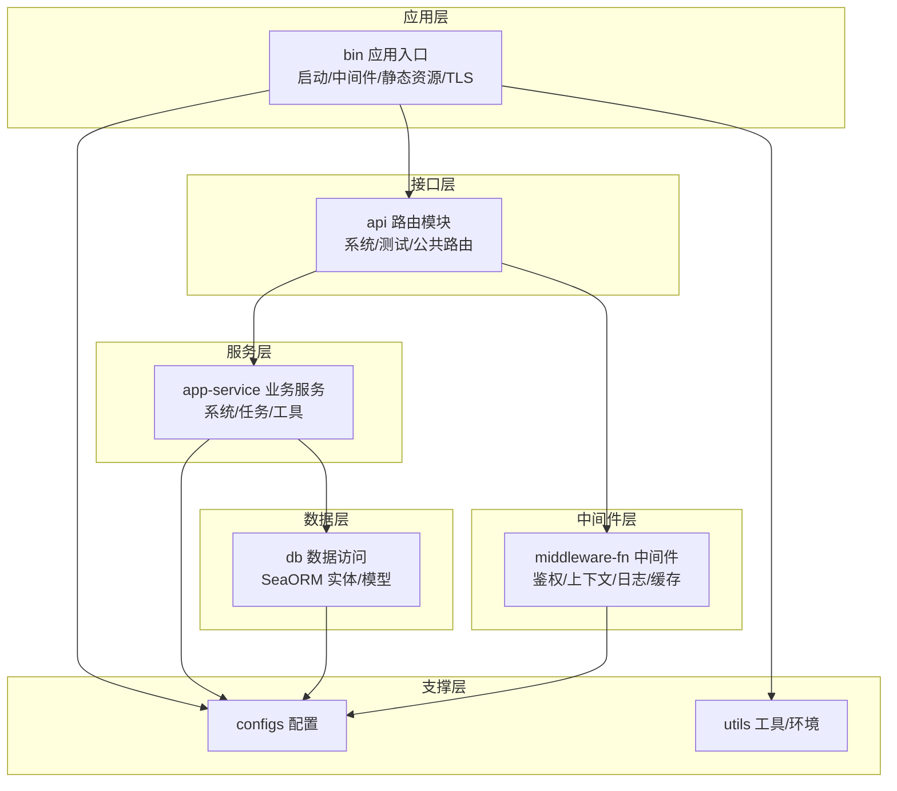
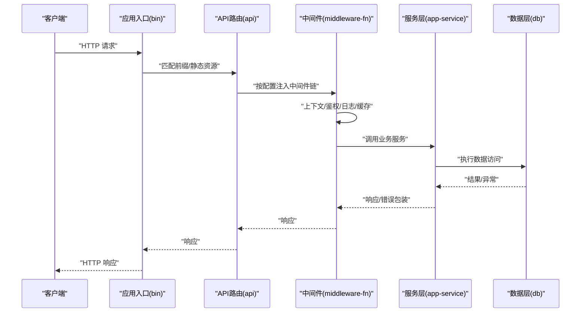
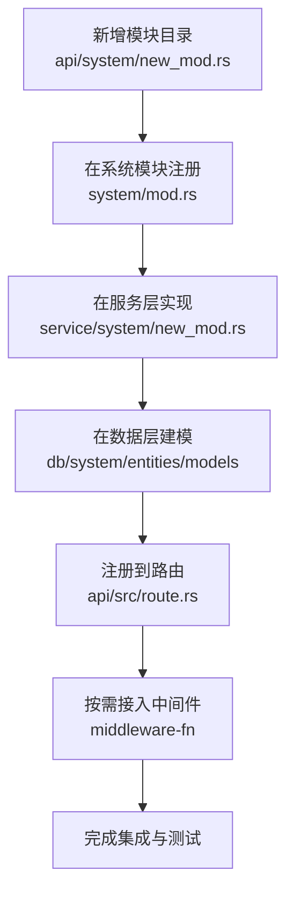
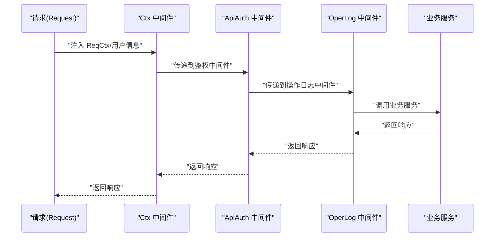
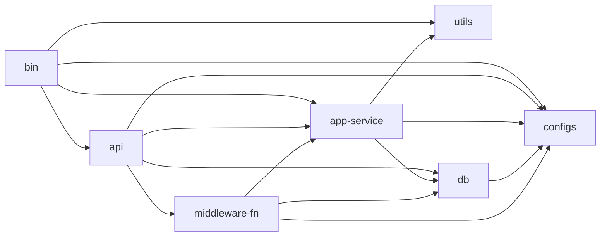

# 扩展开发

<cite>
**本文引用的文件**
- [Cargo.toml](file://Cargo.toml)
- [bin/Cargo.toml](file://bin/Cargo.toml)
- [api/Cargo.toml](file://api/Cargo.toml)
- [service/Cargo.toml](file://service/Cargo.toml)
- [db/Cargo.toml](file://db/Cargo.toml)
- [middleware-fn/Cargo.toml](file://middleware-fn/Cargo.toml)
- [configs/Cargo.toml](file://configs/Cargo.toml)
- [utils/Cargo.toml](file://utils/Cargo.toml)
- [bin/src/main.rs](file://bin/src/main.rs)
- [api/src/lib.rs](file://api/src/lib.rs)
- [api/src/route.rs](file://api/src/route.rs)
- [service/src/lib.rs](file://service/src/lib.rs)
- [db/src/lib.rs](file://db/src/lib.rs)
- [middleware-fn/src/lib.rs](file://middleware-fn/src/lib.rs)
- [middleware-fn/src/auth.rs](file://middleware-fn/src/auth.rs)
- [middleware-fn/src/ctx.rs](file://middleware-fn/src/ctx.rs)
- [middleware-fn/src/oper_log.rs](file://middleware-fn/src/oper_log.rs)
- [api/src/system/mod.rs](file://api/src/system/mod.rs)
- [service/src/system/mod.rs](file://service/src/system/mod.rs)
- [db/src/system/mod.rs](file://db/src/system/mod.rs)
</cite>

## 目录
1. [简介](#简介)
2. [项目结构](#项目结构)
3. [核心组件](#核心组件)
4. [架构总览](#架构总览)
5. [详细组件分析](#详细组件分析)
6. [依赖关系分析](#依赖关系分析)
7. [性能考量](#性能考量)
8. [故障排查指南](#故障排查指南)
9. [结论](#结论)
10. [附录](#附录)

## 简介
本指南面向希望在 Axum Admin 上进行扩展开发的工程师，覆盖以下主题：
- 如何扩展现有功能与添加新模块
- 插件机制、中间件扩展与模块化开发方法
- 新 API 接口的开发流程、服务层扩展与数据访问层适配
- 配置扩展、权限扩展与界面扩展的实现要点
- 自定义中间件、扩展认证机制与集成第三方服务
- 扩展点识别、接口设计与向后兼容性建议

Axum Admin 采用多 crate 工作区组织，核心由“入口应用”、“API 层”、“服务层”、“数据访问层”、“中间件”、“配置”、“工具库”组成，通过统一的路由注册与中间件链路实现可插拔的扩展能力。

## 项目结构
工作区采用按职责分层的模块化组织：
- bin：应用入口，负责启动、中间件装配、静态资源服务与 TLS 绑定
- api：对外 API 路由与模块化子路由注册
- service：业务服务层，封装领域逻辑与跨模块协调
- db：数据访问层，基于 SeaORM 的实体与模型
- middleware-fn：中间件集合（鉴权、上下文、操作日志、缓存等）
- configs：配置加载与运行时配置
- utils：通用工具与环境初始化
- migration：数据库迁移脚本

图表来源
- [bin/src/main.rs](file://bin/src/main.rs#L53-L95)
- [api/src/route.rs](file://api/src/route.rs#L12-L22)
- [service/src/lib.rs](file://service/src/lib.rs#L1-L7)
- [db/src/lib.rs](file://db/src/lib.rs#L1-L8)
- [middleware-fn/src/lib.rs](file://middleware-fn/src/lib.rs#L1-L23)
- [configs/Cargo.toml](file://configs/Cargo.toml#L1-L14)
- [utils/Cargo.toml](file://utils/Cargo.toml#L1-L22)

章节来源
- [Cargo.toml](file://Cargo.toml#L1-L12)
- [bin/Cargo.toml](file://bin/Cargo.toml#L10-L25)
- [api/Cargo.toml](file://api/Cargo.toml#L8-L21)
- [service/Cargo.toml](file://service/Cargo.toml#L9-L32)
- [db/Cargo.toml](file://db/Cargo.toml#L9-L19)
- [middleware-fn/Cargo.toml](file://middleware-fn/Cargo.toml#L9-L24)
- [configs/Cargo.toml](file://configs/Cargo.toml#L9-L14)
- [utils/Cargo.toml](file://utils/Cargo.toml#L9-L21)

## 核心组件
- 应用入口与中间件装配
  - 入口负责日志、定时任务初始化、CORS、压缩、TLS、静态资源服务与路由挂载
  - 中间件链路包括：操作日志、缓存、鉴权、上下文提取
- API 路由与模块化
  - 通过 nest_service 与 nest 将通用、系统、测试模块路由组合
  - 依据配置动态启用或禁用中间件
- 服务层
  - 提供系统模块业务逻辑与任务调度
  - 通过工具模块复用 JWT、Web 工具与 API 注册工具
- 数据访问层
  - SeaORM 实体与模型，支持多数据库特性开关
- 中间件层
  - 鉴权中间件：基于 API 路由表与用户 ID 进行权限校验
  - 上下文中间件：注入请求上下文 ReqCtx 与用户信息
  - 操作日志中间件：异步落库/落文件，支持多种策略
  - 缓存中间件：内存或 SkyTable 可选

章节来源
- [bin/src/main.rs](file://bin/src/main.rs#L53-L95)
- [api/src/route.rs](file://api/src/route.rs#L12-L68)
- [service/src/lib.rs](file://service/src/lib.rs#L1-L7)
- [db/src/lib.rs](file://db/src/lib.rs#L1-L8)
- [middleware-fn/src/lib.rs](file://middleware-fn/src/lib.rs#L1-L23)
- [middleware-fn/src/auth.rs](file://middleware-fn/src/auth.rs#L6-L24)
- [middleware-fn/src/ctx.rs](file://middleware-fn/src/ctx.rs#L13-L51)
- [middleware-fn/src/oper_log.rs](file://middleware-fn/src/oper_log.rs#L21-L103)

## 架构总览
Axum Admin 的请求处理链路如下：

图表来源
- [bin/src/main.rs](file://bin/src/main.rs#L73-L95)
- [api/src/route.rs](file://api/src/route.rs#L12-L68)
- [middleware-fn/src/lib.rs](file://middleware-fn/src/lib.rs#L15-L23)
- [service/src/lib.rs](file://service/src/lib.rs#L1-L7)
- [db/src/lib.rs](file://db/src/lib.rs#L1-L8)

## 详细组件分析

### 扩展点与模块化开发方法
- 扩展点识别
  - API 层：通过模块目录与系统模块注册点扩展新模块
  - 服务层：通过模块目录与 re-export 扩展业务逻辑
  - 数据层：通过实体/模型目录扩展 ORM 映射
  - 中间件层：通过功能开关与 re-export 扩展中间件
- 模块化开发
  - 新模块遵循“api + service + db”三层一致命名与目录结构
  - 在系统模块注册处添加路由与 re-export
  - 在服务层与数据层分别提供对应模块的实现与实体映射

章节来源
- [api/src/system/mod.rs](file://api/src/system/mod.rs#L26-L44)
- [service/src/system/mod.rs](file://service/src/system/mod.rs#L1-L43)
- [db/src/system/mod.rs](file://db/src/system/mod.rs#L1-L13)
- [api/src/lib.rs](file://api/src/lib.rs#L1-L9)
- [service/src/lib.rs](file://service/src/lib.rs#L1-L7)
- [db/src/lib.rs](file://db/src/lib.rs#L1-L8)

### 新 API 接口开发流程
- 步骤
  - 在 api 模块新增子模块文件，定义路由与处理器
  - 在系统模块注册处将新模块路由加入 system_api 并 re-export
  - 在 service 层新增对应模块，实现业务逻辑
  - 在 db 层新增实体/模型，确保迁移脚本与字段一致
  - 在中间件层根据需要添加或调整中间件
- 关键路径
  - 路由注册：[api/src/system/mod.rs](file://api/src/system/mod.rs#L26-L44)
  - API 装配：[api/src/route.rs](file://api/src/route.rs#L12-L22)
  - 服务层入口：[service/src/system/mod.rs](file://service/src/system/mod.rs#L1-L43)
  - 数据层入口：[db/src/system/mod.rs](file://db/src/system/mod.rs#L1-L13)

图表来源
- [api/src/system/mod.rs](file://api/src/system/mod.rs#L26-L44)
- [api/src/route.rs](file://api/src/route.rs#L12-L22)
- [service/src/system/mod.rs](file://service/src/system/mod.rs#L1-L43)
- [db/src/system/mod.rs](file://db/src/system/mod.rs#L1-L13)

章节来源
- [api/src/system/mod.rs](file://api/src/system/mod.rs#L26-L44)
- [api/src/route.rs](file://api/src/route.rs#L12-L22)
- [service/src/system/mod.rs](file://service/src/system/mod.rs#L1-L43)
- [db/src/system/mod.rs](file://db/src/system/mod.rs#L1-L13)

### 服务层扩展
- 服务层职责
  - 聚合领域逻辑、调用数据访问层、处理跨模块协作
  - 通过工具模块复用 JWT、Web 工具与 API 注册工具
- 扩展建议
  - 新增模块目录与 re-export，保持与现有模块一致的接口风格
  - 对外暴露清晰的函数签名与错误处理策略
  - 在定时任务模块中注册新的任务实现

章节来源
- [service/src/lib.rs](file://service/src/lib.rs#L1-L7)
- [service/Cargo.toml](file://service/Cargo.toml#L34-L39)

### 数据访问层适配
- 数据层职责
  - 基于 SeaORM 的实体与模型，提供 CRUD 与复杂查询
  - 支持多数据库特性开关（PostgreSQL/MySQL/SQLite）
- 扩展建议
  - 在 entities 与 models 下新增对应实体与模型
  - 在迁移脚本中补充表结构与索引
  - 在 db 层 re-export 新实体，供服务层使用

章节来源
- [db/src/lib.rs](file://db/src/lib.rs#L1-L8)
- [db/Cargo.toml](file://db/Cargo.toml#L21-L25)

### 中间件扩展与认证机制
- 中间件装配
  - 通过配置决定是否启用操作日志、缓存与鉴权中间件
  - 鉴权中间件基于 API 路由表与用户 ID 校验权限
  - 上下文中间件注入 ReqCtx 与用户信息，支持请求体读取
  - 操作日志中间件异步落库/落文件，支持策略配置
- 自定义中间件
  - 参考现有中间件模式，实现 async fn(Request, Next) -> Result
  - 通过 middleware-fn/src/lib.rs 的 re-export 暴露给路由层

图表来源
- [api/src/route.rs](file://api/src/route.rs#L33-L54)
- [middleware-fn/src/ctx.rs](file://middleware-fn/src/ctx.rs#L13-L51)
- [middleware-fn/src/auth.rs](file://middleware-fn/src/auth.rs#L6-L24)
- [middleware-fn/src/oper_log.rs](file://middleware-fn/src/oper_log.rs#L21-L42)

章节来源
- [api/src/route.rs](file://api/src/route.rs#L33-L54)
- [middleware-fn/src/lib.rs](file://middleware-fn/src/lib.rs#L15-L23)
- [middleware-fn/src/auth.rs](file://middleware-fn/src/auth.rs#L6-L24)
- [middleware-fn/src/ctx.rs](file://middleware-fn/src/ctx.rs#L13-L51)
- [middleware-fn/src/oper_log.rs](file://middleware-fn/src/oper_log.rs#L21-L103)

### 权限扩展与 API 注册
- 权限校验
  - 鉴权中间件会检查 API 是否在路由表中，并校验用户对该 API 的权限
  - 超级用户白名单可绕过权限校验
- API 注册
  - 通过 ApiUtils 初始化与校验 API 路由表，新 API 需要正确注册以生效

章节来源
- [middleware-fn/src/auth.rs](file://middleware-fn/src/auth.rs#L6-L24)

### 配置扩展
- 配置加载
  - 应用启动时加载运行时配置，影响 CORS、压缩、TLS、日志、缓存策略等
- 配置项示例
  - 服务器地址、SSL 开关、内容压缩、日志级别与文件名、API 前缀、上传目录等
  - 缓存策略（内存/SkyTable）、缓存时间与方法
  - 操作日志开关与策略
- 扩展建议
  - 新功能通过配置项开关控制，避免硬编码
  - 为新模块预留配置项并在入口处读取

章节来源
- [bin/src/main.rs](file://bin/src/main.rs#L53-L95)
- [middleware-fn/src/lib.rs](file://middleware-fn/src/lib.rs#L15-L23)

### 界面扩展
- 静态资源与前端构建产物
  - 应用将指定目录作为静态资源根目录，支持 index.html 与前端打包产物
  - 未命中 API 的请求回退到静态资源服务
- 扩展建议
  - 在前端侧新增页面与路由，确保与后端 API 前缀一致
  - 通过上传 URL 暴露文件上传接口，配合后端路由

章节来源
- [api/src/route.rs](file://api/src/route.rs#L14-L15)
- [bin/src/main.rs](file://bin/src/main.rs#L64-L68)

### 第三方服务集成
- 可集成方向
  - 缓存中间件：SkyTable 或内存缓存
  - 日志：文件与数据库双写策略
  - 定时任务：基于 delay_timer 的任务调度
  - 外部 HTTP 客户端：reqwest
- 扩展建议
  - 在 middleware-fn 中新增中间件，按需启用
  - 在 service 层封装外部服务调用，统一错误处理

章节来源
- [middleware-fn/Cargo.toml](file://middleware-fn/Cargo.toml#L25-L39)
- [service/Cargo.toml](file://service/Cargo.toml#L27-L31)

## 依赖关系分析
- 工作区依赖
  - 所有 crate 共享工作区版本与特性，保证依赖一致性
- 模块依赖
  - bin 依赖 api、configs、utils、app-service
  - api 依赖 configs、db、app-service、middleware-fn
  - app-service 依赖 configs、db、utils
  - db 依赖 configs
  - middleware-fn 依赖 app-service、configs、db
  - utils 依赖 configs、db

图表来源
- [Cargo.toml](file://Cargo.toml#L1-L12)
- [bin/Cargo.toml](file://bin/Cargo.toml#L10-L25)
- [api/Cargo.toml](file://api/Cargo.toml#L10-L21)
- [service/Cargo.toml](file://service/Cargo.toml#L9-L32)
- [db/Cargo.toml](file://db/Cargo.toml#L9-L19)
- [middleware-fn/Cargo.toml](file://middleware-fn/Cargo.toml#L9-L24)

章节来源
- [Cargo.toml](file://Cargo.toml#L1-L12)
- [bin/Cargo.toml](file://bin/Cargo.toml#L10-L25)
- [api/Cargo.toml](file://api/Cargo.toml#L10-L21)
- [service/Cargo.toml](file://service/Cargo.toml#L9-L32)
- [db/Cargo.toml](file://db/Cargo.toml#L9-L19)
- [middleware-fn/Cargo.toml](file://middleware-fn/Cargo.toml#L9-L24)

## 性能考量
- 中间件顺序
  - 中间件顺序影响数据读取与性能，务必保证上下文注入在鉴权之前
- 压缩策略
  - 可按配置开启压缩，注意 SSE 流式数据需排除压缩
- 异步日志
  - 操作日志采用异步写入，避免阻塞主请求链路
- 缓存策略
  - 可选择内存或 SkyTable 缓存，结合业务场景选择合适策略

章节来源
- [bin/src/main.rs](file://bin/src/main.rs#L75-L83)
- [middleware-fn/src/oper_log.rs](file://middleware-fn/src/oper_log.rs#L44-L53)

## 故障排查指南
- 常见问题
  - 路由未生效：确认已在系统模块注册并 re-export
  - 鉴权失败：检查 ApiUtils 路由表与用户权限
  - 日志未记录：确认配置中的操作日志开关与策略
  - 缓存不生效：检查缓存特性开关与缓存时间配置
- 排查步骤
  - 查看日志级别与输出位置
  - 检查中间件链路与顺序
  - 验证数据库连接与迁移脚本

章节来源
- [middleware-fn/src/auth.rs](file://middleware-fn/src/auth.rs#L6-L24)
- [middleware-fn/src/oper_log.rs](file://middleware-fn/src/oper_log.rs#L57-L103)
- [middleware-fn/Cargo.toml](file://middleware-fn/Cargo.toml#L27-L39)

## 结论
Axum Admin 提供了清晰的三层扩展边界与可插拔的中间件机制。通过在 API、服务与数据层同步扩展，并结合配置与中间件的灵活装配，可以快速实现新模块与业务需求。建议在扩展过程中严格遵循模块化规范、保持接口一致性与向后兼容性，并通过配置项实现功能开关与策略控制。

## 附录
- 最佳实践清单
  - 新模块：api + service + db 三同步
  - 中间件：按需启用，顺序合理
  - 配置：集中管理，避免硬编码
  - 日志：异步落库/落文件，分级输出
  - 缓存：按场景选择内存或 SkyTable
  - 兼容性：保持接口稳定，逐步演进