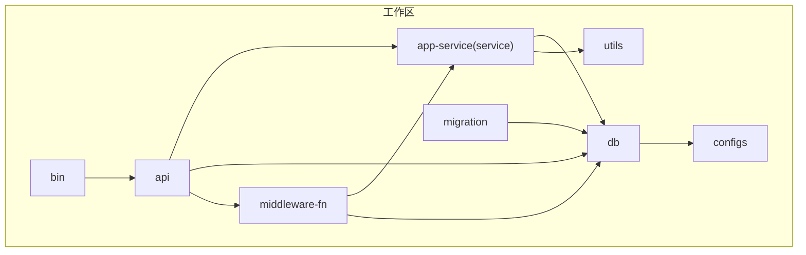
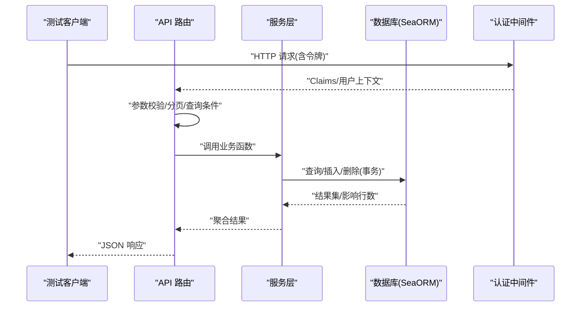
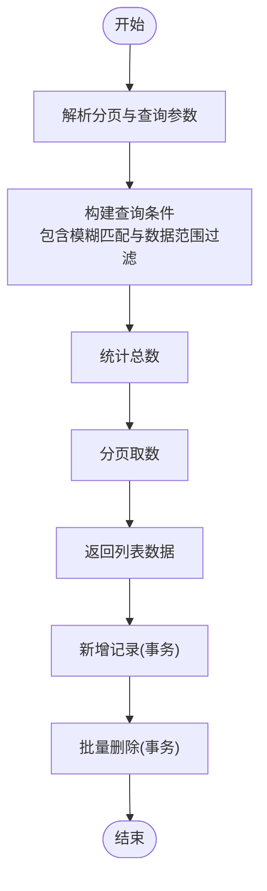
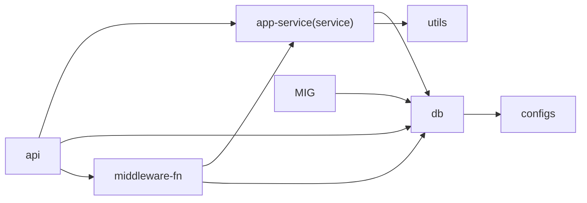

# 测试策略

<cite>
**本文引用的文件**
- [Cargo.toml](file://Cargo.toml)
- [api/Cargo.toml](file://api/Cargo.toml)
- [db/Cargo.toml](file://db/Cargo.toml)
- [service/Cargo.toml](file://service/Cargo.toml)
- [middleware-fn/Cargo.toml](file://middleware-fn/Cargo.toml)
- [utils/Cargo.toml](file://utils/Cargo.toml)
- [migration/Cargo.toml](file://migration/Cargo.toml)
- [.github/workflows/rust.yml](file://.github/workflows/rust.yml)
- [api/src/test/mod.rs](file://api/src/test/mod.rs)
- [api/src/test/test_data_scope.rs](file://api/src/test/test_data_scope.rs)
- [service/src/test/test_data_scope.rs](file://service/src/test/test_data_scope.rs)
- [db/src/test/mod.rs](file://db/src/test/mod.rs)
- [db/src/test/entities/mod.rs](file://db/src/test/entities/mod.rs)
- [db/src/test/models/mod.rs](file://db/src/test/models/mod.rs)
- [service/src/test/mod.rs](file://service/src/test/mod.rs)
</cite>

## 目录
1. [引言](#引言)
2. [项目结构](#项目结构)
3. [核心组件](#核心组件)
4. [架构总览](#架构总览)
5. [详细组件分析](#详细组件分析)
6. [依赖关系分析](#依赖关系分析)
7. [性能考虑](#性能考虑)
8. [故障排查指南](#故障排查指南)
9. [结论](#结论)
10. [附录](#附录)

## 引言
本测试策略文档面向 Axum Admin 项目，系统化阐述单元测试、集成测试与端到端测试的实施方法，覆盖数据库测试、API 测试与业务逻辑测试，并给出测试工具配置、模拟对象使用、测试环境搭建、异步与并发测试处理、性能与安全测试以及回归测试策略。目标是帮助团队建立可维护、高覆盖率且可持续演进的测试体系。

## 项目结构
Axum Admin 采用多 crate 工作区组织，核心模块包括：
- 应用入口与路由：bin、api
- 业务服务层：service（别名 app-service）
- 数据访问层：db（基于 SeaORM）
- 中间件与通用能力：middleware-fn、utils
- 配置与迁移：configs、migration
- GitHub Actions CI：rust.yml

图表来源
- [Cargo.toml](file://Cargo.toml#L1-L12)
- [api/Cargo.toml](file://api/Cargo.toml#L10-L13)
- [service/Cargo.toml](file://service/Cargo.toml#L11-L13)
- [db/Cargo.toml](file://db/Cargo.toml#L11-L12)
- [middleware-fn/Cargo.toml](file://middleware-fn/Cargo.toml#L11-L13)
- [utils/Cargo.toml](file://utils/Cargo.toml#L11-L12)
- [migration/Cargo.toml](file://migration/Cargo.toml#L12-L12)

章节来源
- [Cargo.toml](file://Cargo.toml#L1-L12)

## 核心组件
- API 层：提供 REST 路由与请求处理，测试用例通过嵌入式 Router 或 HTTP 客户端进行调用。
- 服务层：封装业务逻辑，负责事务、查询构建与领域规则，是单元测试与集成测试的重点。
- 数据层：基于 SeaORM 的实体与模型，支持多数据库后端（PostgreSQL、MySQL、SQLite），用于数据库测试与迁移验证。
- 中间件：认证、操作日志、缓存等横切关注点，需在集成测试中验证其行为。
- 工具与配置：提供 JWT、随机数、数据范围计算等能力，支撑业务与安全测试。

章节来源
- [api/Cargo.toml](file://api/Cargo.toml#L10-L13)
- [service/Cargo.toml](file://service/Cargo.toml#L11-L13)
- [db/Cargo.toml](file://db/Cargo.toml#L11-L12)
- [middleware-fn/Cargo.toml](file://middleware-fn/Cargo.toml#L11-L13)
- [utils/Cargo.toml](file://utils/Cargo.toml#L11-L12)
- [migration/Cargo.toml](file://migration/Cargo.toml#L12-L12)

## 架构总览
下图展示测试视角下的关键交互：API 层接收请求，解析参数与鉴权，调用服务层执行业务逻辑，服务层通过 SeaORM 访问数据库或外部资源，最终返回响应。

图表来源
- [api/src/test/test_data_scope.rs](file://api/src/test/test_data_scope.rs#L16-L41)
- [service/src/test/test_data_scope.rs](file://service/src/test/test_data_scope.rs#L15-L50)
- [db/Cargo.toml](file://db/Cargo.toml#L22-L25)

## 详细组件分析

### 数据权限测试（test_data_scope）流程
该测试场景覆盖“筛选分页 + 新增 + 删除”，并结合数据范围过滤逻辑，体现 API、服务与数据库三层协作。

图表来源
- [service/src/test/test_data_scope.rs](file://service/src/test/test_data_scope.rs#L15-L50)
- [service/src/test/test_data_scope.rs](file://service/src/test/test_data_scope.rs#L53-L65)
- [service/src/test/test_data_scope.rs](file://service/src/test/test_data_scope.rs#L68-L81)

章节来源
- [api/src/test/test_data_scope.rs](file://api/src/test/test_data_scope.rs#L16-L41)
- [service/src/test/test_data_scope.rs](file://service/src/test/test_data_scope.rs#L15-L81)
- [db/src/test/entities/mod.rs](file://db/src/test/entities/mod.rs#L1-L6)
- [db/src/test/models/mod.rs](file://db/src/test/models/mod.rs#L1-L2)

### API 层测试设计
- 路由组织：通过嵌套路由暴露测试接口，便于隔离与扩展。
- 参数提取：Query/Json 解析与错误处理统一包装为 Res 结构。
- 依赖注入：通过全局 DB 连接池初始化，确保测试中可替换为内存数据库或测试专用连接。

章节来源
- [api/src/test/mod.rs](file://api/src/test/mod.rs#L8-L17)
- [api/src/test/test_data_scope.rs](file://api/src/test/test_data_scope.rs#L16-L41)

### 服务层测试设计
- 查询构建：使用 SeaORM 的链式 API 组合过滤条件，支持模糊匹配与 IN 子句。
- 事务控制：新增与删除均在事务上下文中执行，保证一致性。
- 错误处理：对空结果与影响行数进行显式判断，返回明确消息。

章节来源
- [service/src/test/test_data_scope.rs](file://service/src/test/test_data_scope.rs#L15-L50)
- [service/src/test/test_data_scope.rs](file://service/src/test/test_data_scope.rs#L53-L65)
- [service/src/test/test_data_scope.rs](file://service/src/test/test_data_scope.rs#L68-L81)

### 数据层测试设计
- 实体与模型：通过 SeaORM 自动生成的实体与模型定义表结构与字段。
- 多后端支持：通过特性开关启用不同数据库驱动，便于在不同环境中运行测试。
- 测试命名空间：db/test 下的 entities 与 models 提供独立于生产数据的测试模型。

章节来源
- [db/src/test/entities/mod.rs](file://db/src/test/entities/mod.rs#L1-L6)
- [db/src/test/models/mod.rs](file://db/src/test/models/mod.rs#L1-L2)
- [db/Cargo.toml](file://db/Cargo.toml#L22-L25)

## 依赖关系分析
测试相关模块之间的依赖关系如下：

图表来源
- [api/Cargo.toml](file://api/Cargo.toml#L10-L13)
- [service/Cargo.toml](file://service/Cargo.toml#L11-L13)
- [db/Cargo.toml](file://db/Cargo.toml#L11-L12)
- [middleware-fn/Cargo.toml](file://middleware-fn/Cargo.toml#L11-L13)
- [utils/Cargo.toml](file://utils/Cargo.toml#L11-L12)
- [migration/Cargo.toml](file://migration/Cargo.toml#L12-L12)

章节来源
- [api/Cargo.toml](file://api/Cargo.toml#L10-L13)
- [service/Cargo.toml](file://service/Cargo.toml#L11-L13)
- [db/Cargo.toml](file://db/Cargo.toml#L11-L12)
- [middleware-fn/Cargo.toml](file://middleware-fn/Cargo.toml#L11-L13)
- [utils/Cargo.toml](file://utils/Cargo.toml#L11-L12)
- [migration/Cargo.toml](file://migration/Cargo.toml#L12-L12)

## 性能考虑
- 并发与异步：利用 tokio 的异步运行时与多线程特性，测试中通过 spawn 与 join 控制并发任务；避免阻塞主线程。
- 数据库压力：使用内存数据库（如 SQLite 内存模式）或 Docker 拉起的最小化数据库实例，减少 IO 抖动；对热点查询建立索引以降低延迟。
- 缓存中间件：在测试中可选择禁用或替换为内存缓存，评估命中率与失效策略对性能的影响。
- 日志与追踪：开启轻量级日志与采样追踪，定位慢查询与瓶颈路径。

## 故障排查指南
- 数据库连接问题：确认 DB 初始化与连接池配置；在测试前执行迁移，确保表结构一致。
- 权限与数据范围：核对用户 ID 与数据范围计算逻辑，确保查询条件正确应用。
- 事务回滚：检查事务边界与异常分支，确保失败时不会产生脏数据。
- API 响应：统一使用 Res 包装，便于断言状态码与消息；对错误信息进行格式化输出以便定位。

## 结论
通过分层测试策略与清晰的模块边界，Axum Admin 可以在保证质量的同时提升开发效率。建议优先完善单元测试覆盖核心业务逻辑，再逐步扩展集成与端到端测试，配合 CI 自动化与性能/安全专项测试，形成闭环的质量保障体系。

## 附录

### 单元测试（Unit Test）
- 覆盖范围：服务层函数、工具函数、数据范围计算、JWT 解析与校验。
- 断言要点：输入参数边界、错误分支、返回值结构、事务影响行数。
- 示例路径：
  - [service/src/test/test_data_scope.rs](file://service/src/test/test_data_scope.rs#L15-L50)
  - [service/src/test/test_data_scope.rs](file://service/src/test/test_data_scope.rs#L53-L65)
  - [service/src/test/test_data_scope.rs](file://service/src/test/test_data_scope.rs#L68-L81)

### 集成测试（Integration Test）
- 覆盖范围：API 路由、中间件、数据库事务、跨模块协作。
- 数据库：使用内存数据库或临时数据库实例，测试迁移与真实 SQL 行为。
- 示例路径：
  - [api/src/test/mod.rs](file://api/src/test/mod.rs#L8-L17)
  - [api/src/test/test_data_scope.rs](file://api/src/test/test_data_scope.rs#L16-L41)
  - [db/Cargo.toml](file://db/Cargo.toml#L22-L25)

### 端到端测试（E2E）
- 覆盖范围：完整用户场景（登录、数据筛选、新增、删除）、跨页面交互。
- 工具建议：使用浏览器自动化框架（如 Playwright/Rust 绑定）或 HTTP 客户端发起完整请求链路。
- 环境：本地 Docker Compose 启动数据库与应用，或使用 CI 提供的服务容器。

### 测试数据管理
- 清洗策略：每个测试前后清理测试数据，避免相互污染。
- 生成策略：使用固定种子或随机但可重现的数据生成器，确保可复现实验。
- 隔离策略：为每个测试用例分配独立的测试数据库或 Schema。

### 测试工具与配置
- 运行时：Tokio 多线程运行时，支持并发与异步测试。
- 断言：标准库断言或第三方断言库（如 rstest、assert_matches）。
- Mock：对外部依赖（如 HTTP 客户端、缓存）使用 Mock 或替身对象。
- CI：GitHub Actions 已包含基础构建步骤，可在此基础上扩展测试与覆盖率收集。

章节来源
- [.github/workflows/rust.yml](file://.github/workflows/rust.yml#L1-L26)

### 异步与并发测试
- 使用 tokio::test 标注异步测试函数。
- 对并发场景使用 channel、Mutex 或无锁数据结构进行同步与断言。
- 注意死锁与竞态条件，必要时引入超时与重试机制。

### 性能测试
- 基准测试：使用 criterion 或自定义基准工具，测量关键路径耗时。
- 压力测试：使用 wrk、k6 或 Rust 生态中的压测工具，评估吞吐与延迟。
- 数据库优化：针对高频查询建立索引，分析执行计划，减少 N+1 查询。

### 安全测试
- 输入验证：对所有 API 参数进行边界与类型校验，防止注入与越权。
- 权限控制：验证中间件是否正确拦截未授权请求，数据范围过滤是否生效。
- 加密与令牌：验证 JWT 签名、过期与刷新流程，确保敏感操作的安全性。

### 回归测试
- 自动化：将关键测试纳入 CI，确保每次提交都执行核心用例。
- 覆盖率：使用 tarpaulin 或 similar 工具监控覆盖率变化，识别退化区域。
- 规则变更：当业务规则或接口变更时，同步更新对应测试用例。