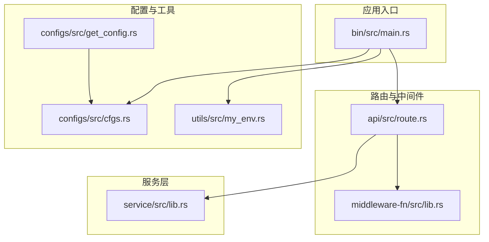
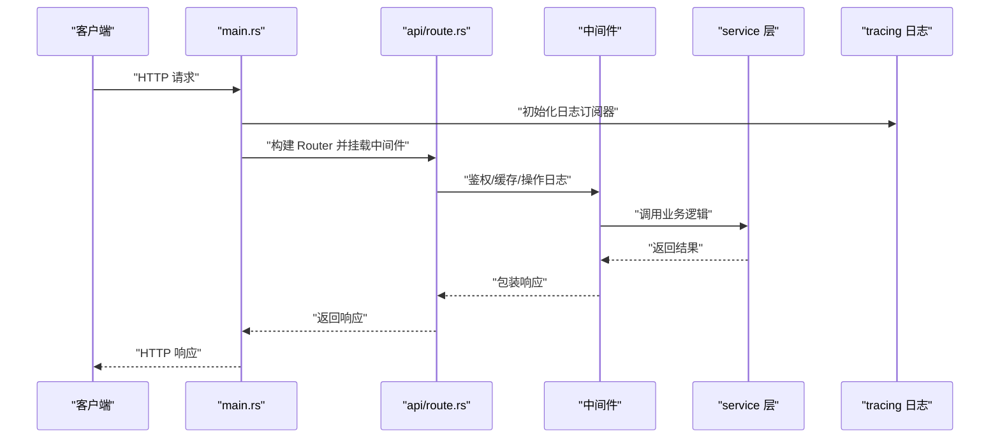
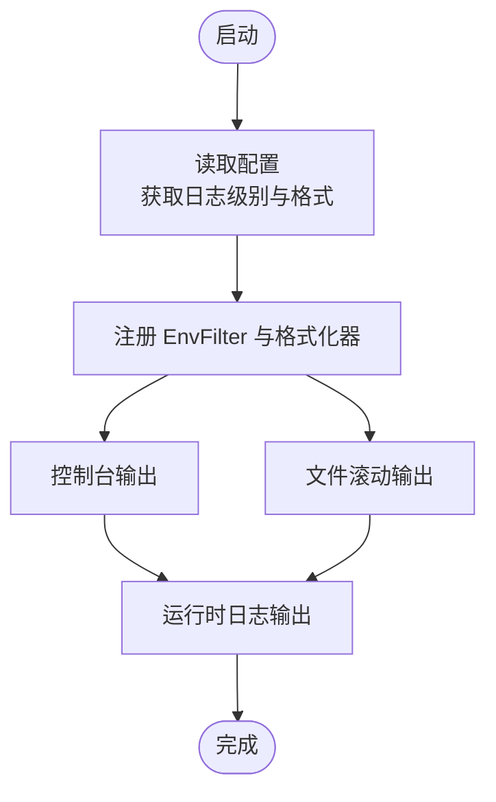
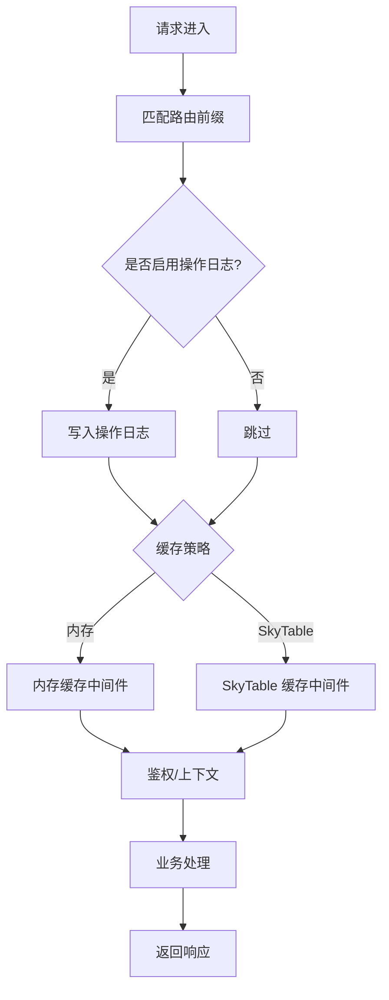
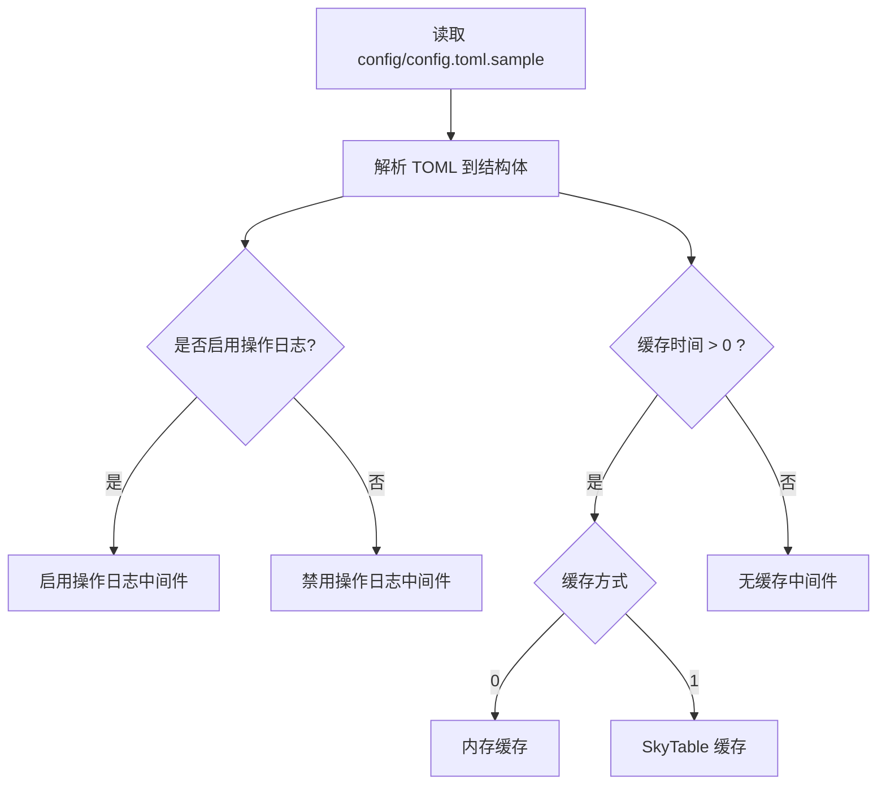
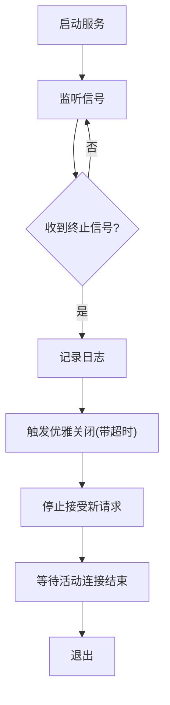
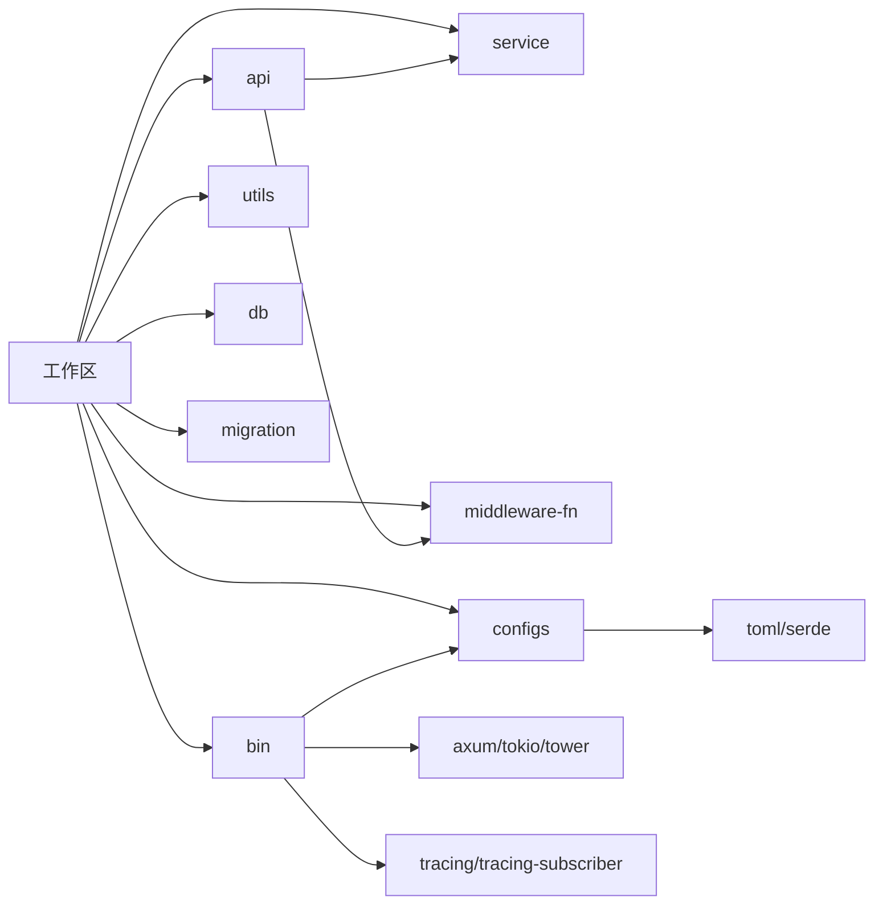

# 调试工具

<cite>
**本文引用的文件**
- [Cargo.toml](file://Cargo.toml)
- [.cargo/config.toml](file://.cargo/config.toml)
- [.github/workflows/rust.yml](file://.github/workflows/rust.yml)
- [bin/src/main.rs](file://bin/src/main.rs)
- [api/src/route.rs](file://api/src/route.rs)
- [api/src/lib.rs](file://api/src/lib.rs)
- [service/src/lib.rs](file://service/src/lib.rs)
- [middleware-fn/src/lib.rs](file://middleware-fn/src/lib.rs)
- [configs/src/cfgs.rs](file://configs/src/cfgs.rs)
- [configs/src/get_config.rs](file://configs/src/get_config.rs)
- [utils/src/my_env.rs](file://utils/src/my_env.rs)
- [config/config.toml.sample](file://config/config.toml.sample)
- [.env.sample](file://.env.sample)
</cite>

## 目录
1. [简介](#简介)
2. [项目结构](#项目结构)
3. [核心组件](#核心组件)
4. [架构总览](#架构总览)
5. [详细组件分析](#详细组件分析)
6. [依赖关系分析](#依赖关系分析)
7. [性能考量](#性能考量)
8. [故障排查指南](#故障排查指南)
9. [结论](#结论)
10. [附录](#附录)

## 简介
本指南面向 Axum Admin 项目的开发者与运维人员，系统性介绍如何在该 Rust 工程中进行高效调试。内容覆盖：
- Rust 调试工具链（GDB、LLDB、以及 Rust 专用调试器）的使用要点与适用场景
- 断点设置、变量检查与执行流程跟踪方法
- 日志系统（基于 tracing/tracing-subscriber）的配置与使用
- 性能分析与内存泄漏检测思路
- 常见问题诊断、错误排查流程与最佳实践
- IDE 调试、远程调试与生产环境调试策略
- 调试配置、环境变量与调试模式切换

## 项目结构
Axum Admin 采用多工作区（workspace）组织，核心模块包括：
- bin：应用入口与运行时配置
- api：路由与控制器层
- service：业务服务与定时任务
- middleware-fn：中间件与上下文
- configs：配置加载与解析
- utils：运行时与日志格式化等辅助
- db/migration：数据库与迁移
- data：静态资源与 SQLite 示例

**图表来源**
- [bin/src/main.rs](file://bin/src/main.rs#L1-L129)
- [api/src/route.rs](file://api/src/route.rs#L1-L69)
- [middleware-fn/src/lib.rs](file://middleware-fn/src/lib.rs#L1-L23)
- [service/src/lib.rs](file://service/src/lib.rs#L1-L7)
- [configs/src/cfgs.rs](file://configs/src/cfgs.rs#L1-L111)
- [configs/src/get_config.rs](file://configs/src/get_config.rs#L1-L26)
- [utils/src/my_env.rs](file://utils/src/my_env.rs#L1-L72)

**章节来源**
- [Cargo.toml](file://Cargo.toml#L1-L12)
- [bin/src/main.rs](file://bin/src/main.rs#L1-L129)
- [api/src/route.rs](file://api/src/route.rs#L1-L69)
- [configs/src/cfgs.rs](file://configs/src/cfgs.rs#L1-L111)
- [configs/src/get_config.rs](file://configs/src/get_config.rs#L1-L26)
- [utils/src/my_env.rs](file://utils/src/my_env.rs#L1-L72)

## 核心组件
- 应用入口与运行时
  - 主程序负责初始化 TLS、日志、跨域、压缩、静态文件服务与优雅关闭信号
  - 使用 tracing/tracing-subscriber 构建多层日志（控制台与文件），支持按环境变量动态调整级别
- 路由与中间件
  - 路由按模块划分（通用、系统、测试），并注入鉴权、缓存、操作日志等中间件
  - 中间件通过特性开关可切换内存缓存或 SkyTable 缓存
- 配置系统
  - 以 toml 加载配置，支持服务器、Web、证书、JWT、日志、数据库、SkyTable 等
  - 日志级别、文件名、目录、是否启用操作日志均可通过配置控制
- 工具与运行时
  - 自定义运行时封装与日志格式化函数，按平台选择时间格式

**章节来源**
- [bin/src/main.rs](file://bin/src/main.rs#L25-L96)
- [api/src/route.rs](file://api/src/route.rs#L12-L68)
- [middleware-fn/src/lib.rs](file://middleware-fn/src/lib.rs#L1-L23)
- [configs/src/cfgs.rs](file://configs/src/cfgs.rs#L83-L94)
- [configs/src/get_config.rs](file://configs/src/get_config.rs#L10-L25)
- [utils/src/my_env.rs](file://utils/src/my_env.rs#L38-L71)

## 架构总览
下图展示从请求进入至响应返回的关键路径，以及日志与中间件的介入点。

**图表来源**
- [bin/src/main.rs](file://bin/src/main.rs#L53-L96)
- [api/src/route.rs](file://api/src/route.rs#L12-L68)
- [middleware-fn/src/lib.rs](file://middleware-fn/src/lib.rs#L16-L22)
- [service/src/lib.rs](file://service/src/lib.rs#L1-L7)

## 详细组件分析

### 组件一：日志系统与调试输出
- 初始化与订阅
  - 通过 tracing_subscriber 注册 EnvFilter，并结合控制台与文件输出
  - 默认日志级别来自配置；可通过 RUST_LOG 环境变量覆盖
- 日志格式
  - Windows 与非 Windows 平台分别采用 RFC3339 时间戳与紧凑格式
  - 支持包含级别、目标、线程 ID 等字段
- 使用建议
  - 开发阶段建议设置 RUST_LOG=DEBUG 或 TRACE，便于观察中间件与业务流程
  - 生产环境建议设置为 INFO/WARN，避免过多 IO

**图表来源**
- [bin/src/main.rs](file://bin/src/main.rs#L28-L51)
- [utils/src/my_env.rs](file://utils/src/my_env.rs#L38-L71)
- [configs/src/cfgs.rs](file://configs/src/cfgs.rs#L83-L94)

**章节来源**
- [bin/src/main.rs](file://bin/src/main.rs#L28-L51)
- [utils/src/my_env.rs](file://utils/src/my_env.rs#L38-L71)
- [configs/src/cfgs.rs](file://configs/src/cfgs.rs#L83-L94)

### 组件二：路由与中间件调试
- 路由组织
  - 通用接口、系统模块、测试模块分别挂载，便于分层定位问题
- 中间件链
  - 按配置决定是否启用操作日志
  - 缓存中间件根据配置选择内存或 SkyTable
  - 鉴权与上下文中间件贯穿所有受保护路由
- 调试要点
  - 在中间件入口/出口处插入日志，观察请求生命周期
  - 对鉴权失败、缓存命中率、操作日志落盘进行观测

**图表来源**
- [api/src/route.rs](file://api/src/route.rs#L33-L54)
- [middleware-fn/src/lib.rs](file://middleware-fn/src/lib.rs#L16-L22)

**章节来源**
- [api/src/route.rs](file://api/src/route.rs#L12-L68)
- [middleware-fn/src/lib.rs](file://middleware-fn/src/lib.rs#L1-L23)

### 组件三：配置驱动的调试行为
- 关键调试相关配置项
  - 日志级别、日志目录与文件名、是否启用操作日志
  - 服务器地址、SSL、GZIP 压缩、API 前缀
  - 缓存时间与缓存方式（内存/SkyTable）
- 配置加载
  - 一次性读取并反序列化到全局静态配置对象
  - 启动时即决定日志与中间件行为

**图表来源**
- [config/config.toml.sample](file://config/config.toml.sample#L31-L44)
- [configs/src/cfgs.rs](file://configs/src/cfgs.rs#L83-L110)
- [configs/src/get_config.rs](file://configs/src/get_config.rs#L10-L25)

**章节来源**
- [config/config.toml.sample](file://config/config.toml.sample#L1-L50)
- [configs/src/cfgs.rs](file://configs/src/cfgs.rs#L1-L111)
- [configs/src/get_config.rs](file://configs/src/get_config.rs#L1-L26)

### 组件四：优雅关闭与信号处理
- 支持 Ctrl+C 与 Unix 终止信号
- 收到信号后触发优雅关闭，等待既定超时
- 适用于本地调试与容器环境下的平滑重启

**图表来源**
- [bin/src/main.rs](file://bin/src/main.rs#L102-L128)

**章节来源**
- [bin/src/main.rs](file://bin/src/main.rs#L102-L128)

## 依赖关系分析
- 工作区与依赖
  - 工作区成员包含 bin、api、service、middleware-fn、utils、configs、db、migration
  - 核心运行时与网络栈由 tokio、axum、tower、hyper 等组成
- 日志与配置
  - tracing/tracing-subscriber 提供日志能力
  - toml/serde 用于配置解析
- 平台与工具链
  - .cargo/config.toml 提供目标平台的链接器与编译参数示例
  - GitHub Actions 使用稳定工具链进行构建

**图表来源**
- [Cargo.toml](file://Cargo.toml#L1-L12)
- [bin/src/main.rs](file://bin/src/main.rs#L1-L21)
- [configs/src/get_config.rs](file://configs/src/get_config.rs#L1-L26)

**章节来源**
- [Cargo.toml](file://Cargo.toml#L1-L90)
- [.cargo/config.toml](file://.cargo/config.toml#L1-L10)
- [.github/workflows/rust.yml](file://.github/workflows/rust.yml#L1-L26)

## 性能考量
- 日志开销
  - 在开发阶段开启 TRACE/DEBUG，生产阶段建议 INFO/WARN
  - 文件滚动日志会带来 IO 压力，注意磁盘空间与轮转策略
- 压缩与静态资源
  - GZIP 压缩对 SSE 不生效，需单独处理
  - 静态文件服务与索引页自动拼接提升用户体验
- 缓存策略
  - 内存缓存适合小规模、高并发场景
  - SkyTable 缓存适合分布式或需要持久化的场景
- 运行时
  - 多线程运行时在高并发下更稳定，注意避免阻塞

[本节为通用指导，不直接分析具体文件]

## 故障排查指南
- 启动失败
  - 检查配置文件是否存在与可读；确认日志目录可写
  - 确认端口未被占用，SSL 证书路径正确
- 路由不生效
  - 核对 API 前缀与请求路径是否一致
  - 检查中间件链是否正确挂载（鉴权、缓存、操作日志）
- 日志异常
  - 设置 RUST_LOG 环境变量验证日志级别
  - 检查文件输出路径与权限
- 优雅关闭
  - 观察终止信号处理日志，确认超时设置合理
- 数据库连接
  - 根据 .env.sample 设置 DATABASE_URL，确保连接字符串正确

**章节来源**
- [bin/src/main.rs](file://bin/src/main.rs#L28-L51)
- [api/src/route.rs](file://api/src/route.rs#L12-L68)
- [config/config.toml.sample](file://config/config.toml.sample#L31-L44)
- [.env.sample](file://.env.sample#L1-L3)

## 结论
Axum Admin 的调试体系围绕“配置驱动 + 日志可观测 + 中间件可插拔”展开。通过合理设置日志级别、利用中间件链定位问题、结合配置项快速切换行为，可在开发与生产环境中高效定位与解决问题。配合性能与内存分析工具，可进一步优化系统稳定性与吞吐。

[本节为总结，不直接分析具体文件]

## 附录

### A. Rust 调试工具与 IDE 集成
- GDB/LLDB
  - 适用于底层崩溃、信号处理与系统级问题
  - 在 Linux/macOS 上可直接附加进程；Windows 上建议使用 VS Code 或 CLion
- Rust 专用调试器
  - 使用 rust-lldb（LLDB 的 Rust 版本）或 rust-gdb（GDB 的 Rust 版本）
  - 更好地支持 Rust 类型与所有权模型
- IDE 调试
  - VS Code：安装 Rust（rls 或 rust-analyzer）扩展，配置 launch.json 启动调试
  - CLion：内置 Cargo 集成，支持断点、变量检查与调用栈查看
- 远程调试
  - 通过 SSH 连接目标主机，使用 gdbserver 或 lldb-server 附加进程
  - 在 IDE 中配置远程适配器进行断点与变量检查
- 生产环境调试
  - 优先通过日志与指标采集（如 pprof、火焰图）定位热点
  - 仅在必要时临时开启更高日志级别或短时抓取堆快照

[本节为通用指导，不直接分析具体文件]

### B. 调试配置与环境变量
- 环境变量
  - RUST_LOG：控制日志级别（如 DEBUG/INFO/WARN/ERROR）
  - DATABASE_URL：数据库连接字符串（参考 .env.sample）
- 配置文件
  - config/config.toml.sample：日志、服务器、Web、证书、JWT、数据库、SkyTable 等
  - configs/src/get_config.rs：一次性加载并缓存配置
- 运行时
  - utils/src/my_env.rs：自定义运行时封装与日志格式化
  - bin/src/main.rs：统一初始化日志、中间件与服务

**章节来源**
- [.env.sample](file://.env.sample#L1-L3)
- [config/config.toml.sample](file://config/config.toml.sample#L1-L50)
- [configs/src/get_config.rs](file://configs/src/get_config.rs#L10-L25)
- [utils/src/my_env.rs](file://utils/src/my_env.rs#L11-L14)
- [bin/src/main.rs](file://bin/src/main.rs#L28-L51)

### C. 调试模式切换与最佳实践
- 开发模式
  - 开启 DEBUG/TRACE 日志，启用操作日志中间件，便于回溯请求链路
  - 使用内存缓存中间件，减少外部依赖干扰
- 测试模式
  - 使用较小的日志级别，聚焦关键路径
  - 通过配置切换缓存方式，对比性能差异
- 生产模式
  - 将日志级别提升至 INFO/WARN，避免 IO 抖动
  - 固定缓存策略，监控命中率与延迟
- 最佳实践
  - 在中间件入口/出口打点，形成“请求生命周期”视图
  - 对关键业务函数添加 span，使用 tracing 的结构化字段记录上下文
  - 使用优雅关闭，避免容器重启时的数据不一致

[本节为通用指导，不直接分析具体文件]