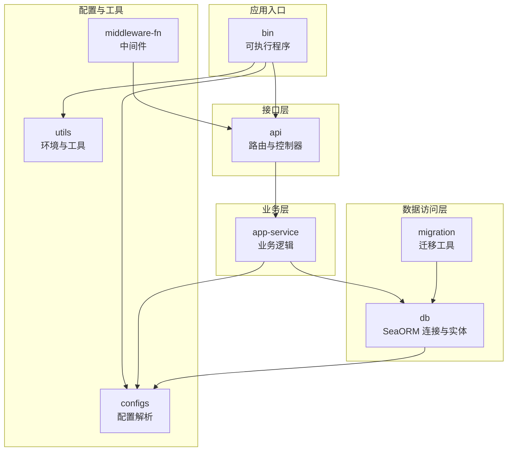
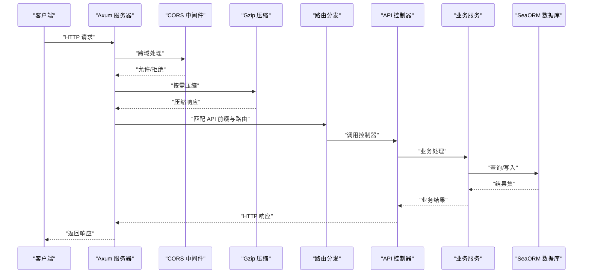
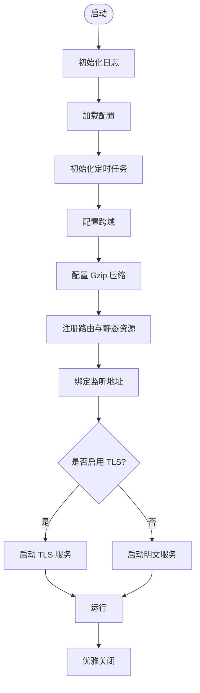
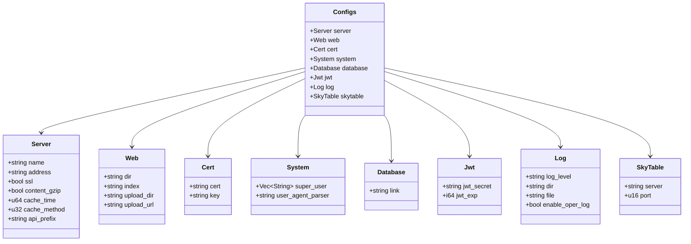
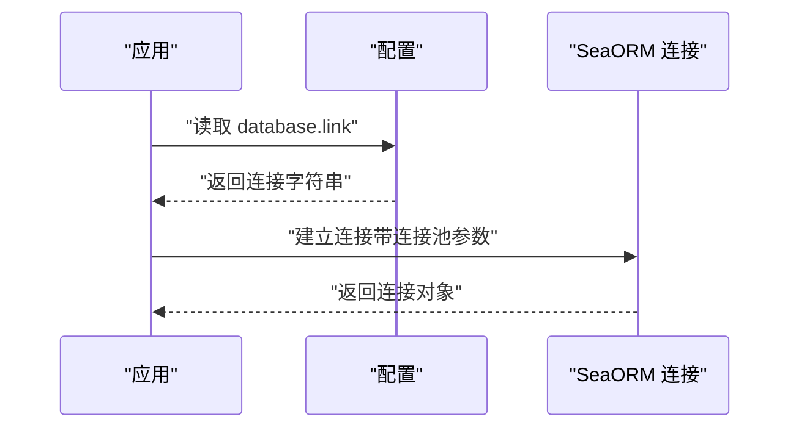
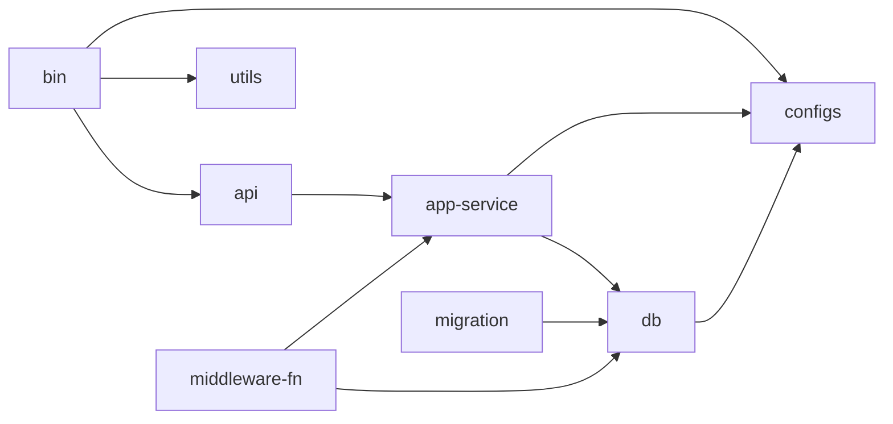

# 快速开始

<cite>
**本文引用的文件**
- [Cargo.toml](file://Cargo.toml)
- [README.md](file://README.md)
- [config.toml.sample](file://config/config.toml.sample)
- [.env.sample](file://.env.sample)
- [main.rs](file://bin/src/main.rs)
- [lib.rs](file://configs/src/lib.rs)
- [cfgs.rs](file://configs/src/cfgs.rs)
- [get_config.rs](file://configs/src/get_config.rs)
- [my_env.rs](file://utils/src/my_env.rs)
- [db.rs](file://db/src/db.rs)
- [db/Cargo.toml](file://db/Cargo.toml)
- [service/Cargo.toml](file://service/Cargo.toml)
- [middleware-fn/Cargo.toml](file://middleware-fn/Cargo.toml)
- [migration/README.md](file://migration/README.md)
- [api/lib.rs](file://api/src/lib.rs)
</cite>

## 目录
1. [简介](#简介)
2. [项目结构](#项目结构)
3. [核心组件](#核心组件)
4. [架构总览](#架构总览)
5. [详细组件分析](#详细组件分析)
6. [依赖关系分析](#依赖关系分析)
7. [性能注意事项](#性能注意事项)
8. [故障排除指南](#故障排除指南)
9. [结论](#结论)
10. [附录](#附录)

## 简介
Axum Admin 是一个基于 Rust 的现代化后台管理系统，采用 Axum + SeaORM + Vue3 技术栈构建。本指南将帮助你在最短时间内完成从零到一的环境搭建、数据库配置与项目启动，覆盖开发与生产环境的关键差异，并提供常见问题的排查方法。

## 项目结构
该项目采用工作区（workspace）组织，核心模块包括：
- bin：可执行应用入口
- api：HTTP 接口与路由
- service：业务服务层
- db：数据库访问与实体模型
- configs：配置加载与解析
- middleware-fn：中间件与通用能力
- migration：数据库迁移工具
- data：前端静态资源与上传目录
- config：配置样例与 Casbin 权限模型

图表来源
- [Cargo.toml](file://Cargo.toml#L1-L12)
- [bin/Cargo.toml](file://bin/Cargo.toml#L10-L26)
- [api/lib.rs](file://api/src/lib.rs#L1-L10)
- [service/Cargo.toml](file://service/Cargo.toml#L9-L32)
- [db/Cargo.toml](file://db/Cargo.toml#L9-L25)
- [middleware-fn/Cargo.toml](file://middleware-fn/Cargo.toml#L9-L25)

章节来源
- [Cargo.toml](file://Cargo.toml#L1-L12)
- [bin/Cargo.toml](file://bin/Cargo.toml#L10-L26)
- [api/lib.rs](file://api/src/lib.rs#L1-L10)

## 核心组件
- 应用入口与生命周期：负责初始化日志、跨域、静态资源、Gzip 压缩、TLS、定时任务与优雅关闭。
- 配置系统：以 TOML 为配置文件，支持服务器、Web、证书、系统、JWT、日志、数据库、SkyTable 等配置项。
- 数据库连接：通过 SeaORM 以连接池方式建立 MySQL/PostgreSQL/SQLite 连接。
- 中间件与缓存：支持内存与 SkyTable 两种缓存策略，以及鉴权、操作日志等中间件。
- 迁移工具：提供迁移命令行工具，支持 up/down/fresh/reset/status 等常用操作。

章节来源
- [main.rs](file://bin/src/main.rs#L25-L96)
- [cfgs.rs](file://configs/src/cfgs.rs#L4-L111)
- [get_config.rs](file://configs/src/get_config.rs#L12-L25)
- [db.rs](file://db/src/db.rs#L9-L19)
- [middleware-fn/Cargo.toml](file://middleware-fn/Cargo.toml#L27-L39)

## 架构总览
下图展示了从请求进入、路由分发、业务处理到数据库访问的整体流程。

图表来源
- [main.rs](file://bin/src/main.rs#L58-L83)
- [api/lib.rs](file://api/src/lib.rs#L5-L10)
- [db.rs](file://db/src/db.rs#L9-L19)

## 详细组件分析

### 环境与工具链准备
- 安装 Rust 工具链（建议使用 rustup）
  - 官方安装指南：https://www.rust-lang.org/tools/install
- 安装数据库
  - MySQL：请确保本地或远程 MySQL 服务可用
  - PostgreSQL：请确保本地或远程 PostgreSQL 服务可用
  - SQLite：无需额外服务，使用内置文件即可
- 安装迁移工具
  - 安装 SeaORM CLI：cargo install sea-orm-cli
  - 参考文档：https://www.sea-ql.org/SeaORM/docs/migration/running-migration

章节来源
- [README.md](file://README.md#L63-L71)

### 克隆与初始化
- 克隆仓库
  - git clone <仓库地址>
- 初始化子模块（如存在）
  - git submodule update --init --recursive
- 切换到项目根目录
  - cd <项目目录>

### 依赖安装与编译
- 使用 Cargo 工作区一次性编译所有成员
  - cargo build
- 开发运行
  - cargo run
- 生产构建
  - cargo build --release

章节来源
- [Cargo.toml](file://Cargo.toml#L1-L12)
- [bin/Cargo.toml](file://bin/Cargo.toml#L10-L26)

### 配置文件设置
- 复制配置样例
  - 将 config/config.toml.sample 复制为 config/config.toml
- 设置数据库连接
  - 在 config/config.toml 的 database.link 中填写对应数据库连接字符串
  - 支持 MySQL、PostgreSQL、SQLite 三种格式
- 其他关键配置项
  - server.address：监听地址与端口
  - server.ssl：是否启用 TLS
  - server.api_prefix：API 前缀
  - log.log_level：日志级别
  - jwt.jwt_secret/jwt_exp：JWT 密钥与过期时间
  - web.upload_dir/web.upload_url：上传目录与 URL 前缀
  - skytable.server/port：SkyTable 缓存服务地址
- 环境变量
  - 可选：设置 DATABASE_URL（优先级低于 config.toml）

章节来源
- [config.toml.sample](file://config/config.toml.sample#L45-L49)
- [cfgs.rs](file://configs/src/cfgs.rs#L24-L42)
- [cfgs.rs](file://configs/src/cfgs.rs#L44-L56)
- [cfgs.rs](file://configs/src/cfgs.rs#L74-L81)
- [cfgs.rs](file://configs/src/cfgs.rs#L83-L94)
- [cfgs.rs](file://configs/src/cfgs.rs#L96-L101)
- [cfgs.rs](file://configs/src/cfgs.rs#L103-L110)
- [.env.sample](file://.env.sample#L1-L3)

### 数据库初始化
- 选择数据库类型并设置连接字符串
  - MySQL 示例：sqlite://data/sqlite/data.db（可替换为 mysql://...）
  - PostgreSQL 示例：sqlite://data/sqlite/data.db（可替换为 postgres://...）
  - SQLite 示例：sqlite://data/sqlite/data.db
- 执行迁移
  - 应用所有迁移：cargo run
  - 或：cargo run -- up
  - 回滚迁移：cargo run -- down
  - 重置迁移：cargo run -- fresh
  - 查看状态：cargo run -- status

章节来源
- [migration/README.md](file://migration/README.md#L1-L38)
- [config.toml.sample](file://config/config.toml.sample#L45-L49)

### 启动应用
- 开发模式
  - cargo run
  - 默认监听地址可在 config/config.toml 中配置
- 生产模式
  - cargo build --release
  - 运行二进制文件（具体路径以实际产物为准）

章节来源
- [main.rs](file://bin/src/main.rs#L25-L96)

### 开发环境与生产环境差异
- 日志级别
  - 开发：建议 DEBUG/TRACE
  - 生产：建议 INFO/WARN/ERROR
- 压缩与缓存
  - 开发：可开启 Gzip 便于调试
  - 生产：建议开启 Gzip 并合理设置缓存策略
- TLS
  - 开发：可关闭 SSL
  - 生产：务必启用 SSL 并正确配置证书路径
- API 前缀
  - 开发：默认 /api
  - 生产：可根据需要调整版本前缀
- 数据库连接
  - 开发：SQLite 文件数据库
  - 生产：MySQL/PostgreSQL 集群或云数据库

章节来源
- [config.toml.sample](file://config/config.toml.sample#L31-L37)
- [config.toml.sample](file://config/config.toml.sample#L10-L16)
- [config.toml.sample](file://config/config.toml.sample#L8-L9)
- [config.toml.sample](file://config/config.toml.sample#L45-L49)

### 关键流程与类关系图

#### 应用启动流程

图表来源
- [main.rs](file://bin/src/main.rs#L25-L96)

#### 配置结构类图

图表来源
- [cfgs.rs](file://configs/src/cfgs.rs#L4-L111)

#### 数据库连接与配置

图表来源
- [db.rs](file://db/src/db.rs#L9-L19)
- [cfgs.rs](file://configs/src/cfgs.rs#L96-L101)

## 依赖关系分析
- 工作区成员
  - bin、api、service、middleware-fn、utils、configs、db、migration
- 关键依赖
  - axum、tokio、sea-orm、tower-http、tracing 等
- 特性开关
  - db 与 service/middleware-fn 提供 mysql/postgres/sqlite 特性，按需启用

图表来源
- [Cargo.toml](file://Cargo.toml#L1-L12)
- [bin/Cargo.toml](file://bin/Cargo.toml#L10-L26)
- [service/Cargo.toml](file://service/Cargo.toml#L9-L32)
- [db/Cargo.toml](file://db/Cargo.toml#L9-L25)
- [middleware-fn/Cargo.toml](file://middleware-fn/Cargo.toml#L9-L25)

章节来源
- [Cargo.toml](file://Cargo.toml#L24-L82)
- [db/Cargo.toml](file://db/Cargo.toml#L21-L25)
- [service/Cargo.toml](file://service/Cargo.toml#L34-L39)
- [middleware-fn/Cargo.toml](file://middleware-fn/Cargo.toml#L27-L39)

## 性能注意事项
- 连接池参数
  - 最大连接数、最小连接数、超时时间已在数据库连接中设置，可根据生产环境调优
- 压缩策略
  - 对于 SSE 等流式响应，已排除特定内容类型的压缩，避免数据传输异常
- 日志级别
  - 生产环境建议降低日志级别，减少 IO 压力
- 缓存策略
  - SkyTable 缓存适用于高并发场景，内存缓存适合低延迟场景

章节来源
- [db.rs](file://db/src/db.rs#L10-L15)
- [main.rs](file://bin/src/main.rs#L75-L82)
- [config.toml.sample](file://config/config.toml.sample#L31-L37)

## 故障排除指南
- 无法找到配置文件
  - 确认 config/config.toml 是否存在且可读
  - 检查配置文件路径是否正确
- 数据库连接失败
  - 检查 config/config.toml 中 database.link 的连接字符串
  - 确认数据库服务已启动且网络可达
  - 如使用 SQLite，请确认文件路径存在且可写
- 迁移失败
  - 使用 cargo run -- status 查看迁移状态
  - 使用 cargo run -- fresh 重置后重新迁移
- TLS 启用后访问异常
  - 检查证书与私钥路径是否正确
  - 确认证书与私钥文件可读
- 日志级别过高导致性能下降
  - 调整 log.log_level 为更合适的级别
- 跨域或静态资源 404
  - 检查 web.dir 与 web.index 配置
  - 确认静态资源目录存在且包含 index.html

章节来源
- [get_config.rs](file://configs/src/get_config.rs#L14-L24)
- [config.toml.sample](file://config/config.toml.sample#L45-L49)
- [migration/README.md](file://migration/README.md#L34-L38)
- [main.rs](file://bin/src/main.rs#L85-L94)
- [config.toml.sample](file://config/config.toml.sample#L20-L24)
- [config.toml.sample](file://config/config.toml.sample#L20-L24)

## 结论
通过以上步骤，你可以在本地快速搭建 Axum Admin 的开发与生产环境。建议先以 SQLite 完成本地验证，再逐步切换到 MySQL/PostgreSQL 并完善 TLS、缓存与日志配置。遇到问题时，优先检查配置文件、数据库连接与迁移状态。

## 附录

### 常用命令清单
- 安装依赖：cargo build
- 开发运行：cargo run
- 生产构建：cargo build --release
- 应用迁移：cargo run（或 cargo run -- up）
- 回滚迁移：cargo run -- down
- 重置迁移：cargo run -- fresh
- 查看状态：cargo run -- status

章节来源
- [migration/README.md](file://migration/README.md#L1-L38)

### 配置文件模板（节选）
- 服务器配置：见 config/config.toml.sample 中 [server] 段
- Web 配置：见 config/config.toml.sample 中 [web] 段
- 证书配置：见 config/config.toml.sample 中 [cert] 段
- 系统配置：见 config/config.toml.sample 中 [system] 段
- JWT 配置：见 config/config.toml.sample 中 [jwt] 段
- 日志配置：见 config/config.toml.sample 中 [log] 段
- 数据库配置：见 config/config.toml.sample 中 [database] 段
- SkyTable 配置：见 config/config.toml.sample 中 [skytable] 段

章节来源
- [config.toml.sample](file://config/config.toml.sample#L2-L50)