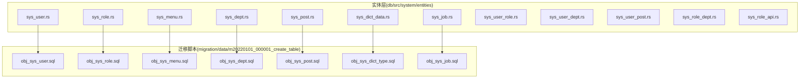
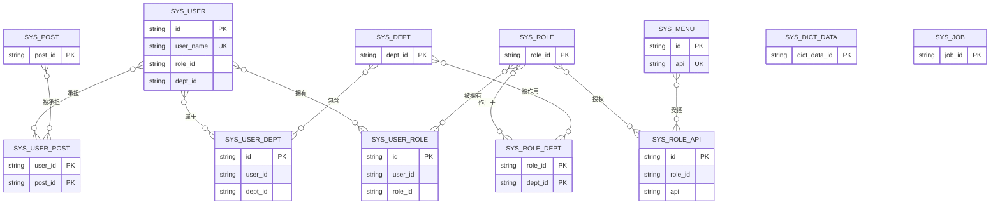
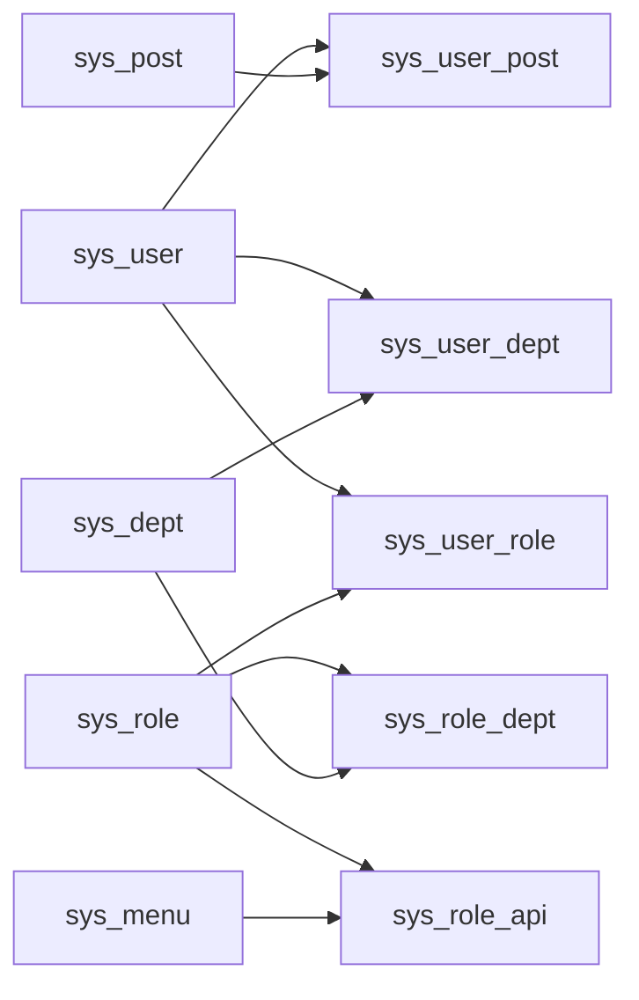
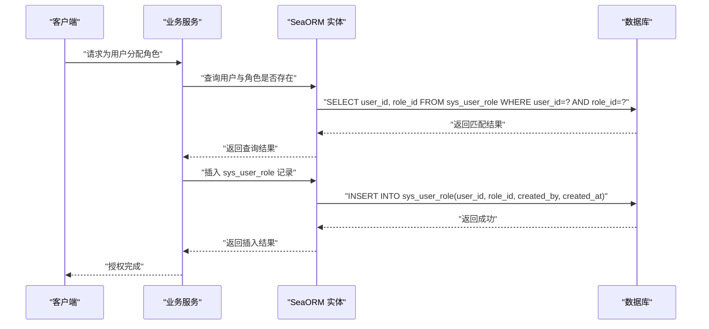

# 实体模型设计

<cite>
**本文引用的文件**
- [sys_user.rs](file://db/src/system/entities/sys_user.rs)
- [sys_role.rs](file://db/src/system/entities/sys_role.rs)
- [sys_menu.rs](file://db/src/system/entities/sys_menu.rs)
- [sys_dept.rs](file://db/src/system/entities/sys_dept.rs)
- [sys_post.rs](file://db/src/system/entities/sys_post.rs)
- [sys_dict_data.rs](file://db/src/system/entities/sys_dict_data.rs)
- [sys_job.rs](file://db/src/system/entities/sys_job.rs)
- [sys_user_role.rs](file://db/src/system/entities/sys_user_role.rs)
- [sys_user_dept.rs](file://db/src/system/entities/sys_user_dept.rs)
- [sys_user_post.rs](file://db/src/system/entities/sys_user_post.rs)
- [sys_role_dept.rs](file://db/src/system/entities/sys_role_dept.rs)
- [sys_role_api.rs](file://db/src/system/entities/sys_role_api.rs)
- [obj_sys_user.sql](file://migration/data/m20220101_000001_create_table/obj_sys_user.sql)
- [obj_sys_role.sql](file://migration/data/m20220101_000001_create_table/obj_sys_role.sql)
- [obj_sys_menu.sql](file://migration/data/m20220101_000001_create_table/obj_sys_menu.sql)
- [obj_sys_dept.sql](file://migration/data/m20220101_000001_create_table/obj_sys_dept.sql)
- [obj_sys_post.sql](file://migration/data/m20220101_000001_create_table/obj_sys_post.sql)
- [obj_sys_dict_type.sql](file://migration/data/m20220101_000001_create_table/obj_sys_dict_type.sql)
- [obj_sys_job.sql](file://migration/data/m20220101_000001_create_table/obj_sys_job.sql)
</cite>

## 目录
1. [简介](#简介)
2. [项目结构](#项目结构)
3. [核心组件](#核心组件)
4. [架构总览](#架构总览)
5. [详细组件分析](#详细组件分析)
6. [依赖分析](#依赖分析)
7. [性能考虑](#性能考虑)
8. [故障排查指南](#故障排查指南)
9. [结论](#结论)
10. [附录](#附录)

## 简介
本文件面向 Axum Admin 项目的实体模型设计，围绕 SeaORM 自动生成的实体进行系统化梳理与解读。重点覆盖用户(sys_user)、角色(sys_role)、菜单(sys_menu)、部门(sys_dept)、岗位(sys_post)、字典(sys_dict)、定时任务(sys_job)等核心实体，以及多对多关系中间表（如 sys_user_role、sys_user_dept、sys_user_post、sys_role_dept、sys_role_api）。内容涵盖字段定义、数据类型、约束条件、主键外键设计、索引策略与查询优化建议，并解释 SeaORM 的模型生成机制、实体属性配置与关系定义方式，最后给出最佳实践与使用示例，帮助开发者理解数据模型设计原则与 ORM 映射关系。

## 项目结构
Axum Admin 的实体模型位于 db/src/system/entities 下，采用 SeaORM 自动生成的代码组织方式：每个实体对应一个独立的 Rust 模块，包含 Entity、Model、ActiveModel、Column、PrimaryKey、Relation 等结构，统一由 Derive 系列派生宏完成实体定义与 ORM 映射。

**图表来源**
- [sys_user.rs](file://db/src/system/entities/sys_user.rs#L1-L110)
- [sys_role.rs](file://db/src/system/entities/sys_role.rs#L1-L80)
- [sys_menu.rs](file://db/src/system/entities/sys_menu.rs#L1-L122)
- [sys_dept.rs](file://db/src/system/entities/sys_dept.rs#L1-L92)
- [sys_post.rs](file://db/src/system/entities/sys_post.rs#L1-L86)
- [sys_dict_data.rs](file://db/src/system/entities/sys_dict_data.rs#L1-L98)
- [sys_job.rs](file://db/src/system/entities/sys_job.rs#L1-L116)
- [sys_user_role.rs](file://db/src/system/entities/sys_user_role.rs#L1-L68)
- [sys_user_dept.rs](file://db/src/system/entities/sys_user_dept.rs#L1-L68)
- [sys_user_post.rs](file://db/src/system/entities/sys_user_post.rs#L1-L63)
- [sys_role_dept.rs](file://db/src/system/entities/sys_role_dept.rs#L1-L63)
- [sys_role_api.rs](file://db/src/system/entities/sys_role_api.rs#L1-L71)
- [obj_sys_user.sql](file://migration/data/m20220101_000001_create_table/obj_sys_user.sql#L1-L28)
- [obj_sys_role.sql](file://migration/data/m20220101_000001_create_table/obj_sys_role.sql#L1-L30)
- [obj_sys_menu.sql](file://migration/data/m20220101_000001_create_table/obj_sys_menu.sql#L1-L161)
- [obj_sys_dept.sql](file://migration/data/m20220101_000001_create_table/obj_sys_dept.sql#L1-L30)
- [obj_sys_post.sql](file://migration/data/m20220101_000001_create_table/obj_sys_post.sql#L1-L25)
- [obj_sys_dict_type.sql](file://migration/data/m20220101_000001_create_table/obj_sys_dict_type.sql#L1-L37)
- [obj_sys_job.sql](file://migration/data/m20220101_000001_create_table/obj_sys_job.sql#L1-L26)

**章节来源**
- [sys_user.rs](file://db/src/system/entities/sys_user.rs#L1-L110)
- [sys_role.rs](file://db/src/system/entities/sys_role.rs#L1-L80)
- [sys_menu.rs](file://db/src/system/entities/sys_menu.rs#L1-L122)
- [sys_dept.rs](file://db/src/system/entities/sys_dept.rs#L1-L92)
- [sys_post.rs](file://db/src/system/entities/sys_post.rs#L1-L86)
- [sys_dict_data.rs](file://db/src/system/entities/sys_dict_data.rs#L1-L98)
- [sys_job.rs](file://db/src/system/entities/sys_job.rs#L1-L116)
- [sys_user_role.rs](file://db/src/system/entities/sys_user_role.rs#L1-L68)
- [sys_user_dept.rs](file://db/src/system/entities/sys_user_dept.rs#L1-L68)
- [sys_user_post.rs](file://db/src/system/entities/sys_user_post.rs#L1-L63)
- [sys_role_dept.rs](file://db/src/system/entities/sys_role_dept.rs#L1-L63)
- [sys_role_api.rs](file://db/src/system/entities/sys_role_api.rs#L1-L71)

## 核心组件
本节概述各核心实体的职责与关键字段，便于快速建立整体认知。

- 用户(sys_user)
  - 职责：系统用户主体，包含登录凭据、基本信息、状态与审计字段。
  - 关键字段：id、user_name（唯一）、user_nickname、user_password、user_salt、user_status、user_email、sex、avatar、role_id、dept_id、remark、is_admin、phone_num、last_login_ip、last_login_time、created_at、updated_at、deleted_at。
  - 主键：id；唯一约束：user_name；可空字段：user_email、remark、phone_num、last_login_ip、last_login_time、updated_at、deleted_at。
  - 备注：当前实体未声明 Relation，实际关系在业务层或中间表体现。

- 角色(sys_role)
  - 职责：用户角色定义，含角色标识、排序、数据范围、状态与审计字段。
  - 关键字段：role_id（主键）、role_name、role_key、list_order、data_scope、status、remark、created_at、updated_at。
  - 唯一性：无显式唯一约束；主键唯一。
  - 备注：当前实体未声明 Relation。

- 菜单(sys_menu)
  - 职责：系统菜单与权限点定义，支持前端路由、组件、缓存、国际化等。
  - 关键字段：id（主键）、pid、path、menu_name、icon、menu_type、query、order_sort、status、api（唯一）、method、component、visible、is_cache、log_method、data_cache_method、is_frame、data_scope、i18n、remark、created_at、updated_at、deleted_at。
  - 唯一性：api 唯一；其他字段可空或有默认值。
  - 备注：当前实体未声明 Relation。

- 部门(sys_dept)
  - 职责：组织架构树形结构，支持父子关系与排序。
  - 关键字段：dept_id（主键）、parent_id、dept_name、order_num、leader、phone、email、status、created_by、updated_by、created_at、updated_at、deleted_at。
  - 可空字段：leader、phone、email、updated_by、updated_at、deleted_at。
  - 备注：当前实体未声明 Relation。

- 岗位(sys_post)
  - 职责：用户岗位信息，用于岗位维度的数据权限与统计。
  - 关键字段：post_id（主键）、post_code、post_name、post_sort、status、remark、created_by、updated_by、created_at、updated_at、deleted_at。
  - 备注：当前实体未声明 Relation。

- 字典(sys_dict_data)
  - 职责：字典类型下的具体键值对，支持样式类、默认标记与状态。
  - 关键字段：dict_data_id（主键）、dict_sort、dict_label、dict_value、dict_type、css_class、list_class、is_default、status、create_by、update_by、remark、created_at、updated_at、deleted_at。
  - 备注：当前实体未声明 Relation。

- 定时任务(sys_job)
  - 职责：计划任务调度与执行控制，包含表达式、并发策略、状态与时间戳。
  - 关键字段：job_id（主键）、task_id、task_count、run_count、job_name、job_params、job_group、invoke_target、cron_expression、misfire_policy、concurrent、status、create_by、update_by、remark、last_time、next_time、end_time、created_at、updated_at、deleted_at。
  - 备注：当前实体未声明 Relation。

**章节来源**
- [sys_user.rs](file://db/src/system/entities/sys_user.rs#L15-L36)
- [sys_role.rs](file://db/src/system/entities/sys_role.rs#L15-L26)
- [sys_menu.rs](file://db/src/system/entities/sys_menu.rs#L15-L40)
- [sys_dept.rs](file://db/src/system/entities/sys_dept.rs#L15-L30)
- [sys_post.rs](file://db/src/system/entities/sys_post.rs#L15-L28)
- [sys_dict_data.rs](file://db/src/system/entities/sys_dict_data.rs#L15-L32)
- [sys_job.rs](file://db/src/system/entities/sys_job.rs#L15-L38)

## 架构总览
下图展示核心实体之间的关系映射与中间表的多对多连接，帮助理解用户-角色、用户-部门、用户-岗位、角色-部门、角色-API 等关系如何通过中间表实现。

**图表来源**
- [sys_user.rs](file://db/src/system/entities/sys_user.rs#L15-L36)
- [sys_role.rs](file://db/src/system/entities/sys_role.rs#L15-L26)
- [sys_menu.rs](file://db/src/system/entities/sys_menu.rs#L15-L40)
- [sys_dept.rs](file://db/src/system/entities/sys_dept.rs#L15-L30)
- [sys_post.rs](file://db/src/system/entities/sys_post.rs#L15-L28)
- [sys_dict_data.rs](file://db/src/system/entities/sys_dict_data.rs#L15-L32)
- [sys_job.rs](file://db/src/system/entities/sys_job.rs#L15-L38)
- [sys_user_role.rs](file://db/src/system/entities/sys_user_role.rs#L15-L22)
- [sys_user_dept.rs](file://db/src/system/entities/sys_user_dept.rs#L15-L22)
- [sys_user_post.rs](file://db/src/system/entities/sys_user_post.rs#L15-L20)
- [sys_role_dept.rs](file://db/src/system/entities/sys_role_dept.rs#L15-L20)
- [sys_role_api.rs](file://db/src/system/entities/sys_role_api.rs#L15-L23)

## 详细组件分析

### 用户实体(sys_user)
- 字段与类型
  - id: String(32) 主键
  - user_name: String(60) 唯一
  - user_nickname: String(50)
  - user_password: String(32)
  - user_salt: Char(10)
  - user_status: Char(1)
  - user_email: String(100)? 可空
  - sex: Char(1)
  - avatar: String(255)
  - role_id: String(32)
  - dept_id: String(32)
  - remark: String(255)? 可空
  - is_admin: Char(1)
  - phone_num: String(20)? 可空
  - last_login_ip: String(15)? 可空
  - last_login_time: DateTime? 可空
  - created_at: DateTime
  - updated_at: DateTime? 可空
  - deleted_at: DateTime? 可空
- 约束与索引
  - 主键：id
  - 唯一：user_name
  - 其他字段根据业务需要可能建立索引（见“性能考虑”）
- 关系映射
  - 当前 Relation 为空，需在业务层或中间表体现与角色、部门的关系
- 使用示例
  - 创建用户：填充必填字段，设置 role_id 与 dept_id
  - 查询用户：按 user_name 唯一索引查询；按 dept_id 进行部门级筛选
  - 更新登录信息：last_login_ip、last_login_time

**章节来源**
- [sys_user.rs](file://db/src/system/entities/sys_user.rs#L15-L100)

### 角色实体(sys_role)
- 字段与类型
  - role_id: String(32) 主键
  - role_name: String(20)
  - role_key: String(100)
  - list_order: Integer
  - data_scope: Char(1)
  - status: Char(1)
  - remark: String(255)? 可空
  - created_at: DateTime
  - updated_at: DateTime? 可空
- 约束与索引
  - 主键：role_id
  - 无显式唯一约束
- 关系映射
  - 通过中间表 sys_user_role 与用户建立多对多
  - 通过中间表 sys_role_dept 与部门建立多对多
  - 通过中间表 sys_role_api 与 API 权限建立多对多
- 使用示例
  - 分配角色给用户：插入 sys_user_role 记录
  - 设置角色数据范围：使用 data_scope 字段
  - 查询角色拥有的 API：联结 sys_role_api 与 sys_menu

**章节来源**
- [sys_role.rs](file://db/src/system/entities/sys_role.rs#L15-L71)

### 菜单实体(sys_menu)
- 字段与类型
  - id: String(32) 主键
  - pid: String(32)
  - path: String(255)
  - menu_name: String(100)
  - icon: String(50)
  - menu_type: Char(1)
  - query: String(255)? 可空
  - order_sort: Integer
  - status: Char(1)
  - api: String(155) 唯一
  - method: String(10)
  - component: String(100)
  - visible: Char(1)
  - is_cache: Char(1)
  - log_method: Char(1)
  - data_cache_method: Char(1)
  - is_frame: Char(1)
  - data_scope: Char(1)
  - i18n: String(100)? 可空
  - remark: String(255)
  - created_at: DateTime? 可空
  - updated_at: DateTime? 可空
  - deleted_at: DateTime? 可空
- 约束与索引
  - 主键：id
  - 唯一：api
- 关系映射
  - 通过中间表 sys_role_api 与角色建立多对多
- 使用示例
  - 获取路由树：按 pid 组织层级
  - 权限校验：按 api 与 method 匹配

**章节来源**
- [sys_menu.rs](file://db/src/system/entities/sys_menu.rs#L15-L113)

### 部门实体(sys_dept)
- 字段与类型
  - dept_id: String(32) 主键
  - parent_id: String(32)
  - dept_name: String(30)
  - order_num: Integer
  - leader: String(20)? 可空
  - phone: String(11)? 可空
  - email: String(50)? 可空
  - status: Char(1)
  - created_by: String(32)
  - updated_by: String(32)? 可空
  - created_at: DateTime
  - updated_at: DateTime? 可空
  - deleted_at: DateTime? 可空
- 约束与索引
  - 主键：dept_id
  - 可空字段较多，适合在查询中注意空值处理
- 关系映射
  - 通过中间表 sys_user_dept 与用户建立多对多
  - 通过中间表 sys_role_dept 与角色建立多对多
- 使用示例
  - 组织树构建：按 parent_id 递归
  - 数据权限：结合 data_scope 与 dept_id

**章节来源**
- [sys_dept.rs](file://db/src/system/entities/sys_dept.rs#L15-L82)

### 岗位实体(sys_post)
- 字段与类型
  - post_id: String(32) 主键
  - post_code: String(64)
  - post_name: String(50)
  - post_sort: Integer
  - status: Char(1)
  - remark: String(500)? 可空
  - created_by: String(32)
  - updated_by: String(32)? 可空
  - created_at: DateTime? 可空
  - updated_at: DateTime? 可空
  - deleted_at: DateTime? 可空
- 约束与索引
  - 主键：post_id
- 关系映射
  - 通过中间表 sys_user_post 与用户建立多对多
- 使用示例
  - 用户岗位分配：插入 sys_user_post 记录
  - 岗位维度统计：按 post_id 聚合

**章节来源**
- [sys_post.rs](file://db/src/system/entities/sys_post.rs#L15-L76)

### 字典实体(sys_dict_data)
- 字段与类型
  - dict_data_id: String(32) 主键
  - dict_sort: Integer
  - dict_label: String(100)
  - dict_value: String(100)
  - dict_type: String(100)
  - css_class: String(100)? 可空
  - list_class: String(100)? 可空
  - is_default: Char(1)
  - status: Char(1)
  - create_by: String(32)
  - update_by: String(32)? 可空
  - remark: String(500)? 可空
  - created_at: DateTime? 可空
  - updated_at: DateTime? 可空
  - deleted_at: DateTime? 可空
- 约束与索引
  - 主键：dict_data_id
- 关系映射
  - 通过 dict_type 与字典类型关联（类型表在迁移脚本中存在）
- 使用示例
  - 按类型查询：按 dict_type 过滤
  - 默认项选择：按 is_default

**章节来源**
- [sys_dict_data.rs](file://db/src/system/entities/sys_dict_data.rs#L15-L88)

### 定时任务实体(sys_job)
- 字段与类型
  - job_id: String(32) 主键
  - task_id: BigInteger
  - task_count: BigInteger
  - run_count: BigInteger
  - job_name: String(64)
  - job_params: String(200)? 可空
  - job_group: String(64)
  - invoke_target: String(500)
  - cron_expression: String(255)
  - misfire_policy: Char(1)
  - concurrent: Char(1)? 可空
  - status: Char(1)
  - create_by: String(32)
  - update_by: String(32)? 可空
  - remark: Text? 可空
  - last_time: DateTime? 可空
  - next_time: DateTime? 可空
  - end_time: DateTime? 可空
  - created_at: DateTime? 可空
  - updated_at: DateTime? 可空
  - deleted_at: DateTime? 可空
- 约束与索引
  - 主键：job_id
- 关系映射
  - 无直接 Relation，通常通过任务调度器与业务逻辑交互
- 使用示例
  - 启动/停止任务：按 status 控制
  - 调度策略：按 cron_expression 与 misfire_policy

**章节来源**
- [sys_job.rs](file://db/src/system/entities/sys_job.rs#L15-L106)

### 中间表与多对多关系

#### 用户-角色(sys_user_role)
- 字段：id、user_id、role_id、created_by、created_at
- 主键：id
- 关系：用户与角色多对多
- 使用示例：为用户批量分配角色

**章节来源**
- [sys_user_role.rs](file://db/src/system/entities/sys_user_role.rs#L15-L59)

#### 用户-部门(sys_user_dept)
- 字段：id、user_id、dept_id、created_by、created_at
- 主键：id
- 关系：用户与部门多对多
- 使用示例：设置用户的部门归属

**章节来源**
- [sys_user_dept.rs](file://db/src/system/entities/sys_user_dept.rs#L15-L58)

#### 用户-岗位(sys_user_post)
- 字段：user_id、post_id、created_at
- 主键：(user_id, post_id)
- 关系：用户与岗位多对多
- 使用示例：为用户设置多个岗位

**章节来源**
- [sys_user_post.rs](file://db/src/system/entities/sys_user_post.rs#L15-L54)

#### 角色-部门(sys_role_dept)
- 字段：role_id、dept_id、created_at
- 主键：(role_id, dept_id)
- 关系：角色与部门多对多
- 使用示例：限定角色在特定部门生效

**章节来源**
- [sys_role_dept.rs](file://db/src/system/entities/sys_role_dept.rs#L15-L54)

#### 角色-API(sys_role_api)
- 字段：id、role_id、api、method、created_by、created_at
- 主键：id
- 关系：角色与菜单/API 多对多
- 使用示例：授予角色访问特定 API 的权限

**章节来源**
- [sys_role_api.rs](file://db/src/system/entities/sys_role_api.rs#L15-L62)

## 依赖分析
- 实体耦合与内聚
  - 用户与角色、部门、岗位通过中间表解耦，符合高内聚低耦合原则
  - 菜单与角色通过中间表解耦，便于灵活授权
- 外部依赖
  - SeaORM 提供实体派生宏与 ORM 映射能力
  - 迁移脚本提供初始数据与表结构参考
- 循环依赖
  - 实体间通过中间表间接关联，避免直接循环依赖

**图表来源**
- [sys_user.rs](file://db/src/system/entities/sys_user.rs#L15-L36)
- [sys_role.rs](file://db/src/system/entities/sys_role.rs#L15-L26)
- [sys_menu.rs](file://db/src/system/entities/sys_menu.rs#L15-L40)
- [sys_dept.rs](file://db/src/system/entities/sys_dept.rs#L15-L30)
- [sys_post.rs](file://db/src/system/entities/sys_post.rs#L15-L28)
- [sys_user_role.rs](file://db/src/system/entities/sys_user_role.rs#L15-L22)
- [sys_user_dept.rs](file://db/src/system/entities/sys_user_dept.rs#L15-L22)
- [sys_user_post.rs](file://db/src/system/entities/sys_user_post.rs#L15-L20)
- [sys_role_dept.rs](file://db/src/system/entities/sys_role_dept.rs#L15-L20)
- [sys_role_api.rs](file://db/src/system/entities/sys_role_api.rs#L15-L23)

**章节来源**
- [sys_user.rs](file://db/src/system/entities/sys_user.rs#L1-L110)
- [sys_role.rs](file://db/src/system/entities/sys_role.rs#L1-L80)
- [sys_menu.rs](file://db/src/system/entities/sys_menu.rs#L1-L122)
- [sys_dept.rs](file://db/src/system/entities/sys_dept.rs#L1-L92)
- [sys_post.rs](file://db/src/system/entities/sys_post.rs#L1-L86)
- [sys_user_role.rs](file://db/src/system/entities/sys_user_role.rs#L1-L68)
- [sys_user_dept.rs](file://db/src/system/entities/sys_user_dept.rs#L1-L68)
- [sys_user_post.rs](file://db/src/system/entities/sys_user_post.rs#L1-L63)
- [sys_role_dept.rs](file://db/src/system/entities/sys_role_dept.rs#L1-L63)
- [sys_role_api.rs](file://db/src/system/entities/sys_role_api.rs#L1-L71)

## 性能考虑
- 索引策略
  - 唯一索引：user_name（用户）、api（菜单）
  - 建议在高频查询字段上建立索引：dept_id、role_id、post_id、dict_type、job_group、status
  - 复合索引：用户-岗位、用户-部门、角色-部门等多对多联合主键可作为隐式索引
- 查询优化
  - 使用投影查询：仅选择必要字段，减少 IO
  - 分页查询：对大表使用 limit/offset 或基于游标分页
  - 缓存热点数据：如菜单树、角色权限集合
- 写入优化
  - 批量插入中间表数据，减少事务开销
  - 合理使用 upsert（如支持）以避免重复写入
- 时间字段
  - created_at、updated_at、deleted_at 建议建立索引以支持审计与软删查询

[本节为通用指导，不直接分析具体文件]

## 故障排查指南
- 常见问题
  - 唯一约束冲突：user_name 与 api 的唯一性导致插入失败
  - 多对多关系缺失：未正确维护中间表导致权限或归属异常
  - 空值处理：部分字段可空，查询时需注意空值判断
- 排查步骤
  - 核对实体字段定义与迁移脚本一致性
  - 检查中间表记录完整性与一致性
  - 对高频查询字段补充索引
- 相关文件定位
  - 实体定义：db/src/system/entities/*.rs
  - 初始数据：migration/data/m20220101_000001_create_table/*.sql

**章节来源**
- [sys_user.rs](file://db/src/system/entities/sys_user.rs#L80-L81)
- [sys_menu.rs](file://db/src/system/entities/sys_menu.rs#L97-L98)
- [obj_sys_user.sql](file://migration/data/m20220101_000001_create_table/obj_sys_user.sql#L16-L23)
- [obj_sys_menu.sql](file://migration/data/m20220101_000001_create_table/obj_sys_menu.sql#L17-L18)

## 结论
Axum Admin 的实体模型遵循 SeaORM 自动生成的标准结构，核心实体与中间表清晰划分职责，通过中间表实现多对多关系，满足 RBAC 与数据权限需求。建议在生产环境中针对高频查询字段补充索引，并结合缓存与分页策略提升性能；同时完善中间表的维护流程，确保权限与归属关系的准确性。

[本节为总结性内容，不直接分析具体文件]

## 附录

### SeaORM 模型生成机制与实体属性配置
- 派生宏
  - DeriveEntity：定义实体名与表名映射
  - DeriveModel/DeriveActiveModel：生成模型与活动模型
  - DeriveColumn：枚举列定义
  - DerivePrimaryKey：定义主键与主键类型
  - DeriveEnumIter：为列与主键提供迭代能力
  - DeriveRelation：定义关系（当前多数实体未启用）
- 属性配置
  - ColumnTrait::def：定义列类型、长度、是否可空、是否唯一
  - PrimaryKeyTrait：定义主键类型与是否自增
  - ActiveModelBehavior：启用活动模型行为

**章节来源**
- [sys_user.rs](file://db/src/system/entities/sys_user.rs#L6-L110)
- [sys_role.rs](file://db/src/system/entities/sys_role.rs#L6-L80)
- [sys_menu.rs](file://db/src/system/entities/sys_menu.rs#L6-L122)
- [sys_dept.rs](file://db/src/system/entities/sys_dept.rs#L6-L92)
- [sys_post.rs](file://db/src/system/entities/sys_post.rs#L6-L86)
- [sys_dict_data.rs](file://db/src/system/entities/sys_dict_data.rs#L6-L98)
- [sys_job.rs](file://db/src/system/entities/sys_job.rs#L6-L116)
- [sys_user_role.rs](file://db/src/system/entities/sys_user_role.rs#L6-L68)
- [sys_user_dept.rs](file://db/src/system/entities/sys_user_dept.rs#L6-L68)
- [sys_user_post.rs](file://db/src/system/entities/sys_user_post.rs#L6-L63)
- [sys_role_dept.rs](file://db/src/system/entities/sys_role_dept.rs#L6-L63)
- [sys_role_api.rs](file://db/src/system/entities/sys_role_api.rs#L6-L71)

### 关系定义与调用序列（示例：用户授权流程）

**图表来源**
- [sys_user_role.rs](file://db/src/system/entities/sys_user_role.rs#L15-L59)
- [sys_user.rs](file://db/src/system/entities/sys_user.rs#L15-L36)
- [sys_role.rs](file://db/src/system/entities/sys_role.rs#L15-L26)