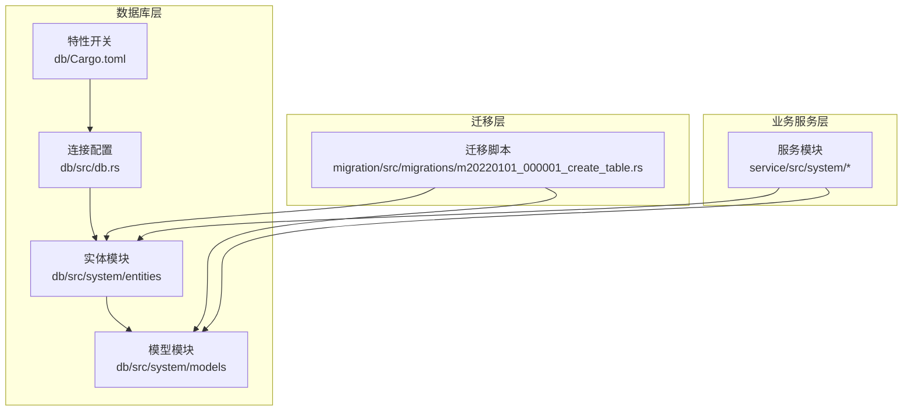
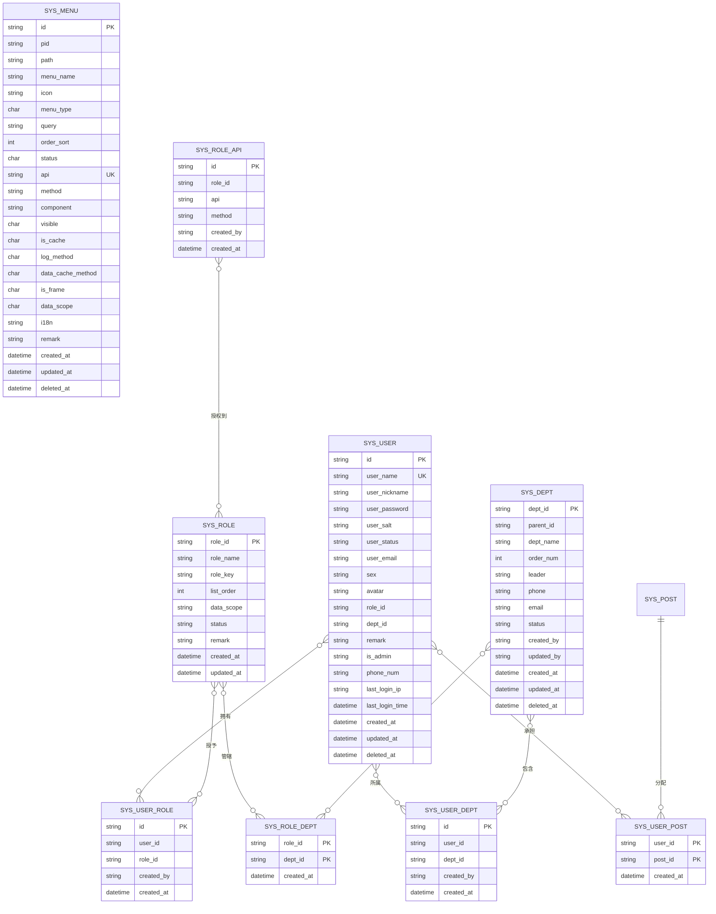
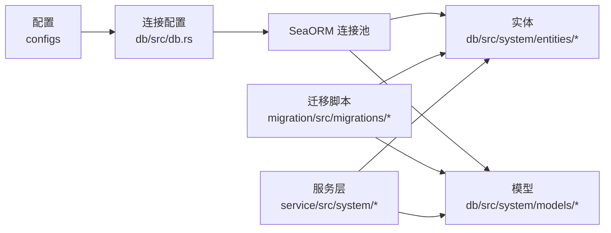

# 数据库设计

<cite>
**本文引用的文件**
- [db/src/system/entities/mod.rs](file://db/src/system/entities/mod.rs)
- [db/src/system/models/mod.rs](file://db/src/system/models/mod.rs)
- [migration/src/migrations/m20220101_000001_create_table.rs](file://migration/src/migrations/m20220101_000001_create_table.rs)
- [db/src/db.rs](file://db/src/db.rs)
- [db/Cargo.toml](file://db/Cargo.toml)
- [db/src/system/entities/sys_user.rs](file://db/src/system/entities/sys_user.rs)
- [db/src/system/entities/sys_role.rs](file://db/src/system/entities/sys_role.rs)
- [db/src/system/entities/sys_dept.rs](file://db/src/system/entities/sys_dept.rs)
- [db/src/system/entities/sys_menu.rs](file://db/src/system/entities/sys_menu.rs)
- [db/src/system/entities/sys_user_role.rs](file://db/src/system/entities/sys_user_role.rs)
- [db/src/system/entities/sys_user_dept.rs](file://db/src/system/entities/sys_user_dept.rs)
- [db/src/system/entities/sys_user_post.rs](file://db/src/system/entities/sys_user_post.rs)
- [db/src/system/entities/sys_role_dept.rs](file://db/src/system/entities/sys_role_dept.rs)
- [db/src/system/entities/sys_role_api.rs](file://db/src/system/entities/sys_role_api.rs)
- [migration/data/m20220101_000001_create_table/obj_sys_user.sql](file://migration/data/m20220101_000001_create_table/obj_sys_user.sql)
</cite>

## 目录
1. [简介](#简介)
2. [项目结构](#项目结构)
3. [核心组件](#核心组件)
4. [架构总览](#架构总览)
5. [详细组件分析](#详细组件分析)
6. [依赖分析](#依赖分析)
7. [性能考虑](#性能考虑)
8. [故障排查指南](#故障排查指南)
9. [结论](#结论)
10. [附录](#附录)

## 简介
本文件系统性梳理 Axum Admin 基于 SeaORM 的数据库设计与实现，覆盖用户、角色、菜单、部门、岗位等核心实体的表结构、字段定义、主外键关系、索引与约束，并结合迁移脚本说明版本化管理流程。同时给出 ORM 映射关系、查询优化策略、性能调优建议与运维实践，帮助数据库管理员与后端开发者高效落地与维护。

## 项目结构
数据库层采用分层组织：实体（Entities）负责 SeaORM 的表结构与列定义；模型（Models）提供业务侧数据载体；迁移（Migration）负责建表、索引与初始化数据；连接配置在 db 模块中集中管理。

图表来源
- [db/src/system/entities/mod.rs](file://db/src/system/entities/mod.rs#L1-L24)
- [db/src/system/models/mod.rs](file://db/src/system/models/mod.rs#L1-L23)
- [db/src/db.rs](file://db/src/db.rs#L1-L20)
- [db/Cargo.toml](file://db/Cargo.toml#L1-L25)
- [migration/src/migrations/m20220101_000001_create_table.rs](file://migration/src/migrations/m20220101_000001_create_table.rs#L1-L133)

章节来源
- [db/src/system/entities/mod.rs](file://db/src/system/entities/mod.rs#L1-L24)
- [db/src/system/models/mod.rs](file://db/src/system/models/mod.rs#L1-L23)
- [db/src/db.rs](file://db/src/db.rs#L1-L20)
- [db/Cargo.toml](file://db/Cargo.toml#L1-L25)
- [migration/src/migrations/m20220101_000001_create_table.rs](file://migration/src/migrations/m20220101_000001_create_table.rs#L1-L133)

## 核心组件
- 实体（Entities）：由 SeaORM 自动生成，定义表名、列类型、主键、唯一性与空值约束等。
- 模型（Models）：面向业务的数据结构，用于序列化/反序列化与服务层交互。
- 迁移（Migration）：统一管理建表、索引创建与初始化数据，支持 up/down 回滚。
- 连接配置（db.rs）：集中配置连接池大小、超时与日志开关，按需启用不同数据库后端特性。

章节来源
- [db/src/system/entities/sys_user.rs](file://db/src/system/entities/sys_user.rs#L1-L110)
- [db/src/system/entities/sys_role.rs](file://db/src/system/entities/sys_role.rs#L1-L80)
- [db/src/system/entities/sys_dept.rs](file://db/src/system/entities/sys_dept.rs#L1-L92)
- [db/src/system/entities/sys_menu.rs](file://db/src/system/entities/sys_menu.rs#L1-L122)
- [db/src/system/entities/sys_user_role.rs](file://db/src/system/entities/sys_user_role.rs#L1-L68)
- [db/src/system/entities/sys_user_dept.rs](file://db/src/system/entities/sys_user_dept.rs#L1-L68)
- [db/src/system/entities/sys_user_post.rs](file://db/src/system/entities/sys_user_post.rs#L1-L63)
- [db/src/system/entities/sys_role_dept.rs](file://db/src/system/entities/sys_role_dept.rs#L1-L63)
- [db/src/system/entities/sys_role_api.rs](file://db/src/system/entities/sys_role_api.rs#L1-L71)
- [migration/src/migrations/m20220101_000001_create_table.rs](file://migration/src/migrations/m20220101_000001_create_table.rs#L1-L133)
- [db/src/db.rs](file://db/src/db.rs#L1-L20)

## 架构总览
下图展示核心实体之间的关系与典型查询路径：用户-角色多对多、用户-部门多对一、用户-岗位多对多、角色-部门多对多、角色-API 授权等。

图表来源
- [db/src/system/entities/sys_user.rs](file://db/src/system/entities/sys_user.rs#L1-L110)
- [db/src/system/entities/sys_role.rs](file://db/src/system/entities/sys_role.rs#L1-L80)
- [db/src/system/entities/sys_dept.rs](file://db/src/system/entities/sys_dept.rs#L1-L92)
- [db/src/system/entities/sys_menu.rs](file://db/src/system/entities/sys_menu.rs#L1-L122)
- [db/src/system/entities/sys_user_role.rs](file://db/src/system/entities/sys_user_role.rs#L1-L68)
- [db/src/system/entities/sys_user_dept.rs](file://db/src/system/entities/sys_user_dept.rs#L1-L68)
- [db/src/system/entities/sys_user_post.rs](file://db/src/system/entities/sys_user_post.rs#L1-L63)
- [db/src/system/entities/sys_role_dept.rs](file://db/src/system/entities/sys_role_dept.rs#L1-L63)
- [db/src/system/entities/sys_role_api.rs](file://db/src/system/entities/sys_role_api.rs#L1-L71)

## 详细组件分析

### 用户（sys_user）
- 表结构要点
  - 主键：字符串 ID（长度上限见实体定义）。
  - 唯一约束：用户名。
  - 外键：角色 ID、部门 ID（实体未声明 RelationDef，实际约束通过应用层保证）。
  - 时间戳：创建时间必填，更新/软删时间可空。
- 字段示例（节选）
  - 用户名、昵称、密码、盐、状态、邮箱、性别、头像、手机号、最后登录 IP/时间、备注、是否管理员等。
- ORM 映射
  - 使用 SeaORM 的 DeriveModel/DeriveActiveModel，列定义与类型映射严格对应实体列。
- 查询优化建议
  - 常用过滤条件（用户名、角色 ID、部门 ID、状态）应建立单列或复合索引。
  - 软删除字段（deleted_at）用于逻辑隔离，避免全表扫描。

章节来源
- [db/src/system/entities/sys_user.rs](file://db/src/system/entities/sys_user.rs#L1-L110)
- [migration/src/migrations/m20220101_000001_create_table.rs](file://migration/src/migrations/m20220101_000001_create_table.rs#L85-L86)

### 角色（sys_role）
- 表结构要点
  - 主键：角色 ID。
  - 关键字段：角色名称、角色键、列表排序、数据范围、状态、备注。
- ORM 映射
  - 列定义与类型映射遵循实体规范，无显式 Relation 定义。
- 查询优化建议
  - 角色键常用于鉴权匹配，建议建立唯一索引以加速查找。

章节来源
- [db/src/system/entities/sys_role.rs](file://db/src/system/entities/sys_role.rs#L1-L80)
- [migration/src/migrations/m20220101_000001_create_table.rs](file://migration/src/migrations/m20220101_000001_create_table.rs#L46-L47)

### 部门（sys_dept）
- 表结构要点
  - 主键：部门 ID。
  - 层级关系：父节点 ID（parent_id）形成树形结构。
  - 状态与联系方式：状态、负责人、电话、邮箱。
  - 时间戳与软删：创建/更新时间与软删除时间。
- ORM 映射
  - 列定义包含层级与元数据字段，无 Relation。
- 查询优化建议
  - 父节点索引（parent_id）有助于树遍历与权限范围计算。

章节来源
- [db/src/system/entities/sys_dept.rs](file://db/src/system/entities/sys_dept.rs#L1-L92)
- [migration/src/migrations/m20220101_000001_create_table.rs](file://migration/src/migrations/m20220101_000001_create_table.rs#L70-L71)

### 菜单（sys_menu）
- 表结构要点
  - 主键：菜单 ID。
  - 唯一约束：API 路径（api），方法（method）与菜单类型（menu_type）常用于权限与路由匹配。
  - 路由与显示：路径、图标、组件、可见性、缓存策略、国际化键等。
  - 排序与状态：order_sort、status。
- ORM 映射
  - API 唯一性通过实体列定义体现。
- 查询优化建议
  - API 方法与菜单类型建立索引，提升路由匹配与权限校验效率。

章节来源
- [db/src/system/entities/sys_menu.rs](file://db/src/system/entities/sys_menu.rs#L1-L122)
- [migration/src/migrations/m20220101_000001_create_table.rs](file://migration/src/migrations/m20220101_000001_create_table.rs#L94-L96)

### 用户-角色（sys_user_role）
- 表结构要点
  - 主键：自增 ID。
  - 复合主键：用户 ID + 角色 ID（去重）。
  - 记录创建者与时间。
- ORM 映射
  - 双主键组合用于唯一性约束。
- 查询优化建议
  - 以用户 ID 或角色 ID 作为过滤条件时，分别建立索引以提升 JOIN 与筛选性能。

章节来源
- [db/src/system/entities/sys_user_role.rs](file://db/src/system/entities/sys_user_role.rs#L1-L68)
- [migration/src/migrations/m20220101_000001_create_table.rs](file://migration/src/migrations/m20220101_000001_create_table.rs#L91-L92)

### 用户-部门（sys_user_dept）
- 表结构要点
  - 主键：自增 ID。
  - 复合主键：用户 ID + 部门 ID。
- ORM 映射
  - 与用户-角色一致的复合主键设计。
- 查询优化建议
  - 部门维度的数据范围控制常以该表为依据，建议围绕用户/部门 ID 建立索引。

章节来源
- [db/src/system/entities/sys_user_dept.rs](file://db/src/system/entities/sys_user_dept.rs#L1-L68)
- [migration/src/migrations/m20220101_000001_create_table.rs](file://migration/src/migrations/m20220101_000001_create_table.rs#L117-L118)

### 用户-岗位（sys_user_post）
- 表结构要点
  - 复合主键：用户 ID + 岗位 ID。
- ORM 映射
  - 仅包含双主键与时间戳。
- 查询优化建议
  - 岗位维度的职责与权限边界可通过该表快速定位用户集合。

章节来源
- [db/src/system/entities/sys_user_post.rs](file://db/src/system/entities/sys_user_post.rs#L1-L63)

### 角色-部门（sys_role_dept）
- 表结构要点
  - 复合主键：角色 ID + 部门 ID。
- ORM 映射
  - 用于角色在部门维度的授权范围。
- 查询优化建议
  - 结合数据范围策略，针对角色与部门 ID 建立索引以加速权限判定。

章节来源
- [db/src/system/entities/sys_role_dept.rs](file://db/src/system/entities/sys_role_dept.rs#L1-L63)
- [migration/src/migrations/m20220101_000001_create_table.rs](file://migration/src/migrations/m20220101_000001_create_table.rs#L82-L83)

### 角色-API（sys_role_api）
- 表结构要点
  - 主键：自增 ID。
  - 关键字段：角色 ID、API 路径、HTTP 方法、创建者与时间。
- ORM 映射
  - API 路径与方法用于细粒度权限控制。
- 查询优化建议
  - API 与角色 ID 建立复合索引，提升权限校验效率。

章节来源
- [db/src/system/entities/sys_role_api.rs](file://db/src/system/entities/sys_role_api.rs#L1-L71)
- [migration/src/migrations/m20220101_000001_create_table.rs](file://migration/src/migrations/m20220101_000001_create_table.rs#L79-L80)

### 初始化数据与样例
- 迁移脚本包含初始化数据插入，便于快速验证。
- 示例：sys_user 表初始数据包含多个用户记录，涵盖管理员、普通用户等场景。

章节来源
- [migration/data/m20220101_000001_create_table/obj_sys_user.sql](file://migration/data/m20220101_000001_create_table/obj_sys_user.sql#L14-L28)

## 依赖分析
- 组件耦合
  - 实体与模型松耦合：实体专注表结构，模型专注业务数据。
  - 迁移脚本集中管理建表与索引，避免分散配置带来的不一致。
  - 服务层通过实体/模型进行读写，避免直接操作底层 SQL。
- 外部依赖
  - SeaORM 提供 ORM 能力与迁移工具链。
  - 数据库后端通过特性开关启用（PostgreSQL/MySQL/SQLite）。

图表来源
- [db/src/db.rs](file://db/src/db.rs#L1-L20)
- [db/Cargo.toml](file://db/Cargo.toml#L21-L25)
- [migration/src/migrations/m20220101_000001_create_table.rs](file://migration/src/migrations/m20220101_000001_create_table.rs#L1-L133)

章节来源
- [db/src/db.rs](file://db/src/db.rs#L1-L20)
- [db/Cargo.toml](file://db/Cargo.toml#L1-L25)
- [migration/src/migrations/m20220101_000001_create_table.rs](file://migration/src/migrations/m20220101_000001_create_table.rs#L1-L133)

## 性能考虑
- 连接池与超时
  - 最大连接数、最小连接数、连接/空闲超时、日志开关在连接配置中集中设置，建议根据并发与资源情况调整。
- 索引策略
  - 用户：用户名唯一索引、角色 ID、部门 ID、状态等常用过滤字段建立索引。
  - 菜单：API 唯一索引、方法与类型索引。
  - 关联表：用户-角色、用户-部门、角色-API 等以过滤字段建立复合索引。
- 查询优化
  - 使用投影（只取必要列）减少网络与解析开销。
  - 分页查询配合合适索引，避免 ORDER BY 无索引导致的排序开销。
  - 软删除（deleted_at）与逻辑隔离减少物理删除带来的锁竞争。
- 缓存与热点
  - 对高频读取的字典、菜单、角色信息可引入缓存层，降低数据库压力。
- 迁移与版本控制
  - 迁移脚本命名与顺序固定，up/down 支持回滚，确保环境一致性。

章节来源
- [db/src/db.rs](file://db/src/db.rs#L9-L19)
- [migration/src/migrations/m20220101_000001_create_table.rs](file://migration/src/migrations/m20220101_000001_create_table.rs#L66-L101)

## 故障排查指南
- 连接问题
  - 检查连接字符串、最大连接数与超时设置；确认数据库可达与凭据正确。
- 唯一约束冲突
  - 用户名、菜单 API 等唯一字段冲突时，检查迁移初始化数据与业务入库逻辑。
- 权限与数据范围异常
  - 核对用户-角色、角色-API、角色-部门、用户-部门等关联表数据是否完整。
- 迁移失败
  - 查看迁移脚本执行顺序与错误日志，优先执行 up 再 down，确保幂等性。

章节来源
- [db/src/db.rs](file://db/src/db.rs#L9-L19)
- [migration/src/migrations/m20220101_000001_create_table.rs](file://migration/src/migrations/m20220101_000001_create_table.rs#L16-L28)

## 结论
本设计以 SeaORM 为核心，通过实体与模型分离、迁移脚本集中管理、完善的索引与约束，构建了清晰、可演进、易维护的数据库层。结合合理的连接池配置与查询优化策略，可在高并发场景下保持稳定性能。建议在生产环境中持续完善索引、缓存与监控体系，确保系统长期可靠运行。

## 附录
- 数据库后端特性开关
  - 通过特性启用 PostgreSQL/MySQL/SQLite 后端，满足不同部署需求。
- 运维建议
  - 定期备份数据库，验证恢复流程。
  - 对热点表进行分区或读写分离，结合缓存与异步任务处理高峰流量。

章节来源
- [db/Cargo.toml](file://db/Cargo.toml#L21-L25)