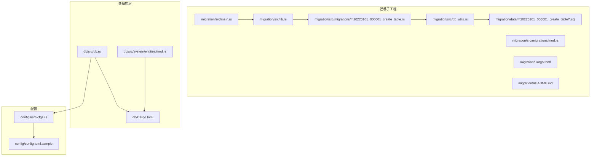
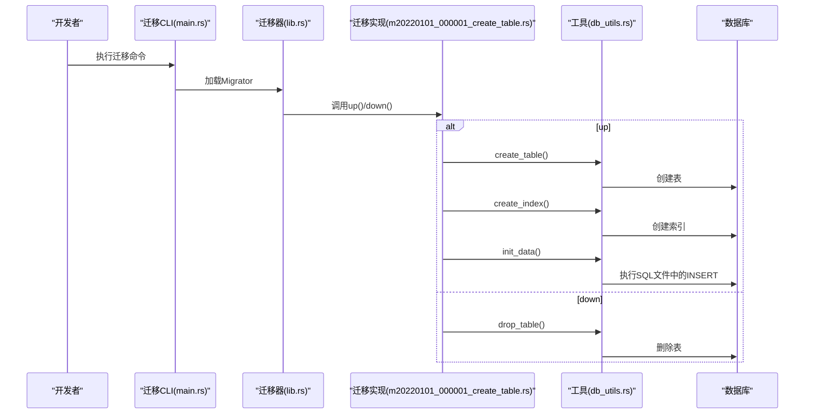
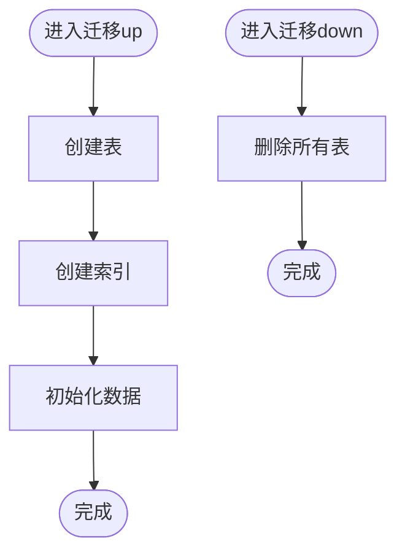
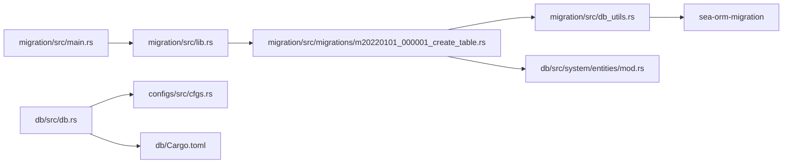

# 数据库迁移管理

<cite>
**本文引用的文件**
- [migration/Cargo.toml](file://migration/Cargo.toml)
- [migration/src/lib.rs](file://migration/src/lib.rs)
- [migration/src/main.rs](file://migration/src/main.rs)
- [migration/src/migrations/mod.rs](file://migration/src/migrations/mod.rs)
- [migration/src/migrations/m20220101_000001_create_table.rs](file://migration/src/migrations/m20220101_000001_create_table.rs)
- [migration/src/db_utils.rs](file://migration/src/db_utils.rs)
- [migration/README.md](file://migration/README.md)
- [migration/data/m20220101_000001_create_table/obj_sys_user.sql](file://migration/data/m20220101_000001_create_table/obj_sys_user.sql)
- [db/Cargo.toml](file://db/Cargo.toml)
- [db/src/db.rs](file://db/src/db.rs)
- [db/src/system/entities/mod.rs](file://db/src/system/entities/mod.rs)
- [configs/src/cfgs.rs](file://configs/src/cfgs.rs)
- [config/config.toml.sample](file://config/config.toml.sample)
</cite>

## 目录
1. [简介](#简介)
2. [项目结构](#项目结构)
3. [核心组件](#核心组件)
4. [架构总览](#架构总览)
5. [详细组件分析](#详细组件分析)
6. [依赖关系分析](#依赖关系分析)
7. [性能考量](#性能考量)
8. [故障排除指南](#故障排除指南)
9. [结论](#结论)
10. [附录](#附录)

## 简介
本文件系统化阐述 Axum Admin 项目的数据库迁移管理机制，基于 SeaORM Migration 实现版本化数据库结构演进与数据初始化。内容覆盖迁移脚本编写规范、执行流程、回滚策略、索引与约束优化、跨数据库兼容性（SQLite、MySQL、PostgreSQL）以及自动化部署与运维最佳实践。

## 项目结构
迁移相关代码集中于独立的迁移子工程，通过 SeaORM Migration CLI 驱动，配合数据目录中的初始化 SQL 文件完成结构与数据的统一管理。



**图表来源**
- [migration/src/lib.rs](file://migration/src/lib.rs#L1-L17)
- [migration/src/main.rs](file://migration/src/main.rs#L1-L7)
- [migration/src/migrations/mod.rs](file://migration/src/migrations/mod.rs#L1-L2)
- [migration/src/migrations/m20220101_000001_create_table.rs](file://migration/src/migrations/m20220101_000001_create_table.rs#L1-L133)
- [migration/src/db_utils.rs](file://migration/src/db_utils.rs#L1-L158)
- [migration/Cargo.toml](file://migration/Cargo.toml#L1-L16)
- [migration/README.md](file://migration/README.md#L1-L38)
- [db/Cargo.toml](file://db/Cargo.toml#L1-L25)
- [db/src/db.rs](file://db/src/db.rs#L1-L20)
- [db/src/system/entities/mod.rs](file://db/src/system/entities/mod.rs#L1-L24)
- [configs/src/cfgs.rs](file://configs/src/cfgs.rs#L1-L111)
- [config/config.toml.sample](file://config/config.toml.sample#L1-L50)

**章节来源**
- [migration/Cargo.toml](file://migration/Cargo.toml#L1-L16)
- [migration/src/lib.rs](file://migration/src/lib.rs#L1-L17)
- [migration/src/main.rs](file://migration/src/main.rs#L1-L7)
- [migration/src/migrations/mod.rs](file://migration/src/migrations/mod.rs#L1-L2)
- [migration/src/migrations/m20220101_000001_create_table.rs](file://migration/src/migrations/m20220101_000001_create_table.rs#L1-L133)
- [migration/src/db_utils.rs](file://migration/src/db_utils.rs#L1-L158)
- [migration/README.md](file://migration/README.md#L1-L38)
- [db/Cargo.toml](file://db/Cargo.toml#L1-L25)
- [db/src/db.rs](file://db/src/db.rs#L1-L20)
- [db/src/system/entities/mod.rs](file://db/src/system/entities/mod.rs#L1-L24)
- [configs/src/cfgs.rs](file://configs/src/cfgs.rs#L1-L111)
- [config/config.toml.sample](file://config/config.toml.sample#L1-L50)

## 核心组件
- 迁移入口与 CLI
  - CLI 启动入口负责调用 SeaORM Migration CLI 并注入自定义 Migrator。
  - 参考路径：[migration/src/main.rs](file://migration/src/main.rs#L1-L7)
- 迁移器与迁移列表
  - 定义 Migrator 并注册迁移模块，当前仅包含首个初始化迁移。
  - 参考路径：[migration/src/lib.rs](file://migration/src/lib.rs#L1-L17)
- 迁移实现
  - 迁移包含结构创建、索引创建与数据初始化三段式流程，并提供回滚到删除所有表的能力。
  - 参考路径：[migration/src/migrations/m20220101_000001_create_table.rs](file://migration/src/migrations/m20220101_000001_create_table.rs#L1-L133)
- 工具函数
  - 提供单表创建、索引创建、表删除与初始化数据导入等通用能力。
  - 参考路径：[migration/src/db_utils.rs](file://migration/src/db_utils.rs#L1-L158)
- 数据目录
  - 按迁移命名空间组织的 SQL 文件，用于初始化各表的种子数据。
  - 示例：[migration/data/m20220101_000001_create_table/obj_sys_user.sql](file://migration/data/m20220101_000001_create_table/obj_sys_user.sql#L1-L28)
- 数据库连接与配置
  - 应用通过配置加载数据库连接字符串，SeaORM Migration 在运行时根据后端自动适配方言。
  - 参考路径：[db/src/db.rs](file://db/src/db.rs#L1-L20)，[configs/src/cfgs.rs](file://configs/src/cfgs.rs#L1-L111)，[config/config.toml.sample](file://config/config.toml.sample#L1-L50)

**章节来源**
- [migration/src/main.rs](file://migration/src/main.rs#L1-L7)
- [migration/src/lib.rs](file://migration/src/lib.rs#L1-L17)
- [migration/src/migrations/m20220101_000001_create_table.rs](file://migration/src/migrations/m20220101_000001_create_table.rs#L1-L133)
- [migration/src/db_utils.rs](file://migration/src/db_utils.rs#L1-L158)
- [migration/data/m20220101_000001_create_table/obj_sys_user.sql](file://migration/data/m20220101_000001_create_table/obj_sys_user.sql#L1-L28)
- [db/src/db.rs](file://db/src/db.rs#L1-L20)
- [configs/src/cfgs.rs](file://configs/src/cfgs.rs#L1-L111)
- [config/config.toml.sample](file://config/config.toml.sample#L1-L50)

## 架构总览
迁移执行链路由 CLI 触发，SeaORM Migration 调用 Migrator 注册的迁移列表，逐个执行 up/down；迁移内部通过工具函数完成表结构创建、索引建立与数据初始化；数据导入阶段按数据库后端差异对 SQL 语法进行适配。



**图表来源**
- [migration/src/main.rs](file://migration/src/main.rs#L1-L7)
- [migration/src/lib.rs](file://migration/src/lib.rs#L1-L17)
- [migration/src/migrations/m20220101_000001_create_table.rs](file://migration/src/migrations/m20220101_000001_create_table.rs#L1-L133)
- [migration/src/db_utils.rs](file://migration/src/db_utils.rs#L1-L158)

## 详细组件分析

### 迁移器与迁移注册
- Migrator 实现 SeaORM Migration 的 MigratorTrait，返回迁移列表。
- 当前仅注册了首个初始化迁移，后续可通过新增迁移模块并在此注册扩展。
- 参考路径：[migration/src/lib.rs](file://migration/src/lib.rs#L1-L17)

**章节来源**
- [migration/src/lib.rs](file://migration/src/lib.rs#L1-L17)

### 迁移实现：结构创建、索引与数据初始化
- 结构创建
  - 通过 Schema 与 DatabaseBackend 生成建表语句，逐个实体创建表。
  - 参考路径：[migration/src/migrations/m20220101_000001_create_table.rs](file://migration/src/migrations/m20220101_000001_create_table.rs#L30-L63)
- 索引创建
  - 支持普通、唯一、主键、全文索引类型，按表与列组合批量创建。
  - 参考路径：[migration/src/migrations/m20220101_000001_create_table.rs](file://migration/src/migrations/m20220101_000001_create_table.rs#L65-L101)
- 数据初始化
  - 读取对应迁移命名空间下的 SQL 文件，按数据库后端替换转义符后执行。
  - 参考路径：[migration/src/migrations/m20220101_000001_create_table.rs](file://migration/src/migrations/m20220101_000001_create_table.rs#L18-L27)，[migration/src/db_utils.rs](file://migration/src/db_utils.rs#L78-L120)
- 回滚策略
  - 删除所有已创建的表，保证可逆向恢复。
  - 参考路径：[migration/src/migrations/m20220101_000001_create_table.rs](file://migration/src/migrations/m20220101_000001_create_table.rs#L103-L132)



**图表来源**
- [migration/src/migrations/m20220101_000001_create_table.rs](file://migration/src/migrations/m20220101_000001_create_table.rs#L16-L28)
- [migration/src/migrations/m20220101_000001_create_table.rs](file://migration/src/migrations/m20220101_000001_create_table.rs#L103-L132)

**章节来源**
- [migration/src/migrations/m20220101_000001_create_table.rs](file://migration/src/migrations/m20220101_000001_create_table.rs#L1-L133)
- [migration/src/db_utils.rs](file://migration/src/db_utils.rs#L1-L158)

### 工具函数：表/索引/数据管理
- create_one_table
  - 基于 Schema 与 DatabaseBackend 生成建表语句并执行，支持 IF NOT EXISTS。
  - 参考路径：[migration/src/db_utils.rs](file://migration/src/db_utils.rs#L17-L30)
- create_table_index
  - 支持多种索引类型，动态拼接列集合，打印调试信息。
  - 参考路径：[migration/src/db_utils.rs](file://migration/src/db_utils.rs#L32-L66)
- drop_one_table
  - 删除指定表，便于回滚。
  - 参考路径：[migration/src/db_utils.rs](file://migration/src/db_utils.rs#L68-L76)
- init_data
  - 读取数据目录下 SQL 文件，按数据库后端替换反引号，分批执行 INSERT。
  - 参考路径：[migration/src/db_utils.rs](file://migration/src/db_utils.rs#L78-L120)，[migration/src/db_utils.rs](file://migration/src/db_utils.rs#L122-L157)

```mermaid
flowchart TD
A["init_data(migration_name)"] --> B["拼接数据目录路径"]
B --> C{"目录存在？"}
C --> |否| D["提示并返回"]
C --> |是| E["遍历SQL文件"]
E --> F["解析SQL片段(忽略注释)"]
F --> G{"数据库后端适配"}
G --> |MySQL| H["保持原样"]
G --> |Postgres| I["将`替换为\""]
G --> |SQLite| J["保持原样"]
H --> K["构造Statement并执行"]
I --> K
J --> K
K --> L["打印结果并继续"]
```

**图表来源**
- [migration/src/db_utils.rs](file://migration/src/db_utils.rs#L78-L120)
- [migration/src/db_utils.rs](file://migration/src/db_utils.rs#L122-L157)

**章节来源**
- [migration/src/db_utils.rs](file://migration/src/db_utils.rs#L1-L158)

### 数据目录与初始化数据
- 目录结构
  - 以迁移命名空间作为子目录，包含各表的初始化 SQL 文件。
  - 示例：[migration/data/m20220101_000001_create_table/obj_sys_user.sql](file://migration/data/m20220101_000001_create_table/obj_sys_user.sql#L1-L28)
- 使用建议
  - 将 INSERT 语句按表拆分，避免单文件过大；注释行以特定前缀开头以便过滤。
  - 参考路径：[migration/src/db_utils.rs](file://migration/src/db_utils.rs#L134-L136)

**章节来源**
- [migration/data/m20220101_000001_create_table/obj_sys_user.sql](file://migration/data/m20220101_000001_create_table/obj_sys_user.sql#L1-L28)
- [migration/src/db_utils.rs](file://migration/src/db_utils.rs#L122-L157)

### 数据库连接与配置
- 连接字符串
  - 从配置中读取数据库连接字符串，支持 MySQL、PostgreSQL、SQLite。
  - 参考路径：[db/src/db.rs](file://db/src/db.rs#L9-L16)，[config/config.toml.sample](file://config/config.toml.sample#L45-L49)
- 特性开关
  - db 子工程默认启用三种数据库特性，确保迁移工具在不同后端可用。
  - 参考路径：[db/Cargo.toml](file://db/Cargo.toml#L21-L25)

**章节来源**
- [db/src/db.rs](file://db/src/db.rs#L1-L20)
- [config/config.toml.sample](file://config/config.toml.sample#L1-L50)
- [db/Cargo.toml](file://db/Cargo.toml#L1-L25)

## 依赖关系分析
- 迁移子工程依赖 db 子工程提供的实体模块，以生成建表语句。
- 迁移工具函数依赖 SeaORM Migration 的 Schema、Index、Statement 等能力。
- CLI 依赖 SeaORM Migration 的 CLI 模块。



**图表来源**
- [migration/src/main.rs](file://migration/src/main.rs#L1-L7)
- [migration/src/lib.rs](file://migration/src/lib.rs#L1-L17)
- [migration/src/migrations/m20220101_000001_create_table.rs](file://migration/src/migrations/m20220101_000001_create_table.rs#L1-L133)
- [migration/src/db_utils.rs](file://migration/src/db_utils.rs#L1-L158)
- [db/src/system/entities/mod.rs](file://db/src/system/entities/mod.rs#L1-L24)
- [db/src/db.rs](file://db/src/db.rs#L1-L20)
- [configs/src/cfgs.rs](file://configs/src/cfgs.rs#L1-L111)
- [db/Cargo.toml](file://db/Cargo.toml#L1-L25)

**章节来源**
- [migration/src/main.rs](file://migration/src/main.rs#L1-L7)
- [migration/src/lib.rs](file://migration/src/lib.rs#L1-L17)
- [migration/src/migrations/m20220101_000001_create_table.rs](file://migration/src/migrations/m20220101_000001_create_table.rs#L1-L133)
- [migration/src/db_utils.rs](file://migration/src/db_utils.rs#L1-L158)
- [db/src/system/entities/mod.rs](file://db/src/system/entities/mod.rs#L1-L24)
- [db/src/db.rs](file://db/src/db.rs#L1-L20)
- [configs/src/cfgs.rs](file://configs/src/cfgs.rs#L1-L111)
- [db/Cargo.toml](file://db/Cargo.toml#L1-L25)

## 性能考量
- 迁移执行顺序
  - 建表 → 建索引 → 初始化数据，避免重复扫描与锁竞争。
- 索引策略
  - 优先为高选择性列与外键列建立索引，减少查询成本。
- 数据导入
  - 将大体量初始化数据拆分为多个小文件，降低单次事务压力。
- 连接池
  - 应用层连接池参数与迁移工具无直接耦合，但建议在生产环境保持稳定的连接参数。

[本节为通用指导，不涉及具体文件分析]

## 故障排除指南
- 迁移命令
  - 使用迁移子工程的 CLI 文档列出的命令，如应用全部迁移、回滚、刷新等。
  - 参考路径：[migration/README.md](file://migration/README.md#L1-L38)
- 常见问题
  - 数据库连接失败：检查配置文件中的连接字符串是否正确。
    - 参考路径：[config/config.toml.sample](file://config/config.toml.sample#L45-L49)
  - Postgres 语法错误：确认初始化 SQL 中的标识符是否被替换为双引号。
    - 参考路径：[migration/src/db_utils.rs](file://migration/src/db_utils.rs#L138-L142)
  - 权限不足：确保迁移账户具备建表、建索引与写入权限。
  - 并发冲突：避免多实例同时执行迁移，必要时加锁或串行化执行。
- 日志与调试
  - 工具函数在执行成功/失败时会打印提示信息，便于定位问题。
  - 参考路径：[migration/src/db_utils.rs](file://migration/src/db_utils.rs#L24-L27)，[migration/src/db_utils.rs](file://migration/src/db_utils.rs#L60-L63)，[migration/src/db_utils.rs](file://migration/src/db_utils.rs#L110-L115)

**章节来源**
- [migration/README.md](file://migration/README.md#L1-L38)
- [config/config.toml.sample](file://config/config.toml.sample#L1-L50)
- [migration/src/db_utils.rs](file://migration/src/db_utils.rs#L1-L158)

## 结论
Axum Admin 的数据库迁移体系以 SeaORM Migration 为核心，结合工具函数与数据目录，实现了结构、索引与数据的完整生命周期管理。通过清晰的迁移命名与模块化设计，能够稳定地支持 SQLite、MySQL、PostgreSQL 等多数据库后端，并为自动化部署与运维提供了可靠基础。

[本节为总结性内容，不涉及具体文件分析]

## 附录

### 迁移命令速查
- 应用全部待执行迁移
  - 参考路径：[migration/README.md](file://migration/README.md#L3-L9)
- 应用前 N 个迁移
  - 参考路径：[migration/README.md](file://migration/README.md#L10-L13)
- 回滚上一次迁移
  - 参考路径：[migration/README.md](file://migration/README.md#L14-L21)
- 回滚前 N 个迁移
  - 参考路径：[migration/README.md](file://migration/README.md#L18-L21)
- 清空数据库并重新应用所有迁移
  - 参考路径：[migration/README.md](file://migration/README.md#L22-L29)
- 回滚并重新应用所有迁移
  - 参考路径：[migration/README.md](file://migration/README.md#L26-L29)
- 回滚所有迁移
  - 参考路径：[migration/README.md](file://migration/README.md#L30-L33)
- 查看迁移状态
  - 参考路径：[migration/README.md](file://migration/README.md#L34-L37)

### 跨数据库兼容性要点
- 语法适配
  - 初始化 SQL 中的标识符在 Postgres 下需替换为双引号，其他后端保持原样。
  - 参考路径：[migration/src/db_utils.rs](file://migration/src/db_utils.rs#L138-L142)
- 连接字符串
  - 支持 MySQL、PostgreSQL、SQLite 三类后端，需在配置中正确设置。
  - 参考路径：[config/config.toml.sample](file://config/config.toml.sample#L45-L49)

**章节来源**
- [migration/README.md](file://migration/README.md#L1-L38)
- [migration/src/db_utils.rs](file://migration/src/db_utils.rs#L122-L157)
- [config/config.toml.sample](file://config/config.toml.sample#L1-L50)