# 数据访问层架构

<cite>
**本文引用的文件**
- [db/src/lib.rs](file://db/src/lib.rs)
- [db/src/db.rs](file://db/src/db.rs)
- [db/src/common/mod.rs](file://db/src/common/mod.rs)
- [db/src/common/ctx.rs](file://db/src/common/ctx.rs)
- [db/src/common/client.rs](file://db/src/common/client.rs)
- [db/src/common/res.rs](file://db/src/common/res.rs)
- [db/src/system/entities/mod.rs](file://db/src/system/entities/mod.rs)
- [db/src/system/models/mod.rs](file://db/src/system/models/mod.rs)
- [db/src/system/prelude.rs](file://db/src/system/prelude.rs)
- [service/src/system/sys_user.rs](file://service/src/system/sys_user.rs)
- [api/src/system/sys_user.rs](file://api/src/system/sys_user.rs)
- [configs/src/lib.rs](file://configs/src/lib.rs)
- [migration/src/lib.rs](file://migration/src/lib.rs)
- [migration/src/db_utils.rs](file://migration/src/db_utils.rs)
- [Cargo.toml](file://Cargo.toml)
</cite>

## 目录
1. [简介](#简介)
2. [项目结构](#项目结构)
3. [核心组件](#核心组件)
4. [架构总览](#架构总览)
5. [详细组件分析](#详细组件分析)
6. [依赖分析](#依赖分析)
7. [性能考虑](#性能考虑)
8. [故障排查指南](#故障排查指南)
9. [结论](#结论)
10. [附录](#附录)

## 简介
本文件面向后端开发者，系统性阐述 Axum Admin 项目的数据库访问层（DB Layer）架构与实现细节。该层以 SeaORM 为核心，结合异步连接管理、连接池配置、事务处理与统一响应设计，向上支撑服务层与 API 层的业务逻辑。文档将重点解析以下方面：
- 数据库连接管理与连接池配置
- 事务处理与错误传播机制
- 数据库上下文（ctx）、客户端信息（client）与统一响应（res）的设计理念
- 查询构建器的使用与批量操作优化策略
- 多数据库支持、连接重试与异常处理最佳实践
- 性能调优建议、查询优化技巧与缓存策略
- 使用指南与扩展方法

## 项目结构
数据库访问层主要由以下模块构成：
- 连接与配置：db 模块负责数据库连接初始化与全局连接实例管理
- 通用工具：ctx、client、res 提供请求上下文、客户端信息与统一响应
- 实体与模型：system/entities 与 system/models 提供 SeaORM 实体与业务模型
- 服务层：service 层通过 SeaORM 执行查询、事务与批量操作
- API 层：api 层从请求提取参数，调用服务层，并以统一响应返回
- 迁移与初始化：migration 提供表结构与初始化数据脚本的执行工具

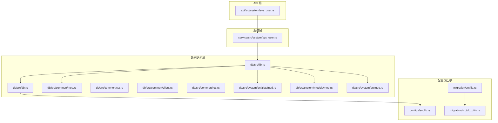

**图表来源**
- [api/src/system/sys_user.rs](file://api/src/system/sys_user.rs#L1-L206)
- [service/src/system/sys_user.rs](file://service/src/system/sys_user.rs#L1-L649)
- [db/src/lib.rs](file://db/src/lib.rs#L1-L8)
- [db/src/db.rs](file://db/src/db.rs#L1-L20)
- [db/src/common/mod.rs](file://db/src/common/mod.rs#L1-L11)
- [db/src/common/ctx.rs](file://db/src/common/ctx.rs#L1-L33)
- [db/src/common/client.rs](file://db/src/common/client.rs#L1-L22)
- [db/src/common/res.rs](file://db/src/common/res.rs#L1-L95)
- [db/src/system/entities/mod.rs](file://db/src/system/entities/mod.rs#L1-L24)
- [db/src/system/models/mod.rs](file://db/src/system/models/mod.rs#L1-L23)
- [db/src/system/prelude.rs](file://db/src/system/prelude.rs#L1-L9)
- [configs/src/lib.rs](file://configs/src/lib.rs#L1-L6)
- [migration/src/lib.rs](file://migration/src/lib.rs#L1-L17)
- [migration/src/db_utils.rs](file://migration/src/db_utils.rs#L1-L158)

**章节来源**
- [db/src/lib.rs](file://db/src/lib.rs#L1-L8)
- [db/src/db.rs](file://db/src/db.rs#L1-L20)
- [db/src/common/mod.rs](file://db/src/common/mod.rs#L1-L11)
- [db/src/common/ctx.rs](file://db/src/common/ctx.rs#L1-L33)
- [db/src/common/client.rs](file://db/src/common/client.rs#L1-L22)
- [db/src/common/res.rs](file://db/src/common/res.rs#L1-L95)
- [db/src/system/entities/mod.rs](file://db/src/system/entities/mod.rs#L1-L24)
- [db/src/system/models/mod.rs](file://db/src/system/models/mod.rs#L1-L23)
- [db/src/system/prelude.rs](file://db/src/system/prelude.rs#L1-L9)
- [configs/src/lib.rs](file://configs/src/lib.rs#L1-L6)
- [migration/src/lib.rs](file://migration/src/lib.rs#L1-L17)
- [migration/src/db_utils.rs](file://migration/src/db_utils.rs#L1-L158)

## 核心组件
- 数据库连接管理
  - 采用 OnceCell 管理全局 DatabaseConnection 实例，通过异步函数初始化连接
  - 连接选项包含最大/最小连接数、连接超时、空闲超时等
- 事务处理
  - 服务层在需要一致性保证的场景中显式开启事务，执行多个相关操作后提交
  - 对于批量删除、多对多关系维护等场景，使用事务确保原子性
- 统一响应（Res）
  - Res<T> 提供统一的 code/data/msg 结构化响应
  - 实现 IntoResponse，自动序列化为 JSON 并注入扩展字段便于中间件记录
- 数据库上下文（ReqCtx/UserInfoCtx/ResInfo/ApiInfo）
  - 用于记录请求元信息、用户信息、响应统计与 API 关联信息
- 客户端信息（ClientNetInfo/UserAgentInfo/ClientInfo）
  - 记录网络与 UA 信息，便于审计与日志追踪

**章节来源**
- [db/src/db.rs](file://db/src/db.rs#L1-L20)
- [db/src/common/res.rs](file://db/src/common/res.rs#L1-L95)
- [db/src/common/ctx.rs](file://db/src/common/ctx.rs#L1-L33)
- [db/src/common/client.rs](file://db/src/common/client.rs#L1-L22)

## 架构总览
下图展示了从 API 层到服务层再到数据库访问层的数据流与职责划分。

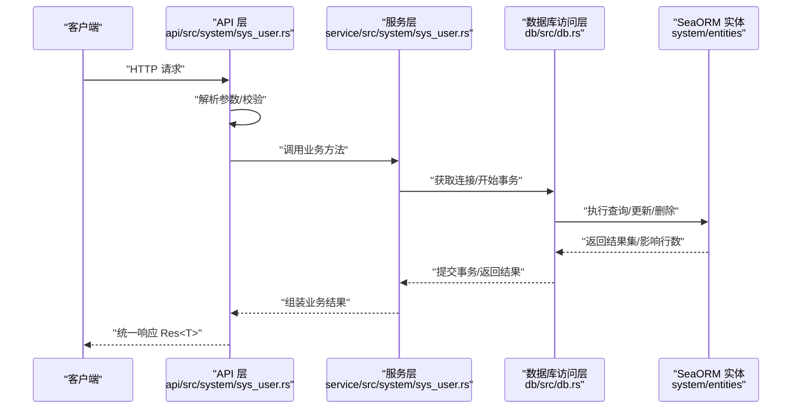

**图表来源**
- [api/src/system/sys_user.rs](file://api/src/system/sys_user.rs#L24-L31)
- [service/src/system/sys_user.rs](file://service/src/system/sys_user.rs#L28-L144)
- [db/src/db.rs](file://db/src/db.rs#L9-L19)
- [db/src/system/entities/mod.rs](file://db/src/system/entities/mod.rs#L1-L24)

## 详细组件分析

### 数据库连接与连接池
- 初始化流程
  - 通过异步函数创建连接选项，设置连接字符串、最大/最小连接数、连接与空闲超时
  - 使用 OnceCell 缓存 DatabaseConnection，避免重复连接
- 连接字符串来源
  - 从配置模块加载数据库链接字符串，确保运行时可配置
- 日志与可观测性
  - 连接成功后记录日志，便于运维监控

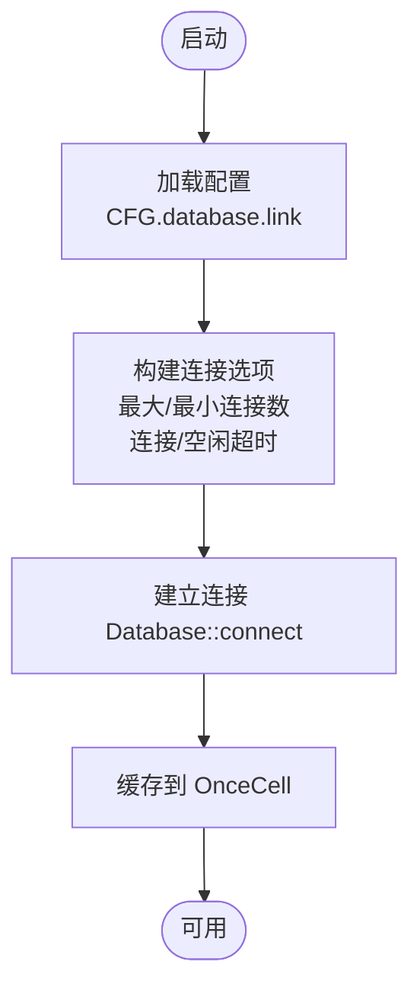

**图表来源**
- [db/src/db.rs](file://db/src/db.rs#L9-L19)
- [configs/src/lib.rs](file://configs/src/lib.rs#L5-L6)

**章节来源**
- [db/src/db.rs](file://db/src/db.rs#L1-L20)
- [configs/src/lib.rs](file://configs/src/lib.rs#L1-L6)

### 事务处理与批量操作
- 事务边界
  - 在需要一致性的业务场景中显式 begin 事务，执行多个相关操作后再 commit
  - 对于批量删除、多对多关系维护（如用户角色、部门、岗位），在单个事务内完成，确保原子性
- 批量操作优化
  - 使用 SeaORM 的 update_many/delete_many/insert_many 等接口减少往返次数
  - 合理拆分大事务，避免长时间持有锁导致阻塞
- 错误传播
  - 任一步骤失败即回滚事务，上抛错误给调用方，由 API 层转换为统一响应

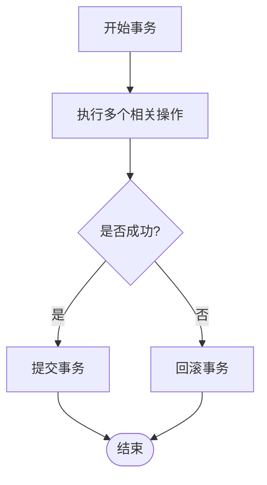

**图表来源**
- [service/src/system/sys_user.rs](file://service/src/system/sys_user.rs#L300-L318)
- [service/src/system/sys_user.rs](file://service/src/system/sys_user.rs#L445-L466)

**章节来源**
- [service/src/system/sys_user.rs](file://service/src/system/sys_user.rs#L276-L318)
- [service/src/system/sys_user.rs](file://service/src/system/sys_user.rs#L445-L466)

### 查询构建器与分页
- 查询构建器
  - 使用 SeaORM 的链式查询 API，支持 join、过滤、排序、聚合与分页
  - 示例：用户列表查询通过左连接部门表、动态拼接 where 条件、分页获取
- 分页参数
  - PageParams 支持 page_num/page_size，服务层计算 total_pages 并返回 ListData
- 条件过滤
  - 支持按用户 ID/IDs、姓名、手机号、状态、部门、时间范围等条件过滤

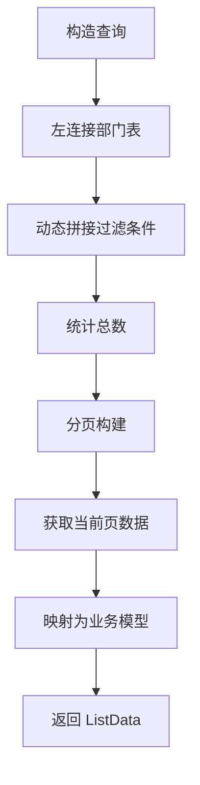

**图表来源**
- [service/src/system/sys_user.rs](file://service/src/system/sys_user.rs#L28-L144)

**章节来源**
- [service/src/system/sys_user.rs](file://service/src/system/sys_user.rs#L28-L144)

### 统一响应（Res）设计理念
- 结构化输出
  - Res<T> 包含 code、data、msg，满足前端统一处理
- IntoResponse 实现
  - 自动序列化为 JSON；序列化失败时返回 500 响应
  - 将原始 JSON 字符串注入响应扩展，便于中间件记录
- 工具方法
  - 提供 with_data/with_err/with_msg 等便捷方法，简化业务层返回

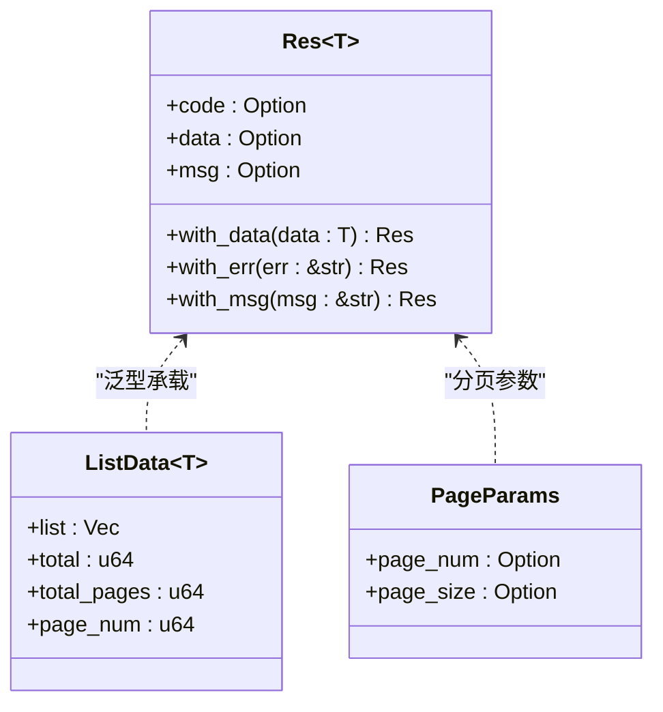

**图表来源**
- [db/src/common/res.rs](file://db/src/common/res.rs#L10-L95)

**章节来源**
- [db/src/common/res.rs](file://db/src/common/res.rs#L1-L95)

### 数据库上下文（Ctx）与客户端信息（Client）
- 请求上下文（ReqCtx）
  - 记录原始 URI、路径、路径参数、HTTP 方法与请求数据
- 用户上下文（UserInfoCtx）
  - 记录用户标识、令牌标识与用户名称
- 响应信息（ResInfo）
  - 记录耗时、状态、数据与错误信息
- API 信息（ApiInfo）
  - 记录 API 名称、缓存方法、日志方法与关联 API 列表
- 客户端信息（ClientNetInfo/UserAgentInfo/ClientInfo）
  - 记录 IP、位置、网络环境与浏览器、操作系统、设备信息

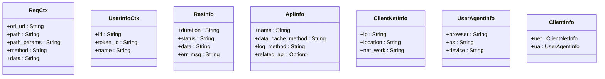

**图表来源**
- [db/src/common/ctx.rs](file://db/src/common/ctx.rs#L1-L33)
- [db/src/common/client.rs](file://db/src/common/client.rs#L1-L22)

**章节来源**
- [db/src/common/ctx.rs](file://db/src/common/ctx.rs#L1-L33)
- [db/src/common/client.rs](file://db/src/common/client.rs#L1-L22)

### API 层与服务层交互
- API 层职责
  - 解析请求参数、校验、调用服务层方法、将结果包装为 Res<T>
- 服务层职责
  - 使用 SeaORM 执行查询、事务与批量操作，处理业务规则与数据映射
- 事务与并发
  - 对于复杂业务，服务层内部开启事务；对于独立查询，直接使用连接执行

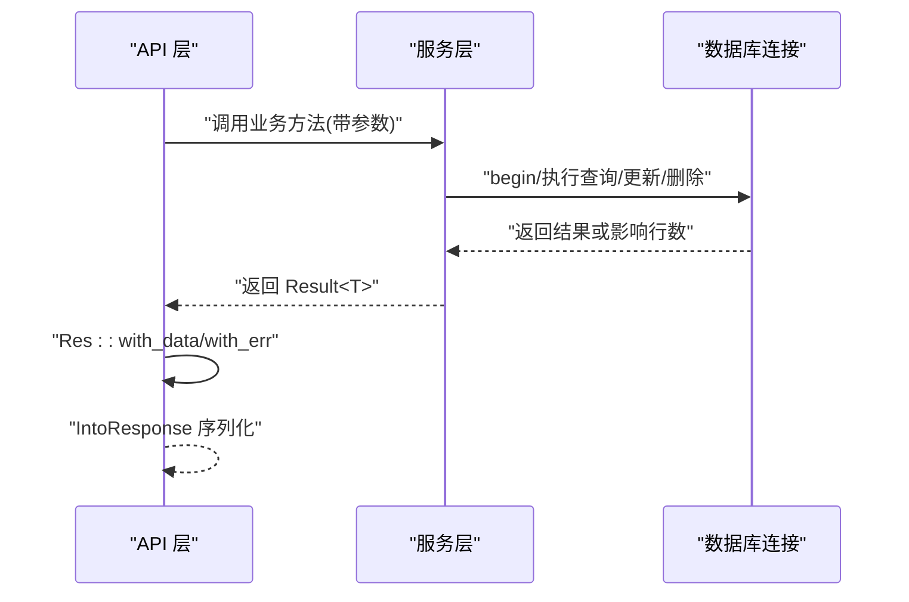

**图表来源**
- [api/src/system/sys_user.rs](file://api/src/system/sys_user.rs#L24-L31)
- [service/src/system/sys_user.rs](file://service/src/system/sys_user.rs#L28-L144)

**章节来源**
- [api/src/system/sys_user.rs](file://api/src/system/sys_user.rs#L1-L206)
- [service/src/system/sys_user.rs](file://service/src/system/sys_user.rs#L1-L649)

### 实体与模型
- 实体（Entities）
  - 自动生成的 SeaORM 实体，对应数据库表结构
- 模型（Models）
  - 业务侧模型，用于 API 响应与请求参数
- 预导入（Prelude）
  - 导出常用实体模型，便于 OpenAPI 等工具使用

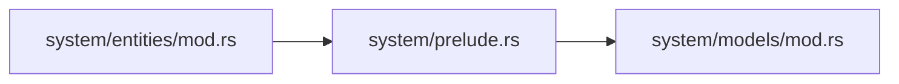

**图表来源**
- [db/src/system/entities/mod.rs](file://db/src/system/entities/mod.rs#L1-L24)
- [db/src/system/prelude.rs](file://db/src/system/prelude.rs#L1-L9)
- [db/src/system/models/mod.rs](file://db/src/system/models/mod.rs#L1-L23)

**章节来源**
- [db/src/system/entities/mod.rs](file://db/src/system/entities/mod.rs#L1-L24)
- [db/src/system/prelude.rs](file://db/src/system/prelude.rs#L1-L9)
- [db/src/system/models/mod.rs](file://db/src/system/models/mod.rs#L1-L23)

### 迁移与初始化
- 迁移器
  - 定义迁移集合，支持按顺序执行
- 表结构与索引
  - 提供创建/删除表、创建索引的工具函数
- 初始化数据
  - 读取 SQL 文件，按数据库后端适配语法，批量执行 INSERT

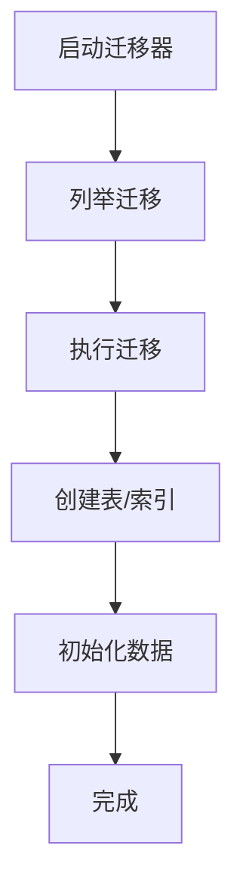

**图表来源**
- [migration/src/lib.rs](file://migration/src/lib.rs#L8-L16)
- [migration/src/db_utils.rs](file://migration/src/db_utils.rs#L17-L76)
- [migration/src/db_utils.rs](file://migration/src/db_utils.rs#L79-L120)

**章节来源**
- [migration/src/lib.rs](file://migration/src/lib.rs#L1-L17)
- [migration/src/db_utils.rs](file://migration/src/db_utils.rs#L1-L158)

## 依赖分析
- 工作区依赖
  - 使用 SeaORM 1.x，启用 runtime-tokio-rustls、with-chrono 等特性
  - 配合 tokio、serde、anyhow、chrono 等生态库
- 模块间耦合
  - API 层依赖服务层与 db 模块
  - 服务层依赖 db 模块提供的连接与实体
  - db 模块依赖配置模块与 SeaORM
  - 迁移模块独立于运行时，仅在初始化阶段使用

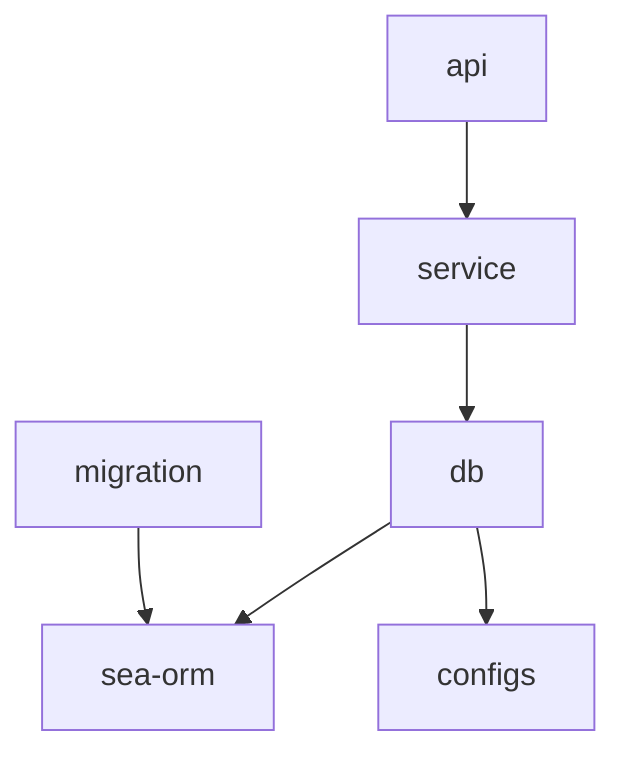

**图表来源**
- [Cargo.toml](file://Cargo.toml#L74-L80)
- [api/src/system/sys_user.rs](file://api/src/system/sys_user.rs#L1-L18)
- [service/src/system/sys_user.rs](file://service/src/system/sys_user.rs#L1-L25)
- [db/src/lib.rs](file://db/src/lib.rs#L1-L8)

**章节来源**
- [Cargo.toml](file://Cargo.toml#L1-L90)
- [api/src/system/sys_user.rs](file://api/src/system/sys_user.rs#L1-L18)
- [service/src/system/sys_user.rs](file://service/src/system/sys_user.rs#L1-L25)
- [db/src/lib.rs](file://db/src/lib.rs#L1-L8)

## 性能考虑
- 连接池配置
  - 合理设置 max/min connections，结合负载峰值与数据库能力调整
  - 调整 connect_timeout 与 idle_timeout，平衡资源占用与延迟
- 查询优化
  - 为高频查询字段建立索引（唯一/普通/全文）
  - 使用 select_also/left_join 时注意只选择必要列，避免 N+1
  - 分页查询使用 count 与 paginate，避免一次性加载全量数据
- 事务与锁
  - 将相关写操作放入单个事务，减少锁竞争
  - 控制事务粒度，避免长事务占用资源
- 批量操作
  - 使用 update_many/delete_many/insert_many 减少往返
  - 对大批次数据分批处理，避免内存峰值过高
- 缓存策略
  - 对热点只读数据引入缓存（如 Redis），降低数据库压力
  - 对变更频繁的数据采用短 TTL 或失效策略
- 多数据库支持
  - 通过配置模块切换连接字符串，实现多数据库支持
  - 迁移工具支持多种后端语法适配

[本节为通用指导，无需列出具体文件来源]

## 故障排查指南
- 连接失败
  - 检查连接字符串与数据库可达性
  - 关注连接超时与空闲超时设置
- 事务异常
  - 确认事务边界是否覆盖所有相关操作
  - 发生错误时及时回滚，避免脏数据
- 响应异常
  - 若序列化失败，查看统一响应的错误分支
  - 中间件可通过扩展字段获取原始 JSON 字符串进行定位
- 迁移问题
  - 确认迁移文件存在且语法正确
  - 初始化数据时注意数据库后端差异（如 MySQL 反引号与 Postgres 双引号）

**章节来源**
- [db/src/db.rs](file://db/src/db.rs#L9-L19)
- [db/src/common/res.rs](file://db/src/common/res.rs#L47-L61)
- [migration/src/db_utils.rs](file://migration/src/db_utils.rs#L122-L157)

## 结论
Axum Admin 的数据访问层以 SeaORM 为基础，结合 OnceCell 连接管理、事务化操作与统一响应设计，实现了清晰的分层与良好的可维护性。通过合理的连接池配置、查询优化与缓存策略，可在高并发场景下保持稳定与高性能。迁移工具与配置模块进一步增强了部署灵活性与可扩展性。

[本节为总结，无需列出具体文件来源]

## 附录
- 使用指南
  - 在 API 层通过 DB.get_or_init(db_conn) 获取连接
  - 在服务层使用 SeaORM 实体执行查询与更新
  - 返回结果统一使用 Res<T> 包装
- 扩展方法
  - 新增实体：在 system/entities 下生成实体并在 models 中定义业务模型
  - 新增 API：在 api 模块新增路由与处理器，调用服务层方法
  - 新增迁移：在 migration 模块新增迁移文件并执行

[本节为概览，无需列出具体文件来源]