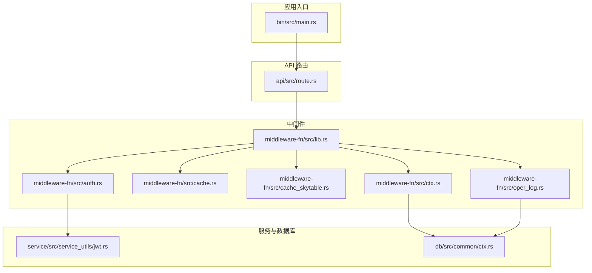
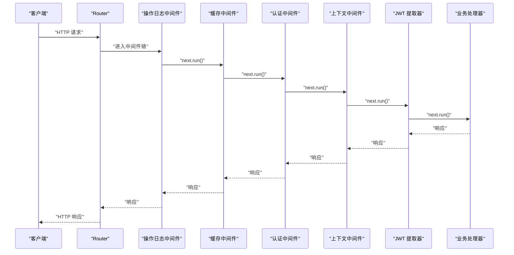
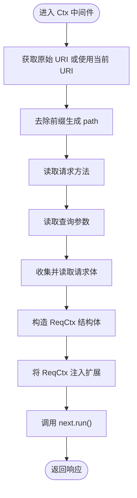
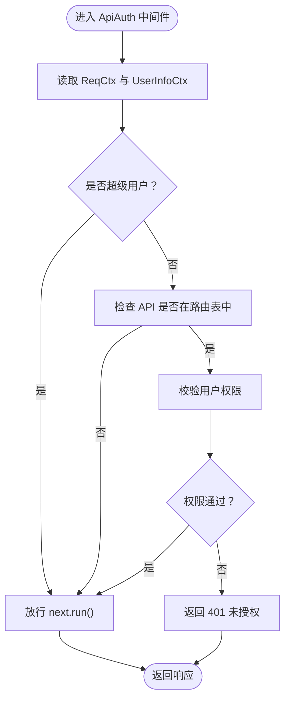
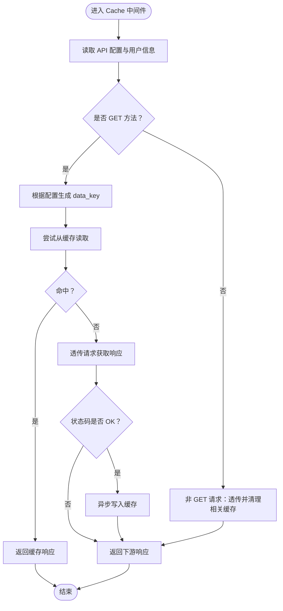
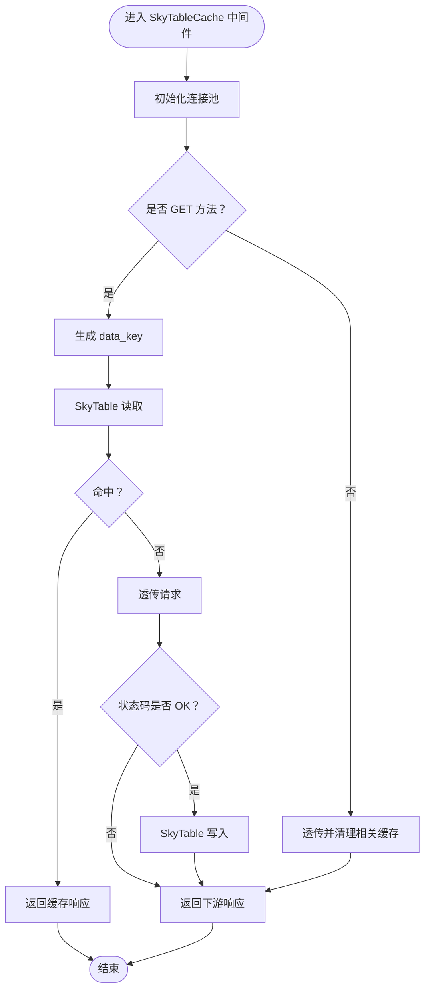
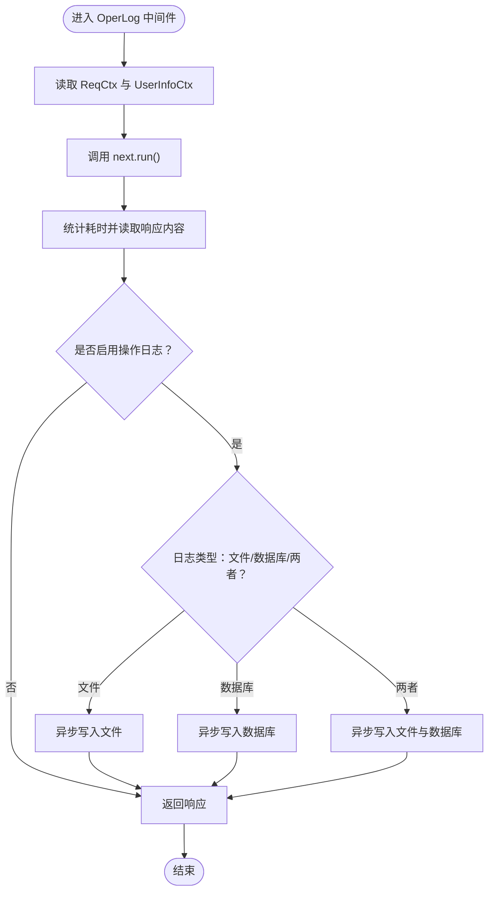
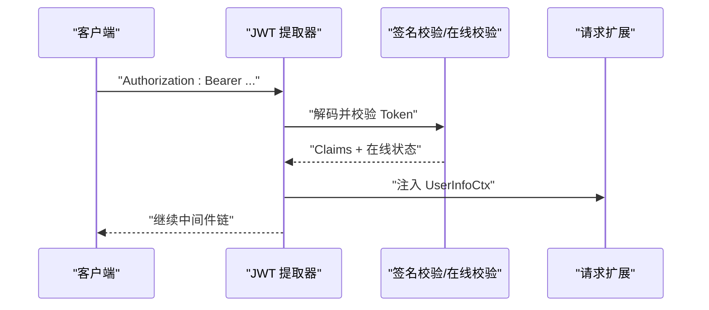
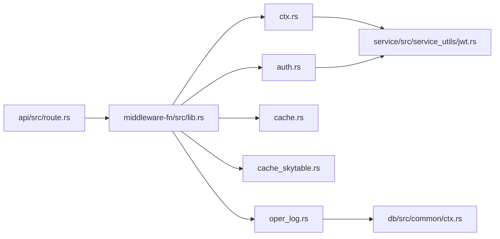

# 中间件系统架构

<cite>
**本文档引用的文件**
- [lib.rs](file://middleware-fn/src/lib.rs)
- [auth.rs](file://middleware-fn/src/auth.rs)
- [cache.rs](file://middleware-fn/src/cache.rs)
- [cache_skytable.rs](file://middleware-fn/src/cache_skytable.rs)
- [ctx.rs](file://middleware-fn/src/ctx.rs)
- [oper_log.rs](file://middleware-fn/src/oper_log.rs)
- [route.rs](file://api/src/route.rs)
- [jwt.rs](file://service/src/service_utils/jwt.rs)
- [ctx.rs](file://db/src/common/ctx.rs)
- [Cargo.toml（中间件）](file://middleware-fn/Cargo.toml)
- [Cargo.toml（工作区）](file://Cargo.toml)
- [main.rs](file://bin/src/main.rs)
</cite>

## 目录
1. [简介](#简介)
2. [项目结构](#项目结构)
3. [核心组件](#核心组件)
4. [架构总览](#架构总览)
5. [详细组件分析](#详细组件分析)
6. [依赖关系分析](#依赖关系分析)
7. [性能考量](#性能考量)
8. [故障排查指南](#故障排查指南)
9. [结论](#结论)
10. [附录](#附录)

## 简介
本文件系统性阐述 Axum Admin 的中间件体系，重点覆盖以下方面：
- 中间件设计模式与执行顺序
- 认证中间件、缓存中间件、操作日志中间件等核心组件
- 中间件注册机制、执行链路、上下文传递
- 配置项、性能影响、错误处理策略
- 扩展与自定义中间件开发、中间件组合模式
- 请求生命周期中的作用、最佳实践与常见问题

## 项目结构
中间件位于独立 crate middleware-fn，并通过 re-export 对外暴露统一名称；业务路由在 api crate 中按模块挂载并按需叠加中间件层。

图表来源
- [main.rs](file://bin/src/main.rs#L73-L95)
- [route.rs](file://api/src/route.rs#L12-L68)
- [lib.rs](file://middleware-fn/src/lib.rs#L1-L23)
- [auth.rs](file://middleware-fn/src/auth.rs#L1-L25)
- [cache.rs](file://middleware-fn/src/cache.rs#L1-L196)
- [cache_skytable.rs](file://middleware-fn/src/cache_skytable.rs#L1-L136)
- [ctx.rs](file://middleware-fn/src/ctx.rs#L1-L74)
- [oper_log.rs](file://middleware-fn/src/oper_log.rs#L1-L158)
- [jwt.rs](file://service/src/service_utils/jwt.rs#L54-L94)
- [ctx.rs](file://db/src/common/ctx.rs#L1-L33)

章节来源
- [route.rs](file://api/src/route.rs#L12-L68)
- [lib.rs](file://middleware-fn/src/lib.rs#L1-L23)
- [Cargo.toml（中间件）](file://middleware-fn/Cargo.toml#L1-L39)
- [Cargo.toml（工作区）](file://Cargo.toml#L1-L90)

## 核心组件
- 上下文注入中间件（Ctx）：解析原始 URI、方法、查询参数与请求体，构建 ReqCtx 并注入到请求扩展；同时从 JWT 提取器注入 UserInfoCtx。
- 认证中间件（ApiAuth）：基于 ReqCtx 与 UserInfoCtx 判断是否为超级用户或需要校验 API 权限；若未通过则返回未授权状态码。
- 缓存中间件（Cache/SkyTableCache）：根据 API 配置决定是否启用缓存；GET 请求命中缓存直接返回，未命中则透传请求并在成功响应后异步写入缓存；变更请求触发相关缓存清理。
- 操作日志中间件（OperLog）：在请求完成后统计耗时、读取响应内容，按配置选择落库或落文件或两者；支持并发异步写入。

章节来源
- [ctx.rs](file://middleware-fn/src/ctx.rs#L12-L74)
- [auth.rs](file://middleware-fn/src/auth.rs#L6-L24)
- [cache.rs](file://middleware-fn/src/cache.rs#L125-L193)
- [cache_skytable.rs](file://middleware-fn/src/cache_skytable.rs#L117-L136)
- [oper_log.rs](file://middleware-fn/src/oper_log.rs#L21-L103)

## 架构总览
中间件以“洋葱模型”串联，执行顺序从外到内依次为：操作日志 → 缓存 → 认证 → 上下文注入 → JWT 提取器 → 具体处理器。不同模块可按配置选择是否启用缓存与操作日志。

图表来源
- [route.rs](file://api/src/route.rs#L32-L68)
- [oper_log.rs](file://middleware-fn/src/oper_log.rs#L21-L42)
- [cache.rs](file://middleware-fn/src/cache.rs#L125-L193)
- [auth.rs](file://middleware-fn/src/auth.rs#L6-L24)
- [ctx.rs](file://middleware-fn/src/ctx.rs#L13-L51)
- [jwt.rs](file://service/src/service_utils/jwt.rs#L54-L94)

## 详细组件分析

### 上下文注入中间件（Ctx）
职责
- 解析原始 URI、方法、查询参数
- 读取并编码请求体为字符串，避免后续提取器无法读取
- 构造 ReqCtx 并注入扩展
- 保持请求体可再次被下游提取器消费

执行流程

图表来源
- [ctx.rs](file://middleware-fn/src/ctx.rs#L13-L51)

章节来源
- [ctx.rs](file://middleware-fn/src/ctx.rs#L12-L74)
- [ctx.rs](file://db/src/common/ctx.rs#L1-L33)

### 认证中间件（ApiAuth）
职责
- 从扩展中读取 ReqCtx 与 UserInfoCtx
- 若为超级用户则放行
- 若 API 在路由表中且需要鉴权，则校验用户对路径与方法的权限
- 未通过则返回未授权状态码

执行流程

图表来源
- [auth.rs](file://middleware-fn/src/auth.rs#L6-L24)

章节来源
- [auth.rs](file://middleware-fn/src/auth.rs#L6-L24)
- [jwt.rs](file://service/src/service_utils/jwt.rs#L54-L94)

### 缓存中间件（Cache）
职责
- 依据 API 配置决定是否启用缓存
- GET 请求优先查缓存，命中则直接返回；未命中则透传请求并在成功时异步写入
- 非 GET 请求在成功后异步清理相关缓存键

执行流程

图表来源
- [cache.rs](file://middleware-fn/src/cache.rs#L125-L193)

章节来源
- [cache.rs](file://middleware-fn/src/cache.rs#L125-L193)

### SkyTable 缓存中间件（SkyTableCache）
职责
- 与内存缓存类似，但使用 SkyTable 作为后端
- 初始化连接池并在首次连接时清空数据库
- 提供索引映射与过期清理机制

执行流程（概览）

图表来源
- [cache_skytable.rs](file://middleware-fn/src/cache_skytable.rs#L117-L136)

章节来源
- [cache_skytable.rs](file://middleware-fn/src/cache_skytable.rs#L1-L136)

### 操作日志中间件（OperLog）
职责
- 在请求完成后统计耗时、读取响应内容
- 根据 API 配置选择落库、落文件或两者
- 异步写入，避免阻塞主请求链路

执行流程

图表来源
- [oper_log.rs](file://middleware-fn/src/oper_log.rs#L21-L103)

章节来源
- [oper_log.rs](file://middleware-fn/src/oper_log.rs#L21-L158)

### JWT 提取器（Claims）
职责
- 从 Authorization 头部解析 Bearer Token
- 验证签名与在线状态，注入 UserInfoCtx 到扩展
- 为认证中间件提供用户上下文

执行流程

图表来源
- [jwt.rs](file://service/src/service_utils/jwt.rs#L54-L94)

章节来源
- [jwt.rs](file://service/src/service_utils/jwt.rs#L54-L121)

## 依赖关系分析
- 中间件依赖
  - middleware-fn 依赖 app-service、configs、db、axum、tokio、tracing、sea-orm 等
  - 特性开关 cache-mem 与 cache-skytable 控制不同缓存实现
- 路由与中间件装配
  - api/src/route.rs 按配置动态叠加中间件层，支持按模块启用/禁用缓存与操作日志
- 执行链路耦合
  - Ctx 与 JWT 提取器必须在认证之前运行，以便认证中间件能读取 ReqCtx 与 UserInfoCtx
  - 缓存中间件依赖 API 配置与用户上下文，变更请求需清理相关缓存

图表来源
- [route.rs](file://api/src/route.rs#L32-L68)
- [lib.rs](file://middleware-fn/src/lib.rs#L1-L23)
- [ctx.rs](file://middleware-fn/src/ctx.rs#L1-L74)
- [auth.rs](file://middleware-fn/src/auth.rs#L1-L25)
- [cache.rs](file://middleware-fn/src/cache.rs#L1-L196)
- [cache_skytable.rs](file://middleware-fn/src/cache_skytable.rs#L1-L136)
- [oper_log.rs](file://middleware-fn/src/oper_log.rs#L1-L158)
- [jwt.rs](file://service/src/service_utils/jwt.rs#L54-L94)
- [ctx.rs](file://db/src/common/ctx.rs#L1-L33)

章节来源
- [Cargo.toml（中间件）](file://middleware-fn/Cargo.toml#L9-L26)
- [Cargo.toml（工作区）](file://Cargo.toml#L24-L62)
- [route.rs](file://api/src/route.rs#L32-L68)

## 性能考量
- 中间件顺序
  - 操作日志与缓存均会引入额外 IO，建议仅在需要时启用；GET 请求的缓存命中可显著降低延迟
- 缓存策略
  - 内存缓存适合低延迟场景；SkyTable 缓存适合分布式部署与持久化需求
  - 变更请求的异步清理可减少一致性风险，但需注意清理粒度与性能开销
- 日志
  - 文件与数据库写入均为异步，避免阻塞主链路；可根据流量调整日志级别
- 请求体读取
  - Ctx 中间件会完整读取请求体并重建，避免下游提取器失效；大体积请求体可能增加内存占用

[本节为通用性能讨论，不直接分析具体文件]

## 故障排查指南
- 401 未授权
  - 检查 JWT 是否有效、是否在线；确认认证中间件是否正确注入 ReqCtx 与 UserInfoCtx
  - 确认 API 是否在路由表中且需要鉴权
- 缓存未生效
  - 检查 API 配置中的 data_cache_method 与 log_method
  - 确认请求方法是否为 GET；变更请求是否正确清理相关缓存键
- 操作日志缺失
  - 检查配置项是否启用操作日志；确认 API 配置的日志策略
  - 观察异步写入是否报错（日志中会记录失败信息）
- 请求体为空
  - 确认 Ctx 中间件已正确读取并重建请求体；避免下游重复消费

章节来源
- [auth.rs](file://middleware-fn/src/auth.rs#L6-L24)
- [ctx.rs](file://middleware-fn/src/ctx.rs#L27-L30)
- [oper_log.rs](file://middleware-fn/src/oper_log.rs#L48-L51)
- [cache.rs](file://middleware-fn/src/cache.rs#L164-L191)

## 结论
Axum Admin 的中间件体系采用清晰的洋葱模型，围绕上下文、认证、缓存与日志四大能力构建。通过配置驱动的中间件装配，可在不同模块灵活启用/禁用特定能力。实践中建议：
- 严格控制中间件顺序，确保上下文与认证前置
- 按模块精细化启用缓存与日志
- 关注大请求体与高并发下的内存与 IO 压力
- 通过异步写入与过期清理保障性能与一致性

[本节为总结性内容，不直接分析具体文件]

## 附录

### 中间件注册与组合模式
- 模块级注册：在 api/src/route.rs 中按模块叠加中间件层，支持条件启用
- 路由级注册：针对测试模块使用 route_layer 动态叠加认证中间件
- 组合模式：先日志、再缓存、后认证、最后上下文与 JWT 提取器

章节来源
- [route.rs](file://api/src/route.rs#L32-L68)

### 配置项与特性开关
- 中间件特性
  - cache-mem：启用内存缓存中间件
  - cache-skytable：启用 SkyTable 缓存中间件
- 路由配置
  - cache_time：缓存时间（秒），为 0 表示禁用缓存
  - cache_method：缓存方式（0=内存，其他=SkyTable）
  - enable_oper_log：是否启用操作日志
  - api_prefix：API 前缀，用于路径标准化

章节来源
- [Cargo.toml（中间件）](file://middleware-fn/Cargo.toml#L27-L39)
- [route.rs](file://api/src/route.rs#L32-L68)
- [ctx.rs](file://middleware-fn/src/ctx.rs#L21)