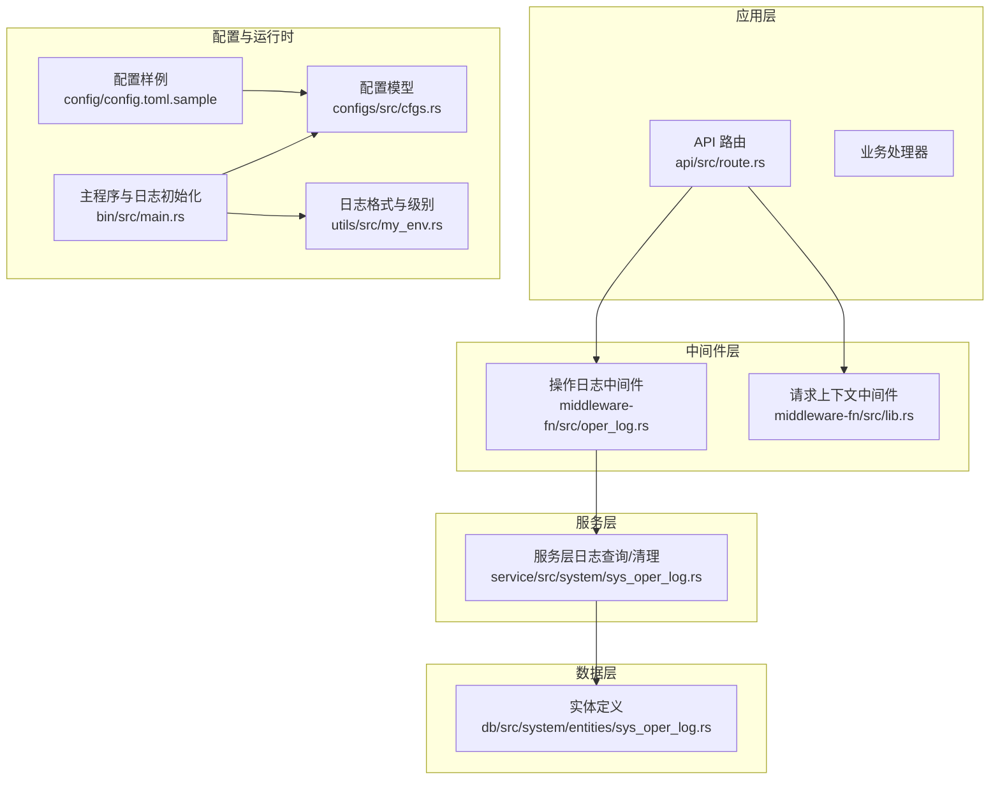
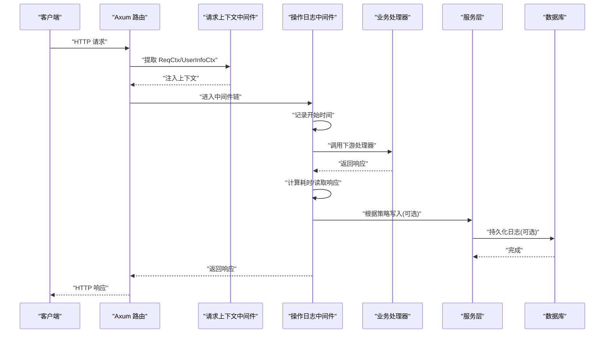
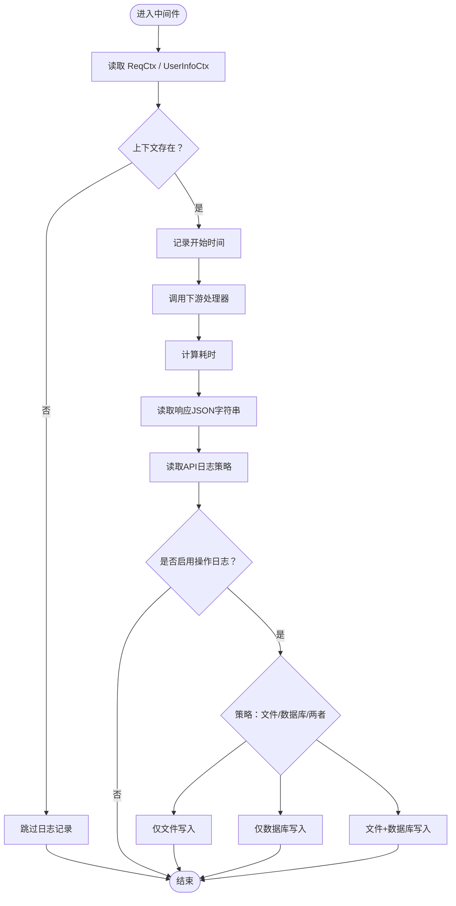
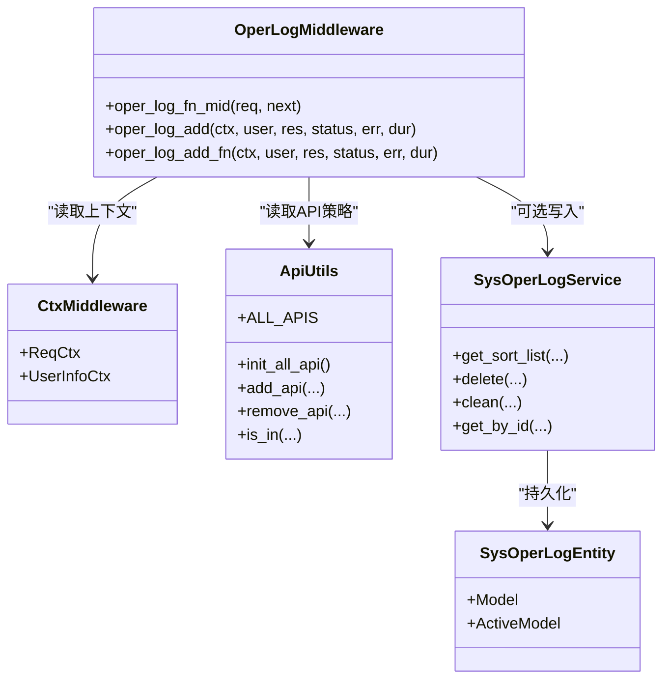
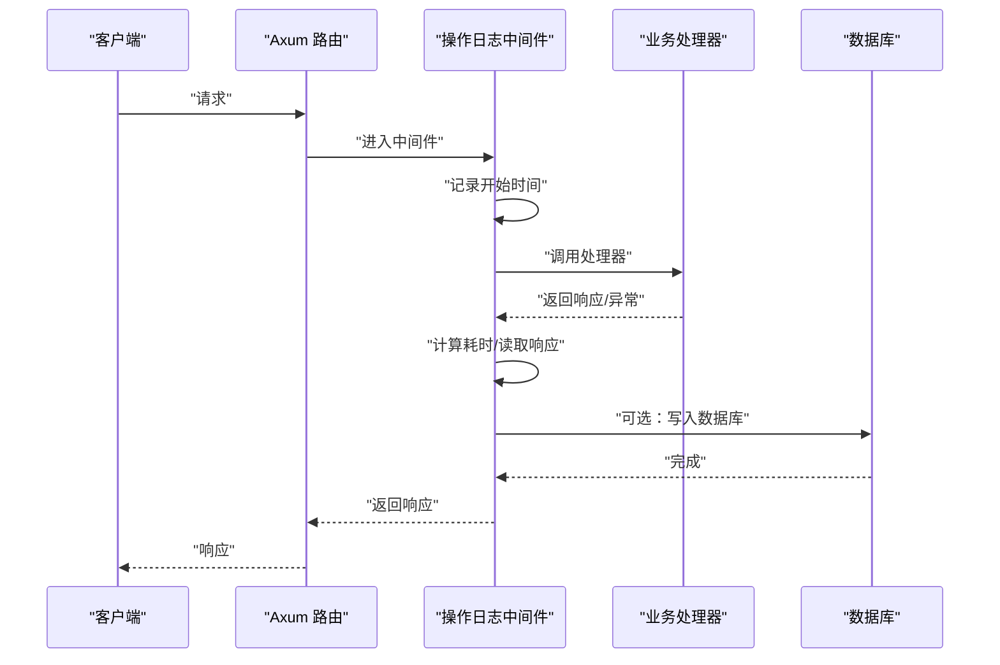

# 操作日志中间件

<cite>
**本文引用的文件**
- [oper_log.rs](file://middleware-fn/src/oper_log.rs)
- [lib.rs](file://middleware-fn/src/lib.rs)
- [route.rs](file://api/src/route.rs)
- [ctx.rs](file://db/src/common/ctx.rs)
- [api_utils.rs](file://service/src/service_utils/api_utils.rs)
- [cfgs.rs](file://configs/src/cfgs.rs)
- [config.toml.sample](file://config/config.toml.sample)
- [main.rs](file://bin/src/main.rs)
- [my_env.rs](file://utils/src/my_env.rs)
- [sys_oper_log.rs（API）](file://api/src/system/sys_oper_log.rs)
- [sys_oper_log.rs（服务层）](file://service/src/system/sys_oper_log.rs)
- [sys_oper_log.rs（实体）](file://db/src/system/entities/sys_oper_log.rs)
</cite>

## 目录
1. [简介](#简介)
2. [项目结构](#项目结构)
3. [核心组件](#核心组件)
4. [架构总览](#架构总览)
5. [组件详解](#组件详解)
6. [依赖关系分析](#依赖关系分析)
7. [性能考量](#性能考量)
8. [故障排查指南](#故障排查指南)
9. [结论](#结论)
10. [附录](#附录)

## 简介
本文件面向“操作日志中间件”，系统化阐述其采集与记录机制、日志格式设计、日志级别控制、请求/响应/异常/耗时的捕获方式、配置项与敏感信息处理、存储策略、性能影响与优化、与数据库的交互、异步写入与日志轮转、以及监控与合规建议。文档以代码为依据，配合图示帮助读者快速理解与落地。

## 项目结构
围绕操作日志中间件的关键文件分布如下：
- 中间件实现：middleware-fn/src/oper_log.rs
- 中间件导出：middleware-fn/src/lib.rs
- 路由挂载：api/src/route.rs
- 请求上下文与API元数据：db/src/common/ctx.rs、service/src/service_utils/api_utils.rs
- 配置模型与样例：configs/src/cfgs.rs、config/config.toml.sample
- 主程序日志初始化与轮转：bin/src/main.rs、utils/src/my_env.rs
- 日志查询与清理接口：api/src/system/sys_oper_log.rs、service/src/system/sys_oper_log.rs、db/src/system/entities/sys_oper_log.rs

图表来源
- [route.rs](file://api/src/route.rs#L32-L68)
- [oper_log.rs](file://middleware-fn/src/oper_log.rs#L21-L42)
- [lib.rs](file://middleware-fn/src/lib.rs#L16-L22)
- [cfgs.rs](file://configs/src/cfgs.rs#L83-L94)
- [config.toml.sample](file://config/config.toml.sample#L31-L37)
- [main.rs](file://bin/src/main.rs#L25-L51)
- [my_env.rs](file://utils/src/my_env.rs#L38-L71)
- [sys_oper_log.rs（服务层）](file://service/src/system/sys_oper_log.rs#L15-L70)
- [sys_oper_log.rs（实体）](file://db/src/system/entities/sys_oper_log.rs#L15-L36)

章节来源
- [route.rs](file://api/src/route.rs#L12-L68)
- [oper_log.rs](file://middleware-fn/src/oper_log.rs#L21-L42)
- [lib.rs](file://middleware-fn/src/lib.rs#L16-L22)
- [cfgs.rs](file://configs/src/cfgs.rs#L83-L94)
- [config.toml.sample](file://config/config.toml.sample#L31-L37)
- [main.rs](file://bin/src/main.rs#L25-L51)
- [my_env.rs](file://utils/src/my_env.rs#L38-L71)
- [sys_oper_log.rs（服务层）](file://service/src/system/sys_oper_log.rs#L15-L70)
- [sys_oper_log.rs（实体）](file://db/src/system/entities/sys_oper_log.rs#L15-L36)

## 核心组件
- 操作日志中间件：负责在请求进入后记录请求上下文、在响应后计算耗时、读取响应结果、根据API配置决定落库或落文件，并进行异步写入。
- 请求上下文中间件：提供 ReqCtx、UserInfoCtx 等上下文，供日志中间件读取请求路径、方法、参数、用户信息等。
- API 元数据与动态配置：通过系统菜单表加载 API 名称与日志策略，支持运行时更新。
- 配置与日志初始化：从配置文件读取日志开关、级别、输出目录与文件名；主程序使用 tracing 初始化控制台与文件输出，并采用按小时滚动的文件轮转。
- 日志查询与清理：提供分页查询、按条件筛选、删除与清空接口，便于运维与审计。

章节来源
- [oper_log.rs](file://middleware-fn/src/oper_log.rs#L21-L42)
- [ctx.rs](file://db/src/common/ctx.rs#L1-L33)
- [api_utils.rs](file://service/src/service_utils/api_utils.rs#L16-L48)
- [cfgs.rs](file://configs/src/cfgs.rs#L83-L94)
- [config.toml.sample](file://config/config.toml.sample#L31-L37)
- [main.rs](file://bin/src/main.rs#L25-L51)
- [sys_oper_log.rs（API）](file://api/src/system/sys_oper_log.rs#L16-L44)

## 架构总览
操作日志中间件在请求生命周期中插入，先读取上下文，再交由下游处理器执行，最后在响应阶段计算耗时并写入日志。写入策略由 API 的日志策略字段决定，可选择仅文件、仅数据库、或两者皆有。

图表来源
- [route.rs](file://api/src/route.rs#L32-L68)
- [oper_log.rs](file://middleware-fn/src/oper_log.rs#L21-L42)
- [ctx.rs](file://db/src/common/ctx.rs#L1-L33)
- [sys_oper_log.rs（服务层）](file://service/src/system/sys_oper_log.rs#L15-L70)
- [sys_oper_log.rs（实体）](file://db/src/system/entities/sys_oper_log.rs#L15-L36)

## 组件详解

### 中间件工作流与数据采集
- 请求阶段：从请求扩展中读取 ReqCtx 与 UserInfoCtx，若缺失则跳过日志记录。
- 处理阶段：记录开始时间，调用下游处理器。
- 响应阶段：计算耗时，读取响应扩展中的 JSON 字符串，调用日志写入函数。
- 写入策略：根据 API 的日志策略字段决定落库、落文件或两者皆有；若未启用操作日志开关，则直接返回。

图表来源
- [oper_log.rs](file://middleware-fn/src/oper_log.rs#L21-L42)
- [oper_log.rs](file://middleware-fn/src/oper_log.rs#L56-L103)
- [ctx.rs](file://db/src/common/ctx.rs#L1-L33)

章节来源
- [oper_log.rs](file://middleware-fn/src/oper_log.rs#L21-L42)
- [oper_log.rs](file://middleware-fn/src/oper_log.rs#L56-L103)

### 日志格式设计
- 文件日志：使用 tracing 输出，包含请求路径、完成时间、耗时（微秒/毫秒）、请求数据、响应数据、错误信息等字段，便于快速定位问题。
- 数据库日志：将请求/响应关键字段持久化到 sys_oper_log 表，字段覆盖标题、方法、请求方法、操作类型、操作人、部门、URL、IP、位置、参数、路径参数、结果、状态、错误、耗时、时间戳等。

章节来源
- [oper_log.rs](file://middleware-fn/src/oper_log.rs#L146-L157)
- [sys_oper_log.rs（实体）](file://db/src/system/entities/sys_oper_log.rs#L15-L36)

### 日志级别控制与初始化
- 日志级别：从配置读取，支持 TRACE、DEBUG、INFO、WARN、ERROR；默认 INFO。
- 初始化：主程序启动时根据配置设置 RUST_LOG 环境变量，构建控制台与文件输出层，使用非阻塞 writer，并按小时滚动文件。

章节来源
- [cfgs.rs](file://configs/src/cfgs.rs#L83-L94)
- [config.toml.sample](file://config/config.toml.sample#L36-L37)
- [main.rs](file://bin/src/main.rs#L25-L51)
- [my_env.rs](file://utils/src/my_env.rs#L38-L71)

### API 动态配置与策略
- API 元数据：从系统菜单表加载 API 的名称、日志策略、缓存策略等，维护在内存映射中，支持初始化与重载。
- 策略字段：日志策略（0/1/2/3）分别表示“不记录/仅文件/仅数据库/文件+数据库”。

章节来源
- [api_utils.rs](file://service/src/service_utils/api_utils.rs#L16-L48)
- [api_utils.rs](file://service/src/service_utils/api_utils.rs#L50-L88)
- [oper_log.rs](file://middleware-fn/src/oper_log.rs#L60-L64)
- [oper_log.rs](file://middleware-fn/src/oper_log.rs#L72-L100)

### 与数据库的交互
- 插入逻辑：根据请求方法映射操作类型，构造 ActiveModel 并插入；对超长参数与响应进行截断保护。
- 查询/清理：提供分页查询、按条件筛选、删除指定日志、清空日志等接口，便于审计与维护。

章节来源
- [oper_log.rs](file://middleware-fn/src/oper_log.rs#L105-L144)
- [sys_oper_log.rs（服务层）](file://service/src/system/sys_oper_log.rs#L15-L70)
- [sys_oper_log.rs（服务层）](file://service/src/system/sys_oper_log.rs#L73-L94)
- [sys_oper_log.rs（API）](file://api/src/system/sys_oper_log.rs#L16-L44)
- [sys_oper_log.rs（实体）](file://db/src/system/entities/sys_oper_log.rs#L15-L36)

### 异步写入与日志轮转
- 异步写入：使用 tokio::spawn 在独立任务中执行写入，避免阻塞主线程。
- 文件轮转：按小时滚动，非阻塞 writer 提升吞吐；控制台与文件双通道输出，便于开发调试与生产归档。

章节来源
- [oper_log.rs](file://middleware-fn/src/oper_log.rs#L44-L53)
- [oper_log.rs](file://middleware-fn/src/oper_log.rs#L74-L97)
- [main.rs](file://bin/src/main.rs#L40-L51)

### 敏感信息过滤与合规考虑
- 参数与响应长度限制：当参数或响应超过阈值时，中间件会截断存储，避免敏感数据被完整记录。
- 建议：结合业务场景对特定字段进行脱敏（如密码、密钥），并在配置中开启最小必要日志策略，遵循最小披露原则。

章节来源
- [oper_log.rs](file://middleware-fn/src/oper_log.rs#L134-L135)

### 日志配置选项
- 启用开关：enable_oper_log
- 日志级别：log_level
- 输出目录与文件名：dir、file
- API 级别策略：log_method（0/1/2/3）

章节来源
- [cfgs.rs](file://configs/src/cfgs.rs#L83-L94)
- [config.toml.sample](file://config/config.toml.sample#L31-L37)

## 依赖关系分析

图表来源
- [oper_log.rs](file://middleware-fn/src/oper_log.rs#L21-L103)
- [ctx.rs](file://db/src/common/ctx.rs#L1-L33)
- [api_utils.rs](file://service/src/service_utils/api_utils.rs#L16-L48)
- [sys_oper_log.rs（服务层）](file://service/src/system/sys_oper_log.rs#L15-L70)
- [sys_oper_log.rs（实体）](file://db/src/system/entities/sys_oper_log.rs#L15-L36)

章节来源
- [oper_log.rs](file://middleware-fn/src/oper_log.rs#L21-L103)
- [ctx.rs](file://db/src/common/ctx.rs#L1-L33)
- [api_utils.rs](file://service/src/service_utils/api_utils.rs#L16-L48)
- [sys_oper_log.rs（服务层）](file://service/src/system/sys_oper_log.rs#L15-L70)
- [sys_oper_log.rs（实体）](file://db/src/system/entities/sys_oper_log.rs#L15-L36)

## 性能考量
- 异步写入：日志写入在独立任务中执行，避免阻塞请求处理。
- 非阻塞 IO：文件与控制台输出均使用非阻塞 writer，提升吞吐。
- 轮转策略：按小时滚动，降低单文件过大带来的写放大与锁竞争。
- 数据截断：对超长参数与响应进行截断，减少存储压力与序列化开销。
- 可选策略：仅在需要时启用数据库写入，或仅文件写入，平衡成本与可用性。

章节来源
- [oper_log.rs](file://middleware-fn/src/oper_log.rs#L44-L53)
- [oper_log.rs](file://middleware-fn/src/oper_log.rs#L74-L97)
- [main.rs](file://bin/src/main.rs#L40-L51)
- [oper_log.rs](file://middleware-fn/src/oper_log.rs#L134-L135)

## 故障排查指南
- 中间件未生效
  - 检查路由是否挂载了操作日志中间件。
  - 确认配置 enable_oper_log 已开启。
- 上下文缺失
  - 确保请求已经过上下文中间件注入 ReqCtx 与 UserInfoCtx。
- 日志未落库
  - 检查 API 的日志策略是否为“仅数据库”或“文件+数据库”。
  - 查看服务层写入异常日志。
- 日志未落文件
  - 检查日志级别与输出配置，确认文件输出通道正常。
- 查询与清理
  - 使用提供的查询接口按条件筛选，使用删除/清空接口进行维护。

章节来源
- [route.rs](file://api/src/route.rs#L32-L68)
- [cfgs.rs](file://configs/src/cfgs.rs#L83-L94)
- [ctx.rs](file://db/src/common/ctx.rs#L1-L33)
- [oper_log.rs](file://middleware-fn/src/oper_log.rs#L78-L86)
- [sys_oper_log.rs（API）](file://api/src/system/sys_oper_log.rs#L16-L44)
- [sys_oper_log.rs（服务层）](file://service/src/system/sys_oper_log.rs#L73-L94)

## 结论
该操作日志中间件通过轻量的上下文读取与异步写入，在保证性能的同时提供了灵活的落库/落文件策略。结合配置化的日志级别与按小时轮转，满足开发调试与生产归档需求。配合查询与清理接口，形成完整的日志闭环，便于审计与运维。

## 附录

### 关键流程时序（请求-响应-异常-耗时）

图表来源
- [oper_log.rs](file://middleware-fn/src/oper_log.rs#L21-L42)
- [oper_log.rs](file://middleware-fn/src/oper_log.rs#L105-L144)