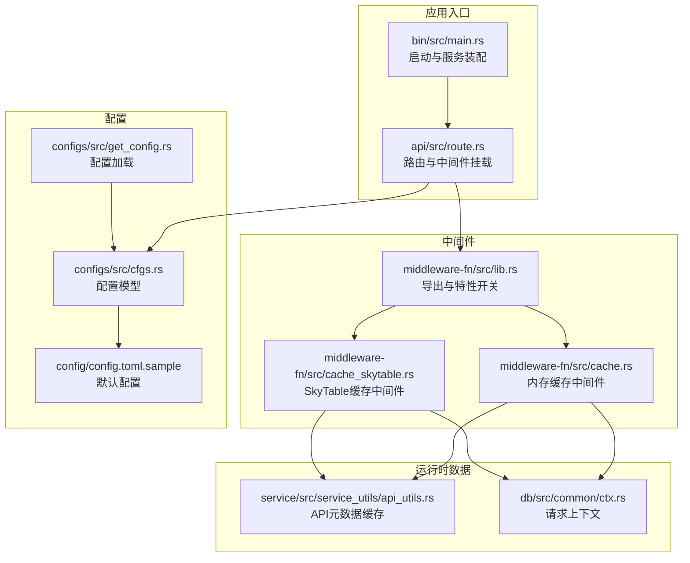
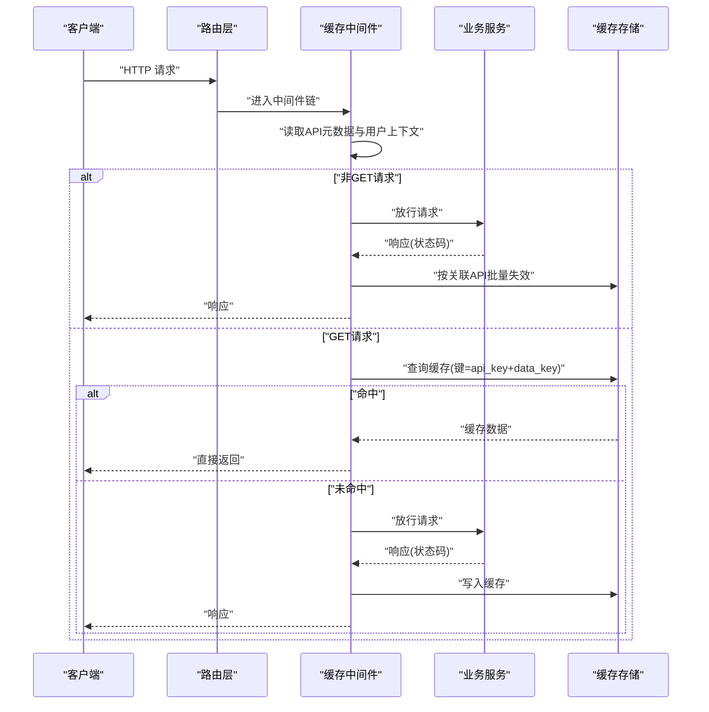
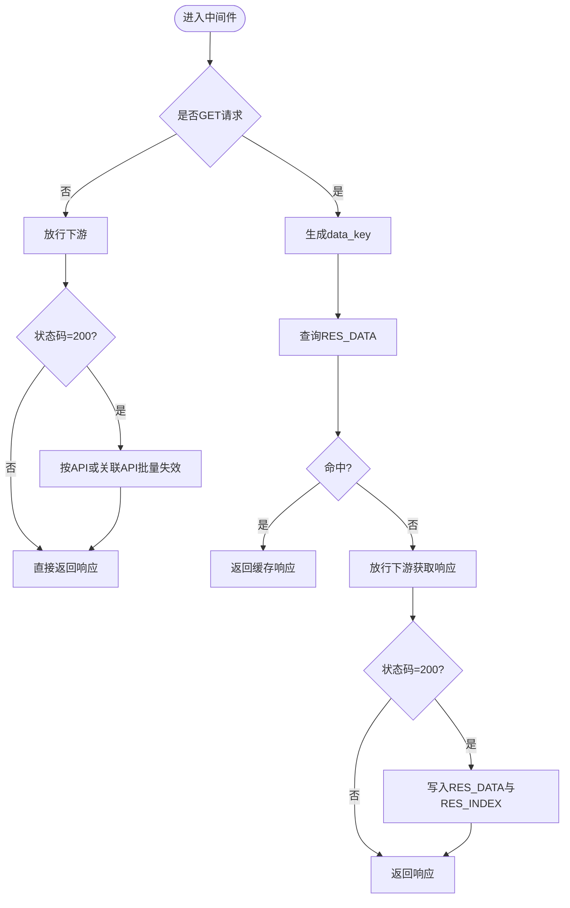
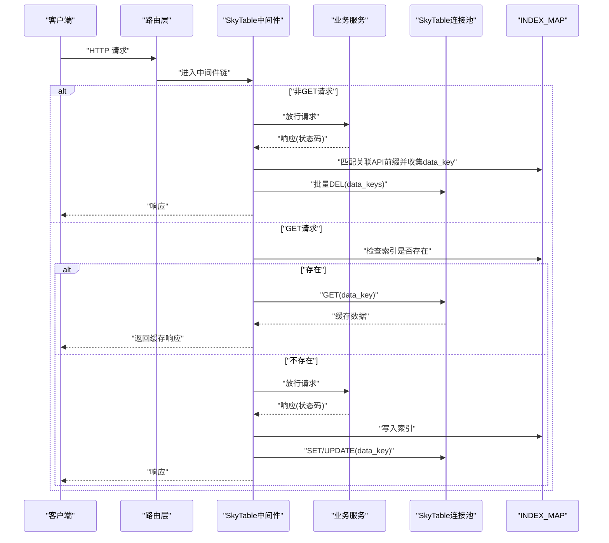
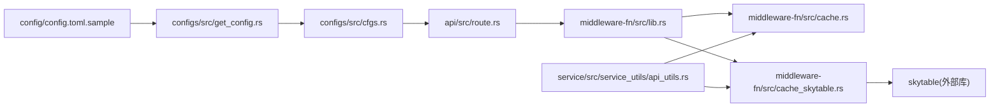

# 缓存中间件

<cite>
**本文引用的文件**
- [middleware-fn/src/cache.rs](file://middleware-fn/src/cache.rs)
- [middleware-fn/src/cache_skytable.rs](file://middleware-fn/src/cache_skytable.rs)
- [middleware-fn/src/lib.rs](file://middleware-fn/src/lib.rs)
- [configs/src/cfgs.rs](file://configs/src/cfgs.rs)
- [configs/src/get_config.rs](file://configs/src/get_config.rs)
- [config/config.toml.sample](file://config/config.toml.sample)
- [service/src/service_utils/api_utils.rs](file://service/src/service_utils/api_utils.rs)
- [db/src/common/ctx.rs](file://db/src/common/ctx.rs)
- [middleware-fn/Cargo.toml](file://middleware-fn/Cargo.toml)
- [api/src/route.rs](file://api/src/route.rs)
- [bin/src/main.rs](file://bin/src/main.rs)
</cite>

## 目录
1. [简介](#简介)
2. [项目结构](#项目结构)
3. [核心组件](#核心组件)
4. [架构总览](#架构总览)
5. [组件详解](#组件详解)
6. [依赖关系分析](#依赖关系分析)
7. [性能与优化](#性能与优化)
8. [监控与调试](#监控与调试)
9. [故障排除指南](#故障排除指南)
10. [结论](#结论)
11. [附录](#附录)

## 简介
本文件系统性阐述项目中的缓存中间件实现，包括内存缓存与 SkyTable 分布式缓存两种模式。内容覆盖缓存策略设计、缓存键生成规则、配置项说明、缓存失效与穿透防护、命中率优化、缓存更新与一致性保障、适用场景与性能对比、监控指标与调试方法、最佳实践与调优建议等。

## 项目结构
缓存中间件位于 middleware-fn 子模块，分别提供内存版与 SkyTable 版两个实现，并通过特性开关进行编译期选择；配置通过 configs 模块加载；API 路由层根据配置动态挂载缓存中间件。

**图示来源**
- [bin/src/main.rs](file://bin/src/main.rs#L54-L56)
- [api/src/route.rs](file://api/src/route.rs#L32-L54)
- [middleware-fn/src/lib.rs](file://middleware-fn/src/lib.rs#L9-L22)
- [configs/src/cfgs.rs](file://configs/src/cfgs.rs#L24-L42)
- [configs/src/get_config.rs](file://configs/src/get_config.rs#L10-L25)
- [config/config.toml.sample](file://config/config.toml.sample#L11-L16)
- [service/src/service_utils/api_utils.rs](file://service/src/service_utils/api_utils.rs#L16-L19)
- [db/src/common/ctx.rs](file://db/src/common/ctx.rs#L1-L9)

**章节来源**
- [middleware-fn/src/lib.rs](file://middleware-fn/src/lib.rs#L9-L22)
- [middleware-fn/Cargo.toml](file://middleware-fn/Cargo.toml#L27-L38)
- [configs/src/cfgs.rs](file://configs/src/cfgs.rs#L24-L42)
- [configs/src/get_config.rs](file://configs/src/get_config.rs#L10-L25)
- [config/config.toml.sample](file://config/config.toml.sample#L11-L16)
- [service/src/service_utils/api_utils.rs](file://service/src/service_utils/api_utils.rs#L16-L19)
- [db/src/common/ctx.rs](file://db/src/common/ctx.rs#L1-L9)
- [api/src/route.rs](file://api/src/route.rs#L32-L54)
- [bin/src/main.rs](file://bin/src/main.rs#L54-L56)

## 核心组件
- 内存缓存中间件：基于进程内 HashMap/BTreeMap 实现，适合单实例部署或小规模并发。
- SkyTable 缓存中间件：基于 SkyTable 键值数据库，支持多实例共享缓存，具备过期清理与批量失效能力。
- 中间件导出与特性开关：通过 Cargo features 控制启用内存或 SkyTable 版本。
- 配置体系：统一从配置文件加载缓存时间、缓存方式、SkyTable 地址与端口等参数。
- API 元数据：运行时维护 API 到缓存策略与关联 API 的映射，支撑缓存键生成与失效范围计算。

**章节来源**
- [middleware-fn/src/cache.rs](file://middleware-fn/src/cache.rs#L24-L34)
- [middleware-fn/src/cache_skytable.rs](file://middleware-fn/src/cache_skytable.rs#L45-L49)
- [middleware-fn/src/lib.rs](file://middleware-fn/src/lib.rs#L9-L22)
- [configs/src/cfgs.rs](file://configs/src/cfgs.rs#L24-L42)
- [configs/src/get_config.rs](file://configs/src/get_config.rs#L10-L25)
- [service/src/service_utils/api_utils.rs](file://service/src/service_utils/api_utils.rs#L16-L19)

## 架构总览
缓存中间件在请求进入时根据 API 元数据决定是否启用缓存；对 GET 请求优先查询缓存，命中则直接返回；未命中则放行下游服务，将响应体写入缓存并返回。对非 GET 请求（如新增、修改、删除）在成功时触发相关 API 的缓存失效。

**图示来源**
- [middleware-fn/src/cache.rs](file://middleware-fn/src/cache.rs#L126-L193)
- [middleware-fn/src/cache_skytable.rs](file://middleware-fn/src/cache_skytable.rs#L160-L227)
- [service/src/service_utils/api_utils.rs](file://service/src/service_utils/api_utils.rs#L16-L19)
- [db/src/common/ctx.rs](file://db/src/common/ctx.rs#L1-L9)

## 组件详解

### 内存缓存中间件
- 数据结构
  - RES_DATA：以 API 路径为外层键，data_key 为内层键，存储 JSON 字符串响应。
  - RES_INDEX：以“索引键★时间戳”形式维护缓存索引，定期扫描过期并清理。
- 缓存键生成
  - data_cache_method=1 时，键为“原始URI_方法_token_id”；否则为“原始URI_方法”。
  - API 路径作为缓存的 api_key。
- 失效策略
  - 非 GET 请求成功时，按 API 或关联 API 清理对应缓存。
  - 后台定时器按 cache_time 扫描索引，超过阈值的条目触发清理。
- 适用场景
  - 单实例部署、低并发、无需跨实例共享缓存的场景。

**图示来源**
- [middleware-fn/src/cache.rs](file://middleware-fn/src/cache.rs#L126-L193)
- [middleware-fn/src/cache.rs](file://middleware-fn/src/cache.rs#L60-L87)
- [middleware-fn/src/cache.rs](file://middleware-fn/src/cache.rs#L89-L123)
- [middleware-fn/src/cache.rs](file://middleware-fn/src/cache.rs#L36-L58)

**章节来源**
- [middleware-fn/src/cache.rs](file://middleware-fn/src/cache.rs#L24-L34)
- [middleware-fn/src/cache.rs](file://middleware-fn/src/cache.rs#L60-L87)
- [middleware-fn/src/cache.rs](file://middleware-fn/src/cache.rs#L89-L123)
- [middleware-fn/src/cache.rs](file://middleware-fn/src/cache.rs#L126-L193)
- [middleware-fn/src/cache.rs](file://middleware-fn/src/cache.rs#L36-L58)

### SkyTable 缓存中间件
- 连接管理
  - 使用 OnceCell 初始化连接池，首次连接时 flushdb 清空旧数据。
  - 连接池大小固定，避免资源滥用。
- 数据结构
  - INDEX_MAP：维护“索引键★时间戳”的过期索引，后台定时清理。
- 缓存键生成
  - 与内存版本一致，支持区分 token 的键策略。
- 失效策略
  - 非 GET 请求成功时，按关联 API 匹配索引键前缀，提取 data_key 并批量删除。
  - 后台定时器扫描过期索引，删除对应 data_key。
- 适用场景
  - 多实例部署、需要跨实例共享缓存、对可用性要求较高的场景。

**图示来源**
- [middleware-fn/src/cache_skytable.rs](file://middleware-fn/src/cache_skytable.rs#L160-L227)
- [middleware-fn/src/cache_skytable.rs](file://middleware-fn/src/cache_skytable.rs#L50-L76)
- [middleware-fn/src/cache_skytable.rs](file://middleware-fn/src/cache_skytable.rs#L117-L132)
- [middleware-fn/src/cache_skytable.rs](file://middleware-fn/src/cache_skytable.rs#L135-L149)
- [middleware-fn/src/cache_skytable.rs](file://middleware-fn/src/cache_skytable.rs#L152-L158)

**章节来源**
- [middleware-fn/src/cache_skytable.rs](file://middleware-fn/src/cache_skytable.rs#L23-L40)
- [middleware-fn/src/cache_skytable.rs](file://middleware-fn/src/cache_skytable.rs#L45-L49)
- [middleware-fn/src/cache_skytable.rs](file://middleware-fn/src/cache_skytable.rs#L50-L76)
- [middleware-fn/src/cache_skytable.rs](file://middleware-fn/src/cache_skytable.rs#L117-L132)
- [middleware-fn/src/cache_skytable.rs](file://middleware-fn/src/cache_skytable.rs#L135-L149)
- [middleware-fn/src/cache_skytable.rs](file://middleware-fn/src/cache_skytable.rs#L152-L158)
- [middleware-fn/src/cache_skytable.rs](file://middleware-fn/src/cache_skytable.rs#L160-L227)

### 缓存键生成规则
- data_cache_method=1：data_key = 原始URI_METHOD_token_id
- data_cache_method≠1：data_key = 原始URI_METHOD
- api_key = 当前请求的 API 路径
- 索引键格式：api_key★data_key

**章节来源**
- [middleware-fn/src/cache.rs](file://middleware-fn/src/cache.rs#L159-L162)
- [middleware-fn/src/cache_skytable.rs](file://middleware-fn/src/cache_skytable.rs#L193-L196)
- [middleware-fn/src/cache_skytable.rs](file://middleware-fn/src/cache_skytable.rs#L113-L115)

### 缓存策略设计
- 仅对 GET 请求启用缓存，其他方法（新增、修改、删除）在成功时触发失效。
- 支持按单个 API 或其关联 API 的批量失效，减少误伤。
- 提供两种缓存方式：内存与 SkyTable，通过配置切换。

**章节来源**
- [middleware-fn/src/cache.rs](file://middleware-fn/src/cache.rs#L146-L158)
- [middleware-fn/src/cache.rs](file://middleware-fn/src/cache.rs#L89-L123)
- [middleware-fn/src/cache_skytable.rs](file://middleware-fn/src/cache_skytable.rs#L180-L192)
- [middleware-fn/src/cache_skytable.rs](file://middleware-fn/src/cache_skytable.rs#L85-L102)

### 缓存失效策略
- 非 GET 成功响应后，若存在关联 API，则遍历匹配并删除对应 data_key。
- 后台定时器按 cache_time 扫描索引，超时则删除对应 data_key。

**章节来源**
- [middleware-fn/src/cache.rs](file://middleware-fn/src/cache.rs#L149-L157)
- [middleware-fn/src/cache.rs](file://middleware-fn/src/cache.rs#L46-L58)
- [middleware-fn/src/cache_skytable.rs](file://middleware-fn/src/cache_skytable.rs#L183-L191)
- [middleware-fn/src/cache_skytable.rs](file://middleware-fn/src/cache_skytable.rs#L59-L76)

### 缓存穿透防护
- 本实现未见显式的空值缓存或布隆过滤器等机制。
- 建议在上游服务层对不存在的 key 写入短 TTL 的空值占位，或引入布隆过滤器拦截不存在的 key 查询。

**章节来源**
- [middleware-fn/src/cache.rs](file://middleware-fn/src/cache.rs#L169-L191)
- [middleware-fn/src/cache_skytable.rs](file://middleware-fn/src/cache_skytable.rs#L203-L225)

### 缓存命中率优化
- 对热点接口启用缓存，合理设置 cache_time。
- 使用 data_cache_method=1 将用户维度纳入键，避免同用户看到他人数据。
- 对高并发场景优先选择 SkyTable，降低锁竞争与内存碎片。

**章节来源**
- [config/config.toml.sample](file://config/config.toml.sample#L11-L16)
- [middleware-fn/src/cache.rs](file://middleware-fn/src/cache.rs#L159-L162)
- [middleware-fn/src/cache_skytable.rs](file://middleware-fn/src/cache_skytable.rs#L193-L196)

### 缓存更新机制
- 未命中时，先放行下游获取最新数据，再写入缓存。
- 更新成功后立即失效相关缓存，确保后续读取命中最新数据。

**章节来源**
- [middleware-fn/src/cache.rs](file://middleware-fn/src/cache.rs#L172-L191)
- [middleware-fn/src/cache_skytable.rs](file://middleware-fn/src/cache_skytable.rs#L206-L225)

### 缓存一致性保证
- 通过“先写缓存，后失效”的顺序，结合关联 API 的批量失效，降低不一致窗口。
- SkyTable 模式下，索引与数据分离，后台清理更可控。

**章节来源**
- [middleware-fn/src/cache.rs](file://middleware-fn/src/cache.rs#L181-L184)
- [middleware-fn/src/cache_skytable.rs](file://middleware-fn/src/cache_skytable.rs#L120-L132)

### 适用场景与性能对比
- 内存缓存：单实例、低并发、对延迟敏感但无跨实例共享需求。
- SkyTable 缓存：多实例、高并发、需要跨实例共享与稳定过期清理。

**章节来源**
- [middleware-fn/src/cache.rs](file://middleware-fn/src/cache.rs#L24-L34)
- [middleware-fn/src/cache_skytable.rs](file://middleware-fn/src/cache_skytable.rs#L25-L40)

## 依赖关系分析
- 中间件依赖配置模块加载缓存时间与方式，依赖 API 元数据模块获取每个 API 的缓存策略与关联 API。
- SkyTable 版本额外依赖 skytable 异步连接池。
- 路由层根据配置动态挂载缓存中间件。

**图示来源**
- [configs/src/cfgs.rs](file://configs/src/cfgs.rs#L24-L42)
- [configs/src/get_config.rs](file://configs/src/get_config.rs#L10-L25)
- [config/config.toml.sample](file://config/config.toml.sample#L11-L16)
- [api/src/route.rs](file://api/src/route.rs#L32-L54)
- [middleware-fn/src/lib.rs](file://middleware-fn/src/lib.rs#L9-L22)
- [service/src/service_utils/api_utils.rs](file://service/src/service_utils/api_utils.rs#L16-L19)
- [middleware-fn/Cargo.toml](file://middleware-fn/Cargo.toml#L25)

**章节来源**
- [middleware-fn/Cargo.toml](file://middleware-fn/Cargo.toml#L9-L25)
- [api/src/route.rs](file://api/src/route.rs#L32-L54)
- [configs/src/cfgs.rs](file://configs/src/cfgs.rs#L24-L42)

## 性能与优化
- 选择合适的缓存方式：SkyTable 更适合多实例与高并发。
- 合理设置 cache_time，避免过长导致陈旧，过短导致频繁回源。
- 对高频 GET 接口开启缓存，对写操作及时失效相关缓存。
- SkyTable 连接池大小可按 QPS 调整，默认值为 10。

**章节来源**
- [config/config.toml.sample](file://config/config.toml.sample#L11-L16)
- [middleware-fn/src/cache_skytable.rs](file://middleware-fn/src/cache_skytable.rs#L27-L31)

## 监控与调试
- 日志输出
  - 写入、更新、删除缓存均有日志记录，便于定位问题。
  - 启动时会打印缓存初始化信息。
- 建议增加的指标
  - 缓存命中/未命中计数、写入耗时、失效批量大小、连接池使用率。
- 调试步骤
  - 检查配置文件中的 cache_time 与 cache_method 是否正确。
  - 观察日志中“add/update/get/remove cache data”等关键信息。
  - 对 SkyTable 模式，确认连接池初始化与 flushdb 行为。

**章节来源**
- [middleware-fn/src/cache.rs](file://middleware-fn/src/cache.rs#L70-L71)
- [middleware-fn/src/cache.rs](file://middleware-fn/src/cache.rs#L37-L42)
- [middleware-fn/src/cache_skytable.rs](file://middleware-fn/src/cache_skytable.rs#L124-L129)
- [middleware-fn/src/cache_skytable.rs](file://middleware-fn/src/cache_skytable.rs#L155-L157)
- [middleware-fn/src/cache_skytable.rs](file://middleware-fn/src/cache_skytable.rs#L51-L57)

## 故障排除指南
- 无法连接 SkyTable
  - 检查配置中的 server 与 port。
  - 查看初始化日志与错误信息。
- 缓存未生效
  - 确认 API 的 data_cache_method 是否启用。
  - 检查请求方法是否为 GET。
- 缓存未失效
  - 确认写操作返回状态码为 200。
  - 检查关联 API 配置是否正确。
- 缓存穿透
  - 建议在上游服务层加入空值缓存或布隆过滤器。

**章节来源**
- [configs/src/cfgs.rs](file://configs/src/cfgs.rs#L104-L110)
- [middleware-fn/src/cache.rs](file://middleware-fn/src/cache.rs#L149-L157)
- [middleware-fn/src/cache_skytable.rs](file://middleware-fn/src/cache_skytable.rs#L183-L191)

## 结论
本缓存中间件提供了简洁高效的内存与 SkyTable 两套方案，通过配置即可灵活切换。其设计遵循“只对 GET 缓存、写即失效”的原则，并辅以关联 API 批量失效与后台过期清理，满足大多数业务场景。建议在高并发与多实例环境下优先采用 SkyTable，并结合日志与指标持续优化缓存策略。

## 附录

### 配置项说明
- server.cache_time：缓存过期时间（秒）
- server.cache_method：缓存方式（0=内存，1=SkyTable）
- skytable.server/skytable.port：SkyTable 服务地址与端口

**章节来源**
- [configs/src/cfgs.rs](file://configs/src/cfgs.rs#L24-L42)
- [configs/src/cfgs.rs](file://configs/src/cfgs.rs#L104-L110)
- [config/config.toml.sample](file://config/config.toml.sample#L11-L19)

### API 元数据与上下文
- ApiInfo：包含 name、data_cache_method、log_method、related_api。
- ReqCtx/UserInfoCtx：提供原始 URI、路径、方法、token_id 等上下文信息。

**章节来源**
- [db/src/common/ctx.rs](file://db/src/common/ctx.rs#L18-L32)
- [service/src/service_utils/api_utils.rs](file://service/src/service_utils/api_utils.rs#L16-L19)