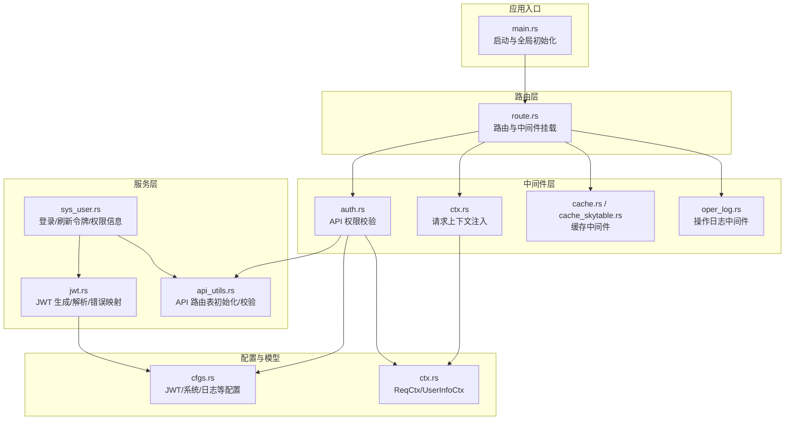
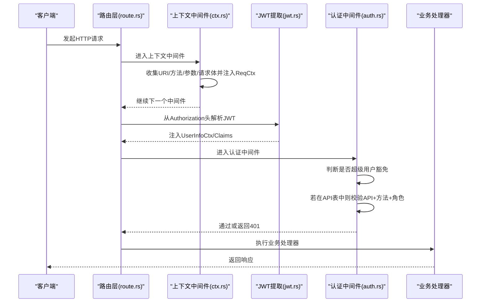
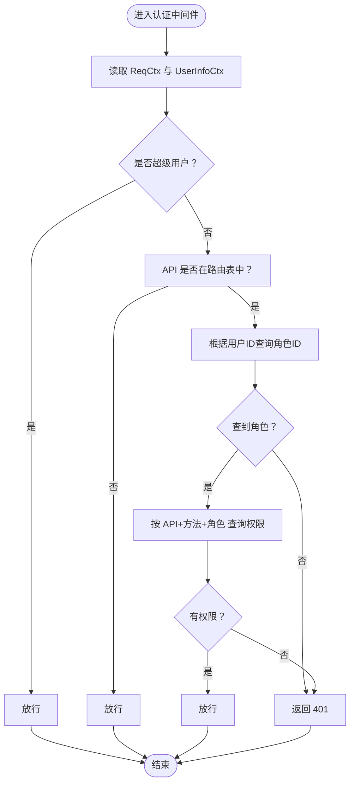
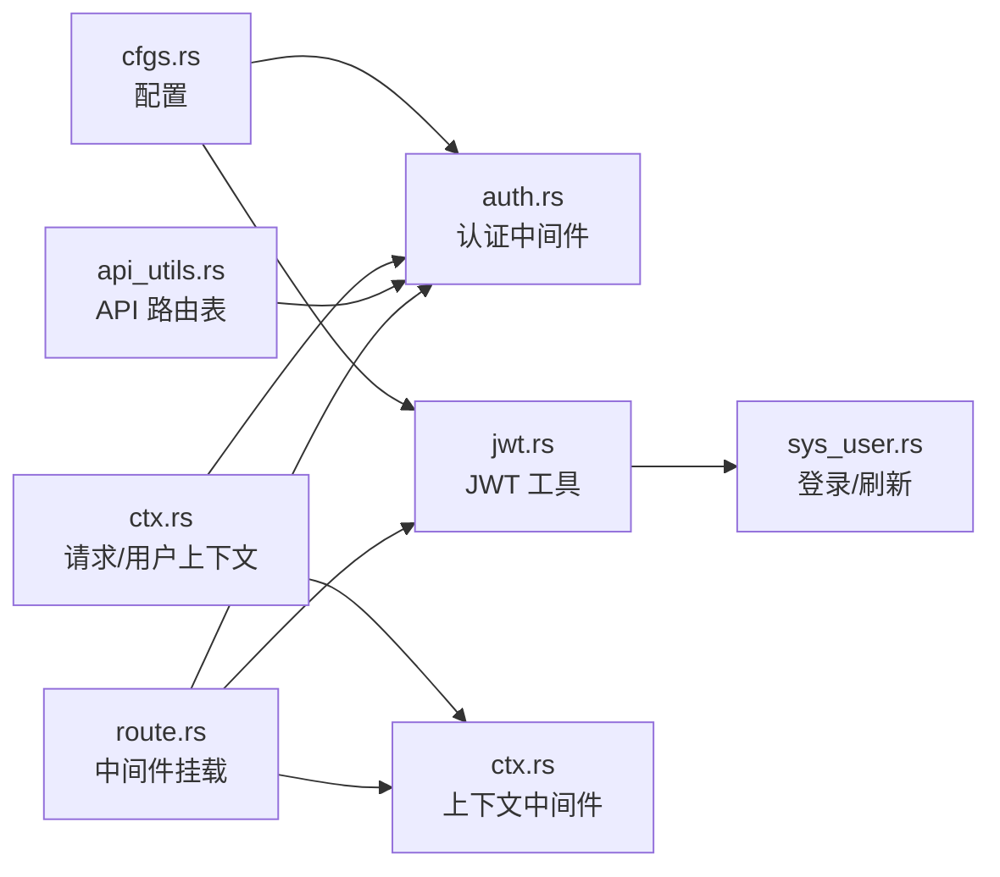

# 认证中间件

<cite>
**本文引用的文件**
- [lib.rs](file://middleware-fn/src/lib.rs)
- [auth.rs](file://middleware-fn/src/auth.rs)
- [ctx.rs](file://middleware-fn/src/ctx.rs)
- [jwt.rs](file://service/src/service_utils/jwt.rs)
- [api_utils.rs](file://service/src/service_utils/api_utils.rs)
- [sys_user.rs](file://service/src/system/sys_user.rs)
- [route.rs](file://api/src/route.rs)
- [main.rs](file://bin/src/main.rs)
- [cfgs.rs](file://configs/src/cfgs.rs)
- [ctx.rs](file://db/src/common/ctx.rs)
- [Cargo.toml](file://Cargo.toml)
</cite>

## 目录
1. [简介](#简介)
2. [项目结构](#项目结构)
3. [核心组件](#核心组件)
4. [架构总览](#架构总览)
5. [组件详解](#组件详解)
6. [依赖关系分析](#依赖关系分析)
7. [性能考量](#性能考量)
8. [故障排查指南](#故障排查指南)
9. [结论](#结论)
10. [附录](#附录)

## 简介
本文件面向“认证中间件”的设计与实现，围绕以下目标展开：
- 解释 JWT 令牌验证机制与用户身份认证流程
- 说明权限检查逻辑与路由白/黑名单策略
- 详述认证中间件的配置参数、令牌解析过程、用户信息提取
- 描述中间件注册方式、执行时机、错误处理策略
- 提供与其他中间件的协作关系、性能优化建议与安全最佳实践
- 给出使用示例与常见问题解决方案

## 项目结构
认证相关能力分布在多个模块中：
- 中间件层：请求上下文注入、鉴权校验、操作日志与缓存中间件
- 服务层：JWT 生成与解析、API 权限表初始化与校验
- 路由层：中间件挂载点与模块化路由组织
- 配置层：JWT 密钥、过期时间、系统超管等配置项
- 数据模型：请求上下文、用户上下文等

图表来源
- [main.rs](file://bin/src/main.rs#L54-L56)
- [route.rs](file://api/src/route.rs#L33-L53)
- [ctx.rs](file://middleware-fn/src/ctx.rs#L12-L51)
- [auth.rs](file://middleware-fn/src/auth.rs#L6-L24)
- [jwt.rs](file://service/src/service_utils/jwt.rs#L20-L38)
- [api_utils.rs](file://service/src/service_utils/api_utils.rs#L21-L48)
- [cfgs.rs](file://configs/src/cfgs.rs#L74-L81)
- [ctx.rs](file://db/src/common/ctx.rs#L1-L33)

章节来源
- [main.rs](file://bin/src/main.rs#L54-L56)
- [route.rs](file://api/src/route.rs#L12-L54)
- [Cargo.toml](file://Cargo.toml#L1-L23)

## 核心组件
- 请求上下文中间件：负责收集 URI、方法、路径参数、请求体等，并注入到扩展中，供后续中间件与处理器使用
- 认证中间件：基于配置的“超级用户”豁免策略，结合 API 路由表与用户角色权限进行校验
- JWT 服务：从 Authorization 头解析 Bearer Token，解码并校验在线状态；提供令牌签发与错误响应映射
- API 权限工具：初始化系统 API 路由表，按 API+方法+角色维度进行权限匹配
- 路由与中间件挂载：在系统模块与测试模块上统一挂载认证、上下文、缓存、操作日志等中间件

章节来源
- [ctx.rs](file://middleware-fn/src/ctx.rs#L12-L51)
- [auth.rs](file://middleware-fn/src/auth.rs#L6-L24)
- [jwt.rs](file://service/src/service_utils/jwt.rs#L54-L94)
- [api_utils.rs](file://service/src/service_utils/api_utils.rs#L21-L48)
- [route.rs](file://api/src/route.rs#L33-L53)

## 架构总览
下图展示了认证中间件在请求生命周期中的位置与协作关系。

图表来源
- [route.rs](file://api/src/route.rs#L33-L53)
- [ctx.rs](file://middleware-fn/src/ctx.rs#L12-L51)
- [jwt.rs](file://service/src/service_utils/jwt.rs#L54-L94)
- [auth.rs](file://middleware-fn/src/auth.rs#L6-L24)

## 组件详解

### 请求上下文中间件（Ctx）
职责与行为：
- 从 OriginalUri 或 URI 提取原始路径，去除 API 前缀后得到标准化 path
- 读取请求方法与查询参数，拼接完整原始 URI
- 读取请求体字节并尝试 UTF-8 解码，记录原始请求体字符串
- 将 ReqCtx 注入到请求扩展，供后续中间件使用

关键点：
- 通过扩展注入 ReqCtx，认证中间件据此进行 API 路由表匹配与权限校验
- 对二进制/非 UTF-8 请求体进行容错处理，避免解析失败导致中断

章节来源
- [ctx.rs](file://middleware-fn/src/ctx.rs#L12-L51)
- [ctx.rs](file://db/src/common/ctx.rs#L1-L33)

### JWT 令牌解析与签发（JWT）
职责与行为：
- 从 Authorization 头提取 Bearer Token，并拆分出访问令牌与 token_id
- 使用密钥解码 Claims，校验过期与签名
- 校验用户在线状态（token_id），确保未被强制下线
- 将 UserInfoCtx 注入请求扩展，供后续中间件与处理器使用
- 提供授权函数生成新令牌，携带 exp 与 token_id

错误处理：
- 无效令牌、缺失凭据、签名过期、令牌创建失败等映射为不同 HTTP 状态与错误体

章节来源
- [jwt.rs](file://service/src/service_utils/jwt.rs#L54-L94)
- [jwt.rs](file://service/src/service_utils/jwt.rs#L96-L121)
- [jwt.rs](file://service/src/service_utils/jwt.rs#L123-L145)

### API 权限校验中间件（ApiAuth）
职责与行为：
- 从扩展中取出 ReqCtx 与 UserInfoCtx
- 若用户为“超级用户”，直接放行
- 若请求路径在 API 路由表中，则进一步校验 API、方法与用户角色的权限匹配
- 匹配失败返回 401，否则放行

API 路由表来源：
- 初始化时从菜单表加载 API 路由，构建内存映射
- 支持动态重载

章节来源
- [auth.rs](file://middleware-fn/src/auth.rs#L6-L24)
- [api_utils.rs](file://service/src/service_utils/api_utils.rs#L21-L48)
- [api_utils.rs](file://service/src/service_utils/api_utils.rs#L83-L118)
- [cfgs.rs](file://configs/src/cfgs.rs#L65-L72)

### 中间件注册与执行时机
- 在系统模块与测试模块上统一挂载：
  - 操作日志中间件（可选）
  - 缓存中间件（可选，支持内存或 SkyTable）
  - 认证中间件
  - 上下文中间件
  - JWT 提取器（从 Authorization 头解析并注入 Claims/UserInfoCtx）

执行顺序与影响：
- 上下文中间件先于 JWT 提取器运行，确保 ReqCtx 可用
- 认证中间件在 JWT 提取器之后，依赖 UserInfoCtx 与 API 路由表
- 缓存与操作日志中间件可选，按配置决定是否启用

章节来源
- [route.rs](file://api/src/route.rs#L33-L53)
- [route.rs](file://api/src/route.rs#L56-L68)
- [lib.rs](file://middleware-fn/src/lib.rs#L1-L23)

### 登录与令牌刷新流程
- 登录：校验验证码、用户状态、密码，生成 token_id 与 JWT，记录登录日志与在线状态
- 刷新：复用原 token_id 与 Claims，重新签发 JWT 并更新在线状态

章节来源
- [sys_user.rs](file://service/src/system/sys_user.rs#L510-L568)
- [sys_user.rs](file://service/src/system/sys_user.rs#L571-L583)

### 权限检查逻辑（算法流程）

图表来源
- [auth.rs](file://middleware-fn/src/auth.rs#L6-L24)
- [api_utils.rs](file://service/src/service_utils/api_utils.rs#L90-L118)
- [sys_user.rs](file://service/src/system/sys_user.rs#L92-L104)

## 依赖关系分析
- 中间件层依赖：
  - 配置：系统超管列表、JWT 配置
  - 数据模型：ReqCtx、UserInfoCtx
  - 服务：API 权限工具（初始化与校验）
- 服务层依赖：
  - JWT 工具：密钥、Claims 结构、错误类型
  - 数据库：用户与角色 API 关联查询
- 路由层依赖：
  - 中间件导出：ApiAuth、Ctx、OperLog、Cache/SkyTableCache
  - 配置：日志开关、缓存开关与方式

图表来源
- [cfgs.rs](file://configs/src/cfgs.rs#L65-L81)
- [auth.rs](file://middleware-fn/src/auth.rs#L1-L4)
- [jwt.rs](file://service/src/service_utils/jwt.rs#L20-L38)
- [ctx.rs](file://db/src/common/ctx.rs#L1-L33)
- [api_utils.rs](file://service/src/service_utils/api_utils.rs#L16-L19)
- [route.rs](file://api/src/route.rs#L33-L53)

章节来源
- [lib.rs](file://middleware-fn/src/lib.rs#L1-L23)
- [route.rs](file://api/src/route.rs#L33-L53)

## 性能考量
- 中间件顺序：上下文中间件在前，避免后续中间件重复解析请求体
- 缓存中间件：可按配置启用内存或 SkyTable 缓存，减少数据库查询与权限校验压力
- API 路由表：初始化时一次性加载，后续通过内存哈希表快速匹配，降低 IO
- JWT 解析：使用静态密钥对象，避免重复构造；在线状态校验为 O(1) 查找
- 压缩与跨域：全局启用 Gzip（排除 SSE）与 CORS，提升传输效率与兼容性

章节来源
- [route.rs](file://api/src/route.rs#L33-L53)
- [api_utils.rs](file://service/src/service_utils/api_utils.rs#L21-L48)
- [main.rs](file://bin/src/main.rs#L75-L83)

## 故障排查指南
常见问题与定位思路：
- 无效令牌/签名过期
  - 现象：返回 400 或 401，错误体包含“无效令牌”
  - 排查：确认 Authorization 头格式、Bearer 前缀、密钥一致、时间同步
  - 参考：[jwt.rs](file://service/src/service_utils/jwt.rs#L74-L84)
- 令牌已下线
  - 现象：返回 401，提示“该账户已经退出”
  - 排查：确认 token_id 仍在在线表中；检查强制下线流程
  - 参考：[jwt.rs](file://service/src/service_utils/jwt.rs#L64-L73)
- 权限不足
  - 现象：返回 401
  - 排查：确认用户角色是否包含对应 API+方法 的授权；检查 API 路由表是否包含该 API
  - 参考：[auth.rs](file://middleware-fn/src/auth.rs#L15-L23)、[api_utils.rs](file://service/src/service_utils/api_utils.rs#L90-L118)
- 超级用户仍被拒绝
  - 现象：返回 401
  - 排查：确认配置中的系统超管列表是否包含当前用户 ID
  - 参考：[cfgs.rs](file://configs/src/cfgs.rs#L65-L72)、[auth.rs](file://middleware-fn/src/auth.rs#L9-L12)
- 请求体解析失败
  - 现象：返回 400，提示“failed to read body”
  - 排查：确认 Content-Type 与请求体编码；二进制请求体会被标记为不可输出
  - 参考：[ctx.rs](file://middleware-fn/src/ctx.rs#L54-L73)

章节来源
- [jwt.rs](file://service/src/service_utils/jwt.rs#L123-L145)
- [auth.rs](file://middleware-fn/src/auth.rs#L15-L23)
- [api_utils.rs](file://service/src/service_utils/api_utils.rs#L90-L118)
- [cfgs.rs](file://configs/src/cfgs.rs#L65-L72)
- [ctx.rs](file://middleware-fn/src/ctx.rs#L54-L73)

## 结论
本认证中间件以“上下文中间件 + JWT 提取 + 权限校验”为核心，配合可选的缓存与操作日志中间件，形成清晰的请求处理链路。其关键优势在于：
- 超级用户豁免简化管理
- API 路由表驱动的细粒度权限控制
- 在线状态校验保障安全
- 可配置的中间件组合满足不同场景需求

## 附录

### 配置参数说明
- JWT 密钥与过期时间：用于生成与验证 JWT
- 系统超管列表：用于豁免权限校验
- 日志开关：控制是否启用操作日志中间件
- 缓存时间与方式：控制是否启用缓存中间件及缓存介质

章节来源
- [cfgs.rs](file://configs/src/cfgs.rs#L74-L81)
- [cfgs.rs](file://configs/src/cfgs.rs#L65-L72)
- [cfgs.rs](file://configs/src/cfgs.rs#L83-L94)
- [cfgs.rs](file://configs/src/cfgs.rs#L36-L40)

### 使用示例（步骤说明）
- 登录获取令牌
  - 调用登录接口，传入用户名、密码与验证码
  - 成功后返回 JWT 与过期时间
  - 参考：[sys_user.rs](file://service/src/system/sys_user.rs#L510-L568)
- 请求受保护资源
  - 在 Authorization 头中携带 Bearer 令牌
  - 服务端自动解析并注入用户上下文
  - 参考：[jwt.rs](file://service/src/service_utils/jwt.rs#L54-L94)
- 刷新令牌
  - 使用现有 Claims 与原 token_id 重新签发
  - 参考：[sys_user.rs](file://service/src/system/sys_user.rs#L571-L583)

### 安全最佳实践
- 严格管理 JWT 密钥，定期轮换
- 启用 HTTPS/TLS，避免明文传输
- 控制日志敏感信息输出
- 对关键操作启用操作日志中间件
- 限制请求体大小与类型，防止滥用
- 强制下线后立即失效对应 token_id