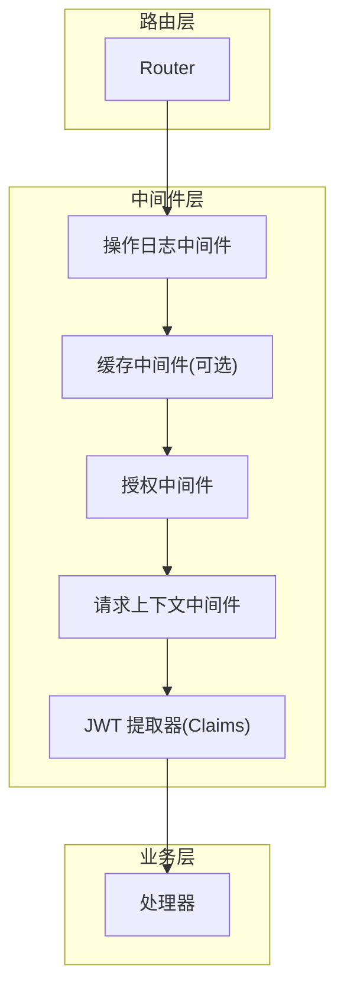
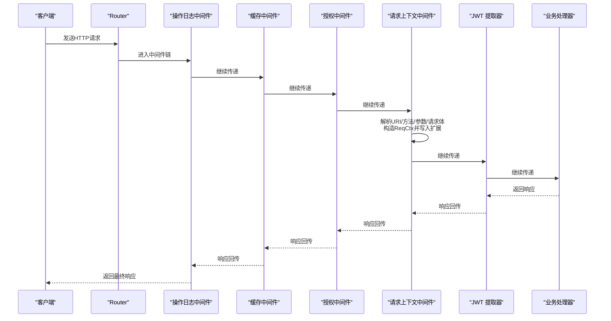
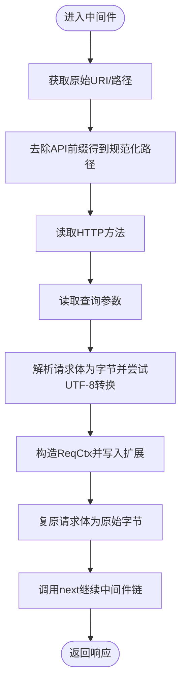
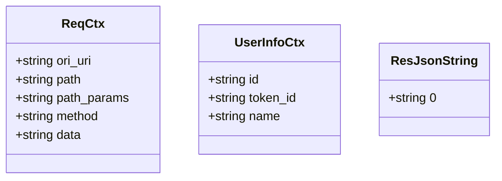
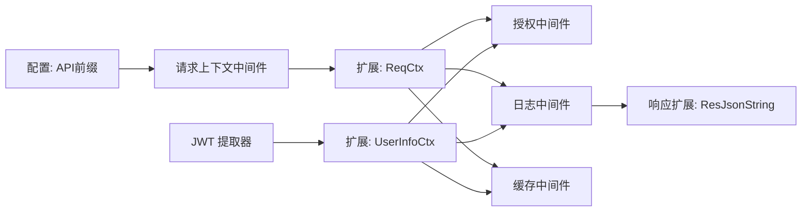

# 请求上下文中间件

<cite>
**本文引用的文件**
- [middleware-fn/src/ctx.rs](file://middleware-fn/src/ctx.rs)
- [db/src/common/ctx.rs](file://db/src/common/ctx.rs)
- [api/src/route.rs](file://api/src/route.rs)
- [middleware-fn/src/auth.rs](file://middleware-fn/src/auth.rs)
- [middleware-fn/src/oper_log.rs](file://middleware-fn/src/oper_log.rs)
- [service/src/service_utils/jwt.rs](file://service/src/service_utils/jwt.rs)
- [middleware-fn/src/cache.rs](file://middleware-fn/src/cache.rs)
- [db/src/common/res.rs](file://db/src/common/res.rs)
</cite>

## 目录
1. [简介](#简介)
2. [项目结构](#项目结构)
3. [核心组件](#核心组件)
4. [架构总览](#架构总览)
5. [组件详细分析](#组件详细分析)
6. [依赖关系分析](#依赖关系分析)
7. [性能考量](#性能考量)
8. [故障排查指南](#故障排查指南)
9. [结论](#结论)

## 简介
本文件围绕“请求上下文中间件”展开，系统阐述其在中间件链中的职责、执行顺序、数据结构设计、上下文传播机制、内存管理策略、安全性与清理机制、调试技巧以及最佳实践与常见陷阱。该中间件负责从请求中提取并构建请求上下文（如原始 URI、规范化路径、方法、查询参数、请求体文本），将其注入到请求扩展中，供后续中间件与处理器使用；同时，它与 JWT 提取器配合，将用户信息也注入到请求扩展，从而实现全局状态在中间件链中的传递。

## 项目结构
该中间件位于独立的中间件模块中，并通过路由配置在授权路由上按序加载。其典型执行顺序为：操作日志中间件 → 缓存中间件（可选）→ 授权中间件 → 请求上下文中间件 → JWT 提取器 → 处理器。

图表来源
- [api/src/route.rs](file://api/src/route.rs#L32-L68)

章节来源
- [api/src/route.rs](file://api/src/route.rs#L1-L69)

## 核心组件
- 请求上下文中间件函数：负责解析请求路径前缀、方法、查询参数、请求体文本，并构造请求上下文对象，注入到请求扩展中，再调用下一个中间件或处理器。
- 请求上下文数据结构：包含原始 URI、规范化路径、方法、查询参数、请求体文本等字段。
- 用户信息上下文：由 JWT 提取器注入，包含用户标识、令牌标识、用户名等。
- 统一响应包装：在响应生成时将 JSON 字符串放入响应扩展，供日志等中间件读取。

章节来源
- [middleware-fn/src/ctx.rs](file://middleware-fn/src/ctx.rs#L12-L51)
- [db/src/common/ctx.rs](file://db/src/common/ctx.rs#L1-L33)
- [service/src/service_utils/jwt.rs](file://service/src/service_utils/jwt.rs#L54-L94)
- [db/src/common/res.rs](file://db/src/common/res.rs#L32-L62)

## 架构总览
请求上下文中间件在中间件链中的位置与职责如下：
- 位置：通常位于授权中间件之后、JWT 提取器之前，确保后续中间件（如缓存、日志）能读取到上下文与用户信息。
- 职责：收集请求元数据、读取并转换请求体为字符串、构造 ReqCtx 并写入请求扩展；随后将控制权交给下一个中间件或处理器。
- 传播：通过 axum 的 Request extensions 在中间件链中传递，后续中间件可通过扩展读取 ReqCtx 与 UserInfoCtx。

图表来源
- [api/src/route.rs](file://api/src/route.rs#L32-L68)
- [middleware-fn/src/ctx.rs](file://middleware-fn/src/ctx.rs#L13-L51)
- [service/src/service_utils/jwt.rs](file://service/src/service_utils/jwt.rs#L54-L94)

## 组件详细分析

### 请求上下文中间件实现与流程
- 输入：Axum Request、Next。
- 关键步骤：
  - 从扩展中获取原始 URI 或回退到 URI 路径，去除配置中的 API 前缀得到规范化路径。
  - 记录方法与查询参数。
  - 解析请求体为字节并尝试 UTF-8 转换为字符串；若非 UTF-8 则标记为二进制提示。
  - 构造 ReqCtx 并写入请求扩展。
  - 将原始字节体复原为请求体后继续调用 next。
- 输出：调用 next 的结果，作为响应返回。

图表来源
- [middleware-fn/src/ctx.rs](file://middleware-fn/src/ctx.rs#L13-L51)

章节来源
- [middleware-fn/src/ctx.rs](file://middleware-fn/src/ctx.rs#L12-L74)

### 上下文数据结构设计
- ReqCtx：包含原始 URI、规范化路径、方法、查询参数、请求体文本。
- UserInfoCtx：包含用户标识、令牌标识、用户名。
- ResJsonString：用于在响应扩展中携带 JSON 字符串，便于日志等中间件读取。

图表来源
- [db/src/common/ctx.rs](file://db/src/common/ctx.rs#L1-L33)
- [db/src/common/res.rs](file://db/src/common/res.rs#L32-L34)

章节来源
- [db/src/common/ctx.rs](file://db/src/common/ctx.rs#L1-L33)
- [db/src/common/res.rs](file://db/src/common/res.rs#L32-L62)

### 上下文传播机制与全局状态
- 传播载体：Axum Request 的扩展（extensions）。中间件通过 insert 写入，后续中间件通过 get 读取。
- 读取示例：
  - 缓存中间件从扩展读取 ReqCtx 与 UserInfoCtx，结合 API 配置决定缓存策略。
  - 授权中间件从扩展读取 ReqCtx 与 UserInfoCtx，判断是否超级用户或校验 API 权限。
  - 操作日志中间件从扩展读取 ReqCtx、UserInfoCtx、ResJsonString，记录请求与响应信息。
- 传播顺序：中间件链自顶向下传递，每个中间件可读取前面中间件写入的扩展值。

章节来源
- [middleware-fn/src/cache.rs](file://middleware-fn/src/cache.rs#L125-L195)
- [middleware-fn/src/auth.rs](file://middleware-fn/src/auth.rs#L6-L24)
- [middleware-fn/src/oper_log.rs](file://middleware-fn/src/oper_log.rs#L21-L42)

### 请求生命周期管理
- 生命周期阶段：
  - 进入：中间件读取请求元数据、解析请求体、写入 ReqCtx。
  - 中间件链：后续中间件（日志、缓存、授权、JWT 提取器）基于 ReqCtx 与 UserInfoCtx 执行逻辑。
  - 离开：中间件返回响应，扩展中的 ReqCtx、UserInfoCtx、ResJsonString 可被上层中间件消费。
- 清理策略：扩展在请求结束时随请求销毁，无需手动清理；但注意避免在扩展中持有过大的临时数据，防止内存膨胀。

章节来源
- [middleware-fn/src/ctx.rs](file://middleware-fn/src/ctx.rs#L13-L51)
- [middleware-fn/src/oper_log.rs](file://middleware-fn/src/oper_log.rs#L21-L42)
- [middleware-fn/src/cache.rs](file://middleware-fn/src/cache.rs#L125-L195)

### 安全性考虑
- 请求体读取：中间件会完整收集请求体并尝试 UTF-8 转换，非文本请求体将被标记为二进制提示。建议在业务层对敏感字段进行脱敏与最小化暴露。
- 用户信息注入：JWT 提取器将用户信息写入扩展，授权中间件据此进行权限校验。需确保 JWT 校验严格、令牌未下线。
- 日志与缓存：日志中间件与缓存中间件均依赖扩展中的上下文信息，需避免将敏感数据写入日志或缓存。

章节来源
- [middleware-fn/src/ctx.rs](file://middleware-fn/src/ctx.rs#L54-L73)
- [service/src/service_utils/jwt.rs](file://service/src/service_utils/jwt.rs#L54-L94)
- [middleware-fn/src/oper_log.rs](file://middleware-fn/src/oper_log.rs#L106-L144)
- [middleware-fn/src/cache.rs](file://middleware-fn/src/cache.rs#L125-L195)

### 内存管理策略
- 请求体收集：中间件会将请求体收集为字节并重建请求体，这会产生一次拷贝。对于大体积请求体，建议：
  - 控制请求体大小上限；
  - 在业务层仅在必要时读取请求体；
  - 使用流式处理替代一次性收集。
- 扩展存储：ReqCtx、UserInfoCtx、ResJsonString 为轻量结构体，内存占用较小；避免在扩展中存放超大对象。
- 异步日志与缓存：日志与缓存中间件使用异步任务写入，不影响主请求处理路径，但仍需关注并发与资源限制。

章节来源
- [middleware-fn/src/ctx.rs](file://middleware-fn/src/ctx.rs#L54-L73)
- [middleware-fn/src/oper_log.rs](file://middleware-fn/src/oper_log.rs#L44-L53)
- [middleware-fn/src/cache.rs](file://middleware-fn/src/cache.rs#L170-L191)

### 性能影响与优化建议
- 执行顺序：将日志与缓存等 I/O 密集型中间件置于靠前位置，减少后续中间件的无效计算；将上下文中间件置于授权与 JWT 提取器之前，确保后续中间件能及时获取上下文。
- 请求体读取成本：尽量避免重复读取请求体；若必须读取，确保只在必要中间件执行。
- 扩展访问：扩展读取为 O(1)，但频繁写入/读取仍需谨慎；合并中间件逻辑以减少扩展变动次数。
- 异步任务：日志与缓存使用异步任务，注意任务数量与队列长度，避免阻塞事件循环。

章节来源
- [api/src/route.rs](file://api/src/route.rs#L32-L68)
- [middleware-fn/src/ctx.rs](file://middleware-fn/src/ctx.rs#L13-L51)
- [middleware-fn/src/oper_log.rs](file://middleware-fn/src/oper_log.rs#L44-L53)
- [middleware-fn/src/cache.rs](file://middleware-fn/src/cache.rs#L170-L191)

### 调试技巧
- 扩展检查：在中间件中打印 ReqCtx、UserInfoCtx、ResJsonString 的关键字段，确认上下文正确注入与传播。
- 请求体诊断：当请求体为二进制时，中间件会标注提示；可在业务层增加日志记录原始字节长度与类型。
- 日志中间件：利用操作日志中间件记录请求路径、方法、耗时、响应状态与错误信息，快速定位问题。
- JWT 校验：若授权失败，检查 JWT 是否过期、是否已下线、令牌标识是否匹配。

章节来源
- [middleware-fn/src/ctx.rs](file://middleware-fn/src/ctx.rs#L54-L73)
- [middleware-fn/src/oper_log.rs](file://middleware-fn/src/oper_log.rs#L21-L42)
- [service/src/service_utils/jwt.rs](file://service/src/service_utils/jwt.rs#L54-L94)

### 最佳实践与常见陷阱
- 最佳实践
  - 将上下文中间件置于授权与 JWT 提取器之前，保证后续中间件能读取到上下文。
  - 对敏感字段进行脱敏与最小化暴露，避免写入日志或缓存。
  - 控制请求体大小，避免一次性收集大体积请求体。
  - 使用异步任务处理日志与缓存，不影响主请求处理。
- 常见陷阱
  - 忘记检查扩展是否存在即强制解引用，导致运行时错误；应使用可选读取并在缺失时降级处理。
  - 在扩展中存放过大对象，造成内存压力。
  - 重复读取请求体，导致不必要的 CPU 与内存开销。
  - 将上下文中间件放在错误的位置，导致后续中间件无法获取上下文。

章节来源
- [middleware-fn/src/auth.rs](file://middleware-fn/src/auth.rs#L6-L24)
- [middleware-fn/src/cache.rs](file://middleware-fn/src/cache.rs#L125-L195)
- [middleware-fn/src/oper_log.rs](file://middleware-fn/src/oper_log.rs#L21-L42)

## 依赖关系分析
- 中间件链依赖：
  - 路由层定义中间件顺序，确保日志、缓存、授权、上下文、JWT、处理器依次执行。
  - 上下文中间件依赖配置中的 API 前缀，用于路径规范化。
  - 授权与日志中间件依赖上下文与用户信息扩展。
  - 缓存中间件依赖上下文、用户信息与 API 配置。
- 数据结构依赖：
  - ReqCtx、UserInfoCtx、ResJsonString 在多个中间件之间共享。
  - JWT 提取器将用户信息写入扩展，供授权与日志中间件使用。

图表来源
- [api/src/route.rs](file://api/src/route.rs#L32-L68)
- [middleware-fn/src/ctx.rs](file://middleware-fn/src/ctx.rs#L13-L51)
- [service/src/service_utils/jwt.rs](file://service/src/service_utils/jwt.rs#L54-L94)
- [middleware-fn/src/auth.rs](file://middleware-fn/src/auth.rs#L6-L24)
- [middleware-fn/src/oper_log.rs](file://middleware-fn/src/oper_log.rs#L21-L42)
- [middleware-fn/src/cache.rs](file://middleware-fn/src/cache.rs#L125-L195)
- [db/src/common/res.rs](file://db/src/common/res.rs#L32-L62)

章节来源
- [api/src/route.rs](file://api/src/route.rs#L32-L68)
- [middleware-fn/src/ctx.rs](file://middleware-fn/src/ctx.rs#L13-L51)
- [service/src/service_utils/jwt.rs](file://service/src/service_utils/jwt.rs#L54-L94)
- [middleware-fn/src/auth.rs](file://middleware-fn/src/auth.rs#L6-L24)
- [middleware-fn/src/oper_log.rs](file://middleware-fn/src/oper_log.rs#L21-L42)
- [middleware-fn/src/cache.rs](file://middleware-fn/src/cache.rs#L125-L195)
- [db/src/common/res.rs](file://db/src/common/res.rs#L32-L62)

## 性能考量
- 中间件顺序：将 I/O 密集型中间件（日志、缓存）前置，减少后续中间件无效计算。
- 请求体处理：避免重复读取与大体积请求体，必要时采用流式处理。
- 异步任务：合理控制日志与缓存任务数量，避免事件循环拥塞。
- 扩展访问：扩展读取为常数时间，但频繁写入/读取仍需谨慎。

## 故障排查指南
- 上下文缺失：检查中间件顺序，确保上下文中间件在授权与 JWT 提取器之前执行。
- 请求体异常：当请求体非 UTF-8 时会被标记为二进制提示；检查客户端发送的数据类型与编码。
- 授权失败：检查 JWT 是否过期、是否已下线、令牌标识是否匹配。
- 日志缺失：确认日志中间件启用且能从扩展读取 ReqCtx、UserInfoCtx、ResJsonString。

章节来源
- [middleware-fn/src/ctx.rs](file://middleware-fn/src/ctx.rs#L54-L73)
- [service/src/service_utils/jwt.rs](file://service/src/service_utils/jwt.rs#L54-L94)
- [middleware-fn/src/oper_log.rs](file://middleware-fn/src/oper_log.rs#L21-L42)

## 结论
请求上下文中间件在中间件链中承担“请求元数据采集与上下文注入”的关键角色，通过扩展在链路中传递 ReqCtx 与 UserInfoCtx，为授权、日志、缓存等中间件提供统一的全局状态入口。遵循正确的执行顺序、合理的内存与性能策略、完善的安全与调试手段，可显著提升系统的可观测性与稳定性。