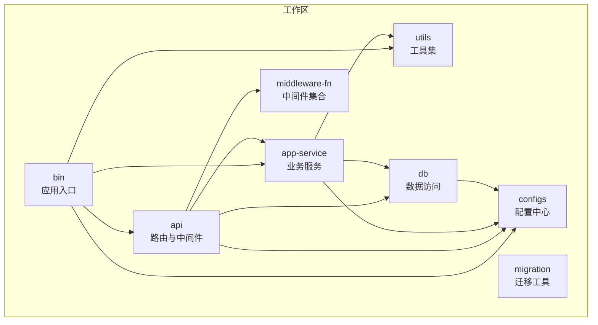
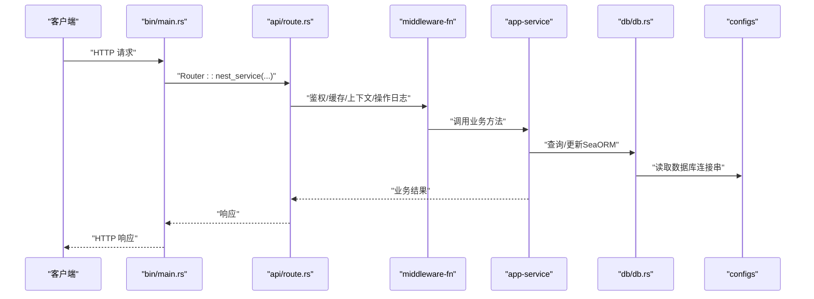
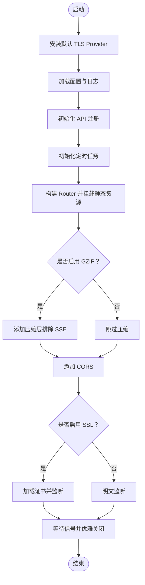
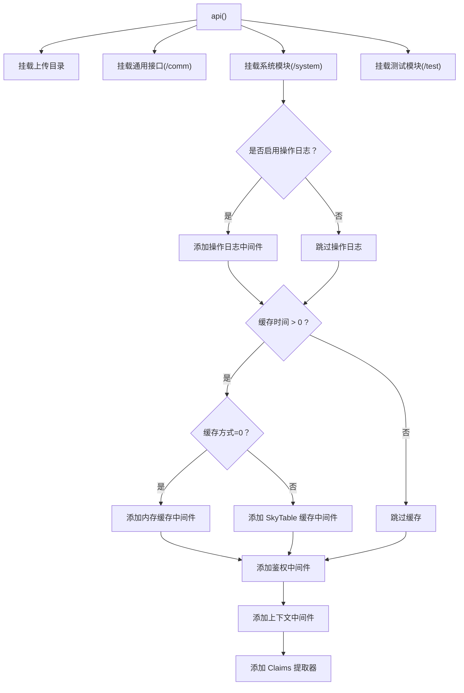
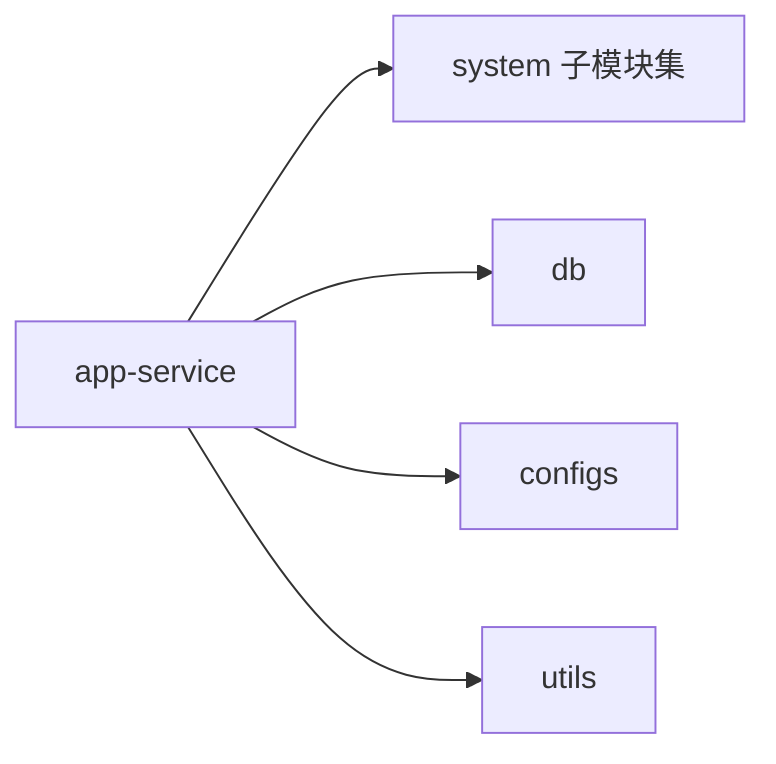
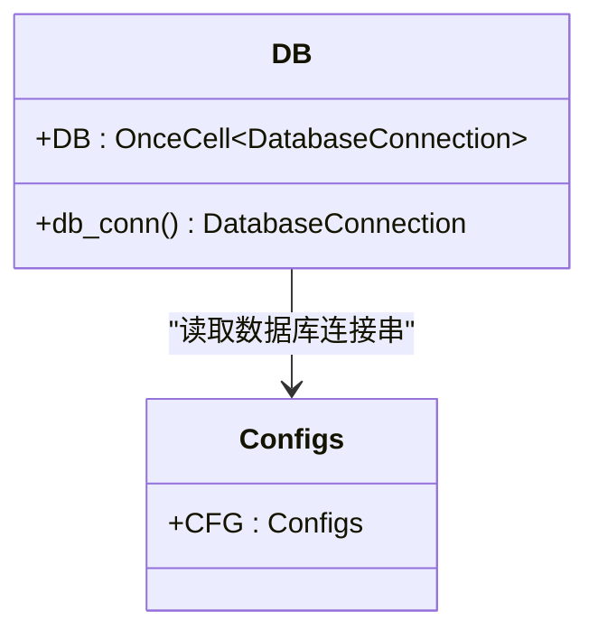
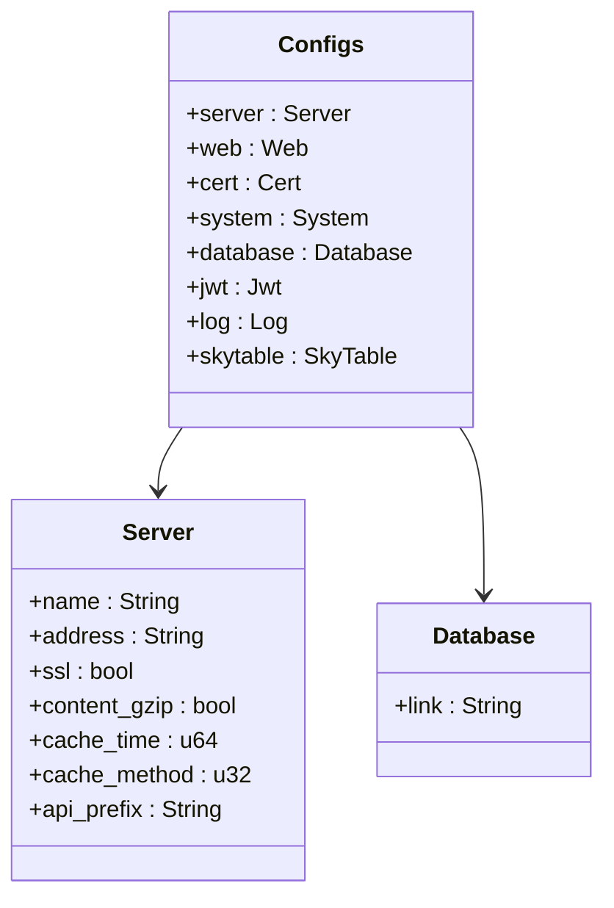
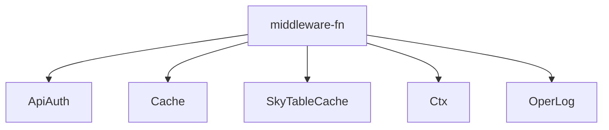
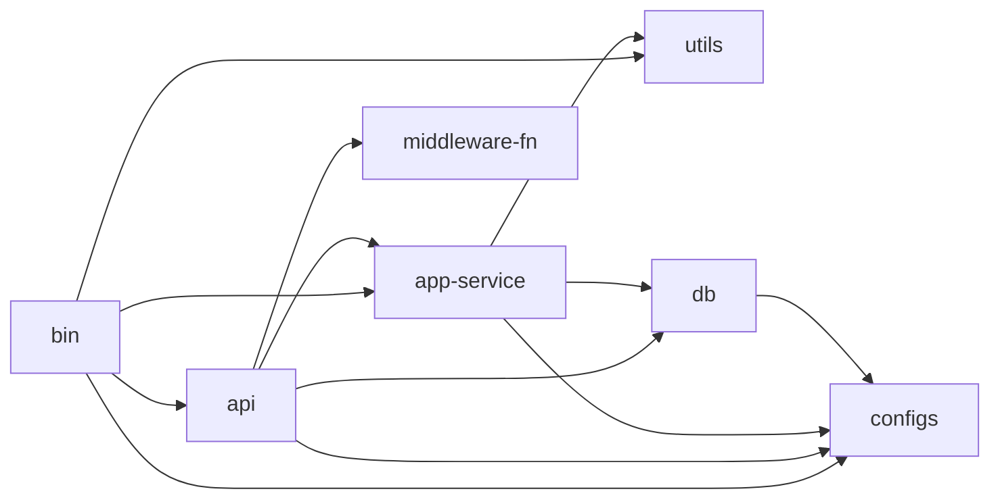

# 依赖注入与模块化

<cite>
**本文引用的文件**
- [Cargo.toml](file://Cargo.toml)
- [bin/Cargo.toml](file://bin/Cargo.toml)
- [api/Cargo.toml](file://api/Cargo.toml)
- [service/Cargo.toml](file://service/Cargo.toml)
- [db/Cargo.toml](file://db/Cargo.toml)
- [configs/Cargo.toml](file://configs/Cargo.toml)
- [middleware-fn/Cargo.toml](file://middleware-fn/Cargo.toml)
- [migration/Cargo.toml](file://migration/Cargo.toml)
- [bin/src/main.rs](file://bin/src/main.rs)
- [api/src/lib.rs](file://api/src/lib.rs)
- [api/src/route.rs](file://api/src/route.rs)
- [service/src/lib.rs](file://service/src/lib.rs)
- [service/src/system/mod.rs](file://service/src/system/mod.rs)
- [db/src/lib.rs](file://db/src/lib.rs)
- [db/src/db.rs](file://db/src/db.rs)
- [configs/src/lib.rs](file://configs/src/lib.rs)
- [configs/src/cfgs.rs](file://configs/src/cfgs.rs)
- [middleware-fn/src/lib.rs](file://middleware-fn/src/lib.rs)
</cite>

## 目录
1. [引言](#引言)
2. [项目结构](#项目结构)
3. [核心组件](#核心组件)
4. [架构总览](#架构总览)
5. [详细组件分析](#详细组件分析)
6. [依赖关系分析](#依赖关系分析)
7. [性能考量](#性能考量)
8. [故障排查指南](#故障排查指南)
9. [结论](#结论)
10. [附录](#附录)

## 引言
本文件系统性阐述 Axum Admin 的工作区（Workspace）组织、模块化设计与依赖注入策略。重点覆盖：
- Cargo 工作区如何实现模块化开发与版本统一管理
- 各模块之间的依赖关系与接口抽象
- 共享依赖（如配置、数据库、中间件）的集中化与解耦
- 扩展新模块、维护依赖、规避循环依赖的最佳实践
- 架构演进与模块化设计带来的优势

## 项目结构
Axum Admin 采用多包工作区（monorepo）组织，核心包包括：
- 应用入口：bin（可执行程序）
- API 层：api（Axum 路由与中间件）
- 业务服务层：app-service（service，原 service 包重命名为 app-service）
- 数据访问层：db（SeaORM 实体与连接）
- 配置中心：configs（统一读取与导出 CFG）
- 中间件集合：middleware-fn（认证、缓存、上下文、操作日志等）
- 工具与通用模块：utils
- 迁移工具：migration

图表来源
- [Cargo.toml](file://Cargo.toml#L1-L12)
- [bin/Cargo.toml](file://bin/Cargo.toml#L12-L16)
- [api/Cargo.toml](file://api/Cargo.toml#L10-L13)
- [service/Cargo.toml](file://service/Cargo.toml#L11-L13)
- [db/Cargo.toml](file://db/Cargo.toml#L11-L11)

章节来源
- [Cargo.toml](file://Cargo.toml#L1-L12)
- [bin/Cargo.toml](file://bin/Cargo.toml#L1-L26)
- [api/Cargo.toml](file://api/Cargo.toml#L1-L22)
- [service/Cargo.toml](file://service/Cargo.toml#L1-L39)
- [db/Cargo.toml](file://db/Cargo.toml#L1-L25)

## 核心组件
- 应用入口（bin）：负责启动、日志、TLS、CORS、静态资源、路由挂载与优雅关闭。
- API 层（api）：Axum 路由组织、无须鉴权与鉴权路由分发、中间件装配。
- 业务服务层（app-service）：系统模块（用户、菜单、角色、岗位、字典、定时任务等）与任务调度。
- 数据访问层（db）：数据库连接池与实体模型，提供全局 OnceCell 连接。
- 配置中心（configs）：统一配置结构体与全局 CFG 导出。
- 中间件集合（middleware-fn）：认证、缓存、上下文、操作日志等。
- 工具集（utils）：环境变量、随机数、证书等辅助能力。

章节来源
- [bin/src/main.rs](file://bin/src/main.rs#L25-L96)
- [api/src/lib.rs](file://api/src/lib.rs#L1-L10)
- [service/src/lib.rs](file://service/src/lib.rs#L1-L7)
- [db/src/lib.rs](file://db/src/lib.rs#L1-L8)
- [configs/src/lib.rs](file://configs/src/lib.rs#L1-L6)
- [middleware-fn/src/lib.rs](file://middleware-fn/src/lib.rs#L1-L23)

## 架构总览
整体采用“入口 -> 路由 -> 中间件 -> 业务服务 -> 数据访问”的分层架构。配置中心贯穿全链路，数据库连接通过 OnceCell 提供全局共享。

图表来源
- [bin/src/main.rs](file://bin/src/main.rs#L73-L94)
- [api/src/route.rs](file://api/src/route.rs#L12-L22)
- [middleware-fn/src/lib.rs](file://middleware-fn/src/lib.rs#L16-L23)
- [service/src/system/mod.rs](file://service/src/system/mod.rs#L1-L43)
- [db/src/db.rs](file://db/src/db.rs#L9-L19)
- [configs/src/cfgs.rs](file://configs/src/cfgs.rs#L96-L101)

## 详细组件分析

### 组件一：应用入口（bin）与启动流程
- 初始化 TLS 默认算法提供者
- 依据配置设置日志级别与格式，并同时输出到文件与标准输出
- 全局初始化 API 与定时任务
- 配置 CORS、静态资源、GZIP 压缩
- 按配置选择 TLS 或明文监听
- 支持优雅关闭信号

图表来源
- [bin/src/main.rs](file://bin/src/main.rs#L25-L96)

章节来源
- [bin/src/main.rs](file://bin/src/main.rs#L25-L96)

### 组件二：API 路由与中间件装配（api）
- 将上传目录、通用接口、系统模块、测试模块分别挂载
- 无须鉴权的通用接口（登录、验证码、退出）
- 鉴权路由按配置动态装配中间件：操作日志、缓存（内存或 SkyTable）、认证、上下文、Claims 提取器
- 支持按配置开启/关闭操作日志与缓存策略

图表来源
- [api/src/route.rs](file://api/src/route.rs#L12-L68)

章节来源
- [api/src/route.rs](file://api/src/route.rs#L12-L68)

### 组件三：业务服务层（app-service）与系统模块
- 按功能域划分子模块：用户、菜单、角色、岗位、字典、定时任务、日志等
- 对外提供有限聚合导出，降低上层直接依赖复杂度
- 与 db、utils、configs 等模块协作

图表来源
- [service/src/lib.rs](file://service/src/lib.rs#L1-L7)
- [service/src/system/mod.rs](file://service/src/system/mod.rs#L1-L43)
- [service/Cargo.toml](file://service/Cargo.toml#L11-L13)

章节来源
- [service/src/lib.rs](file://service/src/lib.rs#L1-L7)
- [service/src/system/mod.rs](file://service/src/system/mod.rs#L1-L43)

### 组件四：数据访问层（db）与数据库连接
- 通过 OnceCell 提供全局数据库连接
- 使用 SeaORM 连接配置，设置连接池参数
- 通过 configs 读取连接字符串

图表来源
- [db/src/db.rs](file://db/src/db.rs#L7-L19)
- [configs/src/cfgs.rs](file://configs/src/cfgs.rs#L96-L101)

章节来源
- [db/src/db.rs](file://db/src/db.rs#L1-L20)
- [configs/src/cfgs.rs](file://configs/src/cfgs.rs#L1-L111)

### 组件五：配置中心（configs）
- 定义完整的配置结构体（Server、Web、Cert、System、Database、Jwt、Log、SkyTable）
- 提供全局 CFG 导出，供其他模块读取

图表来源
- [configs/src/cfgs.rs](file://configs/src/cfgs.rs#L4-L22)
- [configs/src/cfgs.rs](file://configs/src/cfgs.rs#L24-L42)
- [configs/src/cfgs.rs](file://configs/src/cfgs.rs#L96-L101)

章节来源
- [configs/src/lib.rs](file://configs/src/lib.rs#L1-L6)
- [configs/src/cfgs.rs](file://configs/src/cfgs.rs#L1-L111)

### 组件六：中间件集合（middleware-fn）
- 提供鉴权、缓存（内存/SkyTable）、上下文、操作日志等中间件
- 通过条件编译与特性开关支持不同缓存实现
- 对外统一导出中间件名称，便于路由装配

图表来源
- [middleware-fn/src/lib.rs](file://middleware-fn/src/lib.rs#L16-L23)

章节来源
- [middleware-fn/src/lib.rs](file://middleware-fn/src/lib.rs#L1-L23)

## 依赖关系分析
- 工作区统一依赖版本：在工作区根 Cargo.toml 的 workspace.dependencies 中集中声明，各成员包通过 workspace = true 引用
- bin 作为唯一可执行包，依赖 api、app-service、configs、utils
- api 依赖 app-service、db、middleware-fn、configs
- app-service 依赖 db、configs、utils
- db 依赖 configs、sea-orm 等
- middleware-fn 为纯功能模块，被 api 复用
- configs 为纯配置模块，被所有需要配置的模块依赖

图表来源
- [Cargo.toml](file://Cargo.toml#L24-L81)
- [bin/Cargo.toml](file://bin/Cargo.toml#L12-L25)
- [api/Cargo.toml](file://api/Cargo.toml#L10-L13)
- [service/Cargo.toml](file://service/Cargo.toml#L11-L13)
- [db/Cargo.toml](file://db/Cargo.toml#L11-L11)

章节来源
- [Cargo.toml](file://Cargo.toml#L1-L90)
- [bin/Cargo.toml](file://bin/Cargo.toml#L1-L26)
- [api/Cargo.toml](file://api/Cargo.toml#L1-L22)
- [service/Cargo.toml](file://service/Cargo.toml#L1-L39)
- [db/Cargo.toml](file://db/Cargo.toml#L1-L25)

## 性能考量
- 数据库连接池：db 层设置最大连接数、最小连接数、超时与空闲时间，有助于提升并发与稳定性
- GZIP 压缩：对非 SSE 类型启用压缩，避免 SSE 数据流被错误压缩
- 日志：同时输出到文件与标准输出，便于生产与本地调试；可通过配置调整日志级别与格式
- 定时任务：在启动阶段初始化，确保系统可用性与一致性

章节来源
- [db/src/db.rs](file://db/src/db.rs#L10-L15)
- [bin/src/main.rs](file://bin/src/main.rs#L75-L82)
- [bin/src/main.rs](file://bin/src/main.rs#L28-L51)

## 故障排查指南
- 启动失败（TLS/证书）：检查 configs 中的 cert 配置与证书路径
- 数据库连接失败：核对 configs 中 database.link，确认数据库可达与凭据正确
- 路由 404：确认静态资源目录与 web.upload_dir、upload_url 配置一致
- 中间件异常：根据配置决定是否启用操作日志与缓存，逐步禁用中间件定位问题
- 优雅关闭：确认信号处理逻辑，避免容器内强制终止

章节来源
- [configs/src/cfgs.rs](file://configs/src/cfgs.rs#L57-L64)
- [configs/src/cfgs.rs](file://configs/src/cfgs.rs#L96-L101)
- [bin/src/main.rs](file://bin/src/main.rs#L64-L68)
- [bin/src/main.rs](file://bin/src/main.rs#L102-L128)

## 结论
Axum Admin 通过 Cargo 工作区实现了清晰的模块化与依赖解耦：
- 统一依赖版本，降低版本漂移风险
- 配置中心集中化，减少重复配置
- 数据库连接全局共享，降低重复初始化成本
- 中间件按需装配，提升路由灵活性
- 分层明确、职责分离，便于扩展与维护

## 附录

### 如何扩展新模块（最佳实践）
- 新增模块包：在工作区根 Cargo.toml 的 members 中注册新包
- 依赖声明：在新包的 Cargo.toml 中通过 path 或 workspace 引入依赖
- 接口抽象：对外仅暴露必要 API，内部按功能域拆分子模块
- 配置接入：通过 configs 读取配置，避免硬编码
- 中间件复用：在 api 层按需装配中间件，保持路由简洁
- 特性开关：使用 features 控制可选能力（如缓存实现），避免不必要的编译体积

章节来源
- [Cargo.toml](file://Cargo.toml#L2-L11)
- [api/Cargo.toml](file://api/Cargo.toml#L10-L13)
- [service/Cargo.toml](file://service/Cargo.toml#L11-L13)
- [db/Cargo.toml](file://db/Cargo.toml#L11-L11)

### 维护模块间依赖与规避循环依赖
- 明确边界：每个模块只依赖其下游或共享模块
- 反向依赖禁止：避免上层依赖下层，通过共享层（configs、utils）传递信息
- 仅导出必要项：通过 lib.rs 聚合导出，隐藏内部细节
- 使用 OnceCell/全局状态：在共享层集中管理全局资源（如 DB）

章节来源
- [db/src/lib.rs](file://db/src/lib.rs#L6-L8)
- [db/src/db.rs](file://db/src/db.rs#L7-L7)
- [configs/src/lib.rs](file://configs/src/lib.rs#L5-L6)