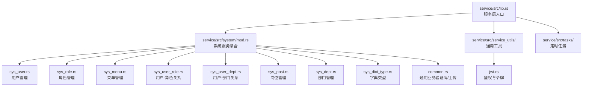
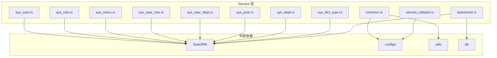
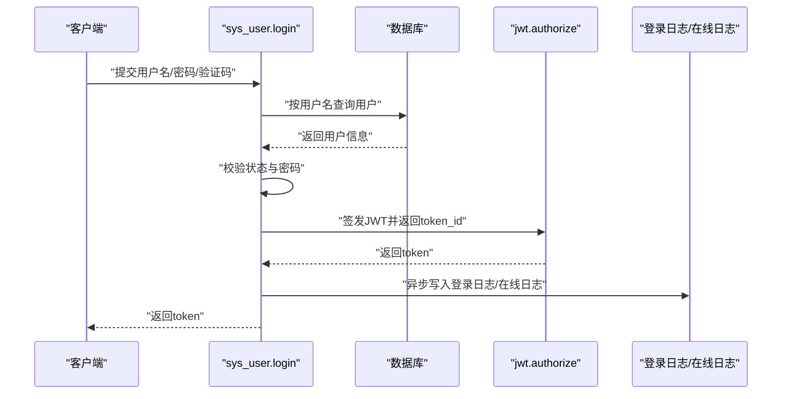
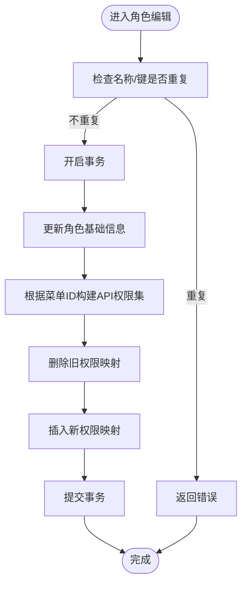
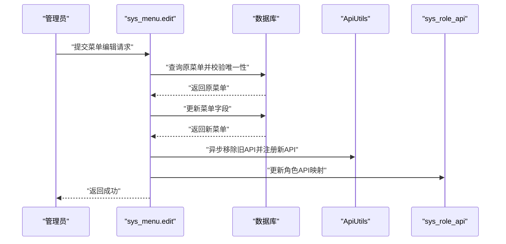
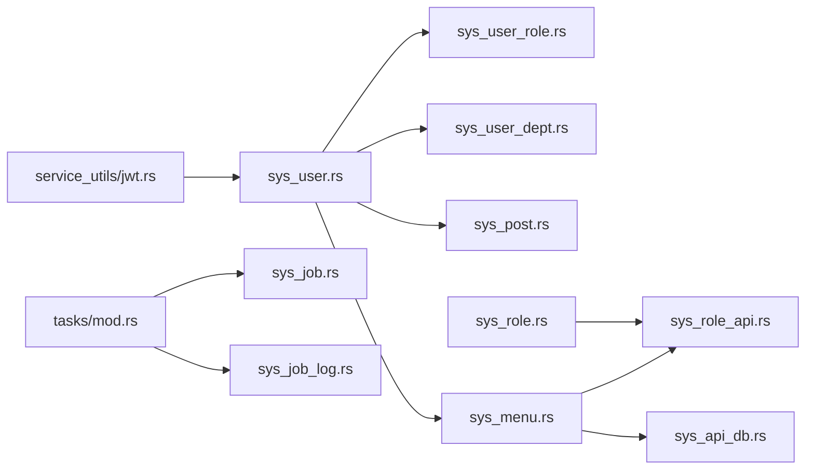

# 业务逻辑层（Service 层）

<cite>
**本文引用的文件**
- [service/Cargo.toml](file://service/Cargo.toml)
- [service/src/lib.rs](file://service/src/lib.rs)
- [service/src/system/mod.rs](file://service/src/system/mod.rs)
- [service/src/system/sys_user.rs](file://service/src/system/sys_user.rs)
- [service/src/system/sys_role.rs](file://service/src/system/sys_role.rs)
- [service/src/system/sys_menu.rs](file://service/src/system/sys_menu.rs)
- [service/src/system/sys_user_role.rs](file://service/src/system/sys_user_role.rs)
- [service/src/system/sys_user_dept.rs](file://service/src/system/sys_user_dept.rs)
- [service/src/system/sys_post.rs](file://service/src/system/sys_post.rs)
- [service/src/system/sys_dept.rs](file://service/src/system/sys_dept.rs)
- [service/src/system/sys_dict_type.rs](file://service/src/system/sys_dict_type.rs)
- [service/src/system/common.rs](file://service/src/system/common.rs)
- [service/src/service_utils/jwt.rs](file://service/src/service_utils/jwt.rs)
- [service/src/tasks/mod.rs](file://service/src/tasks/mod.rs)
</cite>

## 目录
1. [引言](#引言)
2. [项目结构](#项目结构)
3. [核心组件](#核心组件)
4. [架构总览](#架构总览)
5. [详细组件分析](#详细组件分析)
6. [依赖分析](#依赖分析)
7. [性能考虑](#性能考虑)
8. [故障排查指南](#故障排查指南)
9. [结论](#结论)
10. [附录](#附录)

## 引言
本文件面向 Axum Admin 的业务逻辑层（Service 层），系统性阐述其在整体架构中的定位与职责：封装业务规则、协调多个数据访问操作、处理复杂业务流程。文档覆盖用户管理、角色权限、菜单管理等关键服务模块，解释服务组织方式、系统服务分类、业务抽象层次，并给出接口设计原则、错误处理策略、性能优化建议与单元测试实践指导。

## 项目结构
Service 层采用按功能域划分的模块化组织方式，核心入口位于 lib.rs，系统服务统一在 system 子模块下按领域拆分，工具类集中在 service_utils，定时任务独立于系统服务之外。

图表来源
- [service/src/lib.rs](file://service/src/lib.rs#L1-L7)
- [service/src/system/mod.rs](file://service/src/system/mod.rs#L1-L43)

章节来源
- [service/src/lib.rs](file://service/src/lib.rs#L1-L7)
- [service/src/system/mod.rs](file://service/src/system/mod.rs#L1-L43)

## 核心组件
- 用户管理服务：负责用户增删改查、登录认证、密码重置、角色/部门/岗位关系维护、个人信息更新、在线状态与登录日志联动。
- 角色管理服务：负责角色增删改查、状态变更、数据范围配置、角色授权用户与取消授权。
- 菜单管理服务：负责菜单增删改查、路由树构建、角色权限映射、API 关联与缓存/日志策略配置。
- 关系服务：用户-角色、用户-部门、岗位管理等，提供批量关系维护与查询。
- 通用工具：JWT 鉴权、验证码生成、文件上传/删除等。
- 定时任务：任务注册、运行、更新与周期调度。

章节来源
- [service/src/system/sys_user.rs](file://service/src/system/sys_user.rs#L1-L649)
- [service/src/system/sys_role.rs](file://service/src/system/sys_role.rs#L1-L369)
- [service/src/system/sys_menu.rs](file://service/src/system/sys_menu.rs#L1-L499)
- [service/src/system/sys_user_role.rs](file://service/src/system/sys_user_role.rs#L1-L101)
- [service/src/system/sys_user_dept.rs](file://service/src/system/sys_user_dept.rs#L1-L57)
- [service/src/system/sys_post.rs](file://service/src/system/sys_post.rs#L1-L227)
- [service/src/system/sys_dept.rs](file://service/src/system/sys_dept.rs#L1-L214)
- [service/src/system/sys_dict_type.rs](file://service/src/system/sys_dict_type.rs#L1-L193)
- [service/src/system/common.rs](file://service/src/system/common.rs#L1-L63)
- [service/src/service_utils/jwt.rs](file://service/src/service_utils/jwt.rs#L1-L164)
- [service/src/tasks/mod.rs](file://service/src/tasks/mod.rs#L1-L92)

## 架构总览
Service 层通过 SeaORM 访问数据库，结合 configs、utils、db 等模块完成配置读取、加密随机数、实体模型与仓储交互。服务间通过函数调用协作，使用事务保证跨表一致性；对外通过统一的错误类型返回，便于上层控制器处理。

图表来源
- [service/src/system/sys_user.rs](file://service/src/system/sys_user.rs#L1-L649)
- [service/src/system/sys_role.rs](file://service/src/system/sys_role.rs#L1-L369)
- [service/src/system/sys_menu.rs](file://service/src/system/sys_menu.rs#L1-L499)
- [service/src/system/sys_user_role.rs](file://service/src/system/sys_user_role.rs#L1-L101)
- [service/src/system/sys_user_dept.rs](file://service/src/system/sys_user_dept.rs#L1-L57)
- [service/src/system/sys_post.rs](file://service/src/system/sys_post.rs#L1-L227)
- [service/src/system/sys_dept.rs](file://service/src/system/sys_dept.rs#L1-L214)
- [service/src/system/sys_dict_type.rs](file://service/src/system/sys_dict_type.rs#L1-L193)
- [service/src/system/common.rs](file://service/src/system/common.rs#L1-L63)
- [service/src/service_utils/jwt.rs](file://service/src/service_utils/jwt.rs#L1-L164)
- [service/src/tasks/mod.rs](file://service/src/tasks/mod.rs#L1-L92)

## 详细组件分析

### 用户管理服务（sys_user）
- 职责边界
  - 用户列表与分页查询、条件过滤、联合部门信息返回。
  - 用户新增/编辑：密码盐值生成与加密、角色/部门/岗位关系重建。
  - 密码管理：重置密码（管理员）、更新密码（校验旧密码）。
  - 状态与资料变更：禁用启用、个人资料更新、头像更新。
  - 登录鉴权：验证码校验、用户状态与密码校验、JWT 签发、在线日志与登录日志记录。
  - 权限查询：基于角色的菜单 API 权限集合。
- 事务与一致性
  - 新增/编辑用户时，对用户表、用户-岗位、用户-角色、用户-部门关系进行原子性更新。
- 错误处理
  - 参数缺失、用户不存在、状态异常、验证码错误、密码错误等均以统一错误返回。
- 性能优化
  - 列表查询使用分页与计数分离，避免一次性加载大量数据。
  - 登录流程中异步写入日志与在线状态，降低主流程阻塞。
- 单元测试建议
  - 覆盖登录鉴权、密码重置、角色/部门/岗位关系变更、分页查询等场景。

图表来源
- [service/src/system/sys_user.rs](file://service/src/system/sys_user.rs#L510-L568)
- [service/src/service_utils/jwt.rs](file://service/src/service_utils/jwt.rs#L105-L121)

章节来源
- [service/src/system/sys_user.rs](file://service/src/system/sys_user.rs#L26-L144)
- [service/src/system/sys_user.rs](file://service/src/system/sys_user.rs#L275-L318)
- [service/src/system/sys_user.rs](file://service/src/system/sys_user.rs#L320-L338)
- [service/src/system/sys_user.rs](file://service/src/system/sys_user.rs#L340-L359)
- [service/src/system/sys_user.rs](file://service/src/system/sys_user.rs#L361-L377)
- [service/src/system/sys_user.rs](file://service/src/system/sys_user.rs#L379-L397)
- [service/src/system/sys_user.rs](file://service/src/system/sys_user.rs#L399-L427)
- [service/src/system/sys_user.rs](file://service/src/system/sys_user.rs#L429-L442)
- [service/src/system/sys_user.rs](file://service/src/system/sys_user.rs#L444-L466)
- [service/src/system/sys_user.rs](file://service/src/system/sys_user.rs#L468-L507)
- [service/src/system/sys_user.rs](file://service/src/system/sys_user.rs#L509-L568)
- [service/src/system/sys_user.rs](file://service/src/system/sys_user.rs#L570-L583)
- [service/src/system/sys_user.rs](file://service/src/system/sys_user.rs#L585-L599)
- [service/src/system/sys_user.rs](file://service/src/system/sys_user.rs#L601-L648)

### 角色管理服务（sys_role）
- 职责边界
  - 角色列表与分页、条件过滤、状态变更、数据范围配置。
  - 角色新增：组合菜单权限为 API 权限集，批量写入角色-接口关系。
  - 角色编辑：更新基本信息，重建权限映射，支持自定义数据范围（部门范围）。
  - 授权/取消授权：批量为用户分配角色或取消角色授权。
- 事务与一致性
  - 新增/编辑角色时，对角色表、角色-接口、角色-部门（自定义数据范围）进行原子性更新。
- 错误处理
  - 名称/键重复、数据不存在、状态非法等统一错误返回。
- 性能优化
  - 权限映射通过预取菜单并构建映射表，减少多次查询。
- 单元测试建议
  - 覆盖角色 CRUD、权限映射、数据范围配置、授权/取消授权等场景。

图表来源
- [service/src/system/sys_role.rs](file://service/src/system/sys_role.rs#L186-L225)
- [service/src/system/sys_role.rs](file://service/src/system/sys_role.rs#L107-L127)

章节来源
- [service/src/system/sys_role.rs](file://service/src/system/sys_role.rs#L25-L78)
- [service/src/system/sys_role.rs](file://service/src/system/sys_role.rs#L87-L105)
- [service/src/system/sys_role.rs](file://service/src/system/sys_role.rs#L107-L127)
- [service/src/system/sys_role.rs](file://service/src/system/sys_role.rs#L129-L146)
- [service/src/system/sys_role.rs](file://service/src/system/sys_role.rs#L148-L169)
- [service/src/system/sys_role.rs](file://service/src/system/sys_role.rs#L186-L225)
- [service/src/system/sys_role.rs](file://service/src/system/sys_role.rs#L227-L243)
- [service/src/system/sys_role.rs](file://service/src/system/sys_role.rs#L245-L281)
- [service/src/system/sys_role.rs](file://service/src/system/sys_role.rs#L283-L300)
- [service/src/system/sys_role.rs](file://service/src/system/sys_role.rs#L302-L312)
- [service/src/system/sys_role.rs](file://service/src/system/sys_role.rs#L314-L335)
- [service/src/system/sys_role.rs](file://service/src/system/sys_role.rs#L336-L339)
- [service/src/system/sys_role.rs](file://service/src/system/sys_role.rs#L341-L354)
- [service/src/system/sys_role.rs](file://service/src/system/sys_role.rs#L356-L368)

### 菜单管理服务（sys_menu）
- 职责边界
  - 菜单列表与分页、条件过滤、路由树构建、API 与数据库关联查询。
  - 菜单新增/编辑：校验路径/名称唯一性、异步更新全局 API 注册与角色 API 映射。
  - 菜单删除：校验是否存在子菜单。
  - 角色权限查询：根据角色 ID 获取可访问的 API 列表与 ID 列表。
  - 日志与缓存策略：更新菜单的缓存与日志方法配置。
- 事务与一致性
  - 新增/编辑菜单时，对菜单表与 API 注册进行原子性更新。
- 错误处理
  - 路由重复、菜单不存在、存在子菜单等统一错误返回。
- 性能优化
  - 路由树构建采用递归组装，减少重复扫描。
  - API 关联查询使用子查询与 JOIN，避免 N+1。
- 单元测试建议
  - 覆盖菜单 CRUD、路由树构建、权限映射、API 关联查询等场景。

图表来源
- [service/src/system/sys_menu.rs](file://service/src/system/sys_menu.rs#L193-L244)
- [service/src/system/sys_menu.rs](file://service/src/system/sys_menu.rs#L233-L240)

章节来源
- [service/src/system/sys_menu.rs](file://service/src/system/sys_menu.rs#L21-L96)
- [service/src/system/sys_menu.rs](file://service/src/system/sys_menu.rs#L98-L128)
- [service/src/system/sys_menu.rs](file://service/src/system/sys_menu.rs#L130-L174)
- [service/src/system/sys_menu.rs](file://service/src/system/sys_menu.rs#L176-L191)
- [service/src/system/sys_menu.rs](file://service/src/system/sys_menu.rs#L193-L244)
- [service/src/system/sys_menu.rs](file://service/src/system/sys_menu.rs#L246-L256)
- [service/src/system/sys_menu.rs](file://service/src/system/sys_menu.rs#L258-L275)
- [service/src/system/sys_menu.rs](file://service/src/system/sys_menu.rs#L277-L300)
- [service/src/system/sys_menu.rs](file://service/src/system/sys_menu.rs#L302-L320)
- [service/src/system/sys_menu.rs](file://service/src/system/sys_menu.rs#L322-L356)
- [service/src/system/sys_menu.rs](file://service/src/system/sys_menu.rs#L358-L374)
- [service/src/system/sys_menu.rs](file://service/src/system/sys_menu.rs#L376-L440)
- [service/src/system/sys_menu.rs](file://service/src/system/sys_menu.rs#L442-L470)
- [service/src/system/sys_menu.rs](file://service/src/system/sys_menu.rs#L471-L498)

### 用户-角色/用户-部门/岗位关系服务
- 用户-角色：支持批量新增、删除、查询用户的角色 ID 列表与角色的用户 ID 列表。
- 用户-部门：支持批量新增、删除、查询用户所在部门 ID 列表。
- 岗位管理：提供岗位 CRUD、用户岗位关系维护与查询。
- 事务与一致性
  - 关系表的批量写入与清理在事务内执行，确保一致性。
- 错误处理
  - 参数校验与空结果处理，统一错误返回。
- 性能优化
  - 批量插入使用 insert_many，减少多次往返。
- 单元测试建议
  - 覆盖关系新增/删除/查询、批量操作等场景。

章节来源
- [service/src/system/sys_user_role.rs](file://service/src/system/sys_user_role.rs#L6-L35)
- [service/src/system/sys_user_role.rs](file://service/src/system/sys_user_role.rs#L36-L56)
- [service/src/system/sys_user_role.rs](file://service/src/system/sys_user_role.rs#L58-L66)
- [service/src/system/sys_user_role.rs](file://service/src/system/sys_user_role.rs#L68-L86)
- [service/src/system/sys_user_role.rs](file://service/src/system/sys_user_role.rs#L88-L100)
- [service/src/system/sys_user_dept.rs](file://service/src/system/sys_user_dept.rs#L6-L28)
- [service/src/system/sys_user_dept.rs](file://service/src/system/sys_user_dept.rs#L30-L38)
- [service/src/system/sys_user_dept.rs](file://service/src/system/sys_user_dept.rs#L40-L47)
- [service/src/system/sys_user_dept.rs](file://service/src/system/sys_user_dept.rs#L48-L57)
- [service/src/system/sys_post.rs](file://service/src/system/sys_post.rs#L13-L66)
- [service/src/system/sys_post.rs](file://service/src/system/sys_post.rs#L90-L115)
- [service/src/system/sys_post.rs](file://service/src/system/sys_post.rs#L117-L131)
- [service/src/system/sys_post.rs](file://service/src/system/sys_post.rs#L132-L151)
- [service/src/system/sys_post.rs](file://service/src/system/sys_post.rs#L153-L175)
- [service/src/system/sys_post.rs](file://service/src/system/sys_post.rs#L176-L187)
- [service/src/system/sys_post.rs](file://service/src/system/sys_post.rs#L188-L200)
- [service/src/system/sys_post.rs](file://service/src/system/sys_post.rs#L201-L208)
- [service/src/system/sys_post.rs](file://service/src/system/sys_post.rs#L209-L227)

### 部门与字典类型服务
- 部门管理：提供部门 CRUD、树形结构构建、角色授权部门查询。
- 字典类型：提供字典类型 CRUD、与字典数据关联校验、删除保护。
- 事务与一致性
  - 删除前进行关联校验，必要时回滚。
- 错误处理
  - 关联存在、参数缺失、数据不存在等统一错误返回。
- 性能优化
  - 树构建采用递归算法，时间复杂度 O(n)。
- 单元测试建议
  - 覆盖树构建、关联删除保护、CRUD 场景。

章节来源
- [service/src/system/sys_dept.rs](file://service/src/system/sys_dept.rs#L16-L69)
- [service/src/system/sys_dept.rs](file://service/src/system/sys_dept.rs#L71-L83)
- [service/src/system/sys_dept.rs](file://service/src/system/sys_dept.rs#L85-L107)
- [service/src/system/sys_dept.rs](file://service/src/system/sys_dept.rs#L109-L117)
- [service/src/system/sys_dept.rs](file://service/src/system/sys_dept.rs#L119-L149)
- [service/src/system/sys_dept.rs](file://service/src/system/sys_dept.rs#L151-L164)
- [service/src/system/sys_dept.rs](file://service/src/system/sys_dept.rs#L166-L176)
- [service/src/system/sys_dept.rs](file://service/src/system/sys_dept.rs#L177-L201)
- [service/src/system/sys_dept.rs](file://service/src/system/sys_dept.rs#L203-L213)
- [service/src/system/sys_dict_type.rs](file://service/src/system/sys_dict_type.rs#L16-L63)
- [service/src/system/sys_dict_type.rs](file://service/src/system/sys_dict_type.rs#L64-L73)
- [service/src/system/sys_dict_type.rs](file://service/src/system/sys_dict_type.rs#L75-L98)
- [service/src/system/sys_dict_type.rs](file://service/src/system/sys_dict_type.rs#L100-L148)
- [service/src/system/sys_dict_type.rs](file://service/src/system/sys_dict_type.rs#L150-L163)
- [service/src/system/sys_dict_type.rs](file://service/src/system/sys_dict_type.rs#L165-L180)
- [service/src/system/sys_dict_type.rs](file://service/src/system/sys_dict_type.rs#L182-L192)

### 通用工具与鉴权
- 验证码：生成带 UUID 的图片验证码，供登录使用。
- 文件上传：支持多部分表单解析、类型识别、目录创建、文件写入与旧文件删除。
- JWT：令牌签发、解码、过期与失效校验、从请求头提取令牌、在线状态校验。

章节来源
- [service/src/system/common.rs](file://service/src/system/common.rs#L8-L17)
- [service/src/system/common.rs](file://service/src/system/common.rs#L28-L51)
- [service/src/system/common.rs](file://service/src/system/common.rs#L53-L62)
- [service/src/service_utils/jwt.rs](file://service/src/service_utils/jwt.rs#L20-L38)
- [service/src/service_utils/jwt.rs](file://service/src/service_utils/jwt.rs#L54-L94)
- [service/src/service_utils/jwt.rs](file://service/src/service_utils/jwt.rs#L96-L103)
- [service/src/service_utils/jwt.rs](file://service/src/service_utils/jwt.rs#L105-L121)
- [service/src/service_utils/jwt.rs](file://service/src/service_utils/jwt.rs#L123-L145)
- [service/src/service_utils/jwt.rs](file://service/src/service_utils/jwt.rs#L147-L163)

### 定时任务
- 职责边界
  - 任务初始化：从数据库加载有效任务并注册到运行器。
  - 任务运行：支持周期任务添加、更新、删除与下次运行时间计算。
  - 任务模型：包含运行批次、次数、结束时间与 SysJobModel。
- 依赖关系
  - 依赖 db 模块获取数据库连接，依赖 system 模块查询任务。
- 错误处理
  - 任务初始化失败、任务更新失败等统一错误返回。
- 性能优化
  - 使用懒加载存储任务模型，避免重复初始化。
- 单元测试建议
  - 覆盖任务初始化、运行、更新、删除等场景。

章节来源
- [service/src/tasks/mod.rs](file://service/src/tasks/mod.rs#L20-L33)
- [service/src/tasks/mod.rs](file://service/src/tasks/mod.rs#L35-L59)
- [service/src/tasks/mod.rs](file://service/src/tasks/mod.rs#L72-L80)
- [service/src/tasks/mod.rs](file://service/src/tasks/mod.rs#L82-L91)

## 依赖分析
- 模块耦合
  - system 子模块内部通过函数调用协作，如用户服务调用关系服务与菜单服务获取权限。
  - service_utils 作为工具层被所有业务服务复用。
  - tasks 独立于 system，通过 db 与 system 交互。
- 外部依赖
  - SeaORM 提供 ORM 能力，configs 提供配置，utils 提供加密与随机数，jsonwebtoken 提供 JWT 支持。
- 循环依赖
  - 未发现直接循环依赖；关系服务在业务服务内部被调用，属于单向依赖。

图表来源
- [service/src/system/sys_user.rs](file://service/src/system/sys_user.rs#L1-L649)
- [service/src/system/sys_role.rs](file://service/src/system/sys_role.rs#L1-L369)
- [service/src/system/sys_menu.rs](file://service/src/system/sys_menu.rs#L1-L499)
- [service/src/system/sys_user_role.rs](file://service/src/system/sys_user_role.rs#L1-L101)
- [service/src/system/sys_user_dept.rs](file://service/src/system/sys_user_dept.rs#L1-L57)
- [service/src/system/sys_post.rs](file://service/src/system/sys_post.rs#L1-L227)
- [service/src/service_utils/jwt.rs](file://service/src/service_utils/jwt.rs#L1-L164)
- [service/src/tasks/mod.rs](file://service/src/tasks/mod.rs#L1-L92)

章节来源
- [service/src/system/mod.rs](file://service/src/system/mod.rs#L1-L43)
- [service/src/lib.rs](file://service/src/lib.rs#L1-L7)

## 性能考虑
- 事务批处理
  - 用户新增/编辑、角色编辑、岗位/部门关系维护均采用事务包裹，批量写入关系表，减少往返与锁竞争。
- 查询优化
  - 列表查询使用分页与计数分离，避免大结果集。
  - 路由树构建与菜单权限查询使用子查询与 JOIN，减少 N+1。
- 异步日志
  - 登录与在线状态写入采用异步任务，降低主流程延迟。
- 缓存与日志策略
  - 菜单支持缓存与日志方法配置，便于前端与后端协同优化。

## 故障排查指南
- 登录失败
  - 检查验证码是否匹配、用户状态是否启用、密码是否正确。
  - 查看登录日志与在线日志是否写入成功。
- 权限不足
  - 校验角色是否为超级管理员或是否具备对应 API 权限。
  - 检查菜单与角色 API 映射是否正确。
- 数据不一致
  - 确认事务是否正确提交，关系表是否同步更新。
- 文件上传失败
  - 检查上传目录权限、文件类型与大小限制、旧文件删除是否成功。
- 定时任务异常
  - 检查任务初始化是否成功、任务模型是否正确注册、下次运行时间是否计算正确。

章节来源
- [service/src/system/sys_user.rs](file://service/src/system/sys_user.rs#L509-L568)
- [service/src/system/sys_menu.rs](file://service/src/system/sys_menu.rs#L322-L356)
- [service/src/system/sys_user_role.rs](file://service/src/system/sys_user_role.rs#L6-L35)
- [service/src/system/common.rs](file://service/src/system/common.rs#L28-L51)
- [service/src/tasks/mod.rs](file://service/src/tasks/mod.rs#L35-L59)

## 结论
Axum Admin 的 Service 层通过清晰的模块划分与严格的事务控制，实现了用户、角色、菜单等核心领域的业务封装。服务间通过函数调用协作，配合工具层与定时任务模块，形成稳定高效的业务逻辑层。遵循本文的接口设计原则、错误处理策略与性能优化建议，可进一步提升系统的可维护性与扩展性。

## 附录
- 服务接口设计原则
  - 单一职责：每个服务聚焦一个业务域。
  - 事务边界：跨表写入必须在事务内完成。
  - 参数校验：前置校验，尽早失败。
  - 错误统一：使用 Result 返回错误，便于上层处理。
- 单元测试实践
  - 针对事务性操作编写集成测试，覆盖正常与异常分支。
  - 对热点查询与权限映射进行性能回归测试。
  - 对异步日志与定时任务进行行为验证。