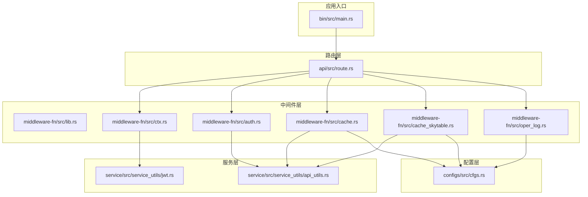
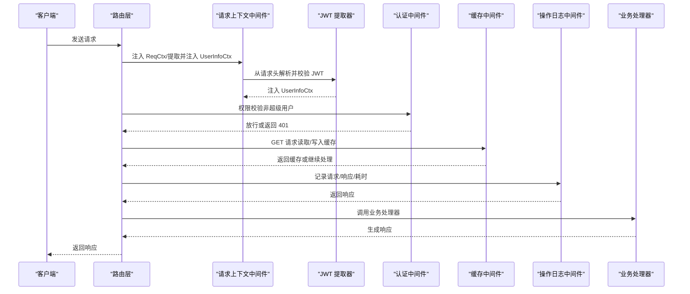
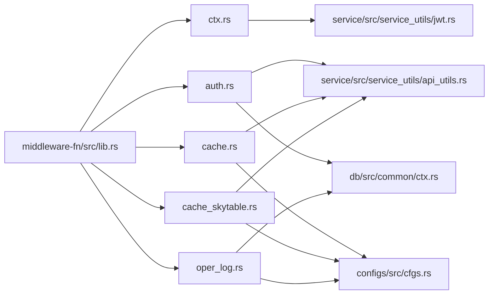

# 中间件层

<cite>
**本文引用的文件**
- [lib.rs](file://middleware-fn/src/lib.rs)
- [auth.rs](file://middleware-fn/src/auth.rs)
- [cache.rs](file://middleware-fn/src/cache.rs)
- [cache_skytable.rs](file://middleware-fn/src/cache_skytable.rs)
- [ctx.rs](file://middleware-fn/src/ctx.rs)
- [oper_log.rs](file://middleware-fn/src/oper_log.rs)
- [jwt.rs](file://service/src/service_utils/jwt.rs)
- [api_utils.rs](file://service/src/service_utils/api_utils.rs)
- [cfgs.rs](file://configs/src/cfgs.rs)
- [Cargo.toml（中间件）](file://middleware-fn/Cargo.toml)
- [route.rs](file://api/src/route.rs)
- [main.rs](file://bin/src/main.rs)
- [ctx.rs（数据库公共上下文）](file://db/src/common/ctx.rs)
</cite>

## 目录
1. [简介](#简介)
2. [项目结构](#项目结构)
3. [核心组件](#核心组件)
4. [架构总览](#架构总览)
5. [组件详解](#组件详解)
6. [依赖关系分析](#依赖关系分析)
7. [性能考量](#性能考量)
8. [故障排查指南](#故障排查指南)
9. [结论](#结论)
10. [附录](#附录)

## 简介
本章节面向 Axum Admin 的中间件层，系统性阐述其作为横切关注点的架构设计与实现要点。重点覆盖以下方面：
- 认证中间件：基于 JWT 的令牌解析、在线状态校验与权限判定
- 缓存中间件：内存缓存与 SkyTable 分布式缓存两种实现，支持按 API 维度与数据维度的缓存策略
- 操作日志中间件：统一记录请求/响应、耗时、状态码与错误信息，并可落盘或入库
- 请求上下文中间件：统一注入 ReqCtx、提取并注入 UserInfoCtx
- 中间件执行顺序、请求处理链与错误传播机制
- 配置项与特性开关、自定义中间件开发指南、性能监控与调试技巧
- 中间件与各层的交互方式、依赖注入机制与最佳实践

## 项目结构
中间件层位于 middleware-fn 子工程，通过 re-export 对外暴露统一别名，供上层路由装配使用；路由层在 api 模块中按模块与功能装配中间件；认证与权限校验逻辑位于 service 层的 jwt 与 api_utils 工具中；配置项集中在 configs 模块。

图表来源
- [main.rs](file://bin/src/main.rs#L54-L56)
- [route.rs](file://api/src/route.rs#L33-L53)
- [lib.rs](file://middleware-fn/src/lib.rs#L16-L22)
- [ctx.rs](file://middleware-fn/src/ctx.rs#L13-L51)
- [auth.rs](file://middleware-fn/src/auth.rs#L6-L24)
- [cache.rs](file://middleware-fn/src/cache.rs#L126-L193)
- [cache_skytable.rs](file://middleware-fn/src/cache_skytable.rs#L160-L227)
- [oper_log.rs](file://middleware-fn/src/oper_log.rs#L21-L42)
- [jwt.rs](file://service/src/service_utils/jwt.rs#L54-L94)
- [api_utils.rs](file://service/src/service_utils/api_utils.rs#L83-L118)
- [cfgs.rs](file://configs/src/cfgs.rs#L24-L42)

章节来源
- [lib.rs](file://middleware-fn/src/lib.rs#L1-L23)
- [route.rs](file://api/src/route.rs#L12-L54)
- [main.rs](file://bin/src/main.rs#L54-L56)

## 核心组件
- 请求上下文中间件（Ctx）：收集原始 URI、规范化路径、方法、查询参数、请求体，注入 ReqCtx；同时从请求头中解析 JWT 并注入 UserInfoCtx
- 认证中间件（ApiAuth）：对非超级用户，基于 API 路由表与用户角色进行权限校验
- 缓存中间件（Cache/SkyTableCache）：按配置与 API 配置决定是否启用缓存，支持按用户区分键或共享键，支持相关 API 清理
- 操作日志中间件（OperLog）：统一记录请求上下文、响应结果、耗时、状态与错误信息，支持文件与数据库双写

章节来源
- [ctx.rs](file://middleware-fn/src/ctx.rs#L13-L51)
- [auth.rs](file://middleware-fn/src/auth.rs#L6-L24)
- [cache.rs](file://middleware-fn/src/cache.rs#L126-L193)
- [cache_skytable.rs](file://middleware-fn/src/cache_skytable.rs#L160-L227)
- [oper_log.rs](file://middleware-fn/src/oper_log.rs#L21-L42)

## 架构总览
中间件层采用“函数式中间件”模式，围绕 ReqCtx 与 UserInfoCtx 两个上下文对象串联起认证、缓存与日志三大横切关注点。路由层根据配置动态装配中间件，形成稳定的请求处理链。

图表来源
- [route.rs](file://api/src/route.rs#L33-L53)
- [ctx.rs](file://middleware-fn/src/ctx.rs#L13-L51)
- [jwt.rs](file://service/src/service_utils/jwt.rs#L54-L94)
- [auth.rs](file://middleware-fn/src/auth.rs#L6-L24)
- [cache.rs](file://middleware-fn/src/cache.rs#L126-L193)
- [oper_log.rs](file://middleware-fn/src/oper_log.rs#L21-L42)

## 组件详解

### 请求上下文中间件（Ctx）
职责
- 从 OriginalUri 或 URI 中解析原始路径，去除 API 前缀，得到规范化路径
- 读取请求体为字符串，便于后续中间件与业务处理使用
- 注入 ReqCtx 到请求扩展
- 从请求头中解析 Authorization Bearer，解码 JWT，校验在线状态，注入 UserInfoCtx

关键行为
- 请求体读取失败时返回 400 错误
- 未获取到 UserInfoCtx 时仍继续传递，交由后续中间件处理
- 统一将原始 URI 与规范化路径注入 ReqCtx，便于日志与缓存键生成

章节来源
- [ctx.rs](file://middleware-fn/src/ctx.rs#L13-L51)
- [ctx.rs（数据库公共上下文）](file://db/src/common/ctx.rs#L1-L33)
- [jwt.rs](file://service/src/service_utils/jwt.rs#L54-L94)

### 认证中间件（ApiAuth）
职责
- 若当前用户为超级用户，直接放行
- 若 API 在路由表中，进一步校验用户对该 API 与方法的权限
- 权限不足返回 401

关键行为
- 通过 ApiUtils::is_in 判断 API 是否受控
- 通过 ApiUtils::check_api_permission 校验用户角色与 API 方法的绑定关系
- 与配置项 CFG.system.super_user 协作，实现超级用户豁免

章节来源
- [auth.rs](file://middleware-fn/src/auth.rs#L6-L24)
- [api_utils.rs](file://service/src/service_utils/api_utils.rs#L83-L118)
- [cfgs.rs](file://configs/src/cfgs.rs#L66-L72)

### 缓存中间件（Cache 与 SkyTableCache）
职责
- 对 GET 请求按 API 配置决定是否启用缓存
- 支持两种键策略：共享键或按用户区分键
- 写入缓存：仅在响应状态为 OK 时缓存响应体 JSON 字符串
- 清理缓存：对非 GET 请求，若响应状态为 OK，清理受影响的相关 API 缓存

实现差异
- 内存缓存（cache.rs）
  - 使用全局 HashMap 与 BTreeMap 维护缓存数据与索引
  - 定时清理过期索引，按索引移除对应数据
- SkyTable 缓存（cache_skytable.rs）
  - 使用 SkyTable 异步连接池，提供 set/update/get/del
  - 通过索引映射与过期轮询机制实现缓存生命周期管理

章节来源
- [cache.rs](file://middleware-fn/src/cache.rs#L126-L193)
- [cache_skytable.rs](file://middleware-fn/src/cache_skytable.rs#L160-L227)
- [cfgs.rs](file://configs/src/cfgs.rs#L24-L42)

### 操作日志中间件（OperLog）
职责
- 在请求进入后记录开始时间，调用下游处理器，结束后计算耗时
- 依据 API 配置与全局开关决定日志输出方式：文件、数据库或两者
- 将用户在线状态、请求/响应数据、错误信息、耗时等统一记录

关键行为
- 通过 CFG.log.enable_oper_log 控制是否启用
- 通过 ApiInfo.log_method 决定日志策略
- 异步落盘/入库，避免阻塞请求链路

章节来源
- [oper_log.rs](file://middleware-fn/src/oper_log.rs#L21-L103)
- [cfgs.rs](file://configs/src/cfgs.rs#L84-L94)

### 中间件装配与执行顺序
路由层在不同模块下按如下顺序装配中间件：
- 操作日志中间件（按配置可选）
- 缓存中间件（按配置可选，支持内存或 SkyTable）
- 认证中间件
- 请求上下文中间件
- JWT 提取器（从请求头解析并校验）

顺序的重要性
- 上述顺序确保：先注入上下文，再进行权限校验；缓存只对 GET 生效且在权限之后；日志记录在最外层以捕获完整信息

章节来源
- [route.rs](file://api/src/route.rs#L33-L53)

## 依赖关系分析
中间件层与各层的耦合关系如下：
- 与服务层（jwt、api_utils）：认证与权限校验依赖 JWT 解析与 API 路由表
- 与配置层（cfgs）：缓存时间、缓存方式、日志开关、SkyTable 地址与端口
- 与数据库层（db）：日志入库依赖数据库连接与实体模型

图表来源
- [lib.rs](file://middleware-fn/src/lib.rs#L16-L22)
- [ctx.rs](file://middleware-fn/src/ctx.rs#L1-L10)
- [auth.rs](file://middleware-fn/src/auth.rs#L1-L5)
- [cache.rs](file://middleware-fn/src/cache.rs#L1-L19)
- [cache_skytable.rs](file://middleware-fn/src/cache_skytable.rs#L1-L21)
- [oper_log.rs](file://middleware-fn/src/oper_log.rs#L1-L19)
- [jwt.rs](file://service/src/service_utils/jwt.rs#L1-L18)
- [api_utils.rs](file://service/src/service_utils/api_utils.rs#L1-L14)
- [cfgs.rs](file://configs/src/cfgs.rs#L1-L22)
- [ctx.rs（数据库公共上下文）](file://db/src/common/ctx.rs#L1-L9)

章节来源
- [Cargo.toml（中间件）](file://middleware-fn/Cargo.toml#L9-L25)

## 性能考量
- 缓存策略
  - 仅对 GET 请求生效，避免并发写入竞争
  - 支持按用户区分键，防止跨用户数据污染
  - 内存缓存与 SkyTable 缓存均提供过期轮询与相关 API 清理，降低脏读风险
- 日志
  - 操作日志异步写入，避免阻塞请求链路
  - 可配置日志开关与日志级别，减少生产环境开销
- 请求体读取
  - 将请求体读取为字符串，便于日志与缓存，但需注意大体积请求的内存占用
- 并发与锁
  - 缓存中间件使用 Mutex 保护全局索引与数据，注意在高频场景下的锁竞争

[本节为通用性能建议，不直接分析具体文件]

## 故障排查指南
- 认证失败（401）
  - 检查 JWT 是否过期或被挤掉（在线校验失败）
  - 确认 API 是否在路由表中，以及用户角色是否具备对应方法的访问权限
- 缓存异常
  - 内存缓存：确认缓存时间与键策略配置，检查过期轮询是否正常
  - SkyTable 缓存：确认连接池初始化与 flushdb 行为，检查索引映射与数据键一致性
- 日志缺失
  - 检查 CFG.log.enable_oper_log 与 API 配置的 log_method
  - 确认日志文件路径与权限
- 请求体为空
  - 检查请求体读取逻辑与 Content-Type，确认是否为二进制数据导致无法 UTF-8 解码

章节来源
- [jwt.rs](file://service/src/service_utils/jwt.rs#L64-L94)
- [api_utils.rs](file://service/src/service_utils/api_utils.rs#L90-L118)
- [cache.rs](file://middleware-fn/src/cache.rs#L36-L58)
- [cache_skytable.rs](file://middleware-fn/src/cache_skytable.rs#L50-L76)
- [oper_log.rs](file://middleware-fn/src/oper_log.rs#L57-L103)

## 结论
中间件层通过清晰的职责划分与可插拔的装配方式，将认证、缓存与日志三大横切关注点有机整合。结合配置层的灵活开关与服务层的权限与 JWT 能力，实现了高可用、可观测与高性能的请求处理链。建议在生产环境中合理配置缓存与日志策略，并持续监控中间件的资源占用与错误率。

[本节为总结性内容，不直接分析具体文件]

## 附录

### 中间件执行顺序与错误传播
- 执行顺序
  - Ctx → JWT 提取器 → ApiAuth → Cache/SkyTableCache → OperLog → Handler
- 错误传播
  - 认证失败返回 401
  - 请求体读取失败返回 400
  - 其余错误由下游处理器或默认错误处理返回

章节来源
- [route.rs](file://api/src/route.rs#L33-L53)
- [ctx.rs](file://middleware-fn/src/ctx.rs#L54-L73)
- [auth.rs](file://middleware-fn/src/auth.rs#L18-L20)

### 配置项与特性开关
- 服务器配置（Server）
  - cache_time：缓存过期时间（秒）
  - cache_method：缓存方式（0=内存，1=SkyTable）
  - api_prefix：API 前缀
- 日志配置（Log）
  - enable_oper_log：是否启用操作日志
- SkyTable 配置（SkyTable）
  - server/port：SkyTable 服务地址与端口
- 特性开关（中间件 Cargo.toml）
  - cache-mem：启用内存缓存
  - cache-skytable：启用 SkyTable 缓存

章节来源
- [cfgs.rs](file://configs/src/cfgs.rs#L24-L42)
- [cfgs.rs](file://configs/src/cfgs.rs#L84-L94)
- [cfgs.rs](file://configs/src/cfgs.rs#L104-L110)
- [Cargo.toml（中间件）](file://middleware-fn/Cargo.toml#L27-L39)

### 自定义中间件开发指南
- 设计原则
  - 保持无状态，避免在中间件内持久化业务数据
  - 明确职责边界，尽量单一职责
  - 使用扩展（extensions）传递上下文，避免全局状态
- 实现步骤
  - 定义函数式中间件：接收 Request 与 Next，返回 Result<Response, StatusCode/错误元组>
  - 在路由层按需装配，遵循“外层记录、内层鉴权”的顺序
  - 通过配置项控制开关，避免在生产环境引入不必要的开销
- 性能与安全
  - 异步写入日志与缓存，避免阻塞请求链
  - 对敏感操作进行权限校验与审计

[本节为通用开发建议，不直接分析具体文件]