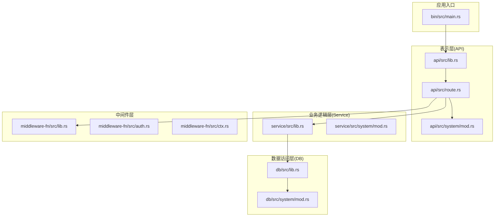
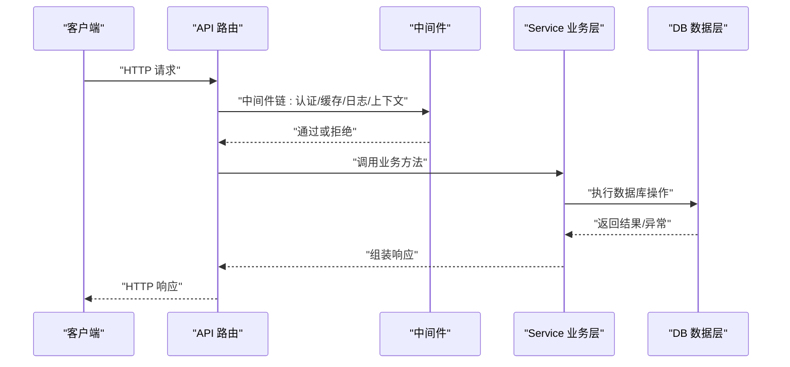
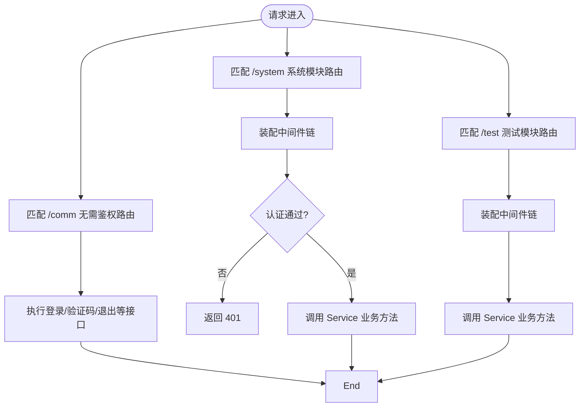
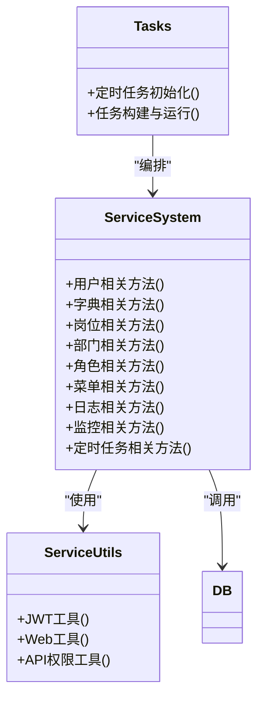
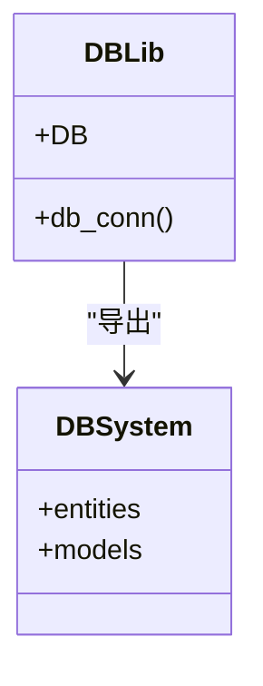
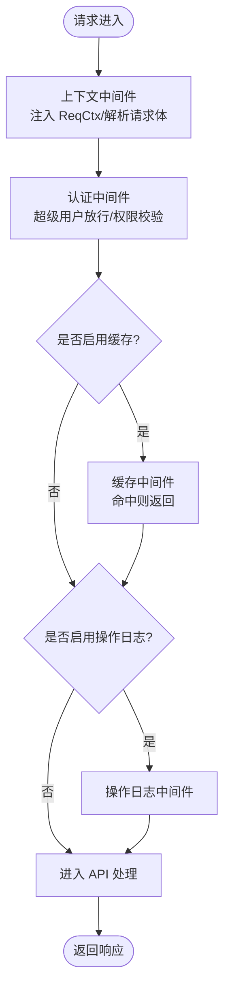
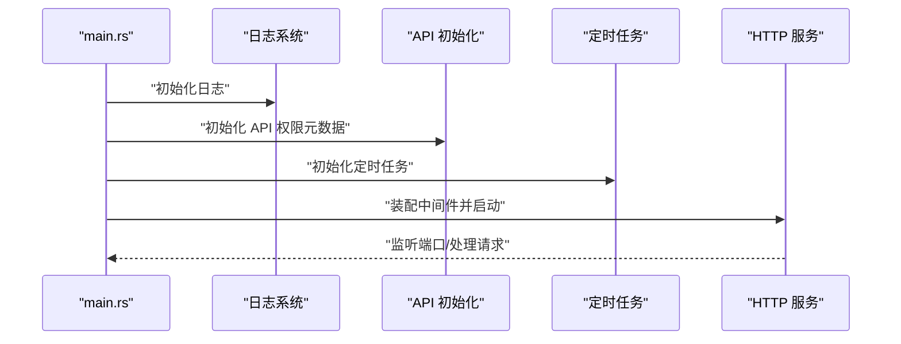
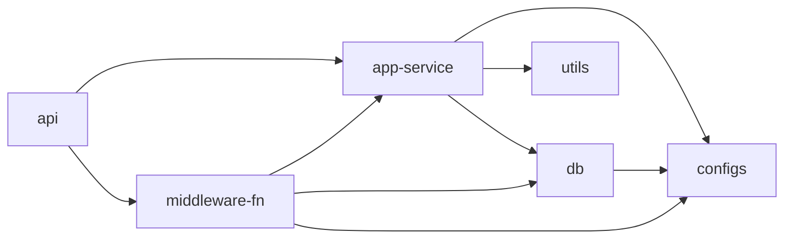

# 分层架构设计

<cite>
**本文引用的文件**
- [Cargo.toml](file://Cargo.toml)
- [api/src/lib.rs](file://api/src/lib.rs)
- [api/src/route.rs](file://api/src/route.rs)
- [api/src/system/mod.rs](file://api/src/system/mod.rs)
- [service/src/lib.rs](file://service/src/lib.rs)
- [service/src/system/mod.rs](file://service/src/system/mod.rs)
- [db/src/lib.rs](file://db/src/lib.rs)
- [db/src/system/mod.rs](file://db/src/system/mod.rs)
- [middleware-fn/src/lib.rs](file://middleware-fn/src/lib.rs)
- [middleware-fn/src/auth.rs](file://middleware-fn/src/auth.rs)
- [middleware-fn/src/ctx.rs](file://middleware-fn/src/ctx.rs)
- [bin/src/main.rs](file://bin/src/main.rs)
- [api/Cargo.toml](file://api/Cargo.toml)
- [service/Cargo.toml](file://service/Cargo.toml)
- [db/Cargo.toml](file://db/Cargo.toml)
- [middleware-fn/Cargo.toml](file://middleware-fn/Cargo.toml)
</cite>

## 目录
1. [引言](#引言)
2. [项目结构](#项目结构)
3. [核心组件](#核心组件)
4. [架构总览](#架构总览)
5. [详细组件分析](#详细组件分析)
6. [依赖关系分析](#依赖关系分析)
7. [性能考量](#性能考量)
8. [故障排查指南](#故障排查指南)
9. [结论](#结论)

## 引言
本文件系统性阐述 Axum Admin 的四层架构设计与实现：表示层（API 层）、业务逻辑层（Service 层）、数据访问层（DB 层）、中间件层。文档重点说明各层职责边界、依赖关系、数据流向、层间通信机制、错误传播策略以及性能优化要点，并通过图示展示实际代码映射关系。

## 项目结构
项目采用工作区多 crate 组织，按功能与层次划分模块：
- 表示层（API 层）：负责 HTTP 请求处理、路由分发与中间件装配
- 业务逻辑层（Service 层）：封装核心业务规则与流程编排
- 数据访问层（DB 层）：封装数据库连接、实体与模型
- 中间件层（Middleware）：提供认证、缓存、日志等横切能力
- 工具与配置：统一配置加载、环境初始化、日志与任务调度

图表来源
- [bin/src/main.rs](file://bin/src/main.rs#L73-L73)
- [api/src/lib.rs](file://api/src/lib.rs#L9-L9)
- [api/src/route.rs](file://api/src/route.rs#L12-L22)
- [service/src/lib.rs](file://service/src/lib.rs#L1-L7)
- [db/src/lib.rs](file://db/src/lib.rs#L6-L8)
- [middleware-fn/src/lib.rs](file://middleware-fn/src/lib.rs#L15-L23)

章节来源
- [Cargo.toml](file://Cargo.toml#L1-L12)
- [api/src/lib.rs](file://api/src/lib.rs#L1-L10)
- [service/src/lib.rs](file://service/src/lib.rs#L1-L7)
- [db/src/lib.rs](file://db/src/lib.rs#L1-L8)
- [middleware-fn/src/lib.rs](file://middleware-fn/src/lib.rs#L1-L23)
- [bin/src/main.rs](file://bin/src/main.rs#L1-L129)

## 核心组件
- 表示层（API 层）
  - 负责路由注册、HTTP 方法绑定、静态资源服务、无须鉴权与需要鉴权的接口分组
  - 通过中间件装配实现认证、缓存、操作日志、请求上下文注入
- 业务逻辑层（Service 层）
  - 提供系统模块的业务方法，协调 DB 层与工具模块，执行领域规则
  - 支持定时任务初始化与 API 权限元数据管理
- 数据访问层（DB 层）
  - 封装 SeaORM 连接与实体/模型，提供统一的数据库访问入口
  - 按模块导出实体与模型，便于上层调用
- 中间件层
  - 认证中间件：基于路径与方法校验 API 权限
  - 上下文中间件：提取请求上下文、解析请求体、注入扩展
  - 缓存中间件：支持内存与 SkyTable 两种缓存实现
  - 操作日志中间件：可选的操作日志记录

章节来源
- [api/src/route.rs](file://api/src/route.rs#L12-L69)
- [service/src/system/mod.rs](file://service/src/system/mod.rs#L1-L43)
- [db/src/system/mod.rs](file://db/src/system/mod.rs#L1-L13)
- [middleware-fn/src/auth.rs](file://middleware-fn/src/auth.rs#L1-L25)
- [middleware-fn/src/ctx.rs](file://middleware-fn/src/ctx.rs#L1-L74)

## 架构总览
Axum Admin 的分层架构以“请求驱动”为核心：请求从 API 层进入，经中间件处理后交由 Service 层执行业务逻辑，Service 层再调用 DB 层完成数据持久化，最终返回响应。错误在各层之间逐级传播，由上层捕获或由中间件统一处理。

图表来源
- [api/src/route.rs](file://api/src/route.rs#L33-L54)
- [middleware-fn/src/auth.rs](file://middleware-fn/src/auth.rs#L6-L24)
- [middleware-fn/src/ctx.rs](file://middleware-fn/src/ctx.rs#L13-L51)
- [service/src/system/mod.rs](file://service/src/system/mod.rs#L1-L43)
- [db/src/system/mod.rs](file://db/src/system/mod.rs#L1-L13)

## 详细组件分析

### 表示层（API 层）分析
- 路由组织
  - 无须鉴权接口：登录、验证码、退出登录等
  - 系统模块接口：用户、字典、岗位、部门、角色、菜单、日志、监控等
  - 测试模块接口：用于开发与调试
- 中间件装配
  - 可选操作日志中间件
  - 可选缓存中间件（内存或 SkyTable）
  - 必要的认证中间件、上下文中间件、JWT 提取器
- 静态资源与回退
  - 文件上传目录服务
  - 前端静态资源服务与 404 回退

图表来源
- [api/src/route.rs](file://api/src/route.rs#L12-L69)
- [api/src/system/mod.rs](file://api/src/system/mod.rs#L26-L44)

章节来源
- [api/src/route.rs](file://api/src/route.rs#L12-L69)
- [api/src/system/mod.rs](file://api/src/system/mod.rs#L1-L199)

### 业务逻辑层（Service 层）分析
- 模块划分
  - 系统模块：用户、字典、岗位、部门、角色、菜单、日志、监控、定时任务等
  - 工具模块：JWT、Web 工具、API 权限工具等
  - 任务模块：定时任务初始化与运行
- 职责边界
  - Service 层仅编排业务流程，不做 HTTP 处理
  - 通过 DB 层完成数据持久化，必要时调用工具模块
- 关键入口
  - 业务方法导出供 API 层调用
  - 定时任务初始化入口

图表来源
- [service/src/system/mod.rs](file://service/src/system/mod.rs#L1-L43)
- [service/src/lib.rs](file://service/src/lib.rs#L1-L7)

章节来源
- [service/src/system/mod.rs](file://service/src/system/mod.rs#L1-L43)
- [service/src/lib.rs](file://service/src/lib.rs#L1-L7)

### 数据访问层（DB 层）分析
- 结构
  - common：公共上下文、客户端、响应封装等
  - system：系统模块的实体与模型
  - db：数据库连接与全局 DB 实例
- 职责
  - 统一数据库连接与事务
  - 导出实体与模型供 Service 层使用
- 特性
  - 支持多种数据库后端（PostgreSQL、MySQL、SQLite）

图表来源
- [db/src/lib.rs](file://db/src/lib.rs#L6-L8)
- [db/src/system/mod.rs](file://db/src/system/mod.rs#L1-L13)

章节来源
- [db/src/lib.rs](file://db/src/lib.rs#L1-L8)
- [db/src/system/mod.rs](file://db/src/system/mod.rs#L1-L13)

### 中间件层（Middleware）分析
- 认证中间件（ApiAuth）
  - 读取请求上下文与用户信息
  - 超级用户放行
  - 对受控 API 路径进行权限校验
- 上下文中间件（Ctx）
  - 注入原始 URI、路径、方法、查询参数
  - 解析请求体为字符串或提示二进制数据
  - 将上下文写入请求扩展
- 缓存中间件（Cache/SkyTableCache）
  - 根据配置选择内存或 SkyTable 缓存
  - 针对 GET 请求进行缓存命中与回填
- 操作日志中间件（OperLog）
  - 可选启用，记录操作日志

图表来源
- [middleware-fn/src/ctx.rs](file://middleware-fn/src/ctx.rs#L13-L51)
- [middleware-fn/src/auth.rs](file://middleware-fn/src/auth.rs#L6-L24)
- [middleware-fn/src/lib.rs](file://middleware-fn/src/lib.rs#L15-L23)

章节来源
- [middleware-fn/src/auth.rs](file://middleware-fn/src/auth.rs#L1-L25)
- [middleware-fn/src/ctx.rs](file://middleware-fn/src/ctx.rs#L1-L74)
- [middleware-fn/src/lib.rs](file://middleware-fn/src/lib.rs#L1-L23)

### 应用启动与全局初始化
- 日志初始化：控制台与文件双通道输出，支持格式与级别动态配置
- API 全局初始化：加载所有 API 权限元数据
- 定时任务初始化：启动后台任务调度
- 中间件装配：CORS、GZIP、静态资源服务、TLS
- 优雅关闭：信号监听与平滑关闭

图表来源
- [bin/src/main.rs](file://bin/src/main.rs#L25-L96)

章节来源
- [bin/src/main.rs](file://bin/src/main.rs#L1-L129)

## 依赖关系分析
- 工作区与特性
  - 工作区统一版本与依赖
  - 各模块通过 Cargo.toml 明确依赖关系与特性开关
- 层间依赖
  - API 依赖 Service 与 Middleware
  - Service 依赖 DB 与 Utils
  - Middleware 依赖 Service 与 DB
- 数据库特性
  - DB 与 Middleware 均支持多数据库后端特性

图表来源
- [api/Cargo.toml](file://api/Cargo.toml#L1-L39)
- [service/Cargo.toml](file://service/Cargo.toml#L9-L32)
- [db/Cargo.toml](file://db/Cargo.toml#L9-L19)
- [middleware-fn/Cargo.toml](file://middleware-fn/Cargo.toml#L9-L25)

章节来源
- [Cargo.toml](file://Cargo.toml#L1-L12)
- [api/Cargo.toml](file://api/Cargo.toml#L1-L39)
- [service/Cargo.toml](file://service/Cargo.toml#L1-L39)
- [db/Cargo.toml](file://db/Cargo.toml#L1-L25)
- [middleware-fn/Cargo.toml](file://middleware-fn/Cargo.toml#L1-L39)

## 性能考量
- 中间件顺序
  - 上下文中间件需在认证之前，避免后续中间件无法读取请求体
- 压缩策略
  - 可选 GZIP 压缩，但需排除 SSE 流式传输类型
- 缓存策略
  - 支持内存与 SkyTable 缓存，按配置选择
  - 缓存命中可显著降低 DB 压力
- 日志与追踪
  - 控制台与文件双通道输出，避免阻塞 IO 影响性能
- 数据库连接
  - 通过统一连接池与实体模型减少重复开销

章节来源
- [bin/src/main.rs](file://bin/src/main.rs#L75-L83)
- [middleware-fn/src/ctx.rs](file://middleware-fn/src/ctx.rs#L13-L51)
- [middleware-fn/src/lib.rs](file://middleware-fn/src/lib.rs#L15-L23)

## 故障排查指南
- 认证失败（401）
  - 检查 JWT 是否有效、用户是否存在、是否为超级用户
  - 确认 API 权限元数据已初始化且路径/方法匹配
- 请求体解析失败（400）
  - 上下文中间件会尝试读取请求体，若失败返回错误
  - 检查 Content-Type 与请求体编码
- 缓存问题
  - 确认缓存中间件启用与配置正确
  - 检查缓存键生成与过期策略
- 操作日志未记录
  - 确认配置项已启用操作日志
- 数据库连接异常
  - 检查数据库特性开关与连接串配置
- 定时任务未启动
  - 确认初始化入口已调用且无异常

章节来源
- [middleware-fn/src/auth.rs](file://middleware-fn/src/auth.rs#L6-L24)
- [middleware-fn/src/ctx.rs](file://middleware-fn/src/ctx.rs#L54-L73)
- [bin/src/main.rs](file://bin/src/main.rs#L54-L56)

## 结论
Axum Admin 的分层架构清晰地分离了关注点：API 层专注路由与中间件，Service 层专注业务编排，DB 层专注数据持久化，Middleware 层提供横切能力。通过明确的层间依赖与中间件链，系统实现了高内聚、低耦合、可扩展与高性能的 Web 应用架构。建议在新增功能时遵循“只在 Service 层编写业务逻辑、在 DB 层封装数据访问、在 API 层组织路由与中间件”的原则，确保架构一致性与可维护性。