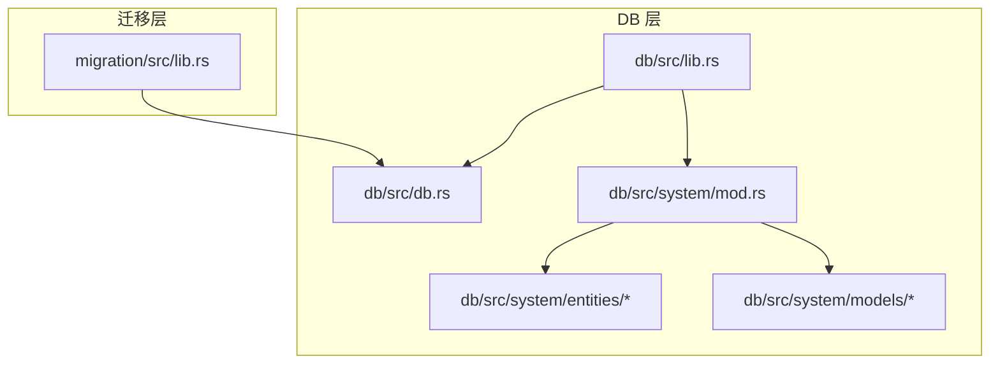
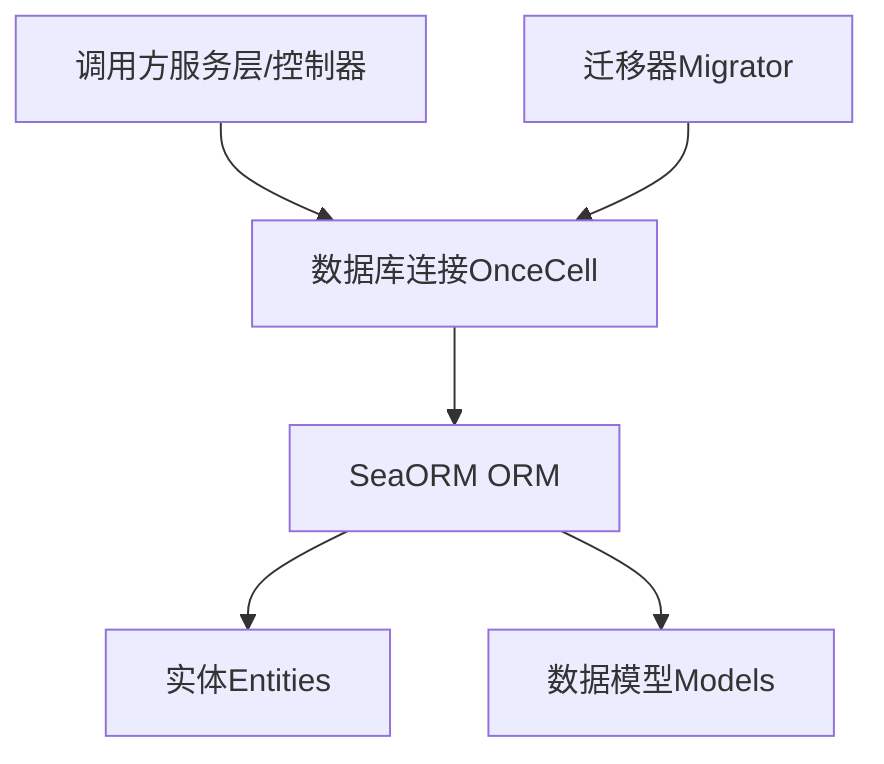
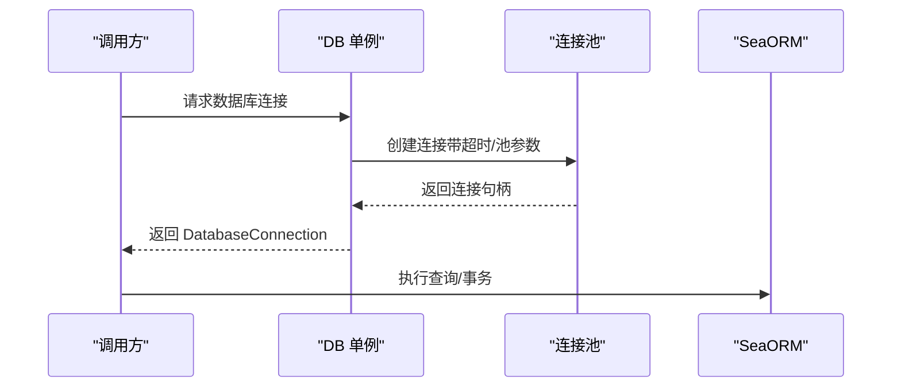
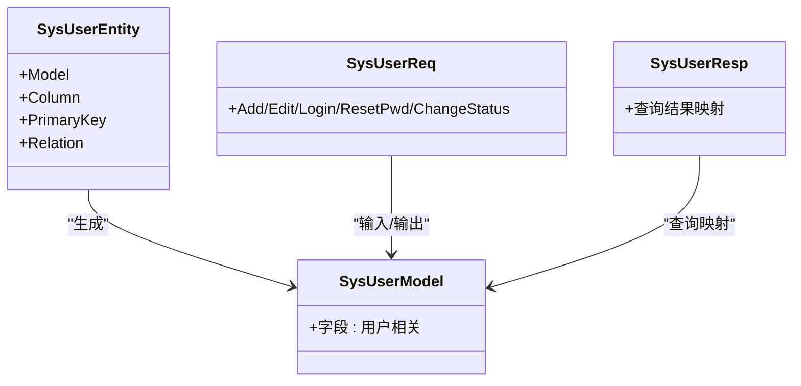
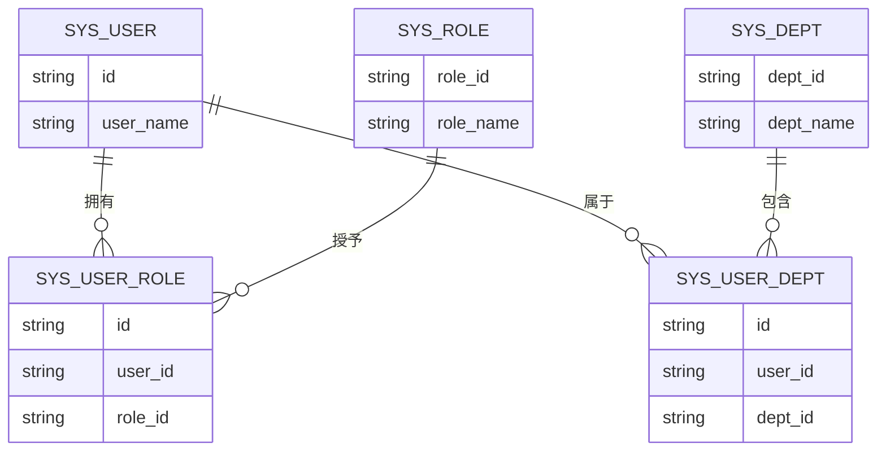
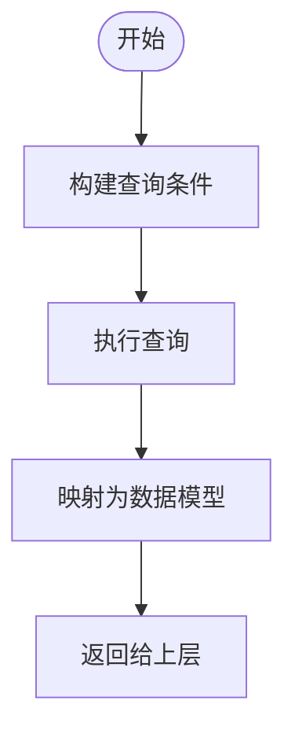
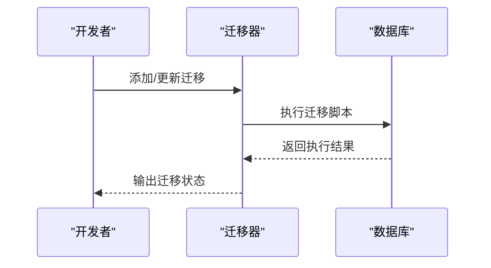
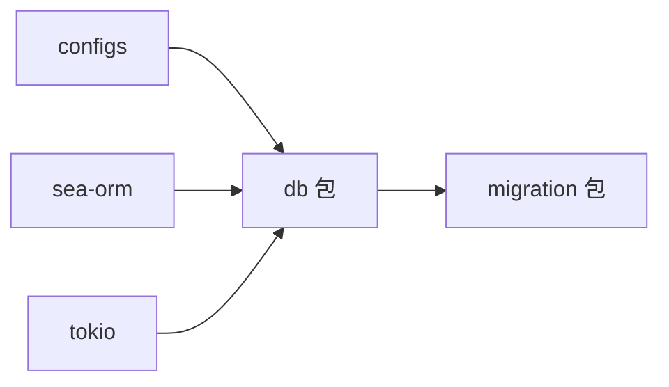

# 数据访问层（DB 层）

<cite>
**本文引用的文件**
- [db/Cargo.toml](file://db/Cargo.toml)
- [db/src/lib.rs](file://db/src/lib.rs)
- [db/src/db.rs](file://db/src/db.rs)
- [db/src/system/mod.rs](file://db/src/system/mod.rs)
- [db/src/system/prelude.rs](file://db/src/system/prelude.rs)
- [db/src/system/entities/sys_user.rs](file://db/src/system/entities/sys_user.rs)
- [db/src/system/models/sys_user.rs](file://db/src/system/models/sys_user.rs)
- [db/src/system/entities/sys_role.rs](file://db/src/system/entities/sys_role.rs)
- [db/src/system/models/sys_role.rs](file://db/src/system/models/sys_role.rs)
- [db/src/system/entities/sys_user_role.rs](file://db/src/system/entities/sys_user_role.rs)
- [db/src/system/entities/sys_user_dept.rs](file://db/src/system/entities/sys_user_dept.rs)
- [db/src/system/entities/sys_dept.rs](file://db/src/system/entities/sys_dept.rs)
- [migration/Cargo.toml](file://migration/Cargo.toml)
- [migration/src/lib.rs](file://migration/src/lib.rs)
</cite>

## 目录
1. [引言](#引言)
2. [项目结构](#项目结构)
3. [核心组件](#核心组件)
4. [架构总览](#架构总览)
5. [详细组件分析](#详细组件分析)
6. [依赖分析](#依赖分析)
7. [性能考虑](#性能考虑)
8. [故障排查指南](#故障排查指南)
9. [结论](#结论)
10. [附录](#附录)

## 引言
本章节面向 Axum Admin 的数据访问层（DB 层），系统性阐述其在整体架构中的关键作用：提供类型安全的数据访问、统一管理数据库连接、封装复杂查询与事务逻辑，并通过 SeaORM ORM 实现实体模型与数据模型的清晰分层。文档将重点说明：
- 实体模型与数据模型的区别与职责边界
- 关系映射与多对多关联的实现机制
- 查询构建器与事务管理策略
- 数据库迁移管理流程
- 性能优化技巧与数据一致性保障

## 项目结构
DB 层采用“模块化 + 分层”的组织方式：
- 连接与初始化：db 模块负责数据库连接池配置与全局连接实例
- 系统域：system 子模块按业务域划分实体与数据模型
- 迁移：migration 子模块集中管理数据库版本演进

**图示来源**
- [db/src/lib.rs](file://db/src/lib.rs#L1-L8)
- [db/src/db.rs](file://db/src/db.rs#L1-L20)
- [db/src/system/mod.rs](file://db/src/system/mod.rs#L1-L13)
- [migration/src/lib.rs](file://migration/src/lib.rs#L1-L17)

**章节来源**
- [db/Cargo.toml](file://db/Cargo.toml#L1-L25)
- [db/src/lib.rs](file://db/src/lib.rs#L1-L8)
- [db/src/db.rs](file://db/src/db.rs#L1-L20)
- [db/src/system/mod.rs](file://db/src/system/mod.rs#L1-L13)
- [migration/Cargo.toml](file://migration/Cargo.toml#L1-L16)
- [migration/src/lib.rs](file://migration/src/lib.rs#L1-L17)

## 核心组件
- 数据库连接管理
  - 使用 OnceCell 提供全局异步单例连接
  - 通过配置项设置连接池大小、超时与日志开关
- 实体与模型分层
  - 实体（Entity）：对应数据库表结构，由 SeaORM 自动生成，提供类型安全的列与主键定义
  - 数据模型（Model/Req/Resp）：面向接口与服务层的数据传输对象，承担序列化、校验与查询结果映射
- 系统域模块化
  - system 子模块按功能域拆分实体与模型，便于维护与扩展
- 迁移管理
  - 基于 SeaORM Migration 框架，集中管理建表与版本升级

**章节来源**
- [db/src/db.rs](file://db/src/db.rs#L1-L20)
- [db/src/system/mod.rs](file://db/src/system/mod.rs#L1-L13)
- [migration/src/lib.rs](file://migration/src/lib.rs#L1-L17)

## 架构总览
DB 层通过统一连接入口对外提供类型安全的数据库能力，系统域内的实体与模型分别承担“持久化结构”和“业务数据结构”的职责，迁移层确保数据库结构随版本演进。

**图示来源**
- [db/src/db.rs](file://db/src/db.rs#L1-L20)
- [db/src/system/entities/sys_user.rs](file://db/src/system/entities/sys_user.rs#L1-L110)
- [db/src/system/models/sys_user.rs](file://db/src/system/models/sys_user.rs#L1-L153)
- [migration/src/lib.rs](file://migration/src/lib.rs#L8-L16)

## 详细组件分析

### 数据库连接与初始化
- 连接池参数
  - 最大连接数、最小连接数、连接超时、空闲超时等均通过连接选项进行配置
- 初始化流程
  - 首次访问时异步建立连接并缓存至 OnceCell，后续直接复用
- 日志与可观测性
  - 关闭底层 sqlx 日志以降低噪音，可通过日志系统观察连接状态

**图示来源**
- [db/src/db.rs](file://db/src/db.rs#L9-L19)

**章节来源**
- [db/src/db.rs](file://db/src/db.rs#L1-L20)

### 实体模型与数据模型
- 实体模型（Entity）
  - 由 SeaORM 自动生成，包含表名、列定义、主键、ActiveModel 行为等
  - 适用于直接持久化与类型安全的 CRUD 操作
- 数据模型（Model/Req/Resp）
  - 面向接口层的数据结构，支持序列化、反序列化与查询结果映射
  - 与实体解耦，便于接口演进与跨层数据转换

**图示来源**
- [db/src/system/entities/sys_user.rs](file://db/src/system/entities/sys_user.rs#L6-L110)
- [db/src/system/models/sys_user.rs](file://db/src/system/models/sys_user.rs#L54-L123)

**章节来源**
- [db/src/system/entities/sys_user.rs](file://db/src/system/entities/sys_user.rs#L1-L110)
- [db/src/system/models/sys_user.rs](file://db/src/system/models/sys_user.rs#L1-L153)

### 关系映射与多对多关联
- 多对多关系
  - 用户与角色：通过中间表 sys_user_role 维护用户与角色的多对多关系
  - 用户与部门：通过中间表 sys_user_dept 维护用户与部门的多对多关系
- 关系实现
  - 当前实体未显式声明 RelationDef，表示关系在应用层通过中间表进行管理
  - 可在需要时扩展 Relation 宏以获得更高级的关联查询能力

**图示来源**
- [db/src/system/entities/sys_user_role.rs](file://db/src/system/entities/sys_user_role.rs#L1-L68)
- [db/src/system/entities/sys_user_dept.rs](file://db/src/system/entities/sys_user_dept.rs#L1-L68)
- [db/src/system/entities/sys_user.rs](file://db/src/system/entities/sys_user.rs#L1-L110)
- [db/src/system/entities/sys_role.rs](file://db/src/system/entities/sys_role.rs#L1-L80)
- [db/src/system/entities/sys_dept.rs](file://db/src/system/entities/sys_dept.rs#L61-L91)

**章节来源**
- [db/src/system/entities/sys_user_role.rs](file://db/src/system/entities/sys_user_role.rs#L1-L68)
- [db/src/system/entities/sys_user_dept.rs](file://db/src/system/entities/sys_user_dept.rs#L1-L68)
- [db/src/system/entities/sys_user.rs](file://db/src/system/entities/sys_user.rs#L1-L110)
- [db/src/system/entities/sys_role.rs](file://db/src/system/entities/sys_role.rs#L1-L80)
- [db/src/system/entities/sys_dept.rs](file://db/src/system/entities/sys_dept.rs#L61-L91)

### 查询构建与数据模型映射
- 查询结果映射
  - 使用 FromQueryResult 将查询结果映射到数据模型，避免直接暴露实体细节
- 输入/输出模型
  - Add/Edit/Login/ResetPwd 等请求模型用于接口层数据校验与转换
  - Resp 模型用于对外返回，控制字段集合与序列化行为

**图示来源**
- [db/src/system/models/sys_user.rs](file://db/src/system/models/sys_user.rs#L54-L123)

**章节来源**
- [db/src/system/models/sys_user.rs](file://db/src/system/models/sys_user.rs#L1-L153)

### 事务管理策略
- 事务边界
  - 在需要强一致性的场景（如用户角色变更、批量删除）建议使用事务包裹
- 事务实践
  - 通过连接获取事务句柄，执行多个写操作后提交或回滚
  - 对于读多写少的场景，合理设置隔离级别与只读事务以提升性能

[本节为通用实践说明，不直接分析具体文件]

### 数据库迁移管理
- 迁移器
  - 定义迁移集合，按顺序执行版本升级
- 数据目录
  - 迁移脚本与数据文件分离，便于版本控制与回滚
- 运行方式
  - 通过迁移工具执行迁移，确保数据库结构与代码一致

**图示来源**
- [migration/src/lib.rs](file://migration/src/lib.rs#L8-L16)

**章节来源**
- [migration/Cargo.toml](file://migration/Cargo.toml#L1-L16)
- [migration/src/lib.rs](file://migration/src/lib.rs#L1-L17)

## 依赖分析
- DB 层依赖
  - configs：读取数据库连接字符串等配置
  - sea-orm：ORM 能力与连接池
  - tokio：异步运行时
- 迁移层依赖
  - db：依赖 DB 连接进行迁移
  - sea-orm-migration：迁移框架

**图示来源**
- [db/Cargo.toml](file://db/Cargo.toml#L9-L19)
- [migration/Cargo.toml](file://migration/Cargo.toml#L11-L15)

**章节来源**
- [db/Cargo.toml](file://db/Cargo.toml#L1-L25)
- [migration/Cargo.toml](file://migration/Cargo.toml#L1-L16)

## 性能考虑
- 连接池参数
  - 合理设置最大/最小连接数与超时时间，避免资源浪费或阻塞
- 查询优化
  - 使用投影列减少网络传输
  - 通过索引覆盖常见查询条件
- 事务批处理
  - 将多次写入合并为单个事务，减少往返开销
- 缓存策略
  - 对热点只读数据引入缓存，降低数据库压力

[本节为通用指导，不直接分析具体文件]

## 故障排查指南
- 连接失败
  - 检查连接字符串与数据库服务状态
  - 查看连接超时与日志输出
- 迁移异常
  - 确认迁移脚本是否正确执行
  - 核对数据库权限与版本状态
- 类型不匹配
  - 检查实体与数据模型字段映射关系
  - 确保 FromQueryResult 的字段顺序与名称一致

**章节来源**
- [db/src/db.rs](file://db/src/db.rs#L9-L19)
- [migration/src/lib.rs](file://migration/src/lib.rs#L12-L16)

## 结论
Axum Admin 的 DB 层通过 SeaORM 实现了类型安全与可维护的数据库访问，结合实体与数据模型的分层设计，既满足复杂查询与事务需求，又保持接口层的简洁与稳定。配合迁移管理与性能优化策略，能够有效支撑系统的长期演进与高并发场景。

## 附录
- 重新导出与预置
  - system/prelude 与 system/mod 提供统一的模块重导出，便于上层按需使用
- 开发建议
  - 新增实体时同步完善数据模型与查询映射
  - 对高频查询建立索引并定期评估执行计划

**章节来源**
- [db/src/system/prelude.rs](file://db/src/system/prelude.rs#L1-L9)
- [db/src/system/mod.rs](file://db/src/system/mod.rs#L7-L12)