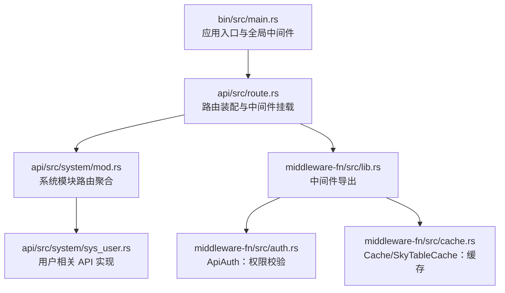
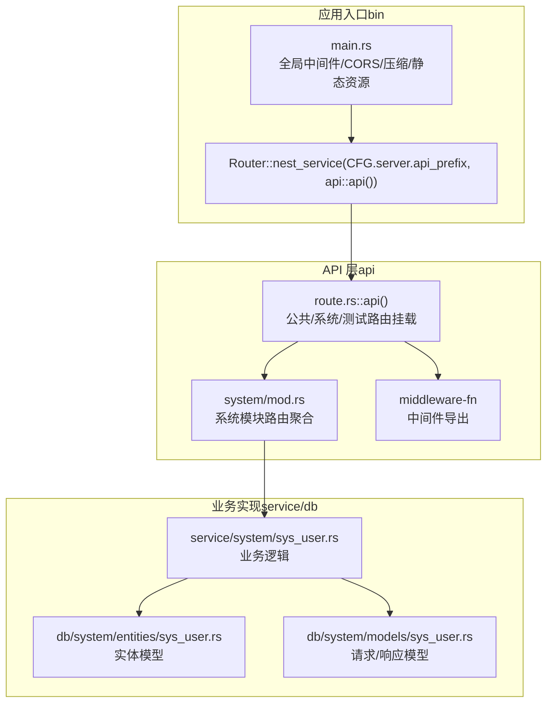
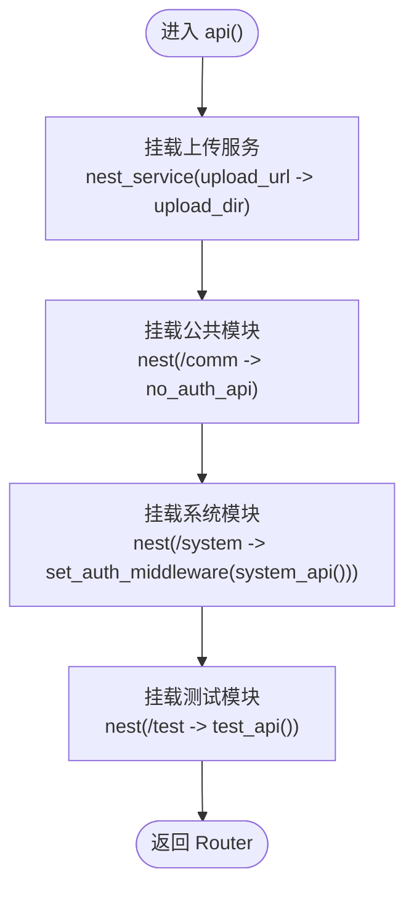
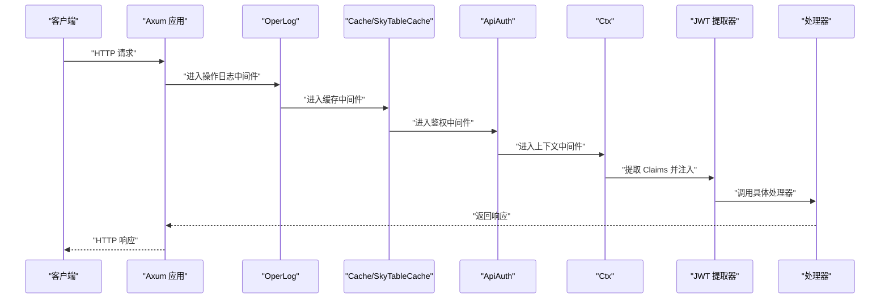
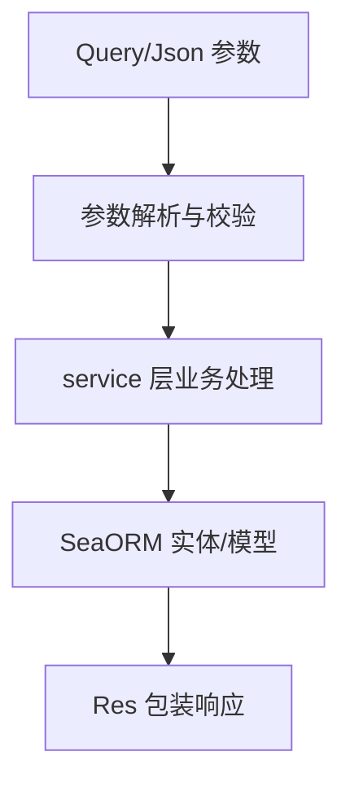
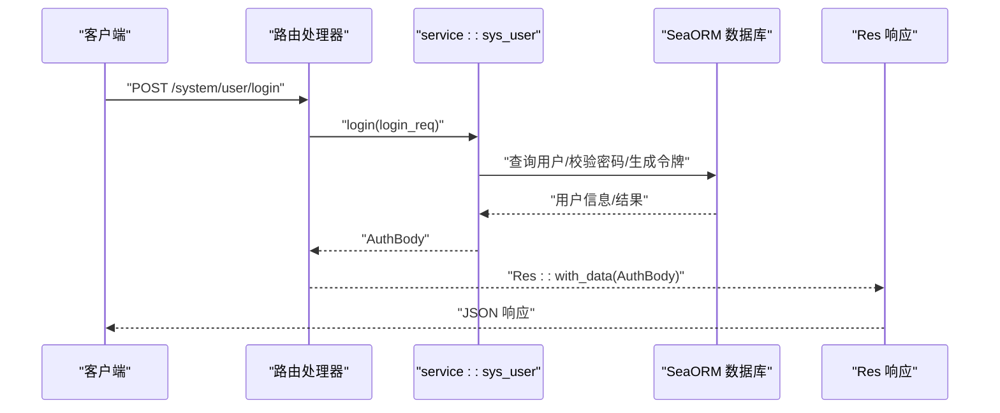
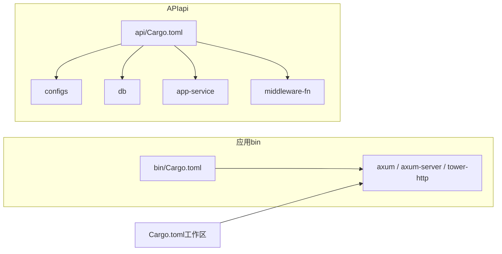

# 表示层（API 层）

<cite>
**本文引用的文件**
- [api/src/lib.rs](file://api/src/lib.rs)
- [api/src/route.rs](file://api/src/route.rs)
- [api/src/system/mod.rs](file://api/src/system/mod.rs)
- [api/src/system/common.rs](file://api/src/system/common.rs)
- [api/src/system/sys_user.rs](file://api/src/system/sys_user.rs)
- [middleware-fn/src/lib.rs](file://middleware-fn/src/lib.rs)
- [middleware-fn/src/auth.rs](file://middleware-fn/src/auth.rs)
- [middleware-fn/src/cache.rs](file://middleware-fn/src/cache.rs)
- [db/src/system/models/sys_user.rs](file://db/src/system/models/sys_user.rs)
- [db/src/system/entities/sys_user.rs](file://db/src/system/entities/sys_user.rs)
- [service/src/system/sys_user.rs](file://service/src/system/sys_user.rs)
- [bin/src/main.rs](file://bin/src/main.rs)
- [Cargo.toml（工作区）](file://Cargo.toml)
- [api/Cargo.toml](file://api/Cargo.toml)
- [bin/Cargo.toml](file://bin/Cargo.toml)
</cite>

## 目录
1. [引言](#引言)
2. [项目结构](#项目结构)
3. [核心组件](#核心组件)
4. [架构总览](#架构总览)
5. [详细组件分析](#详细组件分析)
6. [依赖关系分析](#依赖关系分析)
7. [性能考量](#性能考量)
8. [故障排查指南](#故障排查指南)
9. [结论](#结论)
10. [附录](#附录)

## 引言
本文件聚焦于 Axum Admin 的表示层（API 层），阐述其作为系统入口点的设计理念与实现细节。内容覆盖路由定义与层次结构、HTTP 请求处理流程、中间件链的执行顺序与职责、响应数据格式的标准化，以及系统模块的分类管理与公共组件复用机制。读者可据此理解 API 层如何通过 Axum Web 框架组织路由、串联中间件、调用服务层并返回统一格式的响应。

## 项目结构
API 层位于独立的 workspace 成员模块中，负责：
- 聚合各业务模块的路由
- 统一挂载无需鉴权的公共接口
- 对系统模块与测试模块应用鉴权与上下文中间件
- 提供统一的响应包装与错误处理

图表来源
- [bin/src/main.rs](file://bin/src/main.rs#L73-L95)
- [api/src/route.rs](file://api/src/route.rs#L12-L22)
- [api/src/system/mod.rs](file://api/src/system/mod.rs#L26-L44)
- [api/src/system/sys_user.rs](file://api/src/system/sys_user.rs#L24-L31)
- [middleware-fn/src/lib.rs](file://middleware-fn/src/lib.rs#L16-L22)
- [middleware-fn/src/auth.rs](file://middleware-fn/src/auth.rs#L6-L24)
- [middleware-fn/src/cache.rs](file://middleware-fn/src/cache.rs#L126-L193)

章节来源
- [api/src/lib.rs](file://api/src/lib.rs#L1-L10)
- [api/src/route.rs](file://api/src/route.rs#L12-L22)
- [api/src/system/mod.rs](file://api/src/system/mod.rs#L26-L44)
- [bin/src/main.rs](file://bin/src/main.rs#L73-L95)

## 核心组件
- 路由装配器：负责将公共路由、系统模块路由、测试模块路由按前缀挂载，并在系统模块与测试模块上叠加中间件。
- 中间件体系：鉴权中间件、上下文中间件、操作日志中间件、缓存中间件（内存或 SkyTable），按配置动态启用。
- 系统模块路由：按功能域划分（用户、字典、岗位、部门、角色、菜单、日志、在线用户、定时任务等），每个子模块提供一组 CRUD 与业务方法。
- 公共组件：验证码生成、服务器监控信息（含 SSE）、文件上传服务等。
- 响应标准化：统一使用 Res 包装，确保接口返回结构一致。

章节来源
- [api/src/route.rs](file://api/src/route.rs#L12-L68)
- [middleware-fn/src/lib.rs](file://middleware-fn/src/lib.rs#L16-L22)
- [api/src/system/mod.rs](file://api/src/system/mod.rs#L26-L44)
- [api/src/system/common.rs](file://api/src/system/common.rs#L12-L33)

## 架构总览
API 层采用“路由装配 + 中间件链 + 业务实现”的分层设计。应用入口在 bin 模块完成全局中间件（CORS、压缩、静态资源）与 API 路由挂载；API 模块负责系统模块与公共接口的路由组织，并在系统模块上叠加鉴权、上下文与缓存等中间件。

图表来源
- [bin/src/main.rs](file://bin/src/main.rs#L58-L95)
- [api/src/route.rs](file://api/src/route.rs#L12-L22)
- [api/src/system/mod.rs](file://api/src/system/mod.rs#L26-L44)
- [service/src/system/sys_user.rs](file://service/src/system/sys_user.rs#L28-L144)
- [db/src/system/entities/sys_user.rs](file://db/src/system/entities/sys_user.rs#L15-L36)
- [db/src/system/models/sys_user.rs](file://db/src/system/models/sys_user.rs#L7-L24)

## 详细组件分析

### 路由装配与层次结构
- 公共路由（无需鉴权）：登录、验证码、退出登录等。
- 系统模块路由：按领域拆分，如用户、字典、岗位、部门、角色、菜单、日志、在线用户、定时任务等。
- 测试模块路由：用于开发与测试场景。
- 文件上传：通过 ServeDir 将指定 URL 前缀映射到本地目录，便于直接访问上传文件。
- 中间件挂载策略：
  - 系统模块与测试模块：根据配置启用操作日志中间件、缓存中间件（内存或 SkyTable）、鉴权中间件、上下文中间件、JWT 提取器。
  - 公共模块：仅挂载无需鉴权的通用接口。

图表来源
- [api/src/route.rs](file://api/src/route.rs#L12-L22)

章节来源
- [api/src/route.rs](file://api/src/route.rs#L12-L68)
- [api/src/system/mod.rs](file://api/src/system/mod.rs#L26-L44)

### 中间件链与执行顺序
- 中间件启用顺序（系统模块与测试模块）：
  1) 操作日志中间件（可选）
  2) 缓存中间件（可选，内存或 SkyTable）
  3) 鉴权中间件（ApiAuth）
  4) 上下文中间件（Ctx）
  5) JWT 提取器（从扩展中注入 Claims）
- 执行顺序对请求处理的影响：
  - 缓存中间件需在鉴权之后运行，以便基于用户与路径生成缓存键。
  - 上下文中间件负责填充 ReqCtx、UserInfoCtx 等，供后续中间件与处理器使用。
  - 鉴权中间件基于 ApiUtils 校验 API 权限，若命中路由表且无权限则返回未授权。
  - 操作日志中间件在请求前后记录操作日志，便于审计。

图表来源
- [api/src/route.rs](file://api/src/route.rs#L33-L53)
- [middleware-fn/src/auth.rs](file://middleware-fn/src/auth.rs#L6-L24)
- [middleware-fn/src/cache.rs](file://middleware-fn/src/cache.rs#L126-L193)

章节来源
- [api/src/route.rs](file://api/src/route.rs#L33-L68)
- [middleware-fn/src/auth.rs](file://middleware-fn/src/auth.rs#L6-L24)
- [middleware-fn/src/cache.rs](file://middleware-fn/src/cache.rs#L126-L193)

### 请求参数验证与数据模型
- 请求参数通常通过 Query 或 Json 解析，结合 SeaORM 实体与 serde 模型进行序列化/反序列化。
- 示例：用户模块的查询参数、新增/编辑请求体、登录请求体等均定义在 db 层模型中，service 层进行业务处理与数据库交互。
- 处理器函数统一返回 Res 包装的数据或错误信息，保证响应一致性。

图表来源
- [api/src/system/sys_user.rs](file://api/src/system/sys_user.rs#L24-L31)
- [db/src/system/models/sys_user.rs](file://db/src/system/models/sys_user.rs#L7-L24)
- [service/src/system/sys_user.rs](file://service/src/system/sys_user.rs#L28-L144)
- [db/src/system/entities/sys_user.rs](file://db/src/system/entities/sys_user.rs#L15-L36)

章节来源
- [api/src/system/sys_user.rs](file://api/src/system/sys_user.rs#L24-L31)
- [db/src/system/models/sys_user.rs](file://db/src/system/models/sys_user.rs#L7-L24)
- [service/src/system/sys_user.rs](file://service/src/system/sys_user.rs#L28-L144)
- [db/src/system/entities/sys_user.rs](file://db/src/system/entities/sys_user.rs#L15-L36)

### 响应格式标准化
- 统一使用 Res 包装响应数据，支持带数据、消息、错误码等多种形态。
- 公共组件如验证码、服务器信息（含 SSE）也遵循该规范，便于前端统一处理。

章节来源
- [api/src/system/common.rs](file://api/src/system/common.rs#L12-L33)
- [api/src/system/sys_user.rs](file://api/src/system/sys_user.rs#L98-L104)

### 典型 API 工作流（以用户登录为例）

图表来源
- [api/src/system/sys_user.rs](file://api/src/system/sys_user.rs#L98-L104)
- [service/src/system/sys_user.rs](file://service/src/system/sys_user.rs#L28-L144)
- [db/src/system/entities/sys_user.rs](file://db/src/system/entities/sys_user.rs#L15-L36)

## 依赖关系分析
- 工作区统一依赖版本与特性，API 层依赖 configs、db、app-service、middleware-fn。
- 应用入口依赖 axum、axum-server、tower-http 等，负责全局中间件与 TLS 配置。
- API 层内部模块通过 re-export 方式暴露路由，避免重复导入。

图表来源
- [bin/Cargo.toml](file://bin/Cargo.toml#L10-L25)
- [api/Cargo.toml](file://api/Cargo.toml#L8-L21)
- [Cargo.toml（工作区）](file://Cargo.toml#L24-L62)

章节来源
- [bin/Cargo.toml](file://bin/Cargo.toml#L10-L25)
- [api/Cargo.toml](file://api/Cargo.toml#L8-L21)
- [Cargo.toml（工作区）](file://Cargo.toml#L24-L62)

## 性能考量
- 压缩策略：根据配置启用 gzip 压缩，但排除 SSE 流以避免数据异常。
- 缓存策略：支持内存缓存与 SkyTable 缓存两种实现，缓存键可按用户 token 或路径+方法组合生成，写入后异步清理过期缓存。
- 中间件顺序：将缓存置于鉴权之后，减少无效请求的缓存污染。
- 日志与追踪：统一日志格式与级别，便于定位性能瓶颈。

章节来源
- [bin/src/main.rs](file://bin/src/main.rs#L75-L82)
- [middleware-fn/src/cache.rs](file://middleware-fn/src/cache.rs#L36-L58)
- [api/src/route.rs](file://api/src/route.rs#L33-L53)

## 故障排查指南
- 鉴权失败：检查 ApiAuth 中间件是否正确注入 ReqCtx/UserInfoCtx，确认 ApiUtils 是否已加载路由表，核对用户 ID 是否为超级用户。
- 缓存异常：确认缓存中间件启用状态与缓存方法配置，检查缓存索引与数据结构是否正确更新。
- 响应格式问题：确认处理器返回值是否通过 Res 包装，字段命名与类型是否与模型一致。
- 路由未生效：检查路由挂载顺序与前缀配置，确认 nest 与 route 的组合是否正确。

章节来源
- [middleware-fn/src/auth.rs](file://middleware-fn/src/auth.rs#L6-L24)
- [middleware-fn/src/cache.rs](file://middleware-fn/src/cache.rs#L126-L193)
- [api/src/system/sys_user.rs](file://api/src/system/sys_user.rs#L24-L31)

## 结论
API 层通过清晰的路由分层、可插拔的中间件链与统一的响应包装，实现了高内聚、低耦合的系统入口。借助配置驱动的中间件启用策略与缓存机制，既满足了安全与性能需求，又保持了良好的可维护性与扩展性。建议在新增模块时遵循现有分层与命名约定，确保中间件链顺序与缓存策略的一致性。

## 附录
- 路由前缀与模块映射
  - /comm：公共接口（无需鉴权）
  - /system：系统管理模块（鉴权+上下文+可选缓存）
  - /test：测试模块（鉴权+上下文+可选缓存）
  - /files：文件上传（ServeDir 映射）
- 关键中间件职责
  - ApiAuth：基于路由表与用户权限进行鉴权
  - Ctx：注入请求上下文与用户信息
  - OperLog：记录操作日志
  - Cache/SkyTableCache：按配置启用内存或 SkyTable 缓存