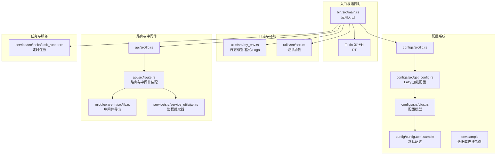
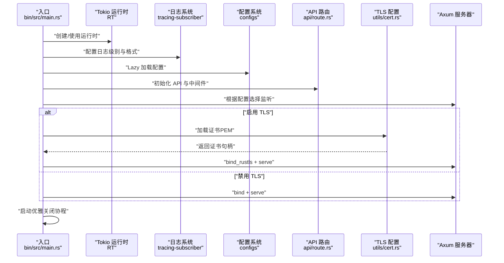
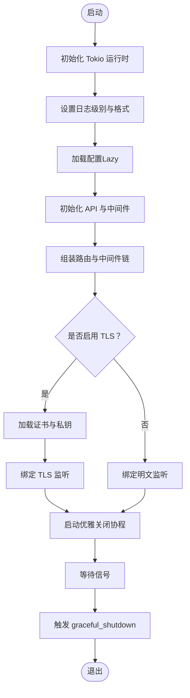
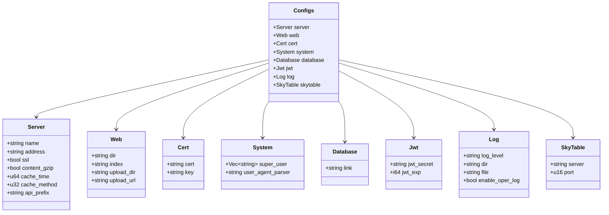
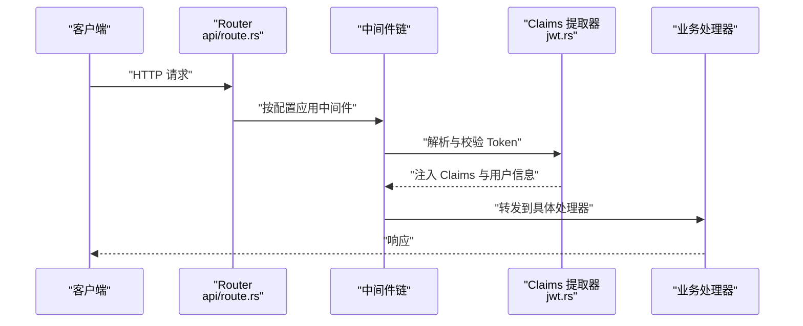
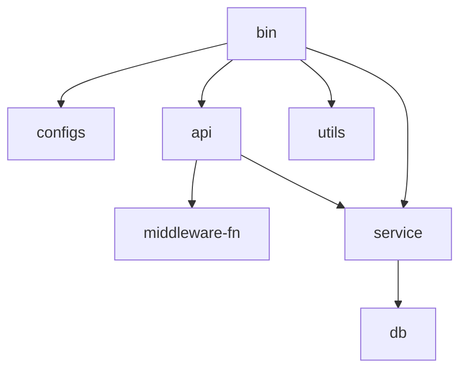

# 应用启动架构

<cite>
**本文引用的文件**
- [bin/src/main.rs](file://bin/src/main.rs)
- [configs/src/lib.rs](file://configs/src/lib.rs)
- [configs/src/get_config.rs](file://configs/src/get_config.rs)
- [configs/src/cfgs.rs](file://configs/src/cfgs.rs)
- [utils/src/my_env.rs](file://utils/src/my_env.rs)
- [utils/src/cert.rs](file://utils/src/cert.rs)
- [api/src/lib.rs](file://api/src/lib.rs)
- [api/src/route.rs](file://api/src/route.rs)
- [middleware-fn/src/lib.rs](file://middleware-fn/src/lib.rs)
- [service/src/service_utils/jwt.rs](file://service/src/service_utils/jwt.rs)
- [service/src/tasks/task_runner.rs](file://service/src/tasks/task_runner.rs)
- [Cargo.toml](file://Cargo.toml)
- [config/config.toml.sample](file://config/config.toml.sample)
- [.env.sample](file://.env.sample)
</cite>

## 目录
1. [简介](#简介)
2. [项目结构](#项目结构)
3. [核心组件](#核心组件)
4. [架构总览](#架构总览)
5. [详细组件分析](#详细组件分析)
6. [依赖关系分析](#依赖关系分析)
7. [性能考虑](#性能考虑)
8. [故障排除指南](#故障排除指南)
9. [结论](#结论)
10. [附录](#附录)

## 简介
本文件面向开发者与运维人员，系统化阐述 Axum Admin 应用的启动架构与流程，覆盖以下关键主题：
- 启动流程：日志系统初始化、配置加载、服务器配置设置、中间件与路由装配
- 运行时与网络栈：Tokio 异步运行时配置、Axum 服务器绑定、优雅关闭
- 安全与传输：CORS 跨域、GZIP 压缩、TLS/SSL 证书处理
- 错误处理与容错：配置校验、异常传播、信号处理与优雅停机
- 环境变量与配置验证：环境变量解析、配置文件加载与校验
- 启动参数与服务监听：监听地址、协议选择（HTTP/HTTPS）、静态资源服务
- 任务与中间件：定时任务初始化、鉴权与上下文中间件链路

## 项目结构
应用采用多工作区（workspace）组织，核心入口位于 bin 工程，配置与工具模块分别位于 configs、utils，业务路由与中间件位于 api、middleware-fn，服务层与任务位于 service。

**图表来源**
- [bin/src/main.rs](file://bin/src/main.rs#L24-L96)
- [configs/src/lib.rs](file://configs/src/lib.rs#L1-L6)
- [configs/src/get_config.rs](file://configs/src/get_config.rs#L1-L26)
- [configs/src/cfgs.rs](file://configs/src/cfgs.rs#L1-L111)
- [utils/src/my_env.rs](file://utils/src/my_env.rs#L1-L72)
- [utils/src/cert.rs](file://utils/src/cert.rs#L1-L27)
- [api/src/lib.rs](file://api/src/lib.rs#L1-L10)
- [api/src/route.rs](file://api/src/route.rs#L1-L69)
- [middleware-fn/src/lib.rs](file://middleware-fn/src/lib.rs#L1-L23)
- [service/src/service_utils/jwt.rs](file://service/src/service_utils/jwt.rs#L1-L164)
- [service/src/tasks/task_runner.rs](file://service/src/tasks/task_runner.rs#L1-L324)

**章节来源**
- [Cargo.toml](file://Cargo.toml#L1-L12)
- [bin/src/main.rs](file://bin/src/main.rs#L1-L129)
- [config/config.toml.sample](file://config/config.toml.sample#L1-L50)

## 核心组件
- 启动入口与运行时：bin/src/main.rs 中以阻塞式进入异步主函数，初始化 Tokio 默认运行时、日志、配置、中间件与路由，并根据配置选择 TLS 或明文监听。
- 配置系统：configs 模块提供 Lazy 单例配置加载，从 config/config.toml 读取并反序列化为强类型结构体；支持 server、web、cert、system、database、jwt、log、skytable 等分段配置。
- 日志系统：基于 tracing-subscriber，结合 tracing-appender 实现控制台与滚动文件双通道输出，支持按环境变量动态调整日志级别与格式。
- 中间件与路由：api/route.rs 组装路由与中间件链，按配置启用缓存、操作日志、鉴权与上下文中间件；静态资源通过 ServeDir 提供。
- 安全与传输：CORS 使用 Any 配置；GZIP 压缩对除 SSE 外的响应启用；TLS 使用 RustlsConfig 从 PEM 文件加载证书。
- 任务与中间件：service_utils/jwt.rs 提供鉴权提取器；middleware-fn/src/lib.rs 导出各类中间件；service/tasks/task_runner.rs 初始化定时任务。

**章节来源**
- [bin/src/main.rs](file://bin/src/main.rs#L24-L96)
- [configs/src/get_config.rs](file://configs/src/get_config.rs#L1-L26)
- [configs/src/cfgs.rs](file://configs/src/cfgs.rs#L1-L111)
- [utils/src/my_env.rs](file://utils/src/my_env.rs#L1-L72)
- [api/src/route.rs](file://api/src/route.rs#L1-L69)
- [service/src/service_utils/jwt.rs](file://service/src/service_utils/jwt.rs#L1-L164)
- [service/src/tasks/task_runner.rs](file://service/src/tasks/task_runner.rs#L1-L324)

## 架构总览
下图展示启动阶段的关键交互：入口初始化运行时与日志 → 加载配置 → 初始化 API 与定时任务 → 组装中间件与路由 → 选择 TLS/明文监听 → 优雅关闭。

**图表来源**
- [bin/src/main.rs](file://bin/src/main.rs#L24-L96)
- [configs/src/get_config.rs](file://configs/src/get_config.rs#L1-L26)
- [utils/src/cert.rs](file://utils/src/cert.rs#L1-L27)
- [api/src/route.rs](file://api/src/route.rs#L1-L69)

## 详细组件分析

### 启动流程与控制流
- 运行时与日志
  - 使用 Lazy 包裹的 Tokio 运行时，确保在首次使用时创建并复用。
  - 若未设置 RUST_LOG，则依据配置自动设定默认日志级别；同时根据平台选择日志时间格式。
  - 控制台与文件双通道非阻塞输出，避免 IO 阻塞影响请求处理。
- 配置加载与校验
  - 通过 Lazy 在进程生命周期内仅加载一次配置，提升性能与一致性。
  - 配置文件缺失或解析失败会直接 panic，确保问题早发现。
  - 支持从 .env.sample 中的 DATABASE_URL 环境变量驱动数据库连接字符串（若应用使用该变量）。
- 中间件与路由装配
  - 路由按模块划分，公共接口无需鉴权，系统模块与测试模块启用鉴权与上下文中间件。
  - 按配置决定是否启用操作日志与缓存中间件（内存或 SkyTable）。
- 服务器与监听
  - 根据 server.address 解析 SocketAddr 并绑定。
  - 当 ssl=true 时，使用 RustlsConfig 从 PEM 文件加载证书与私钥；否则使用明文绑定。
  - 静态资源通过 ServeDir 提供，404 统一映射到 Not Found。
- 优雅关闭
  - 监听 Ctrl+C 与 Unix terminate 信号，收到信号后触发 graceful_shutdown，等待最多 5 秒完成在途请求。

**图表来源**
- [bin/src/main.rs](file://bin/src/main.rs#L24-L129)
- [utils/src/my_env.rs](file://utils/src/my_env.rs#L1-L72)
- [configs/src/get_config.rs](file://configs/src/get_config.rs#L1-L26)
- [api/src/route.rs](file://api/src/route.rs#L1-L69)

**章节来源**
- [bin/src/main.rs](file://bin/src/main.rs#L24-L129)
- [utils/src/my_env.rs](file://utils/src/my_env.rs#L1-L72)
- [configs/src/get_config.rs](file://configs/src/get_config.rs#L1-L26)
- [config/config.toml.sample](file://config/config.toml.sample#L1-L50)
- [.env.sample](file://.env.sample#L1-L3)

### 配置系统与数据模型
- 配置文件结构
  - server：监听地址、TLS 开关、GZIP 开关、缓存策略、API 前缀等。
  - web：静态资源目录、索引页、上传目录与访问 URL。
  - cert：证书与私钥路径。
  - system：超级管理员列表、UA 解析规则。
  - database：数据库连接字符串。
  - jwt：密钥与过期时间。
  - log：日志目录、文件名、级别、是否启用操作日志。
  - skytable：SkyTable 缓存服务地址与端口。
- 加载与错误处理
  - 通过 toml::from_str 反序列化，失败即 panic，保证启动阶段即暴露配置问题。
  - 配置项来源于 config/config.toml.sample，实际部署时建议复制为 config/config.toml 并按需修改。

**图表来源**
- [configs/src/cfgs.rs](file://configs/src/cfgs.rs#L1-L111)

**章节来源**
- [configs/src/cfgs.rs](file://configs/src/cfgs.rs#L1-L111)
- [config/config.toml.sample](file://config/config.toml.sample#L1-L50)

### 日志系统与环境变量
- 日志级别与格式
  - 支持 TRACE/DEBUG/INFO/WARN/ERROR 级别，按平台选择 RFC3339 时间戳或紧凑格式。
  - 控制台与文件双通道输出，文件按小时滚动。
- 环境变量
  - RUST_LOG 未设置时，自动使用配置中的 log_level。
  - DATABASE_URL 示例来自 .env.sample，可用于数据库连接字符串（若应用使用该变量）。

**章节来源**
- [utils/src/my_env.rs](file://utils/src/my_env.rs#L1-L72)
- [bin/src/main.rs](file://bin/src/main.rs#L24-L51)
- [.env.sample](file://.env.sample#L1-L3)

### CORS 与 GZIP 配置
- CORS
  - 使用 Any 允许所有来源与方法，允许所有头部；适合开发与内部使用场景。
- GZIP
  - 对除 "text/event-stream" 外的响应启用压缩，避免 SSE 流式数据被错误压缩导致客户端无法解析。

**章节来源**
- [bin/src/main.rs](file://bin/src/main.rs#L58-L83)

### TLS/SSL 证书处理
- 证书加载
  - 通过 RustlsConfig::from_pem_file 从配置的 cert 与 key 路径加载证书与私钥。
- 监听切换
  - ssl=true 时使用 bind_rustls 监听，否则使用 bind 明文监听。

**章节来源**
- [bin/src/main.rs](file://bin/src/main.rs#L85-L94)
- [utils/src/cert.rs](file://utils/src/cert.rs#L1-L27)

### 优雅关闭机制
- 信号监听
  - Windows 使用 Ctrl+C；Unix 系统额外监听 SIGTERM。
- 关闭策略
  - 收到信号后触发 handle.graceful_shutdown，等待最多 5 秒完成在途请求，随后退出。

**章节来源**
- [bin/src/main.rs](file://bin/src/main.rs#L102-L128)

### 中间件与路由装配
- 路由组织
  - 上传目录通过 nest_service 挂载 ServeDir。
  - 通用模块无需鉴权，系统模块与测试模块启用鉴权与上下文中间件。
- 中间件链
  - 按配置启用操作日志与缓存（内存或 SkyTable），统一注入鉴权 Claims 提取器。
- 鉴权提取器
  - 从 Authorization 头部解析 Bearer Token，校验签名与在线状态，注入 UserInfoCtx 到请求扩展。

**图表来源**
- [api/src/route.rs](file://api/src/route.rs#L1-L69)
- [service/src/service_utils/jwt.rs](file://service/src/service_utils/jwt.rs#L54-L94)
- [middleware-fn/src/lib.rs](file://middleware-fn/src/lib.rs#L1-L23)

**章节来源**
- [api/src/route.rs](file://api/src/route.rs#L1-L69)
- [service/src/service_utils/jwt.rs](file://service/src/service_utils/jwt.rs#L1-L164)
- [middleware-fn/src/lib.rs](file://middleware-fn/src/lib.rs#L1-L23)

### 定时任务初始化
- 初始化流程
  - 启动时调用 timer_task_init 初始化定时任务，失败直接 panic，确保任务可用性。
  - 任务模型维护运行批次、下次运行时间、结束时间与备注信息。
- 任务执行与日志
  - 一次性任务与循环任务分别写入不同日志与状态，支持任务更新与删除。
  - 通过事务写入任务日志与更新任务元数据。

**章节来源**
- [bin/src/main.rs](file://bin/src/main.rs#L54-L56)
- [service/src/tasks/task_runner.rs](file://service/src/tasks/task_runner.rs#L1-L324)

## 依赖关系分析
- 工作区与依赖
  - workspace.members 定义了 bin、api、service、middleware-fn、utils、configs、db、migration 等模块。
  - 关键依赖包括 axum、axum-server、tokio、tower-http、tracing、sea-orm 等。
- 模块耦合
  - bin 依赖 configs、api、utils、service 的初始化结果；api 依赖 middleware-fn 与 jwt 提取器；service 依赖 db 与任务调度器。
- 外部集成点
  - TLS 证书加载、GZIP 压缩、CORS、静态文件服务、数据库连接、定时任务调度。

**图表来源**
- [Cargo.toml](file://Cargo.toml#L1-L12)

**章节来源**
- [Cargo.toml](file://Cargo.toml#L1-L90)

## 性能考虑
- 运行时特性
  - 启用 tokio 的多线程运行时与信号支持，适合高并发 I/O 场景。
- 日志与 IO
  - 使用非阻塞日志适配器与滚动文件，避免磁盘 IO 影响请求处理。
- 压缩与传输
  - GZIP 对大多数响应有效，但排除 SSE，避免流式数据被压缩导致客户端解析失败。
- 配置缓存
  - 配置使用 Lazy 单例，减少重复解析成本。

[本节为通用指导，不直接分析特定文件]

## 故障排除指南
- 启动失败（配置相关）
  - 症状：启动即 panic。
  - 排查：确认 config/config.toml 是否存在且可读；检查 toml 解析是否成功；核对字段拼写与类型。
  - 参考：配置加载与解析逻辑。
- TLS 启动失败
  - 症状：bind_rustls 抛错。
  - 排查：确认 cert 与 key 路径正确且可读；证书格式符合 PEM 规范；ssl=true 时才需要证书。
  - 参考：TLS 绑定与证书加载。
- 日志级别无效
  - 症状：RUST_LOG 未生效。
  - 排查：确认未手动设置 RUST_LOG；检查配置文件 log_level 是否为合法级别。
  - 参考：日志级别与格式设置。
- 静态资源 404
  - 症状：访问前端页面或上传文件返回 404。
  - 排查：确认 web.dir 与 upload_dir 路径存在且可读；检查 fallback 与 ServeDir 配置。
  - 参考：静态资源服务与 404 处理。
- 优雅关闭不生效
  - 症状：Ctrl+C/SIGTERM 后立即退出。
  - 排查：确认运行时具备 signal 特性；检查 graceful_shutdown 调用与超时设置。
  - 参考：信号监听与优雅关闭。
- 定时任务未运行
  - 症状：任务未按计划执行。
  - 排查：确认 timer_task_init 成功；检查 Cron 表达式与任务计数；查看任务日志与状态更新。
  - 参考：定时任务初始化与日志写入。

**章节来源**
- [configs/src/get_config.rs](file://configs/src/get_config.rs#L1-L26)
- [bin/src/main.rs](file://bin/src/main.rs#L85-L94)
- [utils/src/my_env.rs](file://utils/src/my_env.rs#L28-L47)
- [api/src/route.rs](file://api/src/route.rs#L64-L68)
- [service/src/tasks/task_runner.rs](file://service/src/tasks/task_runner.rs#L1-L324)

## 结论
Axum Admin 的启动架构围绕“快速初始化、明确配置、清晰中间件链与安全传输”展开。通过 Lazy 配置、非阻塞日志、CORS/GZIP/TLS 的开箱即用以及优雅关闭机制，应用能够在多种部署环境中稳定运行。建议在生产环境：
- 明确配置文件与环境变量边界，确保敏感信息（如证书、密钥）安全存放。
- 根据业务场景调整 CORS 与缓存策略，避免跨域与缓存带来的安全与一致性风险。
- 监控日志与任务执行情况，建立告警与回滚机制。

[本节为总结性内容，不直接分析特定文件]

## 附录
- 启动参数与配置要点
  - 监听地址：server.address
  - TLS：server.ssl 与 cert.cert、cert.key
  - 压缩：server.content_gzip
  - CORS：默认 Any，可按需细化
  - 静态资源：web.dir、web.upload_dir、web.upload_url
  - 日志：log.log_level、log.dir、log.file、log.enable_oper_log
  - JWT：jwt.jwt_secret、jwt.jwt_exp
  - 数据库：database.link（可来自 DATABASE_URL）

**章节来源**
- [config/config.toml.sample](file://config/config.toml.sample#L1-L50)
- [.env.sample](file://.env.sample#L1-L3)