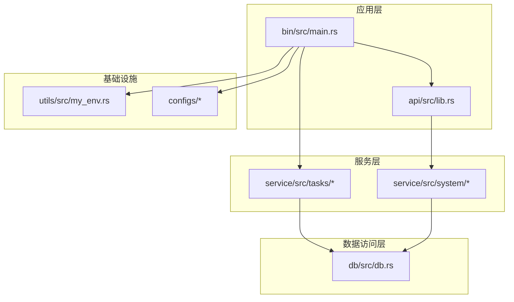
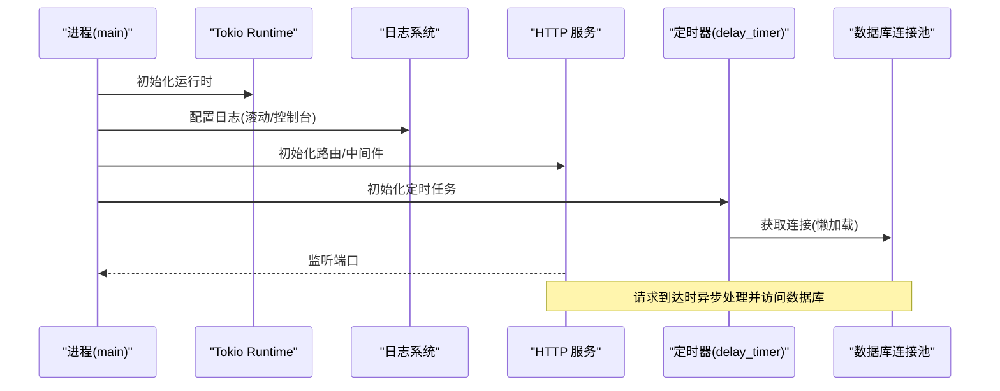
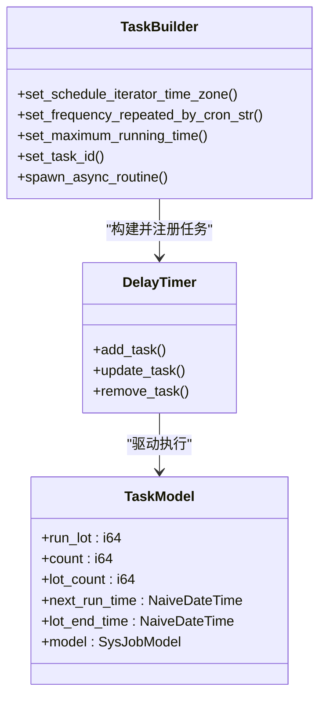
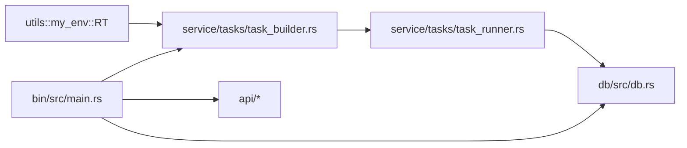

# 异步运行时设计

<cite>
**本文档引用的文件**
- [Cargo.toml](file://Cargo.toml)
- [bin/Cargo.toml](file://bin/Cargo.toml)
- [bin/src/main.rs](file://bin/src/main.rs)
- [utils/src/my_env.rs](file://utils/src/my_env.rs)
- [db/src/db.rs](file://db/src/db.rs)
- [service/src/tasks/mod.rs](file://service/src/tasks/mod.rs)
- [service/src/tasks/task_builder.rs](file://service/src/tasks/task_builder.rs)
- [service/src/tasks/task_runner.rs](file://service/src/tasks/task_runner.rs)
- [service/src/tasks/task.rs](file://service/src/tasks/task.rs)
- [service/src/system/sys_job.rs](file://service/src/system/sys_job.rs)
</cite>

## 目录
1. [引言](#引言)
2. [项目结构](#项目结构)
3. [核心组件](#核心组件)
4. [架构总览](#架构总览)
5. [详细组件分析](#详细组件分析)
6. [依赖关系分析](#依赖关系分析)
7. [性能考虑](#性能考虑)
8. [故障排查指南](#故障排查指南)
9. [结论](#结论)

## 引言
本文件聚焦于 Axum Admin 的异步运行时设计，系统性阐述基于 Tokio 的异步架构，包括运行时配置、任务调度、并发控制与资源管理。内容覆盖异步函数使用模式、Future 与任务管理、异步数据库连接池、并发限制策略、错误处理、超时与优雅关闭、内存与性能优化等主题，旨在帮助开发者深入理解并高效实践异步编程。

## 项目结构
项目采用多工作区（workspace）组织，核心模块如下：
- bin：应用入口与服务启动
- api：HTTP 接口定义与路由
- service：业务逻辑与定时任务
- db：数据库访问与连接池
- middleware-fn：中间件与通用工具
- utils：环境与运行时工具
- configs：配置加载
- migration：数据库迁移

**图表来源**
- [bin/src/main.rs](file://bin/src/main.rs#L25-L96)
- [service/src/tasks/mod.rs](file://service/src/tasks/mod.rs#L35-L59)
- [db/src/db.rs](file://db/src/db.rs#L1-L19)

**章节来源**
- [Cargo.toml](file://Cargo.toml#L1-L23)
- [bin/Cargo.toml](file://bin/Cargo.toml#L1-L26)

## 核心组件
- 运行时与日志
  - 自定义全局 Tokio Runtime 实例，通过 Lazy 初始化并共享给各模块
  - 使用 tracing-subscriber 构建统一日志栈，支持滚动文件与标准输出
- HTTP 服务器
  - 基于 axum-server 与 rustls，支持 TLS；内置优雅关闭信号处理
  - 启用 CORS 与可选 GZIP 压缩
- 异步数据库连接池
  - SeaORM 连接选项：最大/最小连接数、连接/空闲超时、禁用 sqlx 日志
  - OnceCell 全局懒加载连接
- 定时任务系统
  - 基于 delay_timer 的 Cron 调度器，自定义 Tokio 运行时共享
  - 任务模型与并发控制、日志落库、生命周期管理

**章节来源**
- [utils/src/my_env.rs](file://utils/src/my_env.rs#L11-L14)
- [bin/src/main.rs](file://bin/src/main.rs#L25-L96)
- [db/src/db.rs](file://db/src/db.rs#L1-L19)
- [service/src/tasks/mod.rs](file://service/src/tasks/mod.rs#L20-L33)
- [service/src/tasks/task_builder.rs](file://service/src/tasks/task_builder.rs#L18-L26)

## 架构总览
下图展示从进程启动到服务运行、任务调度与数据库交互的关键路径。

**图表来源**
- [bin/src/main.rs](file://bin/src/main.rs#L25-L96)
- [utils/src/my_env.rs](file://utils/src/my_env.rs#L11-L14)
- [service/src/tasks/task_builder.rs](file://service/src/tasks/task_builder.rs#L18-L26)
- [db/src/db.rs](file://db/src/db.rs#L1-L19)

## 详细组件分析

### 运行时与日志系统
- 运行时
  - 通过 Lazy 全局持有 Arc<tokio::runtime::Runtime>，避免重复创建
  - 主流程使用 block_on 包裹异步初始化，确保同步入口下的异步操作
- 日志
  - 支持环境变量与配置驱动的日志级别
  - 统一使用 tracing-subscriber，同时输出至文件与标准输出
  - 格式化器按平台选择本地时间与时序格式

最佳实践
- 将耗时初始化放入独立 Future 并尽早 spawn
- 对长时间运行的后台任务使用专用任务句柄或监督策略

**章节来源**
- [utils/src/my_env.rs](file://utils/src/my_env.rs#L11-L14)
- [bin/src/main.rs](file://bin/src/main.rs#L25-L51)

### HTTP 服务器与优雅关闭
- 服务器绑定
  - 支持 HTTP/HTTPS（rustls），监听地址来自配置
  - 中间件：CORS、GZIP（排除 SSE）
- 优雅关闭
  - 监听 Ctrl+C 与 Unix terminate 信号
  - 收到信号后触发 handle.graceful_shutdown，并设定超时窗口

建议
- 在容器环境中配合外部编排设置更长的优雅关闭窗口
- 对 SSE 等特殊流场景谨慎启用压缩

**章节来源**
- [bin/src/main.rs](file://bin/src/main.rs#L58-L95)
- [bin/src/main.rs](file://bin/src/main.rs#L102-L128)

### 异步数据库连接池
- 连接配置
  - 最大连接数、最小连接数、连接超时、空闲超时
  - 关闭 sqlx 日志以降低开销
- 懒加载
  - OnceCell 全局持有连接实例，首次访问时建立连接
- 访问模式
  - 大多数异步函数通过 DB.get_or_init(db_conn).await 获取连接
  - 写入类操作使用事务封装，保证一致性

并发与性能
- 合理设置 max/min 连接数，避免过高导致资源争用
- 利用连接池复用，减少频繁握手成本

**章节来源**
- [db/src/db.rs](file://db/src/db.rs#L1-L19)
- [service/src/tasks/task_runner.rs](file://service/src/tasks/task_runner.rs#L23-L24)
- [service/src/system/sys_job.rs](file://service/src/system/sys_job.rs#L134-L155)

### 定时任务系统
- 任务构建
  - 使用 delay_timer 的 TaskBuilder，设置时区、Cron 迭代器
  - 通过自定义 Tokio 运行时共享，确保任务在统一运行时中调度
- 任务模型
  - TaskModel 维护运行批次、次数、下次运行时间、结束时间与任务元信息
  - 使用 Lazy + Mutex 共享任务状态
- 任务执行
  - run_once_task：解析 Cron、执行目标函数、统计耗时、异步写入日志
  - 支持一次性任务与循环任务，自动更新状态与备注
- 生命周期管理
  - 初始化：扫描激活任务并逐个添加
  - 更新：动态调整任务次数、时间窗与备注
  - 删除：移除调度器中的任务并更新数据库状态

并发控制
- 通过 Cron 驱动的调度器控制任务频率
- 任务内部使用 tokio::spawn 将日志写入与状态更新异步化，避免阻塞主调度线程

**图表来源**
- [service/src/tasks/mod.rs](file://service/src/tasks/mod.rs#L25-L33)
- [service/src/tasks/task_builder.rs](file://service/src/tasks/task_builder.rs#L18-L26)
- [service/src/tasks/task_builder.rs](file://service/src/tasks/task_builder.rs#L31-L55)

**章节来源**
- [service/src/tasks/mod.rs](file://service/src/tasks/mod.rs#L20-L33)
- [service/src/tasks/task_builder.rs](file://service/src/tasks/task_builder.rs#L18-L26)
- [service/src/tasks/task_runner.rs](file://service/src/tasks/task_runner.rs#L19-L70)
- [service/src/tasks/task.rs](file://service/src/tasks/task.rs#L7-L16)

### 异步函数使用模式与 Future 管理
- Future 管理
  - 使用 tokio::spawn 将非关键路径（如日志写入、状态更新）异步化，避免阻塞主流程
  - 对需要严格顺序的写入使用事务，确保原子性
- 错误处理
  - 使用 anyhow::Result 统一错误传播
  - 对不可恢复错误进行记录与返回，避免 panic
- 超时控制
  - 数据库连接与空闲超时在连接选项中集中配置
  - 可在上层业务中结合 tokio::time::timeout 对关键操作加时限

**章节来源**
- [service/src/tasks/task_runner.rs](file://service/src/tasks/task_runner.rs#L55-L69)
- [service/src/system/sys_job.rs](file://service/src/system/sys_job.rs#L193-L213)
- [db/src/db.rs](file://db/src/db.rs#L10-L15)

## 依赖关系分析
- 运行时与任务
  - utils::my_env 提供全局 RT，被 service/timer 使用
  - service/tasks 依赖 delay_timer 与自定义 RT 共享
- 数据访问
  - service/* 通过 db::DB 访问连接池
  - db::db_conn 返回 Future，配合 OnceCell 懒加载
- HTTP 服务
  - bin/main 初始化 axum 路由、中间件与优雅关闭

**图表来源**
- [utils/src/my_env.rs](file://utils/src/my_env.rs#L11-L14)
- [service/src/tasks/task_builder.rs](file://service/src/tasks/task_builder.rs#L18-L26)
- [service/src/tasks/task_runner.rs](file://service/src/tasks/task_runner.rs#L23-L24)
- [db/src/db.rs](file://db/src/db.rs#L7)
- [bin/src/main.rs](file://bin/src/main.rs#L58-L95)

**章节来源**
- [Cargo.toml](file://Cargo.toml#L24-L81)
- [bin/Cargo.toml](file://bin/Cargo.toml#L10-L25)

## 性能考虑
- 连接池参数
  - 合理设置 max/min 连接数，避免过高导致上下文切换与锁竞争
  - 连接/空闲超时需平衡延迟与资源占用
- 日志与 I/O
  - 使用非阻塞日志适配器（non-blocking）降低 I/O 阻塞
  - 对静态资源与响应体启用 GZIP（排除 SSE）
- 任务调度
  - Cron 表达式尽量均匀分布，避免热点时段集中
  - 将写入与计算分离，减少锁持有时间
- 编译优化
  - release 配置启用 LTO、代码大小优化与 panic abort，提升运行时效率

[本节为通用性能建议，无需特定文件引用]

## 故障排查指南
- 优雅关闭无效
  - 检查信号处理是否正确安装，确认 handle.graceful_shutdown 被调用
  - 在容器环境适当延长优雅关闭窗口
- 数据库连接异常
  - 查看连接池参数与超时配置，确认连接数上限与空闲回收策略
  - 检查慢查询与事务未提交导致的连接占用
- 定时任务未执行
  - 核对 Cron 表达式与时区设置
  - 检查任务状态与备注字段，确认任务已添加且未被删除
- 日志缺失
  - 确认日志级别与过滤器配置
  - 检查滚动文件路径与权限

**章节来源**
- [bin/src/main.rs](file://bin/src/main.rs#L102-L128)
- [db/src/db.rs](file://db/src/db.rs#L10-L15)
- [service/src/system/sys_job.rs](file://service/src/system/sys_job.rs#L234-L242)

## 结论
Axum Admin 的异步运行时设计以 Tokio 为核心，结合延迟任务调度、统一日志与连接池，形成高可用的服务基础。通过合理的并发控制、错误处理与优雅关闭机制，系统在保证稳定性的同时兼顾性能。建议在生产环境中持续监控连接池利用率、任务执行耗时与日志吞吐，并根据负载动态调整参数。