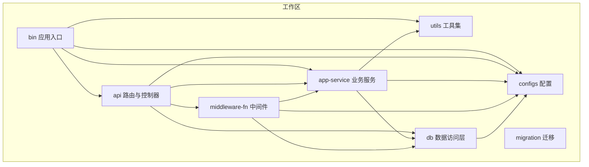
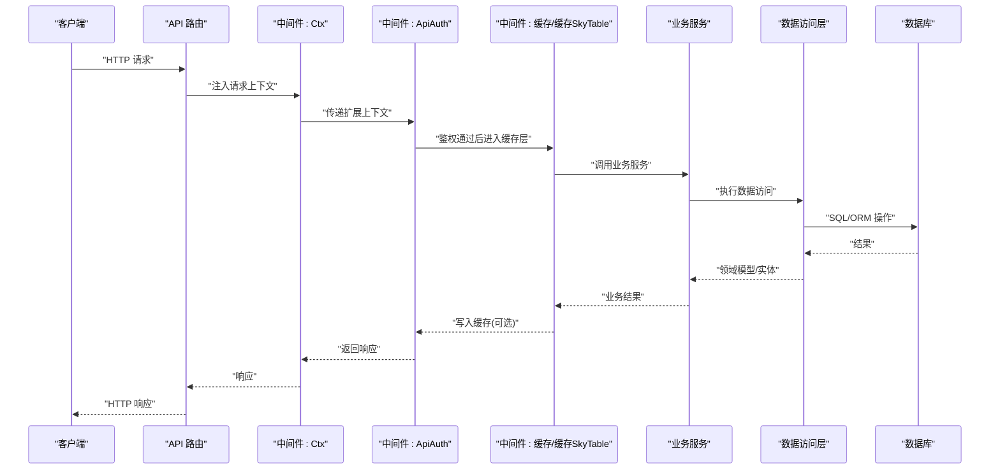
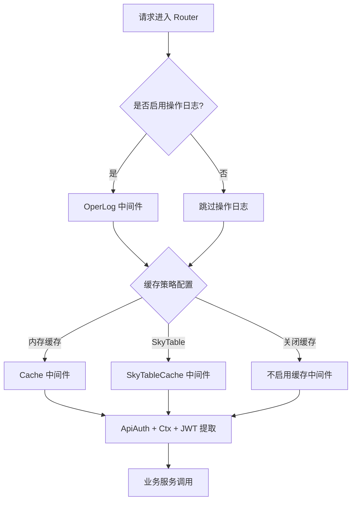
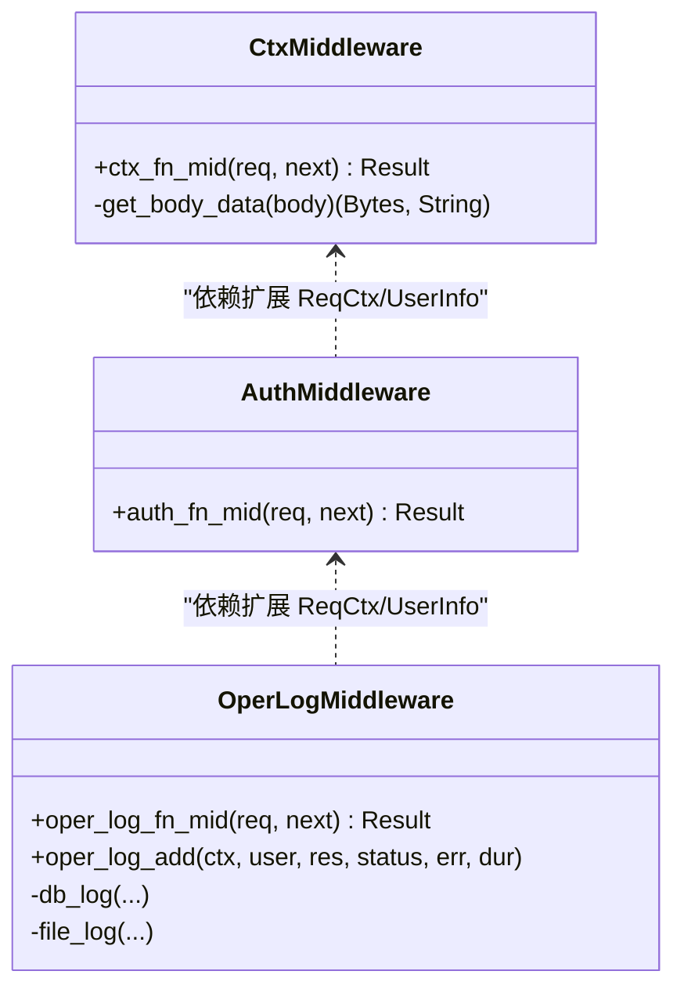
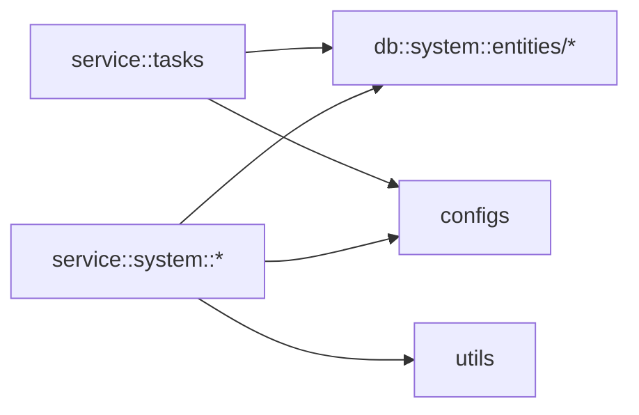
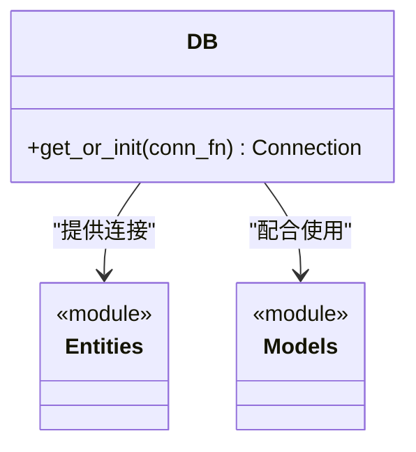
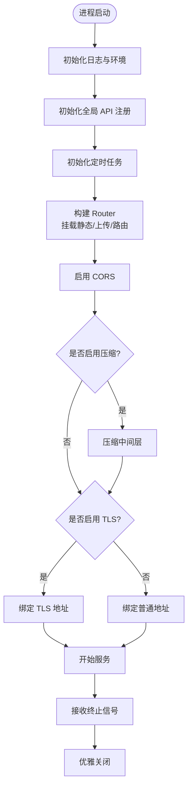
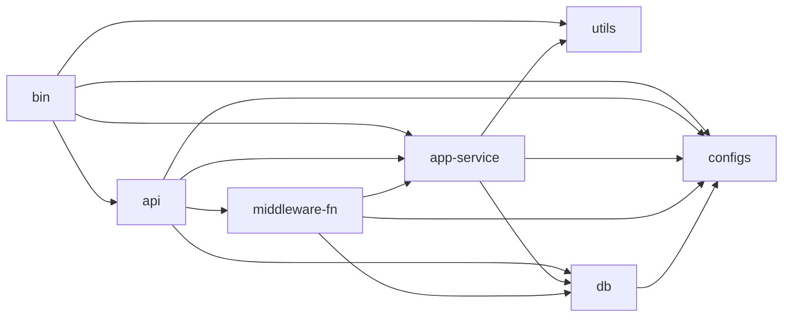

# 架构设计

<cite>
**本文引用的文件**
- [Cargo.toml](file://Cargo.toml)
- [bin/Cargo.toml](file://bin/Cargo.toml)
- [api/Cargo.toml](file://api/Cargo.toml)
- [service/Cargo.toml](file://service/Cargo.toml)
- [db/Cargo.toml](file://db/Cargo.toml)
- [configs/Cargo.toml](file://configs/Cargo.toml)
- [middleware-fn/Cargo.toml](file://middleware-fn/Cargo.toml)
- [utils/Cargo.toml](file://utils/Cargo.toml)
- [bin/src/main.rs](file://bin/src/main.rs)
- [api/src/lib.rs](file://api/src/lib.rs)
- [api/src/route.rs](file://api/src/route.rs)
- [service/src/lib.rs](file://service/src/lib.rs)
- [service/src/system/mod.rs](file://service/src/system/mod.rs)
- [db/src/lib.rs](file://db/src/lib.rs)
- [db/src/system/mod.rs](file://db/src/system/mod.rs)
- [middleware-fn/src/lib.rs](file://middleware-fn/src/lib.rs)
- [middleware-fn/src/auth.rs](file://middleware-fn/src/auth.rs)
- [middleware-fn/src/ctx.rs](file://middleware-fn/src/ctx.rs)
- [middleware-fn/src/oper_log.rs](file://middleware-fn/src/oper_log.rs)
</cite>

## 目录
1. [引言](#引言)
2. [项目结构](#项目结构)
3. [核心组件](#核心组件)
4. [架构总览](#架构总览)
5. [详细组件分析](#详细组件分析)
6. [依赖分析](#依赖分析)
7. [性能考虑](#性能考虑)
8. [故障排查指南](#故障排查指南)
9. [结论](#结论)
10. [附录](#附录)

## 引言
本架构设计文档面向 Axum Admin 项目，系统性阐述其分层架构与模块协作机制，重点覆盖以下方面：
- 分层架构：表示层（API 层）、业务逻辑层（Service 层）、数据访问层（DB 层）、中间件层
- 职责划分、交互模式与数据流向
- 架构决策的技术考量、设计模式应用与模块依赖关系
- 系统边界、组件交互图与数据流图
- 异步架构设计、中间件模式、依赖注入与配置驱动的可插拔能力

## 项目结构
Axum Admin 采用多 crate 的工作区组织，围绕“入口应用 → API 路由 → 业务服务 → 中间件 → 数据库”清晰分层，辅以配置、工具与迁移模块支撑。

图表来源
- [Cargo.toml](file://Cargo.toml#L1-L12)
- [bin/Cargo.toml](file://bin/Cargo.toml#L10-L25)
- [api/Cargo.toml](file://api/Cargo.toml#L8-L21)
- [service/Cargo.toml](file://service/Cargo.toml#L9-L32)
- [db/Cargo.toml](file://db/Cargo.toml#L9-L19)
- [middleware-fn/Cargo.toml](file://middleware-fn/Cargo.toml#L9-L24)

章节来源
- [Cargo.toml](file://Cargo.toml#L1-L12)
- [bin/Cargo.toml](file://bin/Cargo.toml#L10-L25)
- [api/Cargo.toml](file://api/Cargo.toml#L8-L21)
- [service/Cargo.toml](file://service/Cargo.toml#L9-L32)
- [db/Cargo.toml](file://db/Cargo.toml#L9-L19)
- [middleware-fn/Cargo.toml](file://middleware-fn/Cargo.toml#L9-L24)

## 核心组件
- 表示层（API 层）
  - 负责路由注册、HTTP 请求接入、静态资源服务与跨域配置
  - 通过中间件统一注入上下文、鉴权与操作日志
- 业务逻辑层（Service 层）
  - 提供领域服务与任务调度，封装业务规则与流程编排
  - 与数据访问层解耦，通过实体/模型进行数据传输
- 数据访问层（DB 层）
  - 基于 SeaORM 提供 ORM 能力，支持多数据库后端
  - 统一连接池与事务管理，提供实体与模型层
- 中间件层
  - 负责鉴权、请求上下文注入、缓存、操作日志等横切关注点
  - 支持按配置动态启用/切换缓存策略与日志策略

章节来源
- [api/src/route.rs](file://api/src/route.rs#L12-L22)
- [api/src/route.rs](file://api/src/route.rs#L33-L54)
- [service/src/system/mod.rs](file://service/src/system/mod.rs#L1-L43)
- [db/src/system/mod.rs](file://db/src/system/mod.rs#L1-L13)
- [middleware-fn/src/lib.rs](file://middleware-fn/src/lib.rs#L1-L23)

## 架构总览
下图展示从客户端到数据库的典型请求链路，以及中间件在其中的职责与调用顺序。

图表来源
- [bin/src/main.rs](file://bin/src/main.rs#L73-L83)
- [api/src/route.rs](file://api/src/route.rs#L33-L54)
- [middleware-fn/src/ctx.rs](file://middleware-fn/src/ctx.rs#L13-L51)
- [middleware-fn/src/auth.rs](file://middleware-fn/src/auth.rs#L6-L24)
- [middleware-fn/src/lib.rs](file://middleware-fn/src/lib.rs#L15-L23)

## 详细组件分析

### 表示层（API 层）
- 路由组织
  - 通用接口、系统模块、测试模块分别挂载在不同前缀下
  - 无需授权接口直接暴露，系统模块与测试模块统一注入鉴权与上下文中间件
- 中间件装配
  - 按配置决定是否启用操作日志中间件
  - 按配置选择内存缓存或 SkyTable 缓存中间件
  - 统一注入 ApiAuth、Ctx，并使用 JWT 提取器解析用户 Claims
- 静态资源与上传
  - 上传目录与静态目录通过 ServeDir 提供服务
  - 404 统一回退处理

图表来源
- [api/src/route.rs](file://api/src/route.rs#L33-L54)
- [middleware-fn/src/lib.rs](file://middleware-fn/src/lib.rs#L15-L23)

章节来源
- [api/src/route.rs](file://api/src/route.rs#L12-L22)
- [api/src/route.rs](file://api/src/route.rs#L24-L69)
- [api/src/lib.rs](file://api/src/lib.rs#L1-L10)

### 中间件层
- 请求上下文注入（Ctx）
  - 解析原始 URI、方法、查询参数与请求体，构造 ReqCtx 并注入扩展
  - 将原始请求体转换为字节与字符串，便于后续中间件与业务使用
- 鉴权中间件（ApiAuth）
  - 从扩展中读取 ReqCtx 与用户信息，判断是否为超级用户
  - 若 API 已登记在路由表中，则校验用户对该 API 的权限；否则放行
- 操作日志中间件（OperLog）
  - 记录请求/响应、耗时、状态与错误信息
  - 支持仅落盘、仅入库、双写三种策略，策略由配置与 API 注册表共同决定
  - 异步落盘/入库，避免阻塞主请求链路

图表来源
- [middleware-fn/src/ctx.rs](file://middleware-fn/src/ctx.rs#L13-L74)
- [middleware-fn/src/auth.rs](file://middleware-fn/src/auth.rs#L6-L24)
- [middleware-fn/src/oper_log.rs](file://middleware-fn/src/oper_log.rs#L21-L103)

章节来源
- [middleware-fn/src/ctx.rs](file://middleware-fn/src/ctx.rs#L13-L74)
- [middleware-fn/src/auth.rs](file://middleware-fn/src/auth.rs#L6-L24)
- [middleware-fn/src/oper_log.rs](file://middleware-fn/src/oper_log.rs#L21-L158)

### 业务逻辑层（Service 层）
- 模块化组织
  - system 子模块覆盖用户、字典、岗位、部门、角色、菜单、日志、定时任务等
  - tasks 子模块负责定时任务构建与运行
- 依赖关系
  - 业务服务依赖 DB 层提供的实体与模型，以及 configs 与 utils
  - 通过统一的 DB 连接与实体操作完成数据读写

图表来源
- [service/src/system/mod.rs](file://service/src/system/mod.rs#L1-L43)
- [db/src/system/mod.rs](file://db/src/system/mod.rs#L1-L13)

章节来源
- [service/src/system/mod.rs](file://service/src/system/mod.rs#L1-L43)
- [service/src/lib.rs](file://service/src/lib.rs#L1-L7)

### 数据访问层（DB 层）
- 实体与模型
  - entities 提供 SeaORM 实体定义，models 提供 DTO/请求模型
  - 通过预导入统一对外暴露常用列、实体与模型
- 连接与特性
  - 通过 DB 单例与 db_conn 初始化连接
  - 支持多数据库后端（PostgreSQL、MySQL、SQLite），通过特性开关启用

图表来源
- [db/src/lib.rs](file://db/src/lib.rs#L1-L8)
- [db/src/system/mod.rs](file://db/src/system/mod.rs#L1-L13)

章节来源
- [db/src/lib.rs](file://db/src/lib.rs#L1-L8)
- [db/src/system/mod.rs](file://db/src/system/mod.rs#L1-L13)
- [db/Cargo.toml](file://db/Cargo.toml#L21-L25)

### 应用入口与启动流程
- 入口应用
  - 初始化日志、环境变量、全局 API 注册与定时任务
  - 构建 Router，挂载静态资源与上传目录，启用 CORS 与可选压缩
  - 根据配置选择 TLS 或明文监听
- 关闭信号
  - 捕获 Ctrl+C/Unix 终止信号，触发优雅关闭

图表来源
- [bin/src/main.rs](file://bin/src/main.rs#L25-L96)
- [bin/src/main.rs](file://bin/src/main.rs#L102-L128)

章节来源
- [bin/src/main.rs](file://bin/src/main.rs#L25-L96)
- [bin/src/main.rs](file://bin/src/main.rs#L102-L128)

## 依赖分析
- 工作区与外部依赖
  - 工作区统一声明 axum、tokio、sea-orm、tracing 等依赖版本与特性
  - 各模块按需引入，避免重复与版本漂移
- 模块间依赖
  - bin 依赖 api、service、configs、utils
  - api 依赖 configs、db、service、middleware-fn
  - service 依赖 configs、db、utils
  - middleware-fn 依赖 service、db、configs
  - db 依赖 configs
  - utils 依赖 configs

图表来源
- [Cargo.toml](file://Cargo.toml#L24-L81)
- [bin/Cargo.toml](file://bin/Cargo.toml#L10-L25)
- [api/Cargo.toml](file://api/Cargo.toml#L8-L21)
- [service/Cargo.toml](file://service/Cargo.toml#L9-L32)
- [middleware-fn/Cargo.toml](file://middleware-fn/Cargo.toml#L9-L24)
- [db/Cargo.toml](file://db/Cargo.toml#L9-L19)
- [utils/Cargo.toml](file://utils/Cargo.toml#L9-L22)

章节来源
- [Cargo.toml](file://Cargo.toml#L24-L81)
- [bin/Cargo.toml](file://bin/Cargo.toml#L10-L25)
- [api/Cargo.toml](file://api/Cargo.toml#L8-L21)
- [service/Cargo.toml](file://service/Cargo.toml#L9-L32)
- [middleware-fn/Cargo.toml](file://middleware-fn/Cargo.toml#L9-L24)
- [db/Cargo.toml](file://db/Cargo.toml#L9-L19)
- [utils/Cargo.toml](file://utils/Cargo.toml#L9-L22)

## 性能考虑
- 异步与并发
  - 基于 Tokio 的异步运行时，请求与数据库操作均非阻塞
  - 中间件中的日志与缓存写入采用异步任务，避免阻塞主链路
- 压缩与静态资源
  - 可选 GZIP 压缩，但对 SSE 类型单独排除，确保事件流正常
  - 静态资源与上传目录通过 ServeDir 提供，减少应用侧负担
- 缓存策略
  - 支持内存缓存与 SkyTable 缓存，按配置选择，降低数据库压力
- 数据库与 ORM
  - SeaORM 提供高性能 ORM 与连接池，支持多后端
- 日志与可观测性
  - 结合 tracing 与 tracing-subscriber，支持文件与控制台输出，便于生产观测

## 故障排查指南
- 鉴权失败
  - 检查中间件是否正确注入 ReqCtx 与 UserInfo
  - 确认 ApiUtils 是否已登记该 API，且用户具备相应权限
- 操作日志异常
  - 检查配置项是否启用操作日志
  - 查看日志输出与数据库写入是否成功，确认异步任务未被阻塞
- 缓存命中问题
  - 确认缓存中间件特性是否启用（cache-mem/cache-skytable）
  - 检查缓存键生成与过期策略
- 数据库连接问题
  - 确认 DB 单例初始化与连接字符串配置
  - 检查数据库后端特性开关（postgres/mysql/sqlite）

章节来源
- [middleware-fn/src/auth.rs](file://middleware-fn/src/auth.rs#L6-L24)
- [middleware-fn/src/oper_log.rs](file://middleware-fn/src/oper_log.rs#L21-L103)
- [middleware-fn/Cargo.toml](file://middleware-fn/Cargo.toml#L27-L39)
- [db/src/lib.rs](file://db/src/lib.rs#L1-L8)

## 结论
Axum Admin 采用清晰的分层架构与模块化组织，借助中间件实现横切关注点的集中治理，结合配置驱动与特性开关实现灵活可插拔的能力。通过异步运行时与 ORM 抽象，系统在保证开发效率的同时兼顾性能与可维护性。建议在生产环境中重点关注日志策略、缓存一致性与数据库连接池配置，以获得更稳定的运行表现。

## 附录
- 关键流程：请求从 Router 进入，经 Ctx/ApiAuth/缓存中间件，最终到达业务服务与数据访问层，再返回响应
- 设计要点：中间件模式贯穿全链路；依赖注入通过扩展（extensions）与全局单例（如 DB）实现；配置驱动决定中间件与日志策略