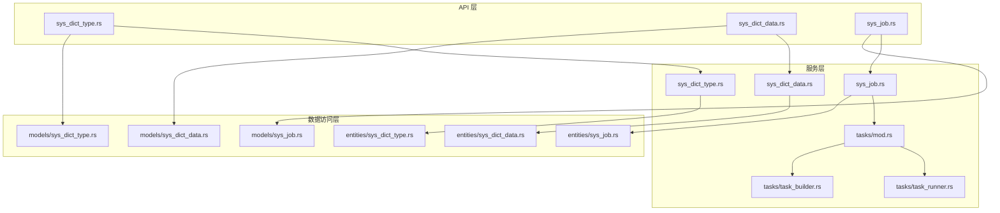
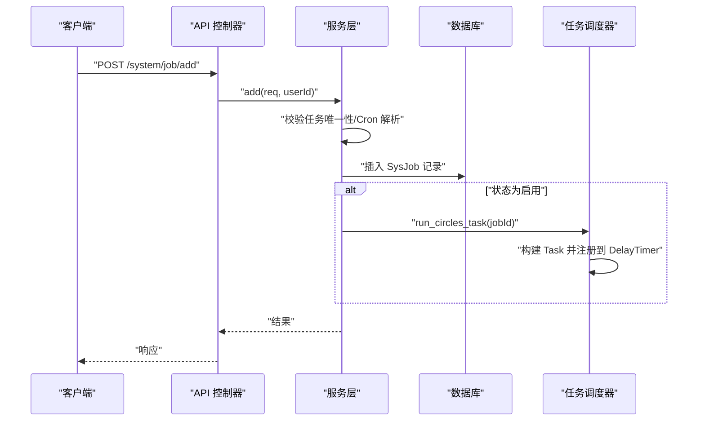
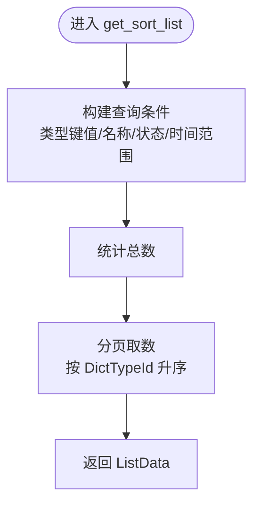
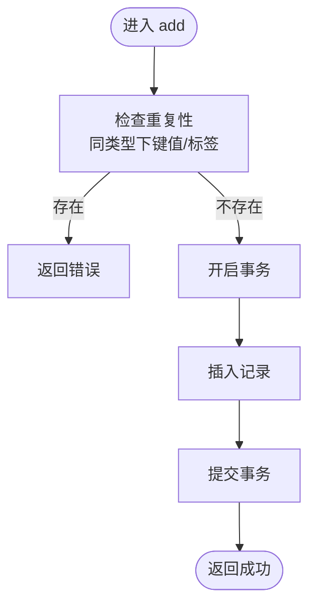
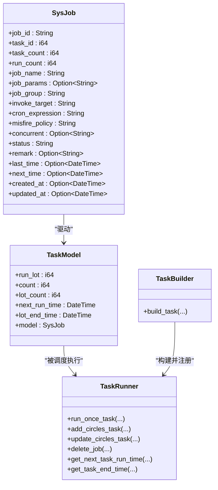
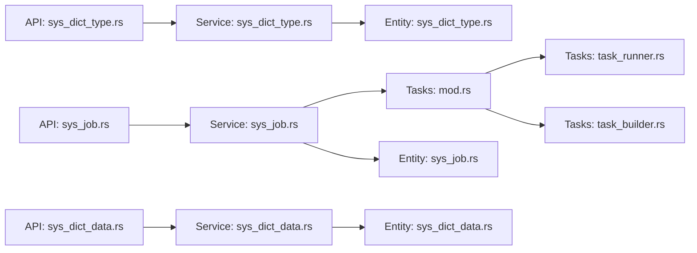

# 数据字典与定时任务模块

<cite>
**本文引用的文件**
- [api/src/system/sys_dict_type.rs](file://api/src/system/sys_dict_type.rs)
- [api/src/system/sys_dict_data.rs](file://api/src/system/sys_dict_data.rs)
- [api/src/system/sys_job.rs](file://api/src/system/sys_job.rs)
- [service/src/system/sys_dict_type.rs](file://service/src/system/sys_dict_type.rs)
- [service/src/system/sys_dict_data.rs](file://service/src/system/sys_dict_data.rs)
- [service/src/system/sys_job.rs](file://service/src/system/sys_job.rs)
- [service/src/tasks/mod.rs](file://service/src/tasks/mod.rs)
- [service/src/tasks/task_runner.rs](file://service/src/tasks/task_runner.rs)
- [service/src/tasks/task_builder.rs](file://service/src/tasks/task_builder.rs)
- [db/src/system/entities/sys_dict_type.rs](file://db/src/system/entities/sys_dict_type.rs)
- [db/src/system/entities/sys_dict_data.rs](file://db/src/system/entities/sys_dict_data.rs)
- [db/src/system/entities/sys_job.rs](file://db/src/system/entities/sys_job.rs)
- [db/src/system/models/sys_dict_type.rs](file://db/src/system/models/sys_dict_type.rs)
- [db/src/system/models/sys_dict_data.rs](file://db/src/system/models/sys_dict_data.rs)
- [db/src/system/models/sys_job.rs](file://db/src/system/models/sys_job.rs)
- [api/src/route.rs](file://api/src/route.rs)
</cite>

## 目录
1. [简介](#简介)
2. [项目结构](#项目结构)
3. [核心组件](#核心组件)
4. [架构总览](#架构总览)
5. [详细组件分析](#详细组件分析)
6. [依赖关系分析](#依赖关系分析)
7. [性能考量](#性能考量)
8. [故障排查指南](#故障排查指南)
9. [结论](#结论)
10. [附录：API 接口规范与使用示例](#附录api-接口规范与使用示例)

## 简介
本技术文档聚焦于“数据字典”与“定时任务”两大模块，系统性阐述其设计思路、数据模型、服务层实现、任务执行机制与 API 规范，并提供最佳实践建议。数据字典模块涵盖字典类型与字典数据的增删改查、查询过滤与分页；定时任务模块涵盖任务创建、Cron 表达式校验、任务调度、状态变更与日志记录。文档同时给出面向开发与运维的排障建议与性能优化要点。

## 项目结构
围绕数据字典与定时任务，代码按“API 层 → 服务层 → 数据访问层（SeaORM 实体/模型）”分层组织，路由统一由系统模块挂载到 /system 路径下，配合鉴权与操作日志中间件。

图表来源
- [api/src/system/sys_dict_type.rs](file://api/src/system/sys_dict_type.rs#L1-L81)
- [api/src/system/sys_dict_data.rs](file://api/src/system/sys_dict_data.rs#L1-L90)
- [api/src/system/sys_job.rs](file://api/src/system/sys_job.rs#L1-L96)
- [service/src/system/sys_dict_type.rs](file://service/src/system/sys_dict_type.rs#L1-L193)
- [service/src/system/sys_dict_data.rs](file://service/src/system/sys_dict_data.rs#L1-L196)
- [service/src/system/sys_job.rs](file://service/src/system/sys_job.rs#L1-L276)
- [service/src/tasks/mod.rs](file://service/src/tasks/mod.rs#L1-L92)
- [service/src/tasks/task_runner.rs](file://service/src/tasks/task_runner.rs#L1-L324)
- [service/src/tasks/task_builder.rs](file://service/src/tasks/task_builder.rs#L1-L64)
- [db/src/system/entities/sys_dict_type.rs](file://db/src/system/entities/sys_dict_type.rs#L1-L83)
- [db/src/system/entities/sys_dict_data.rs](file://db/src/system/entities/sys_dict_data.rs#L1-L98)
- [db/src/system/entities/sys_job.rs](file://db/src/system/entities/sys_job.rs#L1-L116)
- [db/src/system/models/sys_dict_type.rs](file://db/src/system/models/sys_dict_type.rs#L1-L33)
- [db/src/system/models/sys_dict_data.rs](file://db/src/system/models/sys_dict_data.rs#L1-L44)
- [db/src/system/models/sys_job.rs](file://db/src/system/models/sys_job.rs#L1-L69)

章节来源
- [api/src/route.rs](file://api/src/route.rs#L12-L22)

## 核心组件
- 数据字典类型（SysDictType）
  - 关键字段：类型标识、类型名称、类型键值、状态、备注、创建/更新者、创建/更新时间、软删除时间
  - 主要能力：分页查询、新增、删除（带关联约束检查）、编辑、按 ID 查询、查询全部启用项
- 数据字典数据（SysDictData）
  - 关键字段：数据标识、排序、标签、键值、类型键值、CSS 类、列表类、是否默认、状态、备注、创建/更新者、创建/更新时间、软删除时间
  - 主要能力：分页查询、新增（重复性校验）、删除、编辑、按 ID 查询、按类型查询、查询全部启用项
- 定时任务（SysJob）
  - 关键字段：任务标识、任务计数、运行计数、任务名、任务组、调用目标、Cron 表达式、错失策略、并发标志、状态、备注、下次/上次执行时间、创建/更新者、创建/更新时间、软删除时间
  - 主要能力：分页查询、新增（Cron 解析与状态联动）、删除（联动移除调度器）、编辑（状态变化触发调度器更新/添加/删除）、按 ID 查询、查询启用任务、变更状态、一次性执行、Cron 校验

章节来源
- [db/src/system/entities/sys_dict_type.rs](file://db/src/system/entities/sys_dict_type.rs#L15-L27)
- [db/src/system/entities/sys_dict_data.rs](file://db/src/system/entities/sys_dict_data.rs#L15-L32)
- [db/src/system/entities/sys_job.rs](file://db/src/system/entities/sys_job.rs#L15-L38)
- [db/src/system/models/sys_dict_type.rs](file://db/src/system/models/sys_dict_type.rs#L3-L10)
- [db/src/system/models/sys_dict_data.rs](file://db/src/system/models/sys_dict_data.rs#L3-L11)
- [db/src/system/models/sys_job.rs](file://db/src/system/models/sys_job.rs#L3-L9)

## 架构总览
系统采用典型的三层架构：API 控制器负责参数接收与响应封装；服务层承担业务逻辑与数据一致性（事务、约束校验）；数据访问层基于 SeaORM 实体与模型进行数据库交互。定时任务通过 DelayTimer 异步调度器实现 Cron 调度，结合服务层的任务模型与日志写入，形成闭环。

图表来源
- [api/src/system/sys_job.rs](file://api/src/system/sys_job.rs#L27-L34)
- [service/src/system/sys_job.rs](file://service/src/system/sys_job.rs#L88-L131)
- [service/src/tasks/mod.rs](file://service/src/tasks/mod.rs#L72-L80)
- [service/src/tasks/task_builder.rs](file://service/src/tasks/task_builder.rs#L27-L55)

## 详细组件分析

### 数据字典类型（SysDictType）分析
- 实体模型
  - 字段覆盖：标识、名称、类型键值（唯一）、状态、备注、创建/更新者、创建/更新时间、软删除时间
  - 关系：无外键关系，独立表
- 服务层逻辑
  - 列表查询：支持按类型键值、名称、状态、时间范围过滤，分页与排序
  - 新增：唯一性校验（类型键值），事务内插入
  - 删除：关联数据检查（若存在对应字典数据则禁止删除），事务内批量删除
  - 编辑：按主键更新多个字段
  - 查询：按 ID 查询单条，查询全部启用项
- 复杂度与性能
  - 查询：分页 + 条件过滤，索引建议：类型键值、状态、创建时间
  - 写入：事务保障，批量删除 O(n)

图表来源
- [service/src/system/sys_dict_type.rs](file://service/src/system/sys_dict_type.rs#L19-L63)

章节来源
- [service/src/system/sys_dict_type.rs](file://service/src/system/sys_dict_type.rs#L19-L193)
- [db/src/system/entities/sys_dict_type.rs](file://db/src/system/entities/sys_dict_type.rs#L15-L83)
- [db/src/system/models/sys_dict_type.rs](file://db/src/system/models/sys_dict_type.rs#L3-L33)

### 数据字典数据（SysDictData）分析
- 实体模型
  - 字段覆盖：标识、排序、标签、键值、类型键值、CSS/列表样式、是否默认、状态、备注、创建/更新者、创建/更新时间、软删除时间
- 服务层逻辑
  - 列表查询：按类型、标签、状态、时间范围过滤，按排序字段分页
  - 新增：重复性校验（同类型下键值或标签重复即拒绝），事务内插入
  - 删除：批量删除
  - 编辑：按 ID 查找并更新
  - 查询：按 ID 查询、按类型查询并排序
- 复杂度与性能
  - 查询：分页 + 条件过滤，索引建议：类型键值、状态、创建时间、排序字段
  - 写入：事务保障，重复性校验 O(1) 查询

图表来源
- [service/src/system/sys_dict_data.rs](file://service/src/system/sys_dict_data.rs#L79-L112)

章节来源
- [service/src/system/sys_dict_data.rs](file://service/src/system/sys_dict_data.rs#L17-L196)
- [db/src/system/entities/sys_dict_data.rs](file://db/src/system/entities/sys_dict_data.rs#L15-L98)
- [db/src/system/models/sys_dict_data.rs](file://db/src/system/models/sys_dict_data.rs#L3-L44)

### 定时任务（SysJob）分析
- 实体模型
  - 字段覆盖：任务标识、任务计数、运行计数、任务名、任务组、调用目标、Cron 表达式、错失策略、并发标志、状态、备注、下次/上次执行时间、创建/更新者、创建/更新时间、软删除时间
- 服务层逻辑
  - 列表查询：按任务名/组/状态过滤，分页
  - 新增：唯一性校验（任务名或任务 ID 已存在即拒绝），Cron 解析，状态为启用时立即注册到调度器
  - 删除：逐条查找并从调度器移除，再批量删除
  - 编辑：唯一性校验，Cron 解析，根据状态变化决定添加/更新/删除调度器
  - 状态变更：启用则启动，禁用则移除
  - Cron 校验：解析表达式并返回未来若干次执行时间
- 执行机制
  - 调度器：DelayTimer，基于 Cron 的异步任务调度
  - 任务模型：TaskModel 维护运行批次、次数、下次运行时间、结束时间等
  - 日志：每次执行写入任务日志，记录消息/异常、耗时、状态与备注更新

图表来源
- [db/src/system/entities/sys_job.rs](file://db/src/system/entities/sys_job.rs#L15-L38)
- [service/src/tasks/mod.rs](file://service/src/tasks/mod.rs#L25-L33)
- [service/src/tasks/task_runner.rs](file://service/src/tasks/task_runner.rs#L19-L70)
- [service/src/tasks/task_builder.rs](file://service/src/tasks/task_builder.rs#L27-L55)

章节来源
- [service/src/system/sys_job.rs](file://service/src/system/sys_job.rs#L24-L276)
- [service/src/tasks/mod.rs](file://service/src/tasks/mod.rs#L35-L92)
- [service/src/tasks/task_runner.rs](file://service/src/tasks/task_runner.rs#L72-L324)
- [service/src/tasks/task_builder.rs](file://service/src/tasks/task_builder.rs#L27-L64)
- [db/src/system/entities/sys_job.rs](file://db/src/system/entities/sys_job.rs#L15-L116)
- [db/src/system/models/sys_job.rs](file://db/src/system/models/sys_job.rs#L11-L69)

## 依赖关系分析
- API 层依赖服务层提供的业务方法，统一返回封装
- 服务层依赖 SeaORM 实体与模型进行数据库操作，部分方法使用事务保障一致性
- 定时任务模块依赖 DelayTimer 调度器与内部任务模型，执行时写入日志并更新任务元数据

图表来源
- [api/src/system/sys_dict_type.rs](file://api/src/system/sys_dict_type.rs#L1-L81)
- [api/src/system/sys_dict_data.rs](file://api/src/system/sys_dict_data.rs#L1-L90)
- [api/src/system/sys_job.rs](file://api/src/system/sys_job.rs#L1-L96)
- [service/src/system/sys_dict_type.rs](file://service/src/system/sys_dict_type.rs#L1-L193)
- [service/src/system/sys_dict_data.rs](file://service/src/system/sys_dict_data.rs#L1-L196)
- [service/src/system/sys_job.rs](file://service/src/system/sys_job.rs#L1-L276)
- [service/src/tasks/mod.rs](file://service/src/tasks/mod.rs#L1-L92)
- [service/src/tasks/task_runner.rs](file://service/src/tasks/task_runner.rs#L1-L324)
- [service/src/tasks/task_builder.rs](file://service/src/tasks/task_builder.rs#L1-L64)
- [db/src/system/entities/sys_dict_type.rs](file://db/src/system/entities/sys_dict_type.rs#L1-L83)
- [db/src/system/entities/sys_dict_data.rs](file://db/src/system/entities/sys_dict_data.rs#L1-L98)
- [db/src/system/entities/sys_job.rs](file://db/src/system/entities/sys_job.rs#L1-L116)

## 性能考量
- 数据字典
  - 建议对类型键值、状态、创建时间建立索引，以提升查询与过滤效率
  - 新增/编辑使用事务，避免脏写；批量删除注意锁竞争
- 定时任务
  - Cron 表达式解析与未来时间计算在服务层完成，建议缓存热点表达式的解析结果
  - 调度器并发与任务数量受控，避免过多高频任务导致资源争用
  - 日志写入使用事务，确保一致性但可能带来写放大，可结合异步落盘策略优化

## 故障排查指南
- 数据字典
  - 新增失败提示“类型已存在”：检查类型键值唯一性
  - 删除失败提示“存在关联数据”：先清理对应字典数据
- 定时任务
  - 新增失败提示“cron 表达式解析错误”：使用 Cron 校验接口确认
  - 任务未执行：检查任务状态、调度器是否已注册、任务计数与结束时间
  - 任务日志异常：查看任务日志表记录的消息与异常信息，定位具体调用目标

章节来源
- [service/src/system/sys_dict_type.rs](file://service/src/system/sys_dict_type.rs#L80-L83)
- [service/src/system/sys_dict_type.rs](file://service/src/system/sys_dict_type.rs#L130-L132)
- [service/src/system/sys_job.rs](file://service/src/system/sys_job.rs#L99-L102)
- [service/src/system/sys_job.rs](file://service/src/system/sys_job.rs#L166-L169)
- [service/src/tasks/task_runner.rs](file://service/src/tasks/task_runner.rs#L193-L239)

## 结论
本模块通过清晰的分层设计与严格的约束校验，提供了稳定的数据字典管理能力与灵活可靠的定时任务调度体系。API 层统一入口、服务层强一致、数据层模型明确，配合 DelayTimer 的高效调度与完善的日志记录，满足生产环境的可用性与可观测性要求。

## 附录：API 接口规范与使用示例

### 数据字典类型 API
- 列表查询
  - 方法：GET
  - 路径：/system/dict/type/list
  - 查询参数：分页参数、类型键值、类型名称、状态、起止时间
  - 返回：分页数据结构
- 新增
  - 方法：POST
  - 路径：/system/dict/type/add
  - 请求体：类型名称、类型键值、状态、备注
  - 返回：操作结果消息
- 删除
  - 方法：POST
  - 路径：/system/dict/type/delete
  - 请求体：类型标识数组
  - 返回：删除条数
- 编辑
  - 方法：POST
  - 路径：/system/dict/type/edit
  - 请求体：类型标识、类型名称、类型键值、状态、备注
  - 返回：更新结果
- 按 ID 查询
  - 方法：GET
  - 路径：/system/dict/type/get_by_id
  - 查询参数：类型标识
  - 返回：单条记录
- 查询全部
  - 方法：GET
  - 路径：/system/dict/type/get_all
  - 返回：启用的类型列表

章节来源
- [api/src/system/sys_dict_type.rs](file://api/src/system/sys_dict_type.rs#L17-L80)

### 数据字典数据 API
- 列表查询
  - 方法：GET
  - 路径：/system/dict/data/list
  - 查询参数：分页参数、类型键值、标签、状态、起止时间
  - 返回：分页数据结构
- 新增
  - 方法：POST
  - 路径：/system/dict/data/add
  - 请求体：类型键值、标签、键值、排序、CSS/列表样式、是否默认、状态、备注
  - 返回：操作结果消息
- 删除
  - 方法：POST
  - 路径：/system/dict/data/delete
  - 请求体：数据标识数组
  - 返回：删除条数
- 编辑
  - 方法：POST
  - 路径：/system/dict/data/edit
  - 请求体：数据标识、类型键值、标签、键值、排序、CSS/列表样式、是否默认、状态、备注
  - 返回：更新结果
- 按 ID 查询
  - 方法：GET
  - 路径：/system/dict/data/get_by_id
  - 查询参数：数据标识
  - 返回：单条记录
- 按类型查询
  - 方法：GET
  - 路径：/system/dict/data/get_by_type
  - 查询参数：类型键值
  - 返回：该类型的字典数据列表
- 查询全部
  - 方法：GET
  - 路径：/system/dict/data/get_all
  - 返回：启用的字典数据列表

章节来源
- [api/src/system/sys_dict_data.rs](file://api/src/system/sys_dict_data.rs#L16-L89)

### 定时任务 API
- 列表查询
  - 方法：GET
  - 路径：/system/job/list
  - 查询参数：分页参数、任务名、任务组、状态
  - 返回：分页数据结构
- 新增
  - 方法：POST
  - 路径：/system/job/add
  - 请求体：任务名、任务组、调用目标、Cron 表达式、任务计数、错失策略、并发标志、状态、备注、任务参数
  - 返回：任务标识与结果消息
- 删除
  - 方法：POST
  - 路径：/system/job/delete
  - 请求体：任务标识数组
  - 返回：删除条数
- 编辑
  - 方法：POST
  - 路径：/system/job/edit
  - 请求体：任务标识、任务名、任务组、调用目标、Cron 表达式、任务计数、错失策略、并发标志、状态、备注、任务参数
  - 返回：更新结果
- 按 ID 查询
  - 方法：GET
  - 路径：/system/job/get_by_id
  - 查询参数：任务标识
  - 返回：单条记录
- 变更状态
  - 方法：POST
  - 路径：/system/job/change_status
  - 请求体：任务标识、新状态
  - 返回：状态变更结果
- 一次性执行
  - 方法：POST
  - 路径：/system/job/run_task_once
  - 请求体：任务标识、任务 ID
  - 返回：执行提示
- Cron 表达式校验
  - 方法：POST
  - 路径：/system/job/validate_cron_str
  - 请求体：Cron 字符串
  - 返回：校验结果与未来若干次执行时间

章节来源
- [api/src/system/sys_job.rs](file://api/src/system/sys_job.rs#L17-L95)

### 数据字典应用场景
- 下拉列表生成：前端拉取全部启用的字典类型与字典数据，按类型键值聚合
- 状态码管理：统一的状态枚举（如启用/停用）通过字典数据维护
- 枚举值维护：业务中常用的枚举值集中管理，便于统一调整与审计

### 定时任务配置最佳实践
- Cron 表达式
  - 使用 Cron 校验接口验证表达式正确性与未来执行时间
  - 避免过于频繁的调度（如秒级），优先分钟级及以上粒度
- 任务命名规范
  - 任务名与任务组语义化，便于识别与检索
- 并发与重试
  - 并发标志按需开启，避免资源争用
  - 错失策略选择合适策略（如立即执行或等待下一次）
- 监控与告警
  - 关注任务日志中的异常信息与耗时指标
  - 对长时间未执行或异常频发的任务及时干预