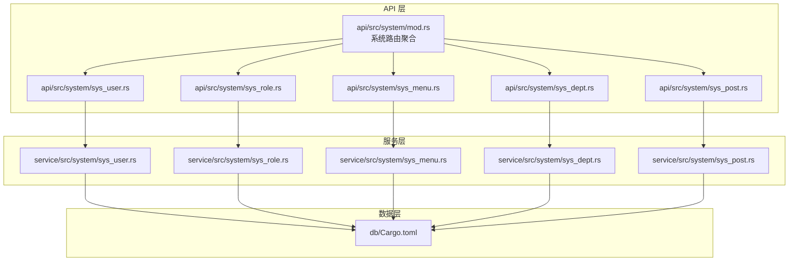
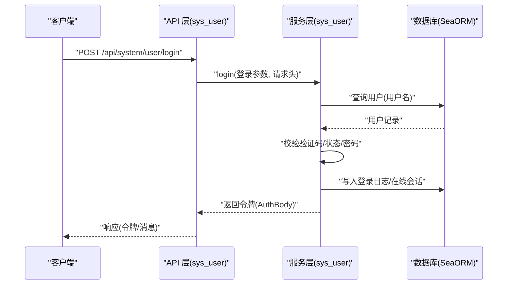
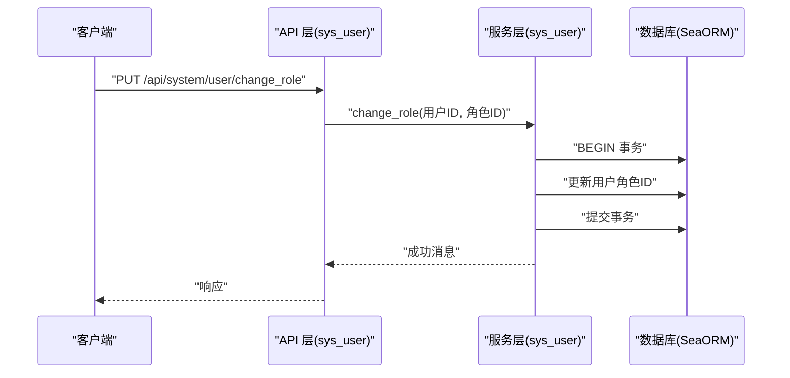
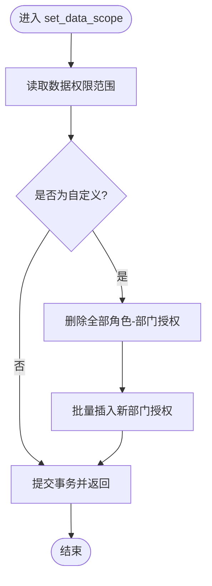
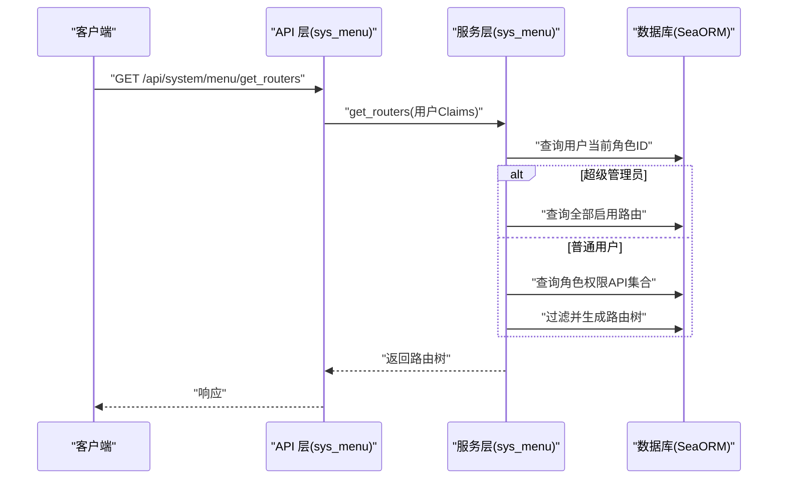
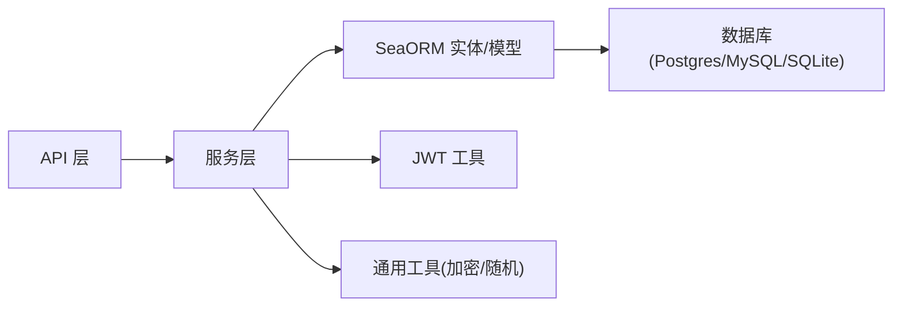

# 核心模块

<cite>
**本文引用的文件**
- [api/Cargo.toml](file://api/Cargo.toml)
- [api/src/lib.rs](file://api/src/lib.rs)
- [api/src/system/mod.rs](file://api/src/system/mod.rs)
- [api/src/system/sys_user.rs](file://api/src/system/sys_user.rs)
- [api/src/system/sys_role.rs](file://api/src/system/sys_role.rs)
- [api/src/system/sys_menu.rs](file://api/src/system/sys_menu.rs)
- [api/src/system/sys_dept.rs](file://api/src/system/sys_dept.rs)
- [api/src/system/sys_post.rs](file://api/src/system/sys_post.rs)
- [service/Cargo.toml](file://service/Cargo.toml)
- [service/src/system/sys_user.rs](file://service/src/system/sys_user.rs)
- [service/src/system/sys_role.rs](file://service/src/system/sys_role.rs)
- [service/src/system/sys_menu.rs](file://service/src/system/sys_menu.rs)
- [service/src/system/sys_dept.rs](file://service/src/system/sys_dept.rs)
- [service/src/system/sys_post.rs](file://service/src/system/sys_post.rs)
- [db/Cargo.toml](file://db/Cargo.toml)
</cite>

## 目录
1. [引言](#引言)
2. [项目结构](#项目结构)
3. [核心组件](#核心组件)
4. [架构总览](#架构总览)
5. [详细组件分析](#详细组件分析)
6. [依赖分析](#依赖分析)
7. [性能考虑](#性能考虑)
8. [故障排查指南](#故障排查指南)
9. [结论](#结论)
10. [附录](#附录)

## 引言
本文件聚焦 Axum Admin 的核心业务模块，系统性梳理用户管理、角色权限、菜单管理、部门组织、岗位管理等模块的设计与实现，覆盖业务逻辑、数据模型、API 接口与使用场景，并阐明模块间协作关系、权限控制机制与数据一致性保障。文档同时提供扩展与定制化建议，帮助不同层次的开发者快速上手并深入掌握系统。

## 项目结构
Axum Admin 采用清晰的分层与模块化设计：
- API 层：负责路由注册与请求入口，调用服务层处理业务。
- 服务层：封装领域业务逻辑，协调数据库实体与模型，执行事务与权限计算。
- 数据访问层：基于 SeaORM，提供实体与模型，屏蔽数据库差异。
- 配置与中间件：统一配置加载与通用中间件能力（鉴权、操作日志等）。

图表来源
- [api/src/system/mod.rs](file://api/src/system/mod.rs#L26-L44)
- [api/src/system/sys_user.rs](file://api/src/system/sys_user.rs#L1-L206)
- [api/src/system/sys_role.rs](file://api/src/system/sys_role.rs#L1-L200)
- [api/src/system/sys_menu.rs](file://api/src/system/sys_menu.rs#L1-L120)
- [api/src/system/sys_dept.rs](file://api/src/system/sys_dept.rs#L1-L92)
- [api/src/system/sys_post.rs](file://api/src/system/sys_post.rs#L1-L82)
- [service/src/system/sys_user.rs](file://service/src/system/sys_user.rs#L1-L649)
- [service/src/system/sys_role.rs](file://service/src/system/sys_role.rs#L1-L369)
- [service/src/system/sys_menu.rs](file://service/src/system/sys_menu.rs#L1-L499)
- [service/src/system/sys_dept.rs](file://service/src/system/sys_dept.rs#L1-L214)
- [service/src/system/sys_post.rs](file://service/src/system/sys_post.rs#L1-L227)
- [db/Cargo.toml](file://db/Cargo.toml#L1-L25)

章节来源
- [api/src/lib.rs](file://api/src/lib.rs#L1-L10)
- [api/src/system/mod.rs](file://api/src/system/mod.rs#L1-L199)
- [api/Cargo.toml](file://api/Cargo.toml#L1-L22)
- [service/Cargo.toml](file://service/Cargo.toml#L1-L39)
- [db/Cargo.toml](file://db/Cargo.toml#L1-L25)

## 核心组件
- 用户管理（sys_user）
  - 职责：用户增删改查、登录认证、密码重置/更新、状态变更、角色/部门/岗位关联、头像上传等。
  - 关键接口：登录、获取用户信息、重置密码、更新个人资料、切换角色/部门、刷新 Token 等。
- 角色管理（sys_role）
  - 职责：角色增删改查、状态变更、数据权限范围设置、角色授权（菜单 API）、角色与用户/部门关联。
  - 关键接口：设置数据范围、获取角色授权菜单/部门、角色编辑与授权更新等。
- 菜单管理（sys_menu）
  - 职责：菜单树构建、路由生成、API 与数据库关联、日志与缓存策略配置、权限映射。
  - 关键接口：获取全部启用菜单树、按角色生成用户路由、获取菜单详情与关联 API/DB。
- 部门管理（sys_dept）
  - 职责：部门树构建、部门增删改查、部门与角色授权。
  - 关键接口：获取部门树、部门列表与详情、按角色获取授权部门。
- 岗位管理（sys_post）
  - 职责：岗位增删改查、用户岗位关联维护。
  - 关键接口：岗位列表与详情、用户岗位 ID 列表、批量维护用户岗位。

章节来源
- [api/src/system/sys_user.rs](file://api/src/system/sys_user.rs#L24-L206)
- [api/src/system/sys_role.rs](file://api/src/system/sys_role.rs#L16-L131)
- [api/src/system/sys_menu.rs](file://api/src/system/sys_menu.rs#L16-L120)
- [api/src/system/sys_dept.rs](file://api/src/system/sys_dept.rs#L17-L92)
- [api/src/system/sys_post.rs](file://api/src/system/sys_post.rs#L17-L82)

## 架构总览
系统遵循“API → 服务 → 数据”的分层架构，API 层仅做参数校验与响应封装；服务层承担复杂业务规则与事务控制；数据层通过 SeaORM 实体与模型抽象数据库访问。权限控制以“角色 → 菜单 API → 用户”为主线，结合“超级管理员白名单”与“数据权限范围”实现细粒度控制。

图表来源
- [api/src/system/sys_user.rs](file://api/src/system/sys_user.rs#L98-L104)
- [service/src/system/sys_user.rs](file://service/src/system/sys_user.rs#L510-L568)

## 详细组件分析

### 用户管理模块（sys_user）
- 业务逻辑
  - 登录流程：校验验证码、查询用户、状态与密码校验、签发 JWT、写入登录日志与在线会话。
  - 密码管理：重置密码（管理员）与更新密码（本人），均使用盐值加密。
  - 个人信息：支持更新昵称、手机、邮箱、性别等；头像上传后回写用户记录。
  - 关联维护：新增/编辑用户时，同步维护用户与岗位、角色、部门的关系。
  - 状态与切换：支持修改用户状态、切换角色/部门。
- 数据模型与关系
  - 用户与部门：一对一关联，查询用户列表时左连部门信息。
  - 用户与岗位/角色/部门：多对多通过中间表维护。
- API 接口概览
  - GET /list、GET /get_by_id、GET /get_profile、PUT /update_profile
  - POST /add、PUT /edit、DELETE /delete
  - PUT /reset_passwd、PUT /update_passwd、PUT /change_status
  - PUT /change_role、PUT /change_dept、PUT /fresh_token
  - POST /update_avatar
- 权限与安全
  - 登录成功后写入在线会话与登录日志；刷新 Token 时更新在线会话有效期。
  - 支持超级管理员白名单绕过权限校验。
- 事务与一致性
  - 新增/编辑用户：开启事务，原子性写入用户基础信息与多对多关系。
  - 删除用户：级联删除岗位/角色/部门关系，保证数据一致。

图表来源
- [api/src/system/sys_user.rs](file://api/src/system/sys_user.rs#L174-L181)
- [service/src/system/sys_user.rs](file://service/src/system/sys_user.rs#L399-L412)

章节来源
- [api/src/system/sys_user.rs](file://api/src/system/sys_user.rs#L24-L206)
- [service/src/system/sys_user.rs](file://service/src/system/sys_user.rs#L26-L649)

### 角色管理模块（sys_role）
- 业务逻辑
  - 角色 CRUD：名称/键唯一性校验，编辑时排除自身。
  - 数据权限范围：支持全部、本级及以下、自定义（需绑定部门集合）。
  - 角色授权：根据菜单集合生成角色 API 授权清单，支持批量更新。
  - 角色与用户/部门：提供角色授权用户的查询与批量授权/取消授权接口。
- API 接口概览
  - GET /list、GET /get_all、GET /get_by_id、POST /add、PUT /edit、DELETE /delete
  - PUT /change_status、PUT /set_data_scope
  - GET /get_role_menu、GET /get_role_dept
- 权限与安全
  - 数据权限范围为“自定义”时，自动清理并重建角色-部门授权。
  - 超级管理员可绕过权限限制。
- 事务与一致性
  - 新增/编辑角色：事务内写入角色、删除并重建角色 API 授权。
  - 删除角色：级联删除角色 API 与角色-部门授权。

图表来源
- [service/src/system/sys_role.rs](file://service/src/system/sys_role.rs#L246-L281)

章节来源
- [api/src/system/sys_role.rs](file://api/src/system/sys_role.rs#L16-L131)
- [service/src/system/sys_role.rs](file://service/src/system/sys_role.rs#L27-L369)

### 菜单管理模块（sys_menu）
- 业务逻辑
  - 菜单树构建：支持“全部启用路由树”“全部菜单树”两类视图，按排序生成树形结构。
  - 路由生成：根据角色权限过滤菜单，生成用户可用路由树。
  - API 与数据库关联：支持查询菜单关联的数据库与 API 列表，便于权限治理。
  - 日志与缓存策略：支持更新菜单的日志记录与数据缓存策略。
- API 接口概览
  - GET /list、GET /get_by_id、POST /add、PUT /edit、DELETE /delete
  - PUT /update_log_cache_method
  - GET /get_all_enabled_menu_tree、GET /get_routers、GET /get_auth_list
- 权限与安全
  - 超级管理员可获取全部路由树；普通用户按角色权限过滤。
  - 菜单编辑时异步更新全局 API 注册与角色 API 授权。
- 事务与一致性
  - 新增/编辑：校验重复（路径/名称），写入后异步更新 API 注册与角色 API 授权。
  - 删除：若存在子菜单则拒绝删除，避免破坏树结构。

图表来源
- [api/src/system/sys_menu.rs](file://api/src/system/sys_menu.rs#L101-L119)
- [service/src/system/sys_menu.rs](file://service/src/system/sys_menu.rs#L360-L374)

章节来源
- [api/src/system/sys_menu.rs](file://api/src/system/sys_menu.rs#L16-L120)
- [service/src/system/sys_menu.rs](file://service/src/system/sys_menu.rs#L24-L499)

### 部门管理模块（sys_dept）
- 业务逻辑
  - 部门树构建：按排序生成树形结构，支持获取全部启用部门。
  - 部门授权：根据角色获取授权部门 ID 列表，支撑数据权限范围“本级及以下/自定义”。
- API 接口概览
  - GET /list、GET /get_all、GET /get_dept_tree、GET /get_by_id、POST /add、PUT /edit、DELETE /delete
- 事务与一致性
  - 新增/编辑：校验名称唯一性，编辑时排除自身。
  - 删除：直接删除，不进行级联校验（由上层业务约束）。

章节来源
- [api/src/system/sys_dept.rs](file://api/src/system/sys_dept.rs#L17-L92)
- [service/src/system/sys_dept.rs](file://service/src/system/sys_dept.rs#L19-L214)

### 岗位管理模块（sys_post）
- 业务逻辑
  - 岗位 CRUD：编码/名称唯一性校验，编辑时排除自身。
  - 用户岗位关系：提供按用户批量删除与新增岗位关系的能力。
- API 接口概览
  - GET /list、GET /get_all、GET /get_by_id、POST /add、PUT /edit、DELETE /delete
- 事务与一致性
  - 新增/编辑：校验唯一性后写入。
  - 用户岗位关系：批量删除与插入，保证用户岗位集合准确。

章节来源
- [api/src/system/sys_post.rs](file://api/src/system/sys_post.rs#L17-L82)
- [service/src/system/sys_post.rs](file://service/src/system/sys_post.rs#L16-L227)

## 依赖分析
- 模块耦合
  - API 层仅依赖服务层与通用工具，保持薄路由职责。
  - 服务层围绕实体与模型进行组合，内部通过事务保证一致性。
  - 数据层通过 SeaORM 抽象数据库访问，支持多后端（Postgres/MySQL/SQLite）。
- 外部依赖
  - 认证：JWT（jsonwebtoken）与自定义 Claims 结构。
  - 工具：随机盐值、加密、UUID 生成、系统信息采集等。
  - 中间件：操作日志、在线会话、缓存等（在其他模块中体现）。

图表来源
- [api/Cargo.toml](file://api/Cargo.toml#L8-L22)
- [service/Cargo.toml](file://service/Cargo.toml#L9-L39)
- [db/Cargo.toml](file://db/Cargo.toml#L9-L25)

章节来源
- [api/Cargo.toml](file://api/Cargo.toml#L1-L22)
- [service/Cargo.toml](file://service/Cargo.toml#L1-L39)
- [db/Cargo.toml](file://db/Cargo.toml#L1-L25)

## 性能考虑
- 分页与查询
  - 列表查询普遍采用分页器与条件拼接，建议在高频字段建立索引（如用户名、部门 ID、岗位 ID、角色 ID）。
- 并发与事务
  - 关键写入（用户/角色/菜单）使用事务包裹，减少并发冲突带来的不一致。
  - 对于批量写入（用户岗位/角色关系），优先使用批量插入以降低往返次数。
- 缓存与日志
  - 菜单的 API 注册与角色 API 授权采用异步更新，避免阻塞主流程。
  - 日志与在线会话写入采用异步任务，降低请求延迟。
- 加密与随机
  - 密码使用盐值加密，随机盐值生成，兼顾安全性与性能。

## 故障排查指南
- 登录失败
  - 核对验证码与用户状态；检查密码加密算法与盐值匹配。
  - 查看登录日志与在线会话是否正确写入。
- 权限异常
  - 确认角色是否为超级管理员；核对角色 API 授权是否随菜单编辑同步更新。
  - 检查数据权限范围（全部/本级及以下/自定义）与角色-部门授权。
- 数据不一致
  - 用户新增/编辑后岗位/角色/部门关系未生效：检查事务是否提交。
  - 删除用户后仍有关联数据残留：确认中间表清理逻辑是否执行。
- 菜单树异常
  - 子菜单未显示或删除报错：检查父节点是否存在子项，确保先删除子菜单再删除父节点。

章节来源
- [service/src/system/sys_user.rs](file://service/src/system/sys_user.rs#L510-L568)
- [service/src/system/sys_menu.rs](file://service/src/system/sys_menu.rs#L177-L191)
- [service/src/system/sys_role.rs](file://service/src/system/sys_role.rs#L246-L281)

## 结论
Axum Admin 的核心模块以清晰的分层与严格的事务控制实现了用户、角色、菜单、部门、岗位的完整闭环。通过“角色 → 菜单 API → 用户”的权限链路与“数据权限范围 + 部门授权”的组合，既能满足通用权限需求，又能灵活扩展。建议在生产环境中配合索引优化、异步任务与缓存策略进一步提升性能与稳定性。

## 附录
- 扩展与定制化建议
  - 新增业务实体：在 db 层定义实体与模型，在 service 层实现业务逻辑与事务，最后在 api 层暴露路由。
  - 自定义权限策略：可在服务层增加策略工厂或策略映射，结合角色 API 授权动态扩展。
  - 数据权限细化：可引入更细粒度的数据域（如组织行级权限），结合角色-部门授权实现。
  - 审计与追踪：在现有操作日志基础上，增加字段变更追踪与审计报表。