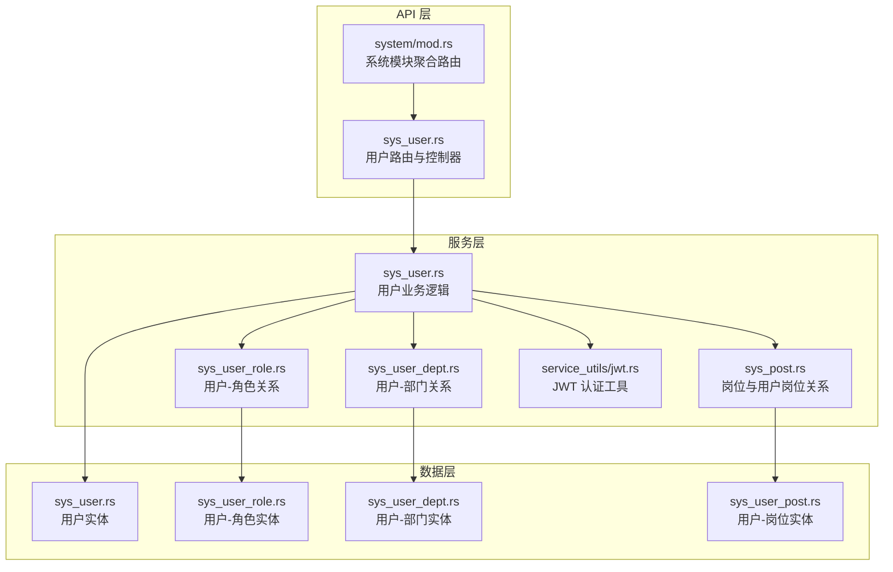
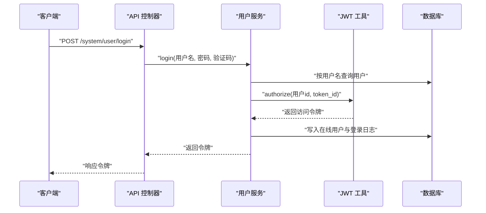
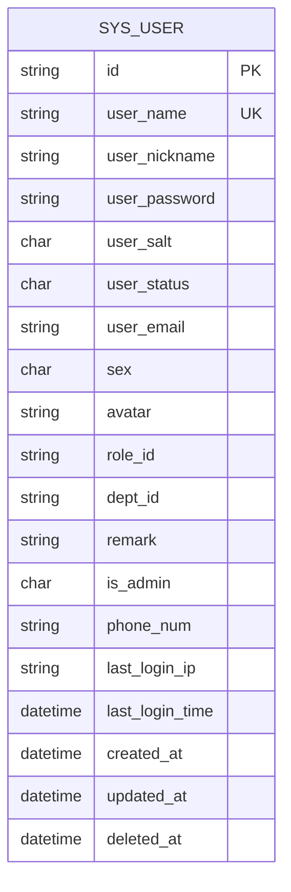
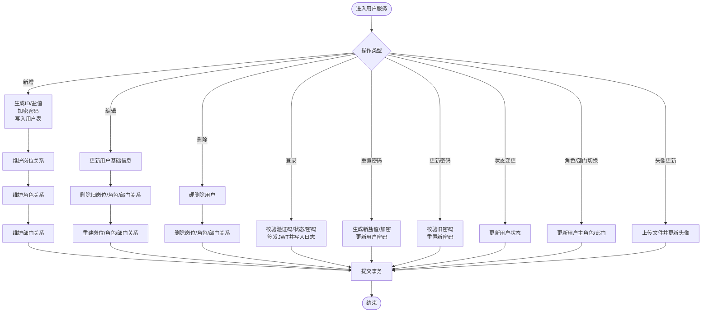
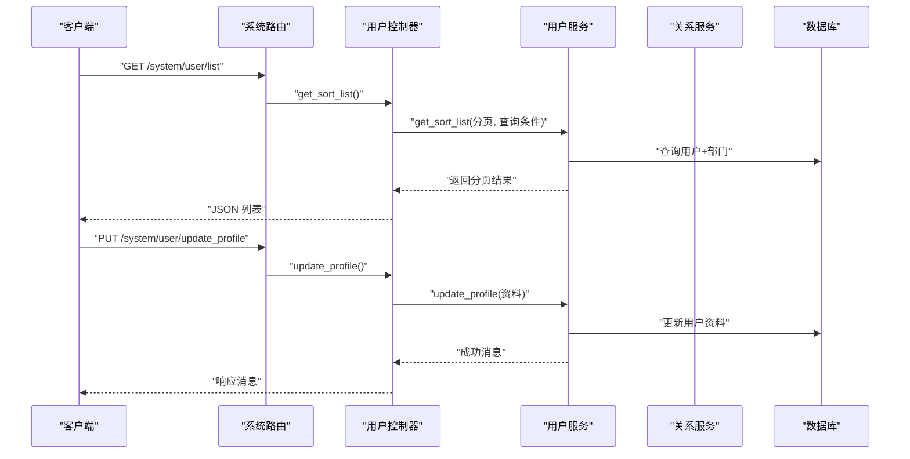
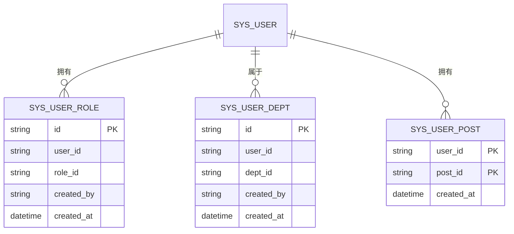
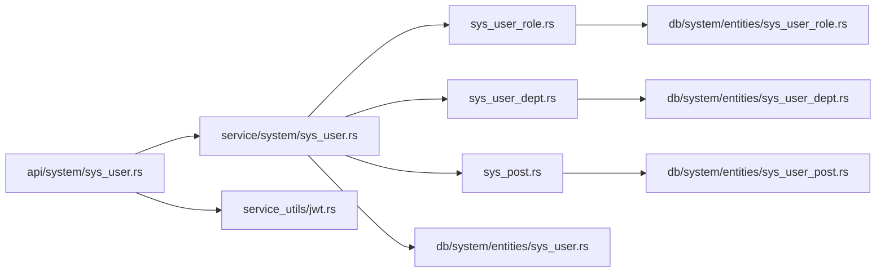

# 用户管理模块

<cite>
**本文引用的文件**
- [api/src/system/sys_user.rs](file://api/src/system/sys_user.rs)
- [api/src/system/mod.rs](file://api/src/system/mod.rs)
- [service/src/system/sys_user.rs](file://service/src/system/sys_user.rs)
- [service/src/system/sys_user_role.rs](file://service/src/system/sys_user_role.rs)
- [service/src/system/sys_user_dept.rs](file://service/src/system/sys_user_dept.rs)
- [service/src/system/sys_post.rs](file://service/src/system/sys_post.rs)
- [service/src/service_utils/jwt.rs](file://service/src/service_utils/jwt.rs)
- [db/src/system/entities/sys_user.rs](file://db/src/system/entities/sys_user.rs)
- [db/src/system/models/sys_user.rs](file://db/src/system/models/sys_user.rs)
- [db/src/system/entities/sys_user_role.rs](file://db/src/system/entities/sys_user_role.rs)
- [db/src/system/entities/sys_user_dept.rs](file://db/src/system/entities/sys_user_dept.rs)
- [db/src/system/entities/sys_user_post.rs](file://db/src/system/entities/sys_user_post.rs)
- [migration/data/m20220101_000001_create_table/obj_sys_user.sql](file://migration/data/m20220101_000001_create_table/obj_sys_user.sql)
</cite>

## 目录
1. [简介](#简介)
2. [项目结构](#项目结构)
3. [核心组件](#核心组件)
4. [架构总览](#架构总览)
5. [详细组件分析](#详细组件分析)
6. [依赖关系分析](#依赖关系分析)
7. [性能与安全](#性能与安全)
8. [故障排查指南](#故障排查指南)
9. [结论](#结论)
10. [附录：API 接口规范](#附录api-接口规范)

## 简介
本文件为“用户管理模块”的技术文档，覆盖用户注册、登录认证、用户信息维护、密码管理、用户状态控制、角色与部门关联、岗位关联、头像上传、批量删除等完整能力。文档从系统架构、数据模型、处理流程、API 规范、安全与性能、故障排查等方面进行深入说明，并给出与角色、部门、岗位模块的集成关系。

## 项目结构
用户管理模块位于 api、service、db 三层，分别负责：
- API 层：定义路由与请求响应封装，调用 service 层执行业务逻辑
- Service 层：实现用户 CRUD、登录认证、密码管理、状态变更、角色/部门/岗位关系维护、在线与登录日志等
- DB 层：SeaORM 实体与模型定义，映射 sys_user 及其关联表（sys_user_role、sys_user_dept、sys_user_post）

图表来源
- [api/src/system/sys_user.rs](file://api/src/system/sys_user.rs#L1-L206)
- [api/src/system/mod.rs](file://api/src/system/mod.rs#L46-L63)
- [service/src/system/sys_user.rs](file://service/src/system/sys_user.rs#L1-L649)
- [service/src/system/sys_user_role.rs](file://service/src/system/sys_user_role.rs#L1-L101)
- [service/src/system/sys_user_dept.rs](file://service/src/system/sys_user_dept.rs#L1-L57)
- [service/src/system/sys_post.rs](file://service/src/system/sys_post.rs#L1-L227)
- [service/src/service_utils/jwt.rs](file://service/src/service_utils/jwt.rs#L1-L164)
- [db/src/system/entities/sys_user.rs](file://db/src/system/entities/sys_user.rs#L1-L110)
- [db/src/system/entities/sys_user_role.rs](file://db/src/system/entities/sys_user_role.rs#L1-L68)
- [db/src/system/entities/sys_user_dept.rs](file://db/src/system/entities/sys_user_dept.rs#L1-L68)
- [db/src/system/entities/sys_user_post.rs](file://db/src/system/entities/sys_user_post.rs#L1-L63)

章节来源
- [api/src/system/mod.rs](file://api/src/system/mod.rs#L26-L63)
- [api/src/system/sys_user.rs](file://api/src/system/sys_user.rs#L21-L206)
- [service/src/system/sys_user.rs](file://service/src/system/sys_user.rs#L26-L649)
- [db/src/system/entities/sys_user.rs](file://db/src/system/entities/sys_user.rs#L1-L110)

## 核心组件
- 用户实体与模型：定义用户字段、约束、请求/响应模型
- 用户服务：用户增删改查、登录认证、密码管理、状态变更、角色/部门/岗位关系维护
- JWT 工具：签发与校验令牌、在线校验
- 关系服务：用户-角色、用户-部门、用户-岗位

章节来源
- [db/src/system/entities/sys_user.rs](file://db/src/system/entities/sys_user.rs#L15-L110)
- [db/src/system/models/sys_user.rs](file://db/src/system/models/sys_user.rs#L7-L153)
- [service/src/system/sys_user.rs](file://service/src/system/sys_user.rs#L275-L507)
- [service/src/service_utils/jwt.rs](file://service/src/service_utils/jwt.rs#L40-L164)
- [service/src/system/sys_user_role.rs](file://service/src/system/sys_user_role.rs#L7-L101)
- [service/src/system/sys_user_dept.rs](file://service/src/system/sys_user_dept.rs#L7-L57)
- [service/src/system/sys_post.rs](file://service/src/system/sys_post.rs#L177-L227)

## 架构总览
用户管理模块采用典型的三层架构：
- API 层：接收请求，解析参数，调用服务层，返回统一响应
- 服务层：事务控制、业务规则、跨表关系维护、日志与在线状态更新
- 数据层：SeaORM 实体与模型，映射数据库表结构

图表来源
- [api/src/system/sys_user.rs](file://api/src/system/sys_user.rs#L96-L104)
- [service/src/system/sys_user.rs](file://service/src/system/sys_user.rs#L509-L568)
- [service/src/service_utils/jwt.rs](file://service/src/service_utils/jwt.rs#L105-L121)

章节来源
- [api/src/system/sys_user.rs](file://api/src/system/sys_user.rs#L96-L132)
- [service/src/system/sys_user.rs](file://service/src/system/sys_user.rs#L509-L583)
- [service/src/service_utils/jwt.rs](file://service/src/service_utils/jwt.rs#L105-L121)

## 详细组件分析

### 用户实体模型与约束
用户实体字段与约束如下：
- 主键：字符串，长度 32
- 用户名：唯一，长度 60
- 昵称：长度 50
- 密码：长度 32
- 盐值：固定长度 10
- 性别：字符，长度 1
- 头像：长度 255
- 角色 ID：长度 32
- 部门 ID：长度 32
- 备注：可空，长度 255
- 是否管理员：字符，长度 1
- 手机号：可空，长度 20
- 最后登录 IP/时间：可空
- 创建/更新/删除时间：时间戳

图表来源
- [db/src/system/entities/sys_user.rs](file://db/src/system/entities/sys_user.rs#L16-L110)

章节来源
- [db/src/system/entities/sys_user.rs](file://db/src/system/entities/sys_user.rs#L16-L110)
- [migration/data/m20220101_000001_create_table/obj_sys_user.sql](file://migration/data/m20220101_000001_create_table/obj_sys_user.sql#L16-L23)

### 用户请求/响应模型
- 新增/编辑：包含用户名、昵称、密码、状态、邮箱、性别、头像、备注、是否管理员、手机号、岗位 ID 列表、部门 ID 列表、主部门 ID、角色 ID 列表、主角色 ID
- 查询：支持按用户 ID、用户名称、手机号、状态、部门 ID、时间区间等过滤
- 登录：用户名、密码、验证码、uuid
- 重置密码：用户 ID、新密码
- 更新密码：旧密码、新密码
- 状态变更：用户 ID、目标状态
- 角色/部门切换：用户 ID、目标角色/部门 ID
- 更新资料：用户 ID、昵称、手机号、邮箱、性别
- 在线信息：用户、角色集合、部门集合、权限集合

章节来源
- [db/src/system/models/sys_user.rs](file://db/src/system/models/sys_user.rs#L7-L153)

### 用户服务处理流程
- 用户列表：支持多条件过滤、分页、左联部门表返回用户+部门信息
- 用户详情：按 ID 查询用户并联部门信息；同时异步加载岗位、角色、部门 ID 列表
- 新增用户：生成用户 ID 与盐值，加密密码，写入用户表；同步维护岗位、角色、部门关系
- 编辑用户：更新用户基础信息；同步删除并重建岗位、角色、部门关系
- 删除用户：硬删除用户；同步删除岗位、角色、部门关系
- 登录：校验验证码、用户状态、密码；签发 JWT 并写入在线与登录日志
- 密码管理：重置密码（管理员）与更新密码（本人）
- 状态变更：修改用户状态
- 角色/部门切换：修改用户主角色或主部门
- 头像更新：上传文件并更新用户头像

图表来源
- [service/src/system/sys_user.rs](file://service/src/system/sys_user.rs#L275-L507)
- [service/src/system/sys_user_role.rs](file://service/src/system/sys_user_role.rs#L7-L35)
- [service/src/system/sys_user_dept.rs](file://service/src/system/sys_user_dept.rs#L7-L28)
- [service/src/system/sys_post.rs](file://service/src/system/sys_post.rs#L202-L227)

章节来源
- [service/src/system/sys_user.rs](file://service/src/system/sys_user.rs#L26-L507)
- [service/src/system/sys_user_role.rs](file://service/src/system/sys_user_role.rs#L7-L101)
- [service/src/system/sys_user_dept.rs](file://service/src/system/sys_user_dept.rs#L7-L57)
- [service/src/system/sys_post.rs](file://service/src/system/sys_post.rs#L177-L227)

### API 路由与调用链
- 用户模块路由：列表、按 ID 获取、当前用户资料、更新资料、新增、编辑、删除、获取用户信息、重置密码、更新密码、变更状态、变更角色、变更部门、刷新令牌、更新头像
- 登录与鉴权：通过 JWT 中间件注入用户上下文，校验在线状态

图表来源
- [api/src/system/mod.rs](file://api/src/system/mod.rs#L46-L63)
- [api/src/system/sys_user.rs](file://api/src/system/sys_user.rs#L21-L132)
- [service/src/system/sys_user.rs](file://service/src/system/sys_user.rs#L26-L144)

章节来源
- [api/src/system/mod.rs](file://api/src/system/mod.rs#L46-L63)
- [api/src/system/sys_user.rs](file://api/src/system/sys_user.rs#L21-L132)

### 用户-角色/部门/岗位关系
- 用户-角色：多对多，维护 sys_user_role 表；支持批量授权、取消授权、按用户/角色查询
- 用户-部门：多对多，维护 sys_user_dept 表；支持批量维护
- 用户-岗位：多对多，维护 sys_user_post 表；支持按用户查询岗位 ID 列表

图表来源
- [db/src/system/entities/sys_user_role.rs](file://db/src/system/entities/sys_user_role.rs#L15-L68)
- [db/src/system/entities/sys_user_dept.rs](file://db/src/system/entities/sys_user_dept.rs#L15-L68)
- [db/src/system/entities/sys_user_post.rs](file://db/src/system/entities/sys_user_post.rs#L15-L63)

章节来源
- [service/src/system/sys_user_role.rs](file://service/src/system/sys_user_role.rs#L7-L101)
- [service/src/system/sys_user_dept.rs](file://service/src/system/sys_user_dept.rs#L7-L57)
- [service/src/system/sys_post.rs](file://service/src/system/sys_post.rs#L177-L227)

## 依赖关系分析
- API 层依赖服务层；服务层依赖 DB 层与配置、工具模块
- 用户服务依赖 JWT 工具进行令牌签发与校验
- 用户服务依赖关系服务维护多对多关系
- 关系服务依赖 SeaORM 实体进行数据库操作

图表来源
- [api/src/system/sys_user.rs](file://api/src/system/sys_user.rs#L1-L20)
- [service/src/system/sys_user.rs](file://service/src/system/sys_user.rs#L1-L25)
- [service/src/service_utils/jwt.rs](file://service/src/service_utils/jwt.rs#L1-L25)
- [db/src/system/entities/sys_user.rs](file://db/src/system/entities/sys_user.rs#L1-L10)
- [db/src/system/entities/sys_user_role.rs](file://db/src/system/entities/sys_user_role.rs#L1-L10)
- [db/src/system/entities/sys_user_dept.rs](file://db/src/system/entities/sys_user_dept.rs#L1-L10)
- [db/src/system/entities/sys_user_post.rs](file://db/src/system/entities/sys_user_post.rs#L1-L10)

章节来源
- [api/src/system/sys_user.rs](file://api/src/system/sys_user.rs#L1-L20)
- [service/src/system/sys_user.rs](file://service/src/system/sys_user.rs#L1-L25)

## 性能与安全
- 性能
  - 列表查询使用分页与条件过滤，避免一次性加载全量数据
  - 异步并发加载用户的角色/部门/岗位 ID 列表，减少往返
  - 事务包裹用户关系变更，保证一致性与原子性
- 安全
  - 密码使用盐值加随机盐加密存储
  - 登录前校验验证码、用户状态与密码
  - JWT 包含过期时间与在线校验，支持刷新令牌
  - 超级管理员权限标识在配置中集中管理

章节来源
- [service/src/system/sys_user.rs](file://service/src/system/sys_user.rs#L509-L568)
- [service/src/service_utils/jwt.rs](file://service/src/service_utils/jwt.rs#L105-L121)
- [db/src/system/entities/sys_user.rs](file://db/src/system/entities/sys_user.rs#L83-L84)

## 故障排查指南
- 登录失败
  - 检查验证码是否匹配
  - 检查用户是否存在、状态是否启用
  - 检查密码与盐值匹配
- 密码错误
  - 确认旧密码校验通过后再重置
- 用户不存在
  - 检查用户 ID 是否正确
  - 检查软删除字段是否影响查询
- 关系维护异常
  - 确认事务是否提交
  - 检查角色/部门/岗位 ID 是否有效
- 在线状态异常
  - 检查令牌是否过期或被强制下线

章节来源
- [service/src/system/sys_user.rs](file://service/src/system/sys_user.rs#L509-L599)
- [service/src/service_utils/jwt.rs](file://service/src/service_utils/jwt.rs#L54-L94)

## 结论
用户管理模块以清晰的三层架构实现用户全生命周期管理，结合 JWT 认证、在线与登录日志、多对多关系维护，形成完整的用户体系。通过分页查询、异步并发与事务保障，兼顾性能与一致性；通过密码加密、状态校验与在线校验，确保安全性。

## 附录：API 接口规范

- 获取用户列表
  - 方法：GET
  - 路径：/system/user/list
  - 查询参数：分页参数、用户 ID、用户名称、手机号、状态、部门 ID、起止时间
  - 返回：分页用户+部门信息

- 按 ID 获取用户
  - 方法：GET
  - 路径：/system/user/get_by_id
  - 查询参数：用户 ID
  - 返回：用户+部门信息

- 获取当前用户资料
  - 方法：GET
  - 路径：/system/user/get_profile
  - 请求头：携带 JWT
  - 返回：用户+部门信息，以及岗位、角色、部门 ID 列表

- 更新个人资料
  - 方法：PUT
  - 路径：/system/user/update_profile
  - 请求体：用户 ID、昵称、手机号、邮箱、性别
  - 返回：操作结果

- 用户登录
  - 方法：POST
  - 路径：/system/user/login
  - 请求体：用户名、密码、验证码、uuid
  - 返回：访问令牌与过期时间

- 获取用户信息与权限
  - 方法：GET
  - 路径：/system/user/get_info
  - 请求头：携带 JWT
  - 返回：用户信息、角色 ID 列表、部门 ID 列表、权限列表

- 新增用户
  - 方法：POST
  - 路径：/system/user/add
  - 请求体：用户名、昵称、密码、状态、邮箱、性别、头像、备注、是否管理员、手机号、岗位 ID 列表、部门 ID 列表、主部门 ID、角色 ID 列表、主角色 ID
  - 返回：操作结果

- 编辑用户
  - 方法：PUT
  - 路径：/system/user/edit
  - 请求体：用户 ID、用户名、昵称、状态、邮箱、性别、头像、备注、是否管理员、手机号、岗位 ID 列表、部门 ID 列表、主部门 ID、角色 ID 列表、主角色 ID
  - 返回：操作结果

- 删除用户
  - 方法：DELETE
  - 路径：/system/user/delete
  - 请求体：用户 ID 列表
  - 返回：操作结果

- 重置密码
  - 方法：PUT
  - 路径：/system/user/reset_passwd
  - 请求体：用户 ID、新密码
  - 返回：操作结果

- 更新密码
  - 方法：PUT
  - 路径：/system/user/update_passwd
  - 请求体：旧密码、新密码
  - 返回：操作结果

- 变更状态
  - 方法：PUT
  - 路径：/system/user/change_status
  - 请求体：用户 ID、目标状态
  - 返回：操作结果

- 切换角色
  - 方法：PUT
  - 路径：/system/user/change_role
  - 请求体：用户 ID、目标角色 ID
  - 返回：操作结果

- 切换部门
  - 方法：PUT
  - 路径：/system/user/change_dept
  - 请求体：用户 ID、目标部门 ID
  - 返回：操作结果

- 刷新令牌
  - 方法：PUT
  - 路径：/system/user/fresh_token
  - 请求头：携带 JWT
  - 返回：新的访问令牌

- 更新头像
  - 方法：POST
  - 路径：/system/user/update_avatar
  - 请求：multipart 表单（文件）、JWT
  - 返回：文件路径与操作结果

章节来源
- [api/src/system/mod.rs](file://api/src/system/mod.rs#L46-L63)
- [api/src/system/sys_user.rs](file://api/src/system/sys_user.rs#L21-L206)
- [service/src/system/sys_user.rs](file://service/src/system/sys_user.rs#L26-L649)