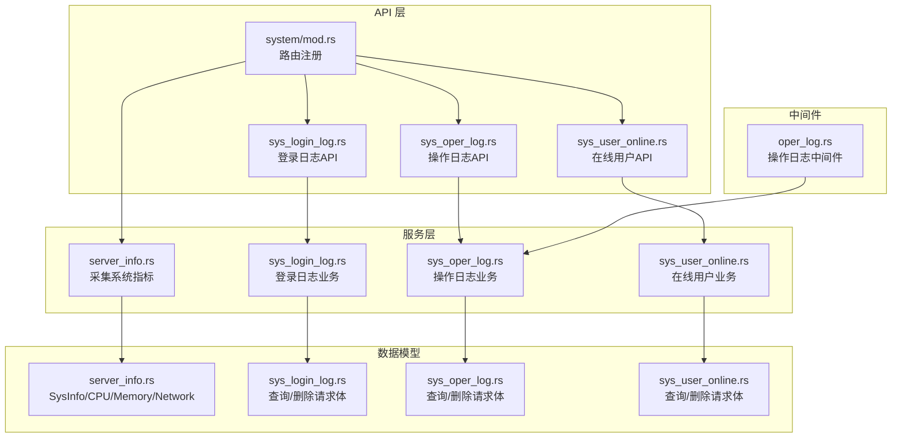
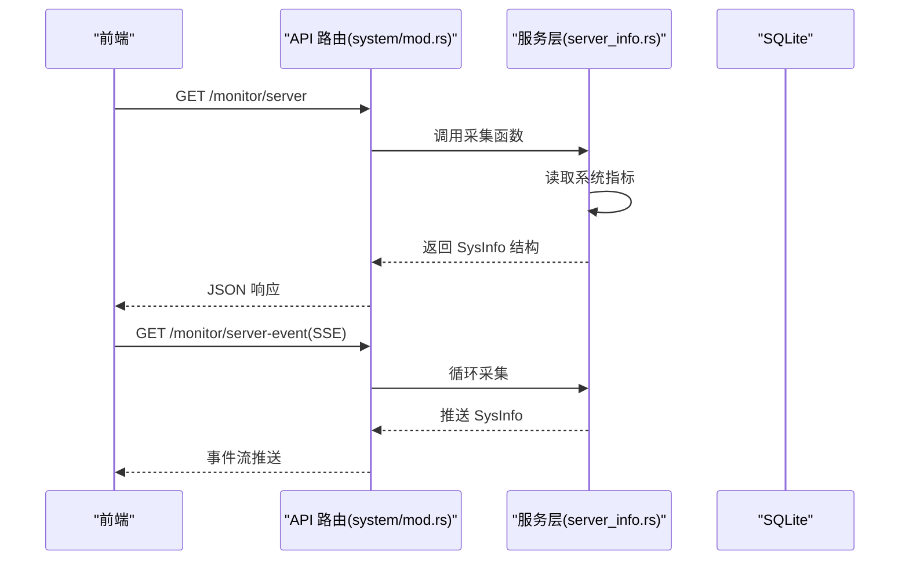
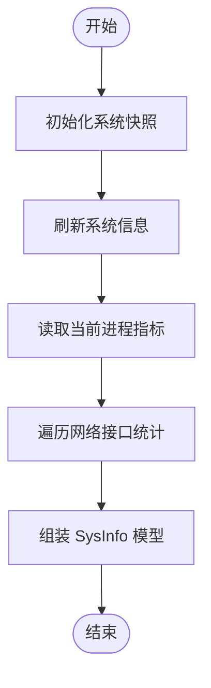
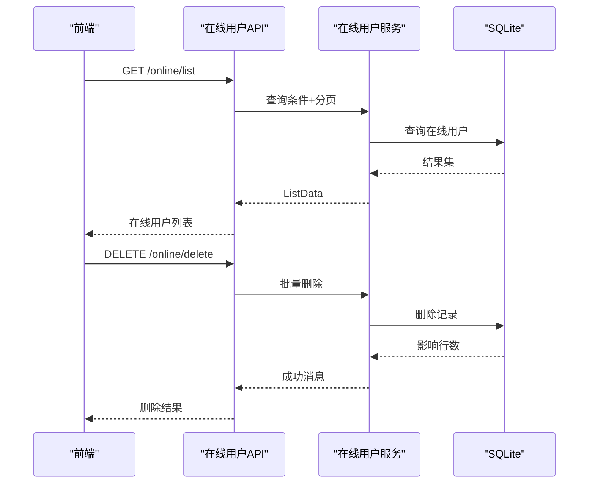
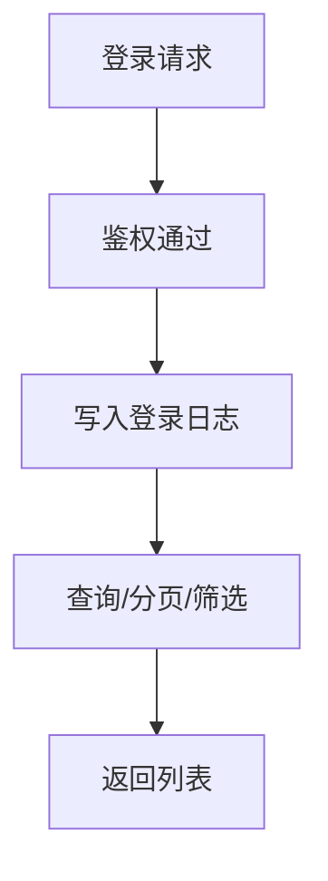
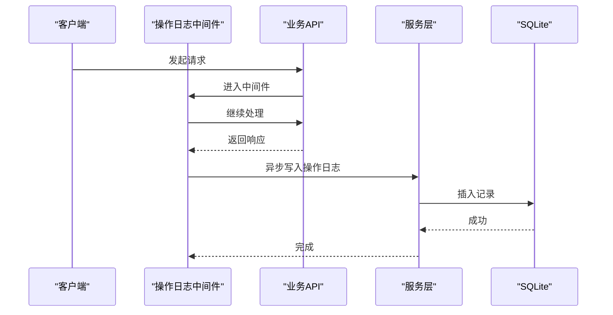
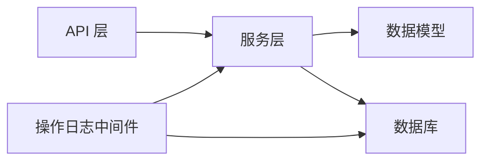

# 系统监控模块

<cite>
**本文引用的文件**
- [api/src/system/mod.rs](file://api/src/system/mod.rs)
- [api/src/system/sys_login_log.rs](file://api/src/system/sys_login_log.rs)
- [api/src/system/sys_oper_log.rs](file://api/src/system/sys_oper_log.rs)
- [api/src/system/sys_user_online.rs](file://api/src/system/sys_user_online.rs)
- [service/src/system/mod.rs](file://service/src/system/mod.rs)
- [service/src/system/server_info.rs](file://service/src/system/server_info.rs)
- [service/src/system/sys_login_log.rs](file://service/src/system/sys_login_log.rs)
- [service/src/system/sys_oper_log.rs](file://service/src/system/sys_oper_log.rs)
- [service/src/system/sys_user_online.rs](file://service/src/system/sys_user_online.rs)
- [db/src/system/models/server_info.rs](file://db/src/system/models/server_info.rs)
- [db/src/system/models/sys_login_log.rs](file://db/src/system/models/sys_login_log.rs)
- [db/src/system/models/sys_oper_log.rs](file://db/src/system/models/sys_oper_log.rs)
- [db/src/system/models/sys_user_online.rs](file://db/src/system/models/sys_user_online.rs)
- [middleware-fn/src/oper_log.rs](file://middleware-fn/src/oper_log.rs)
</cite>

## 目录
1. [简介](#简介)
2. [项目结构](#项目结构)
3. [核心组件](#核心组件)
4. [架构总览](#架构总览)
5. [组件详解](#组件详解)
6. [依赖关系分析](#依赖关系分析)
7. [性能考量](#性能考量)
8. [故障排查指南](#故障排查指南)
9. [结论](#结论)
10. [附录：API 接口规范](#附录api-接口规范)

## 简介
本技术文档围绕系统监控模块展开，覆盖以下关键能力：
- 服务器信息采集与展示：CPU 使用率、内存占用、磁盘读写、网络收发、进程运行态等
- 在线用户管理：登录状态跟踪、强制下线、会话管理
- 日志体系：登录日志记录与检索、操作日志审计与检索
- 实时监控推送：SSE（Server-Sent Events）推送服务器指标
- 安全与合规：敏感信息处理、访问控制、日志保留策略

## 项目结构
系统监控相关代码采用“API 层 → 服务层 → 数据模型/实体”的分层组织，监控数据通过服务层采集并持久化到 SQLite，前端通过 REST API 与 SSE 获取数据。

图表来源
- [api/src/system/mod.rs](file://api/src/system/mod.rs#L186-L190)
- [service/src/system/server_info.rs](file://service/src/system/server_info.rs#L1-L74)
- [service/src/system/sys_login_log.rs](file://service/src/system/sys_login_log.rs#L1-L129)
- [service/src/system/sys_oper_log.rs](file://service/src/system/sys_oper_log.rs#L1-L107)
- [service/src/system/sys_user_online.rs](file://service/src/system/sys_user_online.rs#L1-L137)
- [middleware-fn/src/oper_log.rs](file://middleware-fn/src/oper_log.rs#L21-L52)

章节来源
- [api/src/system/mod.rs](file://api/src/system/mod.rs#L1-L199)
- [service/src/system/mod.rs](file://service/src/system/mod.rs#L1-L43)
- [db/src/system/models/server_info.rs](file://db/src/system/models/server_info.rs#L1-L70)

## 核心组件
- 服务器信息采集与推送
  - 采集：服务层调用系统库获取 CPU、内存、网络、进程等指标，封装为统一数据模型
  - 展示：API 提供一次性查询与 SSE 实时推送
- 在线用户管理
  - 会话登记：登录成功后写入在线用户表
  - 查询与强制下线：支持按条件查询、批量删除、按 token 强制下线
- 日志系统
  - 登录日志：记录登录来源、设备、位置、状态与消息
  - 操作日志：中间件自动采集请求耗时、响应体、操作类型等，支持检索与清理
- 实时推送
  - SSE：基于 API 提供的事件流接口，前端可订阅持续推送的系统指标

章节来源
- [service/src/system/server_info.rs](file://service/src/system/server_info.rs#L1-L74)
- [api/src/system/mod.rs](file://api/src/system/mod.rs#L186-L190)
- [service/src/system/sys_user_online.rs](file://service/src/system/sys_user_online.rs#L93-L137)
- [service/src/system/sys_login_log.rs](file://service/src/system/sys_login_log.rs#L106-L129)
- [middleware-fn/src/oper_log.rs](file://middleware-fn/src/oper_log.rs#L21-L52)

## 架构总览
系统监控模块遵循“API 路由 → 业务服务 → 数据模型/实体 → 数据库”的调用链路；实时监控通过 SSE 将服务层采集的数据推送到前端。

图表来源
- [api/src/system/mod.rs](file://api/src/system/mod.rs#L186-L190)
- [service/src/system/server_info.rs](file://service/src/system/server_info.rs#L4-L73)

## 组件详解

### 服务器信息采集与展示
- 数据模型
  - SysInfo：聚合服务器、CPU、内存、进程、网络、CPU 负载等字段
  - CPU：名称、架构、核心数、频率、总使用率
  - 内存：物理内存总量/使用量、Swap 总量/使用量
  - 网络：网卡名、接收/发送字节及累计值
  - 进程：名称、内存/虚拟内存、CPU 使用、启动时间、运行时长、磁盘读写
- 采集流程
  - 初始化系统快照，刷新 CPU/内存/网络等信息
  - 读取当前进程指标并组装为模型
  - 汇总为 SysInfo 返回
- 展示方式
  - 单次查询：GET /monitor/server
  - 实时推送：GET /monitor/server-event（SSE）

图表来源
- [service/src/system/server_info.rs](file://service/src/system/server_info.rs#L4-L73)
- [db/src/system/models/server_info.rs](file://db/src/system/models/server_info.rs#L3-L70)

章节来源
- [service/src/system/server_info.rs](file://service/src/system/server_info.rs#L1-L74)
- [db/src/system/models/server_info.rs](file://db/src/system/models/server_info.rs#L1-L70)
- [api/src/system/mod.rs](file://api/src/system/mod.rs#L186-L190)

### 在线用户管理
- 功能点
  - 在线查询：支持按 IP、用户名、时间范围筛选，分页返回
  - 强制下线：根据 token_id 删除在线记录
  - 会话续期：更新 token 过期时间
- 关键实现
  - 查询：构造多条件过滤，统计总数并分页
  - 删除：批量删除指定 id 的在线记录
  - 登记：登录成功后写入在线用户表，包含用户、部门、客户端信息、登录时间等
  - 下线：按 token_id 删除

图表来源
- [api/src/system/sys_user_online.rs](file://api/src/system/sys_user_online.rs#L15-L32)
- [service/src/system/sys_user_online.rs](file://service/src/system/sys_user_online.rs#L20-L80)
- [db/src/system/models/sys_user_online.rs](file://db/src/system/models/sys_user_online.rs#L3-L15)

章节来源
- [api/src/system/sys_user_online.rs](file://api/src/system/sys_user_online.rs#L1-L43)
- [service/src/system/sys_user_online.rs](file://service/src/system/sys_user_online.rs#L1-L137)
- [db/src/system/models/sys_user_online.rs](file://db/src/system/models/sys_user_online.rs#L1-L15)

### 登录日志记录与检索
- 记录内容
  - 登录名、来源网络、IP、登录地点、浏览器、操作系统、设备、状态、消息、登录时间、模块等
- 检索能力
  - 支持按 IP、用户名、状态、时间范围筛选，支持排序列与升降序
  - 支持删除与清空
- 实现要点
  - 服务层构建查询条件，分页获取并统计总数
  - 中间件在鉴权后触发日志写入（见下一节）

图表来源
- [service/src/system/sys_login_log.rs](file://service/src/system/sys_login_log.rs#L106-L129)
- [api/src/system/sys_login_log.rs](file://api/src/system/sys_login_log.rs#L16-L23)
- [db/src/system/models/sys_login_log.rs](file://db/src/system/models/sys_login_log.rs#L3-L18)

章节来源
- [service/src/system/sys_login_log.rs](file://service/src/system/sys_login_log.rs#L1-L129)
- [api/src/system/sys_login_log.rs](file://api/src/system/sys_login_log.rs#L1-L43)
- [db/src/system/models/sys_login_log.rs](file://db/src/system/models/sys_login_log.rs#L1-L18)

### 操作日志审计与检索
- 自动采集
  - 中间件在请求结束后读取上下文、耗时、响应体、状态等，异步写入操作日志
  - 操作类型根据 HTTP 方法映射为查询/新增/修改/删除等
- 检索能力
  - 支持按标题、操作人、操作类型、状态、时间范围筛选
  - 支持按主键查询详情、批量删除、清空
- 安全注意
  - 对超长请求体进行截断处理，避免存储膨胀

图表来源
- [middleware-fn/src/oper_log.rs](file://middleware-fn/src/oper_log.rs#L21-L52)
- [middleware-fn/src/oper_log.rs](file://middleware-fn/src/oper_log.rs#L105-L134)
- [service/src/system/sys_oper_log.rs](file://service/src/system/sys_oper_log.rs#L13-L70)

章节来源
- [middleware-fn/src/oper_log.rs](file://middleware-fn/src/oper_log.rs#L1-L134)
- [service/src/system/sys_oper_log.rs](file://service/src/system/sys_oper_log.rs#L1-L107)
- [api/src/system/sys_oper_log.rs](file://api/src/system/sys_oper_log.rs#L1-L61)
- [db/src/system/models/sys_oper_log.rs](file://db/src/system/models/sys_oper_log.rs#L1-L18)

### 实时监控推送（SSE）
- SSE 接口
  - 提供 /monitor/server-event，服务端循环采集并以事件流形式推送
- 前端接入
  - 建议使用浏览器 EventSource 或前端库订阅事件流，按需渲染图表或表格
- 注意事项
  - 合理设置刷新间隔，避免频繁采集造成资源压力
  - 前端需处理断连重连与错误提示

章节来源
- [api/src/system/mod.rs](file://api/src/system/mod.rs#L188-L189)
- [service/src/system/server_info.rs](file://service/src/system/server_info.rs#L4-L73)

## 依赖关系分析
- API 层依赖服务层；服务层依赖数据模型与数据库连接；日志中间件依赖服务层在线检查与数据库
- 关键耦合点
  - API → 服务：参数校验与分页
  - 服务 → 数据库：事务与分页查询
  - 中间件 → 服务：在线状态检查
- 外部依赖
  - 系统信息采集依赖系统库
  - 数据持久化依赖 SeaORM 与 SQLite

图表来源
- [api/src/system/mod.rs](file://api/src/system/mod.rs#L186-L190)
- [service/src/system/mod.rs](file://service/src/system/mod.rs#L1-L43)
- [middleware-fn/src/oper_log.rs](file://middleware-fn/src/oper_log.rs#L1-L20)

章节来源
- [api/src/system/mod.rs](file://api/src/system/mod.rs#L1-L199)
- [service/src/system/mod.rs](file://service/src/system/mod.rs#L1-L43)
- [middleware-fn/src/oper_log.rs](file://middleware-fn/src/oper_log.rs#L1-L52)

## 性能考量
- 采集频率与开销
  - SSE 推送应设置合理间隔，避免频繁刷新导致 CPU/IO 压力
- 分页与查询
  - 在线用户与日志均支持分页与条件过滤，建议前端传入必要筛选条件以减少数据量
- 异步写日志
  - 操作日志中间件使用异步任务写入，避免阻塞主请求路径
- 存储优化
  - 请求体过长时进行截断，降低存储与传输成本

## 故障排查指南
- 登录日志无法写入
  - 检查服务层写入逻辑与事务提交是否异常
  - 确认客户端信息（UA/网络）解析是否正常
- 操作日志缺失
  - 确认中间件是否正确挂载且请求上下文是否包含必要信息
  - 检查异步写入任务是否被阻塞
- 在线用户查询无结果
  - 核对筛选条件（IP/用户名/时间范围）是否过于严格
  - 确认登录成功后是否正确写入在线表
- SSE 推送中断
  - 检查服务端采集是否抛错或阻塞
  - 前端确认 EventSource 连接状态与断线重连策略

章节来源
- [service/src/system/sys_login_log.rs](file://service/src/system/sys_login_log.rs#L106-L129)
- [middleware-fn/src/oper_log.rs](file://middleware-fn/src/oper_log.rs#L44-L52)
- [service/src/system/sys_user_online.rs](file://service/src/system/sys_user_online.rs#L99-L124)
- [api/src/system/mod.rs](file://api/src/system/mod.rs#L188-L189)

## 结论
系统监控模块通过清晰的分层设计实现了服务器指标采集、在线用户管理与日志审计，并提供 SSE 实时推送能力。结合中间件自动记录操作日志，形成完整的运维可观测性闭环。建议在生产环境中合理配置采集频率、完善访问控制与日志保留策略，确保安全与性能平衡。

## 附录：API 接口规范

- 服务器监控
  - GET /monitor/server
    - 功能：一次性获取服务器指标
    - 返回：SysInfo 结构
  - GET /monitor/server-event
    - 功能：SSE 实时推送服务器指标
    - 返回：事件流，数据格式同上

- 登录日志
  - GET /login-log/list
    - 查询参数：ip、user_name、status、begin_time、end_time、orderByColumn、isAsc、page_num、page_size
    - 返回：分页列表
  - DELETE /login-log/delete
    - 请求体：info_ids（数组）
    - 返回：删除数量
  - DELETE /login-log/clean
    - 返回：清空结果

- 操作日志
  - GET /oper_log/list
    - 查询参数：title、oper_name、operator_type、status、begin_time、end_time、page_num、page_size
    - 返回：分页列表
  - GET /oper_log/get_by_id
    - 查询参数：oper_id
    - 返回：单条记录
  - DELETE /oper_log/delete
    - 请求体：oper_log_ids（数组）
    - 返回：删除数量
  - DELETE /oper_log/clean
    - 返回：清空结果

- 在线用户
  - GET /online/list
    - 查询参数：ipaddr、user_name、begin_time、end_time、page_num、page_size
    - 返回：分页列表
  - DELETE /online/delete
    - 请求体：ids（数组）
    - 返回：删除数量
  - GET /logout
    - 功能：根据 token 强制下线
    - 返回：下线结果

章节来源
- [api/src/system/mod.rs](file://api/src/system/mod.rs#L186-L190)
- [api/src/system/sys_login_log.rs](file://api/src/system/sys_login_log.rs#L16-L42)
- [api/src/system/sys_oper_log.rs](file://api/src/system/sys_oper_log.rs#L16-L61)
- [api/src/system/sys_user_online.rs](file://api/src/system/sys_user_online.rs#L15-L42)