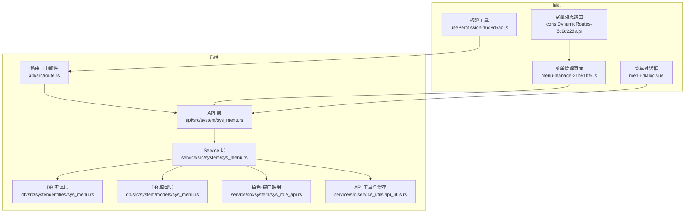
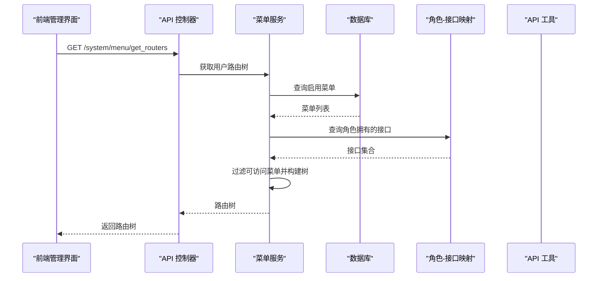
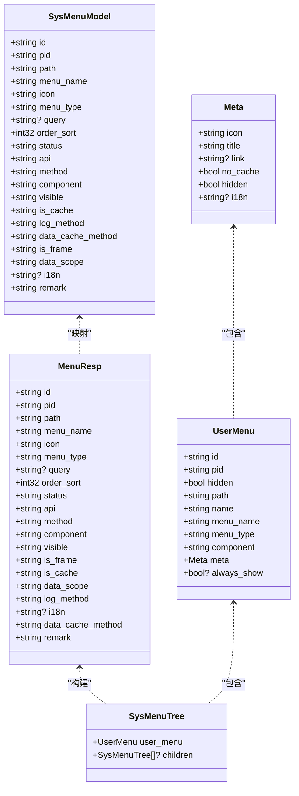
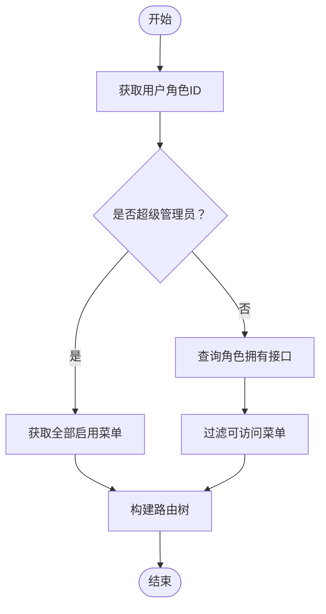
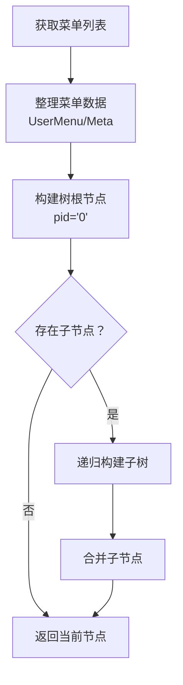
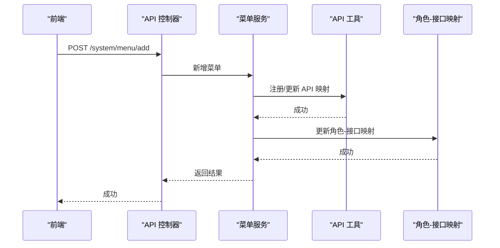
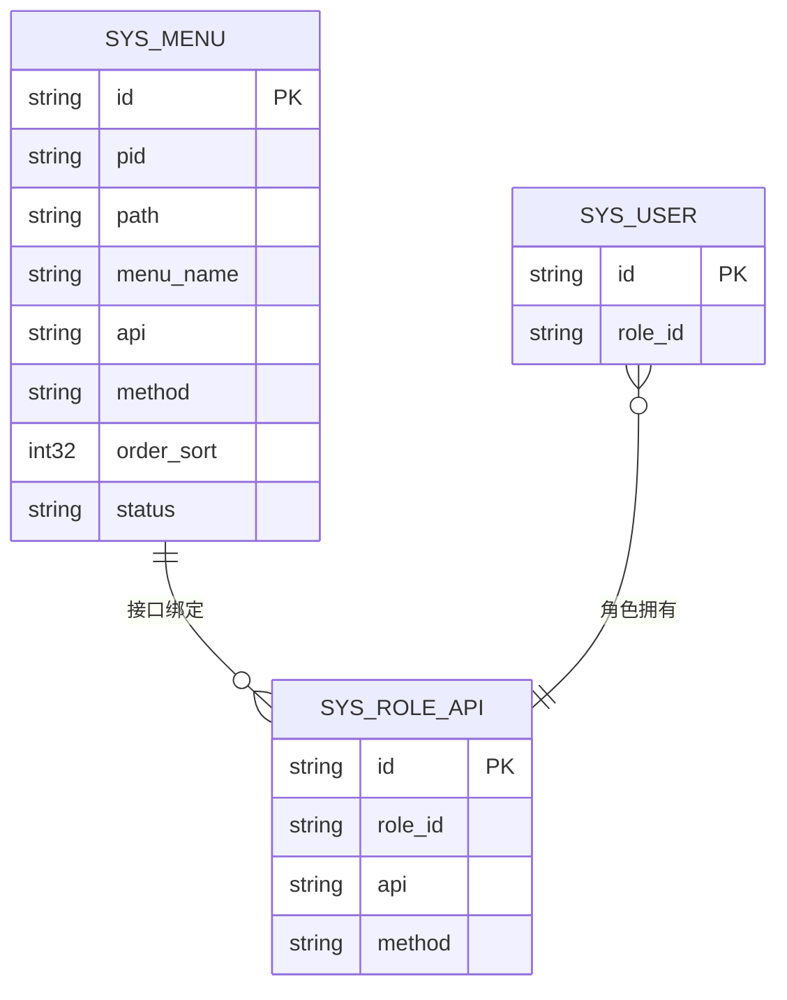
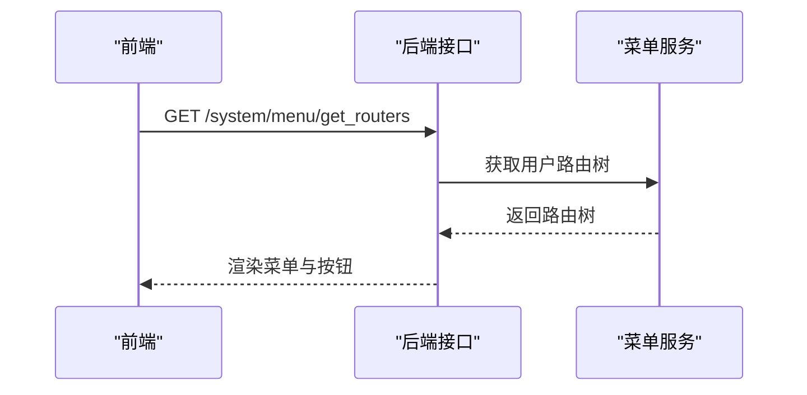
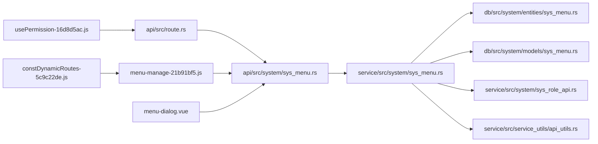

# 菜单权限管理模块

<cite>
**本文档引用的文件**
- [sys_menu.rs](file://api/src/system/sys_menu.rs)
- [sys_menu.rs](file://service/src/system/sys_menu.rs)
- [sys_menu.rs](file://db/src/system/entities/sys_menu.rs)
- [sys_menu.rs](file://db/src/system/models/sys_menu.rs)
- [sys_role_api.rs](file://service/src/system/sys_role_api.rs)
- [api_utils.rs](file://service/src/service_utils/api_utils.rs)
- [route.rs](file://api/src/route.rs)
- [usePermission-16d8d5ac.js](file://data/_web/assets/usePermission-16d8d5ac.js)
- [menu-manage-21b91bf5.js](file://data/_web/assets/menu-manage-21b91bf5.js)
- [menu-dialog.vue](file://data/_web/assets/menu-dialog.vue_vue_type_script_setup_true_name_menu-dialog_lang-6f9cf331.js)
- [constDynamicRoutes-5c9c22de.js](file://data/_web/assets/constDynamicRoutes-5c9c22de.js)
- [rbac_model.conf](file://config/casbin_conf/rbac_model.conf)
- [rbac_policy.csv](file://config/casbin_conf/rbac_policy.csv)
- [obj_sys_menu.sql](file://migration/data/m20220101_000001_create_table/obj_sys_menu.sql)
</cite>

## 目录
1. [简介](#简介)
2. [项目结构](#项目结构)
3. [核心组件](#核心组件)
4. [架构总览](#架构总览)
5. [详细组件分析](#详细组件分析)
6. [依赖关系分析](#依赖关系分析)
7. [性能考虑](#性能考虑)
8. [故障排除指南](#故障排除指南)
9. [结论](#结论)
10. [附录](#附录)

## 简介
本模块围绕“菜单权限管理”展开，覆盖菜单的创建、层级结构管理、路由配置、权限标识设置、动态菜单生成与按钮级权限控制。后端采用 Rust + SeaORM + Axum 架构，前端基于 Vue3 + Element Plus 的管理界面。模块通过菜单实体模型定义菜单类型、路由信息、权限标识、排序字段等；通过角色-接口映射实现基于权限标识的访问控制；通过 API 缓存与中间件实现动态路由与权限校验。

## 项目结构
该模块在后端由三层组成：API 层负责路由与响应封装；Service 层负责业务逻辑与数据处理；DB 层负责实体与模型定义。前端提供菜单管理界面，支持树形选择、表单校验、动态路由生成与按钮权限控制。

**图表来源**
- [sys_menu.rs](file://api/src/system/sys_menu.rs#L1-L120)
- [sys_menu.rs](file://service/src/system/sys_menu.rs#L1-L499)
- [sys_menu.rs](file://db/src/system/entities/sys_menu.rs#L1-L122)
- [sys_menu.rs](file://db/src/system/models/sys_menu.rs#L1-L147)
- [sys_role_api.rs](file://service/src/system/sys_role_api.rs#L1-L52)
- [api_utils.rs](file://service/src/service_utils/api_utils.rs#L1-L119)
- [route.rs](file://api/src/route.rs#L1-L69)
- [usePermission-16d8d5ac.js](file://data/_web/assets/usePermission-16d8d5ac.js#L1-L2)
- [menu-manage-21b91bf5.js](file://data/_web/assets/menu-manage-21b91bf5.js#L1-L2)
- [menu-dialog.vue](file://data/_web/assets/menu-dialog.vue_vue_type_script_setup_true_name_menu-dialog_lang-6f9cf331.js#L1-L2)
- [constDynamicRoutes-5c9c22de.js](file://data/_web/assets/constDynamicRoutes-5c9c22de.js#L1-L2)

**章节来源**
- [sys_menu.rs](file://api/src/system/sys_menu.rs#L1-L120)
- [sys_menu.rs](file://service/src/system/sys_menu.rs#L1-L499)
- [sys_menu.rs](file://db/src/system/entities/sys_menu.rs#L1-L122)
- [sys_menu.rs](file://db/src/system/models/sys_menu.rs#L1-L147)
- [route.rs](file://api/src/route.rs#L1-L69)

## 核心组件
- 菜单实体模型：定义菜单字段（父级、路径、名称、类型、排序、状态、权限标识、缓存策略、国际化等），并提供分页查询、树形构建、角色权限过滤等能力。
- 菜单服务：实现菜单 CRUD、路由树生成、角色权限映射、API 关联查询、缓存与日志方法更新等。
- API 工具与缓存：维护全局 API 映射，支持初始化、增量更新、权限校验。
- 角色-接口映射：维护角色与接口的绑定关系，支持批量添加、删除与更新。
- 前端权限工具：基于用户权限集合进行按钮级权限判断，支持通配符与路径规范化。
- 路由与中间件：统一鉴权中间件、操作日志中间件、缓存中间件，保障接口安全与性能。

**章节来源**
- [sys_menu.rs](file://db/src/system/entities/sys_menu.rs#L15-L40)
- [sys_menu.rs](file://db/src/system/models/sys_menu.rs#L26-L87)
- [sys_menu.rs](file://service/src/system/sys_menu.rs#L21-L96)
- [api_utils.rs](file://service/src/service_utils/api_utils.rs#L16-L88)
- [sys_role_api.rs](file://service/src/system/sys_role_api.rs#L6-L51)
- [usePermission-16d8d5ac.js](file://data/_web/assets/usePermission-16d8d5ac.js#L1-L2)

## 架构总览
后端以 API 控制器为入口，调用服务层完成业务处理；服务层通过 SeaORM 访问数据库，结合角色-接口映射与 API 工具实现权限控制；前端通过菜单管理界面提交请求，后端返回树形路由结构供前端动态渲染。

**图表来源**
- [sys_menu.rs](file://api/src/system/sys_menu.rs#L100-L119)
- [sys_menu.rs](file://service/src/system/sys_menu.rs#L360-L374)
- [sys_menu.rs](file://service/src/system/sys_menu.rs#L324-L356)
- [sys_role_api.rs](file://service/src/system/sys_role_api.rs#L38-L51)

## 详细组件分析

### 菜单实体模型与数据结构
- 字段定义：包含 id、pid、path、menu_name、icon、menu_type、query、order_sort、status、api、method、component、visible、is_cache、log_method、data_cache_method、is_frame、data_scope、i18n、remark 等。
- 类型约束：menu_type 支持目录(M)、菜单(C)、按钮(F)，status 表示启用/禁用，visible 控制前端显示，is_cache 控制缓存策略。
- 查询模型：提供 SysMenuSearchReq、SysMenuTree、SysMenuTreeAll、MenuResp、SysMenuAddReq、SysMenuEditReq、LogCacheEditReq 等结构体，支撑 CRUD 与树形渲染。

**图表来源**
- [sys_menu.rs](file://db/src/system/entities/sys_menu.rs#L15-L40)
- [sys_menu.rs](file://db/src/system/models/sys_menu.rs#L26-L87)

**章节来源**
- [sys_menu.rs](file://db/src/system/entities/sys_menu.rs#L15-L40)
- [sys_menu.rs](file://db/src/system/models/sys_menu.rs#L26-L87)

### 菜单权限控制机制
- 基于权限标识的访问控制：通过角色-接口映射表筛选用户可访问的接口，再过滤菜单生成路由树。
- 动态菜单生成：根据角色权限动态生成菜单树，支持超级管理员与普通用户的差异化处理。
- 按钮级权限控制：前端使用权限工具函数判断用户是否具备某按钮权限，支持通配符与路径规范化。

**图表来源**
- [sys_menu.rs](file://api/src/system/sys_menu.rs#L100-L119)
- [sys_menu.rs](file://service/src/system/sys_menu.rs#L360-L374)
- [sys_menu.rs](file://service/src/system/sys_menu.rs#L324-L356)

**章节来源**
- [sys_menu.rs](file://service/src/system/sys_menu.rs#L324-L356)
- [usePermission-16d8d5ac.js](file://data/_web/assets/usePermission-16d8d5ac.js#L1-L2)

### 菜单树形结构实现原理
- 菜单数据整理：将数据库查询结果转换为前端路由结构，处理路径前缀、缓存与可见性等字段。
- 树形构建：递归遍历菜单列表，依据 pid 与 id 关系组装父子节点。
- 菜单状态控制：通过 visible、status、is_cache 等字段控制菜单显示、缓存与启用状态。

**图表来源**
- [sys_menu.rs](file://service/src/system/sys_menu.rs#L408-L440)
- [sys_menu.rs](file://service/src/system/sys_menu.rs#L377-L396)

**章节来源**
- [sys_menu.rs](file://service/src/system/sys_menu.rs#L377-L396)
- [sys_menu.rs](file://service/src/system/sys_menu.rs#L408-L440)

### 菜单 CRUD 与路由配置
- CRUD 接口：提供分页查询、详情查询、新增、编辑、删除、日志与缓存方法更新等。
- 路由配置：菜单类型区分目录、菜单、按钮；菜单路径支持外链与组件路径；按钮类型需绑定具体接口与方法。
- API 关联：菜单变更会同步更新全局 API 映射与角色-接口映射。

**图表来源**
- [sys_menu.rs](file://api/src/system/sys_menu.rs#L39-L77)
- [sys_menu.rs](file://service/src/system/sys_menu.rs#L131-L174)
- [api_utils.rs](file://service/src/service_utils/api_utils.rs#L50-L81)
- [sys_role_api.rs](file://service/src/system/sys_role_api.rs#L38-L51)

**章节来源**
- [sys_menu.rs](file://api/src/system/sys_menu.rs#L16-L119)
- [sys_menu.rs](file://service/src/system/sys_menu.rs#L131-L174)
- [api_utils.rs](file://service/src/service_utils/api_utils.rs#L50-L81)
- [sys_role_api.rs](file://service/src/system/sys_role_api.rs#L38-L51)

### 菜单与角色权限、用户权限的关联
- 角色-接口映射：通过 sys_role_api 维护角色与接口(method)的绑定关系。
- 权限校验：后端通过角色-接口映射与用户角色 ID 进行匹配；前端通过权限工具判断按钮权限。
- RBAC 模型：配置文件定义了请求(sub,obj,act)、策略(p)、角色(g)与匹配规则。

**图表来源**
- [sys_menu.rs](file://db/src/system/entities/sys_menu.rs#L15-L40)
- [sys_role_api.rs](file://service/src/system/sys_role_api.rs#L1-L52)
- [rbac_model.conf](file://config/casbin_conf/rbac_model.conf#L1-L14)

**章节来源**
- [sys_role_api.rs](file://service/src/system/sys_role_api.rs#L6-L51)
- [rbac_model.conf](file://config/casbin_conf/rbac_model.conf#L1-L14)
- [rbac_policy.csv](file://config/casbin_conf/rbac_policy.csv#L1-L5)

### 前端动态路由生成机制
- 路由获取：调用后端接口获取用户路由树，后端根据角色权限过滤菜单。
- 路由渲染：前端根据返回的路由树动态生成菜单与面包屑。
- 按钮权限：通过权限工具函数判断按钮是否显示，支持通配符与路径规范化。

**图表来源**
- [sys_menu.rs](file://api/src/system/sys_menu.rs#L100-L119)
- [usePermission-16d8d5ac.js](file://data/_web/assets/usePermission-16d8d5ac.js#L1-L2)
- [menu-manage-21b91bf5.js](file://data/_web/assets/menu-manage-21b91bf5.js#L1-L2)

**章节来源**
- [sys_menu.rs](file://api/src/system/sys_menu.rs#L100-L119)
- [usePermission-16d8d5ac.js](file://data/_web/assets/usePermission-16d8d5ac.js#L1-L2)
- [menu-manage-21b91bf5.js](file://data/_web/assets/menu-manage-21b91bf5.js#L1-L2)

## 依赖关系分析
- API 层依赖 Service 层；Service 层依赖 DB 实体与模型、角色-接口映射、API 工具。
- 前端依赖后端接口与权限工具；菜单管理页面依赖对话框组件与常量动态路由配置。
- 中间件层统一注入鉴权、日志与缓存能力，保证接口安全与性能。

**图表来源**
- [sys_menu.rs](file://api/src/system/sys_menu.rs#L1-L120)
- [sys_menu.rs](file://service/src/system/sys_menu.rs#L1-L499)
- [sys_menu.rs](file://db/src/system/entities/sys_menu.rs#L1-L122)
- [sys_menu.rs](file://db/src/system/models/sys_menu.rs#L1-L147)
- [sys_role_api.rs](file://service/src/system/sys_role_api.rs#L1-L52)
- [api_utils.rs](file://service/src/service_utils/api_utils.rs#L1-L119)
- [route.rs](file://api/src/route.rs#L1-L69)
- [usePermission-16d8d5ac.js](file://data/_web/assets/usePermission-16d8d5ac.js#L1-L2)
- [menu-manage-21b91bf5.js](file://data/_web/assets/menu-manage-21b91bf5.js#L1-L2)
- [menu-dialog.vue](file://data/_web/assets/menu-dialog.vue_vue_type_script_setup_true_name_menu-dialog_lang-6f9cf331.js#L1-L2)
- [constDynamicRoutes-5c9c22de.js](file://data/_web/assets/constDynamicRoutes-5c9c22de.js#L1-L2)

**章节来源**
- [route.rs](file://api/src/route.rs#L1-L69)

## 性能考虑
- 分页查询：列表查询默认按排序字段升序分页，避免一次性加载大量数据。
- 树形构建：递归构建树时建议限制最大层级或使用哈希索引优化父子关系查找。
- API 缓存：全局 API 映射采用并发安全容器，初始化与更新时注意锁粒度与一致性。
- 中间件：根据配置启用缓存与操作日志中间件，平衡性能与可观测性。

## 故障排除指南
- 菜单新增/编辑冲突：若路径或名称在同一父级下重复，服务层会返回冲突错误，需调整路径或名称。
- 删除失败：若存在子菜单，服务层会提示先删除子菜单。
- 权限不生效：确认角色-接口映射是否正确，以及用户角色是否正确；前端按钮权限可通过权限工具函数调试。
- 路由不显示：检查菜单状态(status)与可见性(visible)，以及是否被角色权限过滤。

**章节来源**
- [sys_menu.rs](file://service/src/system/sys_menu.rs#L131-L174)
- [sys_menu.rs](file://service/src/system/sys_menu.rs#L177-L191)
- [sys_menu.rs](file://service/src/system/sys_menu.rs#L324-L356)

## 结论
本模块通过清晰的实体模型、完善的业务服务与前后端协同，实现了菜单的全生命周期管理与权限控制。菜单树形结构与动态路由生成确保了前端的灵活性，而基于权限标识的访问控制与 API 缓存机制则保障了系统的安全性与性能。

## 附录

### API 接口规范与使用示例
- 获取全部菜单列表（分页、筛选）
  - 方法：GET
  - 路径：/system/menu/list
  - 请求参数：分页参数与搜索条件（id、pid、menu_name、menu_type、method、status、begin_time、end_time）
  - 响应：分页数据结构
- 获取菜单详情
  - 方法：GET
  - 路径：/system/menu/get_by_id
  - 请求参数：id
  - 响应：菜单详情
- 新增菜单
  - 方法：POST
  - 路径：/system/menu/add
  - 请求体：新增菜单参数（pid、path、menu_name、icon、menu_type、query、order_sort、status、api、method、component、visible、is_frame、is_cache、data_scope、log_method、data_cache_method、i18n、remark）
  - 响应：成功消息
- 编辑菜单
  - 方法：PUT
  - 路径：/system/menu/edit
  - 请求体：编辑菜单参数（id、pid、path、menu_name、icon、menu_type、query、order_sort、status、api、method、component、visible、is_frame、is_cache、data_scope、log_method、i18n、data_cache_method、remark）
  - 响应：成功消息
- 删除菜单
  - 方法：DELETE
  - 路径：/system/menu/delete
  - 请求体：id
  - 响应：成功消息
- 更新日志与缓存方法
  - 方法：PUT
  - 路径：/system/menu/update_log_cache_method
  - 请求体：id、log_method、data_cache_method
  - 响应：成功消息
- 获取全部启用菜单树
  - 方法：GET
  - 路径：/system/menu/get_all_enabled_menu_tree
  - 请求参数：分页参数与搜索条件
  - 响应：树形菜单结构
- 获取用户路由树
  - 方法：GET
  - 路径：/system/menu/get_routers
  - 请求：携带用户身份信息
  - 响应：用户可访问的路由树

**章节来源**
- [sys_menu.rs](file://api/src/system/sys_menu.rs#L16-L119)
- [sys_menu.rs](file://service/src/system/sys_menu.rs#L21-L96)
- [obj_sys_menu.sql](file://migration/data/m20220101_000001_create_table/obj_sys_menu.sql#L17-L161)

### 菜单层级设计与命名规范
- 菜单层级：建议不超过三级，目录(M)用于组织，菜单(C)用于页面路由，按钮(F)用于操作权限。
- 路由命名：path 应简洁且语义化，组件路径(component)指向实际组件；外链以 http 开头。
- 权限标识：api 字段作为接口唯一标识，遵循“模块-功能-动作”的命名约定，按钮类型(method)需明确。

**章节来源**
- [sys_menu.rs](file://db/src/system/entities/sys_menu.rs#L15-L40)
- [obj_sys_menu.sql](file://migration/data/m20220101_000001_create_table/obj_sys_menu.sql#L17-L161)