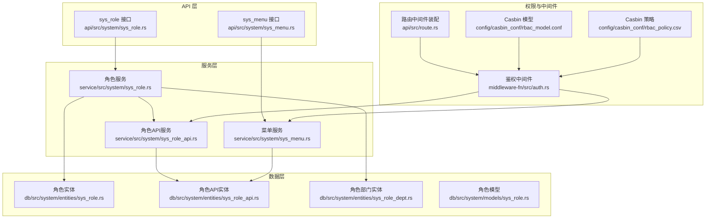
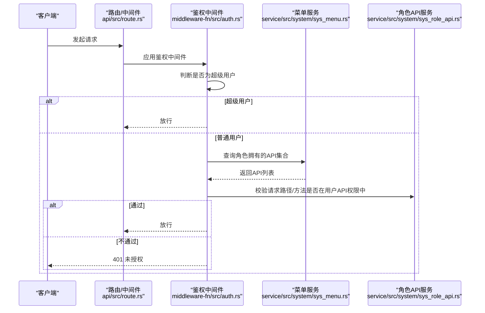
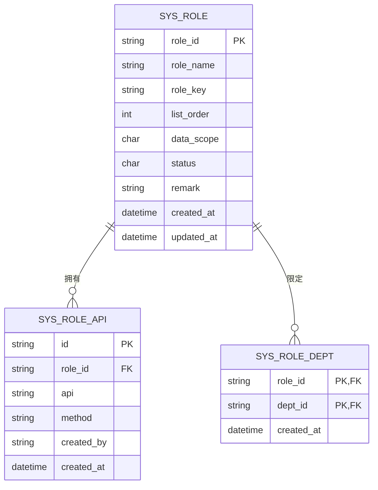
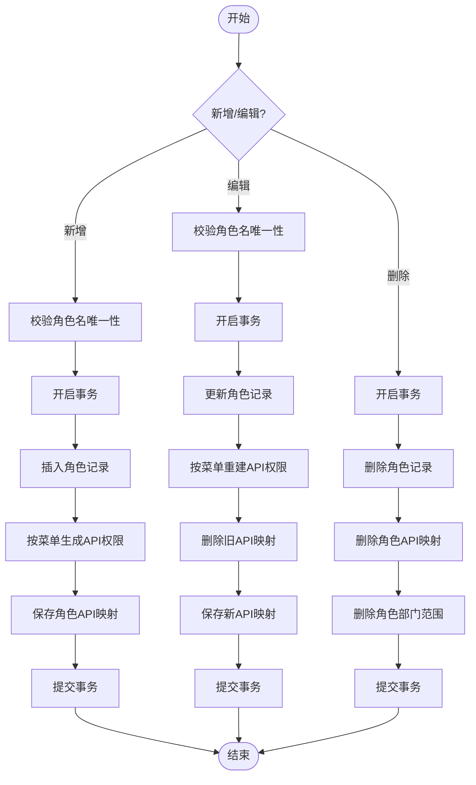
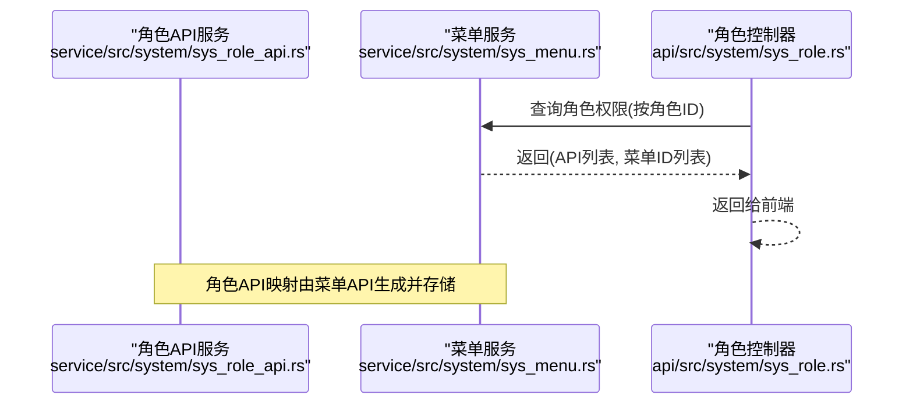
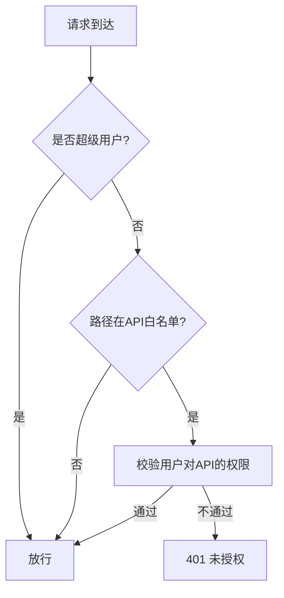
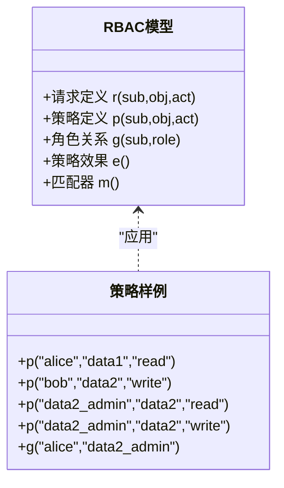
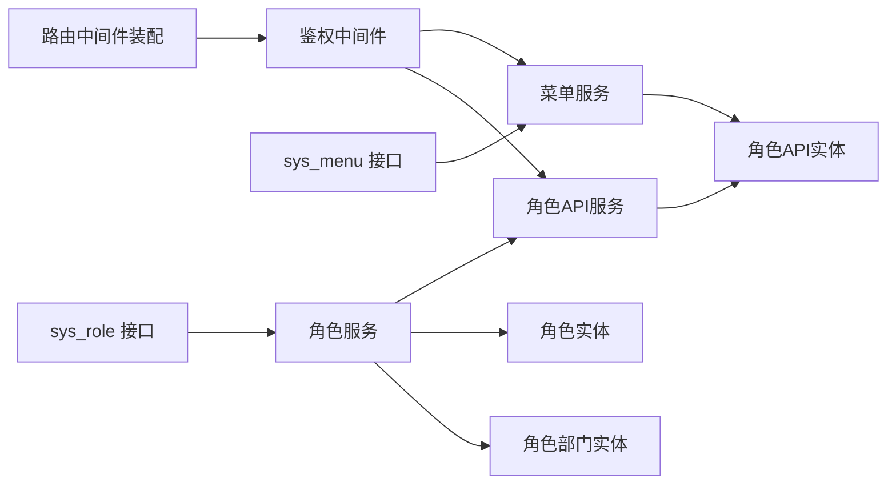

# 角色权限管理模块

<cite>
**本文引用的文件**
- [api/src/system/sys_role.rs](file://api/src/system/sys_role.rs)
- [service/src/system/sys_role.rs](file://service/src/system/sys_role.rs)
- [db/src/system/models/sys_role.rs](file://db/src/system/models/sys_role.rs)
- [db/src/system/entities/sys_role.rs](file://db/src/system/entities/sys_role.rs)
- [service/src/system/sys_role_api.rs](file://service/src/system/sys_role_api.rs)
- [db/src/system/entities/sys_role_api.rs](file://db/src/system/entities/sys_role_api.rs)
- [db/src/system/entities/sys_role_dept.rs](file://db/src/system/entities/sys_role_dept.rs)
- [api/src/system/sys_menu.rs](file://api/src/system/sys_menu.rs)
- [service/src/system/sys_menu.rs](file://service/src/system/sys_menu.rs)
- [middleware-fn/src/auth.rs](file://middleware-fn/src/auth.rs)
- [api/src/route.rs](file://api/src/route.rs)
- [config/casbin_conf/rbac_model.conf](file://config/casbin_conf/rbac_model.conf)
- [config/casbin_conf/rbac_policy.csv](file://config/casbin_conf/rbac_policy.csv)
- [data/_web/assets/usePermission-16d8d5ac.js](file://data/_web/assets/usePermission-16d8d5ac.js)
</cite>

## 目录
1. [简介](#简介)
2. [项目结构](#项目结构)
3. [核心组件](#核心组件)
4. [架构总览](#架构总览)
5. [详细组件分析](#详细组件分析)
6. [依赖关系分析](#依赖关系分析)
7. [性能考量](#性能考量)
8. [故障排查指南](#故障排查指南)
9. [结论](#结论)
10. [附录：API 接口规范与最佳实践](#附录api-接口规范与最佳实践)

## 简介
本技术文档聚焦于角色权限管理模块，系统性阐述角色创建、权限分配、角色状态管理、数据范围控制等核心能力；深入解析基于 Casbin 的 RBAC 权限模型实现，覆盖角色-权限映射、用户-角色关联、菜单权限控制；详解角色 API 权限管理机制与权限验证流程；给出角色实体模型的完整数据结构、字段定义与业务规则；并提供权限配置的最佳实践、接口规范与使用示例，说明与用户管理、菜单管理模块的集成关系。

## 项目结构
角色权限管理模块横跨三层：API 层负责对外暴露 REST 接口；Service 层封装业务逻辑与事务控制；DB 层定义实体与模型。权限验证通过中间件在请求进入应用前进行拦截校验。

图表来源
- [api/src/system/sys_role.rs](file://api/src/system/sys_role.rs#L1-L200)
- [service/src/system/sys_role.rs](file://service/src/system/sys_role.rs#L1-L369)
- [db/src/system/entities/sys_role.rs](file://db/src/system/entities/sys_role.rs#L1-L80)
- [service/src/system/sys_role_api.rs](file://service/src/system/sys_role_api.rs#L1-L52)
- [db/src/system/entities/sys_role_api.rs](file://db/src/system/entities/sys_role_api.rs#L1-L71)
- [db/src/system/entities/sys_role_dept.rs](file://db/src/system/entities/sys_role_dept.rs#L1-L63)
- [api/src/system/sys_menu.rs](file://api/src/system/sys_menu.rs#L1-L120)
- [service/src/system/sys_menu.rs](file://service/src/system/sys_menu.rs#L1-L499)
- [middleware-fn/src/auth.rs](file://middleware-fn/src/auth.rs#L1-L24)
- [api/src/route.rs](file://api/src/route.rs#L32-L68)
- [config/casbin_conf/rbac_model.conf](file://config/casbin_conf/rbac_model.conf#L1-L14)
- [config/casbin_conf/rbac_policy.csv](file://config/casbin_conf/rbac_policy.csv#L1-L5)

章节来源
- [api/src/system/sys_role.rs](file://api/src/system/sys_role.rs#L1-L200)
- [service/src/system/sys_role.rs](file://service/src/system/sys_role.rs#L1-L369)
- [api/src/system/sys_menu.rs](file://api/src/system/sys_menu.rs#L1-L120)
- [service/src/system/sys_menu.rs](file://service/src/system/sys_menu.rs#L1-L499)
- [middleware-fn/src/auth.rs](file://middleware-fn/src/auth.rs#L1-L24)
- [api/src/route.rs](file://api/src/route.rs#L32-L68)

## 核心组件
- 角色 API 控制器：提供角色 CRUD、状态变更、数据范围设置、授权菜单/部门查询等接口。
- 角色服务层：封装角色业务逻辑、事务控制、角色-权限映射、角色-部门范围维护。
- 菜单服务层：提供菜单树构建、角色权限查询、API 与数据库关联查询。
- 角色 API 实体服务：维护角色-接口映射，支持批量插入、删除与更新。
- 中间件鉴权：统一拦截请求，基于 API 白名单与用户 ID 进行权限校验。
- Casbin 配置：定义 RBAC 请求、策略、角色关系与匹配器。

章节来源
- [api/src/system/sys_role.rs](file://api/src/system/sys_role.rs#L1-L200)
- [service/src/system/sys_role.rs](file://service/src/system/sys_role.rs#L1-L369)
- [service/src/system/sys_menu.rs](file://service/src/system/sys_menu.rs#L324-L374)
- [service/src/system/sys_role_api.rs](file://service/src/system/sys_role_api.rs#L1-L52)
- [middleware-fn/src/auth.rs](file://middleware-fn/src/auth.rs#L6-L24)
- [config/casbin_conf/rbac_model.conf](file://config/casbin_conf/rbac_model.conf#L1-L14)

## 架构总览
角色权限管理采用“API → 服务 → 数据层”的分层架构，并通过中间件在入口处完成权限拦截。角色与菜单紧密耦合：角色通过菜单选择 API，服务层将菜单 API 映射为角色 API 权限；数据范围控制通过角色-部门关联表实现；中间件根据当前用户与请求路径/方法进行权限判定。

图表来源
- [api/src/route.rs](file://api/src/route.rs#L32-L68)
- [middleware-fn/src/auth.rs](file://middleware-fn/src/auth.rs#L6-L24)
- [service/src/system/sys_menu.rs](file://service/src/system/sys_menu.rs#L324-L374)
- [service/src/system/sys_role_api.rs](file://service/src/system/sys_role_api.rs#L1-L52)

## 详细组件分析

### 角色实体模型与数据结构
- 角色实体字段：角色标识、角色名称、角色键、排序、数据范围、状态、备注、创建/更新时间。
- 角色模型请求/响应：新增/编辑、删除、状态变更、数据范围变更、搜索、详情、全量列表等。
- 角色-部门实体：角色与部门的多对多关联，用于自定义数据范围。
- 角色-API 实体：角色与 API 的映射，记录 API 路径与方法。

图表来源
- [db/src/system/entities/sys_role.rs](file://db/src/system/entities/sys_role.rs#L15-L26)
- [db/src/system/entities/sys_role_api.rs](file://db/src/system/entities/sys_role_api.rs#L15-L23)
- [db/src/system/entities/sys_role_dept.rs](file://db/src/system/entities/sys_role_dept.rs#L15-L20)

章节来源
- [db/src/system/entities/sys_role.rs](file://db/src/system/entities/sys_role.rs#L15-L71)
- [db/src/system/models/sys_role.rs](file://db/src/system/models/sys_role.rs#L4-L75)
- [db/src/system/entities/sys_role_api.rs](file://db/src/system/entities/sys_role_api.rs#L15-L71)
- [db/src/system/entities/sys_role_dept.rs](file://db/src/system/entities/sys_role_dept.rs#L15-L63)

### 角色 API 控制器与服务层
- 控制器职责：接收请求参数，调用服务层执行业务，封装统一响应。
- 服务层职责：事务控制、角色数据持久化、角色-权限映射、角色-部门范围维护、角色-用户关联操作。
- 关键流程：
  - 新增角色：校验唯一性、开启事务、插入角色、按菜单生成 API 权限、提交事务。
  - 编辑角色：校验唯一性、更新角色、按新菜单重建 API 权限、提交事务。
  - 删除角色：删除角色、级联删除角色 API 与角色部门范围。
  - 设置数据范围：更新角色数据范围，若为自定义范围则清空并批量插入部门范围。
  - 查询角色授权菜单/部门：通过菜单服务查询角色 API 集合，或查询角色授权部门。

图表来源
- [service/src/system/sys_role.rs](file://service/src/system/sys_role.rs#L87-L127)
- [service/src/system/sys_role.rs](file://service/src/system/sys_role.rs#L186-L225)
- [service/src/system/sys_role.rs](file://service/src/system/sys_role.rs#L148-L169)
- [service/src/system/sys_role.rs](file://service/src/system/sys_role.rs#L245-L281)

章节来源
- [api/src/system/sys_role.rs](file://api/src/system/sys_role.rs#L16-L131)
- [service/src/system/sys_role.rs](file://service/src/system/sys_role.rs#L25-L369)

### 菜单权限与 API 权限映射
- 菜单服务提供“角色权限查询”能力：根据角色 ID 查询其可访问的 API 集合与菜单 ID 集合。
- 菜单树构建：将菜单数据转换为前端路由树，过滤不可见/禁用项。
- API 与数据库关联：支持查询与某菜单 API 相关的数据库表集合。
- 角色 API 服务：批量插入/删除角色 API 映射，支持按旧 API/方法更新新 API/方法。

图表来源
- [service/src/system/sys_menu.rs](file://service/src/system/sys_menu.rs#L324-L374)
- [service/src/system/sys_role_api.rs](file://service/src/system/sys_role_api.rs#L6-L35)
- [api/src/system/sys_role.rs](file://api/src/system/sys_role.rs#L101-L131)

章节来源
- [service/src/system/sys_menu.rs](file://service/src/system/sys_menu.rs#L324-L374)
- [service/src/system/sys_role_api.rs](file://service/src/system/sys_role_api.rs#L1-L52)
- [api/src/system/sys_role.rs](file://api/src/system/sys_role.rs#L101-L131)

### 权限验证与中间件集成
- 中间件在路由层装配，统一拦截请求。
- 若用户为超级管理员，直接放行。
- 对非白名单 API 放行；对白名单 API，依据用户 ID 与请求路径/方法进行权限校验，未授权返回 401。
- 前端权限校验工具函数：支持“*:*:*”通配符与路径规范化处理。

图表来源
- [middleware-fn/src/auth.rs](file://middleware-fn/src/auth.rs#L6-L24)
- [api/src/route.rs](file://api/src/route.rs#L32-L68)
- [data/_web/assets/usePermission-16d8d5ac.js](file://data/_web/assets/usePermission-16d8d5ac.js#L1-L1)

章节来源
- [middleware-fn/src/auth.rs](file://middleware-fn/src/auth.rs#L6-L24)
- [api/src/route.rs](file://api/src/route.rs#L32-L68)
- [data/_web/assets/usePermission-16d8d5ac.js](file://data/_web/assets/usePermission-16d8d5ac.js#L1-L1)

### 基于 Casbin 的 RBAC 权限模型
- 模型定义：请求(sub,obj,act)、策略(p=sub,obj,act)、角色关系(g=_,_)、策略效果与匹配器。
- 策略样例：角色与资源/动作的授权关系，角色继承关系。
- 在本项目中的应用：中间件通过 API 白名单与用户 ID 校验请求是否被允许，匹配器表达“角色(sub)与对象(obj)/动作(act)”一致。

图表来源
- [config/casbin_conf/rbac_model.conf](file://config/casbin_conf/rbac_model.conf#L1-L14)
- [config/casbin_conf/rbac_policy.csv](file://config/casbin_conf/rbac_policy.csv#L1-L5)

章节来源
- [config/casbin_conf/rbac_model.conf](file://config/casbin_conf/rbac_model.conf#L1-L14)
- [config/casbin_conf/rbac_policy.csv](file://config/casbin_conf/rbac_policy.csv#L1-L5)

## 依赖关系分析
- 角色控制器依赖服务层；服务层依赖数据层实体与模型。
- 菜单服务依赖角色 API 实体以查询角色权限；角色服务依赖菜单服务生成 API 权限。
- 中间件依赖配置与 API 工具类进行权限校验。
- 前端权限工具依赖用户权限数组进行按钮级权限判断。

图表来源
- [api/src/system/sys_role.rs](file://api/src/system/sys_role.rs#L1-L200)
- [service/src/system/sys_role.rs](file://service/src/system/sys_role.rs#L1-L369)
- [service/src/system/sys_menu.rs](file://service/src/system/sys_menu.rs#L1-L499)
- [service/src/system/sys_role_api.rs](file://service/src/system/sys_role_api.rs#L1-L52)
- [middleware-fn/src/auth.rs](file://middleware-fn/src/auth.rs#L1-L24)
- [api/src/route.rs](file://api/src/route.rs#L32-L68)

章节来源
- [api/src/system/sys_role.rs](file://api/src/system/sys_role.rs#L1-L200)
- [service/src/system/sys_role.rs](file://service/src/system/sys_role.rs#L1-L369)
- [service/src/system/sys_menu.rs](file://service/src/system/sys_menu.rs#L1-L499)
- [service/src/system/sys_role_api.rs](file://service/src/system/sys_role_api.rs#L1-L52)
- [middleware-fn/src/auth.rs](file://middleware-fn/src/auth.rs#L1-L24)
- [api/src/route.rs](file://api/src/route.rs#L32-L68)

## 性能考量
- 事务边界：角色新增/编辑/删除均使用事务保证一致性，避免部分更新导致的数据不一致。
- 批量操作：角色 API 插入与删除采用批量接口，减少多次往返。
- 查询优化：菜单权限查询使用子查询与 in 子句，避免 N+1 查询；分页查询降低内存占用。
- 中间件短路：超级用户直接放行，减少不必要的权限校验开销。

## 故障排查指南
- 新增/编辑失败：检查角色名唯一性校验、事务提交异常、菜单 ID 有效性。
- 删除失败：确认角色是否存在、是否有关联用户或部门范围。
- 权限校验失败：确认请求路径是否在 API 白名单、用户是否具备对应 API 权限、方法是否匹配。
- 数据范围异常：确认数据范围类型与部门范围是否正确维护。

章节来源
- [service/src/system/sys_role.rs](file://service/src/system/sys_role.rs#L87-L127)
- [service/src/system/sys_role.rs](file://service/src/system/sys_role.rs#L148-L169)
- [middleware-fn/src/auth.rs](file://middleware-fn/src/auth.rs#L6-L24)

## 结论
本模块以清晰的分层设计与完善的事务控制实现了角色权限管理的闭环：从角色 CRUD、菜单驱动的 API 权限映射、到数据范围控制与中间件统一鉴权。结合 Casbin 的 RBAC 模型，系统具备良好的扩展性与安全性，适合在复杂权限场景下稳定运行。

## 附录：API 接口规范与最佳实践

### 角色 API 接口规范
- 获取角色列表
  - 方法与路径：GET /api/system/role/list
  - 查询参数：分页参数、角色名称/键/状态/时间范围
  - 响应：分页列表
- 新增角色
  - 方法与路径：POST /api/system/role
  - 请求体：角色名称、角色键、排序、数据范围、状态、备注、菜单ID列表
  - 响应：操作消息
- 删除角色
  - 方法与路径：DELETE /api/system/role
  - 请求体：角色ID列表
  - 响应：操作消息
- 编辑角色
  - 方法与路径：PUT /api/system/role
  - 请求体：角色ID、角色名称、角色键、排序、数据范围、状态、备注、菜单ID列表
  - 响应：操作消息
- 修改角色状态
  - 方法与路径：PUT /api/system/role/status
  - 请求体：角色ID、状态
  - 响应：操作消息
- 设置角色数据范围
  - 方法与路径：PUT /api/system/role/data-scope
  - 请求体：角色ID、数据范围类型、部门ID列表
  - 响应：操作消息
- 获取角色详情
  - 方法与路径：GET /api/system/role
  - 查询参数：角色ID
  - 响应：角色信息
- 获取全部角色
  - 方法与路径：GET /api/system/role/all
  - 响应：角色列表
- 获取角色授权菜单ID列表
  - 方法与路径：GET /api/system/role/menu
  - 查询参数：角色ID
  - 响应：菜单ID列表
- 获取角色授权部门ID列表
  - 方法与路径：GET /api/system/role/dept
  - 查询参数：角色ID
  - 响应：部门ID列表

章节来源
- [api/src/system/sys_role.rs](file://api/src/system/sys_role.rs#L16-L131)

### 最佳实践
- 权限继承与组合：优先通过角色聚合菜单来形成权限集合，避免在角色-API 表中冗余配置。
- 权限冲突处理：同一资源的多个菜单应合并为单一 API，避免方法差异导致的冲突；如需区分，确保方法字段明确。
- 数据范围策略：默认使用“全部数据”范围，仅在需要精细化控制时启用“自定义数据范围”，并及时同步部门范围。
- API 与菜单联动：菜单变更会触发角色 API 映射重建，确保权限与菜单保持一致。

### 与用户管理、菜单管理的集成
- 用户管理：角色与用户通过用户-角色关联表建立多对多关系；角色状态变更会影响用户权限。
- 菜单管理：角色权限来源于菜单选择；菜单的 API/方法变更会通过服务层更新角色 API 映射。
- 路由生成：根据角色拥有的 API 动态生成前端路由树，实现菜单与权限的解耦。

章节来源
- [service/src/system/sys_menu.rs](file://service/src/system/sys_menu.rs#L324-L374)
- [service/src/system/sys_role.rs](file://service/src/system/sys_role.rs#L332-L369)