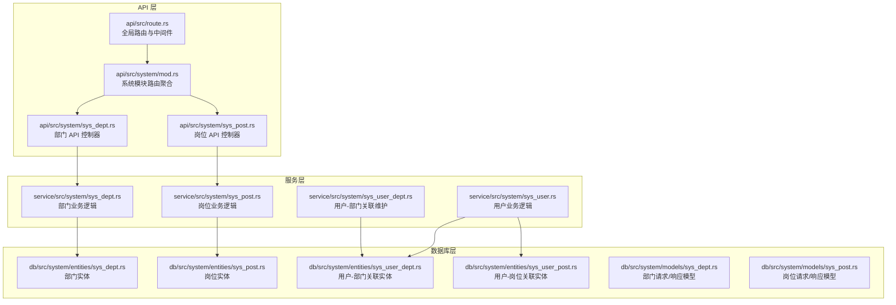
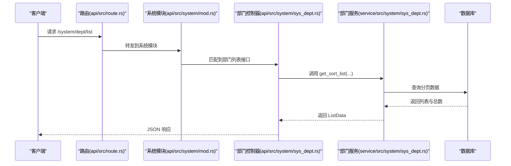
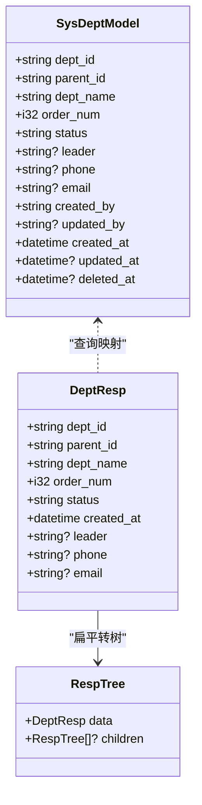
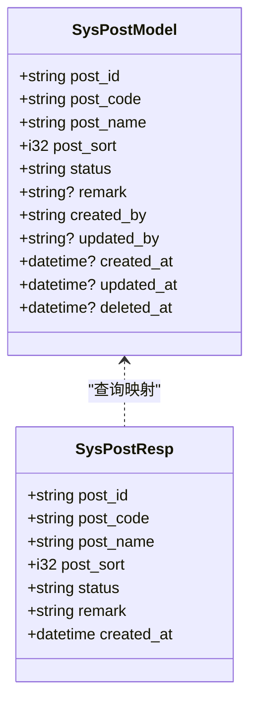
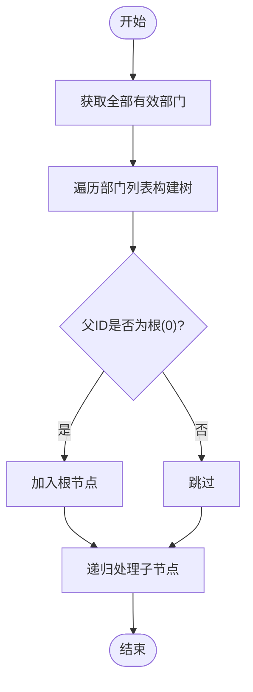
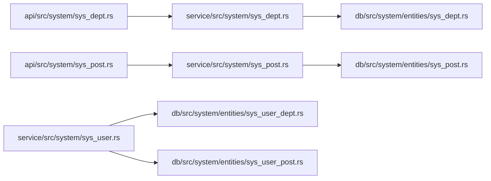

# 部门岗位管理模块

<cite>
**本文引用的文件**
- [api/src/system/sys_dept.rs](file://api/src/system/sys_dept.rs)
- [api/src/system/sys_post.rs](file://api/src/system/sys_post.rs)
- [api/src/system/mod.rs](file://api/src/system/mod.rs)
- [api/src/route.rs](file://api/src/route.rs)
- [service/src/system/sys_dept.rs](file://service/src/system/sys_dept.rs)
- [service/src/system/sys_post.rs](file://service/src/system/sys_post.rs)
- [service/src/system/sys_user.rs](file://service/src/system/sys_user.rs)
- [service/src/system/sys_user_dept.rs](file://service/src/system/sys_user_dept.rs)
- [db/src/system/entities/sys_dept.rs](file://db/src/system/entities/sys_dept.rs)
- [db/src/system/entities/sys_post.rs](file://db/src/system/entities/sys_post.rs)
- [db/src/system/entities/sys_user_dept.rs](file://db/src/system/entities/sys_user_dept.rs)
- [db/src/system/entities/sys_user_post.rs](file://db/src/system/entities/sys_user_post.rs)
- [db/src/system/models/sys_dept.rs](file://db/src/system/models/sys_dept.rs)
- [db/src/system/models/sys_post.rs](file://db/src/system/models/sys_post.rs)
- [README_EN.md](file://README_EN.md)
</cite>

## 目录
1. [简介](#简介)
2. [项目结构](#项目结构)
3. [核心组件](#核心组件)
4. [架构总览](#架构总览)
5. [详细组件分析](#详细组件分析)
6. [依赖关系分析](#依赖关系分析)
7. [性能考量](#性能考量)
8. [故障排查指南](#故障排查指南)
9. [结论](#结论)
10. [附录](#附录)

## 简介
本模块聚焦于“部门管理”与“岗位管理”的核心能力，覆盖以下方面：
- 部门组织架构管理：支持部门树形结构、父子关系、排序、状态、负责人等字段。
- 岗位设置与维护：岗位名称、编码、排序、状态、备注等属性。
- 人员配置：用户与部门、岗位的多对多关联及批量维护。
- API 接口：提供 CRUD、树形查询、分页筛选等完整接口。
- 数据权限：基于部门维度的数据权限控制与变更影响。

## 项目结构
系统采用分层设计，按职责划分为 API 层、服务层（Service）、数据库访问层（SeaORM Entities/Models）与前端静态资源目录。部门与岗位模块位于系统管理子模块中，通过统一路由前缀对外暴露。



图表来源
- [api/src/system/mod.rs](file://api/src/system/mod.rs#L26-L44)
- [api/src/system/sys_dept.rs](file://api/src/system/sys_dept.rs#L1-L92)
- [api/src/system/sys_post.rs](file://api/src/system/sys_post.rs#L1-L82)
- [api/src/route.rs](file://api/src/route.rs#L12-L22)
- [service/src/system/sys_dept.rs](file://service/src/system/sys_dept.rs#L1-L214)
- [service/src/system/sys_post.rs](file://service/src/system/sys_post.rs#L1-L227)
- [service/src/system/sys_user.rs](file://service/src/system/sys_user.rs#L26-L144)
- [service/src/system/sys_user_dept.rs](file://service/src/system/sys_user_dept.rs#L1-L38)
- [db/src/system/entities/sys_dept.rs](file://db/src/system/entities/sys_dept.rs#L1-L92)
- [db/src/system/entities/sys_post.rs](file://db/src/system/entities/sys_post.rs#L1-L86)
- [db/src/system/entities/sys_user_dept.rs](file://db/src/system/entities/sys_user_dept.rs#L1-L68)
- [db/src/system/entities/sys_user_post.rs](file://db/src/system/entities/sys_user_post.rs#L1-L63)
- [db/src/system/models/sys_dept.rs](file://db/src/system/models/sys_dept.rs#L1-L61)
- [db/src/system/models/sys_post.rs](file://db/src/system/models/sys_post.rs#L1-L48)

章节来源
- [api/src/system/mod.rs](file://api/src/system/mod.rs#L26-L44)
- [api/src/route.rs](file://api/src/route.rs#L12-L22)

## 核心组件
- 部门模块（sys_dept）
  - 实体模型：包含部门标识、父级标识、名称、排序、负责人、电话、邮箱、状态、创建/更新信息等。
  - 业务逻辑：分页查询、新增、编辑、删除、按 ID 查询、获取全部、构建部门树。
  - API 控制器：提供列表、树形、详情、新增、编辑、删除等端点。
- 岗位模块（sys_post）
  - 实体模型：包含岗位标识、编码、名称、排序、状态、备注、创建/更新信息等。
  - 业务逻辑：分页查询、新增、编辑、删除（批量）、按 ID 查询、获取全部、用户岗位读取与写入。
  - API 控制器：提供列表、全部、详情、新增、编辑、删除等端点。
- 用户模块（sys_user）
  - 关联查询：用户与部门的关联查询，返回用户+部门组合数据。
  - 用户-部门/岗位关联：提供用户部门与岗位的批量维护接口。
- 关联实体
  - sys_user_dept：用户-部门多对多关联表。
  - sys_user_post：用户-岗位多对多关联表。

章节来源
- [db/src/system/entities/sys_dept.rs](file://db/src/system/entities/sys_dept.rs#L15-L30)
- [db/src/system/entities/sys_post.rs](file://db/src/system/entities/sys_post.rs#L15-L28)
- [db/src/system/entities/sys_user_dept.rs](file://db/src/system/entities/sys_user_dept.rs#L15-L22)
- [db/src/system/entities/sys_user_post.rs](file://db/src/system/entities/sys_user_post.rs#L15-L20)
- [db/src/system/models/sys_dept.rs](file://db/src/system/models/sys_dept.rs#L42-L60)
- [db/src/system/models/sys_post.rs](file://db/src/system/models/sys_post.rs#L38-L47)
- [service/src/system/sys_dept.rs](file://service/src/system/sys_dept.rs#L16-L69)
- [service/src/system/sys_post.rs](file://service/src/system/sys_post.rs#L13-L66)
- [service/src/system/sys_user.rs](file://service/src/system/sys_user.rs#L26-L144)
- [service/src/system/sys_user_dept.rs](file://service/src/system/sys_user_dept.rs#L6-L28)

## 架构总览
系统采用“API 控制器 → 服务层 → SeaORM 实体/模型”的分层架构。API 控制器负责参数解析与响应封装；服务层实现业务规则与事务控制；数据库层通过 SeaORM 实体映射表结构，模型用于请求/响应数据传输。



图表来源
- [api/src/route.rs](file://api/src/route.rs#L12-L22)
- [api/src/system/mod.rs](file://api/src/system/mod.rs#L98-L107)
- [api/src/system/sys_dept.rs](file://api/src/system/sys_dept.rs#L17-L24)
- [service/src/system/sys_dept.rs](file://service/src/system/sys_dept.rs#L19-L68)

## 详细组件分析

### 部门实体模型与树形结构
- 数据结构要点
  - 主键：dept_id（字符串）
  - 父子关系：parent_id（字符串）
  - 显示与排序：dept_name、order_num
  - 维护信息：leader、phone、email、status
  - 时间与审计：created_by、updated_by、created_at、updated_at、deleted_at
- 树形构建
  - 从“获取全部有效部门”出发，遍历构建父子树，递归以 parent_id=pid 的节点作为子节点。
  - 支持以“根节点 pid='0'”为起点生成整棵树。



图表来源
- [db/src/system/entities/sys_dept.rs](file://db/src/system/entities/sys_dept.rs#L15-L30)
- [db/src/system/models/sys_dept.rs](file://db/src/system/models/sys_dept.rs#L42-L60)
- [service/src/system/sys_dept.rs](file://service/src/system/sys_dept.rs#L178-L201)

章节来源
- [db/src/system/entities/sys_dept.rs](file://db/src/system/entities/sys_dept.rs#L15-L30)
- [db/src/system/models/sys_dept.rs](file://db/src/system/models/sys_dept.rs#L42-L60)
- [service/src/system/sys_dept.rs](file://service/src/system/sys_dept.rs#L178-L201)

### 岗位实体模型
- 数据结构要点
  - 主键：post_id（字符串）
  - 编码与名称：post_code、post_name
  - 排序与状态：post_sort、status
  - 备注：remark
  - 时间与审计：created_by、updated_by、created_at、updated_at、deleted_at
- 业务特性
  - 新增/编辑前进行唯一性校验（编码或名称不可重复）。
  - 支持批量删除。



图表来源
- [db/src/system/entities/sys_post.rs](file://db/src/system/entities/sys_post.rs#L15-L28)
- [db/src/system/models/sys_post.rs](file://db/src/system/models/sys_post.rs#L38-L47)

章节来源
- [db/src/system/entities/sys_post.rs](file://db/src/system/entities/sys_post.rs#L15-L28)
- [db/src/system/models/sys_post.rs](file://db/src/system/models/sys_post.rs#L38-L47)
- [service/src/system/sys_post.rs](file://service/src/system/sys_post.rs#L90-L151)

### 部门树形结构实现流程


图表来源
- [service/src/system/sys_dept.rs](file://service/src/system/sys_dept.rs#L178-L201)

章节来源
- [service/src/system/sys_dept.rs](file://service/src/system/sys_dept.rs#L178-L201)

### 部门与岗位的用户关联
- 用户-部门关联
  - 用户可关联多个部门，但启用一个作为当前部门。
  - 提供批量写入/清空用户部门的接口。
- 用户-岗位关联
  - 用户可拥有多个岗位，通过 sys_user_post 表维护。
  - 提供按用户读取岗位集合与批量写入接口。

```mermaid
erDiagram
SYS_USER_DEPT {
string id PK
string user_id
string dept_id
string created_by
datetime created_at
}
SYS_USER_POST {
string user_id
string post_id
datetime? created_at
}
SYS_DEPT {
string dept_id PK
string parent_id
string dept_name
i32 order_num
string status
string? leader
string? phone
string? email
}
SYS_POST {
string post_id PK
string post_code
string post_name
i32 post_sort
string status
string? remark
}
SYS_USER {
string id PK
string dept_id FK
}
SYS_USER ||--o{ SYS_USER_DEPT : "拥有"
SYS_DEPT ||--o{ SYS_USER_DEPT : "被拥有"
SYS_USER ||--o{ SYS_USER_POST : "拥有"
SYS_POST ||--o{ SYS_USER_POST : "被拥有"
```

图表来源
- [db/src/system/entities/sys_user_dept.rs](file://db/src/system/entities/sys_user_dept.rs#L15-L22)
- [db/src/system/entities/sys_user_post.rs](file://db/src/system/entities/sys_user_post.rs#L15-L20)
- [db/src/system/entities/sys_dept.rs](file://db/src/system/entities/sys_dept.rs#L15-L30)
- [db/src/system/entities/sys_post.rs](file://db/src/system/entities/sys_post.rs#L15-L28)
- [db/src/system/entities/sys_user.rs](file://db/src/system/entities/sys_user.rs#L15-L28)

章节来源
- [service/src/system/sys_user_dept.rs](file://service/src/system/sys_user_dept.rs#L6-L28)
- [service/src/system/sys_post.rs](file://service/src/system/sys_post.rs#L177-L226)
- [service/src/system/sys_user.rs](file://service/src/system/sys_user.rs#L26-L144)

### API 接口规范（部门）

- 路由前缀：/system/dept
- 认证：受系统模块中间件保护
- 列表查询
  - 方法：GET
  - 路径：/system/dept/list
  - 查询参数：分页参数、部门筛选条件（部门名称、状态、时间范围等）
  - 响应：分页列表（ListData）
- 树形查询
  - 方法：GET
  - 路径：/system/dept/get_dept_tree
  - 响应：树形结构（RespTree）
- 详情查询
  - 方法：GET
  - 路径：/system/dept/get_by_id
  - 查询参数：dept_id
  - 响应：DeptResp
- 新增
  - 方法：POST
  - 路径：/system/dept/add
  - 请求体：SysDeptAddReq
  - 响应：消息字符串
- 编辑
  - 方法：PUT
  - 路径：/system/dept/edit
  - 请求体：SysDeptEditReq
  - 响应：消息字符串
- 删除
  - 方法：DELETE
  - 路径：/system/dept/delete
  - 请求体：SysDeptDeleteReq
  - 响应：消息字符串

章节来源
- [api/src/system/mod.rs](file://api/src/system/mod.rs#L98-L107)
- [api/src/system/sys_dept.rs](file://api/src/system/sys_dept.rs#L17-L91)
- [db/src/system/models/sys_dept.rs](file://db/src/system/models/sys_dept.rs#L5-L40)

### API 接口规范（岗位）

- 路由前缀：/system/post
- 列表查询
  - 方法：GET
  - 路径：/system/post/list
  - 查询参数：分页参数、岗位筛选条件（编码/名称/状态/时间范围等）
  - 响应：分页列表（ListData）
- 全部查询
  - 方法：GET
  - 路径：/system/post/get_all
  - 响应：岗位列表（SysPostResp[]）
- 详情查询
  - 方法：GET
  - 路径：/system/post/get_by_id
  - 查询参数：post_id
  - 响应：SysPostResp
- 新增
  - 方法：POST
  - 路径：/system/post/add
  - 请求体：SysPostAddReq
  - 响应：消息字符串
- 编辑
  - 方法：PUT
  - 路径：/system/post/edit
  - 请求体：SysPostEditReq
  - 响应：消息字符串
- 删除（批量）
  - 方法：DELETE
  - 路径：/system/post/delete
  - 请求体：SysPostDeleteReq（post_ids）
  - 响应：消息字符串

章节来源
- [api/src/system/mod.rs](file://api/src/system/mod.rs#L87-L96)
- [api/src/system/sys_post.rs](file://api/src/system/sys_post.rs#L17-L81)
- [db/src/system/models/sys_post.rs](file://db/src/system/models/sys_post.rs#L4-L26)

### 数据权限与部门维度
- 数据权限模式在项目说明中明确包含“仅部门权限”、“部门及其下级部门”等多种模式。
- 部门变更对用户权限的影响：当用户所在部门发生变化（切换/批量维护），其后续数据访问范围将依据当前部门维度策略自动调整。
- 角色授权与部门范围：可通过角色绑定部门范围实现更细粒度的数据权限控制。

章节来源
- [README_EN.md](file://README_EN.md#L46-L52)

## 依赖关系分析
- 组件耦合
  - API 控制器仅依赖服务层接口，保持低耦合。
  - 服务层通过 SeaORM 实体与模型访问数据库，职责清晰。
  - 用户模块与部门/岗位模块通过关联表解耦，便于扩展。
- 外部依赖
  - SeaORM：ORM 映射与查询。
  - Axum：Web 框架与路由。
  - JWT 中间件：鉴权与上下文注入。



图表来源
- [api/src/system/sys_dept.rs](file://api/src/system/sys_dept.rs#L1-L11)
- [api/src/system/sys_post.rs](file://api/src/system/sys_post.rs#L1-L11)
- [service/src/system/sys_dept.rs](file://service/src/system/sys_dept.rs#L3-L13)
- [service/src/system/sys_post.rs](file://service/src/system/sys_post.rs#L3-L11)
- [service/src/system/sys_user.rs](file://service/src/system/sys_user.rs#L4-L18)
- [db/src/system/entities/sys_user_dept.rs](file://db/src/system/entities/sys_user_dept.rs#L15-L22)
- [db/src/system/entities/sys_user_post.rs](file://db/src/system/entities/sys_user_post.rs#L15-L20)
- [db/src/system/entities/sys_dept.rs](file://db/src/system/entities/sys_dept.rs#L15-L30)
- [db/src/system/entities/sys_post.rs](file://db/src/system/entities/sys_post.rs#L15-L28)

章节来源
- [api/src/system/mod.rs](file://api/src/system/mod.rs#L26-L44)
- [api/src/route.rs](file://api/src/route.rs#L33-L54)

## 性能考量
- 分页查询：服务层使用分页器与计数查询，避免一次性加载大量数据。
- 唯一性校验：新增/编辑前进行唯一性检查，减少无效写入。
- 事务控制：新增/编辑部门与岗位均使用事务，保证一致性。
- 关联批量写入：用户-部门/岗位的批量插入/删除，减少多次往返。

## 故障排查指南
- 参数错误
  - 部门/岗位详情查询需携带必要参数（如 dept_id 或 post_id），否则返回参数错误。
- 数据不存在
  - 删除/编辑时若目标不存在，返回相应错误提示。
- 数据已存在
  - 新增/编辑时若名称或编码重复，返回重复错误。
- 用户无部门信息
  - 用户详情查询时若用户未关联部门，返回无部门信息错误。

章节来源
- [api/src/system/sys_dept.rs](file://api/src/system/sys_dept.rs#L61-L72)
- [api/src/system/sys_post.rs](file://api/src/system/sys_post.rs#L62-L69)
- [service/src/system/sys_dept.rs](file://service/src/system/sys_dept.rs#L79-L107)
- [service/src/system/sys_post.rs](file://service/src/system/sys_post.rs#L90-L151)
- [service/src/system/sys_user.rs](file://service/src/system/sys_user.rs#L178-L200)

## 结论
本模块以清晰的分层架构实现了部门与岗位的完整管理能力，结合用户-部门/岗位的多对多关联，支撑了以部门维度为核心的数据权限体系。通过标准化的 API 设计与事务化业务处理，确保了数据一致性与可维护性。建议在生产环境中配合缓存与日志中间件进一步优化性能与可观测性。

## 附录
- 路由注册与中间件
  - 系统模块路由通过 nest 注册至 /system 前缀。
  - 中间件链路包含操作日志、缓存、鉴权与上下文提取。

章节来源
- [api/src/route.rs](file://api/src/route.rs#L12-L22)
- [api/src/system/mod.rs](file://api/src/system/mod.rs#L26-L44)