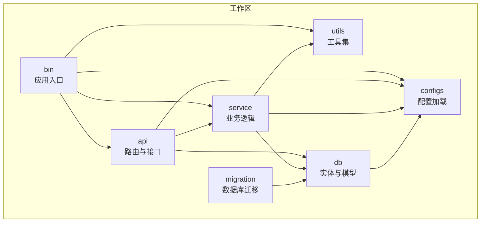
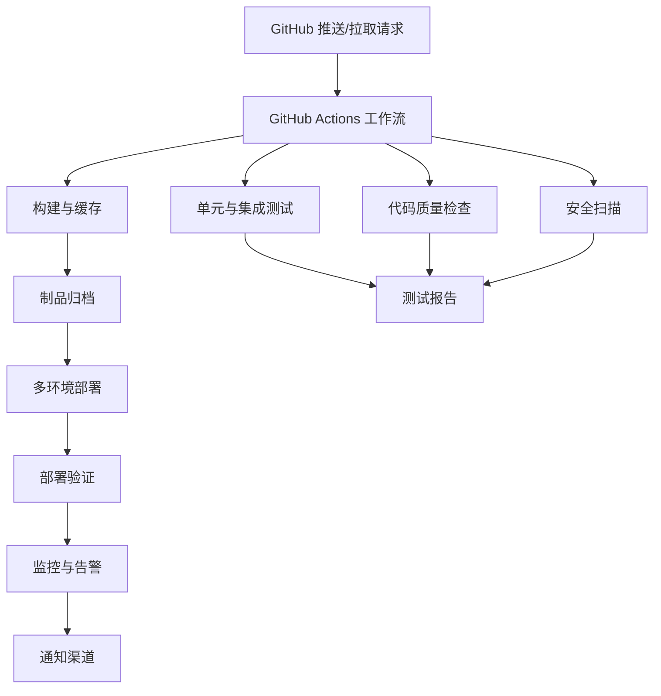
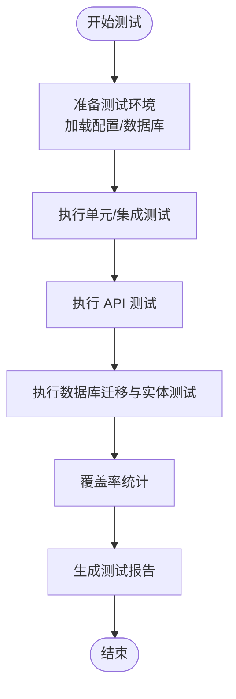
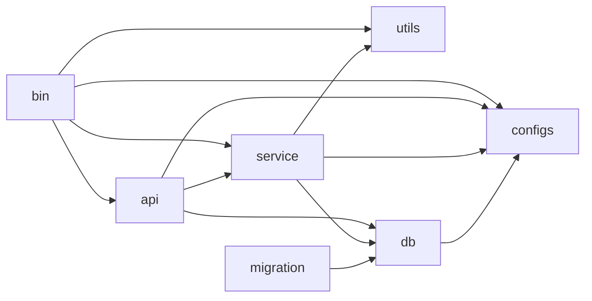

# CI/CD 流水线配置

<cite>
**本文引用的文件**
- [.github/workflows/rust.yml](file://.github/workflows/rust.yml)
- [Cargo.toml](file://Cargo.toml)
- [api/Cargo.toml](file://api/Cargo.toml)
- [bin/Cargo.toml](file://bin/Cargo.toml)
- [service/Cargo.toml](file://service/Cargo.toml)
- [db/Cargo.toml](file://db/Cargo.toml)
- [migration/Cargo.toml](file://migration/Cargo.toml)
- [bin/src/main.rs](file://bin/src/main.rs)
- [api/src/lib.rs](file://api/src/lib.rs)
- [api/src/test/mod.rs](file://api/src/test/mod.rs)
- [db/src/test/mod.rs](file://db/src/test/mod.rs)
- [service/src/test/mod.rs](file://service/src/test/mod.rs)
- [configs/src/lib.rs](file://configs/src/lib.rs)
- [utils/src/my_env.rs](file://utils/src/my_env.rs)
- [config/config.toml.sample](file://config/config.toml.sample)
- [.env.sample](file://.env.sample)
</cite>

## 目录
1. [简介](#简介)
2. [项目结构](#项目结构)
3. [核心组件](#核心组件)
4. [架构总览](#架构总览)
5. [详细组件分析](#详细组件分析)
6. [依赖关系分析](#依赖关系分析)
7. [性能考虑](#性能考虑)
8. [故障排查指南](#故障排查指南)
9. [结论](#结论)
10. [附录](#附录)

## 简介
本指南面向 Axum Admin 项目，提供从零到一的 CI/CD 流水线配置方案，覆盖 GitHub Actions 工作流、自动化构建、测试执行、代码质量与安全扫描、版本发布与回滚、多环境部署、部署验证、监控与通知、故障处理等完整流程。文档以仓库现有结构为基础，结合工作流现状，给出可落地的增强建议与最佳实践。

## 项目结构
Axum Admin 采用 Rust Workspace 组织，包含二进制应用、API 层、服务层、数据库访问层、迁移工具、配置与工具模块等。整体采用模块化设计，便于并行构建与测试。

图表来源
- [Cargo.toml](file://Cargo.toml#L1-L12)
- [bin/Cargo.toml](file://bin/Cargo.toml#L10-L16)
- [api/Cargo.toml](file://api/Cargo.toml#L8-L13)
- [service/Cargo.toml](file://service/Cargo.toml#L9-L13)
- [db/Cargo.toml](file://db/Cargo.toml#L9-L12)
- [migration/Cargo.toml](file://migration/Cargo.toml#L11-L12)

章节来源
- [Cargo.toml](file://Cargo.toml#L1-L12)
- [bin/Cargo.toml](file://bin/Cargo.toml#L1-L26)
- [api/Cargo.toml](file://api/Cargo.toml#L1-L22)
- [service/Cargo.toml](file://service/Cargo.toml#L1-L39)
- [db/Cargo.toml](file://db/Cargo.toml#L1-L25)
- [migration/Cargo.toml](file://migration/Cargo.toml#L1-L16)

## 核心组件
- 应用入口与运行时
  - 二进制应用负责启动服务、加载配置、初始化日志与定时任务，并提供静态资源服务与 API 路由。
- 配置与环境
  - 通过配置文件与环境变量控制服务器地址、SSL、压缩、缓存、日志级别、数据库连接等。
- 模块化依赖
  - API 层依赖服务层与数据库层；服务层聚合配置、数据库与工具模块；二进制应用统一编排。

章节来源
- [bin/src/main.rs](file://bin/src/main.rs#L25-L96)
- [config/config.toml.sample](file://config/config.toml.sample#L2-L50)
- [.env.sample](file://.env.sample#L1-L3)
- [configs/src/lib.rs](file://configs/src/lib.rs#L1-L6)
- [utils/src/my_env.rs](file://utils/src/my_env.rs#L11-L72)

## 架构总览
下图展示 CI/CD 关键节点与交互：触发器、构建与测试、制品与发布、部署与验证、监控与通知。

## 详细组件分析

### GitHub Actions 工作流（现状与增强）
- 现状
  - 仅执行构建步骤，未包含测试、代码质量与安全扫描。
- 增强建议
  - 引入多阶段矩阵：Linux/macOS/Windows，稳定版/夜间版工具链。
  - 并行化测试：单元测试、集成测试、API 测试。
  - 代码质量：clippy、rustfmt、文档注释检查。
  - 安全扫描：cargo-audit、safety、secrets 检测。
  - 制品：二进制产物、Docker 镜像、包管理器制品。
  - 多环境部署：开发/预发/生产分支策略与环境变量注入。
  - 回滚：镜像标签策略、滚动回滚、配置回滚。
  - 验证：健康检查、端到端测试、SLA 指标上报。
  - 通知：Slack/邮件/企业微信机器人。

章节来源
- [.github/workflows/rust.yml](file://.github/workflows/rust.yml#L1-L26)

### 构建与缓存策略
- 使用 stable 工具链，启用 cargo 缓存以加速构建。
- 建议在工作流中增加：
  - Rust 工具链安装与缓存
  - Cargo registry 与 git 依赖缓存
  - 二进制产物缓存（如需跨作业复用）

章节来源
- [.github/workflows/rust.yml](file://.github/workflows/rust.yml#L18-L25)

### 测试策略
- 单元测试
  - 在各模块 Cargo.toml 中启用默认测试目标，确保通过 cargo test。
- 集成测试
  - 通过 API 层暴露的测试路由进行端到端验证。
- 数据库测试
  - 使用 SQLite 或内存数据库进行迁移与实体测试。
- 自动化测试建议
  - 增加 API 测试套件（如使用 axum 的测试客户端）。
  - 对定时任务与缓存行为进行行为测试。

章节来源
- [api/src/test/mod.rs](file://api/src/test/mod.rs#L1-L18)
- [db/src/test/mod.rs](file://db/src/test/mod.rs#L1-L5)
- [service/src/test/mod.rs](file://service/src/test/mod.rs#L1-L2)

### 代码质量与安全
- 代码风格与格式
  - 使用 rustfmt 与 clippy，确保一致性与潜在问题发现。
- 安全审计
  - 使用 cargo-audit 检查依赖漏洞；结合 secrets 扫描避免泄露。
- 文档与注释
  - 强制模块与公共 API 注释，提升可维护性。

章节来源
- [Cargo.toml](file://Cargo.toml#L83-L90)

### 版本发布与回滚
- 版本管理
  - 使用 Git 标签或语义化版本，配合变更日志。
- 发布制品
  - 二进制产物、Docker 镜像、包管理器制品（如适用）。
- 回滚策略
  - 镜像回滚：固定 SHA 或版本标签；配置回滚：配置文件版本化与变更记录。
  - 数据库迁移：保留回滚脚本，必要时执行 down 迁移。

章节来源
- [README.md](file://README.md#L63-L71)

### 多环境部署配置
- 环境隔离
  - 开发：本地或专用集群；预发：独立命名空间；生产：蓝绿/金丝雀。
- 配置注入
  - 通过环境变量与配置文件注入，区分数据库、日志、缓存等参数。
- 静态资源与证书
  - 静态目录与 SSL 证书路径在配置中声明，部署时替换为实际路径。

章节来源
- [config/config.toml.sample](file://config/config.toml.sample#L2-L50)
- [.env.sample](file://.env.sample#L1-L3)

### 部署验证流程
- 健康检查
  - 提供 /health 接口或探针，确保服务可用。
- 功能验证
  - 调用关键 API，校验鉴权、缓存、定时任务等核心能力。
- 性能与容量
  - 基准测试与压力测试，评估并发与延迟。

章节来源
- [bin/src/main.rs](file://bin/src/main.rs#L73-L96)

### 监控、通知与故障处理
- 监控
  - 指标采集（CPU、内存、QPS、P95/P99）、日志聚合、分布式追踪。
- 通知
  - Slack/邮件/企业微信机器人，按严重级别推送。
- 故障处理
  - 快速回滚、熔断降级、自动重启与扩缩容。

## 依赖关系分析
下图展示模块间依赖关系，有助于理解测试与构建的耦合点。

图表来源
- [bin/Cargo.toml](file://bin/Cargo.toml#L10-L16)
- [api/Cargo.toml](file://api/Cargo.toml#L8-L13)
- [service/Cargo.toml](file://service/Cargo.toml#L9-L13)
- [db/Cargo.toml](file://db/Cargo.toml#L9-L12)
- [migration/Cargo.toml](file://migration/Cargo.toml#L11-L12)

章节来源
- [Cargo.toml](file://Cargo.toml#L1-L12)
- [bin/Cargo.toml](file://bin/Cargo.toml#L1-L26)
- [api/Cargo.toml](file://api/Cargo.toml#L1-L22)
- [service/Cargo.toml](file://service/Cargo.toml#L1-L39)
- [db/Cargo.toml](file://db/Cargo.toml#L1-L25)
- [migration/Cargo.toml](file://migration/Cargo.toml#L1-L16)

## 性能考虑
- 构建优化
  - 启用 LTO、减小代码体积、并行化构建。
- 运行时优化
  - 合理的日志级别与格式，避免过度 IO；静态资源与压缩策略。
- 测试优化
  - 并行测试、缓存数据库状态、减少外部依赖。

章节来源
- [Cargo.toml](file://Cargo.toml#L83-L90)
- [bin/src/main.rs](file://bin/src/main.rs#L75-L82)
- [utils/src/my_env.rs](file://utils/src/my_env.rs#L38-L72)

## 故障排查指南
- 构建失败
  - 检查工具链版本与缓存；确认依赖版本兼容。
- 测试失败
  - 查看测试报告与日志；核对数据库连接与迁移状态。
- 部署异常
  - 校验配置文件与环境变量；确认证书与静态资源路径。
- 性能问题
  - 分析日志与指标，定位瓶颈（IO/网络/计算）。

章节来源
- [bin/src/main.rs](file://bin/src/main.rs#L25-L96)
- [config/config.toml.sample](file://config/config.toml.sample#L31-L50)
- [utils/src/my_env.rs](file://utils/src/my_env.rs#L16-L72)

## 结论
通过完善 GitHub Actions 工作流，引入测试、质量与安全检查，建立多环境部署与回滚机制，并配套监控与通知体系，Axum Admin 可实现高效、稳定、可观测的持续交付。建议从现状工作流出发，逐步迭代增强，确保每次变更都经过充分验证与治理。

## 附录
- 关键文件索引
  - 工作流：.github/workflows/rust.yml
  - 工作区：Cargo.toml
  - 子模块：bin/Cargo.toml、api/Cargo.toml、service/Cargo.toml、db/Cargo.toml、migration/Cargo.toml
  - 应用入口：bin/src/main.rs
  - 配置与环境：config/config.toml.sample、.env.sample
  - 日志与运行时：utils/src/my_env.rs、configs/src/lib.rs
  - 测试入口：api/src/test/mod.rs、db/src/test/mod.rs、service/src/test/mod.rs