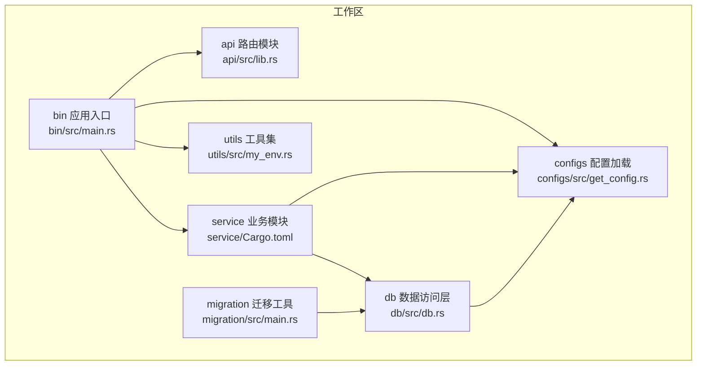
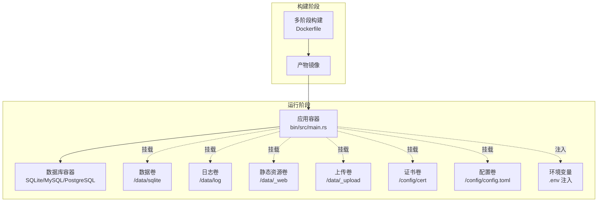
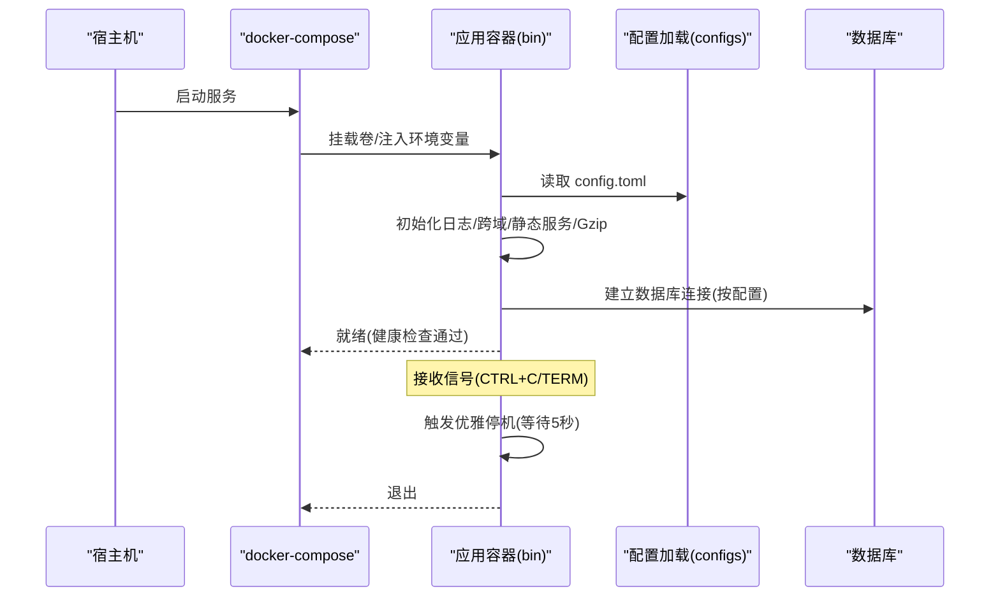
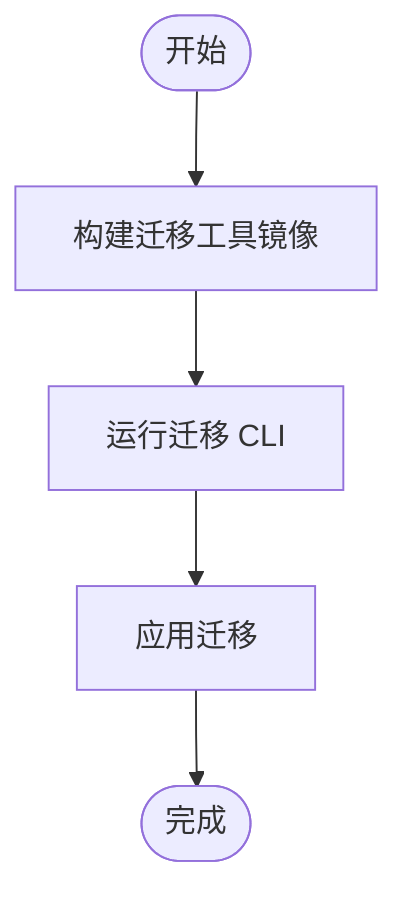
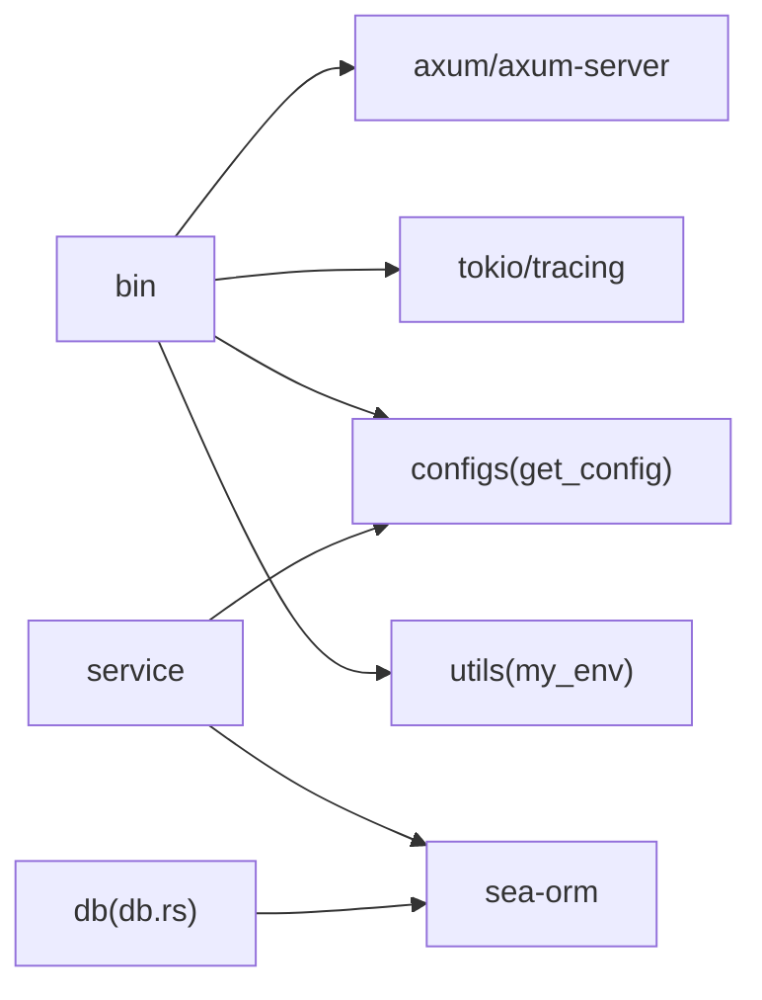

# Docker 容器化部署

<cite>
**本文引用的文件**
- [Cargo.toml](file://Cargo.toml)
- [bin/Cargo.toml](file://bin/Cargo.toml)
- [config/config.toml.sample](file://config/config.toml.sample)
- [.env.sample](file://.env.sample)
- [bin/src/main.rs](file://bin/src/main.rs)
- [configs/src/get_config.rs](file://configs/src/get_config.rs)
- [utils/src/my_env.rs](file://utils/src/my_env.rs)
- [db/src/db.rs](file://db/src/db.rs)
- [migration/src/main.rs](file://migration/src/main.rs)
- [.gitignore](file://.gitignore)
</cite>

## 目录
1. [简介](#简介)
2. [项目结构](#项目结构)
3. [核心组件](#核心组件)
4. [架构总览](#架构总览)
5. [详细组件分析](#详细组件分析)
6. [依赖分析](#依赖分析)
7. [性能考虑](#性能考虑)
8. [故障排查指南](#故障排查指南)
9. [结论](#结论)
10. [附录](#附录)

## 简介
本指南面向 Axum Admin 项目，提供从零开始的 Docker 容器化部署方案，涵盖 Dockerfile 多阶段构建、镜像构建与推送、docker-compose 编排、网络与存储、环境变量与配置注入、服务发现、监控、安全加固与资源限制等。文档以仓库现有配置与代码为依据，确保可落地实施。

## 项目结构
Axum Admin 采用 Rust 工作区（workspace）组织，核心应用位于 bin 子工程，业务与配置分别在 api、service、db、configs、utils 等模块中。运行时依赖配置文件 config/config.toml 与 .env 样例，数据库默认使用 SQLite，支持切换至 MySQL/PostgreSQL。

图表来源
- [bin/src/main.rs](file://bin/src/main.rs#L1-L129)
- [api/src/lib.rs](file://api/src/lib.rs#L1-L10)
- [service/Cargo.toml](file://service/Cargo.toml#L1-L39)
- [db/src/db.rs](file://db/src/db.rs#L1-L20)
- [configs/src/get_config.rs](file://configs/src/get_config.rs#L1-L26)
- [utils/src/my_env.rs](file://utils/src/my_env.rs#L1-L72)
- [migration/src/main.rs](file://migration/src/main.rs#L1-L7)

章节来源
- [Cargo.toml](file://Cargo.toml#L1-L12)
- [bin/Cargo.toml](file://bin/Cargo.toml#L1-L26)
- [config/config.toml.sample](file://config/config.toml.sample#L1-L50)
- [.env.sample](file://.env.sample#L1-L3)

## 核心组件
- 应用入口与运行时
  - 二进制入口负责初始化日志、跨域、静态文件服务、Gzip 压缩、TLS 与优雅停机。
  - 监听地址、API 前缀、SSL、Gzip、缓存策略、日志级别等均来自配置文件。
- 配置系统
  - 通过 toml 文件加载配置，并在启动时读取；日志级别与格式根据配置动态设置。
- 数据库连接
  - 默认使用 SQLite，可通过配置切换为 MySQL/PostgreSQL；连接池参数已内建。
- 迁移工具
  - 提供独立迁移 CLI，便于在容器外或 CI 中执行数据库迁移。

章节来源
- [bin/src/main.rs](file://bin/src/main.rs#L25-L96)
- [configs/src/get_config.rs](file://configs/src/get_config.rs#L1-L26)
- [utils/src/my_env.rs](file://utils/src/my_env.rs#L38-L71)
- [db/src/db.rs](file://db/src/db.rs#L9-L19)
- [migration/src/main.rs](file://migration/src/main.rs#L1-L7)

## 架构总览
下图展示容器化部署的端到端流程：构建阶段产出最小运行镜像，运行阶段通过 docker-compose 组合应用、数据库与可选缓存/代理，挂载持久化目录，注入环境变量与配置文件。

图表来源
- [bin/src/main.rs](file://bin/src/main.rs#L64-L73)
- [config/config.toml.sample](file://config/config.toml.sample#L20-L50)
- [.env.sample](file://.env.sample#L1-L3)
- [.gitignore](file://.gitignore#L1-L19)

## 详细组件分析

### Dockerfile 多阶段构建
目标
- 最小化运行镜像体积，仅包含运行所需的二进制与必要文件。
- 在构建阶段完成 Cargo 依赖缓存与编译，减少重复构建时间。
- 生成可复现的生产镜像。

建议分阶段
- 基础镜像：使用官方 Rust 官方镜像作为构建环境，Alpine 或 DebianSlim 作为最终运行镜像。
- 依赖缓存：将 Cargo.lock 与 Cargo.toml 放置在不同层，最大化缓存命中。
- 构建：启用 release 配置与 LTO 优化；按需启用 SQLite/MySQL/PostgreSQL 特性。
- 运行镜像：仅拷贝编译产物与必要配置/证书/静态资源路径，避免携带构建工具链。

注意
- 由于项目未提供 Dockerfile，此处为通用最佳实践描述；实际构建细节需结合具体镜像与依赖进行调整。

### 镜像构建与推送
- 构建
  - 使用多阶段构建，先在构建镜像中完成 cargo build --release，再复制到精简运行镜像。
  - 将 config/config.toml 与 config/cert/*、data/_web、data/_upload、data/sqlite、data/log 等目录纳入构建或挂载策略。
- 推送
  - 为镜像打上语义化标签（如 v0.1.0），并推送到私有或公有仓库。
  - 在 CI 中自动化构建与推送流程。

### docker-compose 编排
- 服务定义
  - 应用服务：映射端口（默认 3000）、挂载数据卷、注入环境变量 DATABASE_URL。
  - 数据库服务：根据配置选择 SQLite（无需容器）、MySQL 或 PostgreSQL。
  - 可选：缓存服务（如 Skytable）或反向代理（Nginx/Traefik）。
- 网络
  - 自定义桥接网络，确保服务间通过服务名通信。
- 健康检查
  - 对应用添加健康检查，探测 /api 健康端点或本地端口可用性。
- 重启策略
  - 设置适当的 restart 策略，保证异常退出后自动恢复。

### 容器网络与存储
- 网络
  - 使用自定义网络隔离应用与数据库，避免冲突。
- 存储
  - 数据库文件：/data/sqlite（SQLite）或数据库容器数据卷。
  - 日志：/data/log。
  - 静态资源：/data/_web。
  - 上传目录：/data/_upload。
  - 证书：/config/cert。
  - 配置：/config/config.toml。
- 挂载策略
  - 建议将上述目录映射为命名卷或主机目录，便于备份与升级。

### 环境变量与配置注入
- 环境变量
  - DATABASE_URL：用于数据库连接字符串（示例见 .env.sample）。
  - RUST_LOG：日志级别（由配置文件决定，也可通过环境覆盖）。
- 配置文件
  - config/config.toml：监听地址、API 前缀、SSL、Gzip、缓存、日志、JWT、数据库链接等。
  - 启动时会读取该文件，若缺失则直接 panic，因此必须确保容器内存在有效配置。
- 证书
  - 若启用 SSL，需将证书与密钥挂载到 /config/cert 并在配置中指向对应路径。

章节来源
- [.env.sample](file://.env.sample#L1-L3)
- [config/config.toml.sample](file://config/config.toml.sample#L2-L50)
- [configs/src/get_config.rs](file://configs/src/get_config.rs#L7-L25)
- [bin/src/main.rs](file://bin/src/main.rs#L85-L94)

### 服务发现与容器监控
- 服务发现
  - 在同一 docker-compose 网络内，应用通过服务名访问数据库或其他服务。
- 监控
  - 日志：STDOUT/STDERR 与滚动文件日志（/data/log）。
  - 指标：可集成 Prometheus/Grafana（在容器外部署或使用 Sidecar）。
  - 健康检查：对应用与数据库添加健康探针。
- 告警：基于日志与指标建立告警规则。

### 安全加固与资源限制
- 安全
  - 运行用户：非 root 用户运行应用进程。
  - 只读根文件系统：将配置与证书挂载为只读。
  - 最小权限：仅授予必要的文件访问权限。
  - TLS：启用 HTTPS 并使用强密码套件。
- 资源限制
  - CPU/内存限制：在 docker-compose 中设置 limits，避免资源争用。
  - 连接池：根据容器规模调整数据库连接池大小（参考 db.rs 的连接池参数）。
- 配置安全
  - 敏感配置（如 JWT 密钥、数据库密码）通过环境变量或密钥管理服务注入，不在镜像中硬编码。

章节来源
- [db/src/db.rs](file://db/src/db.rs#L10-L15)
- [bin/src/main.rs](file://bin/src/main.rs#L85-L94)

### 关键流程时序

#### 应用启动与优雅停机

图表来源
- [bin/src/main.rs](file://bin/src/main.rs#L25-L96)
- [configs/src/get_config.rs](file://configs/src/get_config.rs#L13-L25)
- [db/src/db.rs](file://db/src/db.rs#L9-L19)

#### 数据库迁移流程

图表来源
- [migration/src/main.rs](file://migration/src/main.rs#L1-L7)

## 依赖分析
- 运行时依赖
  - Tokio 运行时、Axum 服务器、TLS（rustls）、日志（tracing）等。
- 数据库依赖
  - SeaORM 作为 ORM，支持 MySQL/PostgreSQL/SQLite，连接池参数已在代码中设定。
- 配置与环境
  - toml 解析配置文件；my_env 根据配置动态设置日志级别与格式。

图表来源
- [bin/Cargo.toml](file://bin/Cargo.toml#L10-L26)
- [Cargo.toml](file://Cargo.toml#L24-L82)
- [service/Cargo.toml](file://service/Cargo.toml#L9-L32)
- [db/Cargo.toml](file://db/Cargo.toml#L9-L25)

章节来源
- [Cargo.toml](file://Cargo.toml#L24-L82)
- [bin/Cargo.toml](file://bin/Cargo.toml#L10-L26)
- [service/Cargo.toml](file://service/Cargo.toml#L9-L32)
- [db/Cargo.toml](file://db/Cargo.toml#L9-L25)

## 性能考虑
- 构建优化
  - 启用 LTO 与 z 优化等级（release 配置），减小二进制体积。
  - 多阶段构建，分离依赖缓存与运行时层。
- 运行优化
  - Gzip 压缩开启时排除 SSE 类型，避免事件流被错误压缩。
  - 合理设置数据库连接池上限与超时，避免并发过高导致阻塞。
  - 静态资源由应用内置 ServeDir 提供，建议在反向代理层缓存与压缩。
- 资源限制
  - 为容器设置 CPU/内存上限，防止突发流量导致 OOM。

章节来源
- [Cargo.toml](file://Cargo.toml#L83-L90)
- [bin/src/main.rs](file://bin/src/main.rs#L75-L82)
- [db/src/db.rs](file://db/src/db.rs#L10-L15)

## 故障排查指南
- 启动失败（配置缺失）
  - 症状：启动即 panic，提示配置文件不存在或解析失败。
  - 处理：确认 /config/config.toml 是否正确挂载，字段完整。
- 数据库连接失败
  - 症状：日志显示数据库打开失败或连接超时。
  - 处理：核对 DATABASE_URL 与服务网络连通性；若使用外部数据库，请确保端口开放与凭据正确。
- SSL 启用但证书无效
  - 症状：HTTPS 无法访问。
  - 处理：确认 /config/cert 下的证书与密钥文件存在且路径与 config.toml 一致。
- 优雅停机
  - 症状：容器停止时未及时释放资源。
  - 处理：确保接收信号后触发 graceful_shutdown，容器生命周期管理遵循 SIGTERM/SIGINT。

章节来源
- [configs/src/get_config.rs](file://configs/src/get_config.rs#L14-L23)
- [db/src/db.rs](file://db/src/db.rs#L16-L19)
- [bin/src/main.rs](file://bin/src/main.rs#L85-L94)
- [bin/src/main.rs](file://bin/src/main.rs#L102-L128)

## 结论
通过多阶段构建与合理的 docker-compose 编排，Axum Admin 可实现快速、稳定、可扩展的容器化部署。配合资源限制、安全加固与监控体系，可在生产环境中保持高可用与高性能。

## 附录

### 部署清单
- Dockerfile（多阶段构建）
- docker-compose.yml（服务、网络、卷、环境变量）
- config/config.toml（监听地址、API 前缀、SSL、Gzip、缓存、日志、JWT、数据库）
- .env（DATABASE_URL 等）
- 证书目录（/config/cert）

### 快速检查表
- [ ] 配置文件与证书已挂载
- [ ] 数据卷已创建并授权
- [ ] 环境变量 DATABASE_URL 正确
- [ ] 健康检查与重启策略已配置
- [ ] 资源限制与安全策略已启用
- [ ] 日志与监控已就绪