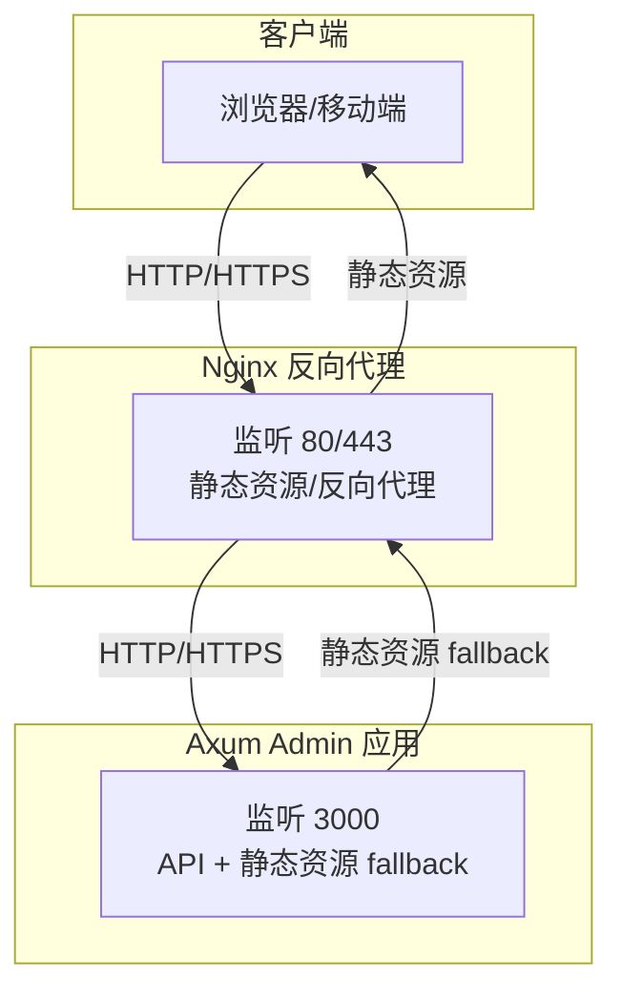
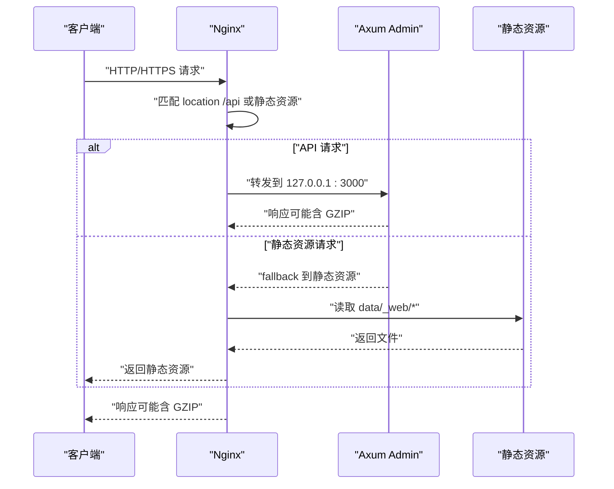
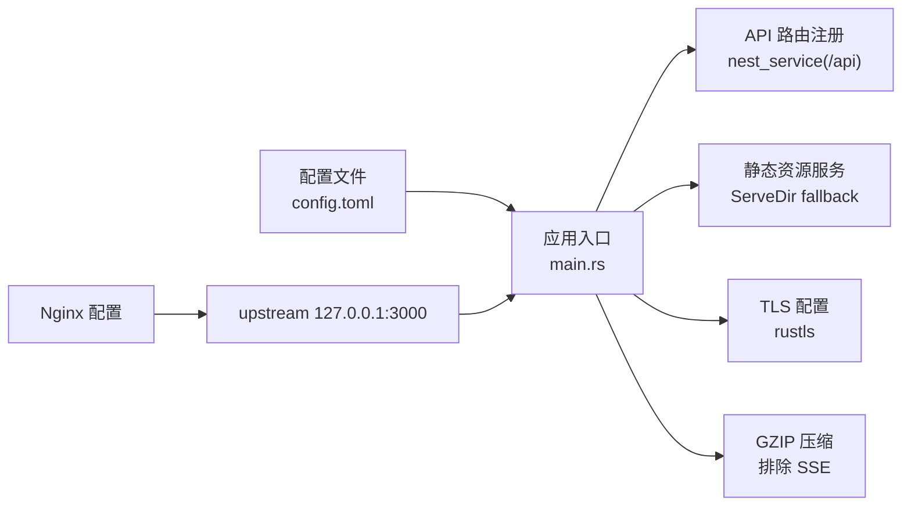

# Nginx 反向代理配置

<cite>
**本文引用的文件**
- [Cargo.toml](file://Cargo.toml)
- [README.md](file://README.md)
- [config/config.toml.sample](file://config/config.toml.sample)
- [bin/src/main.rs](file://bin/src/main.rs)
- [configs/src/lib.rs](file://configs/src/lib.rs)
- [configs/src/get_config.rs](file://configs/src/get_config.rs)
- [configs/src/cfgs.rs](file://configs/src/cfgs.rs)
- [api/src/system/common.rs](file://api/src/system/common.rs)
- [data/_web/index.html](file://data/_web/index.html)
</cite>

## 目录
1. [简介](#简介)
2. [项目结构](#项目结构)
3. [核心组件](#核心组件)
4. [架构总览](#架构总览)
5. [详细组件分析](#详细组件分析)
6. [依赖关系分析](#依赖关系分析)
7. [性能考虑](#性能考虑)
8. [故障排查指南](#故障排查指南)
9. [结论](#结论)
10. [附录](#附录)

## 简介
本指南面向在生产环境中部署 Axum Admin 的运维与开发人员，提供基于 Nginx 的完整反向代理配置方案。内容涵盖服务器块配置、静态资源服务、WebSocket 支持、GZIP 压缩、SSL/TLS 终止、HTTP/2、CORS 与安全头部、负载均衡与健康检查、超时参数调优、常见错误与调试方法，以及性能优化建议。

Axum Admin 后端基于 Axum 框架，内置 GZIP 压缩与 CORS 支持，并通过配置文件控制监听地址、API 前缀、静态资源目录与 TLS 证书路径。前端静态资源位于 data/_web 目录，入口页面为 index.html。

## 项目结构
- 后端服务运行于本地端口（默认 3000），可通过配置文件调整监听地址与 API 前缀。
- 前端静态资源目录为 data/_web，Nginx 需要直接服务该目录或通过反代转发至后端。
- 后端支持 TLS（rustls）与 GZIP 压缩，但 SSE（Server-Sent Events）流需排除在压缩之外。

图表来源
- [bin/src/main.rs](file://bin/src/main.rs#L84-L95)
- [config/config.toml.sample](file://config/config.toml.sample#L2-L16)
- [data/_web/index.html](file://data/_web/index.html#L1-L1)

章节来源
- [config/config.toml.sample](file://config/config.toml.sample#L2-L16)
- [bin/src/main.rs](file://bin/src/main.rs#L84-L95)

## 核心组件
- 监听与协议
  - 后端默认监听地址可在配置文件中设置，默认为 0.0.0.0:3000。
  - 支持启用 TLS（rustls），证书与私钥路径在配置文件中指定。
  - 后端内置 GZIP 压缩，但对 SSE 流类型 text/event-stream 排除压缩。
- 静态资源
  - 静态资源根目录与索引页在配置文件中定义，后端通过 ServeDir 提供 fallback。
- API 前缀
  - 所有 API 路由通过 nest_service 绑定到配置文件中的 api_prefix（默认 /api）。
- WebSocket 与 SSE
  - 后端提供 SSE 接口，需确保 Nginx 不对 text/event-stream 类型进行压缩。
  - WebSocket 通常无需特殊处理，但需确认上游连接超时与代理缓冲设置。

章节来源
- [config/config.toml.sample](file://config/config.toml.sample#L2-L16)
- [bin/src/main.rs](file://bin/src/main.rs#L73-L83)
- [api/src/system/common.rs](file://api/src/system/common.rs#L24-L33)

## 架构总览
下图展示 Nginx 作为反向代理如何将请求分发到 Axum Admin 后端，并处理静态资源与 API 前缀映射。

图表来源
- [bin/src/main.rs](file://bin/src/main.rs#L73-L73)
- [config/config.toml.sample](file://config/config.toml.sample#L16-L24)

## 详细组件分析

### 服务器块与监听配置
- 监听地址
  - 后端监听地址由配置文件决定，默认 0.0.0.0:3000。
  - Nginx upstream 指向 127.0.0.1:3000。
- 端口规划
  - Nginx 监听 80/443，内部转发至后端 3000 端口。
- 主机名与域名
  - 在 server_name 中配置站点域名，便于多站点共存与证书绑定。

章节来源
- [config/config.toml.sample](file://config/config.toml.sample#L6-L6)
- [bin/src/main.rs](file://bin/src/main.rs#L84-L84)

### 静态资源服务
- 静态目录
  - 后端 ServeDir 指向 data/_web，Nginx 可直接服务该目录以减少回源。
- 索引页
  - index.html 作为 SPA 入口，Nginx 需正确处理前端路由回退。
- fallback 行为
  - 当 API 匹配失败时，后端返回静态资源 fallback，确保前端路由正常工作。

章节来源
- [config/config.toml.sample](file://config/config.toml.sample#L21-L22)
- [bin/src/main.rs](file://bin/src/main.rs#L64-L68)
- [data/_web/index.html](file://data/_web/index.html#L1-L1)

### WebSocket 支持
- WebSocket 代理
  - Nginx 需设置升级头与较长超时，确保 ws/wss 正常工作。
- 注意事项
  - 保持与后端相同的协议（ws/http 或 wss/https）。
  - 如后端启用 SSE，请勿对 text/event-stream 进行压缩。

章节来源
- [api/src/system/common.rs](file://api/src/system/common.rs#L24-L33)
- [bin/src/main.rs](file://bin/src/main.rs#L78-L78)

### GZIP 压缩配置
- 后端压缩策略
  - 默认开启 GZIP，但对 text/event-stream 排除压缩。
- Nginx 建议
  - 启用 gzip 并排除 SSE 内容类型，避免流式数据被错误压缩。
  - 合理设置 gzip_types 与 gzip_vary。

章节来源
- [bin/src/main.rs](file://bin/src/main.rs#L75-L82)

### SSL/TLS 终止与 HTTP/2
- TLS 终止
  - Nginx 使用证书与私钥文件终止 TLS，向上游转发明文 HTTP。
- HTTP/2
  - 在 listen 指令中启用 http2，提升传输效率。
- 证书路径
  - 证书与私钥路径需与实际文件一致。

章节来源
- [config/config.toml.sample](file://config/config.toml.sample#L25-L27)
- [bin/src/main.rs](file://bin/src/main.rs#L85-L90)

### CORS 与安全头部
- CORS
  - 后端已启用宽松 CORS（允许任意 Origin/Headers/Methods），生产环境建议限制来源与方法。
- 安全头部
  - 建议在 Nginx 层添加安全头部（如 X-Frame-Options、X-Content-Type-Options、Referrer-Policy、Permissions-Policy 等）。
  - HSTS（严格传输安全）可按需启用并配合长期有效证书。

章节来源
- [bin/src/main.rs](file://bin/src/main.rs#L59-L62)

### API 前缀与路由映射
- API 前缀
  - 后端通过 api_prefix（默认 /api）挂载所有 API 路由。
- Nginx 映射
  - 将 /api* 转发至后端 3000 端口，确保路径前缀一致。

章节来源
- [config/config.toml.sample](file://config/config.toml.sample#L16-L16)
- [bin/src/main.rs](file://bin/src/main.rs#L73-L73)

### 负载均衡与健康检查
- 负载均衡
  - upstream 池中添加多个后端实例（如 127.0.0.1:3000），Nginx 轮询或使用 ip_hash 等策略。
- 健康检查
  - 使用 nginx_upstream_check_module 或外部探针定期探测 /api/health（需后端提供）。
  - 结合 fail_timeout 与 max_fails 实现自动摘除与恢复。

章节来源
- [bin/src/main.rs](file://bin/src/main.rs#L84-L95)

### 超时参数调优
- 关键超时
  - proxy_connect_timeout、proxy_send_timeout、proxy_read_timeout：建议与后端 graceful shutdown 时间协调。
  - send_timeout、client_body_timeout：根据上传与请求大小调整。
- WebSocket
  - proxy_set_header Upgrade $http_upgrade; proxy_set_header Connection "upgrade"; 并延长超时。
- 缓冲区
  - proxy_buffering、proxy_buffer_size、proxy_buffers：根据响应大小与并发量调优。

章节来源
- [bin/src/main.rs](file://bin/src/main.rs#L124-L127)

### 常见配置错误与调试
- 错误类型
  - 静态资源 404：检查 data/_web 目录与 ServeDir fallback 是否生效。
  - CORS 失败：后端允许任意来源，若前端跨域仍失败，检查 Nginx 层是否覆盖了必要头。
  - SSE 无数据：确认未对 text/event-stream 启用压缩。
  - TLS 握手失败：核对证书链与私钥权限。
- 调试方法
  - 查看 Nginx 访问/错误日志。
  - 使用 curl -I/--head 验证响应头与状态码。
  - 使用浏览器开发者工具 Network 面板观察请求与响应头。
  - 后端日志级别按需提升，定位业务异常。

章节来源
- [bin/src/main.rs](file://bin/src/main.rs#L98-L100)

## 依赖关系分析
- 配置加载
  - 应用启动时从 config/config.toml 读取配置，包括监听地址、API 前缀、静态资源目录、TLS 证书路径等。
- 组件耦合
  - 服务器块（Nginx）与后端（Axum）通过 API 前缀与静态资源 fallback 解耦。
  - 压缩与 CORS 由后端层处理，Nginx 可叠加安全头部与 TLS 终止。

图表来源
- [configs/src/get_config.rs](file://configs/src/get_config.rs#L7-L10)
- [configs/src/cfgs.rs](file://configs/src/cfgs.rs#L24-L42)
- [bin/src/main.rs](file://bin/src/main.rs#L73-L83)

章节来源
- [configs/src/lib.rs](file://configs/src/lib.rs#L1-L6)
- [configs/src/get_config.rs](file://configs/src/get_config.rs#L1-L26)
- [configs/src/cfgs.rs](file://configs/src/cfgs.rs#L1-L62)
- [bin/src/main.rs](file://bin/src/main.rs#L73-L95)

## 性能考虑
- 压缩策略
  - 启用 GZIP，排除 SSE；合理设置 gzip_types 与压缩级别。
- 缓冲与超时
  - 根据响应大小与并发，调整 proxy_buffering、proxy_buffer_size、proxy_buffers。
  - 调整超时参数，避免长连接占用资源。
- 静态资源
  - Nginx 直接服务静态资源可显著降低后端压力；SPA 路由回退需正确配置 fallback。
- TLS 与 HTTP/2
  - 启用 http2 与会话复用，减少握手开销。
- 日志与监控
  - 控制访问日志级别，避免磁盘 IO 抖动；结合上游健康检查与告警。

## 故障排查指南
- 常见症状与定位
  - 页面空白或路由异常：检查 API 前缀与 fallback 静态资源。
  - 图片/样式 404：确认 data/_web 目录权限与 Nginx root/alias 设置。
  - SSE 无事件：确认未对 text/event-stream 启用压缩。
  - WebSocket 断连：检查 upgrade 头与超时设置。
- 日志与工具
  - Nginx access/error 日志。
  - curl -I/--head 验证响应头。
  - 浏览器 Network 面板查看请求与响应头。
  - 后端日志级别临时提升以捕获异常。

章节来源
- [bin/src/main.rs](file://bin/src/main.rs#L98-L100)

## 结论
通过 Nginx 作为反向代理，Axum Admin 可获得稳定的 TLS 终止、高效的静态资源服务、灵活的 API 前缀映射与良好的 WebSocket/SSE 支持。结合合理的超时与缓冲参数、安全头部与 CORS 策略，可在生产环境中实现高可用与高性能的交付。

## 附录

### Nginx 示例片段（路径参考）
- 监听与 TLS
  - listen 443 ssl http2; ssl_certificate; ssl_certificate_key; ssl_protocols TLSv1.2 TLSv1.3;
- 上游与反代
  - upstream backend { server 127.0.0.1:3000; }
  - location /api/ { proxy_pass http://backend/; }
- 静态资源
  - location / { alias /path/to/data/_web/; try_files $uri $uri/ /index.html; }
- GZIP 与 SSE
  - gzip on; gzip_types *; gzip_disable "MSIE [1-6]\.";
  - 对 SSE：在对应 location 中禁用 gzip 或排除 text/event-stream。
- WebSocket
  - proxy_set_header Upgrade $http_upgrade; proxy_set_header Connection "upgrade";
- 超时
  - proxy_connect_timeout 10s; proxy_send_timeout 10s; proxy_read_timeout 60s; send_timeout 10s;

### 配置文件与代码映射
- 监听地址与 API 前缀
  - 配置文件：server.address、server.api_prefix
  - 应用入口：parse 地址、nest_service(api_prefix)
- 静态资源目录
  - 配置文件：web.dir、web.index
  - 应用入口：ServeDir fallback
- TLS 证书
  - 配置文件：cert.cert、cert.key
  - 应用入口：RustlsConfig.from_pem_file

章节来源
- [config/config.toml.sample](file://config/config.toml.sample#L2-L16)
- [bin/src/main.rs](file://bin/src/main.rs#L84-L90)
- [configs/src/get_config.rs](file://configs/src/get_config.rs#L7-L10)
- [configs/src/cfgs.rs](file://configs/src/cfgs.rs#L24-L42)