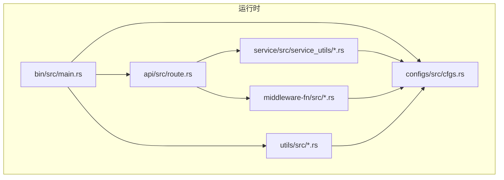
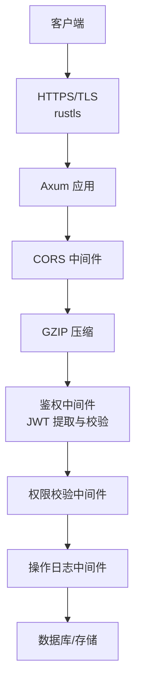
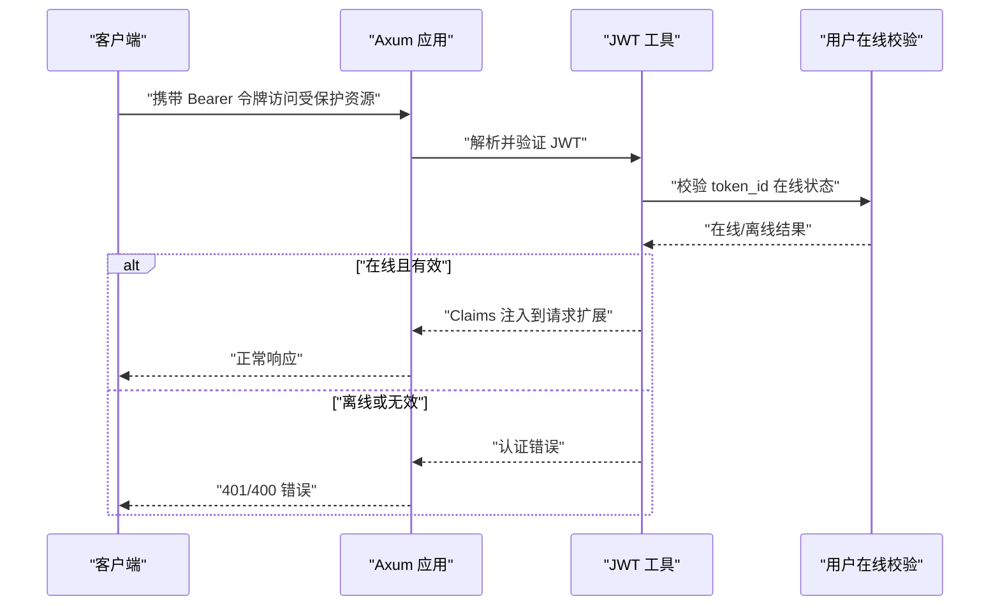
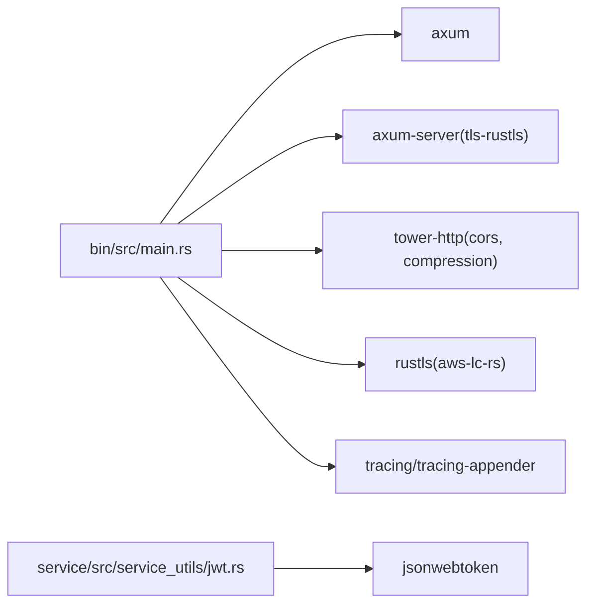

# 安全加固配置

<cite>
**本文引用的文件**
- [config.toml.sample](file://config/config.toml.sample)
- [cfgs.rs](file://configs/src/cfgs.rs)
- [jwt.rs](file://service/src/service_utils/jwt.rs)
- [auth.rs](file://middleware-fn/src/auth.rs)
- [main.rs](file://bin/src/main.rs)
- [cert.rs](file://utils/src/cert.rs)
- [route.rs](file://api/src/route.rs)
- [Cargo.toml](file://Cargo.toml)
- [.env.sample](file://.env.sample)
- [my_env.rs](file://utils/src/my_env.rs)
</cite>

## 目录
1. [简介](#简介)
2. [项目结构](#项目结构)
3. [核心组件](#核心组件)
4. [架构总览](#架构总览)
5. [详细组件分析](#详细组件分析)
6. [依赖关系分析](#依赖关系分析)
7. [性能考量](#性能考量)
8. [故障排查指南](#故障排查指南)
9. [结论](#结论)
10. [附录](#附录)

## 简介
本指南面向 Axum Admin 的生产部署，聚焦于安全加固配置，涵盖 HTTPS/TLS、HSTS、CORS、JWT 安全、会话与 CSRF、XSS 防护、WAF 与 DDoS 防护、IP 白名单与访问频率限制、以及安全审计与合规建议。文档基于仓库现有实现与配置文件进行分析，并提供可落地的加固步骤与最佳实践。

## 项目结构
Axum Admin 采用多工作区（workspace）组织，关键模块包括：
- 配置加载与模型：configs
- 业务服务与工具：service、utils
- 中间件：middleware-fn
- API 路由：api
- 可执行入口：bin
- 数据库与迁移：db、migration
- 配置样例：config

图表来源
- [main.rs](file://bin/src/main.rs#L1-L100)
- [route.rs](file://api/src/route.rs#L32-L68)
- [cfgs.rs](file://configs/src/cfgs.rs#L1-L111)

章节来源
- [main.rs](file://bin/src/main.rs#L1-L100)
- [route.rs](file://api/src/route.rs#L32-L68)
- [cfgs.rs](file://configs/src/cfgs.rs#L1-L111)

## 核心组件
- 配置模型与加载：通过配置结构体定义 server、web、cert、system、database、jwt、log、skytable 等字段，运行时从配置文件加载并注入各模块。
- 认证与授权：JWT 令牌签发与校验、基于提取器的 Claims 注入、API 权限校验中间件。
- TLS 与 HTTPS：支持 rustls 配置，按配置启用 HTTPS 并加载证书与私钥。
- CORS：使用 tower-http 的 CORS 中间件，当前默认允许跨域（开发友好，生产需收紧）。
- 压缩：GZIP 压缩层，排除特定流式类型。
- 审计日志：可选的操作日志中间件，支持落盘与数据库持久化。

章节来源
- [cfgs.rs](file://configs/src/cfgs.rs#L1-L111)
- [jwt.rs](file://service/src/service_utils/jwt.rs#L1-L164)
- [auth.rs](file://middleware-fn/src/auth.rs#L1-L25)
- [main.rs](file://bin/src/main.rs#L71-L100)
- [route.rs](file://api/src/route.rs#L32-L68)

## 架构总览
下图展示生产环境中的安全相关组件交互与控制流。

图表来源
- [main.rs](file://bin/src/main.rs#L71-L100)
- [route.rs](file://api/src/route.rs#L32-L68)
- [jwt.rs](file://service/src/service_utils/jwt.rs#L54-L94)
- [auth.rs](file://middleware-fn/src/auth.rs#L6-L24)

## 详细组件分析

### HTTPS 与 TLS 配置
- 启用条件：server.ssl 控制是否启用 HTTPS。
- 证书加载：当 ssl=true 时，从配置的 cert.cert 与 cert.key 路径加载 PEM 文件。
- TLS 实现：使用 axum-server 的 tls-rustls 绑定，底层依赖 rustls。
- 推荐实践：
  - 使用强密码学套件与现代 TLS 版本（见“依赖关系分析”中的 rustls 特性）。
  - 仅暴露必要的 ALPN 协商（如 http/1.1、h2）。
  - 强制 HSTS（见后续 HSTS 章节）。
  - 证书链完整、私钥权限最小化（仅应用进程可读）。

章节来源
- [config.toml.sample](file://config/config.toml.sample#L7-L27)
- [cfgs.rs](file://configs/src/cfgs.rs#L24-L64)
- [cert.rs](file://utils/src/cert.rs#L1-L27)
- [main.rs](file://bin/src/main.rs#L85-L94)

### TLS 版本与加密套件选择
- 依赖特性：工程 Cargo.toml 显式启用 rustls 的 aws-lc-rs 特性，以获得更强的默认密码学提供程序。
- 建议：
  - 优先使用 TLS 1.3；禁用 TLS 1.0/1.1。
  - 选择前向保密（PFS）套件，避免静态 RSA。
  - 禁用弱 MAC（如 MD5、SHA1）与弱分组密码。
  - 结合反向代理（如 Nginx/Traefik）统一管理 TLS 参数，便于集中更新。

章节来源
- [Cargo.toml](file://Cargo.toml#L32-L32)

### HSTS 头设置
- 当前实现：未在代码中显式设置 Strict-Transport-Security 头。
- 生产建议：
  - 在反向代理或边缘网关统一注入 HSTS 头，避免浏览器首访降级风险。
  - 启用 includeSubDomains 与 preload（如适用）。
  - 配置合适的 max-age（建议至少 30 天以上）。

章节来源
- [main.rs](file://bin/src/main.rs#L71-L100)

### CORS 策略配置
- 当前实现：应用层已引入 CORS 中间件，但未对允许源、方法、头等进行显式限制。
- 生产建议：
  - 严格限定 AllowedOrigins（建议白名单域名）。
  - 明确 AllowedMethods（GET/POST/PUT/DELETE 等）。
  - 限定 AllowedHeaders（如 application/json），避免通配符。
  - 如非必要，关闭 AllowCredentials 或明确指定 Credentials。
  - 预检缓存时间（MaxAge）按需设置。

章节来源
- [main.rs](file://bin/src/main.rs#L15-L19)
- [route.rs](file://api/src/route.rs#L32-L68)

### JWT 安全配置
- 密钥与签名：使用 secret 进行 HS256 签发与解码，密钥长度与随机性需满足安全要求。
- 过期策略：jwt_exp 控制过期分钟数，默认较长（10 天），建议缩短并结合刷新机制。
- 令牌绑定：服务端对 token_id 进行在线状态校验，防止登出后继续使用。
- 建议：
  - 使用足够强度的随机密钥（≥ 256 位）并定期轮换。
  - 引入刷新令牌（refresh token）与短期访问令牌（access token）分离。
  - 令牌撤销列表（blacklist）或短期有效期内的在线检查。
  - 传输层强制 HTTPS，避免明文泄露。

图表来源
- [jwt.rs](file://service/src/service_utils/jwt.rs#L54-L94)
- [jwt.rs](file://service/src/service_utils/jwt.rs#L105-L121)

章节来源
- [config.toml.sample](file://config/config.toml.sample#L41-L44)
- [cfgs.rs](file://configs/src/cfgs.rs#L74-L81)
- [jwt.rs](file://service/src/service_utils/jwt.rs#L1-L164)

### 会话管理与 CSRF 保护
- 会话模型：当前采用无状态 JWT，未使用服务端会话存储。
- CSRF 风险：无服务端会话意味着缺少原生 CSRF 令牌，需在应用层补充。
- 建议：
  - 对关键写操作引入一次性 CSRF 令牌（同源请求头或隐藏字段）。
  - 严格 SameSite Cookie 策略（推荐 Strict/Lax），并配合 Secure+HttpOnly。
  - 限制允许来源与方法，避免跨站请求滥用。
  - 对敏感接口增加二次确认（如短信/邮件验证码）。

章节来源
- [jwt.rs](file://service/src/service_utils/jwt.rs#L1-L164)
- [main.rs](file://bin/src/main.rs#L15-L19)

### XSS 防护措施
- 内容安全策略（CSP）：当前未在代码中显式设置 CSP 头。
- 建议：
  - 在反向代理或边缘网关注入严格的 CSP 头，限制脚本来源与内联脚本。
  - 启用 X-Content-Type-Options: nosniff。
  - 启用 X-Frame-Options: DENY 或 CSP frame-ancestors。
  - 对用户输入进行严格的转义与白名单过滤。

章节来源
- [main.rs](file://bin/src/main.rs#L71-L100)

### WAF 配置建议
- 建议在反向代理层集成 WAF（如 ModSecurity、Cloudflare、AWS WAF），规则覆盖：
  - SQL 注入（SQLi）
  - 跨站脚本（XSS）
  - 不良请求模式（扫描器、暴力破解）
  - 文件包含与命令注入
- 动态规则与机器学习检测可进一步提升防护效果。

[本节为通用建议，无需代码来源]

### DDoS 防护
- 建议：
  - 使用 CDN/反向代理的 DDoS 防护能力（限速、黑白名单、源 IP 校验）。
  - 配置连接数与 QPS 限制，结合速率限制中间件。
  - 启用 TCP/UDP 层抗 DDoS 设备或云厂商防护。
  - 对健康检查与公开 API 设置更严格的访问策略。

[本节为通用建议，无需代码来源]

### IP 白名单与访问频率限制
- IP 白名单：在反向代理或防火墙层维护可信来源 IP 列表。
- 访问频率限制：结合限流中间件或网关限流策略，区分不同接口的配额。
- 建议：
  - 对登录/鉴权接口设置更严的限流阈值。
  - 使用分布式限流（Redis/外部存储）保证多实例一致性。

[本节为通用建议，无需代码来源]

### 安全审计与合规
- 审计范围：
  - 操作日志：可选开启，支持落盘与数据库持久化。
  - 登录日志：可结合登录接口记录用户行为。
  - 审计指标：请求耗时、错误率、异常 IP/UA。
- 合规建议：
  - 数据最小化与保留期限。
  - 敏感日志脱敏与加密存储。
  - 定期审计与渗透测试报告归档。

章节来源
- [config.toml.sample](file://config/config.toml.sample#L31-L37)
- [cfgs.rs](file://configs/src/cfgs.rs#L83-L94)
- [oper_log.rs](file://middleware-fn/src/oper_log.rs#L56-L103)

## 依赖关系分析
- 关键依赖与特性：
  - axum、axum-server、tower-http：提供路由、中间件、TLS、CORS、压缩等能力。
  - rustls（aws-lc-rs）：提供现代密码学与 TLS 支持。
  - jsonwebtoken：用于 JWT 签发与校验。
  - tracing/tracing-appender：日志框架与滚动日志。

图表来源
- [Cargo.toml](file://Cargo.toml#L24-L62)
- [main.rs](file://bin/src/main.rs#L1-L100)
- [jwt.rs](file://service/src/service_utils/jwt.rs#L1-L17)

章节来源
- [Cargo.toml](file://Cargo.toml#L24-L62)

## 性能考量
- 压缩策略：GZIP 压缩对静态资源与 JSON 响应有明显收益，但需排除 SSE/流式响应。
- 缓存策略：内存缓存与 SkyTable 缓存可降低数据库压力，需注意缓存失效与一致性。
- TLS 握手成本：启用硬件加速（如 aws-lc-rs）与会话复用可降低延迟。
- 日志开销：生产建议使用异步日志与滚动策略，避免阻塞请求处理。

章节来源
- [main.rs](file://bin/src/main.rs#L75-L82)
- [cfgs.rs](file://configs/src/cfgs.rs#L24-L42)
- [cache.rs](file://middleware-fn/src/cache.rs#L125-L193)

## 故障排查指南
- HTTPS 启用失败
  - 检查证书与私钥路径与权限。
  - 确认 ssl=true 且 cert.cert/cert.key 配置正确。
- JWT 校验失败
  - 检查 jwt_secret 是否一致且未被修改。
  - 确认 jwt_exp 合理，避免过期导致频繁刷新。
  - 核对 token_id 在线状态，确保未被强制下线。
- CORS 跨域问题
  - 确认 AllowedOrigins、AllowedMethods、AllowedHeaders 配置与前端一致。
  - 检查预检请求是否被正确放行。
- 审计日志未记录
  - 检查 enable_oper_log 开关与日志级别。
  - 确认数据库连接与表结构存在。

章节来源
- [config.toml.sample](file://config/config.toml.sample#L7-L27)
- [cfgs.rs](file://configs/src/cfgs.rs#L74-L94)
- [jwt.rs](file://service/src/service_utils/jwt.rs#L54-L94)
- [oper_log.rs](file://middleware-fn/src/oper_log.rs#L56-L103)

## 结论
Axum Admin 已具备基础的安全能力（HTTPS、JWT、CORS、压缩、审计）。生产部署建议围绕以下要点强化：
- 明确 TLS 版本与套件、强制 HSTS；
- 收紧 CORS 策略、补充 CSRF 与 XSS 保护；
- 强化 JWT 密钥管理与过期策略；
- 引入 WAF/DDoS 防护与访问频率限制；
- 规范安全审计与合规流程。

[本节为总结，无需代码来源]

## 附录

### 配置项清单（与安全相关）
- server.ssl：是否启用 HTTPS
- cert.cert/key：证书与私钥路径
- server.content_gzip：是否启用 GZIP
- server.api_prefix：API 前缀
- jwt.jwt_secret：JWT 密钥
- jwt.jwt_exp：JWT 过期时间（分钟）
- log.enable_oper_log：是否启用操作日志
- log.log_level/dir/file：日志级别与输出位置

章节来源
- [config.toml.sample](file://config/config.toml.sample#L2-L50)
- [cfgs.rs](file://configs/src/cfgs.rs#L24-L94)